# 操作系统

> 参考哔哩哔哩的课程：<https://www.bilibili.com/video/BV1YB4y1i7xe/?spm_id_from=333.337.search-card.all.click&vd_source=731595967596af37618c926a191e7811>
>
> 参考了博客：<https://lfool.gitbook.io/operating-system/untitled-1/2.-cao-zuo-xi-tong-de-si-ge-te-zheng>
>
> 参考了大纲：<https://mubu.com/doc/d9TGd1--LY#m>
>
> 参考了图解系统：<https://xiaolincoding.com/os/1_hardware/how_cpu_run.html#%E5%9B%BE%E7%81%B5%E6%9C%BA%E7%9A%84%E5%B7%A5%E4%BD%9C%E6%96%B9%E5%BC%8F>
>
> 参考了视频：<https://www.bilibili.com/video/BV19r4y1b7Aw/?spm_id_from=333.337.search-card.all.click&vd_source=731595967596af37618c926a191e7811>

## 第一章 操作系统概述

### 操作系统的基本概念

操作系统是资源管理程序，其作用是控制管理计算机系统的资源和程序的指向。操作系统是计算机中最基础的软件，其作用简单来讲：

- 通过资源管理，提高计算机系统的**效率**

- 改善界面，为用户提供友好的工作环境（方便性）

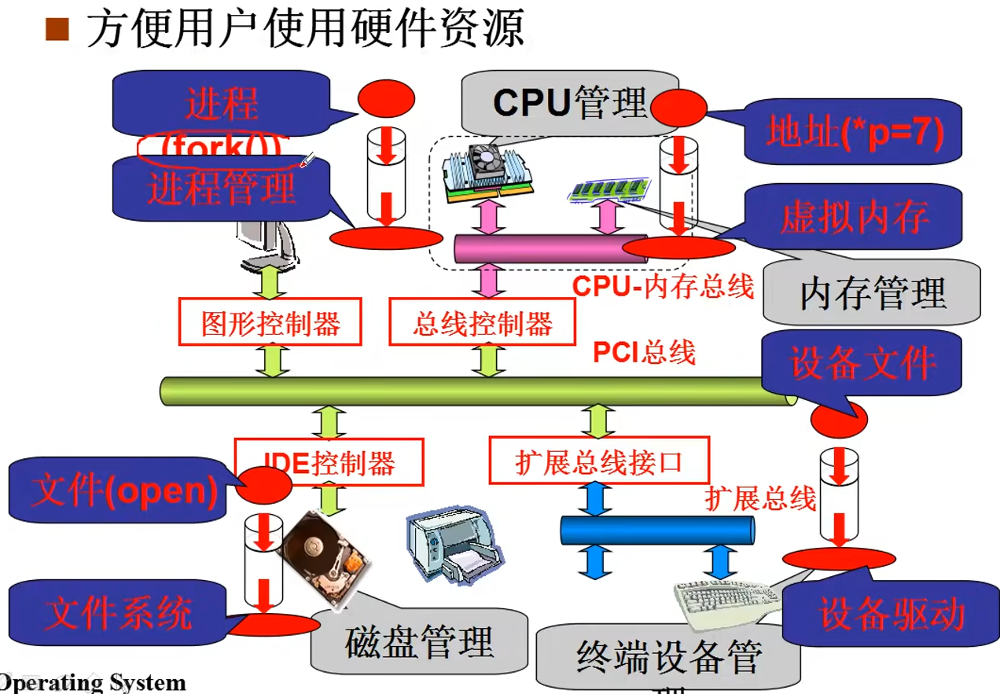

最开始的计算机是依靠图灵机而演变来的，通过图灵机可以较好的了解计算机发展的过程

#### 图灵机

图灵的基本思想是用机器来模拟人们用纸笔进行数学运算的过程，而且还定义了计算机由哪些部分组成，程序又是如何执行的。

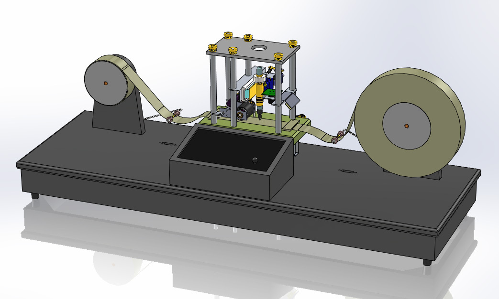

图灵机的基本组成如下：

- 有一条「纸带」，纸带由一个个连续的格子组成，每个格子可以写入字符，纸带就好比内存，而纸带上的格子的字符就好比内存中的数据或程序；
- 有一个「读写头」，读写头可以读取纸带上任意格子的字符，也可以把字符写入到纸带的格子；
- 读写头上有一些部件，比如存储单元、控制单元以及运算单元： 1、存储单元用于存放数据； 2、控制单元用于识别字符是数据还是指令，以及控制程序的流程等； 3、运算单元用于执行运算指令

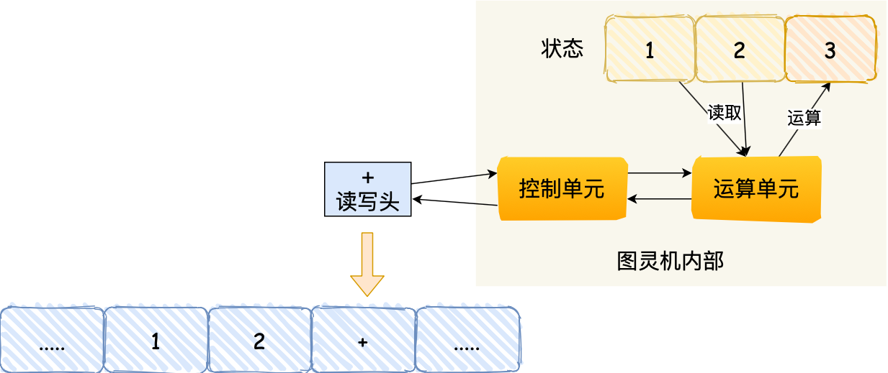

通过上面的图灵机计算 `1 + 2` 的过程，可以发现图灵机主要功能就是读取纸带格子中的内容，然后交给控制单元识别字符是数字还是运算符指令，如果是数字则存入到图灵机状态中，**如果是运算符，则通知运算符单元读取状态中的数值进行计算，计算结果最终返回给读写头，读写头把结果写入到纸带的格子中。**

#### 冯诺依曼架构


基本结构为 5 个部分，分别是**运算器、控制器、存储器、输入设备、输出设备**，包含这 5 个部分的计算机也被称为**冯诺依曼模型**。

**主机**：主机部分由运算器、存储器和控制器组成。

- **运算器**：负责执行所有的算术和逻辑运算。
- **存储器**：用于存储数据和指令。
- **控制器**：负责解释和执行指令，并控制其他部件的操作。

**外设**：由用户主导的输入和输出设备。

- **输入设备**：例如键盘、打孔卡片机等，用于将数据和指令输入到计算机中。
- **输出设备**：例如打印机、显示器等，用于将计算结果和其他信息输出给用户。

#### 程序执行的基本过程

程序实际上是一条一条指令，所以程序的运行过程就是把每一条指令一步一步的执行起来，负责执行指令的就是 CPU 了。

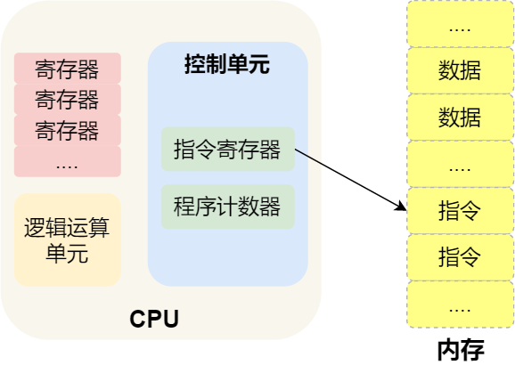

 CPU 执行程序的过程如下：

- 第一步，CPU 读取「程序计数器」的值，这个值是指令的内存地址，然后 CPU 的「控制单元」操作「地址总线」指定需要访问的内存地址，接着通知内存设备准备数据，数据准备好后通过「数据总线」将指令数据传给 CPU，CPU 收到内存传来的数据后，将这个指令数据存入到「指令寄存器」。
- 第二步，「程序计数器」的值自增，表示指向下一条指令。这个自增的大小，由 CPU 的位宽决定，比如 32 位的 CPU，指令是 4 个字节，需要 4 个内存地址存放，因此「程序计数器」的值会自增 4；
- 第三步，CPU 分析「指令寄存器」中的指令，确定指令的类型和参数，如果是计算类型的指令，就把指令交给「逻辑运算单元」运算；如果是存储类型的指令，则交由「控制单元」执行；


简单总结一下就是，一个程序执行的时候，CPU 会根据程序计数器里的内存地址，从内存里面把需要执行的指令读取到指令寄存器里面执行，然后根据指令长度自增，开始顺序读取下一条指令。CPU 从程序计数器读取指令、到执行、再到下一条指令，这个过程会不断循环，直到程序执行结束，这个不断循环的过程被称为 **CPU 的指令周期**。

#### [操作系统的分类](https://www.cnblogs.com/zhangqigao/p/7245342.html)

##### 无操作系统

1946年第一台计算机诞生--20世纪50年代中期，还未出现操作系统，计算机工作采用手工操作方式。

程序员将对应于程序和数据的已穿孔的纸带（或卡片）装入输入机，然后启动输入机把程序和数据输入计算机内存，接着通过控制台开关启动程序针对数据运行；计算完毕，打印机输出计算结果；用户取走结果并卸下纸带（或卡片）后，才让下一个用户上机。


手工操作方式两个特点：

- 用户独占全机。不会出现因资源已被其他用户占用而等待的现象，但资源的利用率低。
- CPU 等待手工操作。CPU的利用不充分。

##### 批处理系统

批处理系统：加载在计算机上的一个系统软件，在它的控制下，计算机能够自动地、成批地处理一个或多个用户的作业（这作业包括程序、数据和命令）。

> **联机批处理系统**

首先出现的是联机批处理系统，即作业的输入/输出由CPU来处理。
主机与输入机之间增加一个存储设备——磁带，在运行于主机上的监督程序的自动控制下，计算机可自动完成：成批地把输入机上的用户作业读入磁带，依次把磁带上的用户作业读入主机内存并执行并把计算结果向输出机输出。完成了上一批作业后，监督程序又从输入机上输入另一批作业，保存在磁带上，并按上述步骤重复处理。


监督程序不停地处理各个作业，从而实现了作业到作业的自动转接，减少了作业建立时间和手工操作时间，有效克服了人机矛盾，提高了计算机的利用率。

但是，在作业输入和结果输出时，主机的高速CPU仍处于空闲状态，等待慢速的输入/输出设备完成工作： 主机处于“忙等”状态。

> **脱机批处理系统**

为克服与缓解高速主机与慢速外设的矛盾，提高CPU的利用率，又引入了脱机批处理系统，即输入/输出脱离主机控制。
这种方式的显著特征是：增加一台不与主机直接相连而专门用于与输入/输出设备打交道的卫星机。

- 从输入机上读取用户作业并放到输入磁带上。
- 从输出磁带上读取执行结果并传给输出机。

这样，主机不是直接与慢速的输入/输出设备打交道，而是与速度相对较快的磁带机发生关系，有效缓解了主机与设备的矛盾。主机与卫星机可并行工作，二者分工明确，可以充分发挥主机的高速计算能力。


脱机批处理系统:20世纪60年代应用十分广泛，它极大缓解了人机矛盾及主机与外设的矛盾。IBM-7090/7094：配备的监督程序就是脱机批处理系统，是现代操作系统的原型。

**不足：每次主机内存中仅存放一道作业，每当它运行期间发出输入/输出（I/O）请求后，高速的CPU便处于等待低速的I/O完成状态，致使CPU空闲。**

为改善CPU的利用率，又引入了多道程序系统。

##### 多道处理系统

所谓多道程序设计技术，就是指允许多个程序同时进入内存并运行。即同时把多个程序放入内存，并允许它们交替在CPU中运行，它们共享系统中的各种硬、软件资源。当一道程序因I/O请求而暂停运行时，CPU便立即转去运行另一道程序。

> **单道程序的运行过程：**

在A程序计算时，I/O空闲， A程序I/O操作时，CPU空闲（B程序也是同样）；必须A工作完成后，B才能进入内存中开始工作，两者是串行的，全部完成共需时间=T1+T2。


> **多道程序的运行过程：**

将A、B两道程序同时存放在内存中，它们在系统的控制下，可相互穿插、交替地在CPU上运行：当A程序因请求I/O操作而放弃CPU时，B程序就可占用CPU运行，这样 CPU不再空闲，而正进行A I/O操作的I/O设备也不空闲，显然，CPU和I/O设备都处于“忙”状态，大大提高了资源的利用率，从而也提高了系统的效率，A、B全部完成所需时间<<T1+T2。


多道程序设计技术不仅使CPU得到充分利用，同时改善I/O设备和内存的利用率，从而提高了整个系统的资源利用率和系统吞吐量（单位时间内处理作业（程序）的个数），最终提高了整个系统的效率。

单处理机系统中多道程序运行时的特点：

- 多道：计算机内存中同时存放几道相互独立的程序；
- 宏观上并行：同时进入系统的几道程序都处于运行过程中，即它们先后开始了各自的运行，但都未运行完毕；
- 微观上串行：实际上，各道程序轮流地用CPU，并交替运行。

多道程序系统的出现，标志着操作系统渐趋成熟的阶段，先后出现了作业调度管理、处理机管理、存储器管理、外部设备管理、文件系统管理等功能。

> **多道批处理系统**

20世纪60年代中期，在前述的批处理系统中，引入多道程序设计技术后形成多道批处理系统（简称：批处理系统）。它有两个特点：

- 多道：系统内可同时容纳多个作业。这些作业放在外存中，组成一个后备队列，系统按一定的调度原则每次从后备作业队列中选取一个或多个作业进入内存运行，运行作业结束、退出运行和后备作业进入运行均由系统自动实现，从而在系统中形成一个自动转接的、连续的作业流。
- 成批：在系统运行过程中，不允许用户与其作业发生交互作用，即：作业一旦进入系统，用户就不能直接干预其作业的运行。

批处理系统的追求目标：提高系统资源利用率和系统吞吐量，以及作业流程的自动化。

*批处理系统的一个重要缺点：不提供人机交互能力，给用户使用计算机带来不便。
虽然用户独占全机资源，并且直接控制程序的运行，可以随时了解程序运行情况。但这种工作方式因独占全机造成资源效率极低。*

一种新的追求目标：既能保证计算机效率，又能方便用户使用计算机。 20世纪60年代中期，计算机技术和软件技术的发展使这种追求成为可能。

##### 分时操作系统

由于CPU速度不断提高和采用分时技术，一台计算机可同时连接多个用户终端，而每个用户可在自己的终端上联机使用计算机，好象自己独占机器一样。

分时技术：**把处理机的运行时间分成很短的时间片，按时间片轮流把处理机分配给各联机作业使用。**

若某个作业在分配给它的时间片内不能完成其计算，则该作业暂时中断，把处理机让给另一作业使用，等待下一轮时再继续其运行。由于计算机速度很快，作业运行轮转得很快，给每个用户的印象是，好象他独占了一台计算机。而每个用户可以通过自己的终端向系统发出各种操作控制命令，在充分的人机交互情况下，完成作业的运行。

具有上述特征的计算机系统称为分时系统，它允许多个用户同时联机使用计算机。


- 多路性。若干个用户同时使用一台计算机。微观上看是各用户轮流使用计算机；宏观上看是各用户并行工作。
- 交互性。用户可根据系统对请求的响应结果，进一步向系统提出新的请求。这种能使用户与系统进行人机对话的工作方式，明显地有别于批处理系统，因而，分时系统又被称为交互式系统。
- 独立性。用户之间可以相互独立操作，互不干扰。系统保证各用户程序运行的完整性，不会发生相互混淆或破坏现象。
- 及时性。系统可对用户的输入及时作出响应。分时系统性能的主要指标之一是响应时间，它是指：从终端发出命令到系统予以应答所需的时间。


分时系统的主要目标：对用户响应的及时性，即不至于用户等待每一个命令的处理时间过长。

分时系统可以同时接纳数十个甚至上百个用户，由于内存空间有限，往往采用对换（又称交换）方式的存储方法。即将未“轮到”的作业放入磁盘，一旦“轮到”，再将其调入内存；而时间片用完后，又将作业存回磁盘（俗称“滚进”、“滚出“法），使同一存储区域轮流为多个用户服务。

**多用户分时系统是当今计算机操作系统中最普遍使用的一类操作系统。**

##### 实时系统

虽然多道批处理系统和分时系统能获得较令人满意的资源利用率和系统响应时间，但却不能满足实时控制与实时信息处理两个应用领域的需求。于是就产生了实时系统，即系统能够及时响应随机发生的外部事件，并在严格的时间范围内完成对该事件的处理。实时系统在一个特定的应用中常作为一种控制设备来使用。

实时系统可分成两类：

- 实时控制系统。当用于飞机飞行、导弹发射等的自动控制时，要求计算机能尽快处理测量系统测得的数据，及时地对飞机或导弹进行控制，或将有关信息通过显示终端提供给决策人员。当用于轧钢、石化等工业生产过程控制时，也要求计算机能及时处理由各类传感器送来的数据，然后控制相应的执行机构。
- 实时信息处理系统。当用于预定飞机票、查询有关航班、航线、票价等事宜时，或当用于银行系统、情报检索系统时，都要求计算机能对终端设备发来的服务请求及时予以正确的回答。此类对响应及时性的要求稍弱于第一类。


实时操作系统的主要特点：

- 及时响应。每一个信息接收、分析处理和发送的过程必须在严格的时间限制内完成。
- 高可靠性。需采取冗余措施，双机系统前后台工作，也包括必要的保密措施等。

> 操作系统发展图谱


### 操作系统运行环境*


在计算机中存在两种程序，系统外层的**应用程序**和**内核程序**。CPU在设计时存在**特权指令**与**非特权指令**，特权指令例如内存指令等。

#### 处理器执行状态*

**内核态和用户态是操作系统中的两种运行模式。**它们的主要区别在于权限和可执行的操作：

- 内核态（Kernel Mode）：在内核态下，CPU可以执行所有的指令和访问所有的硬件资源。这种模式下的操作具有更高的权限，主要用于操作系统内核的运行。
- 用户态（User Mode）：在用户态下，CPU只能执行部分指令集，无法直接访问硬件资源。这种模式下的操作权限较低，主要用于运行用户程序。

**内核态的底层操作主要包括：内存管理、进程管理、设备驱动程序控制、系统调用等。**这些操作涉及到操作系统的核心功能，需要较高的权限来执行。

分为内核态和用户态的原因主要有以下几点：

- 安全性：通过对权限的划分，用户程序无法直接访问硬件资源，从而避免了恶意程序对系统资源的破坏。
- 稳定性：用户态程序出现问题时，不会影响到整个系统，避免了程序故障导致系统崩溃的风险。
- 隔离性：内核态和用户态的划分使得操作系统内核与用户程序之间有了明确的边界，有利于系统的模块化和维护。

##### 内核态(特权模式)

**内核态也被称为内核模式或特权模式，是操作系统内核的运行状态。**处于内核态的CPU可以执行所有的指令，访问所有的内存地址，拥有最高的权限。**内核态下运行的程序可以访问系统的所有资源，包括CPU、内存、I/O等。**

在内核态下，操作系统可以响应所有的中断请求，处理硬件事件和系统调用。当应用程序发出系统调用时，CPU会切换到内核态，执行相应的操作，然后返回用户态。此外，当发生严重错误或异常时，也会触发内核态的切换。

##### 用户态(用户模式)

**用户态也被称为用户模式，是指应用程序的运行状态。**在这种模式下，应用程序拥有有限的系统资源访问权限，只能在操作系统划定的特定空间内运行。**用户态下运行的程序不能直接访问硬件设备或执行特权指令，所有对硬件的访问都必须通过操作系统进行。**

在用户态下，应用程序通过系统调用来请求操作系统提供的服务。例如，文件操作、网络通信等都需要通过系统调用来实现。当应用程序发出系统调用时，会触发上下文切换，将CPU的控制权交给操作系统内核，进入内核态。

#### 内核指令

##### 时钟管理

时钟在操作系统中扮演着非常关键的角色，其主要功能和用途包括：

**计时**：时钟提供了系统时间的基准，允许操作系统跟踪时间和日期。这是许多系统功能（如文件时间戳、计划任务）所必需的。

**时钟中断**：时钟中断是操作系统用于时间管理的核心机制。通过定期触发时钟中断，操作系统可以执行以下任务：

- **进程切换**：在多任务操作系统中，时钟中断用于进程调度。调度程序可以决定是否需要进行上下文切换，以确保各个进程按计划运行。
- **时间片管理**：操作系统通过时钟中断来实现时间片轮转调度（Round-Robin Scheduling），确保每个进程在特定的时间片内执行。时间片结束时，时钟中断触发，调度程序检查是否需要将CPU分配给其他进程。

##### 中断机制

中断机制是操作系统响应各种事件的基本机制，分为硬件中断和软件中断。

**硬件中断**：来自外部设备的信号，通知CPU有事件需要处理，例如：

- **键盘输入**：用户按键产生中断，操作系统读取输入数据。
- **网络数据包**：网络接口卡接收到数据包，产生中断通知操作系统处理。
- **定时器中断**：系统时钟定期产生中断，用于维护时间和调度。

**软件中断**：由程序或操作系统生成的中断，通常用于系统调用和异常处理，例如：

- **系统调用**：用户程序通过软件中断请求操作系统服务。
- **异常处理**：例如除零错误、非法访问内存等会产生软件中断，操作系统捕获并处理这些异常。

##### 原语

原语（primitive）是操作系统提供的基本操作，通常是底层的、不可分割的操作，具有以下特点

- **接近硬件**：原语通常直接操作硬件或系统的核心数据结构，如进程控制块、内存页表等。
- **原子性**：原语必须是原子操作，确保操作在执行过程中不被中断，以保持系统的一致性和稳定性。例如，禁用中断期间的上下文切换操作。
- **运行时间短**：原语通常设计为非常短小，以减少对系统的整体性能影响。它们被频繁调用，必须执行迅速，以确保操作系统的高效性。

### 中断与异常

中断是计算机系统中用于响应硬件设备请求的一种机制。用一个生活中的例子来形象地解释：小林中午搬完砖后点了一份外卖，但他不会一直盯着手机等外卖送达，而是去干别的事情。当外卖员打电话通知他时，小林会停下手中的工作去取外卖。**在这个例子中，电话通知就相当于计算机中的中断。**外卖送达前，小林可以做其他事情（计算机在等待中断时处理其他任务）。**一旦电话响起（中断发生），小林就会停止当前任务去应对（处理中断）。**

中断是一种**异步事件处理机制**，提高了系统的并发处理能力。操作系统收到中断请求后，会暂停当前进程，调用中断处理程序来响应请求。**中断处理程序应尽快完成，以免影响其他进程或中断请求的处理，就像小林希望电话通话时间越短越好，避免占用太久影响其他来电。**

#### **中断（外中断）**

中断是系统正常操作的一部分，用于响应外部事件。

- **外设请求**：例如，输入设备、网络适配器发出的信号。
- **人的干预**：如键盘中断或用户请求。


#### **异常（内中断）**

异常是指在程序执行过程中出现的错误或非正常情况。例如，除以零、访问不存在的内存地址等等。当发生异常时，操作系统会停止当前进程的执行，并处理异常。处理完毕后，操作系统会终止当前进程并回收资源。

- **文件损坏**：例如，尝试访问受损的文件。
- **进程越界**：如访问非法内存地址。
- **算术溢出**：例如，整数溢出或除零错误。
- **硬件故障**：如硬件组件出现故障。
- **软件中断**：程序故意触发的软件中断请求。

异常通常是不预期的，指示系统出现了错误或问题。

**区别**：异常是中断的一种特殊形式，主要由于错误或不正常的情况触发，而中断不一定是由异常引起的，它可以是外部设备的正常请求或用户操作。

#### 中断处理过程

1. **关闭中断**：为了防止在处理中断时发生新的中断，系统会首先禁用中断。
2. **保存断点**：保存当前的程序计数器（PC）和其他执行状态，以便在中断处理完成后能够恢复到中断发生前的状态。
3. **中断服务程序寻址**：根据中断向量表，确定需要执行的中断服务程序（Interrupt Service Routine, ISR）。
4. **保存现场和屏蔽字**：保存当前寄存器内容和其他重要状态信息，同时设置中断屏蔽，以防止中断处理过程中被其他中断打断。
5. **重新开启中断**：启用中断，使系统能够在处理过程中响应新的中断请求。这可以提高系统的响应能力。
6. **执行中断服务程序**：执行相应的中断服务程序，处理具体的中断请求，如读取设备数据、更新系统状态等。
7. **关闭中断**：在恢复之前，暂时关闭中断，确保恢复现场时不被新的中断打断。
8. **恢复现场和屏蔽字**：恢复先前保存的寄存器和状态信息，以及中断屏蔽状态，确保系统能够恢复到中断前的状态。
9. **开启中断并返回**：重新启用中断，并将控制权返回给中断发生之前的程序，继续执行被中断的任务。

- **步骤 1~3**：由硬件（如CPU和中断控制器）自动完成。这些步骤负责检测中断并做好进入中断处理的准备。
- **步骤 4~9**：由中断处理程序（软件）完成。这些步骤确保系统在处理中断请求后，能够正确恢复并继续执行。

### [操作系统的体系结构*](https://www.cnblogs.com/cherish-/p/15755441.html)

#### 单体结构

在单体结构的操作系统中，所有操作系统功能模块都构建在一个大内核中，运行在内核态下。所有的操作系统服务（如文件系统管理、进程管理、内存管理等）都作为内核的一部分紧密集成。

- **优点**：性能较高，因为所有服务直接在内核态运行，减少了用户态与内核态之间的上下文切换开销。

- **缺点**：缺乏模块化，内核代码庞大且复杂，难以维护和调试。一旦内核某部分出现错误，可能导致整个系统崩溃。

#### 层次结构

操作系统被划分为多个层次，每一层只依赖于它的下层，提供对上层的服务。最低层通常是硬件，最高层是用户接口和应用程序。

- **优点**：层次结构清晰，便于理解、设计和调试。每一层可以独立开发和测试，增强了系统的模块化和可维护性。

- **缺点**：层次之间的严格依赖可能导致性能损失，因为每层都可能需要多次通过下层提供的接口。


#### 微内核结构

微内核结构只保留最基本的内核功能（如进程间通信、基本的内存管理和硬件抽象层），其他服务（如文件系统、网络协议栈）在用户态运行，并作为独立的进程或服务器模块。

- **优点**：模块化设计提高了操作系统的可维护性和可扩展性。由于大部分操作在用户态运行，即使某个模块出错也不会导致整个系统崩溃，增加了系统的稳定性和安全性。

- **缺点**：性能可能较低，因为用户态和内核态之间频繁的上下文切换和进程间通信会带来额外的开销。

### 组成硬件

#### 内存(RAM)

在计算机数据存储中，存储数据的基本单位是**字节（\*byte\*）**，1 字节等于 8 位（8 bit）。每一个字节都对应一个内存地址。

内存的地址是从 0 开始编号的，然后自增排列，最后一个地址为内存总字节数 - 1，这种结构好似我们程序里的数组，所以内存的读写任何一个数据的速度都是一样的。

#### 中央处理器(CPU)

CPU的作用是取值执行，32 位和 64 位 CPU 最主要区别在于一次能计算多少字节数据：

- 32 位 CPU 一次可以计算 4 个字节；
- 64 位 CPU 一次可以计算 8 个字节；

之所以 CPU 要这样设计，是为了能计算更大的数值，如果是 8 位的 CPU，那么一次只能计算 1 个字节 `0~255` 范围内的数值，这样就无法一次完成计算 `10000 * 500` ，于是为了能一次计算大数的运算，CPU 需要支持多个 byte 一起计算，所以 CPU 位宽越大，可以计算的数值就越大，比如说 32 位 CPU 能计算的最大整数是 `4294967295`。

**[寄存器](https://www.cnblogs.com/FengZeng666/p/15711562.html)**

- **程序计数器（PC，Program counter），用于存放指令的地址。**为了保证程序(在操作系统中理解为进程)能够连续地执行下去，CPU必须具有某些手段来确定下一条指令的地址。当执行一条指令时，首先需要根据PC中存放的指令地址，将指令由内存取到指令寄存器中，此过程称，为“取指令”。与此同时，PC中的地址或自动加1或由转移指针给出下一条指令的地址。此后经过分析指令，执行指令。完成第一条指令的执行，而后根据PC取出第二条指令的地址，如此循环，执行每一条指令。

- **指令寄存器（IR，Instruction Register），用来保存当前正在执行的一条指令。**是临时放置从内存里面取得的程序指令的寄存器，用于存放当前从主存储器读出的正在执行的一条指令。当执行一条指令时，先把它从内存取到数据寄存器（DR，Data Register）中，然后再传送至IR。指令划分为操作码和地址码字段，由二进制数字组成。为了执行任何给定的指令，必须对操作码进行测试，以便识别所要求的操作。指令译码器就是做这项工作的。指令寄存器中操作码字段的输出就是指令译码器的输入。操作码一经译码后，即可向操作控制器发出具体操作的特定信号。

- **通用寄存器（GR，General register）：通用寄存器可用于传送和暂存数据，也可参与算术逻辑运算，并保存运算结果。**除此之外，它们还各自具有一些特殊功能。通用寄存器的长度取决于机器字长，汇编语言程序员必须熟悉每个寄存器的一般用途和特殊用途，只有这样，才能在程序中做到正确、合理地使用它们。

#### 总线

总线是用于 CPU 和内存以及其他设备之间的通信，总线可分为 3 种：

- *地址总线*，用于指定 CPU 将要操作的内存地址；
- *数据总线*，用于读写内存的数据；
- *控制总线*，用于发送和接收信号，比如中断、设备复位等信号，CPU 收到信号后自然进行响应，这时也需要控制总线；

当 CPU 要读写内存数据的时候，一般需要通过下面这三个总线：

- 首先要通过「地址总线」来指定内存的地址；
- 然后通过「控制总线」控制是读或写命令；
- 最后通过「数据总线」来传输数据；

## 第二章 进程与线程

### 进程*

我们编写的代码只是一个存储在硬盘的静态文件，通过编译后就会生成二进制可执行文件，当我们运行这个可执行文件后，它会被装载到内存中，接着 CPU 会执行程序中的每一条指令，那么这个**运行中的程序，就被称为「进程」（Process）**。也就是**进程是执行中的程序。**


CPU在**计算的时候需要读取硬盘里的信息加以计算**，但是受限于硬盘的读取速度如果要完全计算完一个进程，CPU的运算速率就会变慢。所以，当进程要从硬盘读取数据时，CPU 不需要阻塞等待数据的返回，而是去执行另外的进程。**当硬盘数据返回时，CPU 会收到个中断，于是 CPU 再继续运行这个进程。**这也就是时分运算，对于一小段时间而言CPU会交替计算所有运行的进程。但是在大的时间看来，CPU是同时运算的。

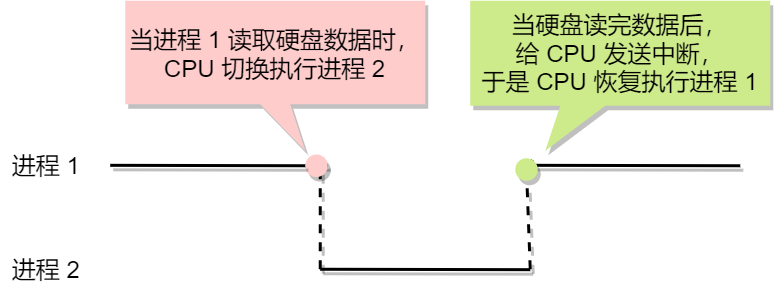

这种**多个程序、交替执行**的思想，就有 CPU 管理多个进程的初步想法。对于一个支持多进程的系统，CPU 会从一个进程快速切换至另一个进程，其间每个进程各运行几十或几百个毫秒。

虽然单核的 CPU 在某一个瞬间，只能运行一个进程。但在 1 秒钟期间，它可能会运行多个进程，这样就产生**并行的错觉**，实际上这是**并发**。

> 并发和并行的区别

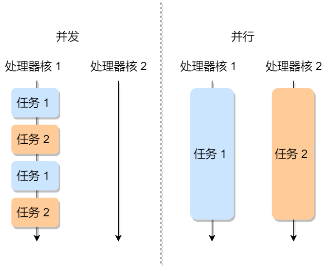

> 进程与程序的关系的类比

到了晚饭时间，一对小情侣肚子都咕咕叫了，于是男生见机行事，就想给女生做晚饭，所以他就在网上找了辣子鸡的菜谱，接着买了一些鸡肉、辣椒、香料等材料，然后边看边学边做这道菜。

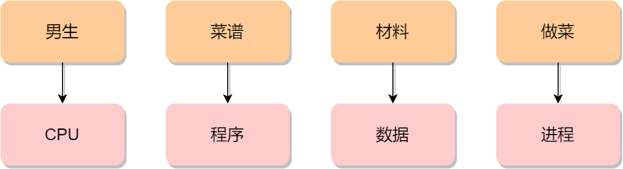

突然，女生说她想喝可乐，那么男生只好把做菜的事情暂停一下，并在手机菜谱标记做到哪一个步骤，把状态信息记录了下来。然后男生听从女生的指令，跑去下楼**买了一瓶冰可乐后**，又回到**厨房继续做菜**。

**这体现了，CPU 可以从一个进程（做菜）切换到另外一个进程（买可乐），在切换前必须要记录当前进程中运行的状态信息，以备下次切换回来的时候可以恢复执行。**

**进程有着「运行 - 暂停 - 运行」的活动规律。**

> 针对于上述特点总结了一下性质

程序的顺序执行： **程序在顺序执行时，只有前一个操作执行完成后**，后续操作才能执行。

- 顺序性：操作按既定顺序依次进行。
- 封闭性：程序运行期间，结果不受外界影响，独占系统资源。
- 可再现性：初始条件和执行环境相同，程序重复执行会得到相同结果。

程序的并发执行： **多个程序（程序段）同时在系统中运行。**

- 间断性：程序共享资源或相互协作，形成相互制约关系。
- 失去封闭性：多个程序共享系统资源。
- 不可再现性：由于共享资源和相互影响，程序执行结果可能不同。

并发执行的条件： **并发执行要求程序具有可再现性**，符合 Bernstein 理想化状态：

- 确保在两次读操作之间，存储器中的数据不发生变化。

- 确保写操作结果不会丢失。

进程从功能出发有以下特征：

- **动态**性: 进程是程序的一次执行过程，是动态地产生、变化和消亡的
- **并发**性: 内存中有多个进程实体，各进程可井发执行
- 独立性: 进程是能独立运行、独立获得资源、独立接受调度的基本单位
  - **进程是资源分配、接受调度的基本, 独立单位**
- **异步**性: 各进程按各自独立的、不可预知的速度向前推进，操作系统要提供"进程同步机制"来解决异步问题
- **结构**性: 每个进程都会配置一个PCB。结构上看，进程由PCB、程序段、数据段组成

进程和程序的关系：

- 进程是动态的，程序是静止的。**进程是运行中的程序**
- 每个进程包含程序段、数据段以及进程控制块（PCB），而程序是有序代码的集合。
- 进程是暂时的，程序是永久的。
- 一个程序通过多次执行可以产生多个不同的进程；通过调用关系，一个进程可以执行多个程序，而程序不能形成新的程序。
- 进程具有并行特性（独立性、异步性），而程序没有。

进程和作业的区别：**作业**是用户需要计算机**完成某项任务而要求计算机所做的工作的集合**。

- 作业是用户向计算机提交任务的任务实体。
- 进程是完成用户任务的执行实体。
- 一个作业由至少一个进程组成，但一个进程不能构成多个作业。

进程的特征

- 动态性：进程是程序在处理器上的一次执行过程，因而是动态的(动态性是进程的最基本的特征)
- 并发性：指多个进程实体同时存于内存中，能在一段时间内同时运行
- 独立性：是指进程实体是一个能独立运行、独立获得资源和独立接受调度的基本单位
- 异步性：进程按照各自独立运行的、不可预知的速度向前推进
- 结构性：从结构上看，进程实体是由程序段、数据段和进程控制块(PCB)三部分组成的。

（程序段:是指程序的代码，数据段:是指运行过程中产生的各种数据）

#### 进程控制块(PCB)

**PCB 是进程存在的唯一标识**，这意味着一个进程的存在，必然会有一个 PCB，如果进程消失了，那么 PCB 也会随之消失。


PCB具体包含的信息如下：

进程描述信息：

- 进程标识符：标识各个进程，每个进程都有一个并且唯一的标识符；
- 用户标识符：进程归属的用户，用户标识符主要为共享和保护服务；

进程控制和管理信息：

- 进程当前状态，如 new、ready、running、waiting 或 blocked 等；
- 进程优先级：进程抢占 CPU 时的优先级；

资源分配清单：

- 有关内存地址空间或虚拟地址空间的信息，所打开文件的列表和所使用的 I/O 设备信息。

CPU 相关信息：

- CPU 中各个寄存器的值，当进程被切换时，CPU 的状态信息都会被保存在相应的 PCB 中，以便进程重新执行时，能从断点处继续执行。

可见，PCB 包含信息还是比较多的。每个 PCB 是如何组织的呢？通常是通过**链表**的方式进行组织，把**具有相同状态的进程链在一起，组成各种队列。**比如：

- 将所有处于就绪状态的进程链在一起，称为**就绪队列**；
- 把所有因等待某事件而处于等待状态的进程链在一起就组成各种**阻塞队列**；
- 另外，对于运行队列在单核 CPU 系统中则只有一个运行指针了，因为单核 CPU 在某个时间，只能运行一个程序。

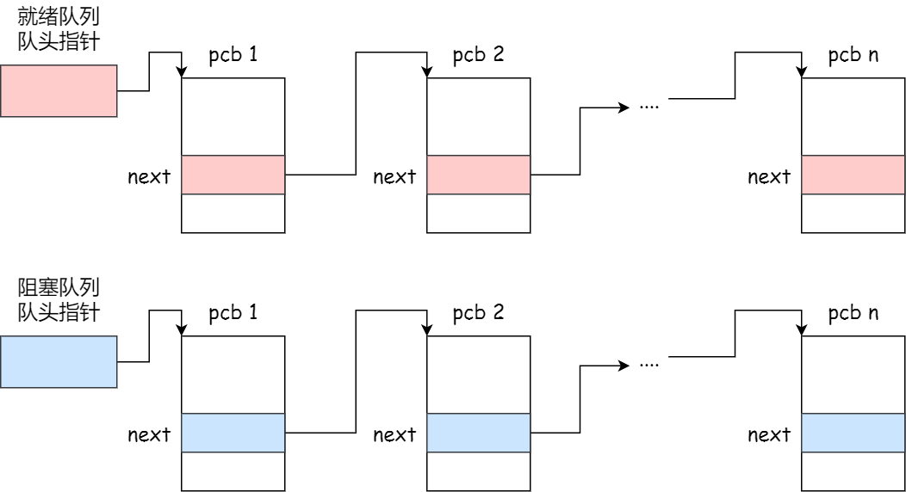

除了链接的组织方式，还有索引方式，**它的工作原理：将同一状态的进程组织在一个索引表中，索引表项指向相应的 PCB，不同状态对应不同的索引表。**一般会选择链表，是因为可能面临进程创建，销毁等调度导致进程状态发生变化，通过链表能够更加灵活的插入和删除。

#### 进程的基本状态

一般说来，一个进程并不是自始至终连续不停地运行的，它与并发执行中的其他进程的执行是相互制约的。它有时处于运行状态，有时又由于某种原因而暂停运行处于等待状态，当使它暂停的原因消失后，它又进入准备运行状态。

所以，**在一个进程的活动期间至少具备三种基本状态，即运行状态、就绪状态、阻塞状态。**

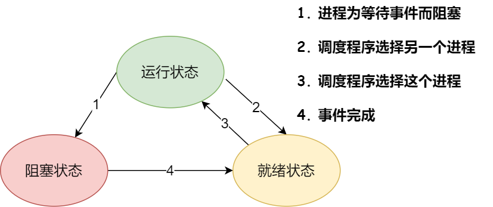

上图中各个状态的意义：

- 运行状态（*Running*）：该时刻进程占用 CPU；
- 就绪状态（*Ready*）：可运行，由于其他进程处于运行状态而暂时停止运行；
- 阻塞状态（*Blocked*）：该进程正在等待某一事件发生（如等待输入/输出操作的完成）而暂时停止运行，这时，即使给它CPU控制权，它也无法运行；

当然，进程还有另外两个基本状态：

- 创建状态（*new*）：进程正在被创建时的状态；
- 结束状态（*Exit*）：进程正在从系统中消失时的状态；

于是，一个完整的进程状态的变迁如下图：

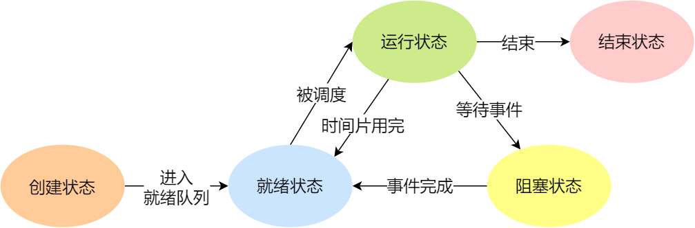

再来详细说明一下进程的状态变迁：

- **NULL -> 创建状态**：一个新进程被创建时的第一个状态。

- **创建状态 -> 就绪状态**：当进程被创建完成并初始化后，一切就绪准备运行时，变为就绪状态，这个过程是很快的。
  - **过程**：申请空白PCB → 填写控制信息 → 分配资源 → 转入就绪状态（若资源足够）。

- **就绪状态 -> 运行状态**：处于就绪状态的进程被操作系统的进程调度器选中后，就分配给 CPU 正式运行该进程。

  - **特征**：在就绪队列中等待调度。

  - **原因**：进程被调度程序选中，获得CPU时间片。

- **运行状态 -> 结束状态**：当进程已经运行完成或出错时，会被操作系统作结束状态处理。
  - **描述**：进程正在使用CPU执行任务。

- **运行状态 -> 就绪状态**：处于运行状态的进程在运行过程中，由于分配给它的运行时间片用完，操作系统会把该进程变为就绪态，接着从就绪态选中另外一个进程运行。
  - **原因**：时间片用完，或有更高优先级的进程变为就绪状态。

- **运行状态 -> 阻塞状态**：当进程请求某个事件且必须等待时，例如请求 I/O 事件。

  - **描述**：进程等待某些事件发生，如I/O操作完成或资源释放。

  - **原因**：进程因等待某些事件（如I/O操作）而无法继续执行。

- **阻塞状态 -> 就绪状态**：当进程要等待的事件完成时，它从阻塞状态变到就绪状态。
  - **原因**：所等待的事件发生，进程被唤醒，重新进入就绪队列。

- **结束状态**：
  - **描述**：进程正常或异常结束，操作系统进行善后处理，清除PCB并释放资源
  

如果有大量处于阻塞状态的进程，进程可能会占用着物理内存空间，显然不是我们所希望的，毕竟物理内存空间是有限的，被阻塞状态的进程占用着物理内存就一种浪费物理内存的行为。**所以，在虚拟内存管理的操作系统中，通常会把阻塞状态的进程的物理内存空间换出到硬盘，等需要再次运行的时候，再从硬盘换入到物理内存。**


那么，就需要一个新的状态，来**描述进程没有占用实际的物理内存空间的情况，这个状态就是挂起状态**。这跟阻塞状态是不一样，阻塞状态是等待某个事件的返回。

另外，挂起状态可以分为两种：

- 阻塞挂起状态：进程在外存（硬盘）并等待某个事件的出现；
- 就绪挂起状态：进程在外存（硬盘），但只要进入内存，即刻立刻运行；

这两种挂起状态加上前面的五种状态，就变成了七种状态变迁

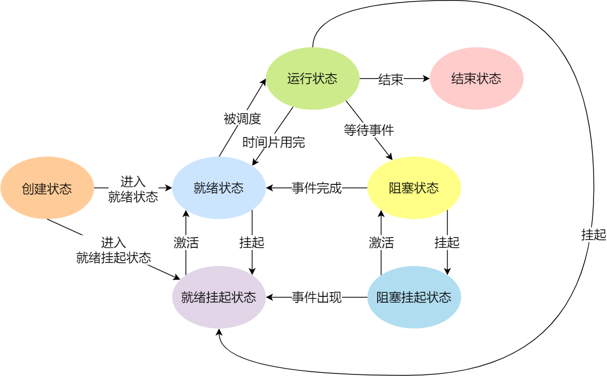

导致进程**挂起的原因**不只是因为进程所使用的内存空间不在物理内存，还包括如下情况：

- 通过 sleep 让进程间歇性挂起，其工作原理是**设置一个定时器**，到期后唤醒进程。
- 用户希望挂起一个程序的执行，比如在 Linux 中用 `Ctrl+Z` 挂起进程

##### 进程的控制


我们熟知了进程的状态变迁和进程的数据结构 PCB 后，再来看看进程的**创建、终止、阻塞、唤醒**的过程，这些过程也就是进程的控制。

**01 创建进程**

操作系统允许一个进程创建另一个进程，而且允许子进程继承父进程所拥有的资源。

创建进程的过程如下：

- 申请一个空白的 PCB，并向 PCB 中填写一些控制和管理进程的信息，比如进程的唯一标识等；
- 为该进程分配运行时所必需的资源，比如内存资源；
- 将 PCB 插入到就绪队列，等待被调度运行；

**02 终止进程**

进程可以有 3 种终止方式：正常结束、异常结束以及外界干预（信号 `kill` 掉）。

**当子进程被终止时，其在父进程处继承的资源应当还给父进程。而当父进程被终止时，该父进程的子进程就变为孤儿进程，会被 1 号进程收养，并由 1 号进程对它们完成状态收集工作。**

终止进程的过程如下：

- 查找需要终止的进程的 PCB；
- 如果处于执行状态，则立即终止该进程的执行，然后将 CPU 资源分配给其他进程；
- 如果其还有子进程，则应将该进程的子进程交给 1 号进程接管；
- 将该进程所拥有的全部资源都归还给操作系统；
- 将其从 PCB 所在队列中删除；

**03 阻塞进程**

当进程需要等待某一事件完成时，它可以调用阻塞语句把自己阻塞等待。而一旦被阻塞等待，它只能由另一个进程唤醒。

阻塞进程的过程如下：

- 找到将要被阻塞进程标识号对应的 PCB
- 如果该进程为运行状态，则保护其现场，将其状态转为阻塞状态，停止运行
- 将该 PCB 插入到阻塞队列中去

**04 唤醒进程**

**进程由「运行」转变为「阻塞」状态是由于进程必须等待某一事件的完成**，所以处于阻塞状态的进程是绝对不可能叫醒自己的。如果某进程正在等待 I/O 事件，**需由别的进程发消息给它**，则只有当该进程所期待的事件出现时，才由发现者进程用唤醒语句叫醒它。

唤醒进程的过程如下：

- 在该事件的阻塞队列中找到相应进程的 PCB
- 将其从阻塞队列中移出，并置其状态为就绪状态
- 把该 PCB 插入到就绪队列中，等待调度程序调度

进程的阻塞和唤醒是一对功能相反的语句，如果某个进程调用了阻塞语句，则必有一个与之对应的唤醒语句。

##### 上下文切换

**进程切换到另一个进程运行，称为进程的上下文切换**。

> 在详细说进程上下文切换前，先来看看 CPU 上下文切换

大多数操作系统都是多任务，通常支持大于 CPU 数量的任务同时运行。实际上，这些任务并不是同时运行的，只是因为系统在很短的时间内，让各个任务分别在 CPU 运行，于是就造成同时运行的错觉。

任务是交给 CPU 运行的，那么在每个任务运行前，CPU 需要知道任务从哪里加载，又从哪里开始运行。

所以，操作系统需要事先帮 CPU 设置好 **CPU 寄存器和程序计数器**。

**CPU 寄存器是 CPU 内部一个容量小，但是速度极快的内存（缓存）。**我举个例子，寄存器像是你的口袋，内存像你的书包，硬盘则是你家里的柜子，如果你的东西存放到口袋，那肯定是比你从书包或家里柜子取出来要快的多。

再来，程序计数器则是用来存储 CPU 正在执行的指令位置、或者即将执行的下一条指令位置。所以说，**CPU 寄存器和程序计数是 CPU 在运行任何任务前，所必须依赖的环境，这些环境就叫做 CPU 上下文。**既然知道了什么是 CPU 上下文，那理解 CPU 上下文切换就不难了。

CPU 上下文切换就是先把前一个任务的 CPU 上下文（CPU 寄存器和程序计数器）保存起来，然后加载新任务的上下文到这些寄存器和程序计数器，最后再跳转到程序计数器所指的新位置，运行新任务。

**系统内核会存储保持下来的上下文信息，当此任务再次被分配给 CPU 运行时，CPU 会重新加载这些上下文，这样就能保证任务原来的状态不受影响**，让任务看起来还是连续运行。上面说到所谓的「任务」，主要包含进程、线程和中断。所以，可以根据任务的不同，把 CPU 上下文切换分成：**进程上下文切换、线程上下文切换和中断上下文切换**。

> 进程的上下文切换到底是切换什么

进程是由内核管理和调度的，所以进程的切换只能发生在内核态。

所以，**进程的上下文切换不仅包含了虚拟内存、栈、全局变量等用户空间的资源，还包括了内核堆栈、寄存器等内核空间的资源。**通常，会把交换的信息保存在进程的 PCB，当要运行另外一个进程的时候，我们需要从这个进程的 PCB 取出上下文，然后恢复到 CPU 中，这使得这个进程可以继续执行，如下图所示：

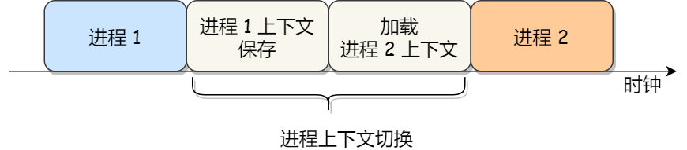

需要注意的是，进程的上下文开销是很关键的，我们希望它的开销越小越好，这样可以使得进程可以把更多时间花费在执行程序上，而不是耗费在上下文切换。

> 发生进程上下文切换的哪些场景

- 为了保证所有进程可以得到公平调度，CPU 时间被划分为一段段的时间片，这些时间片再被轮流分配给各个进程。这样，当某个进程的时间片耗尽了，进程就从运行状态变为就绪状态，系统从就绪队列选择另外一个进程运行；
- 进程在系统资源不足（比如内存不足）时，**要等到资源满足后才可以运行，这个时候进程也会被挂起，并由系统调度其他进程运行**
- 当进程通过睡眠函数 sleep 这样的方法将自己主动挂起时，自然也会重新调度；
- 当有优先级更高的进程运行时，为了保证高优先级进程的运行，当前进程会被挂起，由高优先级进程来运行；
- 发生硬件中断时，CPU 上的进程会被中断挂起，转而执行内核中的中断服务程序；


### 线程*

在早期的操作系统中都是以进程作为独立运行的基本单位，直到后面，计算机科学家们又提出了更小的能独立运行的基本单位，也就是**线程。**

> 可以把线程理解为轻量级进程或者理解为在CPU中运行的最小程序

我们举个例子，假设你要编写一个视频播放器软件，那么该软件功能的核心模块有三个：

- 从视频文件当中读取数据；
- 对读取的数据进行解压缩；
- 把解压缩后的视频数据播放出来；

对于单进程的实现方式，会是以下这个方式：

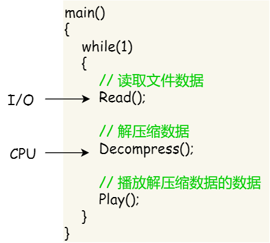

对于单进程的这种方式，存在以下问题：

- 播放出来的画面和声音会不连贯，因为当 CPU 能力不够强的时候，**`Read` 的时候可能进程就等在这了，这样就会导致等半天才进行数据解压和播放；**
- 各个函数之间不是并发执行，影响资源的使用效率

改进成多进程的方式：

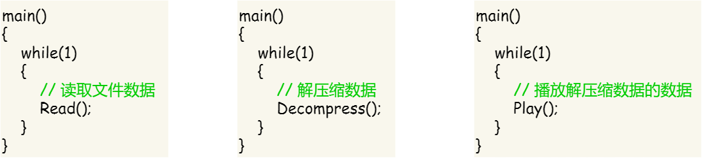

对于多进程的这种方式，依然会存在问题：

- 进程之间如何通信，共享数据？比如我需要根据不同的视频进度更新进度条，但是进程之间无法直接通讯，速度就很慢。
- **同时维护进程的系统开销较大**，如创建进程时，分配资源、建立 PCB；终止进程时，回收资源、撤销 PCB；进程切换时，保存当前进程的状态信息；

为了解决这些问题需要有一种新的实体，满足以下特性：

- **实体之间可以并发运行**
- **实体之间共享相同的地址空间**

这个新的实体，就是线程，线程之间可以并发运行且共享相同的地址空间。

#### 什么是线程

**线程是基本的CPU执行单元，也是程序执行流的最小单位**。

引入线程后，不仅可以在不同进程之间实现并发，而且**同一进程内的各个线程也可以并发执行**。这**提升了系统的并发度**，使得进程内能够**同时处理多种任务**，例如视频聊天、文字聊天和文件传输等。

引入线程的作用在于**将进程作为系统资源的分配单元**（如打印机、内存地址空间等），而**线程则作为调度的基本单位**。即，**进程是资源分配的基本单位，线程是调度的基本单位**。

- 每个线程都有一个线程ID和线程控制块（TCB）。
- **线程切换时无需切换进程环境**。
- 线程本身几乎不拥有系统资源。
- 同一进程内的线程可以共享进程资源，并且**线程间的通信无需系统干预。**

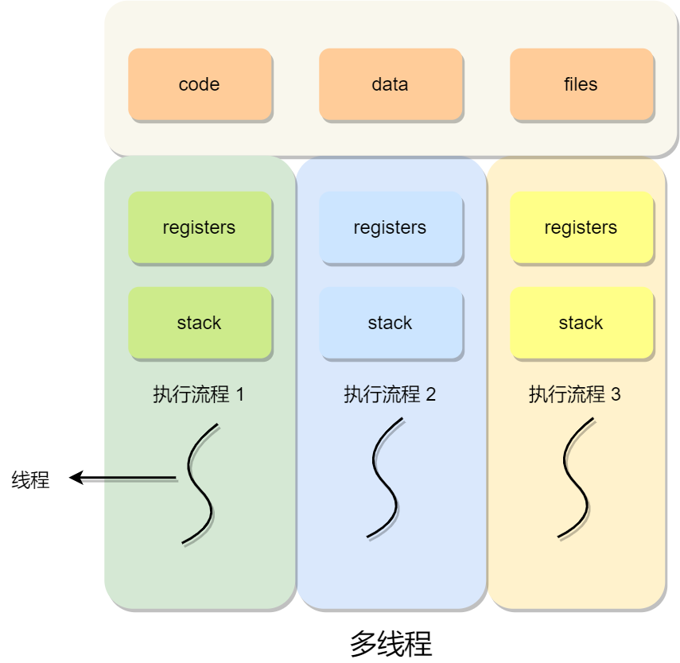

#### 线程实现

**用户线程**：是由用户态的线程库来完成线程的管理

- 由应用程序通过线程库实现。
- 线程的管理（包括线程切换）完全由应用程序负责。
- 线程切换在用户态下完成，无需操作系统干预。
- 对用户来说，存在多个线程；对操作系统内核来说，线程的存在是不透明的（用户级线程对用户透明，对操作系统透明）。

**内核线程（Kernel Thread）**：是由内核管理的线程

- 由操作系统内核负责管理。
- 线程调度和切换都在核心态下完成。
- 线程的管理和切换由内核完成，因此需要操作系统的参与。

**轻量级进程（LightWeight Process）**：在内核中来支持用户线程

- 轻量级进程通常与同一进程中的其他线程共享相同的内存空间和资源，如文件描述符。这样可以提高资源利用效率和线程间的通信速度。
- 尽管轻量级进程共享资源，但它们有各自的执行路径。每个轻量级进程都有自己的程序计数器、堆栈和寄存器，这使得它们可以独立执行不同的任务。
- 相比于传统进程，轻量级进程的创建和销毁开销较小，因为它们不需要像进程那样分配和管理独立的内存空间和资源。

那么，这还需要考虑一个问题，用户线程和内核线程的对应关系。首先，第一种关系是**多对一**的关系，也就是多个用户线程对应同一个内核线程：

> **多对一模型**

将多个用户级线程映射到一个内核级线程。每个用户进程只有一个内核级线程。

- 优点：用户级线程切换在用户空间完成，减少了系统开销，提高了效率。
- 缺点：如果一个用户级线程被阻塞，整个进程都会被阻塞，导致并发度降低。无法在多核处理机上并行运行多个线程。

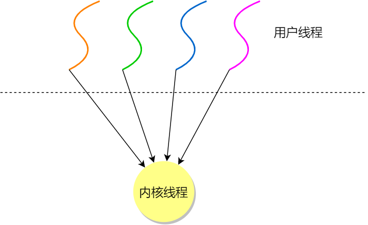

> **一对一模型**

**一对一**的关系，是一个用户线程对应一个内核线程。每个用户级线程对应一个内核级线程。每个用户进程拥有与用户级线程数量相同的内核级线程。

- 优点：一个线程被阻塞时，其他线程仍可继续执行，提供了更强的并发能力。支持多核处理机上的线程并行执行。
- 缺点：一个用户进程占用多个内核级线程，线程切换需在核心态完成，增加了管理成本和系统开销

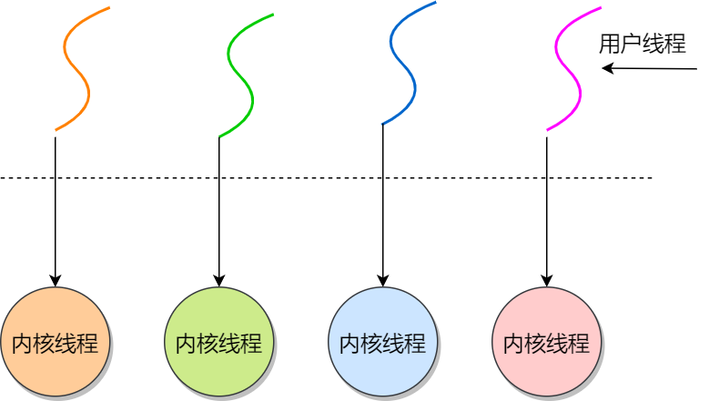

> **多对多**模型

多个用户级线程映射到多个内核级线程 (n ≥ m)。每个用户进程可以有多个内核级线程。

- 解决了多对一模型的并发度不足问题，同时避免了一对一模型中用户进程占用过多内核级线程的问题。兼具高并发性和较低的管理开销。

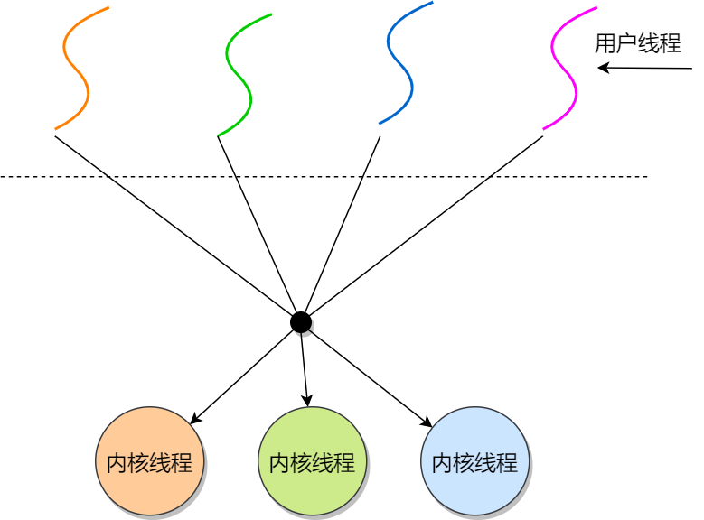

##### 用户线程

用户线程是基于用户态的线程管理库来实现的，那么**线程控制块(TCB)** 也是在库里面来实现的，对于操作系统而言是看不到这个 TCB 的，它只能看到整个进程的 PCB。

所以，**用户线程的整个线程管理和调度，操作系统是不直接参与的，而是由用户级线程库函数来完成线程的管理，包括线程的创建、终止、同步和调度等。**用户级线程的模型，也就类似前面提到的**多对一**的关系，即多个用户线程对应同一个内核线程，如下图所示：

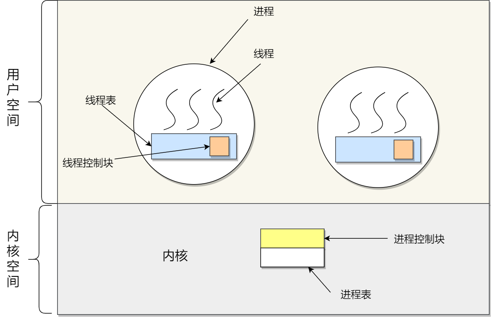

用户线程的**优点**：

- 每个进程都需要有它私有的线程控制块（TCB）列表，用来跟踪记录它各个线程状态信息（PC、栈指针、寄存器），TCB 由用户级线程库函数来维护，可用于不支持线程技术的操作系统；
- 用户线程的切换也是由线程库函数来完成的，无需用户态与内核态的切换，所以速度特别快；

用户线程的**缺点**：

- 由于操作系统不参与线程的调度，如果一个线程发起了系统调用而阻塞，那进程所包含的用户线程都不能执行了。
- 当一个线程开始运行后，除非它主动地交出 CPU 的使用权，否则它所在的进程当中的其他线程无法运行，因为用户态的线程没法打断当前运行中的线程，它没有这个特权，只有操作系统才有，但是用户线程不是由操作系统管理的。
- 由于时间片分配给进程，故与其他进程比，在多线程执行时，每个线程得到的时间片较少，执行会比较慢；

##### 内核线程

**内核线程是由操作系统管理的，线程对应的 TCB 自然是放在操作系统里的，这样线程的创建、终止和管理都是由操作系统负责。**

内核线程的模型，也就类似前面提到的**一对一**的关系，即一个用户线程对应一个内核线程，如下图所示：

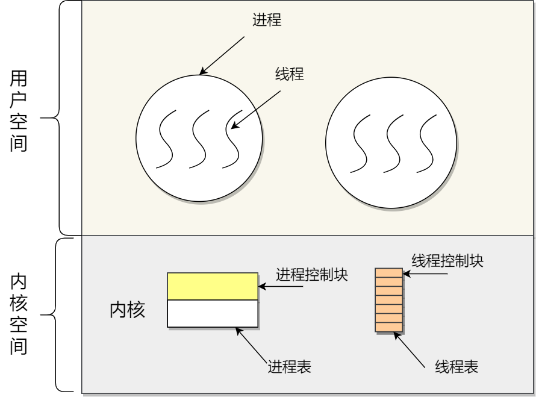

内核线程的**优点**：

- 在一个进程当中，如果某个内核线程发起系统调用而被阻塞，并不会影响其他内核线程的运行；
- 分配给线程，多线程的进程获得更多的 CPU 运行时间；

内核线程的**缺点**：

- 在支持内核线程的操作系统中，由内核来维护进程和线程的上下文信息，如 PCB 和 TCB；
- 线程的创建、终止和切换都是通过系统调用的方式来进行，因此对于系统来说，系统开销比较大；

##### 轻量级进程

**轻量级进程(LWP)是内核支持的用户线程，一个进程可有一个或多个 LWP，每个 LWP 是跟内核线程一对一映射的，也就是 LWP 都是由一个内核线程支持，而且 LWP 是由内核管理并像普通进程一样被调度**。

在大多数系统中，**LWP与普通进程的区别也在于它只有一个最小的执行上下文和调度程序所需的统计信息**。一般来说，一个进程代表程序的一个实例，而 LWP 代表程序的执行线程，因为一个执行线程不像进程那样需要那么多状态信息，所以 LWP 也不带有这样的信息。

在 LWP 之上也是可以**使用用户线程的**，那么 LWP 与用户线程的对应关系就有三种：

- `1 : 1`，即一个 LWP 对应 一个用户线程；
  - 优点：实现并行，当一个 LWP 阻塞，不会影响其他 LWP；
  - 缺点：每一个用户线程，就产生一个内核线程，创建线程的开销较大。

- `N : 1`，即一个 LWP 对应多个用户线程；
  - 优点：用户线程要开几个都没问题，且上下文切换发生用户空间，切换的效率较高；
  - 缺点：一个用户线程如果阻塞了，则整个进程都将会阻塞，另外在多核 CPU 中，是没办法充分利用 CPU 的。

- `M : N`，即多个 LWP 对应多个用户线程；
  - 优点：综合了前两种优点，大部分的线程上下文发生在用户空间，且多个线程又可以充分利用多核 CPU 的资源。


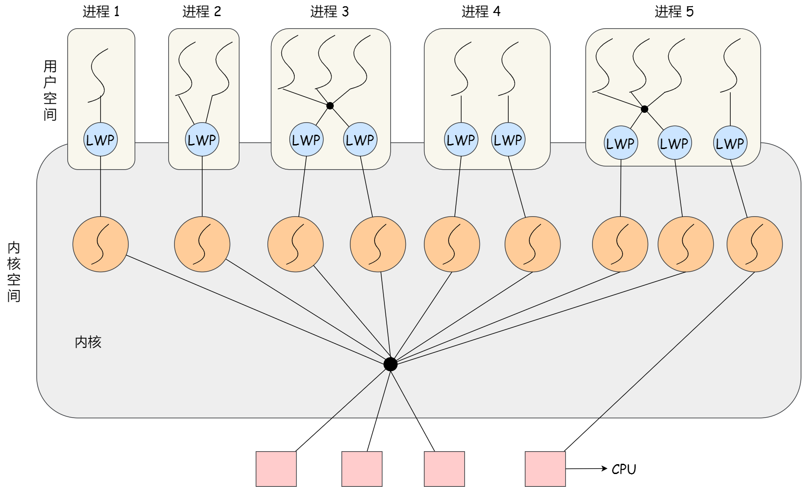

**组合模式**：如上图的进程 5，此进程结合 `1:1` 模型和 `M:N` 模型。开发人员可以针对不同的应用特点调节内核线程的数目来达到物理并行性和逻辑并行性的最佳方案。

#### 线程和进程比较区别


线程与进程的比较如下：

- 进程是资源（包括内存、打开的文件等）分配的单位，线程是 CPU 调度的单位；
- 进程拥有一个完整的资源平台，而线程只独享必不可少的资源，如寄存器和栈；
- 线程同样具有就绪、阻塞、执行三种基本状态，同样具有状态之间的转换关系；
- 线程能减少并发执行的时间和空间开销；

对于，线程相比进程能减少开销，体现在：

- 线程的创建时间比进程快，因为进程在创建的过程中，还需要资源管理信息，比如内存管理信息、文件管理信息，而线程在创建的过程中，不会涉及这些资源管理信息，而是共享它们；
- 线程的终止时间比进程快，因为线程释放的资源相比进程少很多；
- 同一个进程内的线程切换比进程切换快，因为线程具有相同的地址空间（虚拟内存共享），这意味着同一个进程的线程都具有同一个页表，那么在切换的时候不需要切换页表。而对于进程之间的切换，切换的时候要把页表给切换掉，而页表的切换过程开销是比较大的；
- 由于同一进程的各线程间共享内存和文件资源，那么在线程之间数据传递的时候，就不需要经过内核了，这就使得线程之间的数据交互效率更高了；

**所以，不管是时间效率，还是空间效率线程比进程都要高。**

### 多进程*

实现多线程需要注意多线程相互竞争操作共享变量时，由于运气不好，即在执行过程中发生了上下文切换，得到了错误的结果，事实上，每次运行都可能得到不同的结果，因此输出的结果存在**不确定性（indeterminate）**。

由于多线程执行操作共享变量的这段代码可能会导致竞争状态，因此我们将此段代码称为**临界区（critical section），它是访问共享资源的代码片段，一定不能给多线程同时执行。**

我们希望这段代码是**互斥（mutualexclusion）的，也就说保证一个线程在临界区执行时，其他线程应该被阻止进入临界区**，说白了，就是这段代码执行过程中，最多只能出现一个线程。

#### 互斥的概念

上面展示的情况称为**竞争条件（race condition）**，当多线程相互竞争操作共享变量时，由于运气不好，即在执行过程中发生了上下文切换，我们得到了错误的结果，事实上，每次运行都可能得到不同的结果，因此输出的结果存在**不确定性（indeterminate）**。

由于多线程执行操作共享变量的这段代码可能会导致竞争状态，因此我们将此段代码称为**临界区（\*critical section\*），它是访问共享资源的代码片段，一定不能给多线程同时执行。**

我们希望这段代码是**互斥（\*mutualexclusion\*）的，也就说保证一个线程在临界区执行时，其他线程应该被阻止进入临界区**，说白了，就是这段代码执行过程中，最多只能出现一个线程。

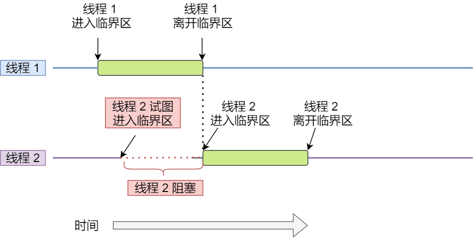

#### 同步的概念

> 同步是为了规范各个线程执行的顺序，让他们依照稳定执行的逻辑执行

互斥解决了并发进程/线程对临界区的使用问题。这种基于临界区控制的交互作用是比较简单的，只要一个进程/线程进入了临界区，其他试图想进入临界区的进程/线程都会被阻塞着，直到第一个进程/线程离开了临界区。

我们都知道在多线程里，**每个线程并不一定是顺序执行的，它们基本是以各自独立的、不可预知的速度向前推进**，但有时候我们又希望多个线程能密切合作，以实现一个共同的任务。

例子，线程 1 是负责读入数据的，而线程 2 是负责处理数据的，**这两个线程是相互合作、相互依赖的。**线程 2 在没有收到线程 1 的唤醒通知时，**就会一直阻塞等待**，当线程 1 读完数据需要把数据传给线程 2 时，线程 1 会唤醒线程 2，并把数据交给线程 2 处理。

**所谓同步，就是并发进程/线程在一些关键点上可能需要互相等待与互通消息，这种相互制约的等待与互通信息称为进程/线程同步**。

举个生活的同步例子，你肚子饿了想要吃饭，你叫妈妈早点做菜，妈妈听到后就开始做菜，但是在妈妈没有做完饭之前，你必须阻塞等待，等妈妈做完饭后，自然会通知你，接着你吃饭的事情就可以进行了。

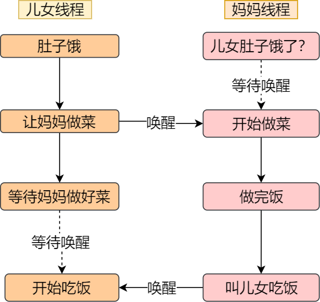

注意，同步与互斥是两种不同的概念：
- 同步就好比：「操作 A 应在操作 B 之前执行」「操作 C 必须在操作 A 和操作 B 都完成之后才能执行」
- 互斥就好比：「操作 A 和操作 B 不能在同一时刻执行」
#### 互斥与同步*

在进程/线程并发执行的过程中，**进程/线程之间存在协作的关系**，例如有互斥、同步的关系。**为了实现进程/线程间正确的协作，操作系统必须提供实现进程协作的措施和方法**，主要的方法有两种：

- 锁：加锁、解锁操作
- 信号量：P、V 操作

这两个都可以方便地实现进程/线程互斥，而信号量比锁的功能更强一些，它还可以方便地实现进程/线程同步

##### 锁

使用**加锁操作和解锁操作可以解决并发线程/进程的互斥问题。**任何想进入临界区的线程，必须先执行加锁操作。**若加锁操作顺利通过，则线程可进入临界区；**在完成对临界资源的访问后再执行解锁操作，以释放该临界资源。

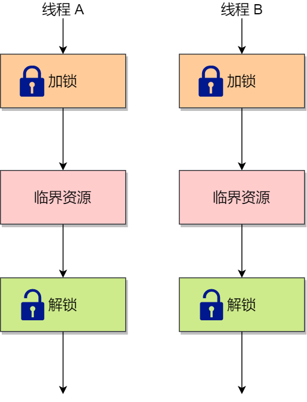

根据锁的实现不同，可以分为「忙等待锁」和「无忙等待锁」。

##### 信号量

信号量是操作系统提供的一种协调共享资源访问的方法。通常**信号量表示资源的数量**，对应的变量是一个整型（`sem`）变量。

另外，还有**两个原子操作的系统调用函数来控制信号量的**，分别是：

- P 操作：将 `sem` 减 `1`，相减后，如果 `sem < 0`，则进程/线程进入阻塞等待，否则继续，表明 P 操作可能会阻塞；
- V 操作：将 `sem` 加 `1`，相加后，如果 `sem <= 0`，唤醒一个等待中的进程/线程，表明 V 操作不会阻塞；

P 操作是用在进入临界区之前，V 操作是用在离开临界区之后，这两个操作是必须成对出现的。

举个类比，2 个资源的信号量，相当于 2 条火车轨道，PV 操作如下图过程：

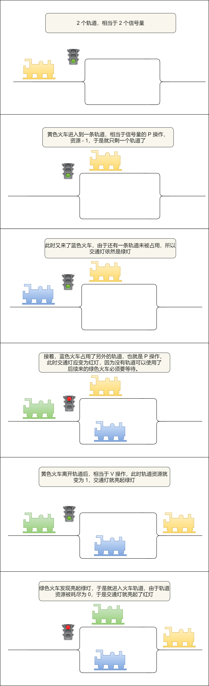

### 经典同步问题*

#### 生产-消费者问题

桌子上有一只盘子，每次只能向其中放入一个水果。爸爸专向盘子中放苹果，妈妈专向盘子中放橘子，儿子专等着吃盘子中的橘子，女儿专等着吃盘子中的苹果。只有盘子空时，爸爸或妈妈才可向盘子中放一个水果。仅当盘子中有自己需要的水果时，儿子或女儿可以从盘子中取出水果。 用PV操作实现上述过程


生产者-消费者问题描述：


- **生产者**在生成数据后，放在一个缓冲区中；
- **消费者**从缓冲区取出数据处理；
- 任何时刻，**只能有一个**生产者或消费者可以访问缓冲区；

我们对问题分析可以得出：

- 任何时刻只能有一个线程操作缓冲区，说明操作缓冲区是临界代码，**需要互斥**；
- 缓冲区空时，消费者必须等待生产者生成数据；缓冲区满时，生产者必须等待消费者取出数据。说明生产者和消费者**需要同步**。

那么我们需要三个信号量，分别是：

- 互斥信号量 `mutex`：用于互斥访问缓冲区，初始化值为 1；
- 资源信号量 `fullBuffers`：用于消费者询问缓冲区是否有数据，有数据则读取数据，初始化值为 0（表明缓冲区一开始为空）；
- 资源信号量 `emptyBuffers`：用于生产者询问缓冲区是否有空位，有空位则生成数据，初始化值为 n （缓冲区大小）；

具体的实现代码：


如果消费者线程一开始执行 `P(fullBuffers)`，由于信号量 `fullBuffers` 初始值为 0，则此时 `fullBuffers` 的值从 0 变为 -1，说明缓冲区里没有数据，消费者只能等待。

接着，轮到生产者执行 `P(emptyBuffers)`，表示减少 1 个空槽，如果当前没有其他生产者线程在临界区执行代码，那么该生产者线程就可以把数据放到缓冲区，放完后，执行 `V(fullBuffers)` ，信号量 `fullBuffers` 从 -1 变成 0，表明有「消费者」线程正在阻塞等待数据，于是阻塞等待的消费者线程会被唤醒。

消费者线程被唤醒后，如果此时没有其他消费者线程在读数据，那么就可以直接进入临界区，从缓冲区读取数据。最后，离开临界区后，把空槽的个数 + 1。

#### 读者-写者问题

「哲学家进餐问题」对于互斥访问有限的竞争问题（如 I/O 设备）一类的建模过程十分有用。

另外，还有个著名的问题是「读者-写者」，它为数据库访问建立了一个模型。

读者只会读取数据，不会修改数据，而写者即可以读也可以修改数据。

读者-写者的问题描述：

- 「读-读」允许：同一时刻，允许多个读者同时读
- 「读-写」互斥：没有写者时读者才能读，没有读者时写者才能写
- 「写-写」互斥：没有其他写者时，写者才能写

接下来，提出几个解决方案来分析分析。

> 方案一

使用信号量的方式来尝试解决：

- 信号量 `wMutex`：控制写操作的互斥信号量，初始值为 1 ；
- 读者计数 `rCount`：正在进行读操作的读者个数，初始化为 0；
- 信号量 `rCountMutex`：控制对 rCount 读者计数器的互斥修改，初始值为 1；

接下来看看代码的实现：

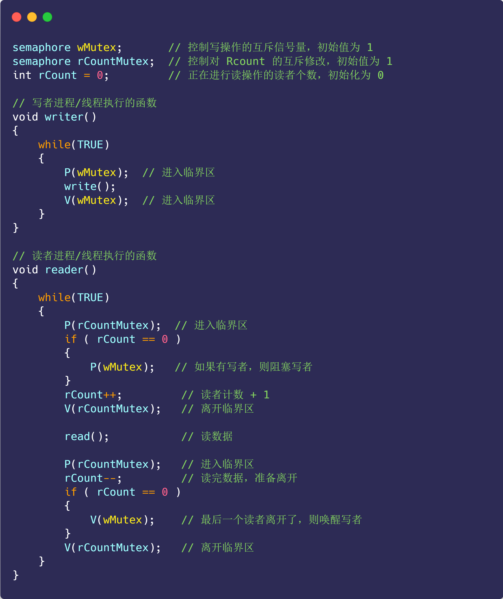

上面的这种实现，是读者优先的策略，因为只要有读者正在读的状态，后来的读者都可以直接进入，如果读者持续不断进入，则写者会处于饥饿状态。

> 方案二

那既然有读者优先策略，自然也有写者优先策略：

- 只要有写者准备要写入，写者应尽快执行写操作，后来的读者就必须阻塞；
- 如果有写者持续不断写入，则读者就处于饥饿；

在方案一的基础上新增如下变量：

- 信号量 `rMutex`：控制读者进入的互斥信号量，初始值为 1；
- 信号量 `wDataMutex`：控制写者写操作的互斥信号量，初始值为 1；
- 写者计数 `wCount`：记录写者数量，初始值为 0；
- 信号量 `wCountMutex`：控制 wCount 互斥修改，初始值为 1；

具体实现如下代码：

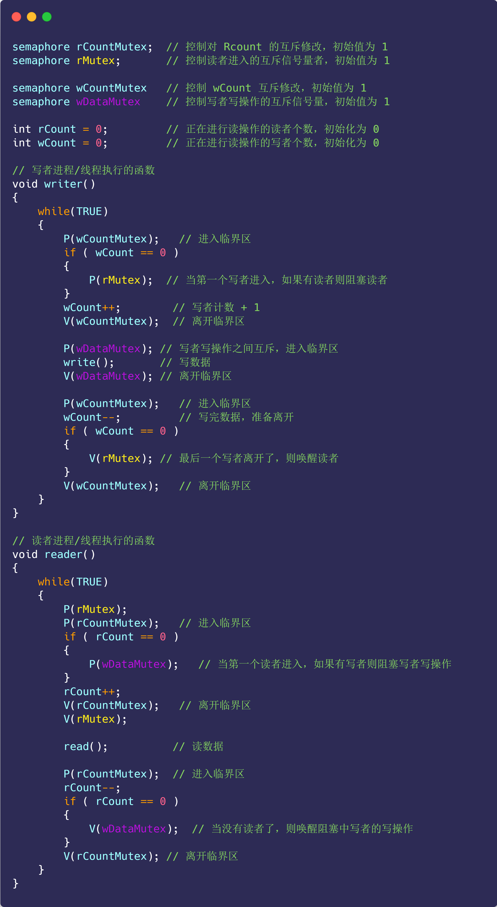

注意，这里 `rMutex` 的作用，开始有多个读者读数据，它们全部进入读者队列，此时来了一个写者，执行了 `P(rMutex)` 之后，后续的读者由于阻塞在 `rMutex` 上，都不能再进入读者队列，而写者到来，则可以全部进入写者队列，因此保证了写者优先。

同时，第一个写者执行了 `P(rMutex)` 之后，也不能马上开始写，必须等到所有进入读者队列的读者都执行完读操作，通过 `V(wDataMutex)` 唤醒写者的写操作。

> 方案三

既然读者优先策略和写者优先策略都会造成饥饿的现象，那么我们就来实现一下公平策略。

公平策略：

- 优先级相同；
- 写者、读者互斥访问；
- 只能一个写者访问临界区；
- 可以有多个读者同时访问临界资源；

具体代码实现：

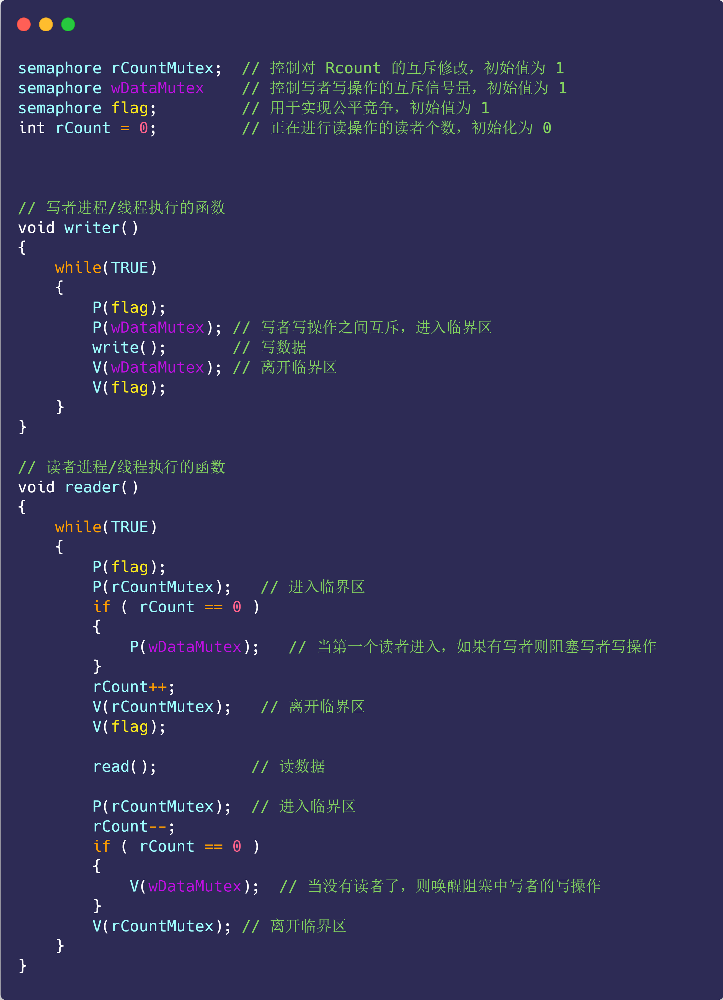

对比方案一的读者优先策略，可以发现，读者优先中只要后续有读者到达，读者就可以进入读者队列， 而写者必须等待，直到没有读者到达。

没有读者到达会导致读者队列为空，即 `rCount==0`，此时写者才可以进入临界区执行写操作。

而这里 `flag` 的作用就是阻止读者的这种特殊权限（特殊权限是只要读者到达，就可以进入读者队列）。

比如：开始来了一些读者读数据，它们全部进入读者队列，此时来了一个写者，执行 `P(falg)` 操作，使得后续到来的读者都阻塞在 `flag` 上，不能进入读者队列，这会使得读者队列逐渐为空，即 `rCount` 减为 0。

这个写者也不能立马开始写（因为此时读者队列不为空），会阻塞在信号量 `wDataMutex` 上，读者队列中的读者全部读取结束后，最后一个读者进程执行 `V(wDataMutex)`，唤醒刚才的写者，写者则继续开始进行写操作。

#### 哲学家-进餐问题

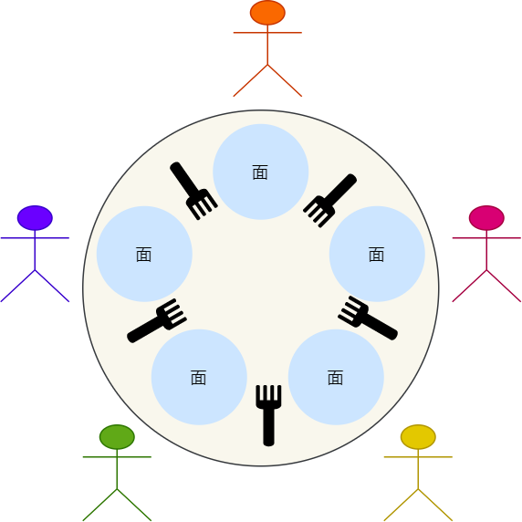

先来看看哲学家就餐的问题描述：

- `5` 个老大哥哲学家，闲着没事做，围绕着一张圆桌吃面；
- 巧就巧在，这个桌子只有 `5` 支叉子，每两个哲学家之间放一支叉子；
- 哲学家围在一起先思考，思考中途饿了就会想进餐；
- **奇葩的是，这些哲学家要两支叉子才愿意吃面，也就是需要拿到左右两边的叉子才进餐**；
- **吃完后，会把两支叉子放回原处，继续思考**；

那么问题来了，如何保证哲学家们的动作有序进行，而不会出现有人永远拿不到叉子呢？

> 方案一

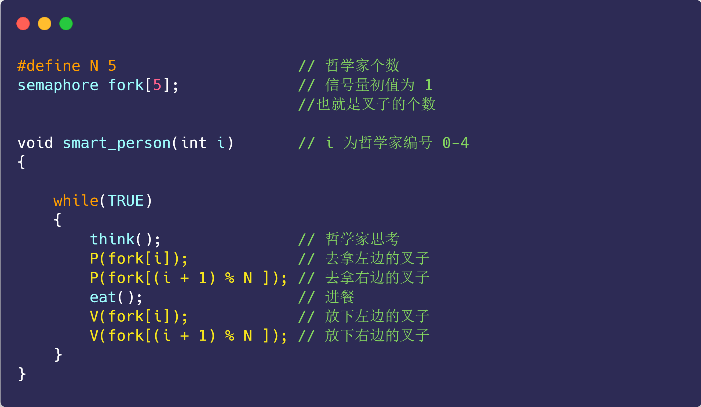

上面的程序，好似很自然。拿起叉子用 P 操作，代表有叉子就直接用，没有叉子时就等待其他哲学家放回叉子。

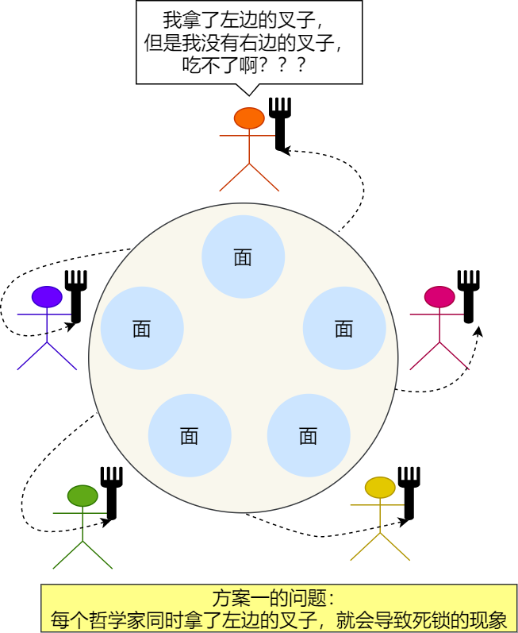

不过，这种解法存在一个极端的问题：**假设五位哲学家同时拿起左边的叉子，桌面上就没有叉子了， 这样就没有人能够拿到他们右边的叉子，也就说每一位哲学家都会在 `P(fork[(i + 1) % N ])` 这条语句阻塞了，很明显这发生了死锁的现象**。

> 方案二

既然「方案一」会发生同时竞争左边叉子导致死锁的现象，那么我们就在拿叉子前，加个互斥信号量，代码如下：

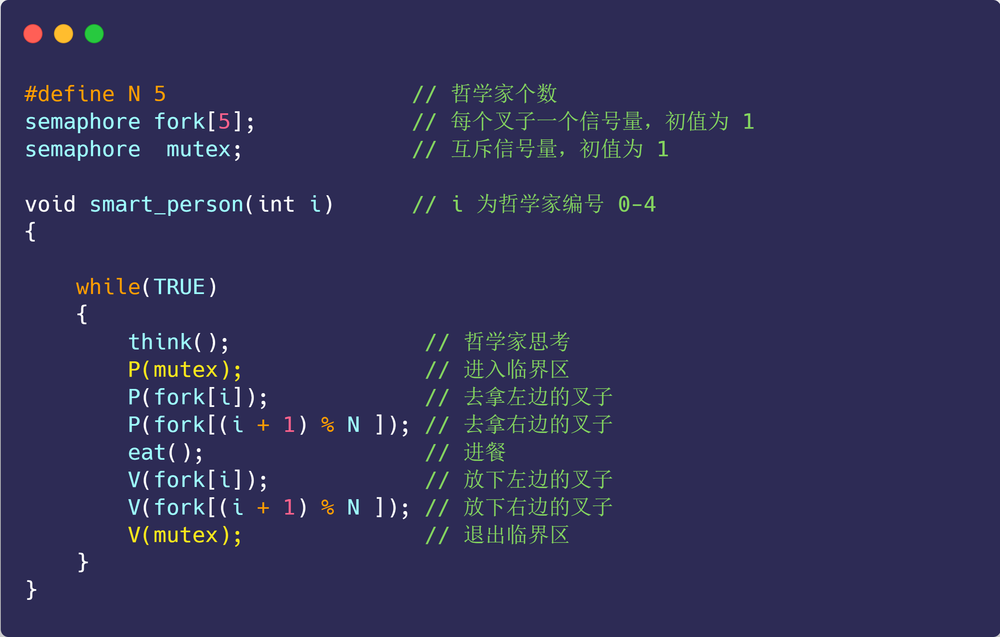

上面程序中的互斥信号量的作用就在于，**只要有一个哲学家进入了「临界区」，也就是准备要拿叉子时，其他哲学家都不能动，只有这位哲学家用完叉子了，才能轮到下一个哲学家进餐。**


方案二虽然能让哲学家们按顺序吃饭，但是每次进餐只能有一位哲学家，而桌面上是有 5 把叉子，按道理是能可以有两个哲学家同时进餐的，所以从效率角度上，这不是最好的解决方案。

> 方案三

那既然方案二使用互斥信号量，会导致只能允许一个哲学家就餐，那么我们就不用它。

另外，方案一的问题在于，会出现所有哲学家同时拿左边刀叉的可能性，那我们就避免哲学家可以同时拿左边的刀叉，采用分支结构，根据哲学家的编号的不同，而采取不同的动作。

**即让偶数编号的哲学家「先拿左边的叉子后拿右边的叉子」，奇数编号的哲学家「先拿右边的叉子后拿左边的叉子」。**

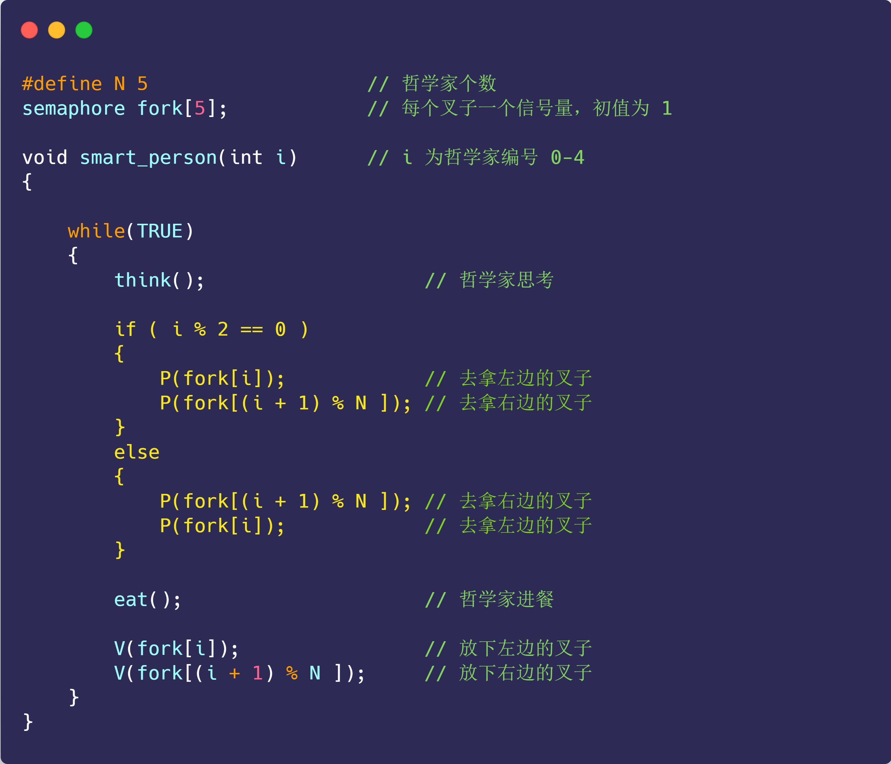

上面的程序，在 P 操作时，根据哲学家的编号不同，拿起左右两边叉子的顺序不同。另外，V 操作是不需要分支的，因为 V 操作是不会阻塞的。

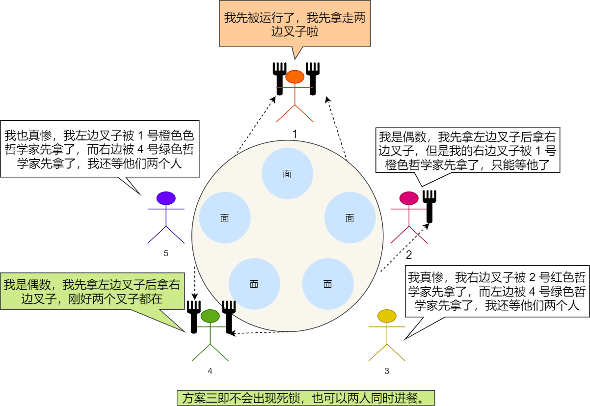

**方案三即不会出现死锁，也可以两人同时进餐。**

> 方案四

在这里再提出另外一种可行的解决方案，我们**用一个数组 state 来记录每一位哲学家的三个状态，分别是在进餐状态、思考状态、饥饿状态（正在试图拿叉子）。**

那么，**一个哲学家只有在两个邻居都没有进餐时，才可以进入进餐状态。**

第 `i` 个哲学家的左邻右舍，则由宏 `LEFT` 和 `RIGHT` 定义：

- LEFT : ( i + 5 - 1 ) % 5
- RIGHT : ( i + 1 ) % 5

比如 i 为 2，则 `LEFT` 为 1，`RIGHT` 为 3。

具体代码实现如下：

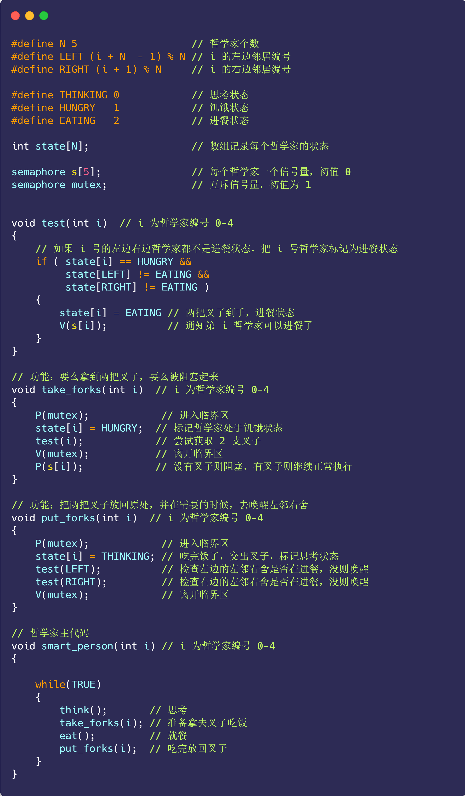

上面的程序使用了一个信号量数组，每个信号量对应一位哲学家，这样在所需的叉子被占用时，想进餐的哲学家就被阻塞。

注意，每个进程/线程将 `smart_person` 函数作为主代码运行，而其他 `take_forks`、`put_forks` 和 `test` 只是普通的函数，而非单独的进程/线程。

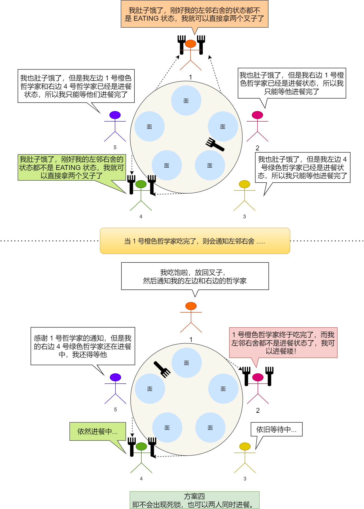

方案四同样不会出现死锁，也可以两人同时进餐。

### 死锁*

> 多进程产生的问题

在多线程编程中，我们为了防止多线程竞争共享资源而导致数据错乱，**都会在操作共享资源之前加上互斥锁，只有成功获得到锁的线程，才能操作共享资源，获取不到锁的线程就只能等待**，直到锁被释放。

那么，当两个线程为了保护两个不同的共享资源而使用了两个互斥锁，那么这两个互斥锁应用不当的时候，可能会造成**两个线程都在等待对方释放锁**，在没有外力的作用下，这些线程会一直相互等待，就没办法继续运行，这种情况就是发生了**死锁**。

举个例子，小林拿了小美房间的钥匙，而小林在自己的房间里，小美拿了小林房间的钥匙，而小美也在自己的房间里。如果小林要从自己的房间里出去，必须拿到小美手中的钥匙，但是小美要出去，又必须拿到小林手中的钥匙，这就形成了死锁。

死锁只有**同时满足**以下四个条件才会发生：

- 互斥条件；
- 持有并等待条件；
- 不可剥夺条件；
- 环路等待条件；

#### 互斥条件

互斥条件是指**多个线程不能同时使用同一个资源**。

比如下图，如果线程 A 已经持有的资源，不能再同时被线程 B 持有，如果线程 B 请求获取线程 A 已经占用的资源，那线程 B 只能等待，直到线程 A 释放了资源。

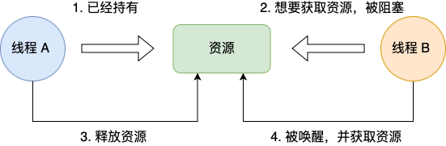

#### 持有并等待条件

持有并等待条件是指，当线程 A 已经持有了资源 1，又想申请资源 2，而资源 2 已经被线程 C 持有了，所以线程 A 就会处于等待状态，但是**线程 A 在等待资源 2 的同时并不会释放自己已经持有的资源 1**。

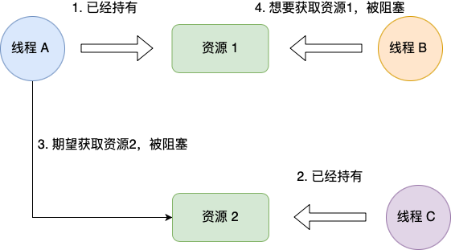

#### 不可剥夺条件

不可剥夺条件是指，当线程已经持有了资源 ，**在自己使用完之前不能被其他线程获取**，线程 B 如果也想使用此资源，则只能在线程 A 使用完并释放后才能获取。

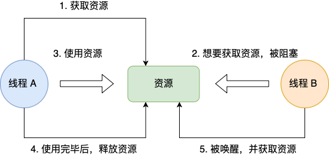

#### 环路等待条件

环路等待条件指的是，在死锁发生的时候，**两个线程获取资源的顺序构成了环形链**。

比如，线程 A 已经持有资源 2，而想请求资源 1， 线程 B 已经获取了资源 1，而想请求资源 2，这就形成资源请求等待的环形图。

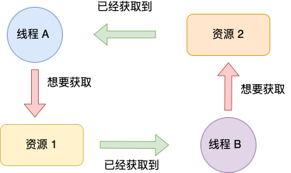

简单来说，死锁问题的产生是由两个或者以上线程并行执行的时候，争夺资源而互相等待造成的。**死锁只有同时满足互斥、持有并等待、不可剥夺、环路等待这四个条件的时候才会发生。**

**所以要避免死锁问题，就是要破坏其中一个条件即可**，最常用的方法就是使用资源有序分配法来破坏环路等待条件。

### 调度*

进程都希望自己能够占用 CPU 进行工作，那么这涉及到前面说过的进程上下文切换。一旦操作系统把进程切换到运行状态，也就意味着该进程占用着 CPU 在执行，**但是当操作系统把进程切换到其他状态时，那就不能在 CPU 中执行了，**于是操作系统会选择下一个要运行的进程。

选择一个进程运行这一功能是在操作系统中完成的，通常称为**调度程序**（这里的进程指只有主线程的进程，所以调度主线程就等于调度了整个进程）。那到底什么时候调度进程，或以什么原则来调度进程呢？

#### 调度时机

在进程的生命周期中，当进程从一个运行状态到另外一状态变化的时候，其实会触发一次调度。

比如，以下状态的变化都会触发操作系统的调度：

- 从就绪态 -> 运行态：当进程被创建时，会进入到就绪队列，操作系统会从就绪队列选择一个进程运行
- 从运行态 -> 阻塞态：当进程发生 I/O 事件而阻塞时，操作系统必须选择另外一个进程运行
- 从运行态 -> 结束态：当进程退出结束后，操作系统得从就绪队列选择另外一个进程运行

因为，这些状态变化的时候，操作系统需要考虑是否要让新的进程给 CPU 运行，或者是否让当前进程从 CPU 上退出来而换另一个进程运行。

另外，如果硬件时钟提供某个频率的周期性中断，那么可以根据如何处理时钟中断 ，把调度算法分为两类：

- **非抢占式调度算法**挑选一个进程，然后让该进程运行直到被阻塞，或者直到该进程退出，才会调用另外一个进程，也就是说不会理时钟中断这个事情。
- **抢占式调度算法**挑选一个进程，然后让该进程只运行某段时间，如果在该时段结束时，该进程仍然在运行时，则会把它挂起，接着调度程序从就绪队列挑选另外一个进程。这种抢占式调度处理，需要在时间间隔的末端发生**时钟中断**，以便把 CPU 控制返回给调度程序进行调度，也就是常说的**时间片机制**。

#### 调度原则

*原则一*：如果运行的程序，发生了 I/O 事件的请求，那 CPU 使用率必然会很低，因为此时进程在阻塞等待硬盘的数据返回。这样的过程，势必会造成 CPU 突然的空闲。所以，**为了提高 CPU 利用率，在这种发送 I/O 事件致使 CPU 空闲的情况下，调度程序需要从就绪队列中选择一个进程来运行。**

*原则二*：有的程序执行某个任务花费的时间会比较长，如果这个程序一直占用着 CPU，会造成系统吞吐量（CPU 在单位时间内完成的进程数量）的降低。所以，**要提高系统的吞吐率，调度程序要权衡长任务和短任务进程的运行完成数量。**

*原则三*：从进程开始到结束的过程中，实际上是包含两个时间，分别是进程运行时间和进程等待时间，这两个时间总和就称为周转时间。进程的周转时间越小越好，**如果进程的等待时间很长而运行时间很短，那周转时间就很长，这不是我们所期望的，调度程序应该避免这种情况发生。**

*原则四*：处于就绪队列的进程，也不能等太久，当然希望这个等待的时间越短越好，这样可以使得进程更快的在 CPU 中执行。所以，**就绪队列中进程的等待时间也是调度程序所需要考虑的原则。**

*原则五*：对于鼠标、键盘这种交互式比较强的应用，我们当然希望它的响应时间越快越好，否则就会影响用户体验了。所以，**对于交互式比较强的应用，响应时间也是调度程序需要考虑的原则。**


针对上面的五种调度原则，总结成如下：

- **CPU 利用率**：调度程序应确保 CPU 是始终匆忙的状态，这可提高 CPU 的利用率；
- **系统吞吐量**：吞吐量表示的是单位时间内 CPU 完成进程的数量，长作业的进程会占用较长的 CPU 资源，因此会降低吞吐量，相反，短作业的进程会提升系统吞吐量；
- **周转时间**：周转时间是进程运行+阻塞时间+等待时间的总和，一个进程的周转时间越小越好；
- **等待时间**：这个等待时间不是阻塞状态的时间，而是进程处于就绪队列的时间，等待的时间越长，用户越不满意；
- **响应时间**：用户提交请求到系统第一次产生响应所花费的时间，在交互式系统中，响应时间是衡量调度算法好坏的主要标准。

说白了，这么多调度原则，目的就是要使得进程要「快」。

#### CPU调度类型

##### **作业调度**

高级调度负责**将作业从外存（辅存）调入内存。**由于内存空间有限，不能将所有作业一次性加载进内存，因此需要**按照一定的规则来决定哪些作业应优先加载。**

- 从外存中的后备队列中挑选作业，将其加载到内存。
- 为每个作业分配内存和其他必要资源，并建立进程控制块（PCB）。
- 作**业调入时会创建PCB，作业完成后会销毁PCB。**

**关注点**：主要关注如何将作业调入内存。调出操作由作业运行结束触发。

##### **内存调度**

**中级调度决定哪些处于挂起状态的进程需要被重新调入内存。**调度的频率高于高级调度，因为一个进程可能被多次调入和调出内存。

- 引入虚拟存储技术后，可以将暂时无法运行的进程转移至外存，待内存有空闲时再调入内存。
- 被挂起的进程状态记录在内存中的PCB中，PCB本身不会被调出内存。PCB包含进程在外存中的位置及状态等信息。
- 操作系统通过内存中的PCB管理挂起队列，维护对进程的监控和管理。

##### **进程调度**

**低级调度负责从就绪队列中选择一个进程，并将处理器分配给它。**是操作系统中最基本的调度类型。

- 根据调度策略选择一个就绪进程，分配CPU资源。
- 进程调度的频率很高，一般在几十毫秒内发生一次。

**关注点**：确保系统中的处理器资源得到有效利用，通过合理的调度策略来优化系统性能。

#### 典型调度算法

不同的调度算法适用的场景也是不同的。接下来，说说在**单核 CPU 系统**中常见的调度算法。

##### 先来先服务调度算法(FCFS)

最简单的一个调度算法，就是非抢占式的**先来先服务（First Come First Serve, FCFS）算法**了。

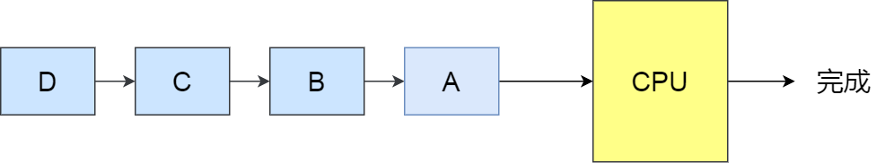

顾名思义，先来后到，**每次从就绪队列选择最先进入队列的进程，然后一直运行，直到进程退出或被阻塞，才会继续从队列中选择第一个进程接着运行。**

这似乎很公平，但是当一个长作业先运行了，那么后面的短作业等待的时间就会很长，**不利于短作业。FCFS 对长作业有利**，适用于 CPU 繁忙型作业的系统，而不适用于 I/O 繁忙型作业的系统。


##### 短作业有限调度算法(SJF)

**最短作业优先（\*Shortest Job First, SJF\*）调度算法**同样也是顾名思义，它会**优先选择运行时间最短的进程来运行**，这有助于提高系统的吞吐量。

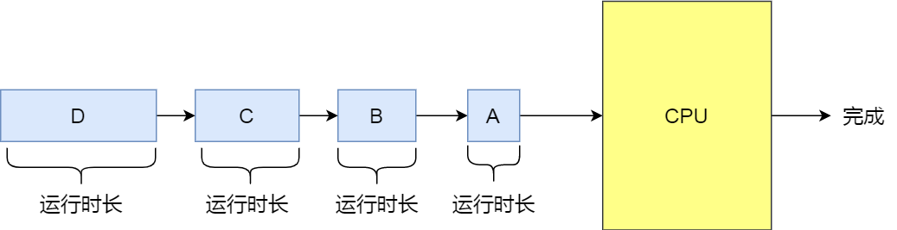

这显然对长作业不利，很容易造成一种极端现象。

比如，一个长作业在就绪队列等待运行，而这个就绪队列有非常多的短作业，那么就会使得长作业不断的往后推，周转时间变长，致使长作业长期不会被运行。


##### 高响应比有限调度算法(HRRN)

前面的「先来先服务调度算法」和「最短作业优先调度算法」都没有很好的权衡短作业和长作业。那么，**高响应比优先 （\*Highest Response Ratio Next, HRRN\*）调度算法**主要是权衡了短作业和长作业。

**每次进行进程调度时，先计算「响应比优先级」，然后把「响应比优先级」最高的进程投入运行**，「响应比优先级」的计算公式：


从上面的公式，可以发现：

- 如果**两个进程的「等待时间」相同时，「要求的服务时间」越短，「响应比」就越高**，这样短作业的进程容易被选中运行；
- 如果**两个进程「要求的服务时间」相同时，「等待时间」越长，「响应比」就越高**，这就兼顾到了长作业进程，因为进程的响应比可以随时间等待的增加而提高，当其等待时间足够长时，其响应比便可以升到很高，从而获得运行的机会；


##### 时间片轮调度算法(RR)

最古老、最简单、最公平且使用最广的算法就是**时间片轮转（\*Round Robin, RR\*）调度算法**。

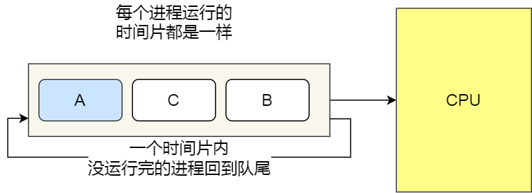

**每个进程被分配一个时间段，称为时间片（\*Quantum\*），即允许该进程在该时间段中运行。**

- 如果**时间片用完，进程还在运行，那么将会把此进程从 CPU 释放出来，并把 CPU 分配给另外一个进程；**
- 如果该进程在时间片结束前阻塞或结束，则 CPU 立即进行切换；

另外，时间片的长度就是一个很关键的点：

- 如果时间片设得太短会导致过多的进程上下文切换，降低了 CPU 效率；
- 如果设得太长又可能引起对短作业进程的响应时间变长。

一般来说，时间片设为 `20ms~50ms` 通常是一个比较合理的折中值。


##### 优先级调度算法(PAS)

前面的「时间片轮转算法」做了个假设，即让所有的进程同等重要，也不偏袒谁，大家的运行时间都一样。

但是，对于多用户计算机系统就有不同的看法了，它们希望调度是有优先级的，即希望调度程序能**从就绪队列中选择最高优先级的进程进行运行，这称为最高优先级（\*Highest Priority First，HPF\*）调度算法**。

进程的优先级可以分为，静态优先级和动态优先级：

- 静态优先级：创建进程时候，就已经确定了优先级了，然后整个运行时间优先级都不会变化；
- 动态优先级：根据进程的动态变化调整优先级，比如如果进程运行时间增加，则降低其优先级，如果进程等待时间（就绪队列的等待时间）增加，则升高其优先级，也就是**随着时间的推移增加等待进程的优先级**。

该算法也有两种处理优先级高的方法，非抢占式和抢占式：

- 非抢占式：当就绪队列中出现优先级高的进程，运行完当前进程，再选择优先级高的进程。
- 抢占式：当就绪队列中出现优先级高的进程，当前进程挂起，调度优先级高的进程运行。

但是依然有缺点，可能会导致低优先级的进程永远不会运行。


##### 多级反馈队列调度算法(MFQ)

**多级反馈队列（\*Multilevel Feedback Queue\*）调度算法**是「时间片轮转算法」和「最高优先级算法」的综合和发展。

顾名思义：

- 「多级」表示有多个队列，每个队列优先级从高到低，同时优先级越高时间片越短。
- 「反馈」表示如果有新的进程加入优先级高的队列时，立刻停止当前正在运行的进程，转而去运行优先级高的队列；

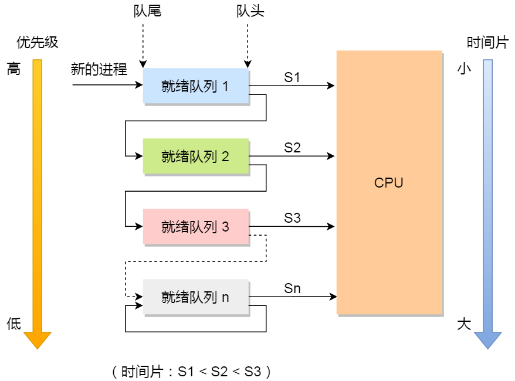

来看看，它是如何工作的：

- 设置了多个队列，赋予每个队列不同的优先级，每个**队列优先级从高到低**，同时**优先级越高时间片越短**；
- 新的进程会被放入到第一级队列的末尾，**按先来先服务的原则排队等待被调度，如果在第一级队列规定的时间片没运行完成，则将其转入到第二级队列的末尾**，以此类推，直至完成；
- 当较高优先级的队列为空，才调度较低优先级的队列中的进程运行。如果进程运行时，有新进程进入较高优先级的队列，则停止当前运行的进程并将其移入到原队列末尾，接着让较高优先级的进程运行；

可以发现，对于短作业可能可以在第一级队列很快被处理完。对于长作业，如果在第一级队列处理不完，可以移入下次队列等待被执行，虽然等待的时间变长了，但是运行时间也变更长了，所以该算法很好的**兼顾了长短作业，同时有较好的响应时间。**


#### 举例说明调度算法

**办理业务的客户相当于进程，银行窗口工作人员相当于 CPU。**

现在，假设这个银行只有一个窗口（单核 CPU ），那么工作人员一次只能处理一个业务。


那么最简单的处理方式，就是先来的先处理，后面来的就乖乖排队，这就是**先来先服务（FCFS）调度算法**。但是万一先来的这位老哥是来贷款的，这一谈就好几个小时，一直占用着窗口，这样后面的人只能干等，或许后面的人只是想简单的取个钱，几分钟就能搞定，却因为前面老哥办长业务而要等几个小时，你说气不气人？


有客户抱怨了，那我们就要改进，我们干脆优先给那些几分钟就能搞定的人办理业务，这就是**短作业优先（SJF）调度算法**。听起来不错，但是依然还是有个极端情况，万一办理短业务的人非常的多，这会导致长业务的人一直得不到服务，万一这个长业务是个大客户，那不就捡了芝麻丢了西瓜


那就公平起见，现在窗口工作人员规定，每个人我只处理 10 分钟。如果 10 分钟之内处理完，就马上换下一个人。如果没处理完，依然换下一个人，**但是客户自己得记住办理到哪个步骤了**。这个也就是**时间片轮转（RR）调度算法**。但是如果时间片设置过短，那么就会**造成大量的上下文切换**，增大了系统开销。如果时间片过长，相当于退化成 FCFS 算法了。


既然公平也可能存在问题，那银行就对客户分等级，分为普通客户、VIP 客户、SVIP 客户。只要高优先级的客户一来，就第一时间处理这个客户，这就是**最高优先级（HPF）调度算法**。但依然也会有极端的问题，万一当天来的全是高级客户，那普通客户不是没有被服务的机会，不把普通客户当人是吗？**那我们把优先级改成动态的，如果客户办理业务时间增加，则降低其优先级，如果客户等待时间增加，则升高其优先级。**


那有没有兼顾到公平和效率的方式呢？这里介绍一种算法，考虑的还算充分的，**多级反馈队列（MFQ）调度算法**，它是**时间片轮转算法和优先级算法的综合和发展。**它的工作方式：

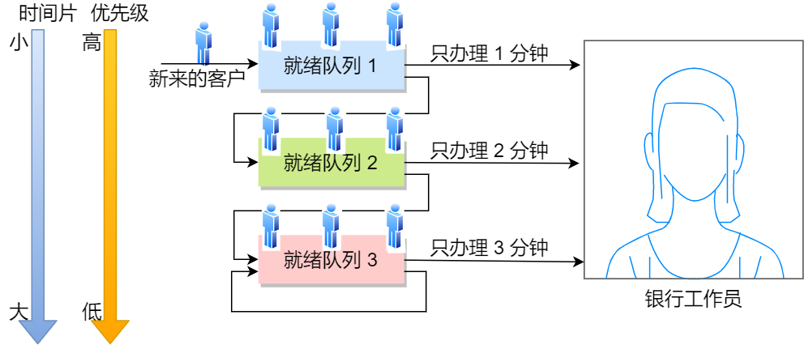

- 银行设置了多个排队（就绪）队列，每个队列都有不同的优先级，**各个队列优先级从高到低**，同时每个队列执行时间片的长度也不同，**优先级越高的时间片越短**。
- 新客户（进程）来了，先进入第一级队列的末尾，按先来先服务原则排队等待被叫号（运行）。如果时间片用完客户的业务还没办理完成，则让客户进入到下一级队列的末尾，以此类推，直至客户业务办理完成。
- 当第一级队列没人排队时，就会叫号二级队列的客户。如果客户办理业务过程中，有新的客户加入到较高优先级的队列，那么此时办理中的客户需要停止办理，回到原队列的末尾等待再次叫号，因为要把窗口让给刚进入较高优先级队列的客户。

可以发现，对于要办理短业务的客户来说，可以很快的轮到并解决。对于要办理长业务的客户，一下子解决不了，就可以放到下一个队列，虽然等待的时间稍微变长了，但是轮到自己的办理时间也变长了，也可以接受，不会造成极端的现象，可以说是综合上面几种算法的优点。

## 第三章 内存管理

在现代操作系统中，进程通常使用的是虚拟内存（Virtual Memory）而不是直接的物理内存。

### 虚拟内存

介绍虚拟内存之前，先介绍**单片机**。对于单片机来说，其中的地址都是直接物理地址。所以每次写完代码，都需要借助工具把程序烧录进去，这样程序才能跑起来。另外，**单片机的 CPU 是直接操作内存的「物理地址」**。


这种情况下，要想在内存中同时运行两个程序是无法达成的，**因为每一次写入都会覆盖之前烧录进物理内存中的地址，运行两个程序会立马崩溃。**

> 于是操作系统使用了虚拟内存在解决这个问题

上述问题中，两个程序都直接引用了物理地址才导致了无法运行，这里需要解决这个问题。

我们可以把**进程所使用的地址隔离**起来，使得操作系统为每一个进程独立分配一套虚拟地址，每一个进程都使用自己的地址，互不干涉。但是**它们都不能直接访问物理地址，然后问题就来到了虚拟地址是怎么落到物理内存上的了。**


**操作系统会提供一种机制，将不同进程的虚拟地址和不同内存的物理地址映射起来。**

如果程序要访问虚拟地址的时候，由操作系统转换成不同的物理地址，这样不同的进程运行的时候，写入的是不同的物理地址，这样就不会冲突了。

于是，这里就引出了两种地址的概念：

- 我们程序所使用的内存地址叫做**虚拟内存地址**
- 实际存在硬件里面的空间地址叫**物理内存地址**

操作系统引入了虚拟内存，进程持有的虚拟地址会通过 **CPU 芯片中的内存管理单元（MMU）的映射关系，来转换变成物理地址**，然后再通过物理地址访问内存，如下图所示：

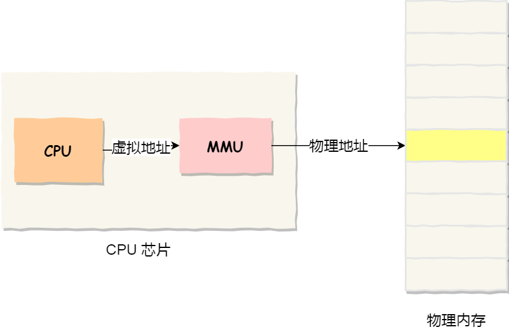

> 操作系统是如何管理虚拟地址与物理地址之间的关系？

主要有两种方式，分别是**内存分段和内存分页**，分段是比较早提出的，我们先来看看内存分段。

### 内存分段

程序是由若干个逻辑分段组成的，如可由代码分段、数据分段、栈段、堆段组成。**不同的段是有不同的属性的，所以就用分段（\*Segmentation\*）的形式把这些段分离出来。**

> 分段机制下，虚拟地址和物理地址是如何映射的？

分段机制下的虚拟地址由两部分组成，**段选择因子**和**段内偏移量**。

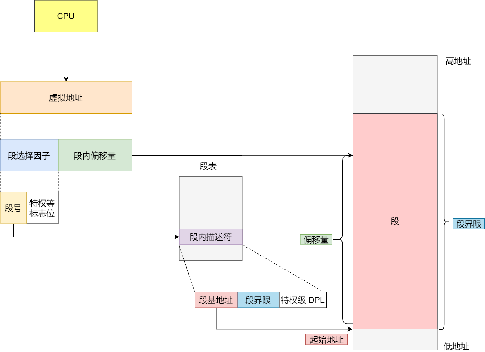

段选择因子和段内偏移量：

- **段选择子**就保存在段寄存器里面。段选择子里面最重要的是**段号**，用作段表的索引。**段表**里面保存的是这个**段的基地址、段的界限和特权等级**等。
- 虚拟地址中的**段内偏移量**应该位于 0 和段界限之间，**如果段内偏移量是合法的，就将段基地址加上段内偏移量得到物理内存地址。**

在上面，知道了虚拟地址是通过**段表**与物理地址进行映射的，分段机制会把程序的虚拟地址分成 4 个段，每个段在段表中有一个项，**在这一项找到段的基地址，再加上偏移量，于是就能找到物理内存中的地址**

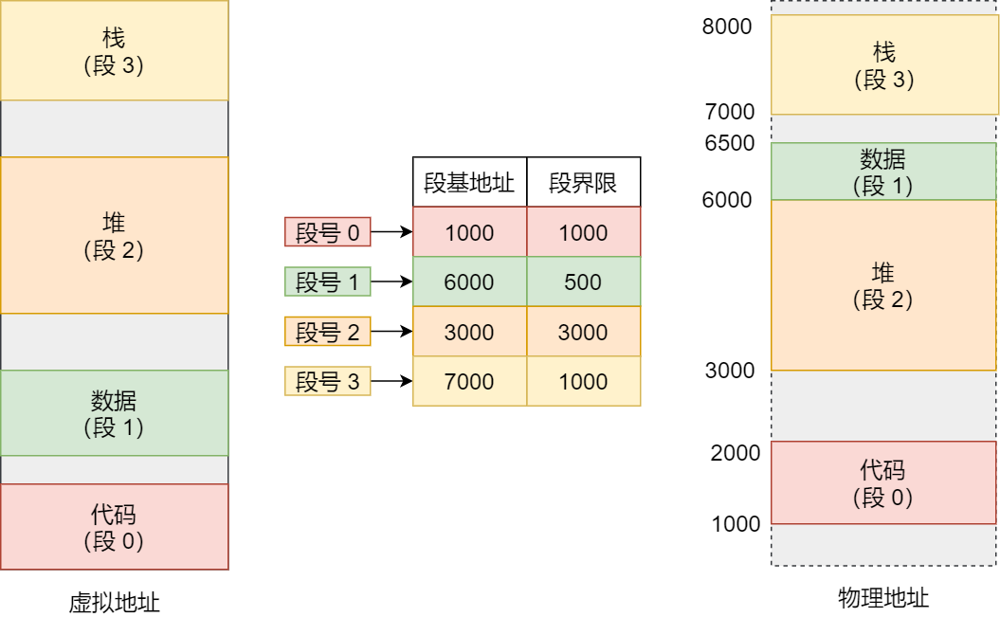

如果要访问段 3 中偏移量 500 的虚拟地址，我们可以计算出物理地址为，段 3 基地址 7000 + 偏移量 500 = 7500。

分段的办法很好，解决了程序本身不需要关心具体的物理内存地址的问题，但它也有一些不足之处：

- 第一个就是**内存碎片**的问题。
- 第二个就是**内存交换的效率低**的问题。

> 我们先来看看，分段为什么会产生内存碎片的问题？

我们来看看这样一个例子。假设有 1G 的物理内存，用户执行了多个程序，其中：

- 游戏占用了 512MB 内存
- 浏览器占用了 128MB 内存
- 音乐占用了 256 MB 内存。

这个时候，如果我们关闭了浏览器，则空闲内存还有 1024 - 512 - 256 = 256MB。

**如果这个 256MB 不是连续的，被分成了两段 128 MB 内存，这就会导致没有空间再打开一个 200MB 的程序。**

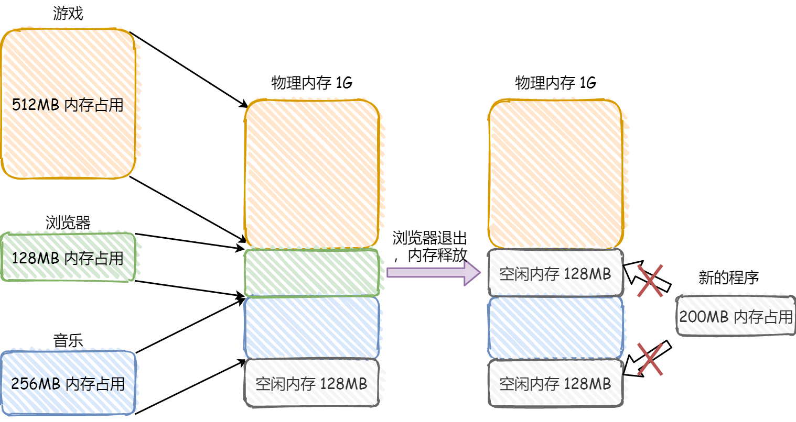

> 内存分段会出现内存碎片吗？

内存碎片主要分为，内部内存碎片和外部内存碎片。

内存分段管理可以做到段根据实际需求分配内存，所以有多少需求就分配多大的段，所以**不会出现内部内存碎片**。但是由于每个段的长度不固定，所以多个段未必能恰好使用所有的内存空间，会产生了多个不连续的小物理内存，导致新的程序无法被装载，所以**会出现外部内存碎片**的问题。

解决「外部内存碎片」的问题就是**内存交换**。

可以把音乐程序占用的那 256MB 内存写到硬盘上，然后再从硬盘上读回来到内存里。不过再读回的时候，我们不能装载回原来的位置，而是紧紧跟着那已经被占用了的 512MB 内存后面。这样就能空缺出连续的 256MB 空间，于是新的 200MB 程序就可以装载进来。

这个内存交换空间，在 Linux 系统里，也就是我们常看到的 **Swap 空间**，这块空间是从硬盘划分出来的，**用于内存与硬盘的空间交换。**

> 分段为什么会导致内存交换效率低的问题？

对于多进程的系统来说，用分段的方式，外部内存碎片是很容易产生的，产生了外部内存碎片，那不得不重新 `Swap` 内存区域，这个过程会产生性能瓶颈。

因为硬盘的访问速度要比内存慢太多了，每一次内存交换，我们都需要把一大段连续的内存数据写到硬盘上。

所以，**如果内存交换的时候，交换的是一个占内存空间很大的程序，这样整个机器都会显得卡顿。**为了解决内存分段的「外部内存碎片和内存交换效率低」的问题，就出现了内存分页。

### 内存分页

分段的好处就是能产生连续的内存空间，但是会出现「外部内存碎片和内存交换的空间太大」的问题。

要解决这些问题，那么就要想出能少出现一些内存碎片的办法。另外，当需要进行内存交换的时候，让需要交换写入或者从磁盘装载的数据更少一点，这样就可以解决问题了。这个办法，也就是**内存分页**（*Paging*）。

**分页是把整个虚拟和物理内存空间切成一段段固定尺寸的大小**。这样一个连续并且尺寸固定的内存空间，我们叫**页**（*Page*）。在 Linux 下，每一页的大小为 `4KB`。**虚拟地址与物理地址之间通过页表来映射**

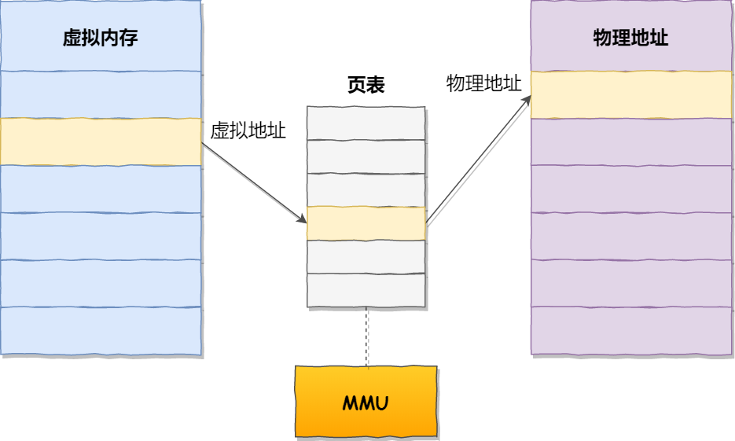

页表是存储在内存里的，**内存管理单元** （*MMU*）就做将虚拟内存地址转换成物理地址的工作。

而当进程访问的虚拟地址在页表中查不到时，系统会产生一个**缺页异常**，进入系统内核空间分配物理内存、更新进程页表，最后再返回用户空间，恢复进程的运行。

> 分页是怎么解决分段的「外部内存碎片和内存交换效率低」的问题？

内存分页由于内存空间都是预先划分好的，也就不会像内存分段一样，在段与段之间会产生间隙非常小的内存，这正是分段会产生外部内存碎片的原因。而**采用了分页，页与页之间是紧密排列的，所以不会有外部碎片。**

但是，因为内存分页机制分配内存的**最小单位是一页**，即使程序不足一页大小，我们最少只能分配一个页，所以**页内会出现内存浪费**，所以针对**内存分页机制会有内部内存碎片**的现象。

如果内存空间不够，操作系统会把其他正在运行的进程中的「最近没被使用」的内存页面给释放掉，也就是暂时写在硬盘上，称为**换出**（*Swap Out*）。一旦需要的时候，再加载进来，称为**换入**（*Swap In*）。所以，一次性写入磁盘的也只有少数的一个页或者几个页，不会花太多时间，**内存交换的效率就相对比较高。**

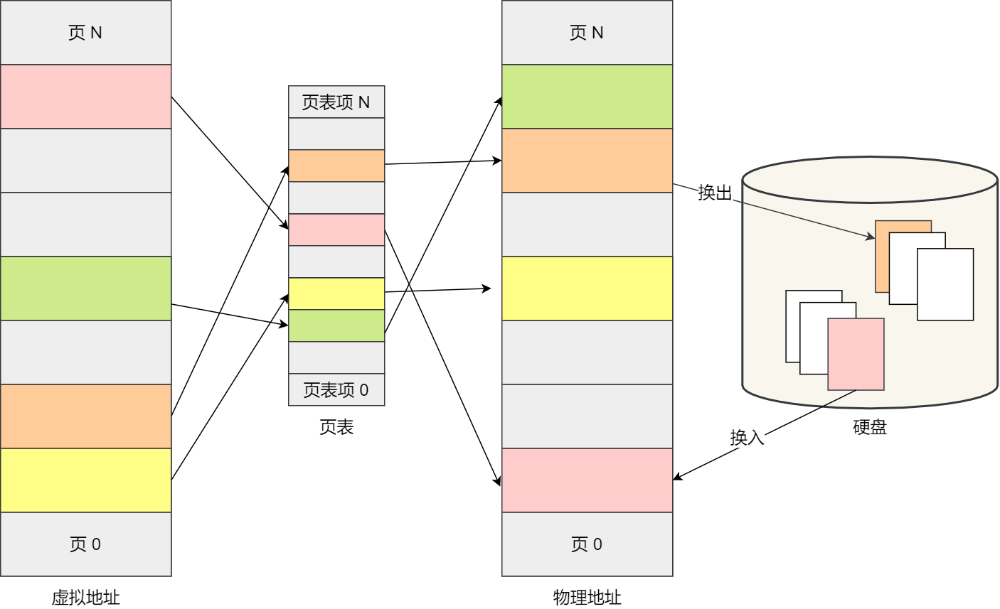

更进一步地，**分页的方式使得我们在加载程序的时候，不再需要一次性都把程序加载到物理内存中。**我们完全可以在进行虚拟内存和物理内存的页之间的映射之后，并不真的把页加载到物理内存里，而是**只有在程序运行中，需要用到对应虚拟内存页里面的指令和数据时，再加载到物理内存里面去。**

> 分页机制下，虚拟地址和物理地址是如何映射的？

在分页机制下，虚拟地址分为两部分，**页号**和**页内偏移**。页号作为页表的索引，**页表**包含物理页每页所在**物理内存的基地址**，这个基地址与页内偏移的组合就形成了物理内存地址，见下图。

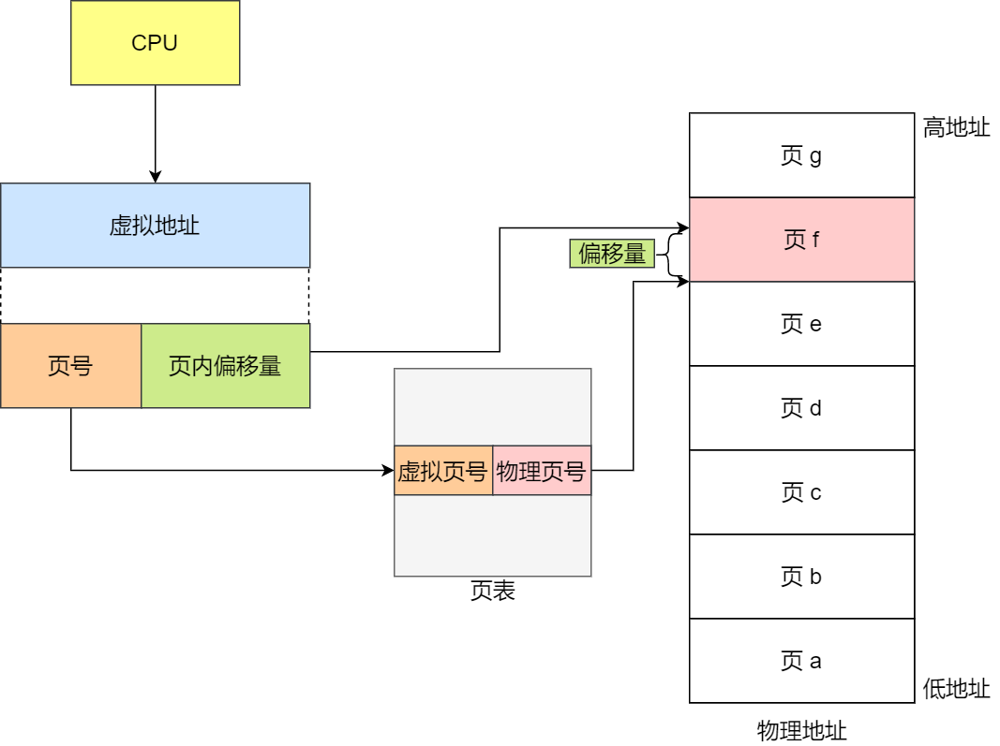

总结一下，对于一个内存地址转换，其实就是这样三个步骤：

- 把虚拟内存地址，**切分成页号和偏移量**；
- 根据页号，从页表里面，**查询对应的物理页号**；
- **直接拿物理页号，加上前面的偏移量，就得到了物理内存地址。**

下面举个例子，虚拟内存中的页通过页表映射为了物理内存中的页，如下图：

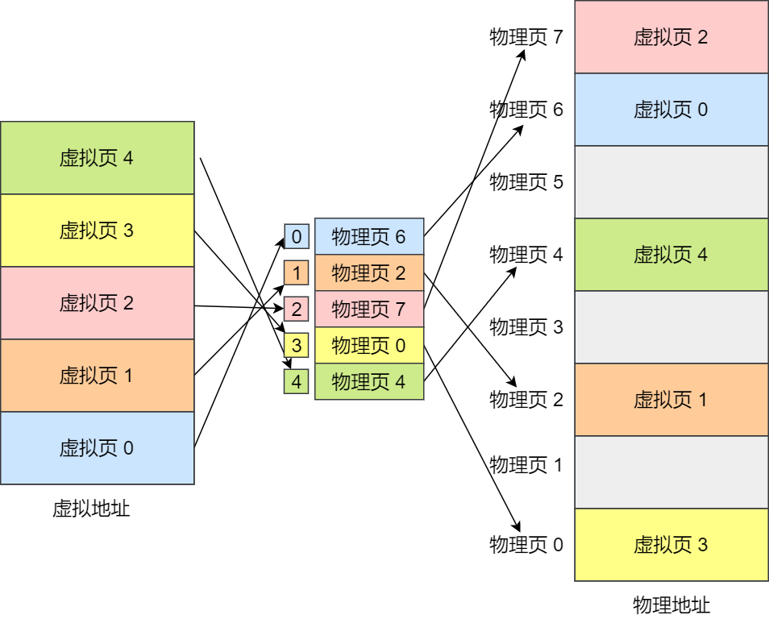

> 简单的分页有什么缺陷吗？

有空间上的缺陷。因为操作系统是可以同时运行非常多的进程的，那这不就意味着页表会非常的庞大。**在 32 位的环境下，虚拟地址空间共有 4GB，假设一个页的大小是 4KB（2^12），那么就需要大约 100 万 （2^20） 个页**，每个「页表项」需要 4 个字节大小来存储，那么整个 4GB 空间的映射就需要有 `4MB` 的内存来存储页表。

这 4MB 大小的页表，看起来也不是很大。但是要知道每个进程都是有自己的虚拟地址空间的，也就说都有自己的页表。**那么，`100` 个进程的话，就需要 `400MB` 的内存来存储页表，这是非常大的内存了，更别说 `64 `位的环境了。**

#### 多级页表

要解决上面的问题，就需要采用一种叫作**多级页表**（*Multi-Level Page Table*）的解决方案。

在前面我们知道了，对于单页表的实现方式，在 32 位和页大小 `4KB` 的环境下，一个进程的页表需要装下 100 多万个「页表项」，并且每个页表项是占用 4 字节大小的，于是相当于每个页表需占用 4MB 大小的空间。

我们把这个 100 多万个「页表项」的单级页表再分页，将页表（一级页表）分为 `1024` 个页表（二级页表），每个表（二级页表）中包含 `1024` 个「页表项」，形成**二级分页**。如下图所示：

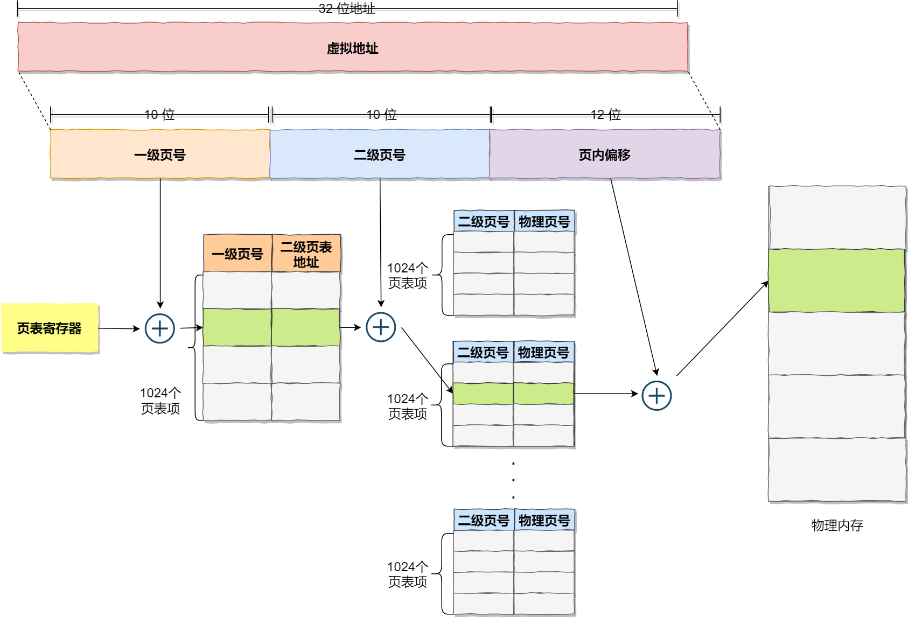

> 分了二级表，映射 4GB 地址空间就需要 4KB（一级页表）+ 4MB（二级页表）的内存，这样占用空间不是更大了吗？

当然如果 4GB 的虚拟地址全部都映射到了物理内存上的话，二级分页占用空间确实是更大了，但是，我们往往不会为一个进程分配那么多内存。

每个进程都有 4GB 的虚拟地址空间，而显然对于大多数程序来说，其使用到的空间远未达到 4GB，因为会存在部分对应的页表项都是空的，根本没有分配，对于已分配的页表项，如果存在最近一定时间未访问的页表，**在物理内存紧张的情况下，操作系统会将页面换出到硬盘，也就是说不会占用物理内存。**

如果使用了二级分页，一级页表就可以覆盖整个 4GB 虚拟地址空间，但**如果某个一级页表的页表项没有被用到，也就不需要创建这个页表项对应的二级页表了，即可以在需要时才创建二级页表**。做个简单的计算，假设只有 20% 的一级页表项被用到了，那么页表占用的内存空间就只有 4KB（一级页表） + 20% * 4MB（二级页表）= `0.804MB`，这对比单级页表的 `4MB` 是不是一个巨大的节约？

> 那么为什么不分级的页表就做不到这样节约内存呢？

我们从页表的性质来看，**保存在内存中的页表承担的职责是将虚拟地址翻译成物理地址。**假如虚拟地址在页表中找不到对应的页表项，计算机系统就不能工作了。所以**页表一定要覆盖全部虚拟地址空间，不分级的页表就需要有 100 多万个页表项来映射，而二级分页则只需要 1024 个页表项**（此时一级页表覆盖到了全部虚拟地址空间，二级页表在需要时创建）。

我们把二级分页再推广到多级页表，就会发现页表占用的内存空间更少了，这一切都要归功于对局部性原理的充分应用。

对于 64 位的系统，两级分页肯定不够了，就变成了四级目录，分别是：

- 全局页目录项 PGD
- 上层页目录项 PUD
- 中间页目录项 PMD
- 页表项 PTE

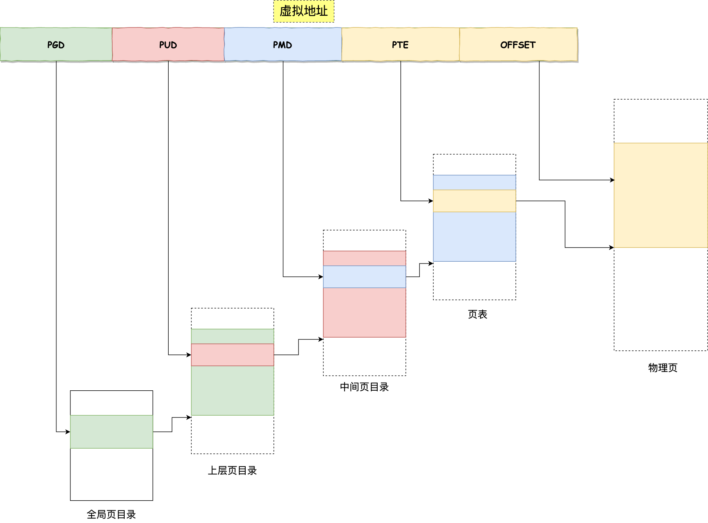

#### TLB

多级页表虽然解决了空间上的问题，但是虚拟地址到物理地址的转换就多了几道转换的工序，这显然就降低了这俩地址转换的速度，也就是**带来了时间上的开销**。程序是有局部性的，即在一段时间内，整个程序的执行仅限于程序中的某一部分。相应地，**执行所访问的存储空间也局限于某个内存区域。**

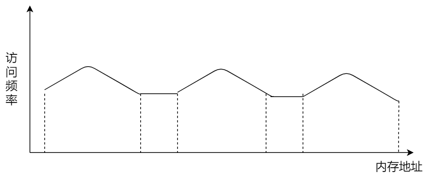

我们就可以利用这一特性，**把最常访问的几个页表项存储到访问速度更快的硬件**，于是计算机科学家们，就在 CPU 芯片中，**加入了一个专门存放程序最常访问的页表项的 Cache**，这个 Cache 就是 TLB ，通常称为**页表缓存、转址旁路缓存、快表**等。

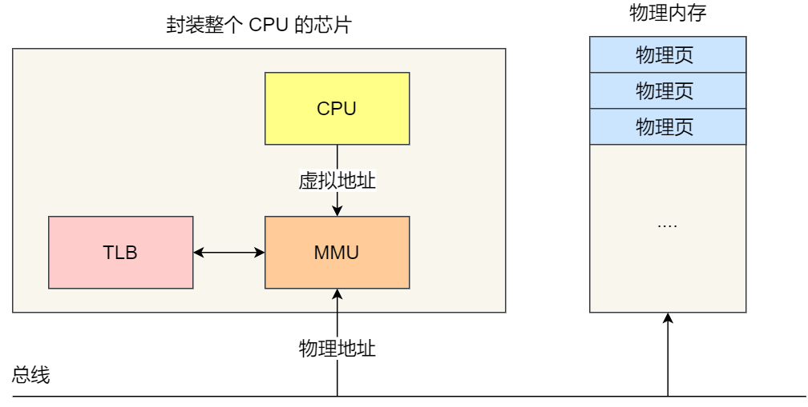

在 CPU 芯片里面，**封装了内存管理单元芯片**，它用来完成地址转换和 TLB 的访问与交互。有了 TLB 后，那么 CPU 在寻址时，会先查 TLB，如果没找到，才会继续查常规的页表。**TLB 的命中率其实是很高的，因为程序最常访问的页就那么几个。**

### 段页式内存管理*

> 段页结合

内存分段和内存分页并不是对立的，它们是可以组合起来在同一个系统中使用的，那么组合起来后，通常称为**段页式内存管理**。


段页式内存管理实现的方式：

- 先将程序划分为多个有逻辑意义的段，也就是前面提到的分段机制；
- 接着再把每个段划分为多个页，也就是对分段划分出来的连续空间，再划分固定大小的页；

这样，地址结构就由**段号、段内页号和页内位移**三部分组成。用于段页式地址变换的数据结构是**每一个程序一张段表，每个段又建立一张页表**，段表中的地址是页表的起始地址，而页表中的地址则为某页的物理页号，如图所示：

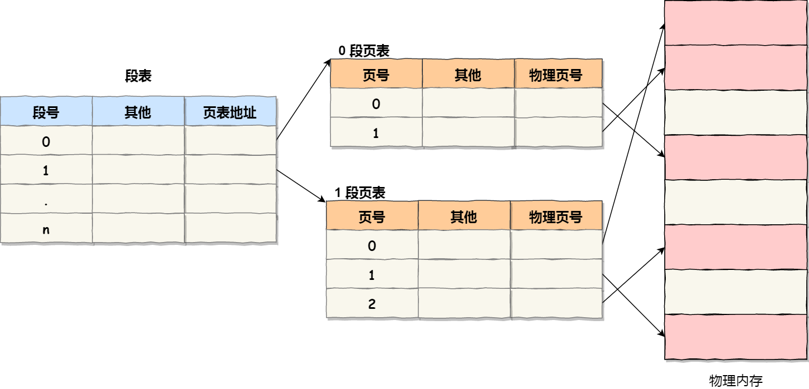

段页式地址变换中要得到物理地址须经过三次内存访问：

- 第一次访问段表，得到页表起始地址；
- 第二次访问页表，得到物理页号；
- 第三次将物理页号与页内位移组合，得到物理地址。

**可用软、硬件相结合的方法实现段页式地址变换**，这样虽然增加了硬件成本和系统开销，但提高了内存的利用率。

### 内存分配与回收

应用程序通过 malloc 函数申请内存的时候，**实际上申请的是虚拟内存**，此时并不会分配物理内存。

当应用程序读写了这块虚拟内存，CPU 就会去访问这个虚拟内存， 这时会发现这个虚拟内存没有映射到物理内存， **CPU 就会产生缺页中断**，进程会从用户态切换到内核态，并将缺页中断交给内核的 Page Fault Handler （缺页中断函数）处理。

缺页中断处理函数会看是否有空闲的物理内存，如果有，就直接分配物理内存，并建立虚拟内存与物理内存之间的映射关系。如果没有空闲的物理内存，那么内核就会开始进行**回收内存**的工作，回收的方式主要是两种：直接内存回收和后台内存回收。

- **后台内存回收**（kswapd）：在物理内存紧张的时候，会唤醒 kswapd 内核线程来回收内存，这个回收内存的过程**异步**的，不会阻塞进程的执行。
- **直接内存回收**（direct reclaim）：如果后台异步回收跟不上进程内存申请的速度，就会开始直接回收，这个回收内存的过程是**同步**的，会阻塞进程的执行。

如果直接内存回收后，空闲的物理内存仍然无法满足此次物理内存的申请，那么内核就会放最后的大招了 ——**触发 OOM （Out of Memory）机制**。

OOM Killer 机制会根据算法选择一个占用物理内存较高的进程，然后将其杀死，以便释放内存资源，如果物理内存依然不足，OOM Killer 会继续杀死占用物理内存较高的进程，直到释放足够的内存位置。

申请物理内存的过程如下图：

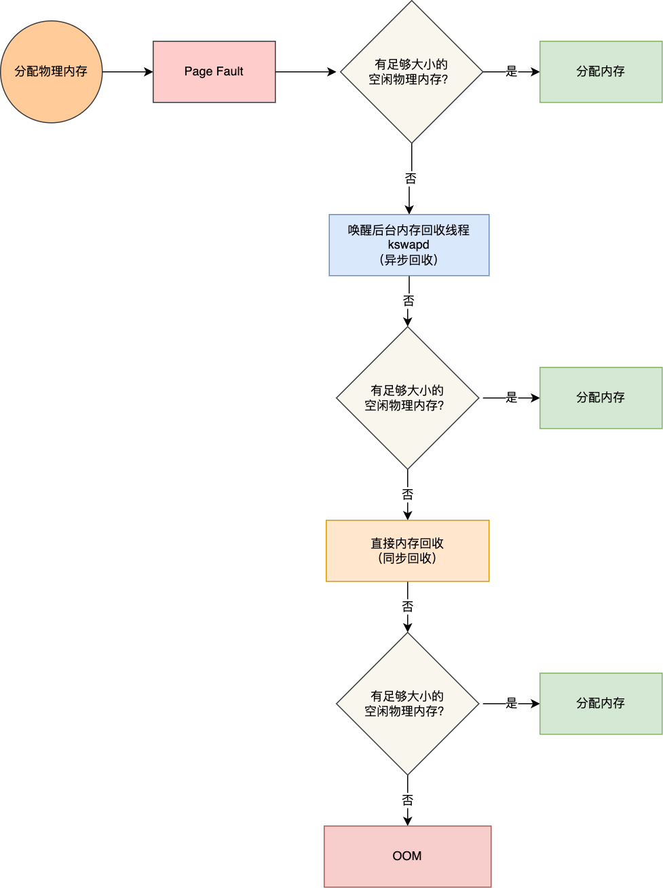

#### 哪些内存可以被回收

系统内存紧张的时候，就会进行回收内存的工作，那具体哪些内存是可以被回收的呢？

主要有两类内存可以被回收，而且它们的回收方式也不同。

- **文件页**（File-backed Page）：内核缓存的磁盘数据（Buffer）和内核缓存的文件数据（Cache）都叫作文件页。大部分文件页，都可以直接释放内存，以后有需要时，再从磁盘重新读取就可以了。而那些被应用程序修改过，并且暂时还没写入磁盘的数据（也就是脏页），就得先写入磁盘，然后才能进行内存释放。所以，**回收干净页的方式是直接释放内存，回收脏页的方式是先写回磁盘后再释放内存**。
- **匿名页**（Anonymous Page）：这部分内存没有实际载体，不像文件缓存有硬盘文件这样一个载体，比如堆、栈数据等。这部分内存很可能还要再次被访问，所以不能直接释放内存，它们**回收的方式是通过 Linux 的 Swap 机制**，Swap 会把不常访问的内存先写到磁盘中，然后释放这些内存，给其他更需要的进程使用。再次访问这些内存时，重新从磁盘读入内存就可以了。

文件页和匿名页的回收都是基于 LRU 算法，也就是优先回收不常访问的内存。LRU 回收算法，实际上维护着 active 和 inactive 两个双向链表，其中：

- **active_list** 活跃内存页链表，这里存放的是最近被访问过（活跃）的内存页；
- **inactive_list** 不活跃内存页链表，这里存放的是很少被访问（非活跃）的内存页；

越接近链表尾部，就表示内存页越不常访问。这样，在回收内存时，系统就可以根据活跃程度，优先回收不活跃的内存。

活跃和非活跃的内存页，按照类型的不同，又分别分为文件页和匿名页。可以从 /proc/meminfo 中，查询它们的大小，比如：

```shell
# grep表示只保留包含active的指标（忽略大小写）
# sort表示按照字母顺序排序
[root@xiaolin ~]# cat /proc/meminfo | grep -i active | sort
Active:           901456 kB
Active(anon):     227252 kB
Active(file):     674204 kB
Inactive:         226232 kB
Inactive(anon):    41948 kB
Inactive(file):   184284 kB
```

#### 回收内存带来的性能影响

在前面我们知道了回收内存有两种方式。

- 一种是后台内存回收，也就是唤醒 kswapd 内核线程，这种方式是异步回收的，不会阻塞进程。
- 一种是直接内存回收，这种方式是同步回收的，会阻塞进程，这样就会造成很长时间的延迟，以及系统的 CPU 利用率会升高，最终引起系统负荷飙高。

可被回收的内存类型有文件页和匿名页：

- 文件页的回收：对于干净页是直接释放内存，这个操作不会影响性能，而对于脏页会先写回到磁盘再释放内存，这个操作会发生磁盘 I/O 的，这个操作是会影响系统性能的。
- 匿名页的回收：如果开启了 Swap 机制，那么 Swap 机制会将不常访问的匿名页换出到磁盘中，下次访问时，再从磁盘换入到内存中，这个操作是会影响系统性能的。

可以看到，回收内存的操作基本都会发生磁盘 I/O 的，如果回收内存的操作很频繁，意味着磁盘 I/O 次数会很多，这个过程势必会影响系统的性能，整个系统给人的感觉就是很卡。

### 内存页面置换算法

**内存页面**是用于映射虚拟内存到物理内存的基本单位。每个内存页面代表虚拟地址空间中的一个固定大小的块，并映射到物理内存中的一个页面框。每一个进程都由一个独一的内存页面。

**内存页面置换**的主要目的是在物理内存不足时，动态管理虚拟内存的使用，从而确保系统能够高效地运行多个进程。**当物理内存不够时，操作系统将不活跃的页面从物理内存移到磁盘的交换空间，以释放物理内存，然后将需要的页面加载到物理内存中。**

#### 最佳置换算法(OPT)*

最佳页面置换算法的基本思路是，**置换在未来最长时间不访问的页面**该算法需要计算内存中每一个逻辑页面的下一次访问时间，然后比较，选择未来最长时间不访问的页面

假设一开始有 3 个空闲的物理页，然后有请求的页面序列，那它的置换过程如下图：

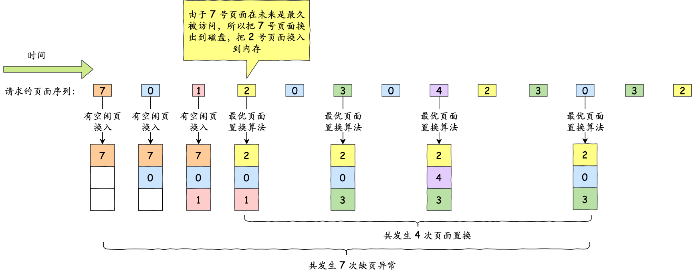

在这个请求的页面序列中，缺页共发生了 `7` 次（空闲页换入 3 次 + 最优页面置换 4 次），页面置换共发生了 `4` 次。

这很理想，但是实际系统中无法实现，因为程序访问页面时是动态的，我们是无法预知每个页面在「下一次」访问前的等待时间。所以，最佳页面置换算法作用是为了衡量你的算法的效率，你的算法效率越接近该算法的效率，那么说明你的算法是高效的。

#### 先进先出算法(FIFO)

既然我们无法预知页面在下一次访问前所需的等待时间，那我们可以**选择在内存驻留时间很长的页面进行中置换**，这个就是「先进先出置换」算法的思想。还是以前面的请求的页面序列作为例子，假设使用先进先出置换算法，则过程如下图：

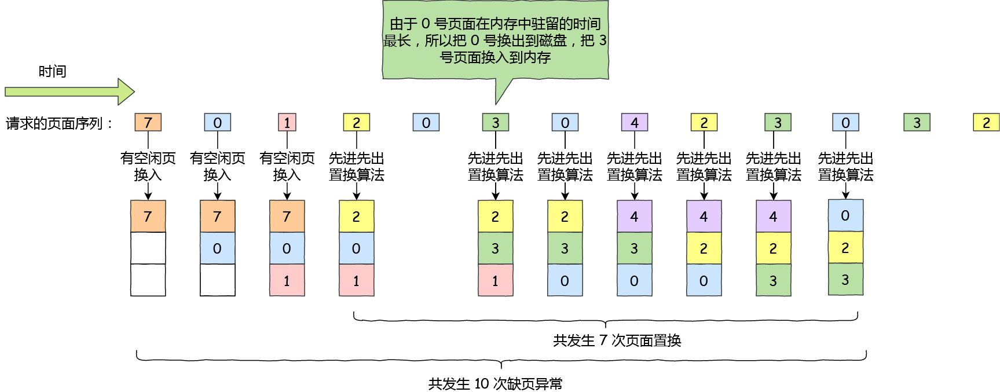

在这个请求的页面序列中，缺页共发生了 `10` 次，页面置换共发生了 `7` 次，跟最佳页面置换算法比较起来，性能明显差了很多。

#### 最近最久未使用算法(LRU)

最近最久未使用（*LRU*）的置换算法的基本思路是，发生缺页时，**选择最长时间没有被访问的页面进行置换**，也就是说，该算法假设已经很久没有使用的页面很有可能在未来较长的一段时间内仍然不会被使用。

这种算法近似最优置换算法，最优置换算法是通过「未来」的使用情况来推测要淘汰的页面，**而 LRU 则是通过「历史」的使用情况来推测要淘汰的页面。**还是以前面的请求的页面序列作为例子，假设使用最近最久未使用的置换算法，则过程如下图：

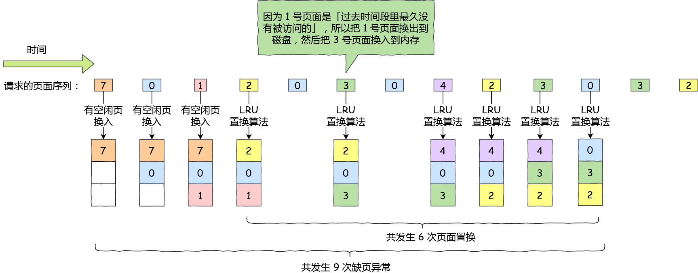

在这个请求的页面序列中，缺页共发生了 `9` 次，页面置换共发生了 `6` 次，跟先进先出置换算法比较起来，性能提高了一些。

虽然 LRU 在理论上是可以实现的，但代价很高。**为了完全实现 LRU，需要在内存中维护一个所有页面的链表，最近最多使用的页面在表头，最近最少使用的页面在表尾。**困难的是，在每次访问内存时都必须要**更新「整个链表」。**在链表中找到一个页面，删除它，然后把它移动到表头是一个非常费时的操作。

所以，LRU 虽然看上去不错，但是由于开销比较大，实际应用中比较少使用。

#### 时钟置换算法(CLOCK)

该算法的思路是，把所有的页面都保存在一个类似钟面的**「环形链表」**中，一个表针指向最老的页面。当发生缺页中断时，算法首先检查表针指向的页面：

- 如果它的**访问位位是 0 就淘汰该页面**，并把新的页面插入这个位置，然后把表针前移一个位置
- 如果**访问位是 1 就清除访问位**，并把表针前移一个位置，重复这个过程直到找到了一个访问位为 0 的页面为止

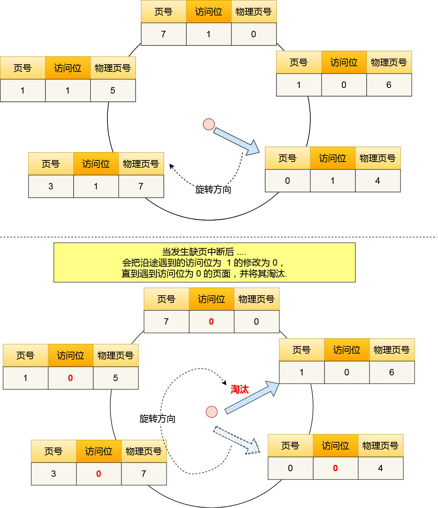

了解了这个算法的工作方式，就明白为什么它被称为时钟（*Clock*）算法了。

> 页面置换算法：改进型CLOCK算法
>
> 

### [内存问题](https://rengwuxian.com/memory-churn/)

#### 内存抖动

在程序中，**每次创建一个对象，都会为它分配一块内存**；随着更多对象的创建，程序可用的内存逐渐减少。当已使用的内存达到一定阈值时，**垃圾回收器（Garbage Collector，GC）会启动，**回收不再使用的内存。在 Android 中，`View.onDraw()` 方法每次重绘界面时都会被调用，这意味着如果在 `onDraw()` 中编写了创建对象的代码，**那么在界面频繁刷新时，这些代码会反复创建大量的临时对象。这会导致内存使用快速上升**，并很快触发 GC 回收这些短暂的对象。

**频繁创建和回收对象并不是问题本身**。问题在于，当对象频繁创建导致内存迅速增加，**而 GC 紧接着进行回收后，内存又会迅速上升。**这种反复的过程会导致内存不断在增长和回收之间波动，形成了一种短时间内频繁发生的循环。

这种现象被称为 **内存抖动（Memory Churn）**。内存抖动不是指内存本身在震荡，而是描述内存频繁分配和回收所引起的波动和资源消耗。Android 官方文档也将其翻译为“内存抖动”。

> 抖动预防方法

- **减少短生命周期对象的创建**：使用对象池复用对象。避免在频繁调用的方法中创建对象。
- **优化内存使用**：避免不必要的对象分配。使用合适的数据结构，控制数据结构的大小。
- **改进代码设计**：选择高效算法，减少临时对象的生成。合并小对象，减少内存碎片。
- **使用内存分析工具**：监控内存使用，检测内存泄漏。进行内存优化和问题修复。
- **调整垃圾回收策略**：选择合适的GC算法。调整GC配置，优化内存管理。
- **避免频繁的UI更新**：减少UI对象创建，复用UI元素。优化渲染操作，减少对象创建开销。

#### 工作集

工作集（或驻留集）是指在某段时间间隔内，进程要访问的页面集合。经常被使用的页面需要在工作集中，而长时间不被使用的页面要从工作集中被丢弃。为了防止系统出现抖动现象，需要选择合适的工作集大小。

工作集模型的原理是：让操作系统跟踪每个进程的工作集，并为进程分配大于其工作集的物理块。如果还有空闲物理块，则可以再调一个进程到内存以增加多道程序。如果所有工作集之和增加以至于超过了可用物理块的总数，那么操作系统会暂停一个进程，将其页面调出并且将其他物理块分配给其他进程，防止出现抖动现象。

正确选择工作集的大小，对存储器的利用率和系统吞吐量的提高都将产生重要影响。

## [第四章 文件管理](https://www.cnblogs.com/cxuanBlog/p/12565601.html)

### 文件

文件是一种抽象机制，它提供了一种方式用来存储信息以及在后面进行读取。可能任何一种机制最重要的特性就是管理对象的命名方式。在创建一个文件后，它会给文件一个命名。当进程终止时，文件会继续存在，并且其他进程可以使用`名称访问该文件`。

文件命名规则对于不同的操作系统来说是不一样的，但是所有现代操作系统都允许使用 1 - 8 个字母的字符串作为合法文件名。

某些文件区分大小写字母，而大多数则不区分。`UNIX` 属于第一类；历史悠久的 `MS-DOS` 属于第二类（顺便说一句，尽管 MS-DOS 历史悠久，但 MS-DOS 仍在嵌入式系统中非常广泛地使用，因此它绝不是过时的）；因此，UNIX 系统会有三种不同的命名文件：`maria`、`Maria`、`MARIA` 。在 MS-DOS ，所有这些命名都属于相同的文件。


这里可能需要在文件系统上预留一个位置。Windows 95 和 Windows 98 都使用了 MS-DOS 文件系统，叫做 `FAT-16`，因此继承了它的一些特征，例如有关文件名的构造方法。Windows 98 引入了对 FAT-16 的一些扩展，从而导致了 `FAT-32` 的生成，但是这两者很相似。另外，Windows NT，Windows 2000，Windows XP，Windows Vista，Windows 7 和 Windows 8 都支持 `FAT` 文件系统，这种文件系统有些过时。然而，这些较新的操作系统还具有更高级的`本机文件系统(NTFS)`，有不同的特性，那就是基于 `Unicode` 编码的文件名。事实上，Windows 8 还配备了另一种文件系统，简称 `ReFS(Resilient File System)`，但这个文件系统一般应用于 Windows 8 的服务器版本。下面除非我们特殊声明，否则我们在提到 MS-DOS 和 FAT 文件系统的时候，所指的就是 Windows 的 FAT-16 和 FAT-32。这里要说一下，有一种类似 FAT 的新型文件系统，叫做 `exFAT`。它是微软公司对闪存和大文件系统开发的一种优化的 FAT 32 扩展版本。ExFAT 是现在微软唯一能够满足 `OS X`读写操作的文件系统。

许多操作系统支持两部分的文件名，它们之间用 `.` 分隔开，比如文件名 `prog.c`。原点后面的文件称为 `文件扩展名(file extension)` ，文件扩展名通常表示文件的一些信息。例如在 MS-DOS 中，文件名是 1 - 8 个字符，加上 1 - 3 个字符的可选扩展名组成。在 UNIX 中，如果有扩展名，那么扩展名的长度将由用户来决定，一个文件甚至可以包括两个或更多的扩展名，例如 `homepage.html.zip`，html 表示一个 web 网页而 .zip 表示文件`homepage.html` 已经采用 zip 程序压缩完成。一些常用的文件扩展名以及含义如下图所示

| bak  | 备份文件                             |
| ---- | ------------------------------------ |
| c    | c 源程序文件                         |
| gif  | 符合图形交换格式的图像文件           |
| hlp  | 帮助文件                             |
| html | WWW 超文本标记语言文档               |
| jpg  | 符合 JPEG 编码标准的静态图片         |
| mp3  | 符合 MP3 音频编码格式的音乐文件      |
| mpg  | 符合 MPEG 编码标准的电影             |
| o    | 目标文件（编译器输出格式，尚未链接） |
| pdf  | pdf 格式的文件                       |
| ps   | PostScript 文件                      |
| tex  | 为 TEX 格式化程序准备的输入文件      |
| txt  | 文本文件                             |
| zip  | 压缩文件                             |

在 UNIX 系统中，文件扩展名只是一种约定，操作系统并不强制采用。

名为 `file.txt` 的文件是文本文件，这个文件名更多的是提醒所有者，而不是给计算机传递信息。但是另一方面，C 编译器可能要求它编译的文件以`.c` 结尾，否则它会拒绝编译。然而，操作系统并不关心这一点。

对于可以处理多种类型的程序，约定就显得及其有用。例如 C 编译器可以编译、链接多种文件，包括 C 文件和汇编语言文件。这时扩展名就很有必要，编译器利用它们区分哪些是 C 文件，哪些是汇编文件，哪些是其他文件。因此，扩展名对于编译器判断哪些是 C 文件，哪些是汇编文件以及哪些是其他文件变得至关重要。

与 UNIX 相反，Windows 就会关注扩展名并对扩展名赋予了新的含义。`用户(或进程)` 可以在操作系统中注册`扩展名`，并且规定哪个程序能够拥有扩展名。当用户双击某个文件名时，拥有该文件名的程序就启动并运行文件。例如，双击 file.docx 启动了 Word 程序，并以 file.docx 作为初始文件。

#### 文件结构

文件的构造有多种方式。下图列出了常用的三种构造方式


上图中的 a 是一种无结构的字节序列，操作系统不关心序列的内容是什么，操作系统能看到的就是`字节(bytes)`。其文件内容的任何含义只在用户程序中进行解释。UNIX 和 Windows 都采用这种办法。

把文件看成字节序列提供了最大的灵活性。用户程序可以向文件中写任何内容，并且可以通过任何方便的形式命名。操作系统不会为为用户写入内容提供帮助，当然也不会干扰阻塞你。对于想做特殊操作的用户来说，后者是十分重要的。所有的 UNIX 版本（包括 Linux 和 OS X）和 Windows 都使用这种文件模型。

图 b 表示在文件结构上的第一部改进。在这个模型中，文件是具有固定长度记录的序列，每个记录都有其内部结构。 把文件作为记录序列的核心思想是：**读操作返回一个记录，而写操作重写或者追加一个记录**。第三种文件结构如上图 c 所示。在这种组织结构中，文件由一颗`记录树`构成，记录树的长度不一定相同，每个记录树都在记录中的固定位置包含一个`key` 字段。这棵树按 key 进行排序，从而可以对特定的 key 进行快速查找。

在记录树的结构中，可以取出下一个记录，但是最关键的还是根据 key 搜索指定的记录。如上图 c 所示，用户可以读出指定的 `pony` 记录，而不必关心记录在文件中的确切位置。用户也可以在文件中添加新的记录。但是用户不能决定添加到何处位置，添加到何处位置是由`操作系统`决定的。

#### 文件类型

很多操作系统支持多种文件类型。例如，UNIX（同样包括 OS X）和 Windows 都具有常规的文件和目录。除此之外，UNIX 还具有`字符特殊文件(character special file)` 和 `块特殊文件(block special file)`。`常规文件(Regular files)` 是包含有用户信息的文件。用户一般使用的文件大都是常规文件，常规文件一般包括 **可执行文件、文本文件、图像文件**，从常规文件读取数据或将数据写入时，内核会根据文件系统的规则执行操作，是写入可能被延迟，记录日志或者接受其他操作。

字符特殊文件和输入/输出有关，用于串行 I/O 类设备，如终端、打印机、网络等。块特殊文件用于磁盘类设备。我们主要讨论的是常规文件。

常规文件一般分为 `ASCII` 码文件或者二进制文件。ASCII 码文件由文本组成。在一些系统中，每行都会用回车符结束（ASCII码是13，控制字符 CR，转义字符`\r`。），另外一些则会使用换行符（ASCII码是10，控制字符LF，转义字符`\n`）。一些系统（比如 Windows）两者都会使用。

ASCII 文件的优点在于`显示` 和 `打印`，还可以用任何文本编辑器进行编辑。进一步来说，如果许多应用程序使用 ASCII 码作为输入和输出，那么很容易就能够把多个程序连接起来，一个程序的输出可能是另一个程序的输入，就像管道一样。


其他与 ASCII 不同的是二进制文件。打印出来的二进制文件是无法理解的。下面是一个二进制文件的格式，它取自早期的 UNIX 。尽管从技术上来看这个文件只是字节序列，但是操作系统只有在文件格式正确的情况下才会执行。


个文件有五个段：文件头、征文、数据、重定位位和符号表。文件头以 `魔数(magic number)` 为开始，表明这个文件是一个可执行文件（以防止意外执行非此格式的文件）。然后是文件各个部分的大小，开始执行的标志以及一些标志位。程序本身的正文和数据在`文件头`后面，他们被加载到内存中或者重定位会根据`重定位位`进行判断。符号表则用于`调试`。

二进制文件的另外一种形式是`存档文件`，它由已编译但没有链接的库过程（模块）组合而成。每个文件都以模块头开始，其中记录了**名称、创建日期、所有者、保护码和文件大小**。和可执行文件一样，模块头也都是二进制数，将它们复制到打印机将会产生乱码。

所有的操作系统必须至少能够识别一种文件类型：它自己的可执行文件。以前的 TOPS-20 系统（用于DECsystem 20）甚至要检查要执行的任何文件的创建时间，为了定位资源文件来检查自动文件创建后是否被修改过。如果被修改过了，那么就会自动编译文件。在 UNIX 中，就是在 shell 中嵌入 `make` 程序。此时操作系统要求用户必须采用固定的文件扩展名，从而确定哪个源程序生成哪个二进制文件。

> 什么是 make 程序？在软件发展过程中，make 程序是一个自动编译的工具，它通过读取称为 `Makefiles` 的文件来自动从源代码构建可执行程序和库，该文件指定了如何导出目标程序。尽管集成开发环境和特定于语言的编译器功能也可以用于管理构建过程，但 Make 仍被广泛使用，尤其是在 Unix 和类似 Unix 的操作系统中使用。

当程序从文件中读写数据时，请求会转到`内核处理程序(kernel driver)`。如果文件是常规文件，则数据由文件系统驱动程序处理，并且通常存储在磁盘或其他存储介质上的某块区域中，从文件中读取的数据就是之前在该位置写入的数据。

当数据读取或写入到设备文件时，请求会被设备驱动程序处理。每个设备文件都有一个关联的编号，该编号标示要使用的设备驱动程序。设备处理数据的工作是它自己的事儿。

- `块设备` 也叫做块特殊文件，它的行为通常与普通文件相似：它们是字节数组，并且在给定位置读取的值是最后写入该位置的值。来自块设备的数据可以缓存在内存中，并从缓存中读取；写入可以被缓冲。块设备通常是可搜索的，块设备的概念是，相应的硬件可以一次读取或者写入整个块，例如磁盘上的一个扇区
- `字符设备` 也称为字符特殊文件，它的行为类似于管道、串行端口。将字节写入字符设备可能会导致它在屏幕上显示，在串行端口上输出，转换为声音。

`目录(Directories)` 是管理文件系统结构的系统文件。它是用于在计算机上存储文件的位置。目录位于`分层文件系统`中，例如 Linux，MS-DOS 和 UNIX。


它显示所有本地和子目录（例如，cdn 目录中的 big 目录）。当前目录是 C 盘驱动器的`根目录`。之所以称为根目录，是因为该目录下没有任何内容，而其他目录都在该目录下`分支`。

#### 文件访问

早期的操作系统只有一种访问方式：`序列访问(sequential access)`。在这些系统中，进程可以按照顺序读取所有的字节或文件中的记录，但是不能跳过并乱序执行它们。顺序访问文件是可以返回到起点的，需要时可以多次读取该文件。当存储介质是磁带而不是磁盘时，顺序访问文件很方便。

在使用磁盘来存储文件时，可以不按照顺序读取文件中的字节或者记录，或者按照关键字而不是位置来访问记录。这种能够以任意次序进行读取的称为`随机访问文件(random access file)`。许多应用程序都需要这种方式。

随机访问文件对许多应用程序来说都必不可少，例如，数据库系统。如果乘客打电话预定某航班机票，订票程序必须能够直接访问航班记录，而不必先读取其他航班的成千上万条记录。

有两种方法可以指示从何处开始读取文件。第一种方法是直接使用 `read` 从头开始读取。另一种是用一个特殊的 `seek` 操作设置当前位置，在 seek 操作后，从这个当前位置顺序地开始读文件。UNIX 和 Windows 使用的是后面一种方式。

#### 文件属性

文件包括文件名和数据。除此之外，所有的操作系统还会保存其他与文件相关的信息，如文件创建的日期和时间、文件大小。我们可以称这些为文件的`属性(attributes)`。有些人也喜欢把它们称作 `元数据(metadata)`。文件的属性在不同的系统中差别很大。文件的属性只有两种状态：`设置(set)` 和 `清除(clear)`。下面是一些常用的属性

| 属性               | 含义                                   |
| ------------------ | -------------------------------------- |
| 保护               | 谁可以访问文件、以什么方式存取文件     |
| 密码（口令）       | 访问文件所需要的密码（口令）           |
| 创建者             | 创建文件者的 ID                        |
| 所有者             | 当前所有者                             |
| 只读标志           | 0 表示读/写，1 表示只读                |
| 隐藏标志           | 0 表示正常，1 表示不再列表中显示       |
| 系统标志           | 0 表示普通文件，1 表示系统文件         |
| 存档标志           | 0 表示已经备份，1 表示需要备份         |
| ASCII / 二进制标志 | 0 表示 ASCII 文件，1 表示二进制文件    |
| 随机访问标志       | 0 表示只允许顺序访问，1 表示随机访问   |
| 临时标志           | 0 表示正常，1 表示进程退出时删除该文件 |
| 加锁标志           | 0 表示未加锁，1 表示加锁               |
| 记录长度           | 一个记录中的字节数                     |
| 键的位置           | 每个记录中的键的偏移量                 |
| 键的长度           | 键字段的字节数                         |
| 创建时间           | 创建文件的日期和时间                   |
| 最后一次存取时间   | 上一次访问文件的日期和时间             |
| 最后一次修改时间   | 上一次修改文件的日期和时间             |
| 当前大小           | 文件的字节数                           |
| 最大长度           | 文件可能增长到的字节数                 |

没有一个系统能够同时具有上面所有的属性，但每个属性都在某个系统中采用。

前面四个属性（保护，口令，创建者，所有者）与文件保护有关，它们指出了谁可以访问这个文件，谁不能访问这个文件。

> `保护（File Protection）`： 用于保护计算机上有价值数据的方法。文件保护是通过密码保护文件或者仅仅向特定用户或组提供权限来实现。

在一些系统中，用户必须给出口令才能访问文件。`标志(flags)`是一些位或者短属性能够控制或者允许特定属性。

- `隐藏文件位(hidden flag)`表示该文件不在文件列表中出现。
- `存档标志位(archive flag)`用于记录文件是否备份过，由备份程序清除该标志位；若文件被修改，操作系统则设置该标志位。用这种方法，备份程序可以知道哪些文件需要备份。
- `临时标志位(temporary flag)` 允许文件被标记为是否允许自动删除当进程终止时。

`记录长度(record-length)`、`键的位置(key-position)`和`键的长度(key-length)`等字段只能出现在用关键字查找记录的文件中。它们提供了查找关键字所需要的信息。

不同的时间字段记录了文件的创建时间、最近一次访问时间以及最后一次修改时间，它们的作用不同。例如，目标文件生成后被修改的源文件需要重新编译生成目标文件。这些字段提供了必要的信息。

当前大小字段指出了当前的文件大小，一些旧的大型机操作系统要求在创建文件时指定文件呢最大值，以便让操作系统提前保留最大存储值。但是一些服务器和个人计算机却不用设置此功能。

#### 文件操作

使用文件的目的是用来存储信息并方便以后的检索。对于存储和检索，不同的系统提供了不同的操作。以下是与文件有关的最常用的一些系统调用：

1. `Create`，创建不包含任何数据的文件。调用的目的是表示文件即将建立，并对文件设置一些属性。
2. `Delete`，当文件不再需要，必须删除它以释放内存空间。为此总会有一个系统调用来删除文件。
3. `Open`，在使用文件之前，必须先打开文件。这个调用的目的是允许系统将属性和磁盘地址列表保存到主存中，用来以后的快速访问。
4. `Close`，当所有进程完成时，属性和磁盘地址不再需要，因此应关闭文件以释放表空间。很多系统限制进程打开文件的个数，以此达到鼓励用户关闭不再使用的文件。磁盘以块为单位写入，关闭文件时会强制写入最后一`块`，即使这个块空间内部还不满。
5. `Read`，数据从文件中读取。通常情况下，读取的数据来自文件的当前位置。调用者必须指定需要读取多少数据，并且提供存放这些数据的缓冲区。
6. `Write`，向文件写数据，写操作一般也是从文件的当前位置开始进行。如果当前位置是文件的末尾，则会直接追加进行写入。如果当前位置在文件中，则现有数据被覆盖，并且永远消失。
7. `append`，使用 append 只能向文件末尾添加数据。
8. `seek`，对于随机访问的文件，要指定从何处开始获取数据。通常的方法是用 seek 系统调用把当前位置指针指向文件中的特定位置。seek 调用结束后，就可以从指定位置开始读写数据了。
9. `get attributes`，进程运行时通常需要读取文件属性。
10. `set attributes`，用户可以自己设置一些文件属性，甚至是在文件创建之后，实现该功能的是 set attributes 系统调用。
11. `rename`，用户可以自己更改已有文件的名字，rename 系统调用用于这一目的。

### 目录

文件系统通常提供`目录(directories)` 或者 `文件夹(folders)` 用于记录文件的位置，在很多系统中目录本身也是文件，下面我们会讨论关于文件，他们的组织形式、属性和可以对文件进行的操作。

#### 一级目录系统

目录系统最简单的形式是有一个能够包含所有文件的目录。这种目录被称为`根目录(root directory)`，由于根目录的唯一性，所以其名称并不重要。在最早期的个人计算机中，这种系统很常见，部分原因是因为只有一个用户。下面是一个单层目录系统的例子


该目录中有四个文件。这种设计的优点在于简单，并且能够快速定位文件，毕竟只有一个地方可以检索。这种目录组织形式现在一般用于简单的嵌入式设备（如数码相机和某些便携式音乐播放器）上使用。

#### 层次目录系统

对于简单的应用而言，一般都用单层目录方式，但是这种组织形式并不适合于现代计算机，因为现代计算机含有成千上万个文件和文件夹。如果都放在根目录下，查找起来会非常困难。为了解决这一问题，出现了`层次目录系统(Hierarchical Directory Systems)`，也称为`目录树`。通过这种方式，可以用很多目录把文件进行分组。进而，如果多个用户共享同一个文件服务器，比如公司的网络系统，每个用户可以为自己的目录树拥有自己的私人根目录。这种方式的组织结构如下


根目录含有目录 A、B 和 C ，分别属于不同的用户，其中两个用户个字创建了`子目录`。用户可以创建任意数量的子目录，现代文件系统都是按照这种方式组织的。

#### 路径名

当目录树组织文件系统时，需要有某种方法指明文件名。常用的方法有两种，第一种方式是每个文件都会用一个`绝对路径名(absolute path name)`，它由根目录到文件的路径组成。举个例子，`/usr/ast/mailbox` 意味着根目录包含一个子目录`usr`，usr 下面包含了一个 `mailbox`。绝对路径名总是以 `/` 开头，并且是唯一的。在UNIX中，路径的组件由`/`分隔。在Windows中，分隔符为`\`。 在 MULTICS 中，它是`>`。 因此，在这三个系统中，相同的路径名将被编写如下

```shell
Windows \usr\ast\mailbox 
UNIX /usr/ast/mailbox 
MULTICS >usr>ast>mailbox
```

不论使用哪种方式，如果路径名的第一个字符是分隔符，那就是绝对路径。

另外一种指定文件名的方法是 `相对路径名(relative path name)`。它常常和 `工作目录(working directory)` （也称作 `当前目录(current directory)`）一起使用。用户可以指定一个目录作为当前工作目录。例如，如果当前目录是 `/usr/ast`，那么绝对路径 `/usr/ast/mailbox`可以直接使用 `mailbox` 来引用。也就是说，如果工作目录是 `/usr/ast`，则 UNIX 命令

```
cp /usr/ast/mailbox  /usr/ast/mailbox.bak
```

和命令

```
cp mailbox mailbox.bak
```

具有相同的含义。相对路径通常情况下更加方便和简洁。而它实现的功能和绝对路径安全相同。

一些程序需要访问某个特定的文件而不必关心当前的工作目录是什么。在这种情况下，应该使用绝对路径名。

支持层次目录结构的大多数操作系统在每个目录中有两个特殊的目录项`.` 和 `..`，长读作 `dot` 和 `dotdot`。dot 指的是当前目录，dotdot 指的是其父目录（在根目录中例外，在根目录中指向自己）。可以参考下面的进程树来查看如何使用。


一个进程的工作目录是 `/usr/ast`，它可采用 `..` 沿树向上，例如，可用命令

```unix
cp ../lib/dictionary .
```

把文件 `usr/lib/dictionary` 复制到自己的目录下，第一个路径告诉系统向上找（到 usr 目录），然后向下到 `lib` 目录，找到 dictionary 文件

第二个参数 `.` 指定当前的工作目录，当 cp 命令用目录名作为最后一个参数时，则把全部的文件复制到该目录中。当然，对于上述复制，键入

```unix
cp /usr/lib/dictionary .
```

是更常用的方法。用户这里采用 `.` 可以避免键入两次 dictionary 。无论如何，键入

```unix
cp /usr/lib/dictionary dictionary
```

也可正常工作，就像键入

```unix
cp /usr/lib/dictionary /usr/lib/dictionary
```

一样。所有这些命令都能够完成同样的工作。

#### 目录操作

不同文件中管理目录的系统调用的差别比管理文件的系统调用差别大。为了了解这些系统调用有哪些以及它们怎样工作，下面给出一个例子（取自 UNIX）。

1. `Create`，创建目录，除了目录项 `.` 和 `..` 外，目录内容为空。
2. `Delete`，删除目录，只有空目录可以删除。只包含 `.` 和 `..` 的目录被认为是空目录，这两个目录项通常不能删除
3. `opendir`，目录内容可被读取。例如，未列出目录中的全部文件，程序必须先打开该目录，然后读其中全部文件的文件名。与打开和读文件相同，在读目录前，必须先打开文件。
4. `closedir`，读目录结束后，应该关闭目录用于释放内部表空间。
5. `readdir`，系统调用 readdir 返回打开目录的下一个目录项。以前也采用 read 系统调用来读取目录，但是这种方法有一个缺点：程序员必须了解和处理目录的内部结构。相反，不论采用哪一种目录结构，readdir 总是以标准格式返回一个目录项。
6. `rename`，在很多方面目录和文件都相似。文件可以更换名称，目录也可以。
7. `link`，链接技术允许在多个目录中出现同一个文件。这个系统调用指定一个存在的文件和一个路径名，并建立从该文件到路径所指名字的链接。这样，可以在多个目录中出现同一个文件。有时也被称为`硬链接(hard link)`。
8. `unlink`，删除目录项。如果被解除链接的文件只出现在一个目录中，则将它从文件中删除。如果它出现在多个目录中，则只删除指定路径名的链接，依然保留其他路径名的链接。在 UNIX 中，用于删除文件的系统调用就是 unlink。

### 文件系统的实现

在对文件有了基本认识之后，现在是时候把目光转移到文件系统的`实现`上了。之前用户关心的一直都是文件是怎样命名的、可以进行哪些操作、目录树是什么，如何找到正确的文件路径等问题。而设计人员关心的是文件和目录是怎样存储的、磁盘空间是如何管理的、如何使文件系统得以流畅运行的问题，下面我们就来一起讨论一下这些问题。

#### 文件系统布局

文件系统存储在`磁盘`中。大部分的磁盘能够划分出一到多个分区，叫做`磁盘分区(disk partitioning)` 或者是`磁盘分片(disk slicing)`。每个分区都有独立的文件系统，每块分区的文件系统可以不同。磁盘的 0 号分区称为 `主引导记录(Master Boot Record, MBR)`，用来`引导(boot)` 计算机。在 MBR 的结尾是`分区表(partition table)`。每个分区表给出每个分区由开始到结束的地址。系统管理员使用一个称为分区编辑器的程序来创建，调整大小，删除和操作分区。这种方式的一个缺点是很难适当调整分区的大小，导致一个分区具有很多可用空间，而另一个分区几乎完全被分配。

> MBR 可以用在 DOS 、Microsoft Windows 和 Linux 操作系统中。从 2010 年代中期开始，大多数新计算机都改用 GUID 分区表（GPT）分区方案。

下面是一个用 `GParted` 进行分区的磁盘，表中的分区都被认为是 `活动的(active)`。


当计算机开始引 boot 时，BIOS 读入并执行 MBR。

##### 引导块

MBR 做的第一件事就是`确定活动分区`，读入它的第一个块，称为`引导块(boot block)` 并执行。引导块中的程序将加载分区中的操作系统。为了一致性，每个分区都会从引导块开始，即使引导块不包含操作系统。引导块占据文件系统的前 4096 个字节，从磁盘上的字节偏移量 0 开始。引导块可用于启动操作系统。

> 在计算机中，引导就是启动计算机的过程，它可以通过硬件（例如按下电源按钮）或者软件命令的方式来启动。开机后，电脑的 CPU 还不能执行指令，因为此时没有软件在主存中，所以一些软件必须先被加载到内存中，然后才能让 CPU 开始执行。也就是计算机开机后，首先会进行软件的装载过程。
>
> 重启电脑的过程称为`重新引导(rebooting)`，从休眠或睡眠状态返回计算机的过程不涉及启动。

除了从引导块开始之外，磁盘分区的布局是随着文件系统的不同而变化的。通常文件系统会包含一些属性，如下


##### 超级块

紧跟在引导块后面的是 `超级块(Superblock)`，超级块 的大小为 4096 字节，从磁盘上的字节偏移 4096 开始。超级块包含文件系统的所有关键参数

- 文件系统的大小
- 文件系统中的数据块数
- 指示文件系统状态的标志
- 分配组大小

在计算机启动或者文件系统首次使用时，超级块会被读入内存。

##### 空闲空间块

接着是文件系统中`空闲块`的信息，例如，可以用位图或者指针列表的形式给出。

**BitMap 位图或者 Bit vector 位向量**

位图或位向量是一系列位或位的集合，其中每个位对应一个磁盘块，该位可以采用两个值：0和1，0表示已分配该块，而1表示一个空闲块。下图中的磁盘上给定的磁盘块实例（分配了绿色块）可以用16位的位图表示为：0000111000000110。


**使用链表进行管理**

在这种方法中，空闲磁盘块链接在一起，即一个空闲块包含指向下一个空闲块的指针。第一个磁盘块的块号存储在磁盘上的单独位置，也缓存在内存中。


##### 碎片

这里不得不提一个叫做`碎片(fragment)`的概念，也称为片段。一般零散的单个数据通常称为片段。 磁盘块可以进一步分为固定大小的分配单元，片段只是在驱动器上彼此不相邻的文件片段。如果你不理解这个概念就给你举个例子。比如你用 Windows 电脑创建了一个文件，你会发现这个文件可以存储在任何地方，比如存在桌面上，存在磁盘中的文件夹中或者其他地方。你可以打开文件，编辑文件，删除文件等等。你可能以为这些都在一个地方发生，但是实际上并不是，你的硬盘驱动器可能会将文件中的一部分存储在一个区域内，另一部分存储在另外一个区域，在你打开文件时，硬盘驱动器会迅速的将文件的所有部分汇总在一起，以便其他计算机系统可以使用它。


##### inode

然后在后面是一个 `inode(index node)`，也称作索引节点。它是一个数组的结构，每个文件有一个 inode，inode 非常重要，它说明了文件的方方面面。每个索引节点都存储对象数据的属性和磁盘块位置

有一种简单的方法可以找到它们 `ls -lai` 命令。让我们看一下根文件系统：


#### 文件的实现

最重要的问题是记录各个文件分别用到了哪些磁盘块。不同的系统采用了不同的方法。下面我们会探讨一下这些方式。分配背后的主要思想是`有效利用文件空间`和`快速访问文件` ，主要有三种分配方案

- 连续分配
- 链表分配
- 索引分配

##### 连续分配

最简单的分配方案是把每个文件作为一连串连续数据块存储在磁盘上。因此，在具有 1KB 块的磁盘上，将为 50 KB 文件分配 50 个连续块。


上面展示了 40 个连续的内存块。从最左侧的 0 块开始。初始状态下，还没有装载文件，因此磁盘是空的。接着，从磁盘开始处（块 0 ）处开始写入占用 4 块长度的内存 A 。然后是一个占用 6 块长度的内存 B，会直接在 A 的末尾开始写。

注意每个文件都会在新的文件块开始写，所以如果文件 A 只占用了 `3 又 1/2` 个块，那么最后一个块的部分内存会被浪费。在上面这幅图中，总共展示了 7 个文件，每个文件都会从上个文件的末尾块开始写新的文件块。

连续的磁盘空间分配有两个优点。

- 第一，连续文件存储实现起来比较简单，只需要记住两个数字就可以：一个是第一个块的文件地址和文件的块数量。给定第一个块的编号，可以通过简单的加法找到任何其他块的编号。
- 第二点是读取性能比较强，可以通过一次操作从文件中读取整个文件。只需要一次寻找第一个块。后面就不再需要寻道时间和旋转延迟，所以数据会以全带宽进入磁盘。

因此，连续的空间分配具有`实现简单`、`高性能`的特点。

不幸的是，连续空间分配也有很明显的不足。随着时间的推移，磁盘会变得很零碎。下图解释了这种现象


这里有两个文件 D 和 F 被删除了。当删除一个文件时，此文件所占用的块也随之释放，就会在磁盘空间中留下一些空闲块。磁盘并不会在这个位置挤压掉空闲块，因为这会复制空闲块之后的所有文件，可能会有上百万的块，这个量级就太大了。

刚开始的时候，这个碎片不是问题，因为每个新文件都会在之前文件的结尾处进行写入。然而，磁盘最终会被填满，**因此要么压缩磁盘、要么重新使用空闲块的空间**。压缩磁盘的开销太大，因此不可行；后者会维护一个空闲列表，这个是可行的。但是这种情况又存在一个问题，为空闲块匹配合适大小的文件，需要知道该文件的`最终大小`。

想象一下这种设计的结果会是怎样的。用户启动 word 进程创建文档。应用程序首先会询问最终创建的文档会有多大。这个问题必须回答，否则应用程序就不会继续执行。如果空闲块的大小要比文件的大小小，程序就会终止。因为所使用的磁盘空间已经满了。那么现实生活中，有没有使用连续分配内存的介质出现呢？

`CD-ROM` 就广泛的使用了连续分配方式。

> `CD-ROM（Compact Disc Read-Only Memory）`即只读光盘，也称作只读存储器。是一种在电脑上使用的光碟。这种光碟只能写入数据一次，信息将永久保存在光碟上，使用时通过光碟驱动器读出信息。


然而 DVD 的情况会更加复杂一些。原则上，一个 `90分钟` 的电影能够被编码成一个独立的、大约 4.5 GB 的文件。但是文件系统所使用的 `UDF(Universal Disk Format)` 格式，使用一个 30 位的数来代表文件长度，从而把文件大小限制在 1 GB。所以，DVD 电影一般存储在 3、4个连续的 1 GB 空间内。这些构成单个电影中的文件块称为`扩展区(extends)`。

就像我们反复提到的，**历史总是惊人的相似**，许多年前，连续分配由于其`简单`和`高性能`被实际使用在磁盘文件系统中。后来由于用户不希望在创建文件时指定文件的大小，于是放弃了这种想法。但是随着 CD-ROM 、DVD、蓝光光盘等光学介质的出现，连续分配又流行起来。从而得出结论，`技术永远没有过时性`，现在看似很老的技术，在未来某个阶段可能又会流行起来。

##### 链表分配

第二种存储文件的方式是为每个文件构造磁盘块链表，每个文件都是磁盘块的链接列表，就像下面所示


每个块的第一个字作为指向下一块的指针，块的其他部分存放数据。如果上面这张图你看的不是很清楚的话，可以看看整个的链表分配方案


与连续分配方案不同，这一方法可以充分利用每个磁盘块。除了最后一个磁盘块外，不会因为磁盘碎片而浪费存储空间。同样，在目录项中，只要存储了第一个文件块，那么其他文件块也能够被找到。

另一方面，在链表的分配方案中，尽管顺序读取非常方便，但是随机访问却很困难（这也是数组和链表数据结构的一大区别）。

还有一个问题是，由于指针会占用一些字节，每个磁盘块实际存储数据的字节数并不再是 2 的整数次幂。虽然这个问题并不会很严重，但是这种方式降低了程序运行效率。许多程序都是以长度为 2 的整数次幂来读写磁盘，由于每个块的前几个字节被指针所使用，所以要读出一个完成的块大小信息，就需要当前块的信息和下一块的信息拼凑而成，因此就引发了查找和拼接的开销。

##### 使用内存表进行链表分配

由于连续分配和链表分配都有其不可忽视的缺点。所以提出了使用内存中的表来解决分配问题。取出每个磁盘块的指针字，把它们放在内存的一个表中，就可以解决上述链表的两个不足之处。下面是一个例子


上图表示了链表形成的磁盘块的内容。这两个图中都有两个文件，文件 A 依次使用了磁盘块地址 **4、7、 2、 10、 12**，文件 B 使用了**6、3、11 和 14**。也就是说，文件 A 从地址 4 处开始，顺着链表走就能找到文件 A 的全部磁盘块。同样，从第 6 块开始，顺着链走到最后，也能够找到文件 B 的全部磁盘块。你会发现，这两个链表都以不属于有效磁盘编号的特殊标记（-1）结束。内存中的这种表格称为 `文件分配表(File Application Table,FAT)`。

使用这种组织方式，整个块都可以存放数据。进而，随机访问也容易很多。虽然仍要顺着链在内存中查找给定的偏移量，但是整个链都存放在内存中，所以不需要任何磁盘引用。与前面的方法相同，不管文件有多大，在目录项中只需记录一个整数（起始块号），按照它就可以找到文件的全部块。

这种方式存在缺点，那就是**必须要把整个链表放在内存中**。对于 1TB 的磁盘和 1KB 的大小的块，那么这张表需要有 10 亿项。。。每一项对应于这 10 亿个磁盘块中的一块。每项至少 3 个字节，为了提高查找速度，有时需要 4 个字节。根据系统对空间或时间的优化方案，这张表要占用 3GB 或 2.4GB 的内存。FAT 的管理方式不能较好地扩展并应用于大型磁盘中。而这正是最初 MS-DOS 文件比较实用，并仍被各个 Windows 版本所安全支持。

##### inode(索引)

最后一个记录各个文件分别包含哪些磁盘块的方法是给每个文件赋予一个称为 `inode(索引节点)` 的数据结构，每个文件都与一个 `inode` 进行关联，inode 由整数进行标识。

下面是一个简单例子的描述。


给出 inode 的长度，就能够找到文件中的所有块。

相对于在内存中使用表的方式而言，这种机制具有很大的优势。即只有在文件打开时，其 inode 才会在内存中。如果每个 inode 需要 n 个字节，最多 k 个文件同时打开，那么 inode 占有总共打开的文件是 kn 字节。仅需预留这么多空间。

这个数组要比我们上面描述的 `FAT(文件分配表)` 占用的空间小的多。原因是用于保存所有磁盘块的链接列表的表的大小与磁盘本身成正比。如果磁盘有 n 个块，那么这个表也需要 n 项。随着磁盘空间的变大，那么该表也随之`线性增长`。相反，inode 需要节点中的数组，其大小和可能需要打开的最大文件个数成正比。它与磁盘是 100GB、4000GB 还是 10000GB 无关。

inode 的一个问题是如果每个节点都会有固定大小的磁盘地址，那么文件增长到所能允许的最大容量外会发生什么？一个解决方案是**最后一个磁盘地址不指向数据块**，而是**指向一个包含额外磁盘块地址的地址**，如上图所示。一个更高级的解决方案是：有两个或者更多包含磁盘地址的块，或者指向其他存放地址的磁盘块的磁盘块。Windows 的 NTFS 文件系统采用了相似的方法，所不同的仅仅是大的 inode 也可以表示小的文件。

> NTFS 的全称是 `New Technology File System`，是微软公司开发的专用系统文件，NTFS 取代 FAT(文件分配表) 和 `HPFS(高性能文件系统)` ，并在此基础上进一步改进。例如增强对元数据的支持，使用更高级的数据结构以提升性能、可靠性和磁盘空间利用率等。

#### 目录的实现

文件只有打开后才能够被读取。在文件打开后，操作系统会使用用户提供的路径名来定位磁盘中的目录。目录项提供了查找文件磁盘块所需要的信息。根据系统的不同，提供的信息也不同，可能提供的信息是整个文件的磁盘地址，或者是第一个块的数量（两个链表方案）或 inode的数量。不过不管用那种情况，目录系统的主要功能就是 **将文件的 ASCII 码的名称映射到定位数据所需的信息上**。

与此关系密切的问题是属性应该存放在哪里。每个文件系统包含不同的文件属性，例如文件的所有者和创建时间，需要存储的位置。一种显而易见的方法是直接**把文件属性存放在目录中**。有一些系统恰好是这么做的，如下。


在这种简单的设计中，目录有一个固定大小的目录项列表，每个文件对应一项，其中包含一个固定长度的文件名，文件属性的结构体以及用以说明磁盘块位置的一个或多个磁盘地址。

对于采用 inode 的系统，会把 inode 存储在属性中而不是目录项中。在这种情况下，目录项会更短：仅仅只有文件名称和 inode 数量。这种方式如下所示


到目前为止，我们已经假设文件具有较短的、固定长度的名字。在 MS-DOS 中，具有 1 - 8 个字符的基本名称和 1 - 3 个字符的可拓展名称。在 UNIX 版本 7 中，文件有 1 - 14 个字符，包括任何拓展。然而，几乎所有的现代操作系统都支持可变长度的扩展名。这是如何实现的呢？

最简单的方式是给予文件名一个长度限制，比如 255 个字符，然后使用上图中的设计，并为每个文件名保留 255 个字符空间。这种处理很简单，但是浪费了大量的目录空间，因为只有很少的文件会有那么长的文件名称。所以，需要一种其他的结构来处理。

一种可选择的方式是放弃所有目录项大小相同的想法。在这种方法中，每个目录项都包含一个固定部分，这个固定部分通常以目录项的长度开始，后面是固定格式的数据，通常包括**所有者、创建时间、保护信息和其他属性**。这个固定长度的头的后面是一个任意长度的实际文件名，如下图所示


上图是 SPARC 机器使用正序放置。

> 处理机中的一串字符存放的顺序有`正序(big-endian)` 和`逆序(little-endian)` 之分。正序存放的就是高字节在前低字节在后，而逆序存放的就是低字节在前高字节在后。

这个例子中，有三个文件，分别是 `project-budget`、`personnel` 和 `foo`。每个文件名以一个特殊字符（通常是 0 ）结束，用矩形中的叉进行表示。为了使每个目录项从字的边界开始，每个文件名被填充成整数个字，如下图所示


这个方法的缺点是当文件被移除后，就会留下一块固定长度的空间，而新添加进来的文件大小不一定和空闲空间大小一致。


这个问题与我们上面探讨的连续磁盘文件的问题是一样的，由于整个目录在内存中，所以只有对目录进行`紧凑拼接`操作才可节省空间。另一个问题是，一个目录项可能会分布在多个页上，**在读取文件名时可能发生缺页中断**。

处理可变长度文件名字的另外一种方法是，使目录项自身具有固定长度，而将文件名放在目录末尾的堆栈中。如上图所示的这种方式。这种方法的优点是当目录项被移除后，下一个文件将能够正常匹配移除文件的空间。当然，必须要对`堆`进行管理，因为在处理文件名的时候也会发生缺页异常。

到目前为止的所有设计中，在需要查找文件名时，所有的方案都是线性的从头到尾对目录进行搜索。对于特别长的目录，线性搜索的效率很低。提高文件检索效率的一种方式是在每个目录上使用`哈希表(hash table)`，也叫做散列表。我们假设表的大小为 n，在输入文件名时，文件名被散列在 0 和 n - 1 之间，例如，它被 n 除，并取余数。或者对构成文件名字的字求和或类似某种方法。

无论采用哪种方式，**在添加一个文件时都要对与散列值相对 应的散列表进行检查**。如果没有使用过，就会将一个指向目录项的指针指向这里。文件目录项紧跟着哈希表后面。如果已经使用过，就会构造一个链表（这种构造方式是不是和 HashMap 使用的数据结构一样？），链表的表头指针存放在表项中，并通过哈希值将所有的表项相连。


查找文件的过程和添加类似，首先对文件名进行哈希处理，在哈希表中查找是否有这个哈希值，如果有的话，就检查这条链上所有的哈希项，查看文件名是否存在。如果哈希不在链上，那么文件就不在目录中。

使用哈希表的优势是`查找非常迅速`，缺点是`管理起来非常复杂`。只有在系统中会有成千上万个目录项存在时，才会考虑使用散列表作为解决方案。

另外一种在大量目录中加快查找指令目录的方法是使用`缓存`，缓存查找的结果。在开始查找之前，会首先检查文件名是否在缓存中。如果在缓存中，那么文件就能立刻定位。当然，只有在较少的文件下进行多次查找，缓存才会发挥最大功效。

##### 共享文件

当多个用户在同一个项目中工作时，他们通常需要共享文件。如果这个共享文件同时出现在多个用户目录下，那么他们协同工作起来就很方便。下面的这张图我们在上面提到过，但是有一个更改的地方，就是 **C 的一个文件也出现在了 B 的目录下**。


如果按照如上图的这种组织方式而言，那么 B 的目录与该共享文件的联系称为 `链接(link)`。那么文件系统现在就是一个 `有向无环图(Directed Acyclic Graph, 简称 DAG)`，而不是一棵树了。

> 在图论中，如果一个有向图从任意顶点出发无法经过若干条边回到该点，则这个图是一个`有向无环图`，我们不会在此着重探讨关于图论的东西，大家可以自行 google。

将文件系统组织成为有向无环图会使得维护复杂化，但也是必须要付出的代价。

`共享文件`很方便，但这也会带来一些问题。如果目录中包含磁盘地址，则当链接文件时，**必须把 C 目录中的磁盘地址复制到 B 目录中**。如果 B 或者 C 随后又向文件中添加内容，则仅在执行追加的用户的目录中显示新写入的数据块。这种变更将会对其他用户不可见，从而破坏了共享的目的。


有两种方案可以解决这种问题。

- 第一种解决方案，磁盘块不列入目录中，而是会把磁盘块放在与文件本身相关联的小型数据结构中。目录将指向这个小型数据结构。这是 `UNIX` 中使用的方式（小型数据结构就是 inode）。
- 在第二种解决方案中，通过让系统建立一个类型为 `LINK` 的新文件，并把该文件放在 B 的目录下，使得 B 与 C 建立链接。新的文件中只包含了它所链接的文件的路径名。当 B 想要读取文件时，操作系统会检查 B 的目录下存在一个类型为 LINK 的文件，进而找到该链接的文件和路径名，然后再去读文件，这种方式称为 `符号链接(symbolic linking)`。


上面的每一种方法都有各自的缺点，在第一种方式中，B 链接到共享文件时，inode 记录文件的所有者为 C。**建立一个链接并不改变所有关系**，如下图所示。


第一开始的情况如图 a 所示，此时 C 的目录的所有者是 C ，当目录 B 链接到共享文件时，并不会改变 C 的所有者关系，只是把计数 + 1，所以此时 **系统知道目前有多少个目录指向这个文件**。然后 C 尝试删除这个文件，这个时候有个问题，如果 C 把文件移除并清除了 inode 的话，那么 B 会有一个目录项指向无效的节点。如果 inode 以后分配给另一个文件，则 B 的链接指向一个错误的文件。系统通过 inode 可知文件仍在被引用，但是没有办法找到该文件的全部目录项以删除它们。指向目录的指针不能存储在 inode 中，原因是有可能有无数个这样的目录。

所以我们能做的就是删除 C 的目录项，但是将 inode 保留下来，并将计数设置为 1 ，如上图 c 所示。c 表示的是只有 B 有指向该文件的目录项，而该文件的前者是 C 。如果系统进行记账操作的话，那么 C 将继续为该文件付账直到 B 决定删除它，如果是这样的话，只有到计数变为 0 的时刻，才会删除该文件。

对于`符号链接`，以上问题不会发生，只有真正的文件所有者才有一个指向 inode 的指针。链接到该文件上的用户只有路径名，没有指向 inode 的指针。当文件所有者删除文件时，该文件被销毁。以后若试图通过符号链接访问该文件将会失败，因为系统不能找到该文件。删除符号链接不会影响该文件。

符号链接的问题是**需要额外的开销**。必须读取包含路径的文件，然后要一个部分接一个部分地扫描路径，直到找到 inode 。这些操作也许需要很多次额外的磁盘访问。此外，每个符号链接都需要额外的 inode ，以及额外的一个磁盘块用于存储路径，虽然如果路径名很短，作为一种优化，系统可以将它存储在 inode 中。符号链接有一个优势，即只要**简单地提供一个机器的网络地址以及文件在该机器上驻留的路径**，就可以连接全球任何地方机器上的文件。

还有另一个由链接带来的问题，在符号链接和其他方式中都存在。如果允许链接，文件有两个或多个路径。查找一指定目录及其子目录下的全部文件的程序将多次定位到被链接的文件。例如，一个将某一目录及其子目录下的文件转存到磁带上的程序有可能多次复制一个被链接的文件。进而，如果接着把磁带读入另一台机器，除非转出程序具有智能，否则被链接的文件将被两次复制到磁盘上，而不是只是被链接起来。

## 第五章 OI管理

### 设备

什么是 I/O 设备？I/O 设备又叫做输入/输出设备，它是人类用来和计算机进行通信的外部硬件。输入/输出设备能够向计算机`发送数据（输出）`并从计算机`接收数据（输入）`。

`I/O 设备(I/O devices)`可以分成两种：`块设备(block devices)` 和 `字符设备(character devices)`。

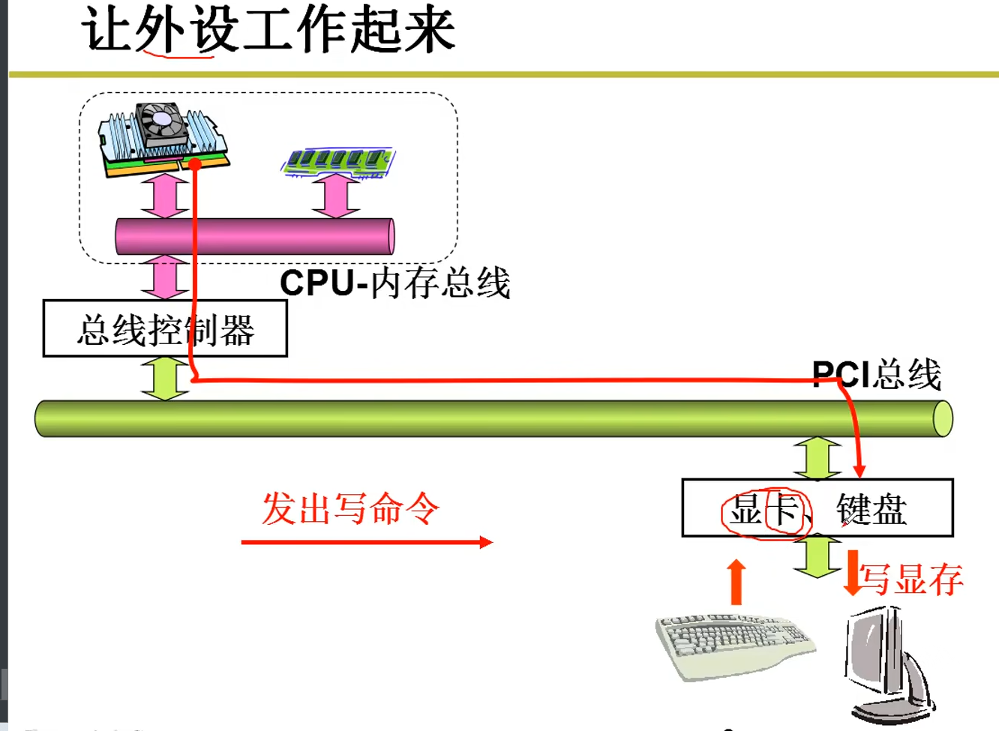

#### 块设备

块设备是一个能存储`固定大小块`信息的设备，它支持**以固定大小的块，扇区或群集读取和（可选）写入数据**。每个块都有自己的`物理地址`。通常块的大小在 512 - 65536 之间。所有传输的信息都会以`连续`的块为单位。块设备的基本特征是每个块都较为对立，能够独立的进行读写。常见的块设备有 **硬盘、蓝光光盘、USB 盘**

与字符设备相比，块设备通常需要较少的引脚。


#### 字符设备

另一类 I/O 设备是`字符设备`。字符设备以`字符`为单位发送或接收一个字符流，而不考虑任何块结构。字符设备是不可寻址的，也没有任何寻道操作。常见的字符设备有 **打印机、网络设备、鼠标、以及大多数与磁盘不同的设备**。


### 设备控制器

首先需要先了解一下设备控制器的概念。

设备控制器是处理 CPU 传入和传出信号的系统。设备通过插头和插座连接到计算机，并且插座连接到设备控制器。设备控制器从连接的设备处接收数据，并将其存储在控制器内部的一些`特殊目的寄存器(special purpose registers)` 也就是本地缓冲区中。

> 特殊用途寄存器，顾名思义是仅为一项任务而设计的寄存器。例如，cs，ds，gs 和其他段寄存器属于特殊目的寄存器，因为它们的存在是为了保存段号。 eax，ecx 等是一般用途的寄存器，因为你可以无限制地使用它们。 例如，你不能移动 ds，但是可以移动 eax，ebx。
>
> 通用目的寄存器比如有：eax、ecx、edx、ebx、esi、edi、ebp、esp
>
> 特殊目的寄存器比如有：cs、ds、ss、es、fs、gs、eip、flag

每个设备控制器都会有一个应用程序与之对应，设备控制器通过应用程序的接口通过中断与操作系统进行通信。设备控制器是硬件，而设备驱动程序是软件。

I/O 设备通常由`机械组件(mechanical component)`和`电子组件(electronic component)`构成。电子组件被称为 `设备控制器(device controller)`或者 `适配器(adapter)`。在个人计算机上，它通常采用`可插入（PCIe）扩展插槽`的主板上的芯片或印刷电路卡的形式。

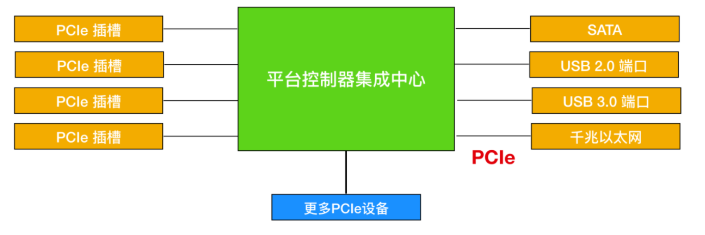

机械设备就是它自己，它的组成如下

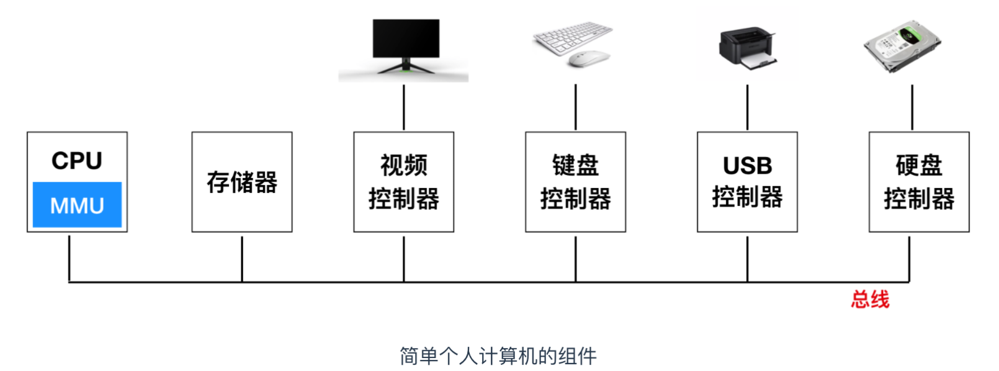

控制器卡上通常会有一个连接器，通向设备本身的电缆可以插入到这个连接器中，很多控制器可以操作 2 个、4 个设置 8 个相同的设备。

控制器与设备之间的接口通常是一个低层次的接口。例如，磁盘可能被格式化为 2,000,000 个扇区，每个磁道 512 字节。然而，实际从驱动出来的却是一个串行的比特流，从一个`前导符(preamble)`开始，然后是一个扇区中的 4096 位，最后是一个`校验和` 或 `ECC（错误码，Error-Correcting Code）`。前导符是在对磁盘进行格式化的时候写上去的，它包括柱面数和扇区号，扇区大小以及类似的数据，此外还包含同步信息。

控制器的任务是把串行的位流转换为字节块，并进行必要的错误校正工作。字节块通常会在控制器内部的一个缓冲区按位进行组装，然后再对校验和进行校验并证明字节块没有错误后，再将它复制到内存中。

### 内存映射 I/O

每个控制器都会有几个寄存器用来和 CPU 进行通信。通过写入这些寄存器，操作系统可以命令设备发送数据，接收数据、开启或者关闭设备等。通过从这些寄存器中读取信息，操作系统能够知道设备的状态，是否准备接受一个新命令等。

为了控制`寄存器`，许多设备都会有`数据缓冲区(data buffer)`，来供系统进行读写。例如，在屏幕上显示一个像素的常规方法是使用一个视频 RAM，这一 RAM 基本上只是一个数据缓冲区，用来供程序和操作系统写入数据。

那么问题来了，CPU 如何与设备寄存器和设备数据缓冲区进行通信呢？存在两个可选的方式。第一种方法是，每个控制寄存器都被分配一个 `I/O 端口(I/O port)`号，这是一个 8 位或 16 位的整数。所有 I/O 端口的集合形成了受保护的 I/O 端口空间，以便普通用户程序无法访问它（只有操作系统可以访问）。使用特殊的 I/O 指令像是

```assembly
IN REG,PORT
```

CPU 可以读取控制寄存器 PORT 的内容并将结果放在 CPU 寄存器 REG 中。类似的，使用

```assembly
OUT PORT,REG
```

CPU 可以将 REG 的内容写到控制寄存器中。大多数早期计算机，包括几乎所有大型主机，如 IBM 360 及其所有后续机型，都是以这种方式工作的。

> 控制寄存器是一个处理器寄存器而改变或控制的一般行为 CPU 或其他数字设备。控制寄存器执行的常见任务包括中断控制，切换寻址模式，分页控制和协处理器控制。

在这一方案中，内存地址空间和 I/O 地址空间是不相同的，如下图所示


指令

```assembly
IN R0,4
```

和

```assembly
MOV R0,4
```

这一设计中完全不同。**前者读取 I/O端口 4 的内容并将其放入 R0，而后者读取存储器字 4 的内容并将其放入 R0**。这些示例中的 4 代表不同且不相关的地址空间。

第二个方法是 PDP-11 引入的，

> 什么是 PDP-11?
>
> 

它将**所有控制寄存器映射到内存空间**中，如下图所示


`内存映射的 I/O`是在 CPU 与其连接的外围设备之间交换数据和指令的一种方式，这种方式是处理器和 IO 设备共享同一`内存位置`的内存，即处理器和 IO 设备使用内存地址进行映射。

在大多数系统中，分配给控制寄存器的地址位于或者靠近地址的顶部附近。

下面是采用的一种混合方式


这种方式具有与内存映射 I/O 的数据缓冲区，而控制寄存器则具有单独的 I/O 端口。x86 采用这一体系结构。在 IBM PC 兼容机中，除了 0 到 64K - 1 的 I/O 端口之外，640 K 到 1M - 1 的内存地址保留给设备的数据缓冲区。

这些方案是如何工作的呢？当 CPU 想要读入一个字的时候，无论是从内存中读入还是从 I/O 端口读入，它都要将需要的地址放到总线地址线上，然后在总线的一条控制线上调用一个 `READ` 信号。还有第二条信号线来表明需要的是 I/O 空间还是内存空间。如果是内存空间，内存将响应请求。如果是 I/O 空间，那么 I/O 设备将响应请求。如果只有内存空间，那么每个内存模块和每个 I/O 设备都会将地址线和它所服务的地址范围进行比较。如果地址落在这一范围之内，它就会响应请求。绝对不会出现地址既分配给内存又分配给 I/O 设备，所以不会存在歧义和冲突。

#### 内存映射 I/O 的优点和缺点

这两种寻址控制器的方案具有不同的优缺点。先来看一下内存映射 I/O 的优点。

- 第一，如果需要特殊的 I/O 指令读写设备控制寄存器，那么访问这些寄存器需要使用汇编代码，因为在 C 或 C++ 中不存在执行 `IN` 和 `OUT`指令的方法。调用这样的过程增加了 I/O 的开销。在内存映射中，控制寄存器只是内存中的变量，在 C 语言中可以和其他变量一样进行寻址。
- 第二，对于内存映射 I/O ，不需要特殊的保护机制就能够阻止用户进程执行 I/O 操作。操作系统需要保证的是禁止把控制寄存器的地址空间放在用户的虚拟地址中就可以了。
- 第三，对于内存映射 I/O，可以引用内存的每一条指令也可以引用控制寄存器，便于引用。

在计算机设计中，几乎所有的事情都要权衡。内存映射 I/O 也是一样，它也有自己的缺点。首先，大部分计算机现在都会有一些对于内存字的缓存。缓存一个设备控制寄存器的代价是很大的。为了避免这种内存映射 I/O 的情况，硬件必须有选择性的禁用缓存，例如，在每个页面上禁用缓存，这个功能为硬件和操作系统增加了额外的复杂性，因此必须选择性的进行管理。

第二点，如果仅仅只有一个地址空间，那么所有的`内存模块(memory modules)`和所有的 I/O 设备都必须检查所有的内存引用来推断出谁来进行响应。

> 什么是内存模块？在计算中，存储器模块是其上安装有存储器集成电路的印刷电路板。


如果计算机是一种单总线体系结构的话，如下图所示


让每个内存模块和 I/O 设备查看每个地址是简单易行的。

然而，现代个人计算机的趋势是专用的高速内存总线，如下图所示


装备这一总线是为了优化内存访问速度，x86 系统还可以有多种总线（内存、PCIe、SCSI 和 USB）。如下图所示


在内存映射机器上使用单独的内存总线的麻烦之处在于，I/O 设备无法通过内存总线查看内存地址，因此它们无法对其进行响应。此外，必须采取特殊的措施使内存映射 I/O 工作在具有多总线的系统上。一种可能的方法是首先将全部内存引用发送到内存，如果内存响应失败，CPU 再尝试其他总线。

第二种设计是在内存总线上放一个`探查设备`，放过所有潜在指向所关注的 I/O 设备的地址。此处的问题是，I/O 设备可能无法以内存所能达到的速度处理请求。

第三种可能的设计是在内存控制器中对地址进行过滤，这种设计与上图所描述的设计相匹配。这种情况下，内存控制器芯片中包含在引导时预装载的范围寄存器。这一设计的缺点是需要在引导时判定哪些内存地址而不是真正的内存地址。因而，每一设计都有支持它和反对它的论据，所以折中和权衡是不可避免的。

### 直接内存访问

无论一个 CPU 是否具有内存映射 I/O，它都需要寻址设备控制器以便与它们交换数据。CPU 可以从 I/O 控制器每次请求一个字节的数据，但是这么做会浪费 CPU 时间，所以经常会用到一种称为`直接内存访问(Direct Memory Access)` 的方案。为了简化，我们假设 CPU 通过单一的系统总线访问所有的设备和内存，该总线连接 CPU 、内存和 I/O 设备，如下图所示


现代操作系统实际更为复杂，但是原理是相同的。如果硬件有`DMA 控制器`，那么操作系统只能使用 DMA。有时这个控制器会集成到磁盘控制器和其他控制器中，但这种设计需要在每个设备上都装有一个分离的 DMA 控制器。单个的 DMA 控制器可用于向多个设备传输，这种传输往往同时进行。

不管 DMA 控制器的物理地址在哪，它都能够独立于 CPU 从而访问系统总线，如上图所示。它包含几个可由 CPU 读写的寄存器，其中包括一个内存地址寄存器，字节计数寄存器和一个或多个控制寄存器。控制寄存器指定要**使用的 I/O 端口、传送方向（从 I/O 设备读或写到 I/O 设备）、传送单位（每次一个字节或者每次一个字）以及在一次突发传送中要传送的字节数**。

为了解释 DMA 的工作原理，我们首先看一下不使用 DMA 该如何进行磁盘读取。

- 首先，控制器从`磁盘驱动器`串行地、一位一位的读一个块（一个或多个扇区），直到将整块信息放入控制器的内部缓冲区。
- 读取`校验和`以保证没有发生读错误。然后控制器会产生一个中断，当操作系统开始运行时，它会重复的从控制器的缓冲区中一次一个字节或者一个字地读取该块的信息，并将其存入内存中。

#### DMA 工作原理

当使用 DMA 后，这个过程就会变得不一样了。首先 CPU 通过设置 DMA 控制器的寄存器对它进行编程，所以 DMA 控制器知道将什么数据传送到什么地方。DMA 控制器还要向磁盘控制器发出一个命令，通知它从磁盘读数据到其内部的缓冲区并检验校验和。当有效数据位于磁盘控制器的缓冲区中时，DMA 就可以开始了。

DMA 控制器通过在总线上发出一个`读请求`到磁盘控制器而发起 DMA 传送，这是第二步。这个读请求就像其他读请求一样，磁盘控制器并不知道或者并不关心它是来自 CPU 还是来自 DMA 控制器。通常情况下，要写的内存地址在总线的地址线上，所以当磁盘控制器去匹配下一个字时，它知道将该字写到什么地方。写到内存就是另外一个总线循环了，这是第三步。当写操作完成时，磁盘控制器在总线上发出一个应答信号到 DMA 控制器，这是第四步。

然后，DMA 控制器会增加内存地址并减少字节数量。如果字节数量仍然大于 0 ，就会循环步骤 2 - 步骤 4 ，直到字节计数变为 0 。此时，DMA 控制器会打断 CPU 并告诉它传输已经完成了。操作系统开始运行时，它不会把磁盘块拷贝到内存中，因为它已经在内存中了。

不同 DMA 控制器的复杂程度差别很大。最简单的 DMA 控制器每次处理一次传输，就像上面描述的那样。更为复杂的情况是一次同时处理很多次传输，这样的控制器内部具有多组寄存器，每个通道一组寄存器。在传输每一个字之后，DMA 控制器就决定下一次要为哪个设备提供服务。DMA 控制器可能被设置为使用 `轮询算法`，或者它也有可能具有一个优先级规划设计，以便让某些设备受到比其他设备更多的照顾。假如存在一个明确的方法分辨应答信号，那么在同一时间就可以挂起对不同设备控制器的多个请求。

许多总线能够以两种模式操作：**每次一字模式和块模式**。一些 DMA 控制器也能够使用这两种方式进行操作。在前一个模式中，DMA 控制器请求传送一个字并得到这个字。如果 CPU 想要使用总线，它必须进行等待。设备可能会偷偷进入并且从 CPU 偷走一个总线周期，从而轻微的延迟 CPU。这种机制称为 `周期窃取(cycle stealing)`。

在块模式中，DMA 控制器告诉设备获取总线，然后进行一系列的传输操作，然后释放总线。这一操作的形式称为 `突发模式(burst mode)`。这种模式要比周期窃取更有效因为获取总线占用了时间，并且一次总线获得的代价是可以同时传输多个字。缺点是如果此时进行的是长时间的突发传送，有可能将 CPU 和其他设备阻塞很长的时间。

在我们讨论的这种模型中，有时被称为 `飞越模式(fly-by mode)`，DMA 控制器会告诉设备控制器把数据直接传递到内存。一些 DMA 控制器使用的另一种模式是让设备控制器将字发送给 DMA 控制器，然后 DMA 控制器发出第二条总线请求，将字写到任何可以写入的地方。采用这种方案，每个传输的字都需要一个额外的总线周期，但是更加灵活，因为它还可以执行设备到设备的复制，甚至是内存到内存的复制（通过事先对内存进行读取，然后对内存进行写入）。

大部分的 DMA 控制器使用物理地址进行传输。使用物理地址需要操作系统将目标内存缓冲区的虚拟地址转换为物理地址，并将该物理地址写入 DMA 控制器的地址寄存器中。另一种方案是一些 DMA 控制器将虚拟地址写入 DMA 控制器中。然后，DMA 控制器必须使用 MMU 才能完成虚拟到物理的转换。仅当 MMU 是内存的一部分而不是 CPU 的一部分时，才可以将虚拟地址放在总线上。

### 中断

在一台个人计算机体系结构中，中断结构会如下所示


当一个 I/O 设备完成它的工作后，它就会产生一个中断（默认操作系统已经开启中断），它通过在总线上声明已分配的信号来实现此目的。主板上的中断控制器芯片会检测到这个信号，然后执行中断操作。

如果在中断前没有其他中断操作阻塞的话，中断控制器将立刻对中断进行处理，如果在中断前还有其他中断操作`正在执行`，或者有其他设备发出级别`更高`的中断信号的话，那么这个设备将暂时不会处理。在这种情况下，该设备会继续在总线上置起中断信号，直到得到 CPU 服务。

为了处理中断，中断控制器在地址线上放置一个数字，指定要关注的设备是哪个，并声明一个信号以中断 CPU。中断信号导致 CPU 停止当前正在做的工作并且开始做其他事情。地址线上会有一个指向`中断向量表` 的索引，用来获取下一个程序计数器。这个新获取的程序计数器也就表示着程序将要开始，它会指向程序的开始处。一般情况下，陷阱和中断从这一点上看使用相同的机制，并且常常共享相同的中断向量。中断向量的位置可以硬连线到机器中，也可以位于内存中的任何位置，由 CPU 寄存器指向其起点。

中断服务程序开始运行后，中断服务程序通过将某个值写入中断控制器的 I/O 端口来确认中断。告诉它中断控制器可以自由地发出另一个中断。通过让 CPU 延迟响应来达到多个中断同时到达 CPU 涉及到竞争的情况发生。一些老的计算机没有集中的中断控制器，通常每个设备请求自己的中断。

硬件通常在服务程序开始前保存当前信息。对于不同的 CPU 来说，哪些信息需要保存以及保存在哪里差别很大。不管其他的信息是否保存，程序计数器必须要被保存，这对所有的 CPU 来说都是相同的，以此来恢复中断的进程。所有可见寄存器和大量内部寄存器也应该被保存。

上面说到硬件应该保存当前信息，那么保存在哪里是个问题，一种选择是将其放入到内部寄存器中，在需要时操作系统可以读出这些内部寄存器。这种方法会造成的问题是：一段时间内设备无法响应，直到所有的内部寄存器中存储的信息被读出后，才能恢复运行，以免第二个内部寄存器重写内部寄存器的状态。

第二种方式是在堆栈中保存信息，这也是大部分 CPU 所使用的方式。但是，这种方法也存在问题，因为使用的堆栈不确定，如果使用的是`当前堆栈`，则它很可能是用户进程的堆栈。堆栈指针甚至不合法，这样当硬件试图在它所指的地址处写入时，将会导致致命错误。如果使用的是内核堆栈，堆栈指针是合法的并且指向一个固定的页面，这样的机会可能会更大。然而，切换到内核态需要切换 MMU 上下文，并且可能使高速缓存或者 TLB 失效。静态或动态重新装载这些东西将增加中断处理的时间，浪费 CPU 时间。

#### 精确中断和不精确中断

另一个问题是：现代 CPU 大量的采用`流水线`并且有时还采用`超标量(内部并行)`。在一些老的系统中，每条指令执行完毕后，微程序或硬件将检查是否存在未完成的中断。如果存在，那么程序计数器和 PSW 将被压入堆栈中开始中断序列。在中断程序运行之后，旧的 PSW 和程序计数器将从堆栈中弹出恢复先前的进程。

下面是一个流水线模型


在流水线满的时候出现一个中断会发生什么情况？许多指令正处于不同的执行阶段，中断出现时，程序计数器的值可能无法正确地反应已经执行过的指令和尚未执行的指令的边界。事实上，许多指令可能部分执行力，不同的指令完成的程度或多或少。在这种情况下，a程序计数器更有可能反应的是将要被取出并压入流水线的下一条指令的地址，而不是刚刚被执行单元处理过的指令的地址。

在超标量的设计中，可能更加糟糕


每个指令都可以分解成为微操作，微操作有可能乱序执行，这取决于内部资源（如功能单元和寄存器）的可用性。当中断发生时，某些很久以前启动的指令可能还没开始执行，而最近执行的指令可能将要马上完成。在中断信号出现时，可能存在许多指令处于不同的完成状态，它们与程序计数器之间没有什么关系。

使机器处于良好状态的中断称为`精确中断(precise interrupt)`。这样的中断具有四个属性：

- PC （程序计数器）保存在一个已知的地方
- PC 所指向的指令之前所有的指令已经完全执行
- PC 所指向的指令之后所有的指令都没有执行
- PC 所指向的指令的执行状态是已知的

不满足以上要求的中断称为 `不精确中断(imprecise interrupt)`，不精确中断让人很头疼。上图描述了不精确中断的现象。指令的执行时序和完成度具有不确定性，而且恢复起来也非常麻烦。

### IO 软件原理

#### I/O 软件目标

##### 设备独立性

现在让我们转向对 I/O 软件的研究，I/O 软件设计一个很重要的目标就是`设备独立性(device independence)`。啥意思呢？这意味着**我们能够编写访问任何设备的应用程序，而不用事先指定特定的设备**。比如你编写了一个能够从设备读入文件的应用程序，那么这个应用程序可以从硬盘、DVD 或者 USB 进行读入，不必再为每个设备定制应用程序。这其实就体现了设备独立性的概念。


再比如说你可以输入一条下面的指令

```shell
sort 输入 输出
```

那么上面这个 `输入` 就可以接收来自任意类型的磁盘或者键盘，并且 `输出` 可以写入到任意类型的磁盘或者屏幕。


计算机操作系统是这些硬件的媒介，因为不同硬件它们的指令序列不同，所以需要操作系统来做指令间的转换。

与设备独立性密切相关的一个指标就是`统一命名(uniform naming)`。设备的代号应该是一个整数或者是字符串，它们不应该依赖于具体的设备。在 UNIX 中，所有的磁盘都能够被集成到文件系统中，所以用户不用记住每个设备的具体名称，直接记住对应的路径即可，如果路径记不住，也可以通过 `ls` 等指令找到具体的集成位置。举个例子来说，比如一个 USB 磁盘被挂载到了 `/usr/cxuan/backup` 下，那么你把文件复制到 `/usr/cxuan/backup/device` 下，就相当于是把文件复制到了磁盘中，通过这种方式，实现了向任何磁盘写入文件都相当于是向指定的路径输出文件。

##### 错误处理

除了`设备独立性`外，I/O 软件实现的第二个重要的目标就是`错误处理(error handling)`。通常情况下来说，错误应该交给`硬件`层面去处理。如果设备控制器发现了读错误的话，它会尽可能的去修复这个错误。如果设备控制器处理不了这个问题，那么设备驱动程序应该进行处理，设备驱动程序会再次尝试读取操作，很多错误都是偶然性的，如果设备驱动程序无法处理这个错误，才会把错误向上抛到硬件层面（上层）进行处理，很多时候，上层并不需要知道下层是如何解决错误的。这就很像项目经理不用把每个决定都告诉老板；程序员不用把每行代码如何写告诉项目经理。这种处理方式不够透明。

##### 同步和异步传输

I/O 软件实现的第三个目标就是 `同步(synchronous)` 和 `异步(asynchronous，即中断驱动)`传输。这里先说一下同步和异步是怎么回事吧。

同步传输中数据通常以块或帧的形式发送。发送方和接收方在数据传输之前应该具有`同步时钟`。而在异步传输中，数据通常以字节或者字符的形式发送，异步传输则不需要同步时钟，但是会在传输之前向数据添加`奇偶校验位`。下面是同步和异步的主要区别


回到正题。大部分`物理IO(physical I/O)` 是异步的。物理 I/O 中的 CPU 是很聪明的，CPU 传输完成后会转而做其他事情，它和中断心灵相通，等到中断发生后，CPU 才会回到传输这件事情上来。

> I/O 分为两种：物理I/O 和 `逻辑I/O(Logical I/O)`。
>
> 物理 I/O 通常是从磁盘等存储设备实际获取数据。逻辑 I/O 是对存储器（块，缓冲区）获取数据。

#### 缓冲

I/O 软件的最后一个问题是`缓冲(buffering)`。通常情况下，从一个设备发出的数据不会直接到达最后的设备。其间会经过一系列的校验、检查、缓冲等操作才能到达。举个例子来说，从网络上发送一个数据包，会经过一系列检查之后首先到达缓冲区，从而消除缓冲区填满速率和缓冲区过载。

#### 共享和独占

I/O 软件引起的最后一个问题就是共享设备和独占设备的问题。有些 I/O 设备能够被许多用户共同使用。一些设备比如磁盘，让多个用户使用一般不会产生什么问题，但是某些设备必须具有独占性，即只允许单个用户使用完成后才能让其他用户使用。

下面，我们来探讨一下如何使用程序来控制 I/O 设备。一共有三种控制 I/O 设备的方法

- 使用程序控制 I/O
- 使用中断驱动 I/O
- 使用 DMA 驱动 I/O

##### 使用程序控制 I/O

使用程序控制 I/O 又被称为 `可编程I/O`，它是指由 CPU 在驱动程序软件控制下启动的数据传输，来访问设备上的寄存器或者其他存储器。CPU 会发出命令，然后等待 I/O 操作的完成。由于 CPU 的速度比 I/O 模块的速度快很多，因此可编程 I/O 的问题在于，CPU 必须等待很长时间才能等到处理结果。CPU 在等待时会采用`轮询(polling)`或者 `忙等(busy waiting)` 的方式，结果，整个系统的性能被严重拉低。可编程 I/O 十分简单，如果需要等待的时间非常短的话，可编程 I/O 倒是一个很好的方式。一个可编程的 I/O 会经历如下操作

- CPU 请求 I/O 操作
- I/O 模块执行响应
- I/O 模块设置状态位
- CPU 会定期检查状态位
- I/O 不会直接通知 CPU 操作完成
- I/O 也不会中断 CPU
- CPU 可能会等待或在随后的过程中返回


##### 使用中断驱动 I/O

鉴于上面可编程 I/O 的缺陷，我们提出一种改良方案，我们想要在 CPU 等待 I/O 设备的同时，能够做其他事情，等到 I/O 设备完成后，它就会产生一个中断，这个中断会停止当前进程并保存当前的状态。一个可能的示意图如下


尽管中断减轻了 CPU 和 I/O 设备的等待时间的负担，但是由于还需要在 CPU 和 I/O 模块之前进行大量的逐字传输，因此在大量数据传输中效率仍然很低。下面是中断的基本操作

- CPU 进行读取操作
- I/O 设备从外围设备获取数据，同时 CPU 执行其他操作
- I/O 设备中断通知 CPU
- CPU 请求数据
- I/O 模块传输数据

所以我们现在着手需要解决的就是 CPU 和 I/O 模块间数据传输的效率问题。

##### 使用 DMA 的 I/O

DMA 的中文名称是直接内存访问，它意味着 CPU 授予 I/O 模块权限在不涉及 CPU 的情况下读取或写入内存。也就是 DMA 可以不需要 CPU 的参与。这个过程由称为 DMA 控制器（DMAC）的芯片管理。由于 DMA 设备可以直接在内存之间传输数据，而不是使用 CPU 作为中介，因此可以缓解总线上的拥塞。DMA 通过允许 CPU 执行任务，同时 DMA 系统通过系统和内存总线传输数据来提高系统并发性。

### I/O 层次结构

I/O 软件通常组织成四个层次，它们的大致结构如下图所示


每一层和其上下层都有明确的功能和接口。下面我们采用和计算机网络相反的套路，即自下而上的了解一下这些程序。

下面是另一幅图，这幅图显示了输入/输出软件系统所有层及其主要功能。


下面我们具体的来探讨一下上面的层次结构

#### 中断处理程序

在计算机系统中，中断就像女人的脾气一样无时无刻都在产生，中断的出现往往是让人很不爽的。中断处理程序又被称为`中断服务程序` 或者是 `ISR(Interrupt Service Routines)`，它是最靠近硬件的一层。中断处理程序由硬件中断、软件中断或者是软件异常启动产生的中断，用于实现设备驱动程序或受保护的操作模式（例如系统调用）之间的转换。

中断处理程序负责处理中断发生时的所有操作，操作完成后阻塞，然后启动中断驱动程序来解决阻塞。通常会有三种通知方式，依赖于不同的具体实现

- 信号量实现中：在信号量上使用 `up` 进行通知；
- 管程实现：对管程中的条件变量执行 `signal` 操作
- 还有一些情况是发送一些消息

不管哪种方式都是为了让阻塞的中断处理程序恢复运行。

中断处理方案有很多种，下面是 《**ARM System Developer’s Guide**

**Designing and Optimizing System Software**》列出来的一些方案

- `非嵌套`的中断处理程序按照顺序处理各个中断，非嵌套的中断处理程序也是最简单的中断处理
- `嵌套`的中断处理程序会处理多个中断而无需分配优先级
- `可重入`的中断处理程序可使用优先级处理多个中断
- `简单优先级`中断处理程序可处理简单的中断
- `标准优先级`中断处理程序比低优先级的中断处理程序在更短的时间能够处理优先级更高的中断
- `高优先级` 中断处理程序在短时间能够处理优先级更高的任务，并直接进入特定的服务例程。
- `优先级分组`中断处理程序能够处理不同优先级的中断任务

下面是一些通用的中断处理程序的步骤，不同的操作系统实现细节不一样

- 保存所有没有被中断硬件保存的寄存器
- 为中断服务程序设置上下文环境，可能包括设置 `TLB`、`MMU` 和页表，如果不太了解这三个概念，请参考另外一篇文章
- 为中断服务程序设置栈
- 对中断控制器作出响应，如果不存在集中的中断控制器，则继续响应中断
- 把寄存器从保存它的地方拷贝到进程表中
- 运行中断服务程序，它会从发出中断的设备控制器的寄存器中提取信息
- 操作系统会选择一个合适的进程来运行。如果中断造成了一些优先级更高的进程变为就绪态，则选择运行这些优先级高的进程
- 为进程设置 MMU 上下文，可能也会需要 TLB，根据实际情况决定
- 加载进程的寄存器，包括 PSW 寄存器
- 开始运行新的进程

上面我们罗列了一些大致的中断步骤，不同性质的操作系统和中断处理程序能够处理的中断步骤和细节也不尽相同，下面是一个嵌套中断的具体运行步骤


#### 设备驱动程序

在上面的文章中我们知道了设备控制器所做的工作。我们知道每个控制器其内部都会有寄存器用来和设备进行沟通，发送指令，读取设备的状态等。

因此，每个连接到计算机的 I/O 设备都需要有某些特定设备的代码对其进行控制，例如鼠标控制器需要从鼠标接受指令，告诉下一步应该移动到哪里，键盘控制器需要知道哪个按键被按下等。这些提供 I/O 设备到设备控制器转换的过程的代码称为 `设备驱动程序(Device driver)`。

为了能够访问设备的硬件，实际上也就意味着，设备驱动程序通常是操作系统内核的一部分，至少现在的体系结构是这样的。但是也可以构造`用户空间`的设备驱动程序，通过系统调用来完成读写操作。这样就避免了一个问题，有问题的驱动程序会干扰内核，从而造成崩溃。所以，在用户控件实现设备驱动程序是构造系统稳定性一个非常有用的措施。`MINIX 3` 就是这么做的。下面是 MINI 3 的调用过程


然而，大多数桌面操作系统要求驱动程序必须运行在内核中。

操作系统通常会将驱动程序归为 `字符设备` 和 `块设备`，我们上面也介绍过了


在 UNIX 系统中，操作系统是一个`二进制程序`，包含需要编译到其内部的所有驱动程序，如果你要对 UNIX 添加一个新设备，需要重新编译内核，将新的驱动程序装到二进制程序中。

然而随着大多数个人计算机的出现，由于 I/O 设备的广泛应用，上面这种静态编译的方式不再有效，因此，从 `MS-DOS` 开始，操作系统转向驱动程序在执行期间动态的装载到系统中。

设备驱动程序具有很多功能，比如接受读写请求，对设备进行初始化、管理电源和日志、对输入参数进行有效性检查等。

设备驱动程序接受到读写请求后，会检查当前设备是否在使用，如果设备在使用，请求被排入队列中，等待后续的处理。如果此时设备是空闲的，驱动程序会检查硬件以了解请求是否能够被处理。在传输开始前，会启动设备或者马达。等待设备就绪完成，再进行实际的控制。**控制设备就是对设备发出指令**。

发出命令后，设备控制器便开始将它们写入控制器的`设备寄存器`。在将每个命令写入控制器后，会检查控制器是否接受了这条命令并准备接受下一个命令。一般控制设备会发出一系列的指令，这称为`指令序列`，设备控制器会依次检查每个命令是否被接受，下一条指令是否能够被接收，直到所有的序列发出为止。


发出指令后，一般会有两种可能出现的情况。在大多数情况下，设备驱动程序会进行等待直到控制器完成它的事情。这里需要了解一下设备控制器的概念

> 设备控制器的主要主责是**控制一个或多个 I/O 设备，以实现 I/O 设备和计算机之间的数据交换**。
>
> 设备控制器接收从 CPU 发送过来的指令，继而达到控制硬件的目的

设备控制器是一个`可编址`的设备，当它仅控制一个设备时，它只有一个唯一的设备地址；如果设备控制器控制多个可连接设备时，则应含有多个设备地址，并使每一个设备地址对应一个设备。

设备控制器主要分为两种：字符设备和块设备

设备控制器的主要功能有下面这些

- 接收和识别命令：设备控制器可以接受来自 CPU 的指令，并进行识别。设备控制器内部也会有寄存器，用来存放指令和参数
- 进行数据交换：CPU、控制器和设备之间会进行数据的交换，CPU 通过总线把指令发送给控制器，或从控制器中并行地读出数据；控制器将数据写入指定设备。
- 地址识别：每个硬件设备都有自己的地址，设备控制器能够识别这些不同的地址，来达到控制硬件的目的，此外，为使 CPU 能向寄存器中写入或者读取数据，这些寄存器都应具有唯一的地址。
- 差错检测：设备控制器还具有对设备传递过来的数据进行检测的功能。

在这种情况下，设备控制器会阻塞，直到中断来解除阻塞状态。还有一种情况是操作是可以无延迟的完成，所以驱动程序不需要阻塞。在第一种情况下，操作系统可能被中断唤醒；第二种情况下操作系统不会被休眠。

设备驱动程序必须是`可重入`的，因为设备驱动程序会阻塞和唤醒然后再次阻塞。驱动程序不允许进行系统调用，但是它们通常需要与内核的其余部分进行交互。

#### 与设备无关的 I/O 软件

I/O 软件有两种，一种是我们上面介绍过的基于特定设备的，还有一种是`设备无关性`的，设备无关性也就是不需要特定的设备。设备驱动程序与设备无关的软件之间的界限取决于具体的系统。下面显示的功能由设备无关的软件实现


与设备无关的软件的基本功能是对所有设备执行公共的 I/O 功能，并且向用户层软件提供一个统一的接口。

##### 缓冲

无论是对于块设备还是字符设备来说，缓冲都是一个非常重要的考量标准。下面是从 `ADSL(调制解调器)` 读取数据的过程，调制解调器是我们用来联网的设备。

用户程序调用 read 系统调用阻塞用户进程，等待字符的到来，这是对到来的字符进行处理的一种方式。每一个到来的字符都会造成中断。`中断服务程序`会给用户进程提供字符，并解除阻塞。将字符提供给用户程序后，进程会去读取其他字符并继续阻塞，这种模型如下


这一种方案是没有缓冲区的存在，因为用户进程如果读不到数据会阻塞，直到读到数据为止，这种情况效率比较低，而且阻塞式的方式，会直接阻止用户进程做其他事情，这对用户来说是不能接受的。还有一种情况就是每次用户进程都会重启，对于每个字符的到来都会重启用户进程，这种效率会严重降低，所以无缓冲区的软件不是一个很好的设计。

作为一个改良点，我们可以尝试在用户空间中使用一个能读取 n 个字节缓冲区来读取 n 个字符。这样的话，中断服务程序会把字符放到缓冲区中直到缓冲区变满为止，然后再去唤醒用户进程。这种方案要比上面的方案改良很多。


但是这种方案也存在问题，当字符到来时，如果缓冲区被调出内存会出现什么问题？解决方案是把缓冲区锁定在内存中，但是这种方案也会出现问题，如果少量的缓冲区被锁定还好，如果大量的缓冲区被锁定在内存中，那么可以换进换出的页面就会收缩，造成系统性能的下降。

一种解决方案是在`内核`中内部创建一块缓冲区，让中断服务程序将字符放在内核内部的缓冲区中。


当内核中的缓冲区要满的时候，会将用户空间中的页面调入内存，然后将内核空间的缓冲区复制到用户空间的缓冲区中，这种方案也面临一个问题就是假如用户空间的页面被换入内存，此时内核空间的缓冲区已满，这时候仍有新的字符到来，这个时候会怎么办？因为缓冲区满了，没有空间来存储新的字符了。

一种非常简单的方式就是再设置一个缓冲区就行了，在第一个缓冲区填满后，在缓冲区清空前，使用第二个缓冲区，这种解决方式如下


当第二个缓冲区也满了的时候，它也会把数据复制到用户空间中，然后第一个缓冲区用于接受新的字符。这种具有两个缓冲区的设计被称为 `双缓冲(double buffering)`。

还有一种缓冲形式是 `循环缓冲(circular buffer)`。它由一个内存区域和两个指针组成。一个指针指向下一个空闲字，新的数据可以放在此处。另外一个指针指向缓冲区中尚未删除数据的第一个字。在许多情况下，硬件会在添加新的数据时，移动第一个指针；而操作系统会在删除和处理无用数据时会移动第二个指针。两个指针到达顶部时就回到底部重新开始。

缓冲区对输出来说也很重要。对输出的描述和输入相似

缓冲技术应用广泛，但它也有缺点。如果数据被缓冲次数太多，会影响性能。考虑例如如下这种情况，


数据经过用户进程 -> 内核空间 -> 网络控制器，这里的网络控制器应该就相当于是 socket 缓冲区，然后发送到网络上，再到接收方的网络控制器 -> 接收方的内核缓冲 -> 接收方的用户缓冲，一条数据包被缓存了太多次，很容易降低性能。

##### 错误处理

在 I/O 中，出错是一种再正常不过的情况了。当出错发生时，操作系统必须尽可能处理这些错误。有一些错误是只有特定的设备才能处理，有一些是由框架进行处理，这些错误和特定的设备无关。

I/O 错误的一类是程序员`编程`错误，比如还没有打开文件前就读流，或者不关闭流导致内存溢出等等。这类问题由程序员处理；另外一类是实际的 I/O 错误，例如向一个磁盘坏块写入数据，无论怎么写都写入不了。这类问题由驱动程序处理，驱动程序处理不了交给硬件处理，这个我们上面也说过。

##### 设备驱动程序统一接口

我们在操作系统概述中说到，操作系统一个非常重要的功能就是屏蔽了硬件和软件的差异性，为硬件和软件提供了统一的标准，这个标准还体现在为设备驱动程序提供统一的接口，因为不同的硬件和厂商编写的设备驱动程序不同，所以如果为每个驱动程序都单独提供接口的话，这样没法搞，所以必须统一。

##### 分配和释放

一些设备例如打印机，它只能由一个进程来使用，这就需要操作系统根据实际情况判断是否能够对设备的请求进行检查，判断是否能够接受其他请求，一种比较简单直接的方式是在特殊文件上执行 `open`操作。如果设备不可用，那么直接 open 会导致失败。还有一种方式是不直接导致失败，而是让其阻塞，等到另外一个进程释放资源后，在进行 open 打开操作。这种方式就把选择权交给了用户，由用户判断是否应该等待。

> 注意：阻塞的实现有多种方式，有阻塞队列等

##### 设备无关的块

不同的磁盘会具有不同的扇区大小，但是软件不会关心扇区大小，只管存储就是了。一些字符设备可以一次一个字节的交付数据，而其他的设备则以较大的单位交付数据，这些差异也可以隐藏起来。

#### 用户空间的 I/O 软件

虽然大部分 I/O 软件都在内核结构中，但是还有一些在用户空间实现的 I/O 软件，凡事没有绝对。一些 I/O 软件和库过程在用户空间存在，然后以提供系统调用的方式实现。

### 盘

盘可以说是硬件里面比较简单的构造了，同时也是最重要的。下面我们从盘谈起，聊聊它的物理构造

#### 盘硬件

盘会有很多种类型。其中最简单的构造就是`磁盘(magnetic hard disks)`， 也被称为 `hard disk,HDD`等。磁盘通常与安装在磁臂上的磁头配对，磁头可将数据读取或者将数据写入磁盘，因此磁盘的读写速度都同样快。在磁盘中，数据是随机访问的，这也就说明可以通过任意的顺序来`存储`和`检索`单个数据块，所以你可以在任意位置放置磁盘来让磁头读取，磁盘是一种`非易失性`的设备，即使断电也能永久保留。

在计算机发展早期一般是用光盘来存储数据的，然而随着固态硬盘的流行，固态硬盘不包含运动部件的特点，成为现在计算机的首选存储方式。

##### 磁盘

为了组织和检索数据，会将磁盘组织成特定的结构，这些特定的结构就是**磁道、扇区和柱面**


每一个磁盘都是由无数个同心圆组成，这些同心圆就好像树的年轮一样


> 部分树的年轮照片都要付费下载了，不敢直接白嫖，阔怕阔怕。

磁盘被组织成柱面形式，每个盘用轴相连，每一个柱面包含若干磁道，每个磁道由若干扇区组成。软盘上大约每个磁道有 8 - 32 个扇区，硬盘上每条磁道上扇区的数量可达几百个，磁头大约是 1 - 16 个。

对于磁盘驱动程序来说，一个非常重要的特性就是控制器是否能够同时控制两个或者多个驱动器进行磁道寻址，这就是`重叠寻道(overlapped seek)`。对于控制器来说，它能够控制一个磁盘驱动程序完成寻道操作，同时让其他驱动程序等待寻道结束。控制器也可以在一个驱动程序上进行读写草哦做，与此同时让另外的驱动器进行寻道操作，但是软盘控制器不能在两个驱动器上进行读写操作。

##### RAID

RAID 称为 `磁盘冗余阵列`，简称 `磁盘阵列`。利用虚拟化技术把多个硬盘结合在一起，成为一个或多个磁盘阵列组，目的是提升性能或数据冗余。

RAID 有不同的级别

- RAID 0 - 无容错的条带化磁盘阵列
- RAID 1 - 镜像和双工
- RAID 2 - 内存式纠错码
- RAID 3 - 比特交错奇偶校验
- RAID 4 - 块交错奇偶校验
- RAID 5 - 块交错分布式奇偶校验
- RAID 6 - P + Q冗余

#### 磁盘格式化

磁盘由一堆铝的、合金或玻璃的盘片组成，磁盘刚被创建出来后，没有任何信息。磁盘在使用前必须经过`低级格式化(low-levvel format)`，下面是一个扇区的格式


前导码相当于是标示扇区的开始位置，通常以位模式开始，前导码还包括`柱面号`、`扇区号`等一些其他信息。紧随前导码后面的是数据区，数据部分的大小由低级格式化程序来确定。大部分磁盘使用 512 字节的扇区。数据区后面是 ECC，ECC 的全称是 **error correction code** ，`数据纠错码`，它与普通的错误检测不同，ECC 还可以用于恢复读错误。ECC 阶段的大小由不同的磁盘制造商实现。ECC 大小的设计标准取决于**设计者愿意牺牲多少磁盘空间来提高可靠性**，以及程序可以处理的 ECC 的复杂程度。通常情况下 ECC 是 16 位，除此之外，硬盘一般具有一定数量的备用扇区，用于替换制造缺陷的扇区。

低级格式化后的每个 0 扇区的位置都和前一个磁道存在`偏移`，如下图所示


这种方式又被称为 `柱面斜进(cylinder skew)`，之所以采用这种方式是为了提高程序的运行性能。可以这样想，磁盘在转动的过程中会经由磁头来读取扇区信息，在读取内侧一圈扇区数据后，磁头会进行向外侧磁道的寻址操作，寻址操作的同时磁盘在继续转动，如果不采用这种方式，可能刚好磁头寻址到外侧，0 号扇区已经转过了磁头，所以需要旋转一圈才能等到它继续读取，通过柱面斜进的方式可以消除这一问题。

柱面斜进量取决于驱动器的几何规格。柱面斜进量就是两个相邻同心圆 0 号扇区的差异量。如下图所示


这里需要注意一点，不只有柱面存在斜进，磁头也会存在`斜进(head skew)`，但是磁头斜进比较小。

磁盘格式化会减少磁盘容量，减少的磁盘容量都会由前导码、扇区间间隙和 ECC 的大小以及保留的备用扇区数量。

在磁盘使用前，还需要经过最后一道工序，那就是对每个分区分别执行一次`高级格式化(high-level format)`，这一操作要设置一个引导块、空闲存储管理（采用位图或者是空闲列表）、根目录和空文件系统。这一步操作会把码放在分区表项中，告诉分区使用的是哪种文件系统，因为许多操作系统支持多个兼容的文件系统。在这一步之后，系统就可以进行引导过程。

当电源通电后，BIOS 首先运行，它会读取主引导记录并跳转到主引导记录中。然后引导程序会检查以了解哪个分区是处于活动的。然后，它从该分区读取`启动扇区(boot sector)`并运行它。启动扇区包含一个小程序来加载一个更大一点的引导器来搜索文件系统以找到`系统内核(system kernel)`，然后程序被转载进入内存并执行。

> 这里说下什么是引导扇区：引导扇区是磁盘或者存储设备的保留扇区，其中包含用于完成计算机或磁盘引导过程所必要的数据或者代码。
>
> 引导扇区存储引导记录数据，这些数据用于在计算机启动时提供指令。有两种不同类型的引导扇区
>
> - Master boot record 称为主引导扇区
> - Volume boot record 卷启动记录
>
> 对于分区磁盘，引导扇区由主引导记录组成；
>
> 非分区磁盘由卷启动记录组成。

#### 磁盘臂调度算法

下面我们来探讨一下关于影响磁盘读写的算法，一般情况下，影响磁盘快读写的时间由下面几个因素决定

- 寻道时间 - 寻道时间指的就是将磁盘臂移动到需要读取磁盘块上的时间
- 旋转延迟 - 等待合适的扇区旋转到磁头下所需的时间
- 实际数据的读取或者写入时间

这三种时间参数也是磁盘寻道的过程。一般情况下，寻道时间对总时间的影响最大，所以，有效的降低寻道时间能够提高磁盘的读取速度。

如果磁盘驱动程序每次接收一个请求并按照接收顺序完成请求，这种处理方式也就是 `先来先服务(First-Come, First-served, FCFS)` ，这种方式很难优化寻道时间。因为每次都会按照顺序处理，不管顺序如何，有可能这次读完后需要等待一个磁盘旋转一周才能继续读取，而其他柱面能够马上进行读取，这种情况下每次请求也会排队。

通常情况下，磁盘在进行寻道时，其他进程会产生其他的磁盘请求。磁盘驱动程序会维护一张表，表中会记录着柱面号当作索引，每个柱面未完成的请求会形成链表，链表头存放在表的相应表项中。

一种对先来先服务的算法改良的方案是使用 `最短路径优先(SSF)` 算法，下面描述了这个算法。

假如我们在对磁道 6 号进行寻址时，同时发生了对 11 , 2 , 4, 14, 8, 15, 3 的请求，如果采用先来先服务的原则，如下图所示


我们可以计算一下磁盘臂所跨越的磁盘数量为 5 + 9 + 2 + 10 + 6 + 7 + 12 = 51，相当于是跨越了 51 次盘面，如果使用最短路径优先，我们来计算一下跨越的盘面


跨越的磁盘数量为 4 + 1 + 1 + 4 + 3 + 3 + 1 = 17 ，相比 51 足足省了两倍的时间。

但是，最短路径优先的算法也不是完美无缺的，这种算法照样存在问题，那就是`优先级` 问题，

这里有一个原型可以参考就是我们日常生活中的电梯，电梯使用一种`电梯算法(elevator algorithm)` 来进行调度，从而满足协调效率和公平性这两个相互冲突的目标。电梯一般会保持向一个方向移动，直到在那个方向上没有请求为止，然后改变方向。

电梯算法需要维护一个`二进制位`，也就是当前的方向位：`UP(向上)`或者是 `DOWN(向下)`。当一个请求处理完成后，磁盘或电梯的驱动程序会检查该位，如果此位是 UP 位，磁盘臂或者电梯仓移到下一个更高跌未完成的请求。如果高位没有未完成的请求，则取相反方向。当方向位是 `DOWN`时，同时存在一个低位的请求，磁盘臂会转向该点。如果不存在的话，那么它只是停止并等待。

我们举个例子来描述一下电梯算法，比如各个柱面得到服务的顺序是 4，7，10，14，9，6，3，1 ，那么它的流程图如下


所以电梯算法需要跨越的盘面数量是 3 + 3 + 4 + 5 + 3 + 3 + 1 = 22

电梯算法通常情况下不如 SSF 算法。

一些磁盘控制器为软件提供了一种检查磁头下方当前扇区号的方法，使用这样的控制器，能够进行另一种优化。如果对一个相同的柱面有两个或者多个请求正等待处理，驱动程序可以发出请求读写下一次要通过磁头的扇区。

> 这里需要注意一点，当一个柱面有多条磁道时，相继的请求可能针对不同的磁道，这种选择没有代价，因为选择磁头不需要移动磁盘臂也没有旋转延迟。

对于磁盘来说，最影响性能的就是寻道时间和旋转延迟，所以一次只读取一个或两个扇区的效率是非常低的。出于这个原因，许多磁盘控制器总是读出多个扇区并进行高速缓存，即使只请求一个扇区时也是这样。一般情况下读取一个扇区的同时会读取该扇区所在的磁道或者是所有剩余的扇区被读出，读出扇区的数量取决于控制器的高速缓存中有多少可用的空间。

磁盘控制器的高速缓存和操作系统的高速缓存有一些不同，磁盘控制器的高速缓存用于缓存没有实际被请求的块，而操作系统维护的高速缓存由显示地读出的块组成，并且操作系统会认为这些块在近期仍然会频繁使用。

当同一个控制器上有多个驱动器时，操作系统应该为每个驱动器都单独的维护一个未完成的请求表。一旦有某个驱动器闲置时，就应该发出一个寻道请求来将磁盘臂移到下一个被请求的柱面。如果下一个寻道请求到来时恰好没有磁盘臂处于正确的位置，那么驱动程序会在刚刚完成传输的驱动器上发出一个新的寻道命令并等待，等待下一次中断到来时检查哪个驱动器处于闲置状态。

#### 错误处理

磁盘在制造的过程中可能会有瑕疵，如果瑕疵比较小，比如只有几位，那么使用坏扇区并且每次只是让 ECC 纠正错误是可行的，如果瑕疵较大，那么错误就不可能被掩盖。

一般坏块有两种处理办法，一种是在控制器中进行处理；一种是在操作系统层面进行处理。

这两种方法经常替换使用，比如一个具有 30 个数据扇区和两个备用扇区的磁盘，其中扇区 4 是有瑕疵的。


控制器能做的事情就是将备用扇区之一重新映射。


还有一种处理方式是将所有的扇区都向上移动一个扇区


上面这这两种情况下控制器都必须知道哪个扇区，可以通过内部的表来跟踪这一信息，或者通过重写前导码来给出重新映射的扇区号。如果是重写前导码，那么涉及移动的方式必须重写后面所有的前导码，但是最终会提供良好的性能。

#### 稳定存储器

磁盘经常会出现错误，导致好的扇区会变成坏扇区，驱动程序也有可能挂掉。RAID 可以对扇区出错或者是驱动器崩溃提出保护，然而 RAID 却不能对坏数据中的写错误提供保护，也不能对写操作期间的崩溃提供保护，这样就会破坏原始数据。

我们期望磁盘能够准确无误的工作，但是事实情况是不可能的，但是我们能够知道的是，一个磁盘子系统具有如下特性：当一个写命令发给它时，磁盘要么正确地写数据，要么什么也不做，让现有的数据完整无误的保留。这样的系统称为 `稳定存储器(stable storage)`。 稳定存储器的目标就是不惜一切代价保证磁盘的一致性。

稳定存储器使用两个一对相同的磁盘，对应的块一同工作形成一个无差别的块。稳定存储器为了实现这个目的，定义了下面三种操作：

- `稳定写(stable write)`
- `稳定读(stable read)`
- `崩溃恢复(crash recovery)`

稳定写指的就是首先将块写到比如驱动器 1 上，然后将其读回来验证写入的是否正确，如果不正确，那么就会再次尝试写入和读取，一直到能够验证写入正确为止。如果块都写完了也没有验证正确，就会换块继续写入和读取，直到正确为止。无论尝试使用多少个备用块，都是在对你驱动器 1 写入成功之后，才会对驱动器 2 进行写入和读取。这样我们相当于是对两个驱动器进行写入。

稳定读指的就是首先从驱动器 1 上进行读取，如果读取操作会产生错误的 ECC，则再次尝试读取，如果所有的读取操作都会给出错误的 ECC，那么会从驱动器 2 上进行读取。这样我们相当于是对两个驱动器进行读取。

崩溃恢复指的是崩溃之后，恢复程序扫描两个磁盘，比较对应的块。如果一对块都是好的并且是相同的，就不会触发任何机制；如果其中一个块触发了 ECC 错误，这时候就需要使用好块来覆盖坏块。

如果 CPU 没有崩溃的话，那么这种方式是可行的，因为稳定写总是对每个块写下两个有效的副本，并且假设自发的错误不会再相同的时刻发生在两个对应的块上。如果在稳定写期间出现 CPU 崩溃会怎么样？这就取决于崩溃发生的精确时间，有五种情况，下面来说一下

- 第一种情况是崩溃发生在写入之前，在恢复的时候就什么都不需要修改，旧的值也会继续存在。


- 第二种情况是 CPU 崩溃发生在写入驱动器 1 的时候，崩溃导致块内容被破坏，然而恢复程序能够检测出这一种错误，并且从驱动器 2 恢复驱动器 1 上的块。


- 第三种情况是崩溃发生在磁盘驱动器 1 之后但是还没有写驱动器 2 之前，这种情况下由于磁盘 1 已经写入成功


- 第四种情况是崩溃发生在磁盘驱动 1 写入后在磁盘驱动 2 写入时，恢复期间会用好的块替换坏的块，两个块的最终值都是最新的


- 最后一种情况就是崩溃发生在两个磁盘驱动写入后，这种情况下不会发生任何问题


这种模式下进行任何优化和改进都是可行的，但是代价高昂，一种改进是在稳定写期间监控被写入的块，这样在崩溃后进行检验的块只有一个。有一种 `非易失性 RAM` 能够在崩溃之后保留数据，但是这种方式并不推荐使用。

### 时钟

`时钟(Clocks)` 也被称为`定时器(timers)`，时钟/定时器对任何程序系统来说都是必不可少的。时钟负责维护时间、防止一个进程长期占用 CPU 时间等其他功能。`时钟软件(clock software)` 也是一种设备驱动的方式。下面我们就来对时钟进行介绍，一般都是先讨论硬件再介绍软件，采用由下到上的方式，也是告诉你，底层是最重要的。

#### 时钟硬件

在计算机中有两种类型的时钟，这些时钟与现实生活中使用的时钟完全不一样。

- 比较简单的一种时钟被连接到 110 V 或 220 V 的电源线上，这样每个`电压周期`会产生一个中断，大概是 50 - 60 HZ。这些时钟过去一直占据支配地位。
- 另外的一种时钟由晶体振荡器、计数器和寄存器组成，示意图如下所示


这种时钟称为`可编程时钟` ，可编程时钟有两种模式，一种是 `一键式(one-shot mode)`，当时钟启动时，会把存储器中的值复制到计数器中，然后，每次晶体的振荡器的脉冲都会使计数器 -1。当计数器变为 0 时，会产生一个中断，并停止工作，直到软件再一次显示启动。还有一种模式时 `方波(square-wave mode)` 模式，在这种模式下，当计数器变为 0 并产生中断后，存储寄存器的值会自动复制到计数器中，这种周期性的中断称为一个时钟周期。

#### 时钟软件

时钟硬件所做的工作只是根据已知的时间间隔产生中断，而其他的工作都是由`时钟软件`来完成，一般操作系统的不同，时钟软件的具体实现也不同，但是一般都会包括以下这几点

- 维护一天的时间
- 阻止进程运行的时间超过其指定时间
- 统计 CPU 的使用情况
- 处理用户进程的警告系统调用
- 为系统各个部分提供看门狗定时器
- 完成概要剖析，监视和信息收集

#### 软定时器

时钟软件也被称为可编程时钟，可以设置它以程序需要的任何速率引发中断。时钟软件触发的中断是一种硬中断，但是某些应用程序对于硬中断来说是不可接受的。

这时候就需要一种`软定时器(soft timer)` 避免了中断，无论何时当内核因为某种原因呢在运行时，它返回用户态之前都会检查时钟来了解软定时器是否到期。如果软定时器到期，则执行被调度的事件也无需切换到内核态，因为本身已经处于内核态中。这种方式避免了频繁的内核态和用户态之前的切换，提高了程序运行效率。

软定时器因为不同的原因切换进入内核态的速率不同，原因主要有

- 系统调用
- TLB 未命中
- 缺页异常
- I/O 中断
- CPU 变得空闲


> 暂时全是抄袭
>
> 8.8


