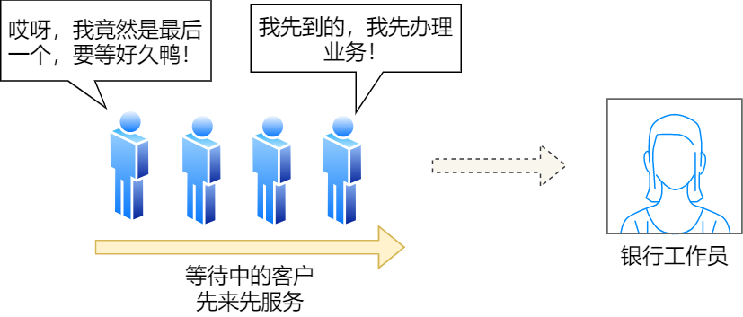
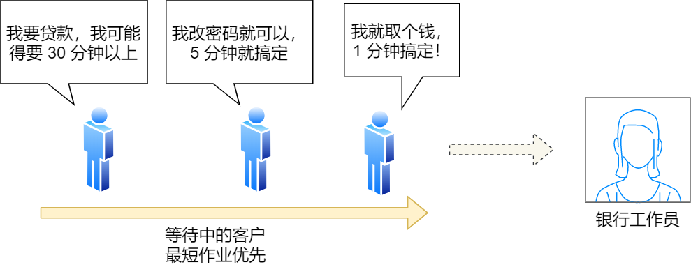

# 操作系统

> 参考哔哩哔哩的课程：<https://www.bilibili.com/video/BV1YB4y1i7xe/?spm_id_from=333.337.search-card.all.click&vd_source=731595967596af37618c926a191e7811>
>
> 参考了博客：<https://lfool.gitbook.io/operating-system/untitled-1/2.-cao-zuo-xi-tong-de-si-ge-te-zheng>
>
> 参考了大纲：https://mubu.com/doc/d9TGd1--LY#m
>
> 参考了图解系统：https://xiaolincoding.com/os/1_hardware/how_cpu_run.html#%E5%9B%BE%E7%81%B5%E6%9C%BA%E7%9A%84%E5%B7%A5%E4%BD%9C%E6%96%B9%E5%BC%8F

## 第一章 操作系统概述

### 操作系统的基本概念

操作系统是资源管理程序，其作用是控制管理计算机系统的资源和程序的指向。操作系统是计算机中最基础的软件，其作用简单来讲：

- 通过资源管理，提高计算机系统的**效率**

- 改善界面，为用户提供友好的工作环境（方便性）

最开始的计算机是依靠图灵机而演变来的，通过图灵机可以较好的了解计算机发展的过程

#### 图灵机

图灵的基本思想是用机器来模拟人们用纸笔进行数学运算的过程，而且还定义了计算机由哪些部分组成，程序又是如何执行的。


图灵机的基本组成如下：

- 有一条「纸带」，纸带由一个个连续的格子组成，每个格子可以写入字符，纸带就好比内存，而纸带上的格子的字符就好比内存中的数据或程序；
- 有一个「读写头」，读写头可以读取纸带上任意格子的字符，也可以把字符写入到纸带的格子；
- 读写头上有一些部件，比如存储单元、控制单元以及运算单元： 1、存储单元用于存放数据； 2、控制单元用于识别字符是数据还是指令，以及控制程序的流程等； 3、运算单元用于执行运算指令

> 使用图灵机计算1+2，图灵机按照顺序读取数字存入到存储单元中，读取到运算单元就会将之前读取的数字进行运算单元的运算之后将计算完成的结果记录到图灵机存储中的状态，输出就是结果了。


通过上面的图灵机计算 `1 + 2` 的过程，可以发现图灵机主要功能就是读取纸带格子中的内容，然后交给控制单元识别字符是数字还是运算符指令，如果是数字则存入到图灵机状态中，如果是运算符，则通知运算符单元读取状态中的数值进行计算，计算结果最终返回给读写头，读写头把结果写入到纸带的格子中。

#### 冯诺依曼架构

最重要的是定义计算机基本结构为 5 个部分，分别是**运算器、控制器、存储器、输入设备、输出设备**，这 5 个部分也被称为**冯诺依曼模型**。

**主机**：主机部分由运算器、存储器和控制器组成。

- **运算器**：负责执行所有的算术和逻辑运算。
- **存储器**：用于存储数据和指令。
- **控制器**：负责解释和执行指令，并控制其他部件的操作。

**外设**：由用户主导的输入和输出设备。

- **输入设备**：例如键盘、打孔卡片机等，用于将数据和指令输入到计算机中。
- **输出设备**：例如打印机、显示器等，用于将计算结果和其他信息输出给用户。


依靠不同的硬件设备所实现的不同功能，对应的各种设备也依照他们的机械属性进行了细致的分类：

##### 内存(RAM)

在计算机数据存储中，存储数据的基本单位是**字节（\*byte\*）**，1 字节等于 8 位（8 bit）。每一个字节都对应一个内存地址。

内存的地址是从 0 开始编号的，然后自增排列，最后一个地址为内存总字节数 - 1，这种结构好似我们程序里的数组，所以内存的读写任何一个数据的速度都是一样的。

##### 中央处理器(CPU)

32 位和 64 位 CPU 最主要区别在于一次能计算多少字节数据：

- 32 位 CPU 一次可以计算 4 个字节；
- 64 位 CPU 一次可以计算 8 个字节；

之所以 CPU 要这样设计，是为了能计算更大的数值，如果是 8 位的 CPU，那么一次只能计算 1 个字节 `0~255` 范围内的数值，这样就无法一次完成计算 `10000 * 500` ，于是为了能一次计算大数的运算，CPU 需要支持多个 byte 一起计算，所以 CPU 位宽越大，可以计算的数值就越大，比如说 32 位 CPU 能计算的最大整数是 `4294967295`。

##### 总线

总线是用于 CPU 和内存以及其他设备之间的通信，总线可分为 3 种：

- *地址总线*，用于指定 CPU 将要操作的内存地址；
- *数据总线*，用于读写内存的数据；
- *控制总线*，用于发送和接收信号，比如中断、设备复位等信号，CPU 收到信号后自然进行响应，这时也需要控制总线；

当 CPU 要读写内存数据的时候，一般需要通过下面这三个总线：

- 首先要通过「地址总线」来指定内存的地址；
- 然后通过「控制总线」控制是读或写命令；
- 最后通过「数据总线」来传输数据；

#### 操作系统的特征

##### 观点描述

根据不同的观点，可以描述不同的计算机类型

**用户观点**

**定制化设计**：根据用户所使用的不同类型的计算机，设计相应的操作系统以满足其需求。例如，桌面操作系统（如Windows、macOS）与移动操作系统（如Android、iOS）的设计会有所不同，因其面向的用户群体和使用场景不同。

**系统观点**

资源管理器：操作系统被视为计算机系统的资源管理器，其主要功能是管理和分配系统资源。具体包括：

- **处理器管理**：调度和分配CPU时间，使得多个进程能够有效运行。
- **存储器管理**：管理物理内存和虚拟内存，确保各进程能够获得所需的内存空间。
- **设备管理**：管理输入输出设备，协调设备之间的操作。
- **信息管理**：管理数据和文件系统，确保数据的有效存储和检索。

**物质基础与工作环境**

操作系统本身依赖于计算机硬件，包括处理器、存储器、外设等，它们构成了操作系统赖以运行的基础。

**进程观点**

多进程架构 ：操作系统由多个可以独立运行的程序（进程）和一个负责协调这些程序的核心（通常是CPU）组成。

- **用户进程**：由用户启动和使用的应用程序。
- **系统进程**：操作系统内部用于管理和维护系统的进程。

**虚拟机观点**

机器扩展：操作系统本质上可以看作一个虚拟机，扩展了计算机的物理硬件，使其提供更加便捷和高级的功能。

- **分层结构**：操作系统被设计为多个层次，每一层执行特定的功能。
- **虚拟机服务**：通过层次化设计，操作系统为上层应用提供了一个虚拟化的工作环境，屏蔽底层硬件的复杂性，使开发和运行应用更加便捷。
- **虚拟机在底层**：虚拟机的概念通常应用在底层，以便上层应用程序可以在一个统一和抽象的环境中运行，而不必关心底层硬件的差异。

##### 特征描述

**并发性**

**定义**：并发性指两个或多个事件在同一时间间隔内发生。宏观上，这些事件似乎是同时发生的，但微观上，它们实际上是交替发生的。这**类似于计算机网络中的时分复用**。

**示例**：在多任务环境中，多个进程或线程在同一时间间隔内执行任务。

**共享性**

**定义**：共享即资源共享，指系统中的资源可以被内存中多个并发执行的进程共同使用。

资源共享的方式
- **互斥共享**：某些资源虽然可以被多个进程使用，但在任何时间点，只允许一个进程访问。例如，打印机和磁带机。
- **同时共享**：某些资源允许在同一时间段内被多个进程同时访问。例如，磁盘和内存。

**虚拟性**

**定义**：虚拟性是指将一个物理实体变为若干个逻辑上的对应物。物理实体是实际存在的，而逻辑对应物是用户感受到的。

- **虚拟存储技术（空分复用技术）**：在一个具有4 GB内存的电脑上，可以运行远大于4 GB内存的程序。
- **虚拟处理器技术（时分复用技术）**：在单核计算机上，可以同时运行多个程序。

**异步**

**定义**：异步性指程序执行的顺序和时间是不可预知的。程序的执行可能会因为各种原因被中断或延迟，但最终会在有限时间内完成。

其指的是程序中的某些操作可以在**等待特定条件**（如I/O操作完成、网络请求返回数据、计时器到期等）**满足之前**，让程序继续执行其他任务。一旦这些条件满足，等待的操作就会被触发和执行。

#### 程序执行的基本过程

程序实际上是一条一条指令，所以程序的运行过程就是把每一条指令一步一步的执行起来，负责执行指令的就是 CPU 了。


 CPU 执行程序的过程如下：

- 第一步，CPU 读取「程序计数器」的值，这个值是指令的内存地址，然后 CPU 的「控制单元」操作「地址总线」指定需要访问的内存地址，接着通知内存设备准备数据，数据准备好后通过「数据总线」将指令数据传给 CPU，CPU 收到内存传来的数据后，将这个指令数据存入到「指令寄存器」。
- 第二步，「程序计数器」的值自增，表示指向下一条指令。这个自增的大小，由 CPU 的位宽决定，比如 32 位的 CPU，指令是 4 个字节，需要 4 个内存地址存放，因此「程序计数器」的值会自增 4；
- 第三步，CPU 分析「指令寄存器」中的指令，确定指令的类型和参数，如果是计算类型的指令，就把指令交给「逻辑运算单元」运算；如果是存储类型的指令，则交由「控制单元」执行；

简单总结一下就是，一个程序执行的时候，CPU 会根据程序计数器里的内存地址，从内存里面把需要执行的指令读取到指令寄存器里面执行，然后根据指令长度自增，开始顺序读取下一条指令。

CPU 从程序计数器读取指令、到执行、再到下一条指令，这个过程会不断循环，直到程序执行结束，这个不断循环的过程被称为 **CPU 的指令周期**。

#### 操作系统的发展过程

##### 无操作系统

- 用户独占计算机资源：每次只有一个用户或一个程序可以使用计算机的资源。
- 资源利用率低：由于计算机资源在用户等待输入时处于空闲状态，因此整体资源利用效率较低。
- CPU等待用户输入：计算机的中央处理器（CPU）在用户提供输入或指令之前，通常处于等待状态，不能执行其他任务。

##### 单批处理系统

**定义**：最早出现的操作系统类型，通过批处理方式自动化任务处理。

- **自动性**：系统自动执行一系列任务，无需用户干预。
- **顺序性**：任务按顺序处理，每次只处理一个作业。
- **单道性**：内存中只保留一个程序的执行，即一次只加载一道程序，其他程序在内存中等待。

##### 多批处理系统

**定义**：引入了多道程序设计，改进了计算机资源的利用方式。

- **多道性**：同时在内存中保留多个程序，这些程序可以在等待I/O操作或其他事件时使CPU继续执行其他任务。
- **宏观上并行**：多个程序的执行看起来是并行的，因为它们共享CPU资源。
- **微观上串行**：在任意时刻，CPU实际上只处理一个程序的任务，通过快速切换实现“并行”。

**优点**：

- **资源利用率高**：多个程序共享计算机资源，使得CPU和其他硬件资源保持忙碌状态，减少了资源的闲置时间。
- **系统吞吐量大**：由于多个程序并行处理，系统的吞吐量（单位时间内处理的作业数量）显著提高。
- **切换开销小**：仅在程序完成或需要进行切换时，才进行上下文切换，相比频繁的用户交互，系统开销较小。

**缺点**：

- **用户响应时间长**：由于程序在等待队列中，用户可能需要等待较长时间才能获得系统响应。
- **缺乏人机交互能力**：用户无法实时了解计算机的运行情况，也无法直接控制计算机的执行流程。

### 操作系统的分类*

#### 批处理操作系统

**特点**：

- **用户脱机使用**：用户在离线状态下提交作业，操作系统会自动处理这些作业。
- **成批处理**：作业被集中到一起形成一个批次，操作系统将整个批次中的作业逐个处理。这里的“批”指的是一组作业的集合。
- **多道程序运行**：系统内存中可以同时存在多个作业，每个作业在不同的时间段占用CPU资源。

**说明**：

- **作业**：包括程序、数据和作业说明书。作业说明书描述了作业的处理要求和资源需求。
- **监督程序**：操作系统中配置的程序，用于自动管理和调度批处理作业。

#### 分时操作系统

**时间片**：将处理器的运行时间划分为很短的时间片，系统按时间片轮流分配给各个联机作业。

- **简单分时操作系统**：基本的分时机制，处理多个用户任务。
- **前台和后台分时操作系统**：前台处理用户交互任务，后台处理后台作业。
- **多道分时操作系统**：同时支持多个用户的交互操作与后台作业的处理。

特征
- **多路性**：在微观上，各用户轮流使用计算机；在宏观上，各用户并行工作。
- **交互性**：用户可以直接控制和交互自己的程序，以人机对话的方式进行操作。
- **独立性**：各用户的操作相互独立，不会干扰或混淆。
- **及时性**：系统能够快速响应用户请求，相比批处理系统响应时间更短。

#### 实时操作系统

- **实时工业控制系统**：用于工业自动化和控制系统，需要高可靠性和及时响应。
- **实时信息处理系统**：处理实时数据流，如金融交易系统。
- **实时多媒体系统**：支持音频、视频等多媒体应用，要求低延迟。
- **实时嵌入式系统**：嵌入到硬件中，用于特定的实时任务，如汽车控制系统。

**特点**：

- **及时性**：能够在规定的时间内完成任务，并对事件做出迅速响应。
- **可靠性**：系统具备多级容错措施，确保在各种条件下稳定运行。
- **过载防护能力**：能够处理高负荷条件下的任务，保持系统稳定性。
- **支持多道程序设计**：提高系统利用率和吞吐量。
- **交互性**：能够处理实时用户交互请求。

**特征**：及时性和可靠性是实时系统的主要特征。

#### 其他操作系统

**嵌入式操作系统**：

- 专为嵌入式设备设计，通常用于特定的硬件，如家用电器、汽车等。特点是资源占用少、实时性强。

**集群操作系统**：

- **定义**：多个独立的计算机系统通过网络连接起来，协同完成一个任务。
- **特点**：提供负载均衡、容错和高可用性，确保系统的整体性能和可靠性。

**网络操作系统**：

- **定义**：管理网络中计算机资源的操作系统。
- 特点
  - **互联计算机系统**：网络中多个计算机互相连接。
  - **自洽性**：每台计算机能够独立运行。
  - **通信设备**：通过网络设备（如路由器、交换机）实现计算机间的通信。
  - **资源共享**：实现网络资源的共享和访问。

**分布式操作系统**：

- **定义**：将处理单元分布在多个物理位置，通过网络连接实现统一的系统。
- 特点
  - **统一性**：为用户提供统一的操作体验。
  - **共享性**：系统资源可以被网络中多个计算机共享。
  - **透明性**：系统隐藏了分布式计算的复杂性，使得用户像使用单一计算机一样操作。
  - **自治性**：每个节点具有一定的自治能力，同时支持分布式环境中的协作。
  - **可靠性**：通过冗余和容错机制提升系统的整体可靠性。

> 分时操作系统和实时操作系统的区别：
>
> - **分时操作系统** 主要关注多用户交互和资源利用效率，通过时间片轮转使多个用户可以公平地访问计算机资源。
> - **实时操作系统** 主要关注任务的及时性和可靠性，通过优先级调度和中断处理保证任务能在严格的时间限制内完成。

### 操作系统运行环境*

#### 处理器执行状态

> 核心态（内核态、系统态）

- **定义**：操作系统管理程序执行时机器的状态，具有最高的权限级别。
- 特性
  - **权限**：可以执行所有指令，包括特权指令（如直接访问硬件、控制内存保护等）。
  - **访问范围**：可以访问所有寄存器和内存区域，执行任意操作。
  - **职责**：处理系统调用、硬件中断、异常处理、系统资源管理等关键任务。

> 用户态（用户态）

- **定义**：用户程序执行时机器的状态，权限级别较低。
- 特性
  - **权限**：只能执行受限的指令，不能执行特权指令。
  - **访问范围**：只能访问有限的寄存器和内存区域，不能直接访问核心态资源。
  - **职责**：执行用户应用程序的逻辑，处理用户数据和应用层任务。

> 从用户态切换到核心态

- **机制**：用户程序不能直接调用核心态的功能，必须通过特定的机制进行切换。
- 方法
  - **系统调用**：用户程序通过系统调用请求操作系统服务，例如文件操作、进程管理等。系统调用会触发一个软中断，操作系统从用户态切换到核心态。
  - **中断**：硬件中断（如输入设备的信号）会使系统从用户态切换到核心态，以处理设备的请求。
  - **异常**：用户程序发生错误（如非法操作、除零错误）会触发异常，系统从用户态切换到核心态进行处理。
  - **特权指令**：用户程序尝试执行特权指令（如访问受保护的内存区域）会触发中断或异常，系统从用户态切换到核心态。
  - **中断返回指令**：系统在处理完请求后，通过中断返回指令将控制权从核心态切换回用户态，恢复用户程序的执行。
  - **仿管指令**：某些系统支持仿管指令用于模拟核心态功能，通常用于虚拟化环境。

#### 内核指令

> 时钟管理

- **定义**：时钟是操作系统中最关键的设备之一。
- 功能
  - **计时**：提供系统时间和跟踪操作的持续时间。
  - 时钟中断用于进程调度和系统维护。通过定期的时钟中断，操作系统可以实现：
    - **进程切换**：在多任务环境中，时钟中断触发的调度程序决定何时将CPU从当前进程切换到下一个进程。
    - **时间片管理**：确保每个进程或任务获得公平的CPU时间片，以实现多道程序的高效运行。

> 中断机制

- **定义**：中断机制是操作系统中用于响应外部事件和内部请求的基本机制。
- 发展
  - **早期**：最初，中断机制用于提高多道程序环境下的CPU利用率，主要用于响应外部设备的信号。
  - 现代中断机制已成为操作系统的核心，支持各种操作，包括：
    - **硬件中断**：来自外部设备的信号，如键盘输入、网络数据包。
    - **软件中断**：由程序或操作系统发出的信号，用于系统调用和异常处理。

> 原语

- **定义**：原语是操作系统中执行基本操作的小程序，它们通常是关闭中断或执行特定任务的代码。
- 特征
  - **接近硬件**：直接操作硬件或系统内部状态。
  - **原子性**：操作必须一次性完成，不允许中断，确保数据一致性和系统稳定性。
  - **运行时间短**：原语执行迅速，以减少对系统性能的影响，并且经常被调用以实现高效的操作。

### 中断与异常

在计算机中，中断是系统用来响应硬件设备请求的一种机制，操作系统收到硬件的中断请求，会打断正在执行的进程，然后调用内核中的中断处理程序来响应请求。

这样的解释可能过于学术了，容易云里雾里，我就举个生活中取外卖的例子。

小林中午搬完砖，肚子饿了，点了份白切鸡外卖，这次我带闪了，没有被某团大数据杀熟。虽然平台上会显示配送进度，但是我也不能一直傻傻地盯着呀，时间很宝贵，当然得去干别的事情，等外卖到了配送员会通过「电话」通知我，电话响了，我就会停下手中地事情，去拿外卖。

这里的打电话，其实就是对应计算机里的中断，没接到电话的时候，我可以做其他的事情，只有接到了电话，也就是发生中断，我才会停下当前的事情，去进行另一个事情，也就是拿外卖。

从这个例子，我们可以知道，**中断是一种异步的事件处理机制，可以提高系统的并发处理能力。**

操作系统收到了中断请求，会打断其他进程的运行，所以**中断请求的响应程序，也就是中断处理程序，要尽可能快的执行完，这样可以减少对正常进程运行调度地影响。**

而且，中断处理程序在响应中断时，可能还会「临时关闭中断」，这意味着，如果当前中断处理程序没有执行完之前，系统中其他的中断请求都无法被响应，也就说中断有可能会丢失，所以中断处理程序要短且快。

还是回到外卖的例子，小林到了晚上又点起了外卖，这次为了犒劳自己，共点了两份外卖，一份小龙虾和一份奶茶，并且是由不同地配送员来配送，那么问题来了，当第一份外卖送到时，配送员给我打了长长的电话，说了一些杂七杂八的事情，比如给个好评等等，但如果这时另一位配送员也想给我打电话。

很明显，这时第二位配送员因为我在通话中（相当于关闭了中断响应），自然就无法打通我的电话，他可能尝试了几次后就走掉了（相当于丢失了一次中断）。

#### **中断（外中断）**

**定义**：中断是系统正常操作的一部分，用于响应外部事件。

- **外设请求**：例如，输入设备、网络适配器发出的信号。
- **人的干预**：如键盘中断或用户请求。


#### **异常（内中断）**

**定义**：异常是由系统错误或异常情况引起的中断。

- **文件损坏**：例如，尝试访问受损的文件。
- **进程越界**：如访问非法内存地址。
- **算术溢出**：例如，整数溢出或除零错误。
- **硬件故障**：如硬件组件出现故障。
- **软件中断**：程序故意触发的软件中断请求。

**特征**：异常通常是不预期的，指示系统出现了错误或问题。

**区别**：异常是中断的一种特殊形式，主要由于错误或不正常的情况触发，而中断不一定是由异常引起的，它可以是外部设备的正常请求或用户操作。

#### 中断处理过程

1. **关中断**：禁用中断，以防止在处理中断时发生新的中断。
2. **保存断点**：保存当前执行状态，以便在中断处理完后能够恢复。
3. **中断服务程序寻址**：定位和准备执行相应的中断服务程序。
4. **保存现场和屏蔽字**：保存当前寄存器和状态信息，并屏蔽中断，以保证处理过程中不会被干扰。
5. **开中断**：重新启用中断，以便在处理过程中可能产生的新的中断能被处理。
6. **执行中断服务程序**：执行中断服务程序以处理具体的中断请求。
7. **关中断**：禁用中断，以确保在恢复现场时不会有新的中断干扰。
8. **恢复现场和屏蔽字**：恢复保存的寄存器和状态信息，并恢复中断屏蔽状态。
9. **开中断，中断返回**：重新启用中断，并返回到中断发生之前的程序执行点。

- **步骤 1~3**：由硬件（中断控制器）自动完成。
- **步骤 4~9**：由中断处理程序完成，以确保系统在处理中断后能够正确恢复并继续运行。

### 操作系统的体系结构*

#### 模块组合结构

**优点**

- 结构紧密，接口简单直接
- 系统的效率相对较高

**缺点**

- 系统结构不清晰
- 可扩展性较差
- 可适应性差
- 只适用于系统小、模块少、使用环境比较稳定的系统

#### 层次结构

**特点**

- 模块之间单向调用和单向依赖

**优点**

- 使模块间的组织和依赖关系清晰明了
- 便于修改和扩充

**缺点**

- 必须将与机器特点紧密相关的软件（如中断处理、输入/输出管理）放在最底层
- 常用操作应放在最内层，而变化较多的操作应放在外层
- 系统调用模块提供进程服务的部分应放在系统内层
- 系统效率可能降低

#### 微内核结构

**微内核结构**由一个非常简单的硬件抽象层和一组比较关键的原语或系统调用组成，这些原语仅仅包括了建立一个系统必需的几个部分，如线程管理、地址空间和进程间通信等。其他的管理程序则尽可能地放在内核之外。

> 把操作系统中更多的成分和功能放到更高的层次(即用户模式)中去运行，而留下一个尽量小的内核，用它来完成操作系统最基本的核心功能，这种技术被称为微内核技术。

**特点**

- 在操作系统内核中只保留基本功能，将其他服务分离出去，通过若干个用户态进程（服务器进程）实现，形成C/S模式

**优点**

- 可靠性高
- 灵活性好
- 便于维护
- 适合分布式处理的计算环境

**缺点**

- 效率不高（尤其是通信频繁的系统）


## 第二章 进程与线程


### 前趋图

前驱图（即控制流图或依赖图）可以帮助我们更好地描述和控制程序的并发执行：


- **资源共享管理**
  前驱图可以描绘进程间的依赖关系，帮助管理和协调资源共享，以避免竞争条件和死锁问题。
- **状态管理**
  通过前驱图，能够清晰地识别进程的执行顺序和依赖关系，从而有效地控制进程状态，保证系统的一致性和稳定性。
- **调度与同步**
  前驱图有助于设计和优化进程调度策略，确保并发进程在正确的顺序和时机下执行，并进行必要的同步操作。

### 进程

我们编写的代码只是一个存储在硬盘的静态文件，通过编译后就会生成二进制可执行文件，当我们运行这个可执行文件后，它会被装载到内存中，接着 CPU 会执行程序中的每一条指令，那么这个**运行中的程序，就被称为「进程」（Process）**。也就是**进程是执行中的程序。**


CPU在计算的时候需要读取硬盘里的信息加以计算，但是受限于硬盘的读取速度如果要完全计算完一个进程，CPU的运算速率就会变慢。所以，当进程要从硬盘读取数据时，CPU 不需要阻塞等待数据的返回，而是去执行另外的进程。当硬盘数据返回时，CPU 会收到个**中断**，于是 CPU 再继续运行这个进程。

> 这也就是时分运算，对于一小段时间而言CPU会交替计算所有运行的进程。但是在大的时间看来，CPU是同时运算的。


这种**多个程序、交替执行**的思想，就有 CPU 管理多个进程的初步想法。

对于一个支持多进程的系统，CPU 会从一个进程快速切换至另一个进程，其间每个进程各运行几十或几百个毫秒。

虽然单核的 CPU 在某一个瞬间，只能运行一个进程。但在 1 秒钟期间，它可能会运行多个进程，这样就产生**并行的错觉**，实际上这是**并发**。

> 并发和并行的区别


> 进程与程序的关系的类比

到了晚饭时间，一对小情侣肚子都咕咕叫了，于是男生见机行事，就想给女生做晚饭，所以他就在网上找了辣子鸡的菜谱，接着买了一些鸡肉、辣椒、香料等材料，然后边看边学边做这道菜。


突然，女生说她想喝可乐，那么男生只好把做菜的事情暂停一下，并在手机菜谱标记做到哪一个步骤，把状态信息记录了下来。

然后男生听从女生的指令，跑去下楼买了一瓶冰可乐后，又回到厨房继续做菜。

**这体现了，CPU 可以从一个进程（做菜）切换到另外一个进程（买可乐），在切换前必须要记录当前进程中运行的状态信息，以备下次切换回来的时候可以恢复执行。**

**进程有着「运行 - 暂停 - 运行」的活动规律。**

-----

> 针对于上述特点总结了一下性质

程序的顺序执行： **程序在顺序执行时，只有前一个操作执行完成后**，后续操作才能执行。

- 顺序性：操作按既定顺序依次进行。
- 封闭性：程序运行期间，结果不受外界影响，独占系统资源。
- 可再现性：初始条件和执行环境相同，程序重复执行会得到相同结果。

程序的并发执行： **多个程序（程序段）同时在系统中运行。**

- 间断性：程序共享资源或相互协作，形成相互制约关系。
- 失去封闭性：多个程序共享系统资源。
- 不可再现性：由于共享资源和相互影响，程序执行结果可能不同。

并发执行的条件： **并发执行要求程序具有可再现性**，符合 Bernstein 理想化状态：

- 确保在两次读操作之间，存储器中的数据不发生变化。

- 确保写操作结果不会丢失。

进程从功能出发有以下特征：

- **动态**性: 进程是程序的一次执行过程，是动态地产生、变化和消亡的
- **并发**性: 内存中有多个进程实体，各进程可井发执行
- 独立性: 进程是能独立运行、独立获得资源、独立接受调度的基本单位
  - **进程是资源分配、接受调度的基本, 独立单位**
- **异步**性: 各进程按各自独立的、不可预知的速度向前推进，操作系统要提供"进程同步机制"来解决异步问题
- **结构**性: 每个进程都会配置一个PCB。结构上看，进程由PCB、程序段、数据段组成

进程和程序的关系：

- 进程是动态的，程序是静止的。
- 每个进程包含程序段、数据段以及进程控制块（PCB），而程序是有序代码的集合。
- 进程是暂时的，程序是永久的。
- 一个程序通过多次执行可以产生多个不同的进程；通过调用关系，一个进程可以执行多个程序，而程序不能形成新的程序。
- 进程具有并行特性（独立性、异步性），而程序没有。

进程和作业的区别：**作业**是用户需要计算机**完成某项任务而要求计算机所做的工作的集合**。

- 作业是用户向计算机提交任务的任务实体。
- 进程是完成用户任务的执行实体。
- 一个作业由至少一个进程组成，但一个进程不能构成多个作业。

进程的特征

- 动态性：进程是程序在处理器上的一次执行过程，因而是动态的(动态性是进程的最基本的特征)
- 并发性：指多个进程实体同时存于内存中，能在一段时间内同时运行
- 独立性：是指进程实体是一个能独立运行、独立获得资源和独立接受调度的基本单位
- 异步性：进程按照各自独立运行的、不可预知的速度向前推进
- 结构性：从结构上看，进程实体是由程序段、数据段和进程控制块(PCB)三部分组成的。

> 程序段:是指程序的代码
> 数据段:是指运行过程中产生的各种数据

#### 进程控制块(PCB)

**PCB 是进程存在的唯一标识**，这意味着一个进程的存在，必然会有一个 PCB，如果进程消失了，那么 PCB 也会随之消失。


> PCB具体包含的信息

**进程描述信息：**

- 进程标识符：标识各个进程，每个进程都有一个并且唯一的标识符；
- 用户标识符：进程归属的用户，用户标识符主要为共享和保护服务；

**进程控制和管理信息：**

- 进程当前状态，如 new、ready、running、waiting 或 blocked 等；
- 进程优先级：进程抢占 CPU 时的优先级；

**资源分配清单：**

- 有关内存地址空间或虚拟地址空间的信息，所打开文件的列表和所使用的 I/O 设备信息。

**CPU 相关信息：**

- CPU 中各个寄存器的值，当进程被切换时，CPU 的状态信息都会被保存在相应的 PCB 中，以便进程重新执行时，能从断点处继续执行。

可见，PCB 包含信息还是比较多的。

> 每个 PCB 是如何组织的呢？

通常是通过**链表**的方式进行组织，把具有**相同状态的进程链在一起，组成各种队列**。比如：

- 将所有处于就绪状态的进程链在一起，称为**就绪队列**；
- 把所有因等待某事件而处于等待状态的进程链在一起就组成各种**阻塞队列**；
- 另外，对于运行队列在单核 CPU 系统中则只有一个运行指针了，因为单核 CPU 在某个时间，只能运行一个程序。

那么，就绪队列和阻塞队列链表的组织形式如下图：


除了链接的组织方式，还有索引方式，它的工作原理：将同一状态的进程组织在一个索引表中，索引表项指向相应的 PCB，不同状态对应不同的索引表。

一般会选择链表，因为可能面临进程创建，销毁等调度导致进程状态发生变化，所以链表能够更加灵活的插入和删除。

#### 进程的基本状态

一般说来，一个进程并不是自始至终连续不停地运行的，它与并发执行中的其他进程的执行是相互制约的。

它有时处于运行状态，有时又由于某种原因而暂停运行处于等待状态，当使它暂停的原因消失后，它又进入准备运行状态。

所以，**在一个进程的活动期间至少具备三种基本状态，即运行状态、就绪状态、阻塞状态。**


上图中各个状态的意义：

- 运行状态（*Running*）：该时刻进程占用 CPU；
- 就绪状态（*Ready*）：可运行，由于其他进程处于运行状态而暂时停止运行；
- 阻塞状态（*Blocked*）：该进程正在等待某一事件发生（如等待输入/输出操作的完成）而暂时停止运行，这时，即使给它CPU控制权，它也无法运行；

当然，进程还有另外两个基本状态：

- 创建状态（*new*）：进程正在被创建时的状态；
- 结束状态（*Exit*）：进程正在从系统中消失时的状态；

于是，一个完整的进程状态的变迁如下图：


再来详细说明一下进程的状态变迁：

- **NULL -> 创建状态**：一个新进程被创建时的第一个状态。

- **创建状态 -> 就绪状态**：当进程被创建完成并初始化后，一切就绪准备运行时，变为就绪状态，这个过程是很快的。
  - **过程**：申请空白PCB → 填写控制信息 → 分配资源 → 转入就绪状态（若资源足够）。

- **就绪状态 -> 运行状态**：处于就绪状态的进程被操作系统的进程调度器选中后，就分配给 CPU 正式运行该进程。

  - **特征**：在就绪队列中等待调度。

  - **原因**：进程被调度程序选中，获得CPU时间片。

- **运行状态 -> 结束状态**：当进程已经运行完成或出错时，会被操作系统作结束状态处理。
  - **描述**：进程正在使用CPU执行任务。

- **运行状态 -> 就绪状态**：处于运行状态的进程在运行过程中，由于分配给它的运行时间片用完，操作系统会把该进程变为就绪态，接着从就绪态选中另外一个进程运行。
  - **原因**：时间片用完，或有更高优先级的进程变为就绪状态。

- **运行状态 -> 阻塞状态**：当进程请求某个事件且必须等待时，例如请求 I/O 事件。

  - **描述**：进程等待某些事件发生，如I/O操作完成或资源释放。

  - **原因**：进程因等待某些事件（如I/O操作）而无法继续执行。

- **阻塞状态 -> 就绪状态**：当进程要等待的事件完成时，它从阻塞状态变到就绪状态。
  - **原因**：所等待的事件发生，进程被唤醒，重新进入就绪队列。

- **结束状态**：
  - **描述**：进程正常或异常结束，操作系统进行善后处理，清除PCB并释放资源

---

如果有大量处于阻塞状态的进程，进程可能会占用着物理内存空间，显然不是我们所希望的，毕竟物理内存空间是有限的，被阻塞状态的进程占用着物理内存就一种浪费物理内存的行为。

所以，在虚拟内存管理的操作系统中，通常会把阻塞状态的进程的物理内存空间换出到硬盘，等需要再次运行的时候，再从硬盘换入到物理内存。


那么，就需要一个新的状态，来**描述进程没有占用实际的物理内存空间的情况，这个状态就是挂起状态**。这跟阻塞状态是不一样，阻塞状态是等待某个事件的返回。

另外，挂起状态可以分为两种：

- 阻塞挂起状态：进程在外存（硬盘）并等待某个事件的出现；
- 就绪挂起状态：进程在外存（硬盘），但只要进入内存，即刻立刻运行；

这两种挂起状态加上前面的五种状态，就变成了七种状态变迁


导致进程挂起的原因不只是因为进程所使用的内存空间不在物理内存，还包括如下情况：

- 通过 sleep 让进程间歇性挂起，其工作原理是设置一个定时器，到期后唤醒进程。
- 用户希望挂起一个程序的执行，比如在 Linux 中用 `Ctrl+Z` 挂起进程

##### 进程的控制


我们熟知了进程的状态变迁和进程的数据结构 PCB 后，再来看看进程的**创建、终止、阻塞、唤醒**的过程，这些过程也就是进程的控制。

**01 创建进程**

操作系统允许一个进程创建另一个进程，而且允许子进程继承父进程所拥有的资源。

创建进程的过程如下：

- 申请一个空白的 PCB，并向 PCB 中填写一些控制和管理进程的信息，比如进程的唯一标识等；
- 为该进程分配运行时所必需的资源，比如内存资源；
- 将 PCB 插入到就绪队列，等待被调度运行；

**02 终止进程**

进程可以有 3 种终止方式：正常结束、异常结束以及外界干预（信号 `kill` 掉）。

当子进程被终止时，其在父进程处继承的资源应当还给父进程。而当父进程被终止时，该父进程的子进程就变为孤儿进程，会被 1 号进程收养，并由 1 号进程对它们完成状态收集工作。

终止进程的过程如下：

- 查找需要终止的进程的 PCB；
- 如果处于执行状态，则立即终止该进程的执行，然后将 CPU 资源分配给其他进程；
- 如果其还有子进程，则应将该进程的子进程交给 1 号进程接管；
- 将该进程所拥有的全部资源都归还给操作系统；
- 将其从 PCB 所在队列中删除；

**03 阻塞进程**

当进程需要等待某一事件完成时，它可以调用阻塞语句把自己阻塞等待。而一旦被阻塞等待，它只能由另一个进程唤醒。

阻塞进程的过程如下：

- 找到将要被阻塞进程标识号对应的 PCB；
- 如果该进程为运行状态，则保护其现场，将其状态转为阻塞状态，停止运行；
- 将该 PCB 插入到阻塞队列中去；

**04 唤醒进程**

进程由「运行」转变为「阻塞」状态是由于进程必须等待某一事件的完成，所以处于阻塞状态的进程是绝对不可能叫醒自己的。

如果某进程正在等待 I/O 事件，需由别的进程发消息给它，则只有当该进程所期待的事件出现时，才由发现者进程用唤醒语句叫醒它。

唤醒进程的过程如下：

- 在该事件的阻塞队列中找到相应进程的 PCB；
- 将其从阻塞队列中移出，并置其状态为就绪状态；
- 把该 PCB 插入到就绪队列中，等待调度程序调度；

进程的阻塞和唤醒是一对功能相反的语句，如果某个进程调用了阻塞语句，则必有一个与之对应的唤醒语句。

##### 进程的上下文切换

**进程切换到另一个进程运行，称为进程的上下文切换**。

> 在详细说进程上下文切换前，我们先来看看 CPU 上下文切换

大多数操作系统都是多任务，通常支持大于 CPU 数量的任务同时运行。实际上，这些任务并不是同时运行的，只是因为系统在很短的时间内，让各个任务分别在 CPU 运行，于是就造成同时运行的错觉。

任务是交给 CPU 运行的，那么在每个任务运行前，CPU 需要知道任务从哪里加载，又从哪里开始运行。

所以，操作系统需要事先帮 CPU 设置好 **CPU 寄存器和程序计数器**。

**CPU 寄存器是 CPU 内部一个容量小，但是速度极快的内存（缓存）。**我举个例子，寄存器像是你的口袋，内存像你的书包，硬盘则是你家里的柜子，如果你的东西存放到口袋，那肯定是比你从书包或家里柜子取出来要快的多。

再来，程序计数器则是用来存储 CPU 正在执行的指令位置、或者即将执行的下一条指令位置。

所以说，CPU 寄存器和程序计数是 CPU 在运行任何任务前，所必须依赖的环境，这些环境就叫做 **CPU 上下文**。

既然知道了什么是 CPU 上下文，那理解 CPU 上下文切换就不难了。

CPU 上下文切换就是先把前一个任务的 CPU 上下文（CPU 寄存器和程序计数器）保存起来，然后加载新任务的上下文到这些寄存器和程序计数器，最后再跳转到程序计数器所指的新位置，运行新任务。

系统内核会存储保持下来的上下文信息，当此任务再次被分配给 CPU 运行时，CPU 会重新加载这些上下文，这样就能保证任务原来的状态不受影响，让任务看起来还是连续运行。

上面说到所谓的「任务」，主要包含进程、线程和中断。所以，可以根据任务的不同，把 CPU 上下文切换分成：**进程上下文切换、线程上下文切换和中断上下文切换**。

> 进程的上下文切换到底是切换什么呢？

进程是由内核管理和调度的，所以进程的切换只能发生在内核态。

所以，**进程的上下文切换不仅包含了虚拟内存、栈、全局变量等用户空间的资源，还包括了内核堆栈、寄存器等内核空间的资源。**

通常，会把交换的信息保存在进程的 PCB，当要运行另外一个进程的时候，我们需要从这个进程的 PCB 取出上下文，然后恢复到 CPU 中，这使得这个进程可以继续执行，如下图所示：


大家需要注意，进程的上下文开销是很关键的，我们希望它的开销越小越好，这样可以使得进程可以把更多时间花费在执行程序上，而不是耗费在上下文切换。

> 发生进程上下文切换有哪些场景？

- 为了保证所有进程可以得到公平调度，CPU 时间被划分为一段段的时间片，这些时间片再被轮流分配给各个进程。这样，当某个进程的时间片耗尽了，进程就从运行状态变为就绪状态，系统从就绪队列选择另外一个进程运行；
- 进程在系统资源不足（比如内存不足）时，**要等到资源满足后才可以运行，这个时候进程也会被挂起，并由系统调度其他进程运行**
- 当进程通过睡眠函数 sleep 这样的方法将自己主动挂起时，自然也会重新调度；
- 当有优先级更高的进程运行时，为了保证高优先级进程的运行，当前进程会被挂起，由高优先级进程来运行；
- 发生硬件中断时，CPU 上的进程会被中断挂起，转而执行内核中的中断服务程序；


### 线程

在早期的操作系统中都是以进程作为独立运行的基本单位，直到后面，计算机科学家们又提出了更小的能独立运行的基本单位，也就是**线程。**

> 可以把线程理解为“轻量级进程”

我们举个例子，假设你要编写一个视频播放器软件，那么该软件功能的核心模块有三个：

- 从视频文件当中读取数据；
- 对读取的数据进行解压缩；
- 把解压缩后的视频数据播放出来；

对于单进程的实现方式，会是以下这个方式：


对于单进程的这种方式，存在以下问题：

- 播放出来的画面和声音会不连贯，因为当 CPU 能力不够强的时候，`Read` 的时候可能进程就等在这了，这样就会导致等半天才进行数据解压和播放；
- 各个函数之间不是并发执行，影响资源的使用效率

那改进成多进程的方式：


对于多进程的这种方式，依然会存在问题：

- 进程之间如何通信，共享数据？
- 维护进程的系统开销较大，如创建进程时，分配资源、建立 PCB；终止进程时，回收资源、撤销 PCB；进程切换时，保存当前进程的状态信息；

那到底如何解决呢？需要有一种新的实体，满足以下特性：

- 实体之间可以并发运行；
- 实体之间共享相同的地址空间；

这个新的实体，就是**线程( \*Thread\* )**，线程之间可以并发运行且共享相同的地址空间。

#### 什么是线程

线程是**基本的CPU执行单元，也是程序执行流的最小单位**。

引入线程后，不仅可以在不同进程之间实现并发，而且**同一进程内的各个线程也可以并发执行**。这**提升了系统的并发度**，使得进程内能够**同时处理多种任务**，例如视频聊天、文字聊天和文件传输等。

引入线程的作用在于**将进程作为系统资源的分配单元**（如打印机、内存地址空间等），而**线程则作为调度的基本单位**。即，**进程是资源分配的基本单位，线程是调度的基本单位**。

- 每个线程都有一个线程ID和线程控制块（TCB）。
- **线程切换时无需切换进程环境**。
- 线程本身几乎不拥有系统资源。
- 同一进程内的线程可以共享进程资源，并且线程间的通信无需系统干预。


#### 线程实现

**用户线程（\*User Thread\*）**：在用户空间实现的线程，不是由内核管理的线程，是由用户态的线程库来完成线程的管理；

- 由应用程序通过线程库实现。
- 线程的管理（包括线程切换）完全由应用程序负责。
- 线程切换在用户态下完成，无需操作系统干预。
- 对用户来说，存在多个线程；对操作系统内核来说，线程的存在是不透明的（用户级线程对用户透明，对操作系统透明）。

**内核线程（\*Kernel Thread\*）**：在内核中实现的线程，是由内核管理的线程

- 由操作系统内核负责管理。
- 线程调度和切换都在核心态下完成。
- 线程的管理和切换由内核完成，因此需要操作系统的参与。

**轻量级进程（\*LightWeight Process\*）**：在内核中来支持用户线程；

---

那么，这还需要考虑一个问题，用户线程和内核线程的对应关系。

首先，第一种关系是**多对一**的关系，也就是多个用户线程对应同一个内核线程：

> **多对一模型**：

- 将多个用户级线程映射到一个内核级线程。每个用户进程只有一个内核级线程。
- 优点
  - 用户级线程切换在用户空间完成，减少了系统开销，提高了效率。
- 缺点
  - 如果一个用户级线程被阻塞，整个进程都会被阻塞，导致并发度降低。无法在多核处理机上并行运行多个线程。


第二种是**一对一**的关系，也就是一个用户线程对应一个内核线程：

- 每个用户级线程对应一个内核级线程。每个用户进程拥有与用户级线程数量相同的内核级线程。
- 优点
  - 一个线程被阻塞时，其他线程仍可继续执行，提供了更强的并发能力。支持多核处理机上的线程并行执行。
- 缺点
  - 一个用户进程占用多个内核级线程，线程切换需在核心态完成，增加了管理成本和系统开销


第三种是**多对多**的关系，也就是多个用户线程对应到多个内核线程：

- 多个用户级线程映射到多个内核级线程 (n ≥ m)。每个用户进程可以有多个内核级线程。
- 优点
  - 解决了多对一模型的并发度不足问题，同时避免了一对一模型中用户进程占用过多内核级线程的问题。兼具高并发性和较低的管理开销。


##### 用户线程

用户线程是基于用户态的线程管理库来实现的，那么**线程控制块（\*Thread Control Block, TCB\*）** 也是在库里面来实现的，对于操作系统而言是看不到这个 TCB 的，它只能看到整个进程的 PCB。

所以，**用户线程的整个线程管理和调度，操作系统是不直接参与的，而是由用户级线程库函数来完成线程的管理，包括线程的创建、终止、同步和调度等。**

用户级线程的模型，也就类似前面提到的**多对一**的关系，即多个用户线程对应同一个内核线程，如下图所示：


用户线程的**优点**：

- 每个进程都需要有它私有的线程控制块（TCB）列表，用来跟踪记录它各个线程状态信息（PC、栈指针、寄存器），TCB 由用户级线程库函数来维护，可用于不支持线程技术的操作系统；
- 用户线程的切换也是由线程库函数来完成的，无需用户态与内核态的切换，所以速度特别快；

用户线程的**缺点**：

- 由于操作系统不参与线程的调度，如果一个线程发起了系统调用而阻塞，那进程所包含的用户线程都不能执行了。
- 当一个线程开始运行后，除非它主动地交出 CPU 的使用权，否则它所在的进程当中的其他线程无法运行，因为用户态的线程没法打断当前运行中的线程，它没有这个特权，只有操作系统才有，但是用户线程不是由操作系统管理的。
- 由于时间片分配给进程，故与其他进程比，在多线程执行时，每个线程得到的时间片较少，执行会比较慢；

##### 内核线程

**内核线程是由操作系统管理的，线程对应的 TCB 自然是放在操作系统里的，这样线程的创建、终止和管理都是由操作系统负责。**

内核线程的模型，也就类似前面提到的**一对一**的关系，即一个用户线程对应一个内核线程，如下图所示：


内核线程的**优点**：

- 在一个进程当中，如果某个内核线程发起系统调用而被阻塞，并不会影响其他内核线程的运行；
- 分配给线程，多线程的进程获得更多的 CPU 运行时间；

内核线程的**缺点**：

- 在支持内核线程的操作系统中，由内核来维护进程和线程的上下文信息，如 PCB 和 TCB；
- 线程的创建、终止和切换都是通过系统调用的方式来进行，因此对于系统来说，系统开销比较大；

##### 轻量级进程

**轻量级进程（\*Light-weight process，LWP\*）是内核支持的用户线程，一个进程可有一个或多个 LWP，每个 LWP 是跟内核线程一对一映射的，也就是 LWP 都是由一个内核线程支持，而且 LWP 是由内核管理并像普通进程一样被调度**。

在大多数系统中，**LWP与普通进程的区别也在于它只有一个最小的执行上下文和调度程序所需的统计信息**。一般来说，一个进程代表程序的一个实例，而 LWP 代表程序的执行线程，因为一个执行线程不像进程那样需要那么多状态信息，所以 LWP 也不带有这样的信息。

在 LWP 之上也是可以使用用户线程的，那么 LWP 与用户线程的对应关系就有三种：

- `1 : 1`，即一个 LWP 对应 一个用户线程；
- `N : 1`，即一个 LWP 对应多个用户线程；
- `M : N`，即多个 LWP 对应多个用户线程；

接下来针对上面这三种对应关系说明它们优缺点。先看下图的 LWP 模型：


**1 : 1 模式**

一个线程对应到一个 LWP 再对应到一个内核线程，如上图的进程 4，属于此模型。

- 优点：实现并行，当一个 LWP 阻塞，不会影响其他 LWP；
- 缺点：每一个用户线程，就产生一个内核线程，创建线程的开销较大。

**N : 1 模式**

多个用户线程对应一个 LWP 再对应一个内核线程，如上图的进程 2，线程管理是在用户空间完成的，此模式中用户的线程对操作系统不可见。

- 优点：用户线程要开几个都没问题，且上下文切换发生用户空间，切换的效率较高；
- 缺点：一个用户线程如果阻塞了，则整个进程都将会阻塞，另外在多核 CPU 中，是没办法充分利用 CPU 的。

**M : N 模式**

根据前面的两个模型混搭一起，就形成 `M:N` 模型，该模型提供了两级控制，首先多个用户线程对应到多个 LWP，LWP 再一一对应到内核线程，如上图的进程 3。

- 优点：综合了前两种优点，大部分的线程上下文发生在用户空间，且多个线程又可以充分利用多核 CPU 的资源。

**组合模式**

如上图的进程 5，此进程结合 `1:1` 模型和 `M:N` 模型。开发人员可以针对不同的应用特点调节内核线程的数目来达到物理并行性和逻辑并行性的最佳方案。

#### 线程优缺点

线程的优点：

- 一个进程中可以同时存在多个线程；
- 各个线程之间可以并发执行；
- 各个线程之间可以共享地址空间和文件等资源；

线程的缺点：

- 当进程中的一个线程崩溃时，会导致其所属进程的所有线程崩溃

举个例子，对于游戏的用户设计，则不应该使用多线程的方式，否则一个用户挂了，会影响其他同个进程的线程。


#### 线程和进程比较区别


线程与进程的比较如下：

- 进程是资源（包括内存、打开的文件等）分配的单位，线程是 CPU 调度的单位；
- 进程拥有一个完整的资源平台，而线程只独享必不可少的资源，如寄存器和栈；
- 线程同样具有就绪、阻塞、执行三种基本状态，同样具有状态之间的转换关系；
- 线程能减少并发执行的时间和空间开销；

对于，线程相比进程能减少开销，体现在：

- 线程的创建时间比进程快，因为进程在创建的过程中，还需要资源管理信息，比如内存管理信息、文件管理信息，而线程在创建的过程中，不会涉及这些资源管理信息，而是共享它们；
- 线程的终止时间比进程快，因为线程释放的资源相比进程少很多；
- 同一个进程内的线程切换比进程切换快，因为线程具有相同的地址空间（虚拟内存共享），这意味着同一个进程的线程都具有同一个页表，那么在切换的时候不需要切换页表。而对于进程之间的切换，切换的时候要把页表给切换掉，而页表的切换过程开销是比较大的；
- 由于同一进程的各线程间共享内存和文件资源，那么在线程之间数据传递的时候，就不需要经过内核了，这就使得线程之间的数据交互效率更高了；

所以，不管是时间效率，还是空间效率线程比进程都要高。

### 多线程

当多线程相互竞争操作共享变量时，由于运气不好，即在执行过程中发生了上下文切换，我们得到了错误的结果，事实上，每次运行都可能得到不同的结果，因此输出的结果存在**不确定性（indeterminate）**。

由于多线程执行操作共享变量的这段代码可能会导致竞争状态，因此我们将此段代码称为**临界区（critical section），它是访问共享资源的代码片段，一定不能给多线程同时执行。**

我们希望这段代码是**互斥（mutualexclusion）的，也就说保证一个线程在临界区执行时，其他线程应该被阻止进入临界区**，说白了，就是这段代码执行过程中，最多只能出现一个线程。

#### 互斥的概念

上面展示的情况称为**竞争条件（race condition）**，当多线程相互竞争操作共享变量时，由于运气不好，即在执行过程中发生了上下文切换，我们得到了错误的结果，事实上，每次运行都可能得到不同的结果，因此输出的结果存在**不确定性（indeterminate）**。

由于多线程执行操作共享变量的这段代码可能会导致竞争状态，因此我们将此段代码称为**临界区（\*critical section\*），它是访问共享资源的代码片段，一定不能给多线程同时执行。**

我们希望这段代码是**互斥（\*mutualexclusion\*）的，也就说保证一个线程在临界区执行时，其他线程应该被阻止进入临界区**，说白了，就是这段代码执行过程中，最多只能出现一个线程。


#### 同步的概念

互斥解决了并发进程/线程对临界区的使用问题。这种基于临界区控制的交互作用是比较简单的，只要一个进程/线程进入了临界区，其他试图想进入临界区的进程/线程都会被阻塞着，直到第一个进程/线程离开了临界区。

我们都知道在多线程里，每个线程并不一定是顺序执行的，它们基本是以各自独立的、不可预知的速度向前推进，但有时候我们又希望多个线程能密切合作，以实现一个共同的任务。

例子，线程 1 是负责读入数据的，而线程 2 是负责处理数据的，这两个线程是相互合作、相互依赖的。线程 2 在没有收到线程 1 的唤醒通知时，就会一直阻塞等待，当线程 1 读完数据需要把数据传给线程 2 时，线程 1 会唤醒线程 2，并把数据交给线程 2 处理。

**所谓同步，就是并发进程/线程在一些关键点上可能需要互相等待与互通消息，这种相互制约的等待与互通信息称为进程/线程同步**。

举个生活的同步例子，你肚子饿了想要吃饭，你叫妈妈早点做菜，妈妈听到后就开始做菜，但是在妈妈没有做完饭之前，你必须阻塞等待，等妈妈做完饭后，自然会通知你，接着你吃饭的事情就可以进行了。


注意，同步与互斥是两种不同的概念：

- 同步就好比：「操作 A 应在操作 B 之前执行」，「操作 C 必须在操作 A 和操作 B 都完成之后才能执行」等；
- 互斥就好比：「操作 A 和操作 B 不能在同一时刻执行」；

#### 互斥与同步的实现和使用

在进程/线程并发执行的过程中，进程/线程之间存在协作的关系，例如有互斥、同步的关系。

为了实现进程/线程间正确的协作，操作系统必须提供实现进程协作的措施和方法，主要的方法有两种：

- *锁*：加锁、解锁操作；
- *信号量*：P、V 操作；

这两个都可以方便地实现进程/线程互斥，而信号量比锁的功能更强一些，它还可以方便地实现进程/线程同步

##### 锁

使用加锁操作和解锁操作可以解决并发线程/进程的互斥问题。

任何想进入临界区的线程，必须先执行加锁操作。若加锁操作顺利通过，则线程可进入临界区；在完成对临界资源的访问后再执行解锁操作，以释放该临界资源。


根据锁的实现不同，可以分为「忙等待锁」和「无忙等待锁」。

##### 信号量

信号量是操作系统提供的一种协调共享资源访问的方法。

通常**信号量表示资源的数量**，对应的变量是一个整型（`sem`）变量。

另外，还有**两个原子操作的系统调用函数来控制信号量的**，分别是：

- *P 操作*：将 `sem` 减 `1`，相减后，如果 `sem < 0`，则进程/线程进入阻塞等待，否则继续，表明 P 操作可能会阻塞；
- *V 操作*：将 `sem` 加 `1`，相加后，如果 `sem <= 0`，唤醒一个等待中的进程/线程，表明 V 操作不会阻塞；

P 操作是用在进入临界区之前，V 操作是用在离开临界区之后，这两个操作是必须成对出现的。

举个类比，2 个资源的信号量，相当于 2 条火车轨道，PV 操作如下图过程：


#### 经典同步问题

##### 生产-消费者问题


生产者-消费者问题描述：

- **生产者**在生成数据后，放在一个缓冲区中；
- **消费者**从缓冲区取出数据处理；
- 任何时刻，**只能有一个**生产者或消费者可以访问缓冲区；

我们对问题分析可以得出：

- 任何时刻只能有一个线程操作缓冲区，说明操作缓冲区是临界代码，**需要互斥**；
- 缓冲区空时，消费者必须等待生产者生成数据；缓冲区满时，生产者必须等待消费者取出数据。说明生产者和消费者**需要同步**。

那么我们需要三个信号量，分别是：

- 互斥信号量 `mutex`：用于互斥访问缓冲区，初始化值为 1；
- 资源信号量 `fullBuffers`：用于消费者询问缓冲区是否有数据，有数据则读取数据，初始化值为 0（表明缓冲区一开始为空）；
- 资源信号量 `emptyBuffers`：用于生产者询问缓冲区是否有空位，有空位则生成数据，初始化值为 n （缓冲区大小）；

具体的实现代码：


如果消费者线程一开始执行 `P(fullBuffers)`，由于信号量 `fullBuffers` 初始值为 0，则此时 `fullBuffers` 的值从 0 变为 -1，说明缓冲区里没有数据，消费者只能等待。

接着，轮到生产者执行 `P(emptyBuffers)`，表示减少 1 个空槽，如果当前没有其他生产者线程在临界区执行代码，那么该生产者线程就可以把数据放到缓冲区，放完后，执行 `V(fullBuffers)` ，信号量 `fullBuffers` 从 -1 变成 0，表明有「消费者」线程正在阻塞等待数据，于是阻塞等待的消费者线程会被唤醒。

消费者线程被唤醒后，如果此时没有其他消费者线程在读数据，那么就可以直接进入临界区，从缓冲区读取数据。最后，离开临界区后，把空槽的个数 + 1。

##### 读者-写者问题

「哲学家进餐问题」对于互斥访问有限的竞争问题（如 I/O 设备）一类的建模过程十分有用。

另外，还有个著名的问题是「读者-写者」，它为数据库访问建立了一个模型。

读者只会读取数据，不会修改数据，而写者即可以读也可以修改数据。

读者-写者的问题描述：

- 「读-读」允许：同一时刻，允许多个读者同时读
- 「读-写」互斥：没有写者时读者才能读，没有读者时写者才能写
- 「写-写」互斥：没有其他写者时，写者才能写

接下来，提出几个解决方案来分析分析。

> 方案一

使用信号量的方式来尝试解决：

- 信号量 `wMutex`：控制写操作的互斥信号量，初始值为 1 ；
- 读者计数 `rCount`：正在进行读操作的读者个数，初始化为 0；
- 信号量 `rCountMutex`：控制对 rCount 读者计数器的互斥修改，初始值为 1；

接下来看看代码的实现：


上面的这种实现，是读者优先的策略，因为只要有读者正在读的状态，后来的读者都可以直接进入，如果读者持续不断进入，则写者会处于饥饿状态。

> 方案二

那既然有读者优先策略，自然也有写者优先策略：

- 只要有写者准备要写入，写者应尽快执行写操作，后来的读者就必须阻塞；
- 如果有写者持续不断写入，则读者就处于饥饿；

在方案一的基础上新增如下变量：

- 信号量 `rMutex`：控制读者进入的互斥信号量，初始值为 1；
- 信号量 `wDataMutex`：控制写者写操作的互斥信号量，初始值为 1；
- 写者计数 `wCount`：记录写者数量，初始值为 0；
- 信号量 `wCountMutex`：控制 wCount 互斥修改，初始值为 1；

具体实现如下代码：


注意，这里 `rMutex` 的作用，开始有多个读者读数据，它们全部进入读者队列，此时来了一个写者，执行了 `P(rMutex)` 之后，后续的读者由于阻塞在 `rMutex` 上，都不能再进入读者队列，而写者到来，则可以全部进入写者队列，因此保证了写者优先。

同时，第一个写者执行了 `P(rMutex)` 之后，也不能马上开始写，必须等到所有进入读者队列的读者都执行完读操作，通过 `V(wDataMutex)` 唤醒写者的写操作。

> 方案三

既然读者优先策略和写者优先策略都会造成饥饿的现象，那么我们就来实现一下公平策略。

公平策略：

- 优先级相同；
- 写者、读者互斥访问；
- 只能一个写者访问临界区；
- 可以有多个读者同时访问临界资源；

具体代码实现：


对比方案一的读者优先策略，可以发现，读者优先中只要后续有读者到达，读者就可以进入读者队列， 而写者必须等待，直到没有读者到达。

没有读者到达会导致读者队列为空，即 `rCount==0`，此时写者才可以进入临界区执行写操作。

而这里 `flag` 的作用就是阻止读者的这种特殊权限（特殊权限是只要读者到达，就可以进入读者队列）。

比如：开始来了一些读者读数据，它们全部进入读者队列，此时来了一个写者，执行 `P(falg)` 操作，使得后续到来的读者都阻塞在 `flag` 上，不能进入读者队列，这会使得读者队列逐渐为空，即 `rCount` 减为 0。

这个写者也不能立马开始写（因为此时读者队列不为空），会阻塞在信号量 `wDataMutex` 上，读者队列中的读者全部读取结束后，最后一个读者进程执行 `V(wDataMutex)`，唤醒刚才的写者，写者则继续开始进行写操作。

##### 哲学家-进餐问题


先来看看哲学家就餐的问题描述：

- `5` 个老大哥哲学家，闲着没事做，围绕着一张圆桌吃面；
- 巧就巧在，这个桌子只有 `5` 支叉子，每两个哲学家之间放一支叉子；
- 哲学家围在一起先思考，思考中途饿了就会想进餐；
- **奇葩的是，这些哲学家要两支叉子才愿意吃面，也就是需要拿到左右两边的叉子才进餐**；
- **吃完后，会把两支叉子放回原处，继续思考**；

那么问题来了，如何保证哲 学家们的动作有序进行，而不会出现有人永远拿不到叉子呢？

> 方案一


上面的程序，好似很自然。拿起叉子用 P 操作，代表有叉子就直接用，没有叉子时就等待其他哲学家放回叉子。


不过，这种解法存在一个极端的问题：**假设五位哲学家同时拿起左边的叉子，桌面上就没有叉子了， 这样就没有人能够拿到他们右边的叉子，也就说每一位哲学家都会在 `P(fork[(i + 1) % N ])` 这条语句阻塞了，很明显这发生了死锁的现象**。

> 方案二

既然「方案一」会发生同时竞争左边叉子导致死锁的现象，那么我们就在拿叉子前，加个互斥信号量，代码如下：


上面程序中的互斥信号量的作用就在于，**只要有一个哲学家进入了「临界区」，也就是准备要拿叉子时，其他哲学家都不能动，只有这位哲学家用完叉子了，才能轮到下一个哲学家进餐。**


方案二虽然能让哲学家们按顺序吃饭，但是每次进餐只能有一位哲学家，而桌面上是有 5 把叉子，按道理是能可以有两个哲学家同时进餐的，所以从效率角度上，这不是最好的解决方案。

> 方案三

那既然方案二使用互斥信号量，会导致只能允许一个哲学家就餐，那么我们就不用它。

另外，方案一的问题在于，会出现所有哲学家同时拿左边刀叉的可能性，那我们就避免哲学家可以同时拿左边的刀叉，采用分支结构，根据哲学家的编号的不同，而采取不同的动作。

**即让偶数编号的哲学家「先拿左边的叉子后拿右边的叉子」，奇数编号的哲学家「先拿右边的叉子后拿左边的叉子」。**


上面的程序，在 P 操作时，根据哲学家的编号不同，拿起左右两边叉子的顺序不同。另外，V 操作是不需要分支的，因为 V 操作是不会阻塞的。


方案三即不会出现死锁，也可以两人同时进餐。

> 方案四

在这里再提出另外一种可行的解决方案，我们**用一个数组 state 来记录每一位哲学家的三个状态，分别是在进餐状态、思考状态、饥饿状态（正在试图拿叉子）。**

那么，**一个哲学家只有在两个邻居都没有进餐时，才可以进入进餐状态。**

第 `i` 个哲学家的左邻右舍，则由宏 `LEFT` 和 `RIGHT` 定义：

- *LEFT* : ( i + 5 - 1 ) % 5
- *RIGHT* : ( i + 1 ) % 5

比如 i 为 2，则 `LEFT` 为 1，`RIGHT` 为 3。

具体代码实现如下：


上面的程序使用了一个信号量数组，每个信号量对应一位哲学家，这样在所需的叉子被占用时，想进餐的哲学家就被阻塞。

注意，每个进程/线程将 `smart_person` 函数作为主代码运行，而其他 `take_forks`、`put_forks` 和 `test` 只是普通的函数，而非单独的进程/线程。


方案四同样不会出现死锁，也可以两人同时进餐。

### 死锁

在多线程编程中，我们为了防止多线程竞争共享资源而导致数据错乱，都会在操作共享资源之前加上互斥锁，只有成功获得到锁的线程，才能操作共享资源，获取不到锁的线程就只能等待，直到锁被释放。

那么，当两个线程为了保护两个不同的共享资源而使用了两个互斥锁，那么这两个互斥锁应用不当的时候，可能会造成**两个线程都在等待对方释放锁**，在没有外力的作用下，这些线程会一直相互等待，就没办法继续运行，这种情况就是发生了**死锁**。

举个例子，小林拿了小美房间的钥匙，而小林在自己的房间里，小美拿了小林房间的钥匙，而小美也在自己的房间里。如果小林要从自己的房间里出去，必须拿到小美手中的钥匙，但是小美要出去，又必须拿到小林手中的钥匙，这就形成了死锁。

死锁只有**同时满足**以下四个条件才会发生：

- 互斥条件；
- 持有并等待条件；
- 不可剥夺条件；
- 环路等待条件；

####  互斥条件

互斥条件是指**多个线程不能同时使用同一个资源**。

比如下图，如果线程 A 已经持有的资源，不能再同时被线程 B 持有，如果线程 B 请求获取线程 A 已经占用的资源，那线程 B 只能等待，直到线程 A 释放了资源。


#### 持有并等待条件

持有并等待条件是指，当线程 A 已经持有了资源 1，又想申请资源 2，而资源 2 已经被线程 C 持有了，所以线程 A 就会处于等待状态，但是**线程 A 在等待资源 2 的同时并不会释放自己已经持有的资源 1**。


####  不可剥夺条件

不可剥夺条件是指，当线程已经持有了资源 ，**在自己使用完之前不能被其他线程获取**，线程 B 如果也想使用此资源，则只能在线程 A 使用完并释放后才能获取。


#### 环路等待条件

环路等待条件指的是，在死锁发生的时候，**两个线程获取资源的顺序构成了环形链**。

比如，线程 A 已经持有资源 2，而想请求资源 1， 线程 B 已经获取了资源 1，而想请求资源 2，这就形成资源请求等待的环形图。


####  模拟死锁问题的产生

下面，我们用代码来模拟死锁问题的产生。

首先，我们先创建 2 个线程，分别为线程 A 和 线程 B，然后有两个互斥锁，分别是 mutex_A 和 mutex_B，代码如下：

```c
pthread_mutex_t mutex_A = PTHREAD_MUTEX_INITIALIZER;
pthread_mutex_t mutex_B = PTHREAD_MUTEX_INITIALIZER;

int main()
{
    pthread_t tidA, tidB;
    
    //创建两个线程
    pthread_create(&tidA, NULL, threadA_proc, NULL);
    pthread_create(&tidB, NULL, threadB_proc, NULL);
    
    pthread_join(tidA, NULL);
    pthread_join(tidB, NULL);
    
    printf("exit\n");
    
    return 0;
}
```

接下来，我们看下线程 A 函数做了什么。

```c
//线程函数 A
void *threadA_proc(void *data)
{
    printf("thread A waiting get ResourceA \n");
    pthread_mutex_lock(&mutex_A);
    printf("thread A got ResourceA \n");
    
    sleep(1);
    
    printf("thread A waiting get ResourceB \n");
    pthread_mutex_lock(&mutex_B);
    printf("thread A got ResourceB \n");

    pthread_mutex_unlock(&mutex_B);
    pthread_mutex_unlock(&mutex_A);
    return (void *)0;
}
```

可以看到，线程 A 函数的过程：

- 先获取互斥锁 A，然后睡眠 1 秒；
- 再获取互斥锁 B，然后释放互斥锁 B；
- 最后释放互斥锁 A；

```
//线程函数 B
void *threadB_proc(void *data)
{
    printf("thread B waiting get ResourceB \n");
    pthread_mutex_lock(&mutex_B);
    printf("thread B got ResourceB \n");
    
    sleep(1);
    
    printf("thread B waiting  get ResourceA \n");
    pthread_mutex_lock(&mutex_A);
    printf("thread B got ResourceA \n");
    
    pthread_mutex_unlock(&mutex_A);
    pthread_mutex_unlock(&mutex_B);
    return (void *)0;
}
```

可以看到，线程 B 函数的过程：

- 先获取互斥锁 B，然后睡眠 1 秒；
- 再获取互斥锁 A，然后释放互斥锁 A；
- 最后释放互斥锁 B；

然后，我们运行这个程序，运行结果如下：

```
thread B waiting get ResourceB 
thread B got ResourceB 
thread A waiting get ResourceA 
thread A got ResourceA 
thread B waiting get ResourceA 
thread A waiting get ResourceB 
// 阻塞中。。。
```

可以看到线程 B 在等待互斥锁 A 的释放，线程 A 在等待互斥锁 B 的释放，双方都在等待对方资源的释放，很明显，产生了死锁问题。

---

简单来说，死锁问题的产生是由两个或者以上线程并行执行的时候，争夺资源而互相等待造成的。

死锁只有同时满足互斥、持有并等待、不可剥夺、环路等待这四个条件的时候才会发生。

所以要避免死锁问题，就是要破坏其中一个条件即可，最常用的方法就是使用资源有序分配法来破坏环路等待条件。

### 调度

进程都希望自己能够占用 CPU 进行工作，那么这涉及到前面说过的进程上下文切换。

一旦操作系统把进程切换到运行状态，也就意味着该进程占用着 CPU 在执行，但是当操作系统把进程切换到其他状态时，那就不能在 CPU 中执行了，于是操作系统会选择下一个要运行的进程。

选择一个进程运行这一功能是在操作系统中完成的，通常称为**调度程序**（*scheduler*）。

那到底什么时候调度进程，或以什么原则来调度进程呢？

> 这里的进程指只有主线程的进程，所以调度主线程就等于调度了整个进程。

#### 调度时机

在进程的生命周期中，当进程从一个运行状态到另外一状态变化的时候，其实会触发一次调度。

比如，以下状态的变化都会触发操作系统的调度：

- *从就绪态 -> 运行态*：当进程被创建时，会进入到就绪队列，操作系统会从就绪队列选择一个进程运行；
- *从运行态 -> 阻塞态*：当进程发生 I/O 事件而阻塞时，操作系统必须选择另外一个进程运行；
- *从运行态 -> 结束态*：当进程退出结束后，操作系统得从就绪队列选择另外一个进程运行；

因为，这些状态变化的时候，操作系统需要考虑是否要让新的进程给 CPU 运行，或者是否让当前进程从 CPU 上退出来而换另一个进程运行。

另外，如果硬件时钟提供某个频率的周期性中断，那么可以根据如何处理时钟中断 ，把调度算法分为两类：

- **非抢占式调度算法**挑选一个进程，然后让该进程运行直到被阻塞，或者直到该进程退出，才会调用另外一个进程，也就是说不会理时钟中断这个事情。
- **抢占式调度算法**挑选一个进程，然后让该进程只运行某段时间，如果在该时段结束时，该进程仍然在运行时，则会把它挂起，接着调度程序从就绪队列挑选另外一个进程。这种抢占式调度处理，需要在时间间隔的末端发生**时钟中断**，以便把 CPU 控制返回给调度程序进行调度，也就是常说的**时间片机制**。

#### 调度原则

*原则一*：如果运行的程序，发生了 I/O 事件的请求，那 CPU 使用率必然会很低，因为此时进程在阻塞等待硬盘的数据返回。这样的过程，势必会造成 CPU 突然的空闲。所以，**为了提高 CPU 利用率，在这种发送 I/O 事件致使 CPU 空闲的情况下，调度程序需要从就绪队列中选择一个进程来运行。**

*原则二*：有的程序执行某个任务花费的时间会比较长，如果这个程序一直占用着 CPU，会造成系统吞吐量（CPU 在单位时间内完成的进程数量）的降低。所以，**要提高系统的吞吐率，调度程序要权衡长任务和短任务进程的运行完成数量。**

*原则三*：从进程开始到结束的过程中，实际上是包含两个时间，分别是进程运行时间和进程等待时间，这两个时间总和就称为周转时间。进程的周转时间越小越好，**如果进程的等待时间很长而运行时间很短，那周转时间就很长，这不是我们所期望的，调度程序应该避免这种情况发生。**

*原则四*：处于就绪队列的进程，也不能等太久，当然希望这个等待的时间越短越好，这样可以使得进程更快的在 CPU 中执行。所以，**就绪队列中进程的等待时间也是调度程序所需要考虑的原则。**

*原则五*：对于鼠标、键盘这种交互式比较强的应用，我们当然希望它的响应时间越快越好，否则就会影响用户体验了。所以，**对于交互式比较强的应用，响应时间也是调度程序需要考虑的原则。**


针对上面的五种调度原则，总结成如下：

- **CPU 利用率**：调度程序应确保 CPU 是始终匆忙的状态，这可提高 CPU 的利用率；
- **系统吞吐量**：吞吐量表示的是单位时间内 CPU 完成进程的数量，长作业的进程会占用较长的 CPU 资源，因此会降低吞吐量，相反，短作业的进程会提升系统吞吐量；
- **周转时间**：周转时间是进程运行+阻塞时间+等待时间的总和，一个进程的周转时间越小越好；
- **等待时间**：这个等待时间不是阻塞状态的时间，而是进程处于就绪队列的时间，等待的时间越长，用户越不满意；
- **响应时间**：用户提交请求到系统第一次产生响应所花费的时间，在交互式系统中，响应时间是衡量调度算法好坏的主要标准。

说白了，这么多调度原则，目的就是要使得进程要「快」。

#### 调度类型

##### **高级调度（作业调度）**

**定义**：高级调度负责将作业从外存（辅存）调入内存。由于内存空间有限，不能将所有作业一次性加载进内存，因此需要按照一定的规则来决定哪些作业应优先加载。

- 从外存中的后备队列中挑选作业，将其加载到内存。
- 为每个作业分配内存和其他必要资源，并建立进程控制块（PCB）。
- 作业调入时会创建PCB，作业完成后会销毁PCB。

**关注点**：主要关注如何将作业调入内存。调出操作由作业运行结束触发。

##### **中级调度（内存调度）**

**定义**：中级调度决定哪些处于挂起状态的进程需要被重新调入内存。调度的频率高于高级调度，因为一个进程可能被多次调入和调出内存。

- 引入虚拟存储技术后，可以将暂时无法运行的进程转移至外存，待内存有空闲时再调入内存。
- 被挂起的进程状态记录在内存中的PCB中，PCB本身不会被调出内存。PCB包含进程在外存中的位置及状态等信息。
- 操作系统通过内存中的PCB管理挂起队列，维护对进程的监控和管理。

##### **低级调度（进程调度）**

**定义**：低级调度负责从就绪队列中选择一个进程，并将处理器分配给它。是操作系统中最基本的调度类型。

- 根据调度策略选择一个就绪进程，分配CPU资源。
- 进程调度的频率很高，一般在几十毫秒内发生一次。

**关注点**：确保系统中的处理器资源得到有效利用，通过合理的调度策略来优化系统性能。

#### 典型调度算法

不同的调度算法适用的场景也是不同的。接下来，说说在**单核 CPU 系统**中常见的调度算法。

##### 典型调度算法：先来先服务调度算法(FCFS)

最简单的一个调度算法，就是非抢占式的**先来先服务（First Come First Serve, FCFS）算法**了。


顾名思义，先来后到，**每次从就绪队列选择最先进入队列的进程，然后一直运行，直到进程退出或被阻塞，才会继续从队列中选择第一个进程接着运行。**

这似乎很公平，但是当一个长作业先运行了，那么后面的短作业等待的时间就会很长，不利于短作业。

FCFS 对长作业有利，适用于 CPU 繁忙型作业的系统，而不适用于 I/O 繁忙型作业的系统。


##### 典型调度算法：短作业有限调度算法(SJF)

**最短作业优先（\*Shortest Job First, SJF\*）调度算法**同样也是顾名思义，它会**优先选择运行时间最短的进程来运行**，这有助于提高系统的吞吐量。


这显然对长作业不利，很容易造成一种极端现象。

比如，一个长作业在就绪队列等待运行，而这个就绪队列有非常多的短作业，那么就会使得长作业不断的往后推，周转时间变长，致使长作业长期不会被运行。


##### 典型调度算法：高响应比有限调度算法(HRRN)

前面的「先来先服务调度算法」和「最短作业优先调度算法」都没有很好的权衡短作业和长作业。

那么，**高响应比优先 （\*Highest Response Ratio Next, HRRN\*）调度算法**主要是权衡了短作业和长作业。

**每次进行进程调度时，先计算「响应比优先级」，然后把「响应比优先级」最高的进程投入运行**，「响应比优先级」的计算公式：


从上面的公式，可以发现：

- 如果两个进程的「等待时间」相同时，「要求的服务时间」越短，「响应比」就越高，这样短作业的进程容易被选中运行；
- 如果两个进程「要求的服务时间」相同时，「等待时间」越长，「响应比」就越高，这就兼顾到了长作业进程，因为进程的响应比可以随时间等待的增加而提高，当其等待时间足够长时，其响应比便可以升到很高，从而获得运行的机会；


##### 典型调度算法：时间片轮调度算法(RR)

最古老、最简单、最公平且使用最广的算法就是**时间片轮转（\*Round Robin, RR\*）调度算法**。


**每个进程被分配一个时间段，称为时间片（\*Quantum\*），即允许该进程在该时间段中运行。**

- 如果时间片用完，进程还在运行，那么将会把此进程从 CPU 释放出来，并把 CPU 分配给另外一个进程；
- 如果该进程在时间片结束前阻塞或结束，则 CPU 立即进行切换；

另外，时间片的长度就是一个很关键的点：

- 如果时间片设得太短会导致过多的进程上下文切换，降低了 CPU 效率；
- 如果设得太长又可能引起对短作业进程的响应时间变长。将

一般来说，时间片设为 `20ms~50ms` 通常是一个比较合理的折中值。


##### 典型调度算法：优先级调度算法(PAS)

前面的「时间片轮转算法」做了个假设，即让所有的进程同等重要，也不偏袒谁，大家的运行时间都一样。

但是，对于多用户计算机系统就有不同的看法了，它们希望调度是有优先级的，即希望调度程序能**从就绪队列中选择最高优先级的进程进行运行，这称为最高优先级（\*Highest Priority First，HPF\*）调度算法**。

进程的优先级可以分为，静态优先级和动态优先级：

- 静态优先级：创建进程时候，就已经确定了优先级了，然后整个运行时间优先级都不会变化；
- 动态优先级：根据进程的动态变化调整优先级，比如如果进程运行时间增加，则降低其优先级，如果进程等待时间（就绪队列的等待时间）增加，则升高其优先级，也就是**随着时间的推移增加等待进程的优先级**。

该算法也有两种处理优先级高的方法，非抢占式和抢占式：

- 非抢占式：当就绪队列中出现优先级高的进程，运行完当前进程，再选择优先级高的进程。
- 抢占式：当就绪队列中出现优先级高的进程，当前进程挂起，调度优先级高的进程运行。

但是依然有缺点，可能会导致低优先级的进程永远不会运行。


##### 典型调度算法：多级反馈队列调度算法(MFQ)

**多级反馈队列（\*Multilevel Feedback Queue\*）调度算法**是「时间片轮转算法」和「最高优先级算法」的综合和发展。

顾名思义：

- 「多级」表示有多个队列，每个队列优先级从高到低，同时优先级越高时间片越短。
- 「反馈」表示如果有新的进程加入优先级高的队列时，立刻停止当前正在运行的进程，转而去运行优先级高的队列；


来看看，它是如何工作的：

- 设置了多个队列，赋予每个队列不同的优先级，每个**队列优先级从高到低**，同时**优先级越高时间片越短**；
- 新的进程会被放入到第一级队列的末尾，按先来先服务的原则排队等待被调度，如果在第一级队列规定的时间片没运行完成，则将其转入到第二级队列的末尾，以此类推，直至完成；
- 当较高优先级的队列为空，才调度较低优先级的队列中的进程运行。如果进程运行时，有新进程进入较高优先级的队列，则停止当前运行的进程并将其移入到原队列末尾，接着让较高优先级的进程运行；

可以发现，对于短作业可能可以在第一级队列很快被处理完。对于长作业，如果在第一级队列处理不完，可以移入下次队列等待被执行，虽然等待的时间变长了，但是运行时间也变更长了，所以该算法很好的**兼顾了长短作业，同时有较好的响应时间。**


#### 举例说明调度算法

**办理业务的客户相当于进程，银行窗口工作人员相当于 CPU。**

现在，假设这个银行只有一个窗口（单核 CPU ），那么工作人员一次只能处理一个业务。


那么最简单的处理方式，就是先来的先处理，后面来的就乖乖排队，这就是**先来先服务（FCFS）调度算法**。但是万一先来的这位老哥是来贷款的，这一谈就好几个小时，一直占用着窗口，这样后面的人只能干等，或许后面的人只是想简单的取个钱，几分钟就能搞定，却因为前面老哥办长业务而要等几个小时，你说气不气人？



有客户抱怨了，那我们就要改进，我们干脆优先给那些几分钟就能搞定的人办理业务，这就是**短作业优先（SJF）调度算法**。听起来不错，但是依然还是有个极端情况，万一办理短业务的人非常的多，这会导致长业务的人一直得不到服务，万一这个长业务是个大客户，那不就捡了芝麻丢了西瓜



那就公平起见，现在窗口工作人员规定，每个人我只处理 10 分钟。如果 10 分钟之内处理完，就马上换下一个人。如果没处理完，依然换下一个人，但是客户自己得记住办理到哪个步骤了。这个也就是**时间片轮转（RR）调度算法**。但是如果时间片设置过短，那么就会造成大量的上下文切换，增大了系统开销。如果时间片过长，相当于退化成 FCFS 算法了。


既然公平也可能存在问题，那银行就对客户分等级，分为普通客户、VIP 客户、SVIP 客户。只要高优先级的客户一来，就第一时间处理这个客户，这就是**最高优先级（HPF）调度算法**。但依然也会有极端的问题，万一当天来的全是高级客户，那普通客户不是没有被服务的机会，不把普通客户当人是吗？那我们把优先级改成动态的，如果客户办理业务时间增加，则降低其优先级，如果客户等待时间增加，则升高其优先级。


那有没有兼顾到公平和效率的方式呢？这里介绍一种算法，考虑的还算充分的，**多级反馈队列（MFQ）调度算法**，它是时间片轮转算法和优先级算法的综合和发展。它的工作方式：


- 银行设置了多个排队（就绪）队列，每个队列都有不同的优先级，**各个队列优先级从高到低**，同时每个队列执行时间片的长度也不同，**优先级越高的时间片越短**。
- 新客户（进程）来了，先进入第一级队列的末尾，按先来先服务原则排队等待被叫号（运行）。如果时间片用完客户的业务还没办理完成，则让客户进入到下一级队列的末尾，以此类推，直至客户业务办理完成。
- 当第一级队列没人排队时，就会叫号二级队列的客户。如果客户办理业务过程中，有新的客户加入到较高优先级的队列，那么此时办理中的客户需要停止办理，回到原队列的末尾等待再次叫号，因为要把窗口让给刚进入较高优先级队列的客户。

可以发现，对于要办理短业务的客户来说，可以很快的轮到并解决。对于要办理长业务的客户，一下子解决不了，就可以放到下一个队列，虽然等待的时间稍微变长了，但是轮到自己的办理时间也变长了，也可以接受，不会造成极端的现象，可以说是综合上面几种算法的优点。

## 第三章 内存管理

### 程序的装入和链接


### 逻辑地址与物理地址


### 内存保护


### 对换和覆盖


### 管理方式

#### 连续分配管理方式


#### 内存分配与回收


#### 分页存储管理方式


#### 分段存储管理方式


#### 段页式存储管理方式


### 虚拟存储器概述


### 页框分配

### 请求分页管理方式


### 页面置换算法：最佳置换算法(OPT)


### 页面置换算法：先进先出算法(FIFO)


### 页面置换算法：最近最久未使用算法(LRU)


### 页面置换算法：时钟置换算法(CLOCK)


> 页面置换算法：改进型CLOCK算法
>
> 

### 内存映射文件


### 虚拟存储器性能影响和改进方法


## 第四章 文件管理


### 文件系统基础

#### 文件概念


#### 文件元数据和索引节点

#### 文件的操作


#### 文件共享

#### 文件的逻辑结构


#### 文件的物理结构


### 目录

#### 目录的基本概念


#### 树形目录


#### 目录操作


#### 硬链接和软连接


### 文件系统


#### 文件系统和全局结构

#### 外存空闲空间管理方法


#### 虚拟文件系统


#### 文件系统挂载


## 第五章 OI管理(上)


