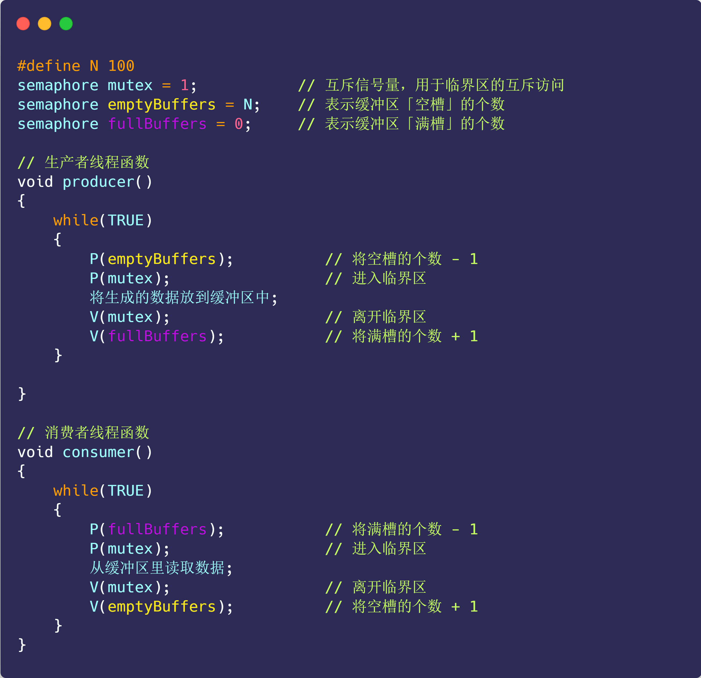
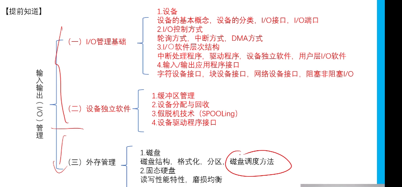

# 操作系统

> 参考哔哩哔哩的课程：<https://www.bilibili.com/video/BV1YB4y1i7xe/?spm_id_from=333.337.search-card.all.click&vd_source=731595967596af37618c926a191e7811>
>
> 参考了博客：<https://lfool.gitbook.io/operating-system/untitled-1/2.-cao-zuo-xi-tong-de-si-ge-te-zheng>
>
> 参考了大纲：https://mubu.com/doc/d9TGd1--LY#m
>
> 参考了图解系统：https://xiaolincoding.com/os/1_hardware/how_cpu_run.html#%E5%9B%BE%E7%81%B5%E6%9C%BA%E7%9A%84%E5%B7%A5%E4%BD%9C%E6%96%B9%E5%BC%8F
>
> 参考了视频：https://www.bilibili.com/video/BV19r4y1b7Aw/?spm_id_from=333.337.search-card.all.click&vd_source=731595967596af37618c926a191e7811

## 第一章 操作系统概述

### 操作系统的基本概念

操作系统是资源管理程序，其作用是控制管理计算机系统的资源和程序的指向。操作系统是计算机中最基础的软件，其作用简单来讲：

- 通过资源管理，提高计算机系统的**效率**

- 改善界面，为用户提供友好的工作环境（方便性）

操作系统的目的是方便用户使用计算机硬件资源


最开始的计算机是依靠图灵机而演变来的，通过图灵机可以较好的了解计算机发展的过程

#### 图灵机

图灵的基本思想是用机器来模拟人们用纸笔进行数学运算的过程，而且还定义了计算机由哪些部分组成，程序又是如何执行的。


图灵机的基本组成如下：

- 有一条「纸带」，纸带由一个个连续的格子组成，每个格子可以写入字符，纸带就好比内存，而纸带上的格子的字符就好比内存中的数据或程序；
- 有一个「读写头」，读写头可以读取纸带上任意格子的字符，也可以把字符写入到纸带的格子；
- 读写头上有一些部件，比如存储单元、控制单元以及运算单元： 1、存储单元用于存放数据； 2、控制单元用于识别字符是数据还是指令，以及控制程序的流程等； 3、运算单元用于执行运算指令

> 使用图灵机计算1+2，图灵机按照顺序读取数字存入到存储单元中，读取到运算单元就会将之前读取的数字进行运算单元的运算之后将计算完成的结果记录到图灵机存储中的状态，输出就是结果了。


通过上面的图灵机计算 `1 + 2` 的过程，可以发现图灵机主要功能就是读取纸带格子中的内容，然后交给控制单元识别字符是数字还是运算符指令，如果是数字则存入到图灵机状态中，如果是运算符，则通知运算符单元读取状态中的数值进行计算，计算结果最终返回给读写头，读写头把结果写入到纸带的格子中。

> 通用图灵机

可以通过修改控制器来改变图灵机的运行计算


#### 冯诺依曼架构

最重要的是定义计算机基本结构为 5 个部分，分别是**运算器、控制器、存储器、输入设备、输出设备**，这 5 个部分也被称为**冯诺依曼模型**。

**主机**：主机部分由运算器、存储器和控制器组成。

- **运算器**：负责执行所有的算术和逻辑运算。
- **存储器**：用于存储数据和指令。
- **控制器**：负责解释和执行指令，并控制其他部件的操作。

**外设**：由用户主导的输入和输出设备。

- **输入设备**：例如键盘、打孔卡片机等，用于将数据和指令输入到计算机中。
- **输出设备**：例如打印机、显示器等，用于将计算结果和其他信息输出给用户。

具体的结构如下，通过一个IP指针把存储器的数据载入到运算器和控制器中计算。然后输出结果。


##### 计算机启动

计算机会启动初始化程序写入内存中。读取第一个扇区中的内容，第一个扇区是0x7c00处存放的代码。


0x7c00地址处存放的代码通常是引导扇区（Boot Sector）代码。在传统的IBM PC兼容计算机上，当计算机启动时，BIOS（基本输入输出系统）会将引导扇区代码从启动设备（如硬盘、软盘或USB驱动器）的第一个扇区加载到内存地址0x7c00，并将控制权转交给该代码。这个引导扇区代码的主要任务是初始化系统硬件，并启动操作系统或引导加载程序。


> 引导扇区

下面是一个简单的x86汇编语言编写的引导扇区代码示例：

```assembly
.globl begtext, begdata, begbss, endtext, enddata, endbss
.text // 文本段
begtext:
.data // 数据段
begdata:
.bss // 未初始化数据段
begbss:
entry start // 关键字entry告诉链接器"程序入口"
start:
    mov ax, #BOOTSEG    // 加载引导扇区的段地址到AX
    mov ds, ax          // 将引导扇区段地址加载到DS
    mov ax, #INITSEG    // 加载初始化段地址到AX
    mov es, ax          // 将初始化段地址加载到ES
    mov cx, #256        // 设置CX寄存器为256
    sub si, si          // 将SI寄存器清零
    sub di, di          // 将DI寄存器清零
    rep movw            // 将0x07c0:0x0000处的256个字移到0x9000:0x0000
    jmpi go INITSEG     // 跳转到INITSEG段的go标签处执行
```

> 转跳INITSEG 

磁盘读取setup模块到内存中，并处理可能的读取错误。如果读取成功，后续处理将继续执行。它是引导扇区代码的一部分，负责将操作系统加载到内存中并准备好运行。

```assembly
jmpi go, INITSEG    ; 段间跳转：CS=INITSEG, IP=go

go:
    mov ax, cs        ; 加载当前代码段寄存器的值到AX中，CS=0x9000
    mov ds, ax        ; 将AX的值（即0x9000）加载到DS中
    mov es, ax        ; 将AX的值（即0x9000）加载到ES中
    mov ss, ax        ; 将AX的值（即0x9000）加载到SS中
    mov sp, #0xff00   ; 将堆栈指针SP设置为0xff00，为call做准备

load_setup:            ; 载入setup模块
    mov dx, #0x0000    ; 设置DX为0x0000，指向磁盘的第0柱面、第0磁头
    mov cx, #0x0002    ; 设置CX为0x0002，指向磁盘的第2扇区
    mov bx, #0x0200    ; 设置BX为0x0200，数据将加载到内存的0x0200处
    mov ax, #0x0200+SETUPLEN  ; 设置AX为0x0200加上setup模块的长度
    int 0x13           ; 调用BIOS中断0x13以读取磁盘扇区
    jnc ok_load_setup  ; 如果没有错误（CF=0），跳转到ok_load_setup

    mov dx, #0x0000    ; 否则，复位
    mov ax, #0x0000    ; 设置AX为0x0000
    int 0x13           ; 调用BIOS中断0x13复位磁盘系统
    jmp load_setup     ; 跳回去重试加载setup模块

ok_load_setup:
    ; 加载成功后的处理代码（这里省略）
```

> 加载成功后的处理代码

这段代码在成功加载setup模块后，显示“Loading system...”消息，然后调用函数读取系统模块到内存中，最后跳转到新的段继续执行setup代码。

```assembly
Ok_load_setup:    // 载入setup模块后
    mov dl, #0x00          // 设置DL为0x00，表示第一个软盘驱动器
    mov ax, #0x0800        // 设置AX为0x0800，BIOS中断服务号
    int 0x13               // 调用BIOS中断0x13获取磁盘参数
    mov ah, #0x03          // 设置AH为0x03，BIOS中断服务号
    mov cx, #24            // 设置CX为24，表示字符数
    mov bp, #msg1          // 设置BP指向msg1消息
    mov ax, #SYSSEG        // 设置AX为SYSSEG，系统段地址（通常是0x1000）
    mov es, ax             // 将AX的值加载到ES段寄存器中

    mov ch, #0x00          // 设置CH为0x00，柱面号
    xor bh, bh             // 清除BH寄存器，磁头号
    mov sectors, cx        // 保存扇区数
    mov bx, #0x0200        // 设置BX为0x0200，读取数据缓冲区地址
    mov ax, #1301          // 设置AX为1301，BIOS显示字符中断号
    int 0x10               // 调用BIOS中断0x10显示字符

    call read_it           // 调用read_it函数，读取系统模块
    jmpi 0, SETUPSEG       // 段间跳转：CS=SETUPSEG, IP=0

msg1:
    .byte 13, 10
    .ascii "Loading system..."
    .byte 13, 10, 13, 10

sectors:
    .word 0                // 扇区数
```

> 这边之后补充

#### 操作系统的特征

##### 观点描述

根据不同的观点，可以描述不同的计算机类型

**用户观点**

**定制化设计**：根据用户所使用的不同类型的计算机，设计相应的操作系统以满足其需求。例如，桌面操作系统（如Windows、macOS）与移动操作系统（如Android、iOS）的设计会有所不同，因其面向的用户群体和使用场景不同。

**系统观点**

资源管理器：操作系统被视为计算机系统的资源管理器，其主要功能是管理和分配系统资源。具体包括：

- **处理器管理**：调度和分配CPU时间，使得多个进程能够有效运行。
- **存储器管理**：管理物理内存和虚拟内存，确保各进程能够获得所需的内存空间。
- **设备管理**：管理输入输出设备，协调设备之间的操作。
- **信息管理**：管理数据和文件系统，确保数据的有效存储和检索。

**物质基础与工作环境**

操作系统本身依赖于计算机硬件，包括处理器、存储器、外设等，它们构成了操作系统赖以运行的基础。

**进程观点**

多进程架构 ：操作系统由多个可以独立运行的程序（进程）和一个负责协调这些程序的核心（通常是CPU）组成。

- **用户进程**：由用户启动和使用的应用程序。
- **系统进程**：操作系统内部用于管理和维护系统的进程。

**虚拟机观点**

机器扩展：操作系统本质上可以看作一个虚拟机，扩展了计算机的物理硬件，使其提供更加便捷和高级的功能。

- **分层结构**：操作系统被设计为多个层次，每一层执行特定的功能。
- **虚拟机服务**：通过层次化设计，操作系统为上层应用提供了一个虚拟化的工作环境，屏蔽底层硬件的复杂性，使开发和运行应用更加便捷。
- **虚拟机在底层**：虚拟机的概念通常应用在底层，以便上层应用程序可以在一个统一和抽象的环境中运行，而不必关心底层硬件的差异。

##### 特征描述

**并发性**

**定义**：并发性指两个或多个事件在同一时间间隔内发生。宏观上，这些事件似乎是同时发生的，但微观上，它们实际上是交替发生的。这**类似于计算机网络中的时分复用**。

**示例**：在多任务环境中，多个进程或线程在同一时间间隔内执行任务。

**共享性**

**定义**：共享即资源共享，指系统中的资源可以被内存中多个并发执行的进程共同使用。

资源共享的方式
- **互斥共享**：某些资源虽然可以被多个进程使用，但在任何时间点，只允许一个进程访问。例如，打印机和磁带机。
- **同时共享**：某些资源允许在同一时间段内被多个进程同时访问。例如，磁盘和内存。

**虚拟性**

**定义**：虚拟性是指将一个物理实体变为若干个逻辑上的对应物。物理实体是实际存在的，而逻辑对应物是用户感受到的。

- **虚拟存储技术（空分复用技术）**：在一个具有4 GB内存的电脑上，可以运行远大于4 GB内存的程序。
- **虚拟处理器技术（时分复用技术）**：在单核计算机上，可以同时运行多个程序。

**异步**

**定义**：异步性指程序执行的顺序和时间是不可预知的。程序的执行可能会因为各种原因被中断或延迟，但最终会在有限时间内完成。

其指的是程序中的某些操作可以在**等待特定条件**（如I/O操作完成、网络请求返回数据、计时器到期等）**满足之前**，让程序继续执行其他任务。一旦这些条件满足，等待的操作就会被触发和执行。

#### 程序执行的基本过程

程序实际上是一条一条指令，所以程序的运行过程就是把每一条指令一步一步的执行起来，负责执行指令的就是 CPU 了。


 CPU 执行程序的过程如下：

- 第一步，CPU 读取「程序计数器」的值，这个值是指令的内存地址，然后 CPU 的「控制单元」操作「地址总线」指定需要访问的内存地址，接着通知内存设备准备数据，数据准备好后通过「数据总线」将指令数据传给 CPU，CPU 收到内存传来的数据后，将这个指令数据存入到「指令寄存器」。
- 第二步，「程序计数器」的值自增，表示指向下一条指令。这个自增的大小，由 CPU 的位宽决定，比如 32 位的 CPU，指令是 4 个字节，需要 4 个内存地址存放，因此「程序计数器」的值会自增 4；
- 第三步，CPU 分析「指令寄存器」中的指令，确定指令的类型和参数，如果是计算类型的指令，就把指令交给「逻辑运算单元」运算；如果是存储类型的指令，则交由「控制单元」执行；

简单总结一下就是，一个程序执行的时候，CPU 会根据程序计数器里的内存地址，从内存里面把需要执行的指令读取到指令寄存器里面执行，然后根据指令长度自增，开始顺序读取下一条指令。

CPU 从程序计数器读取指令、到执行、再到下一条指令，这个过程会不断循环，直到程序执行结束，这个不断循环的过程被称为 **CPU 的指令周期**。

#### 操作系统的发展过程

##### 无操作系统

- 用户独占计算机资源：每次只有一个用户或一个程序可以使用计算机的资源。
- 资源利用率低：由于计算机资源在用户等待输入时处于空闲状态，因此整体资源利用效率较低。
- CPU等待用户输入：计算机的中央处理器（CPU）在用户提供输入或指令之前，通常处于等待状态，不能执行其他任务。

##### 单批处理系统

**定义**：最早出现的操作系统类型，通过批处理方式自动化任务处理。

- **自动性**：系统自动执行一系列任务，无需用户干预。
- **顺序性**：任务按顺序处理，每次只处理一个作业。
- **单道性**：内存中只保留一个程序的执行，即一次只加载一道程序，其他程序在内存中等待。

##### 多批处理系统

**定义**：引入了多道程序设计，改进了计算机资源的利用方式。

- **多道性**：同时在内存中保留多个程序，这些程序可以在等待I/O操作或其他事件时使CPU继续执行其他任务。
- **宏观上并行**：多个程序的执行看起来是并行的，因为它们共享CPU资源。
- **微观上串行**：在任意时刻，CPU实际上只处理一个程序的任务，通过快速切换实现“并行”。

**优点**：

- **资源利用率高**：多个程序共享计算机资源，使得CPU和其他硬件资源保持忙碌状态，减少了资源的闲置时间。
- **系统吞吐量大**：由于多个程序并行处理，系统的吞吐量（单位时间内处理的作业数量）显著提高。
- **切换开销小**：仅在程序完成或需要进行切换时，才进行上下文切换，相比频繁的用户交互，系统开销较小。

**缺点**：

- **用户响应时间长**：由于程序在等待队列中，用户可能需要等待较长时间才能获得系统响应。
- **缺乏人机交互能力**：用户无法实时了解计算机的运行情况，也无法直接控制计算机的执行流程。

### 操作系统的分类*

#### 批处理操作系统

**特点**：

- **用户脱机使用**：用户在离线状态下提交作业，操作系统会自动处理这些作业。
- **成批处理**：作业被集中到一起形成一个批次，操作系统将整个批次中的作业逐个处理。这里的“批”指的是一组作业的集合。
- **多道程序运行**：系统内存中可以同时存在多个作业，每个作业在不同的时间段占用CPU资源。

**说明**：

- **作业**：包括程序、数据和作业说明书。作业说明书描述了作业的处理要求和资源需求。
- **监督程序**：操作系统中配置的程序，用于自动管理和调度批处理作业。

#### 分时操作系统

**时间片**：将处理器的运行时间划分为很短的时间片，系统按时间片轮流分配给各个联机作业。

- **简单分时操作系统**：基本的分时机制，处理多个用户任务。
- **前台和后台分时操作系统**：前台处理用户交互任务，后台处理后台作业。
- **多道分时操作系统**：同时支持多个用户的交互操作与后台作业的处理。

特征
- **多路性**：在微观上，各用户轮流使用计算机；在宏观上，各用户并行工作。
- **交互性**：用户可以直接控制和交互自己的程序，以人机对话的方式进行操作。
- **独立性**：各用户的操作相互独立，不会干扰或混淆。
- **及时性**：系统能够快速响应用户请求，相比批处理系统响应时间更短。

#### 实时操作系统

- **实时工业控制系统**：用于工业自动化和控制系统，需要高可靠性和及时响应。
- **实时信息处理系统**：处理实时数据流，如金融交易系统。
- **实时多媒体系统**：支持音频、视频等多媒体应用，要求低延迟。
- **实时嵌入式系统**：嵌入到硬件中，用于特定的实时任务，如汽车控制系统。

**特点**：

- **及时性**：能够在规定的时间内完成任务，并对事件做出迅速响应。
- **可靠性**：系统具备多级容错措施，确保在各种条件下稳定运行。
- **过载防护能力**：能够处理高负荷条件下的任务，保持系统稳定性。
- **支持多道程序设计**：提高系统利用率和吞吐量。
- **交互性**：能够处理实时用户交互请求。

**特征**：及时性和可靠性是实时系统的主要特征。

#### 其他操作系统

**嵌入式操作系统**：

- 专为嵌入式设备设计，通常用于特定的硬件，如家用电器、汽车等。特点是资源占用少、实时性强。

**集群操作系统**：

- **定义**：多个独立的计算机系统通过网络连接起来，协同完成一个任务。
- **特点**：提供负载均衡、容错和高可用性，确保系统的整体性能和可靠性。

**网络操作系统**：

- **定义**：管理网络中计算机资源的操作系统。
- 特点
  - **互联计算机系统**：网络中多个计算机互相连接。
  - **自洽性**：每台计算机能够独立运行。
  - **通信设备**：通过网络设备（如路由器、交换机）实现计算机间的通信。
  - **资源共享**：实现网络资源的共享和访问。

**分布式操作系统**：

- **定义**：将处理单元分布在多个物理位置，通过网络连接实现统一的系统。
- 特点
  - **统一性**：为用户提供统一的操作体验。
  - **共享性**：系统资源可以被网络中多个计算机共享。
  - **透明性**：系统隐藏了分布式计算的复杂性，使得用户像使用单一计算机一样操作。
  - **自治性**：每个节点具有一定的自治能力，同时支持分布式环境中的协作。
  - **可靠性**：通过冗余和容错机制提升系统的整体可靠性。

> 分时操作系统和实时操作系统的区别：
>
> - **分时操作系统** 主要关注多用户交互和资源利用效率，通过时间片轮转使多个用户可以公平地访问计算机资源。
> - **实时操作系统** 主要关注任务的及时性和可靠性，通过优先级调度和中断处理保证任务能在严格的时间限制内完成。

### 操作系统运行环境*

#### 处理器执行状态

> 核心态（内核态、系统态）

- **定义**：操作系统管理程序执行时机器的状态，具有最高的权限级别。
- 特性
  - **权限**：可以执行所有指令，包括特权指令（如直接访问硬件、控制内存保护等）。
  - **访问范围**：可以访问所有寄存器和内存区域，执行任意操作。
  - **职责**：处理系统调用、硬件中断、异常处理、系统资源管理等关键任务。

> 用户态（用户态）

- **定义**：用户程序执行时机器的状态，权限级别较低。
- 特性
  - **权限**：只能执行受限的指令，不能执行特权指令。
  - **访问范围**：只能访问有限的寄存器和内存区域，不能直接访问核心态资源。
  - **职责**：执行用户应用程序的逻辑，处理用户数据和应用层任务。

> 从用户态切换到核心态

- **机制**：用户程序不能直接调用核心态的功能，必须通过特定的机制进行切换。
- 方法
  - **系统调用**：用户程序通过系统调用请求操作系统服务，例如文件操作、进程管理等。系统调用会触发一个软中断，操作系统从用户态切换到核心态。
  - **中断**：硬件中断（如输入设备的信号）会使系统从用户态切换到核心态，以处理设备的请求。
  - **异常**：用户程序发生错误（如非法操作、除零错误）会触发异常，系统从用户态切换到核心态进行处理。
  - **特权指令**：用户程序尝试执行特权指令（如访问受保护的内存区域）会触发中断或异常，系统从用户态切换到核心态。
  - **中断返回指令**：系统在处理完请求后，通过中断返回指令将控制权从核心态切换回用户态，恢复用户程序的执行。
  - **仿管指令**：某些系统支持仿管指令用于模拟核心态功能，通常用于虚拟化环境。

#### 内核指令

> 时钟管理

- **定义**：时钟是操作系统中最关键的设备之一。
- 功能
  - **计时**：提供系统时间和跟踪操作的持续时间。
  - 时钟中断用于进程调度和系统维护。通过定期的时钟中断，操作系统可以实现：
    - **进程切换**：在多任务环境中，时钟中断触发的调度程序决定何时将CPU从当前进程切换到下一个进程。
    - **时间片管理**：确保每个进程或任务获得公平的CPU时间片，以实现多道程序的高效运行。

> 中断机制

- **定义**：中断机制是操作系统中用于响应外部事件和内部请求的基本机制。
- 发展
  - **早期**：最初，中断机制用于提高多道程序环境下的CPU利用率，主要用于响应外部设备的信号。
  - 现代中断机制已成为操作系统的核心，支持各种操作，包括：
    - **硬件中断**：来自外部设备的信号，如键盘输入、网络数据包。
    - **软件中断**：由程序或操作系统发出的信号，用于系统调用和异常处理。

> 原语

- **定义**：原语是操作系统中执行基本操作的小程序，它们通常是关闭中断或执行特定任务的代码。
- 特征
  - **接近硬件**：直接操作硬件或系统内部状态。
  - **原子性**：操作必须一次性完成，不允许中断，确保数据一致性和系统稳定性。
  - **运行时间短**：原语执行迅速，以减少对系统性能的影响，并且经常被调用以实现高效的操作。

### 中断与异常

在计算机中，中断是系统用来响应硬件设备请求的一种机制，操作系统收到硬件的中断请求，会打断正在执行的进程，然后调用内核中的中断处理程序来响应请求。

这样的解释可能过于学术了，容易云里雾里，我就举个生活中取外卖的例子。

小林中午搬完砖，肚子饿了，点了份白切鸡外卖，这次我带闪了，没有被某团大数据杀熟。虽然平台上会显示配送进度，但是我也不能一直傻傻地盯着呀，时间很宝贵，当然得去干别的事情，等外卖到了配送员会通过「电话」通知我，电话响了，我就会停下手中地事情，去拿外卖。

这里的打电话，其实就是对应计算机里的中断，没接到电话的时候，我可以做其他的事情，只有接到了电话，也就是发生中断，我才会停下当前的事情，去进行另一个事情，也就是拿外卖。

从这个例子，我们可以知道，**中断是一种异步的事件处理机制，可以提高系统的并发处理能力。**

操作系统收到了中断请求，会打断其他进程的运行，所以**中断请求的响应程序，也就是中断处理程序，要尽可能快的执行完，这样可以减少对正常进程运行调度地影响。**

而且，中断处理程序在响应中断时，可能还会「临时关闭中断」，这意味着，如果当前中断处理程序没有执行完之前，系统中其他的中断请求都无法被响应，也就说中断有可能会丢失，所以中断处理程序要短且快。

还是回到外卖的例子，小林到了晚上又点起了外卖，这次为了犒劳自己，共点了两份外卖，一份小龙虾和一份奶茶，并且是由不同地配送员来配送，那么问题来了，当第一份外卖送到时，配送员给我打了长长的电话，说了一些杂七杂八的事情，比如给个好评等等，但如果这时另一位配送员也想给我打电话。

很明显，这时第二位配送员因为我在通话中（相当于关闭了中断响应），自然就无法打通我的电话，他可能尝试了几次后就走掉了（相当于丢失了一次中断）。

#### **中断（外中断）**

**定义**：中断是系统正常操作的一部分，用于响应外部事件。

- **外设请求**：例如，输入设备、网络适配器发出的信号。
- **人的干预**：如键盘中断或用户请求。


#### **异常（内中断）**

**定义**：异常是由系统错误或异常情况引起的中断。

- **文件损坏**：例如，尝试访问受损的文件。
- **进程越界**：如访问非法内存地址。
- **算术溢出**：例如，整数溢出或除零错误。
- **硬件故障**：如硬件组件出现故障。
- **软件中断**：程序故意触发的软件中断请求。

**特征**：异常通常是不预期的，指示系统出现了错误或问题。

**区别**：异常是中断的一种特殊形式，主要由于错误或不正常的情况触发，而中断不一定是由异常引起的，它可以是外部设备的正常请求或用户操作。

#### 中断处理过程

1. **关中断**：禁用中断，以防止在处理中断时发生新的中断。
2. **保存断点**：保存当前执行状态，以便在中断处理完后能够恢复。
3. **中断服务程序寻址**：定位和准备执行相应的中断服务程序。
4. **保存现场和屏蔽字**：保存当前寄存器和状态信息，并屏蔽中断，以保证处理过程中不会被干扰。
5. **开中断**：重新启用中断，以便在处理过程中可能产生的新的中断能被处理。
6. **执行中断服务程序**：执行中断服务程序以处理具体的中断请求。
7. **关中断**：禁用中断，以确保在恢复现场时不会有新的中断干扰。
8. **恢复现场和屏蔽字**：恢复保存的寄存器和状态信息，并恢复中断屏蔽状态。
9. **开中断，中断返回**：重新启用中断，并返回到中断发生之前的程序执行点。

- **步骤 1~3**：由硬件（中断控制器）自动完成。
- **步骤 4~9**：由中断处理程序完成，以确保系统在处理中断后能够正确恢复并继续运行。

### 操作系统的体系结构*

#### 模块组合结构

**优点**

- 结构紧密，接口简单直接
- 系统的效率相对较高

**缺点**

- 系统结构不清晰
- 可扩展性较差
- 可适应性差
- 只适用于系统小、模块少、使用环境比较稳定的系统

#### 层次结构

**特点**

- 模块之间单向调用和单向依赖

**优点**

- 使模块间的组织和依赖关系清晰明了
- 便于修改和扩充

**缺点**

- 必须将与机器特点紧密相关的软件（如中断处理、输入/输出管理）放在最底层
- 常用操作应放在最内层，而变化较多的操作应放在外层
- 系统调用模块提供进程服务的部分应放在系统内层
- 系统效率可能降低

#### 微内核结构

**微内核结构**由一个非常简单的硬件抽象层和一组比较关键的原语或系统调用组成，这些原语仅仅包括了建立一个系统必需的几个部分，如线程管理、地址空间和进程间通信等。其他的管理程序则尽可能地放在内核之外。

> 把操作系统中更多的成分和功能放到更高的层次(即用户模式)中去运行，而留下一个尽量小的内核，用它来完成操作系统最基本的核心功能，这种技术被称为微内核技术。

**特点**

- 在操作系统内核中只保留基本功能，将其他服务分离出去，通过若干个用户态进程（服务器进程）实现，形成C/S模式

**优点**

- 可靠性高
- 灵活性好
- 便于维护
- 适合分布式处理的计算环境

**缺点**

- 效率不高（尤其是通信频繁的系统）


### 组成硬件

#### 内存(RAM)

在计算机数据存储中，存储数据的基本单位是**字节（\*byte\*）**，1 字节等于 8 位（8 bit）。每一个字节都对应一个内存地址。

内存的地址是从 0 开始编号的，然后自增排列，最后一个地址为内存总字节数 - 1，这种结构好似我们程序里的数组，所以内存的读写任何一个数据的速度都是一样的。

#### 中央处理器(CPU)

> CPU的作用是取值执行

32 位和 64 位 CPU 最主要区别在于一次能计算多少字节数据：

- 32 位 CPU 一次可以计算 4 个字节；
- 64 位 CPU 一次可以计算 8 个字节；

之所以 CPU 要这样设计，是为了能计算更大的数值，如果是 8 位的 CPU，那么一次只能计算 1 个字节 `0~255` 范围内的数值，这样就无法一次完成计算 `10000 * 500` ，于是为了能一次计算大数的运算，CPU 需要支持多个 byte 一起计算，所以 CPU 位宽越大，可以计算的数值就越大，比如说 32 位 CPU 能计算的最大整数是 `4294967295`。

> 寄存器

##### 寄存器


#### 总线

总线是用于 CPU 和内存以及其他设备之间的通信，总线可分为 3 种：

- *地址总线*，用于指定 CPU 将要操作的内存地址；
- *数据总线*，用于读写内存的数据；
- *控制总线*，用于发送和接收信号，比如中断、设备复位等信号，CPU 收到信号后自然进行响应，这时也需要控制总线；

当 CPU 要读写内存数据的时候，一般需要通过下面这三个总线：

- 首先要通过「地址总线」来指定内存的地址；
- 然后通过「控制总线」控制是读或写命令；
- 最后通过「数据总线」来传输数据；

## 第二章 进程与线程


### 前趋图

前驱图（即控制流图或依赖图）可以帮助我们更好地描述和控制程序的并发执行：


- **资源共享管理**
  前驱图可以描绘进程间的依赖关系，帮助管理和协调资源共享，以避免竞争条件和死锁问题。
- **状态管理**
  通过前驱图，能够清晰地识别进程的执行顺序和依赖关系，从而有效地控制进程状态，保证系统的一致性和稳定性。
- **调度与同步**
  前驱图有助于设计和优化进程调度策略，确保并发进程在正确的顺序和时机下执行，并进行必要的同步操作。

### 进程

我们编写的代码只是一个存储在硬盘的静态文件，通过编译后就会生成二进制可执行文件，当我们运行这个可执行文件后，它会被装载到内存中，接着 CPU 会执行程序中的每一条指令，那么这个**运行中的程序，就被称为「进程」（Process）**。也就是**进程是执行中的程序。**


CPU在计算的时候需要读取硬盘里的信息加以计算，但是受限于硬盘的读取速度如果要完全计算完一个进程，CPU的运算速率就会变慢。所以，当进程要从硬盘读取数据时，CPU 不需要阻塞等待数据的返回，而是去执行另外的进程。当硬盘数据返回时，CPU 会收到个**中断**，于是 CPU 再继续运行这个进程。

> 这也就是时分运算，对于一小段时间而言CPU会交替计算所有运行的进程。但是在大的时间看来，CPU是同时运算的。


这种**多个程序、交替执行**的思想，就有 CPU 管理多个进程的初步想法。

对于一个支持多进程的系统，CPU 会从一个进程快速切换至另一个进程，其间每个进程各运行几十或几百个毫秒。

虽然单核的 CPU 在某一个瞬间，只能运行一个进程。但在 1 秒钟期间，它可能会运行多个进程，这样就产生**并行的错觉**，实际上这是**并发**。

> 并发和并行的区别


> 进程与程序的关系的类比

到了晚饭时间，一对小情侣肚子都咕咕叫了，于是男生见机行事，就想给女生做晚饭，所以他就在网上找了辣子鸡的菜谱，接着买了一些鸡肉、辣椒、香料等材料，然后边看边学边做这道菜。


突然，女生说她想喝可乐，那么男生只好把做菜的事情暂停一下，并在手机菜谱标记做到哪一个步骤，把状态信息记录了下来。

然后男生听从女生的指令，跑去下楼买了一瓶冰可乐后，又回到厨房继续做菜。

**这体现了，CPU 可以从一个进程（做菜）切换到另外一个进程（买可乐），在切换前必须要记录当前进程中运行的状态信息，以备下次切换回来的时候可以恢复执行。**

**进程有着「运行 - 暂停 - 运行」的活动规律。**

-----

> 针对于上述特点总结了一下性质

程序的顺序执行： **程序在顺序执行时，只有前一个操作执行完成后**，后续操作才能执行。

- 顺序性：操作按既定顺序依次进行。
- 封闭性：程序运行期间，结果不受外界影响，独占系统资源。
- 可再现性：初始条件和执行环境相同，程序重复执行会得到相同结果。

程序的并发执行： **多个程序（程序段）同时在系统中运行。**

- 间断性：程序共享资源或相互协作，形成相互制约关系。
- 失去封闭性：多个程序共享系统资源。
- 不可再现性：由于共享资源和相互影响，程序执行结果可能不同。

并发执行的条件： **并发执行要求程序具有可再现性**，符合 Bernstein 理想化状态：

- 确保在两次读操作之间，存储器中的数据不发生变化。

- 确保写操作结果不会丢失。

进程从功能出发有以下特征：

- **动态**性: 进程是程序的一次执行过程，是动态地产生、变化和消亡的
- **并发**性: 内存中有多个进程实体，各进程可井发执行
- 独立性: 进程是能独立运行、独立获得资源、独立接受调度的基本单位
  - **进程是资源分配、接受调度的基本, 独立单位**
- **异步**性: 各进程按各自独立的、不可预知的速度向前推进，操作系统要提供"进程同步机制"来解决异步问题
- **结构**性: 每个进程都会配置一个PCB。结构上看，进程由PCB、程序段、数据段组成

进程和程序的关系：

- 进程是动态的，程序是静止的。
- 每个进程包含程序段、数据段以及进程控制块（PCB），而程序是有序代码的集合。
- 进程是暂时的，程序是永久的。
- 一个程序通过多次执行可以产生多个不同的进程；通过调用关系，一个进程可以执行多个程序，而程序不能形成新的程序。
- 进程具有并行特性（独立性、异步性），而程序没有。

进程和作业的区别：**作业**是用户需要计算机**完成某项任务而要求计算机所做的工作的集合**。

- 作业是用户向计算机提交任务的任务实体。
- 进程是完成用户任务的执行实体。
- 一个作业由至少一个进程组成，但一个进程不能构成多个作业。

进程的特征

- 动态性：进程是程序在处理器上的一次执行过程，因而是动态的(动态性是进程的最基本的特征)
- 并发性：指多个进程实体同时存于内存中，能在一段时间内同时运行
- 独立性：是指进程实体是一个能独立运行、独立获得资源和独立接受调度的基本单位
- 异步性：进程按照各自独立运行的、不可预知的速度向前推进
- 结构性：从结构上看，进程实体是由程序段、数据段和进程控制块(PCB)三部分组成的。

> 程序段:是指程序的代码
> 数据段:是指运行过程中产生的各种数据

#### 进程控制块(PCB)

**PCB 是进程存在的唯一标识**，这意味着一个进程的存在，必然会有一个 PCB，如果进程消失了，那么 PCB 也会随之消失。


> PCB具体包含的信息

**进程描述信息：**

- 进程标识符：标识各个进程，每个进程都有一个并且唯一的标识符；
- 用户标识符：进程归属的用户，用户标识符主要为共享和保护服务；

**进程控制和管理信息：**

- 进程当前状态，如 new、ready、running、waiting 或 blocked 等；
- 进程优先级：进程抢占 CPU 时的优先级；

**资源分配清单：**

- 有关内存地址空间或虚拟地址空间的信息，所打开文件的列表和所使用的 I/O 设备信息。

**CPU 相关信息：**

- CPU 中各个寄存器的值，当进程被切换时，CPU 的状态信息都会被保存在相应的 PCB 中，以便进程重新执行时，能从断点处继续执行。

可见，PCB 包含信息还是比较多的。

> 每个 PCB 是如何组织的呢？

通常是通过**链表**的方式进行组织，把具有**相同状态的进程链在一起，组成各种队列**。比如：

- 将所有处于就绪状态的进程链在一起，称为**就绪队列**；
- 把所有因等待某事件而处于等待状态的进程链在一起就组成各种**阻塞队列**；
- 另外，对于运行队列在单核 CPU 系统中则只有一个运行指针了，因为单核 CPU 在某个时间，只能运行一个程序。

那么，就绪队列和阻塞队列链表的组织形式如下图：


除了链接的组织方式，还有索引方式，它的工作原理：将同一状态的进程组织在一个索引表中，索引表项指向相应的 PCB，不同状态对应不同的索引表。

一般会选择链表，因为可能面临进程创建，销毁等调度导致进程状态发生变化，所以链表能够更加灵活的插入和删除。

#### 进程的基本状态

一般说来，一个进程并不是自始至终连续不停地运行的，它与并发执行中的其他进程的执行是相互制约的。

它有时处于运行状态，有时又由于某种原因而暂停运行处于等待状态，当使它暂停的原因消失后，它又进入准备运行状态。

所以，**在一个进程的活动期间至少具备三种基本状态，即运行状态、就绪状态、阻塞状态。**


上图中各个状态的意义：

- 运行状态（*Running*）：该时刻进程占用 CPU；
- 就绪状态（*Ready*）：可运行，由于其他进程处于运行状态而暂时停止运行；
- 阻塞状态（*Blocked*）：该进程正在等待某一事件发生（如等待输入/输出操作的完成）而暂时停止运行，这时，即使给它CPU控制权，它也无法运行；

当然，进程还有另外两个基本状态：

- 创建状态（*new*）：进程正在被创建时的状态；
- 结束状态（*Exit*）：进程正在从系统中消失时的状态；

于是，一个完整的进程状态的变迁如下图：


再来详细说明一下进程的状态变迁：

- **NULL -> 创建状态**：一个新进程被创建时的第一个状态。

- **创建状态 -> 就绪状态**：当进程被创建完成并初始化后，一切就绪准备运行时，变为就绪状态，这个过程是很快的。
  - **过程**：申请空白PCB → 填写控制信息 → 分配资源 → 转入就绪状态（若资源足够）。

- **就绪状态 -> 运行状态**：处于就绪状态的进程被操作系统的进程调度器选中后，就分配给 CPU 正式运行该进程。

  - **特征**：在就绪队列中等待调度。

  - **原因**：进程被调度程序选中，获得CPU时间片。

- **运行状态 -> 结束状态**：当进程已经运行完成或出错时，会被操作系统作结束状态处理。
  - **描述**：进程正在使用CPU执行任务。

- **运行状态 -> 就绪状态**：处于运行状态的进程在运行过程中，由于分配给它的运行时间片用完，操作系统会把该进程变为就绪态，接着从就绪态选中另外一个进程运行。
  - **原因**：时间片用完，或有更高优先级的进程变为就绪状态。

- **运行状态 -> 阻塞状态**：当进程请求某个事件且必须等待时，例如请求 I/O 事件。

  - **描述**：进程等待某些事件发生，如I/O操作完成或资源释放。

  - **原因**：进程因等待某些事件（如I/O操作）而无法继续执行。

- **阻塞状态 -> 就绪状态**：当进程要等待的事件完成时，它从阻塞状态变到就绪状态。
  - **原因**：所等待的事件发生，进程被唤醒，重新进入就绪队列。

- **结束状态**：
  - **描述**：进程正常或异常结束，操作系统进行善后处理，清除PCB并释放资源

---

如果有大量处于阻塞状态的进程，进程可能会占用着物理内存空间，显然不是我们所希望的，毕竟物理内存空间是有限的，被阻塞状态的进程占用着物理内存就一种浪费物理内存的行为。

所以，在虚拟内存管理的操作系统中，通常会把阻塞状态的进程的物理内存空间换出到硬盘，等需要再次运行的时候，再从硬盘换入到物理内存。


那么，就需要一个新的状态，来**描述进程没有占用实际的物理内存空间的情况，这个状态就是挂起状态**。这跟阻塞状态是不一样，阻塞状态是等待某个事件的返回。

另外，挂起状态可以分为两种：

- 阻塞挂起状态：进程在外存（硬盘）并等待某个事件的出现；
- 就绪挂起状态：进程在外存（硬盘），但只要进入内存，即刻立刻运行；

这两种挂起状态加上前面的五种状态，就变成了七种状态变迁


导致进程挂起的原因不只是因为进程所使用的内存空间不在物理内存，还包括如下情况：

- 通过 sleep 让进程间歇性挂起，其工作原理是设置一个定时器，到期后唤醒进程。
- 用户希望挂起一个程序的执行，比如在 Linux 中用 `Ctrl+Z` 挂起进程

##### 进程的控制


我们熟知了进程的状态变迁和进程的数据结构 PCB 后，再来看看进程的**创建、终止、阻塞、唤醒**的过程，这些过程也就是进程的控制。

**01 创建进程**

操作系统允许一个进程创建另一个进程，而且允许子进程继承父进程所拥有的资源。

创建进程的过程如下：

- 申请一个空白的 PCB，并向 PCB 中填写一些控制和管理进程的信息，比如进程的唯一标识等；
- 为该进程分配运行时所必需的资源，比如内存资源；
- 将 PCB 插入到就绪队列，等待被调度运行；

**02 终止进程**

进程可以有 3 种终止方式：正常结束、异常结束以及外界干预（信号 `kill` 掉）。

当子进程被终止时，其在父进程处继承的资源应当还给父进程。而当父进程被终止时，该父进程的子进程就变为孤儿进程，会被 1 号进程收养，并由 1 号进程对它们完成状态收集工作。

终止进程的过程如下：

- 查找需要终止的进程的 PCB；
- 如果处于执行状态，则立即终止该进程的执行，然后将 CPU 资源分配给其他进程；
- 如果其还有子进程，则应将该进程的子进程交给 1 号进程接管；
- 将该进程所拥有的全部资源都归还给操作系统；
- 将其从 PCB 所在队列中删除；

**03 阻塞进程**

当进程需要等待某一事件完成时，它可以调用阻塞语句把自己阻塞等待。而一旦被阻塞等待，它只能由另一个进程唤醒。

阻塞进程的过程如下：

- 找到将要被阻塞进程标识号对应的 PCB；
- 如果该进程为运行状态，则保护其现场，将其状态转为阻塞状态，停止运行；
- 将该 PCB 插入到阻塞队列中去；

**04 唤醒进程**

进程由「运行」转变为「阻塞」状态是由于进程必须等待某一事件的完成，所以处于阻塞状态的进程是绝对不可能叫醒自己的。

如果某进程正在等待 I/O 事件，需由别的进程发消息给它，则只有当该进程所期待的事件出现时，才由发现者进程用唤醒语句叫醒它。

唤醒进程的过程如下：

- 在该事件的阻塞队列中找到相应进程的 PCB；
- 将其从阻塞队列中移出，并置其状态为就绪状态；
- 把该 PCB 插入到就绪队列中，等待调度程序调度；

进程的阻塞和唤醒是一对功能相反的语句，如果某个进程调用了阻塞语句，则必有一个与之对应的唤醒语句。

##### 进程的上下文切换

**进程切换到另一个进程运行，称为进程的上下文切换**。

> 在详细说进程上下文切换前，我们先来看看 CPU 上下文切换

大多数操作系统都是多任务，通常支持大于 CPU 数量的任务同时运行。实际上，这些任务并不是同时运行的，只是因为系统在很短的时间内，让各个任务分别在 CPU 运行，于是就造成同时运行的错觉。

任务是交给 CPU 运行的，那么在每个任务运行前，CPU 需要知道任务从哪里加载，又从哪里开始运行。

所以，操作系统需要事先帮 CPU 设置好 **CPU 寄存器和程序计数器**。

**CPU 寄存器是 CPU 内部一个容量小，但是速度极快的内存（缓存）。**我举个例子，寄存器像是你的口袋，内存像你的书包，硬盘则是你家里的柜子，如果你的东西存放到口袋，那肯定是比你从书包或家里柜子取出来要快的多。

再来，程序计数器则是用来存储 CPU 正在执行的指令位置、或者即将执行的下一条指令位置。

所以说，CPU 寄存器和程序计数是 CPU 在运行任何任务前，所必须依赖的环境，这些环境就叫做 **CPU 上下文**。

既然知道了什么是 CPU 上下文，那理解 CPU 上下文切换就不难了。

CPU 上下文切换就是先把前一个任务的 CPU 上下文（CPU 寄存器和程序计数器）保存起来，然后加载新任务的上下文到这些寄存器和程序计数器，最后再跳转到程序计数器所指的新位置，运行新任务。

系统内核会存储保持下来的上下文信息，当此任务再次被分配给 CPU 运行时，CPU 会重新加载这些上下文，这样就能保证任务原来的状态不受影响，让任务看起来还是连续运行。

上面说到所谓的「任务」，主要包含进程、线程和中断。所以，可以根据任务的不同，把 CPU 上下文切换分成：**进程上下文切换、线程上下文切换和中断上下文切换**。

> 进程的上下文切换到底是切换什么呢？

进程是由内核管理和调度的，所以进程的切换只能发生在内核态。

所以，**进程的上下文切换不仅包含了虚拟内存、栈、全局变量等用户空间的资源，还包括了内核堆栈、寄存器等内核空间的资源。**

通常，会把交换的信息保存在进程的 PCB，当要运行另外一个进程的时候，我们需要从这个进程的 PCB 取出上下文，然后恢复到 CPU 中，这使得这个进程可以继续执行，如下图所示：


大家需要注意，进程的上下文开销是很关键的，我们希望它的开销越小越好，这样可以使得进程可以把更多时间花费在执行程序上，而不是耗费在上下文切换。

> 发生进程上下文切换有哪些场景？

- 为了保证所有进程可以得到公平调度，CPU 时间被划分为一段段的时间片，这些时间片再被轮流分配给各个进程。这样，当某个进程的时间片耗尽了，进程就从运行状态变为就绪状态，系统从就绪队列选择另外一个进程运行；
- 进程在系统资源不足（比如内存不足）时，**要等到资源满足后才可以运行，这个时候进程也会被挂起，并由系统调度其他进程运行**
- 当进程通过睡眠函数 sleep 这样的方法将自己主动挂起时，自然也会重新调度；
- 当有优先级更高的进程运行时，为了保证高优先级进程的运行，当前进程会被挂起，由高优先级进程来运行；
- 发生硬件中断时，CPU 上的进程会被中断挂起，转而执行内核中的中断服务程序；


### 线程

在早期的操作系统中都是以进程作为独立运行的基本单位，直到后面，计算机科学家们又提出了更小的能独立运行的基本单位，也就是**线程。**

> 可以把线程理解为“轻量级进程”

我们举个例子，假设你要编写一个视频播放器软件，那么该软件功能的核心模块有三个：

- 从视频文件当中读取数据；
- 对读取的数据进行解压缩；
- 把解压缩后的视频数据播放出来；

对于单进程的实现方式，会是以下这个方式：


对于单进程的这种方式，存在以下问题：

- 播放出来的画面和声音会不连贯，因为当 CPU 能力不够强的时候，`Read` 的时候可能进程就等在这了，这样就会导致等半天才进行数据解压和播放；
- 各个函数之间不是并发执行，影响资源的使用效率

那改进成多进程的方式：


对于多进程的这种方式，依然会存在问题：

- 进程之间如何通信，共享数据？
- 维护进程的系统开销较大，如创建进程时，分配资源、建立 PCB；终止进程时，回收资源、撤销 PCB；进程切换时，保存当前进程的状态信息；

那到底如何解决呢？需要有一种新的实体，满足以下特性：

- 实体之间可以并发运行；
- 实体之间共享相同的地址空间；

这个新的实体，就是**线程( \*Thread\* )**，线程之间可以并发运行且共享相同的地址空间。

#### 什么是线程

线程是**基本的CPU执行单元，也是程序执行流的最小单位**。

引入线程后，不仅可以在不同进程之间实现并发，而且**同一进程内的各个线程也可以并发执行**。这**提升了系统的并发度**，使得进程内能够**同时处理多种任务**，例如视频聊天、文字聊天和文件传输等。

引入线程的作用在于**将进程作为系统资源的分配单元**（如打印机、内存地址空间等），而**线程则作为调度的基本单位**。即，**进程是资源分配的基本单位，线程是调度的基本单位**。

- 每个线程都有一个线程ID和线程控制块（TCB）。
- **线程切换时无需切换进程环境**。
- 线程本身几乎不拥有系统资源。
- 同一进程内的线程可以共享进程资源，并且线程间的通信无需系统干预。


#### 线程实现

**用户线程（\*User Thread\*）**：在用户空间实现的线程，不是由内核管理的线程，是由用户态的线程库来完成线程的管理；

- 由应用程序通过线程库实现。
- 线程的管理（包括线程切换）完全由应用程序负责。
- 线程切换在用户态下完成，无需操作系统干预。
- 对用户来说，存在多个线程；对操作系统内核来说，线程的存在是不透明的（用户级线程对用户透明，对操作系统透明）。

**内核线程（\*Kernel Thread\*）**：在内核中实现的线程，是由内核管理的线程

- 由操作系统内核负责管理。
- 线程调度和切换都在核心态下完成。
- 线程的管理和切换由内核完成，因此需要操作系统的参与。

**轻量级进程（\*LightWeight Process\*）**：在内核中来支持用户线程；

---

那么，这还需要考虑一个问题，用户线程和内核线程的对应关系。

首先，第一种关系是**多对一**的关系，也就是多个用户线程对应同一个内核线程：

> **多对一模型**：

- 将多个用户级线程映射到一个内核级线程。每个用户进程只有一个内核级线程。
- 优点
  - 用户级线程切换在用户空间完成，减少了系统开销，提高了效率。
- 缺点
  - 如果一个用户级线程被阻塞，整个进程都会被阻塞，导致并发度降低。无法在多核处理机上并行运行多个线程。


第二种是**一对一**的关系，也就是一个用户线程对应一个内核线程：

- 每个用户级线程对应一个内核级线程。每个用户进程拥有与用户级线程数量相同的内核级线程。
- 优点
  - 一个线程被阻塞时，其他线程仍可继续执行，提供了更强的并发能力。支持多核处理机上的线程并行执行。
- 缺点
  - 一个用户进程占用多个内核级线程，线程切换需在核心态完成，增加了管理成本和系统开销


第三种是**多对多**的关系，也就是多个用户线程对应到多个内核线程：

- 多个用户级线程映射到多个内核级线程 (n ≥ m)。每个用户进程可以有多个内核级线程。
- 优点
  - 解决了多对一模型的并发度不足问题，同时避免了一对一模型中用户进程占用过多内核级线程的问题。兼具高并发性和较低的管理开销。


##### 用户线程

用户线程是基于用户态的线程管理库来实现的，那么**线程控制块（\*Thread Control Block, TCB\*）** 也是在库里面来实现的，对于操作系统而言是看不到这个 TCB 的，它只能看到整个进程的 PCB。

所以，**用户线程的整个线程管理和调度，操作系统是不直接参与的，而是由用户级线程库函数来完成线程的管理，包括线程的创建、终止、同步和调度等。**

用户级线程的模型，也就类似前面提到的**多对一**的关系，即多个用户线程对应同一个内核线程，如下图所示：


用户线程的**优点**：

- 每个进程都需要有它私有的线程控制块（TCB）列表，用来跟踪记录它各个线程状态信息（PC、栈指针、寄存器），TCB 由用户级线程库函数来维护，可用于不支持线程技术的操作系统；
- 用户线程的切换也是由线程库函数来完成的，无需用户态与内核态的切换，所以速度特别快；

用户线程的**缺点**：

- 由于操作系统不参与线程的调度，如果一个线程发起了系统调用而阻塞，那进程所包含的用户线程都不能执行了。
- 当一个线程开始运行后，除非它主动地交出 CPU 的使用权，否则它所在的进程当中的其他线程无法运行，因为用户态的线程没法打断当前运行中的线程，它没有这个特权，只有操作系统才有，但是用户线程不是由操作系统管理的。
- 由于时间片分配给进程，故与其他进程比，在多线程执行时，每个线程得到的时间片较少，执行会比较慢；

##### 内核线程

**内核线程是由操作系统管理的，线程对应的 TCB 自然是放在操作系统里的，这样线程的创建、终止和管理都是由操作系统负责。**

内核线程的模型，也就类似前面提到的**一对一**的关系，即一个用户线程对应一个内核线程，如下图所示：


内核线程的**优点**：

- 在一个进程当中，如果某个内核线程发起系统调用而被阻塞，并不会影响其他内核线程的运行；
- 分配给线程，多线程的进程获得更多的 CPU 运行时间；

内核线程的**缺点**：

- 在支持内核线程的操作系统中，由内核来维护进程和线程的上下文信息，如 PCB 和 TCB；
- 线程的创建、终止和切换都是通过系统调用的方式来进行，因此对于系统来说，系统开销比较大；

##### 轻量级进程

**轻量级进程（\*Light-weight process，LWP\*）是内核支持的用户线程，一个进程可有一个或多个 LWP，每个 LWP 是跟内核线程一对一映射的，也就是 LWP 都是由一个内核线程支持，而且 LWP 是由内核管理并像普通进程一样被调度**。

在大多数系统中，**LWP与普通进程的区别也在于它只有一个最小的执行上下文和调度程序所需的统计信息**。一般来说，一个进程代表程序的一个实例，而 LWP 代表程序的执行线程，因为一个执行线程不像进程那样需要那么多状态信息，所以 LWP 也不带有这样的信息。

在 LWP 之上也是可以使用用户线程的，那么 LWP 与用户线程的对应关系就有三种：

- `1 : 1`，即一个 LWP 对应 一个用户线程；
- `N : 1`，即一个 LWP 对应多个用户线程；
- `M : N`，即多个 LWP 对应多个用户线程；

接下来针对上面这三种对应关系说明它们优缺点。先看下图的 LWP 模型：


**1 : 1 模式**

一个线程对应到一个 LWP 再对应到一个内核线程，如上图的进程 4，属于此模型。

- 优点：实现并行，当一个 LWP 阻塞，不会影响其他 LWP；
- 缺点：每一个用户线程，就产生一个内核线程，创建线程的开销较大。

**N : 1 模式**

多个用户线程对应一个 LWP 再对应一个内核线程，如上图的进程 2，线程管理是在用户空间完成的，此模式中用户的线程对操作系统不可见。

- 优点：用户线程要开几个都没问题，且上下文切换发生用户空间，切换的效率较高；
- 缺点：一个用户线程如果阻塞了，则整个进程都将会阻塞，另外在多核 CPU 中，是没办法充分利用 CPU 的。

**M : N 模式**

根据前面的两个模型混搭一起，就形成 `M:N` 模型，该模型提供了两级控制，首先多个用户线程对应到多个 LWP，LWP 再一一对应到内核线程，如上图的进程 3。

- 优点：综合了前两种优点，大部分的线程上下文发生在用户空间，且多个线程又可以充分利用多核 CPU 的资源。

**组合模式**

如上图的进程 5，此进程结合 `1:1` 模型和 `M:N` 模型。开发人员可以针对不同的应用特点调节内核线程的数目来达到物理并行性和逻辑并行性的最佳方案。

#### 线程优缺点

线程的优点：

- 一个进程中可以同时存在多个线程；
- 各个线程之间可以并发执行；
- 各个线程之间可以共享地址空间和文件等资源；

线程的缺点：

- 当进程中的一个线程崩溃时，会导致其所属进程的所有线程崩溃

举个例子，对于游戏的用户设计，则不应该使用多线程的方式，否则一个用户挂了，会影响其他同个进程的线程。


#### 线程和进程比较区别


线程与进程的比较如下：

- 进程是资源（包括内存、打开的文件等）分配的单位，线程是 CPU 调度的单位；
- 进程拥有一个完整的资源平台，而线程只独享必不可少的资源，如寄存器和栈；
- 线程同样具有就绪、阻塞、执行三种基本状态，同样具有状态之间的转换关系；
- 线程能减少并发执行的时间和空间开销；

对于，线程相比进程能减少开销，体现在：

- 线程的创建时间比进程快，因为进程在创建的过程中，还需要资源管理信息，比如内存管理信息、文件管理信息，而线程在创建的过程中，不会涉及这些资源管理信息，而是共享它们；
- 线程的终止时间比进程快，因为线程释放的资源相比进程少很多；
- 同一个进程内的线程切换比进程切换快，因为线程具有相同的地址空间（虚拟内存共享），这意味着同一个进程的线程都具有同一个页表，那么在切换的时候不需要切换页表。而对于进程之间的切换，切换的时候要把页表给切换掉，而页表的切换过程开销是比较大的；
- 由于同一进程的各线程间共享内存和文件资源，那么在线程之间数据传递的时候，就不需要经过内核了，这就使得线程之间的数据交互效率更高了；

所以，不管是时间效率，还是空间效率线程比进程都要高。

### 多进程

当多线程相互竞争操作共享变量时，由于运气不好，即在执行过程中发生了上下文切换，我们得到了错误的结果，事实上，每次运行都可能得到不同的结果，因此输出的结果存在**不确定性（indeterminate）**。

由于多线程执行操作共享变量的这段代码可能会导致竞争状态，因此我们将此段代码称为**临界区（critical section），它是访问共享资源的代码片段，一定不能给多线程同时执行。**

我们希望这段代码是**互斥（mutualexclusion）的，也就说保证一个线程在临界区执行时，其他线程应该被阻止进入临界区**，说白了，就是这段代码执行过程中，最多只能出现一个线程。

#### 互斥的概念

上面展示的情况称为**竞争条件（race condition）**，当多线程相互竞争操作共享变量时，由于运气不好，即在执行过程中发生了上下文切换，我们得到了错误的结果，事实上，每次运行都可能得到不同的结果，因此输出的结果存在**不确定性（indeterminate）**。

由于多线程执行操作共享变量的这段代码可能会导致竞争状态，因此我们将此段代码称为**临界区（\*critical section\*），它是访问共享资源的代码片段，一定不能给多线程同时执行。**

我们希望这段代码是**互斥（\*mutualexclusion\*）的，也就说保证一个线程在临界区执行时，其他线程应该被阻止进入临界区**，说白了，就是这段代码执行过程中，最多只能出现一个线程。


#### 同步的概念

互斥解决了并发进程/线程对临界区的使用问题。这种基于临界区控制的交互作用是比较简单的，只要一个进程/线程进入了临界区，其他试图想进入临界区的进程/线程都会被阻塞着，直到第一个进程/线程离开了临界区。

我们都知道在多线程里，每个线程并不一定是顺序执行的，它们基本是以各自独立的、不可预知的速度向前推进，但有时候我们又希望多个线程能密切合作，以实现一个共同的任务。

例子，线程 1 是负责读入数据的，而线程 2 是负责处理数据的，这两个线程是相互合作、相互依赖的。线程 2 在没有收到线程 1 的唤醒通知时，就会一直阻塞等待，当线程 1 读完数据需要把数据传给线程 2 时，线程 1 会唤醒线程 2，并把数据交给线程 2 处理。

**所谓同步，就是并发进程/线程在一些关键点上可能需要互相等待与互通消息，这种相互制约的等待与互通信息称为进程/线程同步**。

举个生活的同步例子，你肚子饿了想要吃饭，你叫妈妈早点做菜，妈妈听到后就开始做菜，但是在妈妈没有做完饭之前，你必须阻塞等待，等妈妈做完饭后，自然会通知你，接着你吃饭的事情就可以进行了。


注意，同步与互斥是两种不同的概念：

- 同步就好比：「操作 A 应在操作 B 之前执行」，「操作 C 必须在操作 A 和操作 B 都完成之后才能执行」等；
- 互斥就好比：「操作 A 和操作 B 不能在同一时刻执行」；

#### 互斥与同步的实现和使用

在进程/线程并发执行的过程中，进程/线程之间存在协作的关系，例如有互斥、同步的关系。

为了实现进程/线程间正确的协作，操作系统必须提供实现进程协作的措施和方法，主要的方法有两种：

- *锁*：加锁、解锁操作；
- *信号量*：P、V 操作；

这两个都可以方便地实现进程/线程互斥，而信号量比锁的功能更强一些，它还可以方便地实现进程/线程同步

##### 锁

使用加锁操作和解锁操作可以解决并发线程/进程的互斥问题。

任何想进入临界区的线程，必须先执行加锁操作。若加锁操作顺利通过，则线程可进入临界区；在完成对临界资源的访问后再执行解锁操作，以释放该临界资源。


根据锁的实现不同，可以分为「忙等待锁」和「无忙等待锁」。

##### 信号量

信号量是操作系统提供的一种协调共享资源访问的方法。

通常**信号量表示资源的数量**，对应的变量是一个整型（`sem`）变量。

另外，还有**两个原子操作的系统调用函数来控制信号量的**，分别是：

- *P 操作*：将 `sem` 减 `1`，相减后，如果 `sem < 0`，则进程/线程进入阻塞等待，否则继续，表明 P 操作可能会阻塞；
- *V 操作*：将 `sem` 加 `1`，相加后，如果 `sem <= 0`，唤醒一个等待中的进程/线程，表明 V 操作不会阻塞；

P 操作是用在进入临界区之前，V 操作是用在离开临界区之后，这两个操作是必须成对出现的。

举个类比，2 个资源的信号量，相当于 2 条火车轨道，PV 操作如下图过程：


#### 经典同步问题

##### 生产-消费者问题


生产者-消费者问题描述：

- **生产者**在生成数据后，放在一个缓冲区中；
- **消费者**从缓冲区取出数据处理；
- 任何时刻，**只能有一个**生产者或消费者可以访问缓冲区；

我们对问题分析可以得出：

- 任何时刻只能有一个线程操作缓冲区，说明操作缓冲区是临界代码，**需要互斥**；
- 缓冲区空时，消费者必须等待生产者生成数据；缓冲区满时，生产者必须等待消费者取出数据。说明生产者和消费者**需要同步**。

那么我们需要三个信号量，分别是：

- 互斥信号量 `mutex`：用于互斥访问缓冲区，初始化值为 1；
- 资源信号量 `fullBuffers`：用于消费者询问缓冲区是否有数据，有数据则读取数据，初始化值为 0（表明缓冲区一开始为空）；
- 资源信号量 `emptyBuffers`：用于生产者询问缓冲区是否有空位，有空位则生成数据，初始化值为 n （缓冲区大小）；

具体的实现代码：



如果消费者线程一开始执行 `P(fullBuffers)`，由于信号量 `fullBuffers` 初始值为 0，则此时 `fullBuffers` 的值从 0 变为 -1，说明缓冲区里没有数据，消费者只能等待。

接着，轮到生产者执行 `P(emptyBuffers)`，表示减少 1 个空槽，如果当前没有其他生产者线程在临界区执行代码，那么该生产者线程就可以把数据放到缓冲区，放完后，执行 `V(fullBuffers)` ，信号量 `fullBuffers` 从 -1 变成 0，表明有「消费者」线程正在阻塞等待数据，于是阻塞等待的消费者线程会被唤醒。

消费者线程被唤醒后，如果此时没有其他消费者线程在读数据，那么就可以直接进入临界区，从缓冲区读取数据。最后，离开临界区后，把空槽的个数 + 1。

##### 读者-写者问题

「哲学家进餐问题」对于互斥访问有限的竞争问题（如 I/O 设备）一类的建模过程十分有用。

另外，还有个著名的问题是「读者-写者」，它为数据库访问建立了一个模型。

读者只会读取数据，不会修改数据，而写者即可以读也可以修改数据。

读者-写者的问题描述：

- 「读-读」允许：同一时刻，允许多个读者同时读
- 「读-写」互斥：没有写者时读者才能读，没有读者时写者才能写
- 「写-写」互斥：没有其他写者时，写者才能写

接下来，提出几个解决方案来分析分析。

> 方案一

使用信号量的方式来尝试解决：

- 信号量 `wMutex`：控制写操作的互斥信号量，初始值为 1 ；
- 读者计数 `rCount`：正在进行读操作的读者个数，初始化为 0；
- 信号量 `rCountMutex`：控制对 rCount 读者计数器的互斥修改，初始值为 1；

接下来看看代码的实现：


上面的这种实现，是读者优先的策略，因为只要有读者正在读的状态，后来的读者都可以直接进入，如果读者持续不断进入，则写者会处于饥饿状态。

> 方案二

那既然有读者优先策略，自然也有写者优先策略：

- 只要有写者准备要写入，写者应尽快执行写操作，后来的读者就必须阻塞；
- 如果有写者持续不断写入，则读者就处于饥饿；

在方案一的基础上新增如下变量：

- 信号量 `rMutex`：控制读者进入的互斥信号量，初始值为 1；
- 信号量 `wDataMutex`：控制写者写操作的互斥信号量，初始值为 1；
- 写者计数 `wCount`：记录写者数量，初始值为 0；
- 信号量 `wCountMutex`：控制 wCount 互斥修改，初始值为 1；

具体实现如下代码：


注意，这里 `rMutex` 的作用，开始有多个读者读数据，它们全部进入读者队列，此时来了一个写者，执行了 `P(rMutex)` 之后，后续的读者由于阻塞在 `rMutex` 上，都不能再进入读者队列，而写者到来，则可以全部进入写者队列，因此保证了写者优先。

同时，第一个写者执行了 `P(rMutex)` 之后，也不能马上开始写，必须等到所有进入读者队列的读者都执行完读操作，通过 `V(wDataMutex)` 唤醒写者的写操作。

> 方案三

既然读者优先策略和写者优先策略都会造成饥饿的现象，那么我们就来实现一下公平策略。

公平策略：

- 优先级相同；
- 写者、读者互斥访问；
- 只能一个写者访问临界区；
- 可以有多个读者同时访问临界资源；

具体代码实现：


对比方案一的读者优先策略，可以发现，读者优先中只要后续有读者到达，读者就可以进入读者队列， 而写者必须等待，直到没有读者到达。

没有读者到达会导致读者队列为空，即 `rCount==0`，此时写者才可以进入临界区执行写操作。

而这里 `flag` 的作用就是阻止读者的这种特殊权限（特殊权限是只要读者到达，就可以进入读者队列）。

比如：开始来了一些读者读数据，它们全部进入读者队列，此时来了一个写者，执行 `P(falg)` 操作，使得后续到来的读者都阻塞在 `flag` 上，不能进入读者队列，这会使得读者队列逐渐为空，即 `rCount` 减为 0。

这个写者也不能立马开始写（因为此时读者队列不为空），会阻塞在信号量 `wDataMutex` 上，读者队列中的读者全部读取结束后，最后一个读者进程执行 `V(wDataMutex)`，唤醒刚才的写者，写者则继续开始进行写操作。

##### 哲学家-进餐问题


先来看看哲学家就餐的问题描述：

- `5` 个老大哥哲学家，闲着没事做，围绕着一张圆桌吃面；
- 巧就巧在，这个桌子只有 `5` 支叉子，每两个哲学家之间放一支叉子；
- 哲学家围在一起先思考，思考中途饿了就会想进餐；
- **奇葩的是，这些哲学家要两支叉子才愿意吃面，也就是需要拿到左右两边的叉子才进餐**；
- **吃完后，会把两支叉子放回原处，继续思考**；

那么问题来了，如何保证哲 学家们的动作有序进行，而不会出现有人永远拿不到叉子呢？

> 方案一


上面的程序，好似很自然。拿起叉子用 P 操作，代表有叉子就直接用，没有叉子时就等待其他哲学家放回叉子。


不过，这种解法存在一个极端的问题：**假设五位哲学家同时拿起左边的叉子，桌面上就没有叉子了， 这样就没有人能够拿到他们右边的叉子，也就说每一位哲学家都会在 `P(fork[(i + 1) % N ])` 这条语句阻塞了，很明显这发生了死锁的现象**。

> 方案二

既然「方案一」会发生同时竞争左边叉子导致死锁的现象，那么我们就在拿叉子前，加个互斥信号量，代码如下：


上面程序中的互斥信号量的作用就在于，**只要有一个哲学家进入了「临界区」，也就是准备要拿叉子时，其他哲学家都不能动，只有这位哲学家用完叉子了，才能轮到下一个哲学家进餐。**


方案二虽然能让哲学家们按顺序吃饭，但是每次进餐只能有一位哲学家，而桌面上是有 5 把叉子，按道理是能可以有两个哲学家同时进餐的，所以从效率角度上，这不是最好的解决方案。

> 方案三

那既然方案二使用互斥信号量，会导致只能允许一个哲学家就餐，那么我们就不用它。

另外，方案一的问题在于，会出现所有哲学家同时拿左边刀叉的可能性，那我们就避免哲学家可以同时拿左边的刀叉，采用分支结构，根据哲学家的编号的不同，而采取不同的动作。

**即让偶数编号的哲学家「先拿左边的叉子后拿右边的叉子」，奇数编号的哲学家「先拿右边的叉子后拿左边的叉子」。**


上面的程序，在 P 操作时，根据哲学家的编号不同，拿起左右两边叉子的顺序不同。另外，V 操作是不需要分支的，因为 V 操作是不会阻塞的。


方案三即不会出现死锁，也可以两人同时进餐。

> 方案四

在这里再提出另外一种可行的解决方案，我们**用一个数组 state 来记录每一位哲学家的三个状态，分别是在进餐状态、思考状态、饥饿状态（正在试图拿叉子）。**

那么，**一个哲学家只有在两个邻居都没有进餐时，才可以进入进餐状态。**

第 `i` 个哲学家的左邻右舍，则由宏 `LEFT` 和 `RIGHT` 定义：

- *LEFT* : ( i + 5 - 1 ) % 5
- *RIGHT* : ( i + 1 ) % 5

比如 i 为 2，则 `LEFT` 为 1，`RIGHT` 为 3。

具体代码实现如下：


上面的程序使用了一个信号量数组，每个信号量对应一位哲学家，这样在所需的叉子被占用时，想进餐的哲学家就被阻塞。

注意，每个进程/线程将 `smart_person` 函数作为主代码运行，而其他 `take_forks`、`put_forks` 和 `test` 只是普通的函数，而非单独的进程/线程。


方案四同样不会出现死锁，也可以两人同时进餐。

### 死锁

> 多进程产生的问题

在多线程编程中，我们为了防止多线程竞争共享资源而导致数据错乱，都会在操作共享资源之前加上互斥锁，只有成功获得到锁的线程，才能操作共享资源，获取不到锁的线程就只能等待，直到锁被释放。

那么，当两个线程为了保护两个不同的共享资源而使用了两个互斥锁，那么这两个互斥锁应用不当的时候，可能会造成**两个线程都在等待对方释放锁**，在没有外力的作用下，这些线程会一直相互等待，就没办法继续运行，这种情况就是发生了**死锁**。

举个例子，小林拿了小美房间的钥匙，而小林在自己的房间里，小美拿了小林房间的钥匙，而小美也在自己的房间里。如果小林要从自己的房间里出去，必须拿到小美手中的钥匙，但是小美要出去，又必须拿到小林手中的钥匙，这就形成了死锁。

死锁只有**同时满足**以下四个条件才会发生：

- 互斥条件；
- 持有并等待条件；
- 不可剥夺条件；
- 环路等待条件；

####  互斥条件

互斥条件是指**多个线程不能同时使用同一个资源**。

比如下图，如果线程 A 已经持有的资源，不能再同时被线程 B 持有，如果线程 B 请求获取线程 A 已经占用的资源，那线程 B 只能等待，直到线程 A 释放了资源。


#### 持有并等待条件

持有并等待条件是指，当线程 A 已经持有了资源 1，又想申请资源 2，而资源 2 已经被线程 C 持有了，所以线程 A 就会处于等待状态，但是**线程 A 在等待资源 2 的同时并不会释放自己已经持有的资源 1**。


####  不可剥夺条件

不可剥夺条件是指，当线程已经持有了资源 ，**在自己使用完之前不能被其他线程获取**，线程 B 如果也想使用此资源，则只能在线程 A 使用完并释放后才能获取。


#### 环路等待条件

环路等待条件指的是，在死锁发生的时候，**两个线程获取资源的顺序构成了环形链**。

比如，线程 A 已经持有资源 2，而想请求资源 1， 线程 B 已经获取了资源 1，而想请求资源 2，这就形成资源请求等待的环形图。


####  模拟死锁问题的产生

下面，我们用代码来模拟死锁问题的产生。

首先，我们先创建 2 个线程，分别为线程 A 和 线程 B，然后有两个互斥锁，分别是 mutex_A 和 mutex_B，代码如下：

```c
pthread_mutex_t mutex_A = PTHREAD_MUTEX_INITIALIZER;
pthread_mutex_t mutex_B = PTHREAD_MUTEX_INITIALIZER;

int main()
{
    pthread_t tidA, tidB;
    
    //创建两个线程
    pthread_create(&tidA, NULL, threadA_proc, NULL);
    pthread_create(&tidB, NULL, threadB_proc, NULL);
    
    pthread_join(tidA, NULL);
    pthread_join(tidB, NULL);
    
    printf("exit\n");
    
    return 0;
}
```

接下来，我们看下线程 A 函数做了什么。

```c
//线程函数 A
void *threadA_proc(void *data)
{
    printf("thread A waiting get ResourceA \n");
    pthread_mutex_lock(&mutex_A);
    printf("thread A got ResourceA \n");
    
    sleep(1);
    
    printf("thread A waiting get ResourceB \n");
    pthread_mutex_lock(&mutex_B);
    printf("thread A got ResourceB \n");

    pthread_mutex_unlock(&mutex_B);
    pthread_mutex_unlock(&mutex_A);
    return (void *)0;
}
```

可以看到，线程 A 函数的过程：

- 先获取互斥锁 A，然后睡眠 1 秒；
- 再获取互斥锁 B，然后释放互斥锁 B；
- 最后释放互斥锁 A；

```
//线程函数 B
void *threadB_proc(void *data)
{
    printf("thread B waiting get ResourceB \n");
    pthread_mutex_lock(&mutex_B);
    printf("thread B got ResourceB \n");
    
    sleep(1);
    
    printf("thread B waiting  get ResourceA \n");
    pthread_mutex_lock(&mutex_A);
    printf("thread B got ResourceA \n");
    
    pthread_mutex_unlock(&mutex_A);
    pthread_mutex_unlock(&mutex_B);
    return (void *)0;
}
```

可以看到，线程 B 函数的过程：

- 先获取互斥锁 B，然后睡眠 1 秒；
- 再获取互斥锁 A，然后释放互斥锁 A；
- 最后释放互斥锁 B；

然后，我们运行这个程序，运行结果如下：

```
thread B waiting get ResourceB 
thread B got ResourceB 
thread A waiting get ResourceA 
thread A got ResourceA 
thread B waiting get ResourceA 
thread A waiting get ResourceB 
// 阻塞中。。。
```

可以看到线程 B 在等待互斥锁 A 的释放，线程 A 在等待互斥锁 B 的释放，双方都在等待对方资源的释放，很明显，产生了死锁问题。

---

简单来说，死锁问题的产生是由两个或者以上线程并行执行的时候，争夺资源而互相等待造成的。

死锁只有同时满足互斥、持有并等待、不可剥夺、环路等待这四个条件的时候才会发生。

所以要避免死锁问题，就是要破坏其中一个条件即可，最常用的方法就是使用资源有序分配法来破坏环路等待条件。

### 调度

进程都希望自己能够占用 CPU 进行工作，那么这涉及到前面说过的进程上下文切换。

一旦操作系统把进程切换到运行状态，也就意味着该进程占用着 CPU 在执行，但是当操作系统把进程切换到其他状态时，那就不能在 CPU 中执行了，于是操作系统会选择下一个要运行的进程。

选择一个进程运行这一功能是在操作系统中完成的，通常称为**调度程序**（*scheduler*）。

那到底什么时候调度进程，或以什么原则来调度进程呢？

> 这里的进程指只有主线程的进程，所以调度主线程就等于调度了整个进程。

#### 调度时机

在进程的生命周期中，当进程从一个运行状态到另外一状态变化的时候，其实会触发一次调度。

比如，以下状态的变化都会触发操作系统的调度：

- *从就绪态 -> 运行态*：当进程被创建时，会进入到就绪队列，操作系统会从就绪队列选择一个进程运行；
- *从运行态 -> 阻塞态*：当进程发生 I/O 事件而阻塞时，操作系统必须选择另外一个进程运行；
- *从运行态 -> 结束态*：当进程退出结束后，操作系统得从就绪队列选择另外一个进程运行；

因为，这些状态变化的时候，操作系统需要考虑是否要让新的进程给 CPU 运行，或者是否让当前进程从 CPU 上退出来而换另一个进程运行。

另外，如果硬件时钟提供某个频率的周期性中断，那么可以根据如何处理时钟中断 ，把调度算法分为两类：

- **非抢占式调度算法**挑选一个进程，然后让该进程运行直到被阻塞，或者直到该进程退出，才会调用另外一个进程，也就是说不会理时钟中断这个事情。
- **抢占式调度算法**挑选一个进程，然后让该进程只运行某段时间，如果在该时段结束时，该进程仍然在运行时，则会把它挂起，接着调度程序从就绪队列挑选另外一个进程。这种抢占式调度处理，需要在时间间隔的末端发生**时钟中断**，以便把 CPU 控制返回给调度程序进行调度，也就是常说的**时间片机制**。

#### 调度原则

*原则一*：如果运行的程序，发生了 I/O 事件的请求，那 CPU 使用率必然会很低，因为此时进程在阻塞等待硬盘的数据返回。这样的过程，势必会造成 CPU 突然的空闲。所以，**为了提高 CPU 利用率，在这种发送 I/O 事件致使 CPU 空闲的情况下，调度程序需要从就绪队列中选择一个进程来运行。**

*原则二*：有的程序执行某个任务花费的时间会比较长，如果这个程序一直占用着 CPU，会造成系统吞吐量（CPU 在单位时间内完成的进程数量）的降低。所以，**要提高系统的吞吐率，调度程序要权衡长任务和短任务进程的运行完成数量。**

*原则三*：从进程开始到结束的过程中，实际上是包含两个时间，分别是进程运行时间和进程等待时间，这两个时间总和就称为周转时间。进程的周转时间越小越好，**如果进程的等待时间很长而运行时间很短，那周转时间就很长，这不是我们所期望的，调度程序应该避免这种情况发生。**

*原则四*：处于就绪队列的进程，也不能等太久，当然希望这个等待的时间越短越好，这样可以使得进程更快的在 CPU 中执行。所以，**就绪队列中进程的等待时间也是调度程序所需要考虑的原则。**

*原则五*：对于鼠标、键盘这种交互式比较强的应用，我们当然希望它的响应时间越快越好，否则就会影响用户体验了。所以，**对于交互式比较强的应用，响应时间也是调度程序需要考虑的原则。**


针对上面的五种调度原则，总结成如下：

- **CPU 利用率**：调度程序应确保 CPU 是始终匆忙的状态，这可提高 CPU 的利用率；
- **系统吞吐量**：吞吐量表示的是单位时间内 CPU 完成进程的数量，长作业的进程会占用较长的 CPU 资源，因此会降低吞吐量，相反，短作业的进程会提升系统吞吐量；
- **周转时间**：周转时间是进程运行+阻塞时间+等待时间的总和，一个进程的周转时间越小越好；
- **等待时间**：这个等待时间不是阻塞状态的时间，而是进程处于就绪队列的时间，等待的时间越长，用户越不满意；
- **响应时间**：用户提交请求到系统第一次产生响应所花费的时间，在交互式系统中，响应时间是衡量调度算法好坏的主要标准。

说白了，这么多调度原则，目的就是要使得进程要「快」。

#### CPU调度类型

##### **高级调度（作业调度）**

**定义**：高级调度负责将作业从外存（辅存）调入内存。由于内存空间有限，不能将所有作业一次性加载进内存，因此需要按照一定的规则来决定哪些作业应优先加载。

- 从外存中的后备队列中挑选作业，将其加载到内存。
- 为每个作业分配内存和其他必要资源，并建立进程控制块（PCB）。
- 作业调入时会创建PCB，作业完成后会销毁PCB。

**关注点**：主要关注如何将作业调入内存。调出操作由作业运行结束触发。

##### **中级调度（内存调度）**

**定义**：中级调度决定哪些处于挂起状态的进程需要被重新调入内存。调度的频率高于高级调度，因为一个进程可能被多次调入和调出内存。

- 引入虚拟存储技术后，可以将暂时无法运行的进程转移至外存，待内存有空闲时再调入内存。
- 被挂起的进程状态记录在内存中的PCB中，PCB本身不会被调出内存。PCB包含进程在外存中的位置及状态等信息。
- 操作系统通过内存中的PCB管理挂起队列，维护对进程的监控和管理。

##### **低级调度（进程调度）**

**定义**：低级调度负责从就绪队列中选择一个进程，并将处理器分配给它。是操作系统中最基本的调度类型。

- 根据调度策略选择一个就绪进程，分配CPU资源。
- 进程调度的频率很高，一般在几十毫秒内发生一次。

**关注点**：确保系统中的处理器资源得到有效利用，通过合理的调度策略来优化系统性能。

#### 典型调度算法

不同的调度算法适用的场景也是不同的。接下来，说说在**单核 CPU 系统**中常见的调度算法。

##### 典型调度算法：先来先服务调度算法(FCFS)

最简单的一个调度算法，就是非抢占式的**先来先服务（First Come First Serve, FCFS）算法**了。


顾名思义，先来后到，**每次从就绪队列选择最先进入队列的进程，然后一直运行，直到进程退出或被阻塞，才会继续从队列中选择第一个进程接着运行。**

这似乎很公平，但是当一个长作业先运行了，那么后面的短作业等待的时间就会很长，不利于短作业。

FCFS 对长作业有利，适用于 CPU 繁忙型作业的系统，而不适用于 I/O 繁忙型作业的系统。


##### 典型调度算法：短作业有限调度算法(SJF)

**最短作业优先（\*Shortest Job First, SJF\*）调度算法**同样也是顾名思义，它会**优先选择运行时间最短的进程来运行**，这有助于提高系统的吞吐量。


这显然对长作业不利，很容易造成一种极端现象。

比如，一个长作业在就绪队列等待运行，而这个就绪队列有非常多的短作业，那么就会使得长作业不断的往后推，周转时间变长，致使长作业长期不会被运行。


##### 典型调度算法：高响应比有限调度算法(HRRN)

前面的「先来先服务调度算法」和「最短作业优先调度算法」都没有很好的权衡短作业和长作业。

那么，**高响应比优先 （\*Highest Response Ratio Next, HRRN\*）调度算法**主要是权衡了短作业和长作业。

**每次进行进程调度时，先计算「响应比优先级」，然后把「响应比优先级」最高的进程投入运行**，「响应比优先级」的计算公式：


从上面的公式，可以发现：

- 如果两个进程的「等待时间」相同时，「要求的服务时间」越短，「响应比」就越高，这样短作业的进程容易被选中运行；
- 如果两个进程「要求的服务时间」相同时，「等待时间」越长，「响应比」就越高，这就兼顾到了长作业进程，因为进程的响应比可以随时间等待的增加而提高，当其等待时间足够长时，其响应比便可以升到很高，从而获得运行的机会；


##### 典型调度算法：时间片轮调度算法(RR)

最古老、最简单、最公平且使用最广的算法就是**时间片轮转（\*Round Robin, RR\*）调度算法**。


**每个进程被分配一个时间段，称为时间片（\*Quantum\*），即允许该进程在该时间段中运行。**

- 如果时间片用完，进程还在运行，那么将会把此进程从 CPU 释放出来，并把 CPU 分配给另外一个进程；
- 如果该进程在时间片结束前阻塞或结束，则 CPU 立即进行切换；

另外，时间片的长度就是一个很关键的点：

- 如果时间片设得太短会导致过多的进程上下文切换，降低了 CPU 效率；
- 如果设得太长又可能引起对短作业进程的响应时间变长。将

一般来说，时间片设为 `20ms~50ms` 通常是一个比较合理的折中值。


##### 典型调度算法：优先级调度算法(PAS)

前面的「时间片轮转算法」做了个假设，即让所有的进程同等重要，也不偏袒谁，大家的运行时间都一样。

但是，对于多用户计算机系统就有不同的看法了，它们希望调度是有优先级的，即希望调度程序能**从就绪队列中选择最高优先级的进程进行运行，这称为最高优先级（\*Highest Priority First，HPF\*）调度算法**。

进程的优先级可以分为，静态优先级和动态优先级：

- 静态优先级：创建进程时候，就已经确定了优先级了，然后整个运行时间优先级都不会变化；
- 动态优先级：根据进程的动态变化调整优先级，比如如果进程运行时间增加，则降低其优先级，如果进程等待时间（就绪队列的等待时间）增加，则升高其优先级，也就是**随着时间的推移增加等待进程的优先级**。

该算法也有两种处理优先级高的方法，非抢占式和抢占式：

- 非抢占式：当就绪队列中出现优先级高的进程，运行完当前进程，再选择优先级高的进程。
- 抢占式：当就绪队列中出现优先级高的进程，当前进程挂起，调度优先级高的进程运行。

但是依然有缺点，可能会导致低优先级的进程永远不会运行。


##### 典型调度算法：多级反馈队列调度算法(MFQ)

**多级反馈队列（\*Multilevel Feedback Queue\*）调度算法**是「时间片轮转算法」和「最高优先级算法」的综合和发展。

顾名思义：

- 「多级」表示有多个队列，每个队列优先级从高到低，同时优先级越高时间片越短。
- 「反馈」表示如果有新的进程加入优先级高的队列时，立刻停止当前正在运行的进程，转而去运行优先级高的队列；


来看看，它是如何工作的：

- 设置了多个队列，赋予每个队列不同的优先级，每个**队列优先级从高到低**，同时**优先级越高时间片越短**；
- 新的进程会被放入到第一级队列的末尾，按先来先服务的原则排队等待被调度，如果在第一级队列规定的时间片没运行完成，则将其转入到第二级队列的末尾，以此类推，直至完成；
- 当较高优先级的队列为空，才调度较低优先级的队列中的进程运行。如果进程运行时，有新进程进入较高优先级的队列，则停止当前运行的进程并将其移入到原队列末尾，接着让较高优先级的进程运行；

可以发现，对于短作业可能可以在第一级队列很快被处理完。对于长作业，如果在第一级队列处理不完，可以移入下次队列等待被执行，虽然等待的时间变长了，但是运行时间也变更长了，所以该算法很好的**兼顾了长短作业，同时有较好的响应时间。**


#### 举例说明调度算法

**办理业务的客户相当于进程，银行窗口工作人员相当于 CPU。**

现在，假设这个银行只有一个窗口（单核 CPU ），那么工作人员一次只能处理一个业务。


那么最简单的处理方式，就是先来的先处理，后面来的就乖乖排队，这就是**先来先服务（FCFS）调度算法**。但是万一先来的这位老哥是来贷款的，这一谈就好几个小时，一直占用着窗口，这样后面的人只能干等，或许后面的人只是想简单的取个钱，几分钟就能搞定，却因为前面老哥办长业务而要等几个小时，你说气不气人？


有客户抱怨了，那我们就要改进，我们干脆优先给那些几分钟就能搞定的人办理业务，这就是**短作业优先（SJF）调度算法**。听起来不错，但是依然还是有个极端情况，万一办理短业务的人非常的多，这会导致长业务的人一直得不到服务，万一这个长业务是个大客户，那不就捡了芝麻丢了西瓜


那就公平起见，现在窗口工作人员规定，每个人我只处理 10 分钟。如果 10 分钟之内处理完，就马上换下一个人。如果没处理完，依然换下一个人，但是客户自己得记住办理到哪个步骤了。这个也就是**时间片轮转（RR）调度算法**。但是如果时间片设置过短，那么就会造成大量的上下文切换，增大了系统开销。如果时间片过长，相当于退化成 FCFS 算法了。


既然公平也可能存在问题，那银行就对客户分等级，分为普通客户、VIP 客户、SVIP 客户。只要高优先级的客户一来，就第一时间处理这个客户，这就是**最高优先级（HPF）调度算法**。但依然也会有极端的问题，万一当天来的全是高级客户，那普通客户不是没有被服务的机会，不把普通客户当人是吗？那我们把优先级改成动态的，如果客户办理业务时间增加，则降低其优先级，如果客户等待时间增加，则升高其优先级。


那有没有兼顾到公平和效率的方式呢？这里介绍一种算法，考虑的还算充分的，**多级反馈队列（MFQ）调度算法**，它是时间片轮转算法和优先级算法的综合和发展。它的工作方式：


- 银行设置了多个排队（就绪）队列，每个队列都有不同的优先级，**各个队列优先级从高到低**，同时每个队列执行时间片的长度也不同，**优先级越高的时间片越短**。
- 新客户（进程）来了，先进入第一级队列的末尾，按先来先服务原则排队等待被叫号（运行）。如果时间片用完客户的业务还没办理完成，则让客户进入到下一级队列的末尾，以此类推，直至客户业务办理完成。
- 当第一级队列没人排队时，就会叫号二级队列的客户。如果客户办理业务过程中，有新的客户加入到较高优先级的队列，那么此时办理中的客户需要停止办理，回到原队列的末尾等待再次叫号，因为要把窗口让给刚进入较高优先级队列的客户。

可以发现，对于要办理短业务的客户来说，可以很快的轮到并解决。对于要办理长业务的客户，一下子解决不了，就可以放到下一个队列，虽然等待的时间稍微变长了，但是轮到自己的办理时间也变长了，也可以接受，不会造成极端的现象，可以说是综合上面几种算法的优点。

## 第三章 内存管理

### 虚拟内存

介绍虚拟内存之前，先介绍单片机。对于单片机来说，其中的地址都是直接物理地址。所以每次写完代码，都需要借助工具把程序烧录进去，这样程序才能跑起来。

另外，**单片机的 CPU 是直接操作内存的「物理地址」**。


这种情况下，要想在内存中同时运行两个程序是无法达成的，因为每一次写入都会覆盖之前烧录进物理内存中的地址，运行两个程序会立马崩溃。

> 于是操作系统使用了虚拟内存在解决这个问题

上述问题中，两个程序都直接引用了物理地址才导致了无法运行，这里需要解决这个问题。

我们可以把进程所使用的地址隔离起来，使得操作系统为每一个进程独立分配一套虚拟地址，每一个进程都使用自己的地址，互不干涉。但是它们都不能直接访问物理地址，然后问题就来到了虚拟地址是怎么落到物理内存上的了。


**操作系统会提供一种机制，将不同进程的虚拟地址和不同内存的物理地址映射起来。**

如果程序要访问虚拟地址的时候，由操作系统转换成不同的物理地址，这样不同的进程运行的时候，写入的是不同的物理地址，这样就不会冲突了。

于是，这里就引出了两种地址的概念：

- 我们程序所使用的内存地址叫做**虚拟内存地址**（*Virtual Memory Address*）
- 实际存在硬件里面的空间地址叫**物理内存地址**（*Physical Memory Address*）。

操作系统引入了虚拟内存，进程持有的虚拟地址会通过 CPU 芯片中的内存管理单元（MMU）的映射关系，来转换变成物理地址，然后再通过物理地址访问内存，如下图所示：


> 操作系统是如何管理虚拟地址与物理地址之间的关系？

主要有两种方式，分别是**内存分段和内存分页**，分段是比较早提出的，我们先来看看内存分段。

### 内存分段


程序是由若干个逻辑分段组成的，如可由代码分段、数据分段、栈段、堆段组成。**不同的段是有不同的属性的，所以就用分段（\*Segmentation\*）的形式把这些段分离出来。**

> 分段机制下，虚拟地址和物理地址是如何映射的？

分段机制下的虚拟地址由两部分组成，**段选择因子**和**段内偏移量**。


段选择因子和段内偏移量：

- **段选择子**就保存在段寄存器里面。段选择子里面最重要的是**段号**，用作段表的索引。**段表**里面保存的是这个**段的基地址、段的界限和特权等级**等。
- 虚拟地址中的**段内偏移量**应该位于 0 和段界限之间，如果段内偏移量是合法的，就将段基地址加上段内偏移量得到物理内存地址。

在上面，知道了虚拟地址是通过**段表**与物理地址进行映射的，分段机制会把程序的虚拟地址分成 4 个段，每个段在段表中有一个项，在这一项找到段的基地址，再加上偏移量，于是就能找到物理内存中的地址


如果要访问段 3 中偏移量 500 的虚拟地址，我们可以计算出物理地址为，段 3 基地址 7000 + 偏移量 500 = 7500。

分段的办法很好，解决了程序本身不需要关心具体的物理内存地址的问题，但它也有一些不足之处：

- 第一个就是**内存碎片**的问题。
- 第二个就是**内存交换的效率低**的问题。

> 我们先来看看，分段为什么会产生内存碎片的问题？

我们来看看这样一个例子。假设有 1G 的物理内存，用户执行了多个程序，其中：

- 游戏占用了 512MB 内存
- 浏览器占用了 128MB 内存
- 音乐占用了 256 MB 内存。

这个时候，如果我们关闭了浏览器，则空闲内存还有 1024 - 512 - 256 = 256MB。

如果这个 256MB 不是连续的，被分成了两段 128 MB 内存，这就会导致没有空间再打开一个 200MB 的程序。


> 内存分段会出现内存碎片吗？

内存碎片主要分为，内部内存碎片和外部内存碎片。

内存分段管理可以做到段根据实际需求分配内存，所以有多少需求就分配多大的段，所以**不会出现内部内存碎片**。

但是由于每个段的长度不固定，所以多个段未必能恰好使用所有的内存空间，会产生了多个不连续的小物理内存，导致新的程序无法被装载，所以**会出现外部内存碎片**的问题。

解决「外部内存碎片」的问题就是**内存交换**。

可以把音乐程序占用的那 256MB 内存写到硬盘上，然后再从硬盘上读回来到内存里。不过再读回的时候，我们不能装载回原来的位置，而是紧紧跟着那已经被占用了的 512MB 内存后面。这样就能空缺出连续的 256MB 空间，于是新的 200MB 程序就可以装载进来。

这个内存交换空间，在 Linux 系统里，也就是我们常看到的 Swap 空间，这块空间是从硬盘划分出来的，用于内存与硬盘的空间交换。

> 分段为什么会导致内存交换效率低的问题？

对于多进程的系统来说，用分段的方式，外部内存碎片是很容易产生的，产生了外部内存碎片，那不得不重新 `Swap` 内存区域，这个过程会产生性能瓶颈。

因为硬盘的访问速度要比内存慢太多了，每一次内存交换，我们都需要把一大段连续的内存数据写到硬盘上。

所以，**如果内存交换的时候，交换的是一个占内存空间很大的程序，这样整个机器都会显得卡顿。**

为了解决内存分段的「外部内存碎片和内存交换效率低」的问题，就出现了内存分页。

### 内存分页


分段的好处就是能产生连续的内存空间，但是会出现「外部内存碎片和内存交换的空间太大」的问题。

要解决这些问题，那么就要想出能少出现一些内存碎片的办法。另外，当需要进行内存交换的时候，让需要交换写入或者从磁盘装载的数据更少一点，这样就可以解决问题了。这个办法，也就是**内存分页**（*Paging*）。

**分页是把整个虚拟和物理内存空间切成一段段固定尺寸的大小**。这样一个连续并且尺寸固定的内存空间，我们叫**页**（*Page*）。在 Linux 下，每一页的大小为 `4KB`。

虚拟地址与物理地址之间通过**页表**来映射，如下图：


页表是存储在内存里的，**内存管理单元** （*MMU*）就做将虚拟内存地址转换成物理地址的工作。


而当进程访问的虚拟地址在页表中查不到时，系统会产生一个**缺页异常**，进入系统内核空间分配物理内存、更新进程页表，最后再返回用户空间，恢复进程的运行。

> 分页是怎么解决分段的「外部内存碎片和内存交换效率低」的问题？

内存分页由于内存空间都是预先划分好的，也就不会像内存分段一样，在段与段之间会产生间隙非常小的内存，这正是分段会产生外部内存碎片的原因。而**采用了分页，页与页之间是紧密排列的，所以不会有外部碎片。**

但是，因为内存分页机制分配内存的最小单位是一页，即使程序不足一页大小，我们最少只能分配一个页，所以页内会出现内存浪费，所以针对**内存分页机制会有内部内存碎片**的现象。

如果内存空间不够，操作系统会把其他正在运行的进程中的「最近没被使用」的内存页面给释放掉，也就是暂时写在硬盘上，称为**换出**（*Swap Out*）。一旦需要的时候，再加载进来，称为**换入**（*Swap In*）。所以，一次性写入磁盘的也只有少数的一个页或者几个页，不会花太多时间，**内存交换的效率就相对比较高。**


更进一步地，分页的方式使得我们在加载程序的时候，不再需要一次性都把程序加载到物理内存中。我们完全可以在进行虚拟内存和物理内存的页之间的映射之后，并不真的把页加载到物理内存里，而是**只有在程序运行中，需要用到对应虚拟内存页里面的指令和数据时，再加载到物理内存里面去。**

> 分页机制下，虚拟地址和物理地址是如何映射的？

在分页机制下，虚拟地址分为两部分，**页号**和**页内偏移**。页号作为页表的索引，**页表**包含物理页每页所在**物理内存的基地址**，这个基地址与页内偏移的组合就形成了物理内存地址，见下图。


总结一下，对于一个内存地址转换，其实就是这样三个步骤：

- 把虚拟内存地址，切分成页号和偏移量；
- 根据页号，从页表里面，查询对应的物理页号；
- 直接拿物理页号，加上前面的偏移量，就得到了物理内存地址。

下面举个例子，虚拟内存中的页通过页表映射为了物理内存中的页，如下图：


> 简单的分页有什么缺陷吗？

有空间上的缺陷。

因为操作系统是可以同时运行非常多的进程的，那这不就意味着页表会非常的庞大。

在 32 位的环境下，虚拟地址空间共有 4GB，假设一个页的大小是 4KB（2^12），那么就需要大约 100 万 （2^20） 个页，每个「页表项」需要 4 个字节大小来存储，那么整个 4GB 空间的映射就需要有 `4MB` 的内存来存储页表。

这 4MB 大小的页表，看起来也不是很大。但是要知道每个进程都是有自己的虚拟地址空间的，也就说都有自己的页表。

那么，`100` 个进程的话，就需要 `400MB` 的内存来存储页表，这是非常大的内存了，更别说 64 位的环境了。

#### 多级页表


要解决上面的问题，就需要采用一种叫作**多级页表**（*Multi-Level Page Table*）的解决方案。

在前面我们知道了，对于单页表的实现方式，在 32 位和页大小 `4KB` 的环境下，一个进程的页表需要装下 100 多万个「页表项」，并且每个页表项是占用 4 字节大小的，于是相当于每个页表需占用 4MB 大小的空间。

我们把这个 100 多万个「页表项」的单级页表再分页，将页表（一级页表）分为 `1024` 个页表（二级页表），每个表（二级页表）中包含 `1024` 个「页表项」，形成**二级分页**。如下图所示：


> 你可能会问，分了二级表，映射 4GB 地址空间就需要 4KB（一级页表）+ 4MB（二级页表）的内存，这样占用空间不是更大了吗？

当然如果 4GB 的虚拟地址全部都映射到了物理内存上的话，二级分页占用空间确实是更大了，但是，我们往往不会为一个进程分配那么多内存。

其实我们应该换个角度来看问题，还记得计算机组成原理里面无处不在的**局部性原理**么？

每个进程都有 4GB 的虚拟地址空间，而显然对于大多数程序来说，其使用到的空间远未达到 4GB，因为会存在部分对应的页表项都是空的，根本没有分配，对于已分配的页表项，如果存在最近一定时间未访问的页表，在物理内存紧张的情况下，操作系统会将页面换出到硬盘，也就是说不会占用物理内存。

如果使用了二级分页，一级页表就可以覆盖整个 4GB 虚拟地址空间，但**如果某个一级页表的页表项没有被用到，也就不需要创建这个页表项对应的二级页表了，即可以在需要时才创建二级页表**。做个简单的计算，假设只有 20% 的一级页表项被用到了，那么页表占用的内存空间就只有 4KB（一级页表） + 20% * 4MB（二级页表）= `0.804MB`，这对比单级页表的 `4MB` 是不是一个巨大的节约？

那么为什么不分级的页表就做不到这样节约内存呢？

我们从页表的性质来看，保存在内存中的页表承担的职责是将虚拟地址翻译成物理地址。假如虚拟地址在页表中找不到对应的页表项，计算机系统就不能工作了。所以**页表一定要覆盖全部虚拟地址空间，不分级的页表就需要有 100 多万个页表项来映射，而二级分页则只需要 1024 个页表项**（此时一级页表覆盖到了全部虚拟地址空间，二级页表在需要时创建）。

我们把二级分页再推广到多级页表，就会发现页表占用的内存空间更少了，这一切都要归功于对局部性原理的充分应用。

对于 64 位的系统，两级分页肯定不够了，就变成了四级目录，分别是：

- 全局页目录项 PGD（*Page Global Directory*）；
- 上层页目录项 PUD（*Page Upper Directory*）；
- 中间页目录项 PMD（*Page Middle Directory*）；
- 页表项 PTE（*Page Table Entry*）；


#### TLB

多级页表虽然解决了空间上的问题，但是虚拟地址到物理地址的转换就多了几道转换的工序，这显然就降低了这俩地址转换的速度，也就是带来了时间上的开销。

程序是有局部性的，即在一段时间内，整个程序的执行仅限于程序中的某一部分。相应地，执行所访问的存储空间也局限于某个内存区域。


我们就可以利用这一特性，把最常访问的几个页表项存储到访问速度更快的硬件，于是计算机科学家们，就在 CPU 芯片中，加入了一个专门存放程序最常访问的页表项的 Cache，这个 Cache 就是 TLB（*Translation Lookaside Buffer*） ，通常称为页表缓存、转址旁路缓存、快表等。


在 CPU 芯片里面，封装了内存管理单元（*Memory Management Unit*）芯片，它用来完成地址转换和 TLB 的访问与交互。

有了 TLB 后，那么 CPU 在寻址时，会先查 TLB，如果没找到，才会继续查常规的页表。

TLB 的命中率其实是很高的，因为程序最常访问的页就那么几个。

### 段页式内存管理

> 段页结合

内存分段和内存分页并不是对立的，它们是可以组合起来在同一个系统中使用的，那么组合起来后，通常称为**段页式内存管理**。


段页式内存管理实现的方式：

- 先将程序划分为多个有逻辑意义的段，也就是前面提到的分段机制；
- 接着再把每个段划分为多个页，也就是对分段划分出来的连续空间，再划分固定大小的页；

这样，地址结构就由**段号、段内页号和页内位移**三部分组成。

用于段页式地址变换的数据结构是每一个程序一张段表，每个段又建立一张页表，段表中的地址是页表的起始地址，而页表中的地址则为某页的物理页号，如图所示：


段页式地址变换中要得到物理地址须经过三次内存访问：

- 第一次访问段表，得到页表起始地址；
- 第二次访问页表，得到物理页号；
- 第三次将物理页号与页内位移组合，得到物理地址。

可用软、硬件相结合的方法实现段页式地址变换，这样虽然增加了硬件成本和系统开销，但提高了内存的利用率。

### 内存分配与回收


应用程序通过 malloc 函数申请内存的时候，实际上申请的是虚拟内存，此时并不会分配物理内存。

当应用程序读写了这块虚拟内存，CPU 就会去访问这个虚拟内存， 这时会发现这个虚拟内存没有映射到物理内存， CPU 就会产生**缺页中断**，进程会从用户态切换到内核态，并将缺页中断交给内核的 Page Fault Handler （缺页中断函数）处理。

缺页中断处理函数会看是否有空闲的物理内存，如果有，就直接分配物理内存，并建立虚拟内存与物理内存之间的映射关系。

如果没有空闲的物理内存，那么内核就会开始进行**回收内存**的工作，回收的方式主要是两种：直接内存回收和后台内存回收。

- **后台内存回收**（kswapd）：在物理内存紧张的时候，会唤醒 kswapd 内核线程来回收内存，这个回收内存的过程**异步**的，不会阻塞进程的执行。
- **直接内存回收**（direct reclaim）：如果后台异步回收跟不上进程内存申请的速度，就会开始直接回收，这个回收内存的过程是**同步**的，会阻塞进程的执行。

如果直接内存回收后，空闲的物理内存仍然无法满足此次物理内存的申请，那么内核就会放最后的大招了 ——**触发 OOM （Out of Memory）机制**。

OOM Killer 机制会根据算法选择一个占用物理内存较高的进程，然后将其杀死，以便释放内存资源，如果物理内存依然不足，OOM Killer 会继续杀死占用物理内存较高的进程，直到释放足够的内存位置。

申请物理内存的过程如下图：


#### 哪些内存可以被回收

系统内存紧张的时候，就会进行回收内存的工作，那具体哪些内存是可以被回收的呢？

主要有两类内存可以被回收，而且它们的回收方式也不同。

- **文件页**（File-backed Page）：内核缓存的磁盘数据（Buffer）和内核缓存的文件数据（Cache）都叫作文件页。大部分文件页，都可以直接释放内存，以后有需要时，再从磁盘重新读取就可以了。而那些被应用程序修改过，并且暂时还没写入磁盘的数据（也就是脏页），就得先写入磁盘，然后才能进行内存释放。所以，**回收干净页的方式是直接释放内存，回收脏页的方式是先写回磁盘后再释放内存**。
- **匿名页**（Anonymous Page）：这部分内存没有实际载体，不像文件缓存有硬盘文件这样一个载体，比如堆、栈数据等。这部分内存很可能还要再次被访问，所以不能直接释放内存，它们**回收的方式是通过 Linux 的 Swap 机制**，Swap 会把不常访问的内存先写到磁盘中，然后释放这些内存，给其他更需要的进程使用。再次访问这些内存时，重新从磁盘读入内存就可以了。

文件页和匿名页的回收都是基于 LRU 算法，也就是优先回收不常访问的内存。LRU 回收算法，实际上维护着 active 和 inactive 两个双向链表，其中：

- **active_list** 活跃内存页链表，这里存放的是最近被访问过（活跃）的内存页；
- **inactive_list** 不活跃内存页链表，这里存放的是很少被访问（非活跃）的内存页；

越接近链表尾部，就表示内存页越不常访问。这样，在回收内存时，系统就可以根据活跃程度，优先回收不活跃的内存。

活跃和非活跃的内存页，按照类型的不同，又分别分为文件页和匿名页。可以从 /proc/meminfo 中，查询它们的大小，比如：

```shell
# grep表示只保留包含active的指标（忽略大小写）
# sort表示按照字母顺序排序
[root@xiaolin ~]# cat /proc/meminfo | grep -i active | sort
Active:           901456 kB
Active(anon):     227252 kB
Active(file):     674204 kB
Inactive:         226232 kB
Inactive(anon):    41948 kB
Inactive(file):   184284 kB
```


#### 回收内存带来的性能影响

在前面我们知道了回收内存有两种方式。

- 一种是后台内存回收，也就是唤醒 kswapd 内核线程，这种方式是异步回收的，不会阻塞进程。
- 一种是直接内存回收，这种方式是同步回收的，会阻塞进程，这样就会造成很长时间的延迟，以及系统的 CPU 利用率会升高，最终引起系统负荷飙高。

可被回收的内存类型有文件页和匿名页：

- 文件页的回收：对于干净页是直接释放内存，这个操作不会影响性能，而对于脏页会先写回到磁盘再释放内存，这个操作会发生磁盘 I/O 的，这个操作是会影响系统性能的。
- 匿名页的回收：如果开启了 Swap 机制，那么 Swap 机制会将不常访问的匿名页换出到磁盘中，下次访问时，再从磁盘换入到内存中，这个操作是会影响系统性能的。

可以看到，回收内存的操作基本都会发生磁盘 I/O 的，如果回收内存的操作很频繁，意味着磁盘 I/O 次数会很多，这个过程势必会影响系统的性能，整个系统给人的感觉就是很卡。

### 内存页面置换算法


#### 页面置换算法：最佳置换算法(OPT)

最佳页面置换算法的基本思路是，置换在未来最长时间不访问的页面

该算法需要计算内存中每一个逻辑页面的下一次访问时间，然后比较，选择未来最长时间不访问的页面

假设一开始有 3 个空闲的物理页，然后有请求的页面序列，那它的置换过程如下图：


在这个请求的页面序列中，缺页共发生了 `7` 次（空闲页换入 3 次 + 最优页面置换 4 次），页面置换共发生了 `4` 次。

这很理想，但是实际系统中无法实现，因为程序访问页面时是动态的，我们是无法预知每个页面在「下一次」访问前的等待时间。

所以，最佳页面置换算法作用是为了衡量你的算法的效率，你的算法效率越接近该算法的效率，那么说明你的算法是高效的。

#### 页面置换算法：先进先出算法(FIFO)

既然我们无法预知页面在下一次访问前所需的等待时间，那我们可以**选择在内存驻留时间很长的页面进行中置换**，这个就是「先进先出置换」算法的思想。

还是以前面的请求的页面序列作为例子，假设使用先进先出置换算法，则过程如下图：


在这个请求的页面序列中，缺页共发生了 `10` 次，页面置换共发生了 `7` 次，跟最佳页面置换算法比较起来，性能明显差了很多。

#### 页面置换算法：最近最久未使用算法(LRU)

最近最久未使用（*LRU*）的置换算法的基本思路是，发生缺页时，**选择最长时间没有被访问的页面进行置换**，也就是说，该算法假设已经很久没有使用的页面很有可能在未来较长的一段时间内仍然不会被使用。

这种算法近似最优置换算法，最优置换算法是通过「未来」的使用情况来推测要淘汰的页面，而 LRU 则是通过「历史」的使用情况来推测要淘汰的页面。

还是以前面的请求的页面序列作为例子，假设使用最近最久未使用的置换算法，则过程如下图：


在这个请求的页面序列中，缺页共发生了 `9` 次，页面置换共发生了 `6` 次，跟先进先出置换算法比较起来，性能提高了一些。

虽然 LRU 在理论上是可以实现的，但代价很高。为了完全实现 LRU，需要在内存中维护一个所有页面的链表，最近最多使用的页面在表头，最近最少使用的页面在表尾。

困难的是，在每次访问内存时都必须要更新「整个链表」。在链表中找到一个页面，删除它，然后把它移动到表头是一个非常费时的操作。

所以，LRU 虽然看上去不错，但是由于开销比较大，实际应用中比较少使用。

#### 页面置换算法：时钟置换算法(CLOCK)

该算法的思路是，把所有的页面都保存在一个类似钟面的「环形链表」中，一个表针指向最老的页面。当发生缺页中断时，算法首先检查表针指向的页面：

- 如果它的访问位位是 0 就淘汰该页面，并把新的页面插入这个位置，然后把表针前移一个位置；
- 如果访问位是 1 就清除访问位，并把表针前移一个位置，重复这个过程直到找到了一个访问位为 0 的页面为止；


了解了这个算法的工作方式，就明白为什么它被称为时钟（*Clock*）算法了。

> 页面置换算法：改进型CLOCK算法
>
> 

### 内存换入换出


### 内存映射文件


### 虚拟存储器性能影响和改进方法


## 第四章 文件管理


### 文件系统基础

文件系统是操作系统中负责管理持久数据的子系统，说简单点，就是负责把用户的文件存到磁盘硬件中，因为即使计算机断电了，磁盘里的数据并不会丢失，所以可以持久化的保存文件。

文件系统的基本数据单位是文件，它的目的是对磁盘上的文件进行组织管理，那组织的方式不同，就会形成不同的文件系统。

Linux 最经典的一句话是：「**一切皆文件**」，不仅普通的文件和目录，就连块设备、管道、socket 等，也都是统一交给文件系统管理的。

Linux 文件系统会为每个文件分配两个数据结构：**索引节点（\*index node\*）和目录项（\*directory entry\*）**，它们主要用来记录文件的元信息和目录层次结构。

- 索引节点，也就是 *inode*，用来记录文件的元信息，比如 inode 编号、文件大小、访问权限、创建时间、修改时间、**数据在磁盘的位置**等等。索引节点是文件的**唯一**标识，它们之间一一对应，也同样都会被存储在硬盘中，所以**索引节点同样占用磁盘空间**。
- 目录项，也就是 *dentry*，用来记录文件的名字、**索引节点指针**以及与其他目录项的层级关联关系。多个目录项关联起来，就会形成目录结构，但它与索引节点不同的是，**目录项是由内核维护的一个数据结构，不存放于磁盘，而是缓存在内存**。

由于索引节点唯一标识一个文件，而目录项记录着文件的名字，所以目录项和索引节点的关系是多对一，也就是说，一个文件可以有多个别名。比如，硬链接的实现就是多个目录项中的索引节点指向同一个文件。


注意，目录也是文件，也是用索引节点唯一标识，和普通文件不同的是，普通文件在磁盘里面保存的是文件数据，而目录文件在磁盘里面保存子目录或文件。

> 目录项和目录是一个东西吗？

虽然名字很相近，但是它们不是一个东西，目录是个文件，持久化存储在磁盘，而目录项是内核一个数据结构，缓存在内存。

如果查询目录频繁从磁盘读，效率会很低，所以内核会把已经读过的目录用目录项这个数据结构缓存在内存，下次再次读到相同的目录时，只需从内存读就可以，大大提高了文件系统的效率。

注意，目录项这个数据结构不只是表示目录，也是可以表示文件的。

> 那文件数据是如何存储在磁盘的呢？

磁盘读写的最小单位是**扇区**，扇区的大小只有 `512B` 大小，很明显，如果每次读写都以这么小为单位，那这读写的效率会非常低。

所以，文件系统把多个扇区组成了一个**逻辑块**，每次读写的最小单位就是逻辑块（数据块），Linux 中的逻辑块大小为 `4KB`，也就是一次性读写 8 个扇区，这将大大提高了磁盘的读写的效率。

以上就是索引节点、目录项以及文件数据的关系，下面这个图就很好的展示了它们之间的关系：


索引节点是存储在硬盘上的数据，那么为了加速文件的访问，通常会把索引节点加载到内存中。

另外，磁盘进行格式化的时候，会被分成三个存储区域，分别是超级块、索引节点区和数据块区。

- *超级块*，用来存储文件系统的详细信息，比如块个数、块大小、空闲块等等。
- *索引节点区*，用来存储索引节点；
- *数据块区*，用来存储文件或目录数据；

我们不可能把超级块和索引节点区全部加载到内存，这样内存肯定撑不住，所以只有当需要使用的时候，才将其加载进内存，它们加载进内存的时机是不同的：

- 超级块：当文件系统挂载时进入内存；
- 索引节点区：当文件被访问时进入内存；

### 虚拟文件系统


文件系统的种类众多，而操作系统希望**对用户提供一个统一的接口**，于是在用户层与文件系统层引入了中间层，这个中间层就称为**虚拟文件系统（\*Virtual File System，VFS\*）。**

VFS 定义了一组所有文件系统都支持的数据结构和标准接口，这样程序员不需要了解文件系统的工作原理，只需要了解 VFS 提供的统一接口即可。

在 Linux 文件系统中，用户空间、系统调用、虚拟文件系统、缓存、文件系统以及存储之间的关系如下图：


Linux 支持的文件系统也不少，根据存储位置的不同，可以把文件系统分为三类：

- *磁盘的文件系统*，它是直接把数据存储在磁盘中，比如 Ext 2/3/4、XFS 等都是这类文件系统。
- *内存的文件系统*，这类文件系统的数据不是存储在硬盘的，而是占用内存空间，我们经常用到的 `/proc` 和 `/sys` 文件系统都属于这一类，读写这类文件，实际上是读写内核中相关的数据。
- *网络的文件系统*，用来访问其他计算机主机数据的文件系统，比如 NFS、SMB 等等。

文件系统首先要先挂载到某个目录才可以正常使用，比如 Linux 系统在启动时，会把文件系统挂载到根目录。

### 文件的使用

我们从用户角度来看文件的话，就是我们要怎么使用文件？首先，我们得通过系统调用来打开一个文件。


```
fd = open(name, flag); # 打开文件
...
write(fd,...);         # 写数据
...
close(fd);             # 关闭文件
```

上面简单的代码是读取一个文件的过程：

- 首先用 `open` 系统调用打开文件，`open` 的参数中包含文件的路径名和文件名。
- 使用 `write` 写数据，其中 `write` 使用 `open` 所返回的**文件描述符**，并不使用文件名作为参数。
- 使用完文件后，要用 `close` 系统调用关闭文件，避免资源的泄露。

我们打开了一个文件后，操作系统会跟踪进程打开的所有文件，所谓的跟踪呢，就是操作系统为每个进程维护一个打开文件表，文件表里的每一项代表「**文件描述符**」，所以说文件描述符是打开文件的标识。


操作系统在打开文件表中维护着打开文件的状态和信息：

- 文件指针：系统跟踪上次读写位置作为当前文件位置指针，这种指针对打开文件的某个进程来说是唯一的；
- 文件打开计数器：文件关闭时，操作系统必须重用其打开文件表条目，否则表内空间不够用。因为多个进程可能打开同一个文件，所以系统在删除打开文件条目之前，必须等待最后一个进程关闭文件，该计数器跟踪打开和关闭的数量，当该计数为 0 时，系统关闭文件，删除该条目；
- 文件磁盘位置：绝大多数文件操作都要求系统修改文件数据，该信息保存在内存中，以免每个操作都从磁盘中读取；
- 访问权限：每个进程打开文件都需要有一个访问模式（创建、只读、读写、添加等），该信息保存在进程的打开文件表中，以便操作系统能允许或拒绝之后的 I/O 请求；

在用户视角里，文件就是一个持久化的数据结构，但操作系统并不会关心你想存在磁盘上的任何的数据结构，操作系统的视角是如何把文件数据和磁盘块对应起来。

所以，用户和操作系统对文件的读写操作是有差异的，用户习惯以字节的方式读写文件，而操作系统则是以数据块来读写文件，那屏蔽掉这种差异的工作就是文件系统了。

我们来分别看一下，读文件和写文件的过程：

- 当用户进程从文件读取 1 个字节大小的数据时，文件系统则需要获取字节所在的数据块，再返回数据块对应的用户进程所需的数据部分。
- 当用户进程把 1 个字节大小的数据写进文件时，文件系统则找到需要写入数据的数据块的位置，然后修改数据块中对应的部分，最后再把数据块写回磁盘。

所以说，**文件系统的基本操作单位是数据块**。

### 文件的存储

#### 连续空间存放方式

连续空间存放方式顾名思义，**文件存放在磁盘「连续的」物理空间中**。这种模式下，文件的数据都是紧密相连，**读写效率很高**，因为一次磁盘寻道就可以读出整个文件。

使用连续存放的方式有一个前提，必须先知道一个文件的大小，这样文件系统才会根据文件的大小在磁盘上找到一块连续的空间分配给文件。

所以，**文件头里需要指定「起始块的位置」和「长度」**，有了这两个信息就可以很好的表示文件存放方式是一块连续的磁盘空间。

注意，此处说的文件头，就类似于 Linux 的 inode。


连续空间存放的方式虽然读写效率高，**但是有「磁盘空间碎片」和「文件长度不易扩展」的缺陷。**

如下图，如果文件 B 被删除，磁盘上就留下一块空缺，这时，如果新来的文件小于其中的一个空缺，我们就可以将其放在相应空缺里。但如果该文件的大小大于所有的空缺，但却小于空缺大小之和，则虽然磁盘上有足够的空缺，但该文件还是不能存放。当然了，我们可以通过将现有文件进行挪动来腾出空间以容纳新的文件，但是这个在磁盘挪动文件是非常耗时，所以这种方式不太现实。


另外一个缺陷是文件长度扩展不方便，例如上图中的文件 A 要想扩大一下，需要更多的磁盘空间，唯一的办法就只能是挪动的方式，前面也说了，这种方式效率是非常低的。

那么有没有更好的方式来解决上面的问题呢？答案当然有，既然连续空间存放的方式不太行，那么我们就改变存放的方式，使用非连续空间存放方式来解决这些缺陷。

#### 非连续空间存放方式

非连续空间存放方式分为「链表方式」和「索引方式」。

> 我们先来看看链表的方式。

链表的方式存放是**离散的，不用连续的**，于是就可以**消除磁盘碎片**，可大大提高磁盘空间的利用率，同时**文件的长度可以动态扩展**。根据实现的方式的不同，链表可分为「**隐式链表**」和「**显式链接**」两种形式。

文件要以「**隐式链表**」的方式存放的话，**实现的方式是文件头要包含「第一块」和「最后一块」的位置，并且每个数据块里面留出一个指针空间，用来存放下一个数据块的位置**，这样一个数据块连着一个数据块，从链头开始就可以顺着指针找到所有的数据块，所以存放的方式可以是不连续的。


隐式链表的存放方式的**缺点在于无法直接访问数据块，只能通过指针顺序访问文件，以及数据块指针消耗了一定的存储空间**。隐式链接分配的**稳定性较差**，系统在运行过程中由于软件或者硬件错误**导致链表中的指针丢失或损坏，会导致文件数据的丢失。**

如果取出每个磁盘块的指针，把它放在内存的一个表中，就可以解决上述隐式链表的两个不足。那么，这种实现方式是「**显式链接**」，它指**把用于链接文件各数据块的指针，显式地存放在内存的一张链接表中**，该表在整个磁盘仅设置一张，**每个表项中存放链接指针，指向下一个数据块号**。

对于显式链接的工作方式，我们举个例子，文件 A 依次使用了磁盘块 4、7、2、10 和 12 ，文件 B 依次使用了磁盘块 6、3、11 和 14 。利用下图中的表，可以从第 4 块开始，顺着链走到最后，找到文件 A 的全部磁盘块。同样，从第 6 块开始，顺着链走到最后，也能够找出文件 B 的全部磁盘块。最后，这两个链都以一个不属于有效磁盘编号的特殊标记（如 -1 ）结束。内存中的这样一个表格称为**文件分配表（\*File Allocation Table，FAT\*）**。


由于查找记录的过程是在内存中进行的，因而不仅显著地**提高了检索速度**，而且**大大减少了访问磁盘的次数**。但也正是整个表都存放在内存中的关系，它的主要的缺点是**不适用于大磁盘**。

比如，对于 200GB 的磁盘和 1KB 大小的块，这张表需要有 2 亿项，每一项对应于这 2 亿个磁盘块中的一个块，每项如果需要 4 个字节，那这张表要占用 800MB 内存，很显然 FAT 方案对于大磁盘而言不太合适。

> 接下来，我们来看看索引的方式。

链表的方式解决了连续分配的磁盘碎片和文件动态扩展的问题，但是不能有效支持直接访问（FAT除外），索引的方式可以解决这个问题。

索引的实现是为每个文件创建一个「**索引数据块**」，里面存放的是**指向文件数据块的指针列表**，说白了就像书的目录一样，要找哪个章节的内容，看目录查就可以。

另外，**文件头需要包含指向「索引数据块」的指针**，这样就可以通过文件头知道索引数据块的位置，再通过索引数据块里的索引信息找到对应的数据块。

创建文件时，索引块的所有指针都设为空。当首次写入第 i 块时，先从空闲空间中取得一个块，再将其地址写到索引块的第 i 个条目。


索引的方式优点在于：

- 文件的创建、增大、缩小很方便；
- 不会有碎片的问题；
- 支持顺序读写和随机读写；

由于索引数据也是存放在磁盘块的，如果文件很小，明明只需一块就可以存放的下，但还是需要额外分配一块来存放索引数据，所以缺陷之一就是存储索引带来的开销。

如果文件很大，大到一个索引数据块放不下索引信息，这时又要如何处理大文件的存放呢？我们可以通过组合的方式，来处理大文件的存。

先来看看链表 + 索引的组合，这种组合称为「**链式索引块**」，它的实现方式是**在索引数据块留出一个存放下一个索引数据块的指针**，于是当一个索引数据块的索引信息用完了，就可以通过指针的方式，找到下一个索引数据块的信息。那这种方式也会出现前面提到的链表方式的问题，万一某个指针损坏了，后面的数据也就会无法读取了。


还有另外一种组合方式是索引 + 索引的方式，这种组合称为「**多级索引块**」，实现方式是**通过一个索引块来存放多个索引数据块**，一层套一层索引，像极了俄罗斯套娃是吧。


### 目录

基于 Linux 一切皆文件的设计思想，目录其实也是个文件，你甚至可以通过 `vim` 打开它，它也有 inode，inode 里面也是指向一些块。

和普通文件不同的是，**普通文件的块里面保存的是文件数据，而目录文件的块里面保存的是目录里面一项一项的文件信息。**

在目录文件的块中，最简单的保存格式就是**列表**，就是一项一项地将目录下的文件信息（如文件名、文件 inode、文件类型等）列在表里。

列表中每一项就代表该目录下的文件的文件名和对应的 inode，通过这个 inode，就可以找到真正的文件。


通常，第一项是「`.`」，表示当前目录，第二项是「`..`」，表示上一级目录，接下来就是一项一项的文件名和 inode。

如果一个目录有超级多的文件，我们要想在这个目录下找文件，按照列表一项一项的找，效率就不高了。

于是，保存目录的格式改成**哈希表**，对文件名进行哈希计算，把哈希值保存起来，如果我们要查找一个目录下面的文件名，可以通过名称取哈希。如果哈希能够匹配上，就说明这个文件的信息在相应的块里面。

Linux 系统的 ext 文件系统就是采用了哈希表，来保存目录的内容，这种方法的优点是查找非常迅速，插入和删除也较简单，不过需要一些预备措施来避免哈希冲突。

目录查询是通过在磁盘上反复搜索完成，需要不断地进行 I/O 操作，开销较大。所以，为了减少 I/O 操作，把当前使用的文件目录缓存在内存，以后要使用该文件时只要在内存中操作，从而降低了磁盘操作次数，提高了文件系统的访问速度。

#### 硬链接和软连接

有时候我们希望给某个文件取个别名，那么在 Linux 中可以通过**硬链接（\*Hard Link\*）** 和**软链接（\*Symbolic Link\*）** 的方式来实现，它们都是比较特殊的文件，但是实现方式也是不相同的。

硬链接是**多个目录项中的「索引节点」指向一个文件**，也就是指向同一个 inode，但是 inode 是不可能跨越文件系统的，每个文件系统都有各自的 inode 数据结构和列表，所以**硬链接是不可用于跨文件系统的**。由于多个目录项都是指向一个 inode，那么**只有删除文件的所有硬链接以及源文件时，系统才会彻底删除该文件。**


软链接相当于重新创建一个文件，这个文件有**独立的 inode**，但是这个**文件的内容是另外一个文件的路径**，所以访问软链接的时候，实际上相当于访问到了另外一个文件，所以**软链接是可以跨文件系统的**，甚至**目标文件被删除了，链接文件还是在的，只不过指向的文件找不到了而已。**


## 第五章 OI管理

### 设备

什么是 I/O 设备？I/O 设备又叫做输入/输出设备，它是人类用来和计算机进行通信的外部硬件。输入/输出设备能够向计算机`发送数据（输出）`并从计算机`接收数据（输入）`。

`I/O 设备(I/O devices)`可以分成两种：`块设备(block devices)` 和 `字符设备(character devices)`。


#### 块设备

块设备是一个能存储`固定大小块`信息的设备，它支持**以固定大小的块，扇区或群集读取和（可选）写入数据**。每个块都有自己的`物理地址`。通常块的大小在 512 - 65536 之间。所有传输的信息都会以`连续`的块为单位。块设备的基本特征是每个块都较为对立，能够独立的进行读写。常见的块设备有 **硬盘、蓝光光盘、USB 盘**

与字符设备相比，块设备通常需要较少的引脚。


#### 字符设备

另一类 I/O 设备是`字符设备`。字符设备以`字符`为单位发送或接收一个字符流，而不考虑任何块结构。字符设备是不可寻址的，也没有任何寻道操作。常见的字符设备有 **打印机、网络设备、鼠标、以及大多数与磁盘不同的设备**。


### 设备控制器

首先需要先了解一下设备控制器的概念。

设备控制器是处理 CPU 传入和传出信号的系统。设备通过插头和插座连接到计算机，并且插座连接到设备控制器。设备控制器从连接的设备处接收数据，并将其存储在控制器内部的一些`特殊目的寄存器(special purpose registers)` 也就是本地缓冲区中。

> 特殊用途寄存器，顾名思义是仅为一项任务而设计的寄存器。例如，cs，ds，gs 和其他段寄存器属于特殊目的寄存器，因为它们的存在是为了保存段号。 eax，ecx 等是一般用途的寄存器，因为你可以无限制地使用它们。 例如，你不能移动 ds，但是可以移动 eax，ebx。
>
> 通用目的寄存器比如有：eax、ecx、edx、ebx、esi、edi、ebp、esp
>
> 特殊目的寄存器比如有：cs、ds、ss、es、fs、gs、eip、flag

每个设备控制器都会有一个应用程序与之对应，设备控制器通过应用程序的接口通过中断与操作系统进行通信。设备控制器是硬件，而设备驱动程序是软件。

I/O 设备通常由`机械组件(mechanical component)`和`电子组件(electronic component)`构成。电子组件被称为 `设备控制器(device controller)`或者 `适配器(adapter)`。在个人计算机上，它通常采用`可插入（PCIe）扩展插槽`的主板上的芯片或印刷电路卡的形式。


机械设备就是它自己，它的组成如下


控制器卡上通常会有一个连接器，通向设备本身的电缆可以插入到这个连接器中，很多控制器可以操作 2 个、4 个设置 8 个相同的设备。

控制器与设备之间的接口通常是一个低层次的接口。例如，磁盘可能被格式化为 2,000,000 个扇区，每个磁道 512 字节。然而，实际从驱动出来的却是一个串行的比特流，从一个`前导符(preamble)`开始，然后是一个扇区中的 4096 位，最后是一个`校验和` 或 `ECC（错误码，Error-Correcting Code）`。前导符是在对磁盘进行格式化的时候写上去的，它包括柱面数和扇区号，扇区大小以及类似的数据，此外还包含同步信息。

控制器的任务是把串行的位流转换为字节块，并进行必要的错误校正工作。字节块通常会在控制器内部的一个缓冲区按位进行组装，然后再对校验和进行校验并证明字节块没有错误后，再将它复制到内存中。

### 内存映射 I/O

每个控制器都会有几个寄存器用来和 CPU 进行通信。通过写入这些寄存器，操作系统可以命令设备发送数据，接收数据、开启或者关闭设备等。通过从这些寄存器中读取信息，操作系统能够知道设备的状态，是否准备接受一个新命令等。

为了控制`寄存器`，许多设备都会有`数据缓冲区(data buffer)`，来供系统进行读写。例如，在屏幕上显示一个像素的常规方法是使用一个视频 RAM，这一 RAM 基本上只是一个数据缓冲区，用来供程序和操作系统写入数据。

那么问题来了，CPU 如何与设备寄存器和设备数据缓冲区进行通信呢？存在两个可选的方式。第一种方法是，每个控制寄存器都被分配一个 `I/O 端口(I/O port)`号，这是一个 8 位或 16 位的整数。所有 I/O 端口的集合形成了受保护的 I/O 端口空间，以便普通用户程序无法访问它（只有操作系统可以访问）。使用特殊的 I/O 指令像是

```assembly
IN REG,PORT
```

CPU 可以读取控制寄存器 PORT 的内容并将结果放在 CPU 寄存器 REG 中。类似的，使用

```assembly
OUT PORT,REG
```

CPU 可以将 REG 的内容写到控制寄存器中。大多数早期计算机，包括几乎所有大型主机，如 IBM 360 及其所有后续机型，都是以这种方式工作的。

> 控制寄存器是一个处理器寄存器而改变或控制的一般行为 CPU 或其他数字设备。控制寄存器执行的常见任务包括中断控制，切换寻址模式，分页控制和协处理器控制。

在这一方案中，内存地址空间和 I/O 地址空间是不相同的，如下图所示


指令

```assembly
IN R0,4
```

和

```assembly
MOV R0,4
```

这一设计中完全不同。**前者读取 I/O端口 4 的内容并将其放入 R0，而后者读取存储器字 4 的内容并将其放入 R0**。这些示例中的 4 代表不同且不相关的地址空间。

第二个方法是 PDP-11 引入的，

> 什么是 PDP-11?
>
> 

它将**所有控制寄存器映射到内存空间**中，如下图所示


`内存映射的 I/O`是在 CPU 与其连接的外围设备之间交换数据和指令的一种方式，这种方式是处理器和 IO 设备共享同一`内存位置`的内存，即处理器和 IO 设备使用内存地址进行映射。

在大多数系统中，分配给控制寄存器的地址位于或者靠近地址的顶部附近。

下面是采用的一种混合方式


这种方式具有与内存映射 I/O 的数据缓冲区，而控制寄存器则具有单独的 I/O 端口。x86 采用这一体系结构。在 IBM PC 兼容机中，除了 0 到 64K - 1 的 I/O 端口之外，640 K 到 1M - 1 的内存地址保留给设备的数据缓冲区。

这些方案是如何工作的呢？当 CPU 想要读入一个字的时候，无论是从内存中读入还是从 I/O 端口读入，它都要将需要的地址放到总线地址线上，然后在总线的一条控制线上调用一个 `READ` 信号。还有第二条信号线来表明需要的是 I/O 空间还是内存空间。如果是内存空间，内存将响应请求。如果是 I/O 空间，那么 I/O 设备将响应请求。如果只有内存空间，那么每个内存模块和每个 I/O 设备都会将地址线和它所服务的地址范围进行比较。如果地址落在这一范围之内，它就会响应请求。绝对不会出现地址既分配给内存又分配给 I/O 设备，所以不会存在歧义和冲突。

#### 内存映射 I/O 的优点和缺点

这两种寻址控制器的方案具有不同的优缺点。先来看一下内存映射 I/O 的优点。

- 第一，如果需要特殊的 I/O 指令读写设备控制寄存器，那么访问这些寄存器需要使用汇编代码，因为在 C 或 C++ 中不存在执行 `IN` 和 `OUT`指令的方法。调用这样的过程增加了 I/O 的开销。在内存映射中，控制寄存器只是内存中的变量，在 C 语言中可以和其他变量一样进行寻址。
- 第二，对于内存映射 I/O ，不需要特殊的保护机制就能够阻止用户进程执行 I/O 操作。操作系统需要保证的是禁止把控制寄存器的地址空间放在用户的虚拟地址中就可以了。
- 第三，对于内存映射 I/O，可以引用内存的每一条指令也可以引用控制寄存器，便于引用。

在计算机设计中，几乎所有的事情都要权衡。内存映射 I/O 也是一样，它也有自己的缺点。首先，大部分计算机现在都会有一些对于内存字的缓存。缓存一个设备控制寄存器的代价是很大的。为了避免这种内存映射 I/O 的情况，硬件必须有选择性的禁用缓存，例如，在每个页面上禁用缓存，这个功能为硬件和操作系统增加了额外的复杂性，因此必须选择性的进行管理。

第二点，如果仅仅只有一个地址空间，那么所有的`内存模块(memory modules)`和所有的 I/O 设备都必须检查所有的内存引用来推断出谁来进行响应。

> 什么是内存模块？在计算中，存储器模块是其上安装有存储器集成电路的印刷电路板。


如果计算机是一种单总线体系结构的话，如下图所示


让每个内存模块和 I/O 设备查看每个地址是简单易行的。

然而，现代个人计算机的趋势是专用的高速内存总线，如下图所示


装备这一总线是为了优化内存访问速度，x86 系统还可以有多种总线（内存、PCIe、SCSI 和 USB）。如下图所示


在内存映射机器上使用单独的内存总线的麻烦之处在于，I/O 设备无法通过内存总线查看内存地址，因此它们无法对其进行响应。此外，必须采取特殊的措施使内存映射 I/O 工作在具有多总线的系统上。一种可能的方法是首先将全部内存引用发送到内存，如果内存响应失败，CPU 再尝试其他总线。

第二种设计是在内存总线上放一个`探查设备`，放过所有潜在指向所关注的 I/O 设备的地址。此处的问题是，I/O 设备可能无法以内存所能达到的速度处理请求。

第三种可能的设计是在内存控制器中对地址进行过滤，这种设计与上图所描述的设计相匹配。这种情况下，内存控制器芯片中包含在引导时预装载的范围寄存器。这一设计的缺点是需要在引导时判定哪些内存地址而不是真正的内存地址。因而，每一设计都有支持它和反对它的论据，所以折中和权衡是不可避免的。

### 直接内存访问

无论一个 CPU 是否具有内存映射 I/O，它都需要寻址设备控制器以便与它们交换数据。CPU 可以从 I/O 控制器每次请求一个字节的数据，但是这么做会浪费 CPU 时间，所以经常会用到一种称为`直接内存访问(Direct Memory Access)` 的方案。为了简化，我们假设 CPU 通过单一的系统总线访问所有的设备和内存，该总线连接 CPU 、内存和 I/O 设备，如下图所示


现代操作系统实际更为复杂，但是原理是相同的。如果硬件有`DMA 控制器`，那么操作系统只能使用 DMA。有时这个控制器会集成到磁盘控制器和其他控制器中，但这种设计需要在每个设备上都装有一个分离的 DMA 控制器。单个的 DMA 控制器可用于向多个设备传输，这种传输往往同时进行。

不管 DMA 控制器的物理地址在哪，它都能够独立于 CPU 从而访问系统总线，如上图所示。它包含几个可由 CPU 读写的寄存器，其中包括一个内存地址寄存器，字节计数寄存器和一个或多个控制寄存器。控制寄存器指定要**使用的 I/O 端口、传送方向（从 I/O 设备读或写到 I/O 设备）、传送单位（每次一个字节或者每次一个字）以及在一次突发传送中要传送的字节数**。

为了解释 DMA 的工作原理，我们首先看一下不使用 DMA 该如何进行磁盘读取。

- 首先，控制器从`磁盘驱动器`串行地、一位一位的读一个块（一个或多个扇区），直到将整块信息放入控制器的内部缓冲区。
- 读取`校验和`以保证没有发生读错误。然后控制器会产生一个中断，当操作系统开始运行时，它会重复的从控制器的缓冲区中一次一个字节或者一个字地读取该块的信息，并将其存入内存中。

#### DMA 工作原理

当使用 DMA 后，这个过程就会变得不一样了。首先 CPU 通过设置 DMA 控制器的寄存器对它进行编程，所以 DMA 控制器知道将什么数据传送到什么地方。DMA 控制器还要向磁盘控制器发出一个命令，通知它从磁盘读数据到其内部的缓冲区并检验校验和。当有效数据位于磁盘控制器的缓冲区中时，DMA 就可以开始了。

DMA 控制器通过在总线上发出一个`读请求`到磁盘控制器而发起 DMA 传送，这是第二步。这个读请求就像其他读请求一样，磁盘控制器并不知道或者并不关心它是来自 CPU 还是来自 DMA 控制器。通常情况下，要写的内存地址在总线的地址线上，所以当磁盘控制器去匹配下一个字时，它知道将该字写到什么地方。写到内存就是另外一个总线循环了，这是第三步。当写操作完成时，磁盘控制器在总线上发出一个应答信号到 DMA 控制器，这是第四步。

然后，DMA 控制器会增加内存地址并减少字节数量。如果字节数量仍然大于 0 ，就会循环步骤 2 - 步骤 4 ，直到字节计数变为 0 。此时，DMA 控制器会打断 CPU 并告诉它传输已经完成了。操作系统开始运行时，它不会把磁盘块拷贝到内存中，因为它已经在内存中了。

不同 DMA 控制器的复杂程度差别很大。最简单的 DMA 控制器每次处理一次传输，就像上面描述的那样。更为复杂的情况是一次同时处理很多次传输，这样的控制器内部具有多组寄存器，每个通道一组寄存器。在传输每一个字之后，DMA 控制器就决定下一次要为哪个设备提供服务。DMA 控制器可能被设置为使用 `轮询算法`，或者它也有可能具有一个优先级规划设计，以便让某些设备受到比其他设备更多的照顾。假如存在一个明确的方法分辨应答信号，那么在同一时间就可以挂起对不同设备控制器的多个请求。

许多总线能够以两种模式操作：**每次一字模式和块模式**。一些 DMA 控制器也能够使用这两种方式进行操作。在前一个模式中，DMA 控制器请求传送一个字并得到这个字。如果 CPU 想要使用总线，它必须进行等待。设备可能会偷偷进入并且从 CPU 偷走一个总线周期，从而轻微的延迟 CPU。这种机制称为 `周期窃取(cycle stealing)`。

在块模式中，DMA 控制器告诉设备获取总线，然后进行一系列的传输操作，然后释放总线。这一操作的形式称为 `突发模式(burst mode)`。这种模式要比周期窃取更有效因为获取总线占用了时间，并且一次总线获得的代价是可以同时传输多个字。缺点是如果此时进行的是长时间的突发传送，有可能将 CPU 和其他设备阻塞很长的时间。

在我们讨论的这种模型中，有时被称为 `飞越模式(fly-by mode)`，DMA 控制器会告诉设备控制器把数据直接传递到内存。一些 DMA 控制器使用的另一种模式是让设备控制器将字发送给 DMA 控制器，然后 DMA 控制器发出第二条总线请求，将字写到任何可以写入的地方。采用这种方案，每个传输的字都需要一个额外的总线周期，但是更加灵活，因为它还可以执行设备到设备的复制，甚至是内存到内存的复制（通过事先对内存进行读取，然后对内存进行写入）。

大部分的 DMA 控制器使用物理地址进行传输。使用物理地址需要操作系统将目标内存缓冲区的虚拟地址转换为物理地址，并将该物理地址写入 DMA 控制器的地址寄存器中。另一种方案是一些 DMA 控制器将虚拟地址写入 DMA 控制器中。然后，DMA 控制器必须使用 MMU 才能完成虚拟到物理的转换。仅当 MMU 是内存的一部分而不是 CPU 的一部分时，才可以将虚拟地址放在总线上。

### 重温中断

在一台个人计算机体系结构中，中断结构会如下所示


当一个 I/O 设备完成它的工作后，它就会产生一个中断（默认操作系统已经开启中断），它通过在总线上声明已分配的信号来实现此目的。主板上的中断控制器芯片会检测到这个信号，然后执行中断操作。

如果在中断前没有其他中断操作阻塞的话，中断控制器将立刻对中断进行处理，如果在中断前还有其他中断操作`正在执行`，或者有其他设备发出级别`更高`的中断信号的话，那么这个设备将暂时不会处理。在这种情况下，该设备会继续在总线上置起中断信号，直到得到 CPU 服务。

为了处理中断，中断控制器在地址线上放置一个数字，指定要关注的设备是哪个，并声明一个信号以中断 CPU。中断信号导致 CPU 停止当前正在做的工作并且开始做其他事情。地址线上会有一个指向`中断向量表` 的索引，用来获取下一个程序计数器。这个新获取的程序计数器也就表示着程序将要开始，它会指向程序的开始处。一般情况下，陷阱和中断从这一点上看使用相同的机制，并且常常共享相同的中断向量。中断向量的位置可以硬连线到机器中，也可以位于内存中的任何位置，由 CPU 寄存器指向其起点。

中断服务程序开始运行后，中断服务程序通过将某个值写入中断控制器的 I/O 端口来确认中断。告诉它中断控制器可以自由地发出另一个中断。通过让 CPU 延迟响应来达到多个中断同时到达 CPU 涉及到竞争的情况发生。一些老的计算机没有集中的中断控制器，通常每个设备请求自己的中断。

硬件通常在服务程序开始前保存当前信息。对于不同的 CPU 来说，哪些信息需要保存以及保存在哪里差别很大。不管其他的信息是否保存，程序计数器必须要被保存，这对所有的 CPU 来说都是相同的，以此来恢复中断的进程。所有可见寄存器和大量内部寄存器也应该被保存。

上面说到硬件应该保存当前信息，那么保存在哪里是个问题，一种选择是将其放入到内部寄存器中，在需要时操作系统可以读出这些内部寄存器。这种方法会造成的问题是：一段时间内设备无法响应，直到所有的内部寄存器中存储的信息被读出后，才能恢复运行，以免第二个内部寄存器重写内部寄存器的状态。

第二种方式是在堆栈中保存信息，这也是大部分 CPU 所使用的方式。但是，这种方法也存在问题，因为使用的堆栈不确定，如果使用的是`当前堆栈`，则它很可能是用户进程的堆栈。堆栈指针甚至不合法，这样当硬件试图在它所指的地址处写入时，将会导致致命错误。如果使用的是内核堆栈，堆栈指针是合法的并且指向一个固定的页面，这样的机会可能会更大。然而，切换到内核态需要切换 MMU 上下文，并且可能使高速缓存或者 TLB 失效。静态或动态重新装载这些东西将增加中断处理的时间，浪费 CPU 时间。

#### 精确中断和不精确中断

另一个问题是：现代 CPU 大量的采用`流水线`并且有时还采用`超标量(内部并行)`。在一些老的系统中，每条指令执行完毕后，微程序或硬件将检查是否存在未完成的中断。如果存在，那么程序计数器和 PSW 将被压入堆栈中开始中断序列。在中断程序运行之后，旧的 PSW 和程序计数器将从堆栈中弹出恢复先前的进程。

下面是一个流水线模型


在流水线满的时候出现一个中断会发生什么情况？许多指令正处于不同的执行阶段，中断出现时，程序计数器的值可能无法正确地反应已经执行过的指令和尚未执行的指令的边界。事实上，许多指令可能部分执行力，不同的指令完成的程度或多或少。在这种情况下，a程序计数器更有可能反应的是将要被取出并压入流水线的下一条指令的地址，而不是刚刚被执行单元处理过的指令的地址。

在超标量的设计中，可能更加糟糕


每个指令都可以分解成为微操作，微操作有可能乱序执行，这取决于内部资源（如功能单元和寄存器）的可用性。当中断发生时，某些很久以前启动的指令可能还没开始执行，而最近执行的指令可能将要马上完成。在中断信号出现时，可能存在许多指令处于不同的完成状态，它们与程序计数器之间没有什么关系。

使机器处于良好状态的中断称为`精确中断(precise interrupt)`。这样的中断具有四个属性：

- PC （程序计数器）保存在一个已知的地方
- PC 所指向的指令之前所有的指令已经完全执行
- PC 所指向的指令之后所有的指令都没有执行
- PC 所指向的指令的执行状态是已知的

不满足以上要求的中断称为 `不精确中断(imprecise interrupt)`，不精确中断让人很头疼。上图描述了不精确中断的现象。指令的执行时序和完成度具有不确定性，而且恢复起来也非常麻烦。

### IO 软件原理

#### I/O 软件目标

##### 设备独立性

现在让我们转向对 I/O 软件的研究，I/O 软件设计一个很重要的目标就是`设备独立性(device independence)`。啥意思呢？这意味着**我们能够编写访问任何设备的应用程序，而不用事先指定特定的设备**。比如你编写了一个能够从设备读入文件的应用程序，那么这个应用程序可以从硬盘、DVD 或者 USB 进行读入，不必再为每个设备定制应用程序。这其实就体现了设备独立性的概念。


再比如说你可以输入一条下面的指令

```shell
sort 输入 输出
```

那么上面这个 `输入` 就可以接收来自任意类型的磁盘或者键盘，并且 `输出` 可以写入到任意类型的磁盘或者屏幕。


计算机操作系统是这些硬件的媒介，因为不同硬件它们的指令序列不同，所以需要操作系统来做指令间的转换。

与设备独立性密切相关的一个指标就是`统一命名(uniform naming)`。设备的代号应该是一个整数或者是字符串，它们不应该依赖于具体的设备。在 UNIX 中，所有的磁盘都能够被集成到文件系统中，所以用户不用记住每个设备的具体名称，直接记住对应的路径即可，如果路径记不住，也可以通过 `ls` 等指令找到具体的集成位置。举个例子来说，比如一个 USB 磁盘被挂载到了 `/usr/cxuan/backup` 下，那么你把文件复制到 `/usr/cxuan/backup/device` 下，就相当于是把文件复制到了磁盘中，通过这种方式，实现了向任何磁盘写入文件都相当于是向指定的路径输出文件。

##### 错误处理

除了`设备独立性`外，I/O 软件实现的第二个重要的目标就是`错误处理(error handling)`。通常情况下来说，错误应该交给`硬件`层面去处理。如果设备控制器发现了读错误的话，它会尽可能的去修复这个错误。如果设备控制器处理不了这个问题，那么设备驱动程序应该进行处理，设备驱动程序会再次尝试读取操作，很多错误都是偶然性的，如果设备驱动程序无法处理这个错误，才会把错误向上抛到硬件层面（上层）进行处理，很多时候，上层并不需要知道下层是如何解决错误的。这就很像项目经理不用把每个决定都告诉老板；程序员不用把每行代码如何写告诉项目经理。这种处理方式不够透明。

##### 同步和异步传输

I/O 软件实现的第三个目标就是 `同步(synchronous)` 和 `异步(asynchronous，即中断驱动)`传输。这里先说一下同步和异步是怎么回事吧。

同步传输中数据通常以块或帧的形式发送。发送方和接收方在数据传输之前应该具有`同步时钟`。而在异步传输中，数据通常以字节或者字符的形式发送，异步传输则不需要同步时钟，但是会在传输之前向数据添加`奇偶校验位`。下面是同步和异步的主要区别


回到正题。大部分`物理IO(physical I/O)` 是异步的。物理 I/O 中的 CPU 是很聪明的，CPU 传输完成后会转而做其他事情，它和中断心灵相通，等到中断发生后，CPU 才会回到传输这件事情上来。

> I/O 分为两种：物理I/O 和 `逻辑I/O(Logical I/O)`。
>
> 物理 I/O 通常是从磁盘等存储设备实际获取数据。逻辑 I/O 是对存储器（块，缓冲区）获取数据。

#### 缓冲

I/O 软件的最后一个问题是`缓冲(buffering)`。通常情况下，从一个设备发出的数据不会直接到达最后的设备。其间会经过一系列的校验、检查、缓冲等操作才能到达。举个例子来说，从网络上发送一个数据包，会经过一系列检查之后首先到达缓冲区，从而消除缓冲区填满速率和缓冲区过载。

#### 共享和独占

I/O 软件引起的最后一个问题就是共享设备和独占设备的问题。有些 I/O 设备能够被许多用户共同使用。一些设备比如磁盘，让多个用户使用一般不会产生什么问题，但是某些设备必须具有独占性，即只允许单个用户使用完成后才能让其他用户使用。

下面，我们来探讨一下如何使用程序来控制 I/O 设备。一共有三种控制 I/O 设备的方法

- 使用程序控制 I/O
- 使用中断驱动 I/O
- 使用 DMA 驱动 I/O

##### 使用程序控制 I/O

使用程序控制 I/O 又被称为 `可编程I/O`，它是指由 CPU 在驱动程序软件控制下启动的数据传输，来访问设备上的寄存器或者其他存储器。CPU 会发出命令，然后等待 I/O 操作的完成。由于 CPU 的速度比 I/O 模块的速度快很多，因此可编程 I/O 的问题在于，CPU 必须等待很长时间才能等到处理结果。CPU 在等待时会采用`轮询(polling)`或者 `忙等(busy waiting)` 的方式，结果，整个系统的性能被严重拉低。可编程 I/O 十分简单，如果需要等待的时间非常短的话，可编程 I/O 倒是一个很好的方式。一个可编程的 I/O 会经历如下操作

- CPU 请求 I/O 操作
- I/O 模块执行响应
- I/O 模块设置状态位
- CPU 会定期检查状态位
- I/O 不会直接通知 CPU 操作完成
- I/O 也不会中断 CPU
- CPU 可能会等待或在随后的过程中返回


##### 使用中断驱动 I/O

鉴于上面可编程 I/O 的缺陷，我们提出一种改良方案，我们想要在 CPU 等待 I/O 设备的同时，能够做其他事情，等到 I/O 设备完成后，它就会产生一个中断，这个中断会停止当前进程并保存当前的状态。一个可能的示意图如下


尽管中断减轻了 CPU 和 I/O 设备的等待时间的负担，但是由于还需要在 CPU 和 I/O 模块之前进行大量的逐字传输，因此在大量数据传输中效率仍然很低。下面是中断的基本操作

- CPU 进行读取操作
- I/O 设备从外围设备获取数据，同时 CPU 执行其他操作
- I/O 设备中断通知 CPU
- CPU 请求数据
- I/O 模块传输数据

所以我们现在着手需要解决的就是 CPU 和 I/O 模块间数据传输的效率问题。

##### 使用 DMA 的 I/O

DMA 的中文名称是直接内存访问，它意味着 CPU 授予 I/O 模块权限在不涉及 CPU 的情况下读取或写入内存。也就是 DMA 可以不需要 CPU 的参与。这个过程由称为 DMA 控制器（DMAC）的芯片管理。由于 DMA 设备可以直接在内存之间传输数据，而不是使用 CPU 作为中介，因此可以缓解总线上的拥塞。DMA 通过允许 CPU 执行任务，同时 DMA 系统通过系统和内存总线传输数据来提高系统并发性。

### I/O 层次结构

I/O 软件通常组织成四个层次，它们的大致结构如下图所示


每一层和其上下层都有明确的功能和接口。下面我们采用和计算机网络相反的套路，即自下而上的了解一下这些程序。

下面是另一幅图，这幅图显示了输入/输出软件系统所有层及其主要功能。


下面我们具体的来探讨一下上面的层次结构

#### 中断处理程序

在计算机系统中，中断就像女人的脾气一样无时无刻都在产生，中断的出现往往是让人很不爽的。中断处理程序又被称为`中断服务程序` 或者是 `ISR(Interrupt Service Routines)`，它是最靠近硬件的一层。中断处理程序由硬件中断、软件中断或者是软件异常启动产生的中断，用于实现设备驱动程序或受保护的操作模式（例如系统调用）之间的转换。

中断处理程序负责处理中断发生时的所有操作，操作完成后阻塞，然后启动中断驱动程序来解决阻塞。通常会有三种通知方式，依赖于不同的具体实现

- 信号量实现中：在信号量上使用 `up` 进行通知；
- 管程实现：对管程中的条件变量执行 `signal` 操作
- 还有一些情况是发送一些消息

不管哪种方式都是为了让阻塞的中断处理程序恢复运行。

中断处理方案有很多种，下面是 《**ARM System Developer’s Guide**

**Designing and Optimizing System Software**》列出来的一些方案

- `非嵌套`的中断处理程序按照顺序处理各个中断，非嵌套的中断处理程序也是最简单的中断处理
- `嵌套`的中断处理程序会处理多个中断而无需分配优先级
- `可重入`的中断处理程序可使用优先级处理多个中断
- `简单优先级`中断处理程序可处理简单的中断
- `标准优先级`中断处理程序比低优先级的中断处理程序在更短的时间能够处理优先级更高的中断
- `高优先级` 中断处理程序在短时间能够处理优先级更高的任务，并直接进入特定的服务例程。
- `优先级分组`中断处理程序能够处理不同优先级的中断任务

下面是一些通用的中断处理程序的步骤，不同的操作系统实现细节不一样

- 保存所有没有被中断硬件保存的寄存器
- 为中断服务程序设置上下文环境，可能包括设置 `TLB`、`MMU` 和页表，如果不太了解这三个概念，请参考另外一篇文章
- 为中断服务程序设置栈
- 对中断控制器作出响应，如果不存在集中的中断控制器，则继续响应中断
- 把寄存器从保存它的地方拷贝到进程表中
- 运行中断服务程序，它会从发出中断的设备控制器的寄存器中提取信息
- 操作系统会选择一个合适的进程来运行。如果中断造成了一些优先级更高的进程变为就绪态，则选择运行这些优先级高的进程
- 为进程设置 MMU 上下文，可能也会需要 TLB，根据实际情况决定
- 加载进程的寄存器，包括 PSW 寄存器
- 开始运行新的进程

上面我们罗列了一些大致的中断步骤，不同性质的操作系统和中断处理程序能够处理的中断步骤和细节也不尽相同，下面是一个嵌套中断的具体运行步骤


#### 设备驱动程序

在上面的文章中我们知道了设备控制器所做的工作。我们知道每个控制器其内部都会有寄存器用来和设备进行沟通，发送指令，读取设备的状态等。

因此，每个连接到计算机的 I/O 设备都需要有某些特定设备的代码对其进行控制，例如鼠标控制器需要从鼠标接受指令，告诉下一步应该移动到哪里，键盘控制器需要知道哪个按键被按下等。这些提供 I/O 设备到设备控制器转换的过程的代码称为 `设备驱动程序(Device driver)`。

为了能够访问设备的硬件，实际上也就意味着，设备驱动程序通常是操作系统内核的一部分，至少现在的体系结构是这样的。但是也可以构造`用户空间`的设备驱动程序，通过系统调用来完成读写操作。这样就避免了一个问题，有问题的驱动程序会干扰内核，从而造成崩溃。所以，在用户控件实现设备驱动程序是构造系统稳定性一个非常有用的措施。`MINIX 3` 就是这么做的。下面是 MINI 3 的调用过程


然而，大多数桌面操作系统要求驱动程序必须运行在内核中。

操作系统通常会将驱动程序归为 `字符设备` 和 `块设备`，我们上面也介绍过了


在 UNIX 系统中，操作系统是一个`二进制程序`，包含需要编译到其内部的所有驱动程序，如果你要对 UNIX 添加一个新设备，需要重新编译内核，将新的驱动程序装到二进制程序中。

然而随着大多数个人计算机的出现，由于 I/O 设备的广泛应用，上面这种静态编译的方式不再有效，因此，从 `MS-DOS` 开始，操作系统转向驱动程序在执行期间动态的装载到系统中。

设备驱动程序具有很多功能，比如接受读写请求，对设备进行初始化、管理电源和日志、对输入参数进行有效性检查等。

设备驱动程序接受到读写请求后，会检查当前设备是否在使用，如果设备在使用，请求被排入队列中，等待后续的处理。如果此时设备是空闲的，驱动程序会检查硬件以了解请求是否能够被处理。在传输开始前，会启动设备或者马达。等待设备就绪完成，再进行实际的控制。**控制设备就是对设备发出指令**。

发出命令后，设备控制器便开始将它们写入控制器的`设备寄存器`。在将每个命令写入控制器后，会检查控制器是否接受了这条命令并准备接受下一个命令。一般控制设备会发出一系列的指令，这称为`指令序列`，设备控制器会依次检查每个命令是否被接受，下一条指令是否能够被接收，直到所有的序列发出为止。


发出指令后，一般会有两种可能出现的情况。在大多数情况下，设备驱动程序会进行等待直到控制器完成它的事情。这里需要了解一下设备控制器的概念

> 设备控制器的主要主责是**控制一个或多个 I/O 设备，以实现 I/O 设备和计算机之间的数据交换**。
>
> 设备控制器接收从 CPU 发送过来的指令，继而达到控制硬件的目的

设备控制器是一个`可编址`的设备，当它仅控制一个设备时，它只有一个唯一的设备地址；如果设备控制器控制多个可连接设备时，则应含有多个设备地址，并使每一个设备地址对应一个设备。

设备控制器主要分为两种：字符设备和块设备

设备控制器的主要功能有下面这些

- 接收和识别命令：设备控制器可以接受来自 CPU 的指令，并进行识别。设备控制器内部也会有寄存器，用来存放指令和参数
- 进行数据交换：CPU、控制器和设备之间会进行数据的交换，CPU 通过总线把指令发送给控制器，或从控制器中并行地读出数据；控制器将数据写入指定设备。
- 地址识别：每个硬件设备都有自己的地址，设备控制器能够识别这些不同的地址，来达到控制硬件的目的，此外，为使 CPU 能向寄存器中写入或者读取数据，这些寄存器都应具有唯一的地址。
- 差错检测：设备控制器还具有对设备传递过来的数据进行检测的功能。

在这种情况下，设备控制器会阻塞，直到中断来解除阻塞状态。还有一种情况是操作是可以无延迟的完成，所以驱动程序不需要阻塞。在第一种情况下，操作系统可能被中断唤醒；第二种情况下操作系统不会被休眠。

设备驱动程序必须是`可重入`的，因为设备驱动程序会阻塞和唤醒然后再次阻塞。驱动程序不允许进行系统调用，但是它们通常需要与内核的其余部分进行交互。

#### 与设备无关的 I/O 软件

I/O 软件有两种，一种是我们上面介绍过的基于特定设备的，还有一种是`设备无关性`的，设备无关性也就是不需要特定的设备。设备驱动程序与设备无关的软件之间的界限取决于具体的系统。下面显示的功能由设备无关的软件实现


与设备无关的软件的基本功能是对所有设备执行公共的 I/O 功能，并且向用户层软件提供一个统一的接口。

##### 缓冲

无论是对于块设备还是字符设备来说，缓冲都是一个非常重要的考量标准。下面是从 `ADSL(调制解调器)` 读取数据的过程，调制解调器是我们用来联网的设备。

用户程序调用 read 系统调用阻塞用户进程，等待字符的到来，这是对到来的字符进行处理的一种方式。每一个到来的字符都会造成中断。`中断服务程序`会给用户进程提供字符，并解除阻塞。将字符提供给用户程序后，进程会去读取其他字符并继续阻塞，这种模型如下


这一种方案是没有缓冲区的存在，因为用户进程如果读不到数据会阻塞，直到读到数据为止，这种情况效率比较低，而且阻塞式的方式，会直接阻止用户进程做其他事情，这对用户来说是不能接受的。还有一种情况就是每次用户进程都会重启，对于每个字符的到来都会重启用户进程，这种效率会严重降低，所以无缓冲区的软件不是一个很好的设计。

作为一个改良点，我们可以尝试在用户空间中使用一个能读取 n 个字节缓冲区来读取 n 个字符。这样的话，中断服务程序会把字符放到缓冲区中直到缓冲区变满为止，然后再去唤醒用户进程。这种方案要比上面的方案改良很多。


但是这种方案也存在问题，当字符到来时，如果缓冲区被调出内存会出现什么问题？解决方案是把缓冲区锁定在内存中，但是这种方案也会出现问题，如果少量的缓冲区被锁定还好，如果大量的缓冲区被锁定在内存中，那么可以换进换出的页面就会收缩，造成系统性能的下降。

一种解决方案是在`内核`中内部创建一块缓冲区，让中断服务程序将字符放在内核内部的缓冲区中。


当内核中的缓冲区要满的时候，会将用户空间中的页面调入内存，然后将内核空间的缓冲区复制到用户空间的缓冲区中，这种方案也面临一个问题就是假如用户空间的页面被换入内存，此时内核空间的缓冲区已满，这时候仍有新的字符到来，这个时候会怎么办？因为缓冲区满了，没有空间来存储新的字符了。

一种非常简单的方式就是再设置一个缓冲区就行了，在第一个缓冲区填满后，在缓冲区清空前，使用第二个缓冲区，这种解决方式如下


当第二个缓冲区也满了的时候，它也会把数据复制到用户空间中，然后第一个缓冲区用于接受新的字符。这种具有两个缓冲区的设计被称为 `双缓冲(double buffering)`。

还有一种缓冲形式是 `循环缓冲(circular buffer)`。它由一个内存区域和两个指针组成。一个指针指向下一个空闲字，新的数据可以放在此处。另外一个指针指向缓冲区中尚未删除数据的第一个字。在许多情况下，硬件会在添加新的数据时，移动第一个指针；而操作系统会在删除和处理无用数据时会移动第二个指针。两个指针到达顶部时就回到底部重新开始。

缓冲区对输出来说也很重要。对输出的描述和输入相似

缓冲技术应用广泛，但它也有缺点。如果数据被缓冲次数太多，会影响性能。考虑例如如下这种情况，


数据经过用户进程 -> 内核空间 -> 网络控制器，这里的网络控制器应该就相当于是 socket 缓冲区，然后发送到网络上，再到接收方的网络控制器 -> 接收方的内核缓冲 -> 接收方的用户缓冲，一条数据包被缓存了太多次，很容易降低性能。

##### 错误处理

在 I/O 中，出错是一种再正常不过的情况了。当出错发生时，操作系统必须尽可能处理这些错误。有一些错误是只有特定的设备才能处理，有一些是由框架进行处理，这些错误和特定的设备无关。

I/O 错误的一类是程序员`编程`错误，比如还没有打开文件前就读流，或者不关闭流导致内存溢出等等。这类问题由程序员处理；另外一类是实际的 I/O 错误，例如向一个磁盘坏块写入数据，无论怎么写都写入不了。这类问题由驱动程序处理，驱动程序处理不了交给硬件处理，这个我们上面也说过。

##### 设备驱动程序统一接口

我们在操作系统概述中说到，操作系统一个非常重要的功能就是屏蔽了硬件和软件的差异性，为硬件和软件提供了统一的标准，这个标准还体现在为设备驱动程序提供统一的接口，因为不同的硬件和厂商编写的设备驱动程序不同，所以如果为每个驱动程序都单独提供接口的话，这样没法搞，所以必须统一。

##### 分配和释放

一些设备例如打印机，它只能由一个进程来使用，这就需要操作系统根据实际情况判断是否能够对设备的请求进行检查，判断是否能够接受其他请求，一种比较简单直接的方式是在特殊文件上执行 `open`操作。如果设备不可用，那么直接 open 会导致失败。还有一种方式是不直接导致失败，而是让其阻塞，等到另外一个进程释放资源后，在进行 open 打开操作。这种方式就把选择权交给了用户，由用户判断是否应该等待。

> 注意：阻塞的实现有多种方式，有阻塞队列等

##### 设备无关的块

不同的磁盘会具有不同的扇区大小，但是软件不会关心扇区大小，只管存储就是了。一些字符设备可以一次一个字节的交付数据，而其他的设备则以较大的单位交付数据，这些差异也可以隐藏起来。

#### 用户空间的 I/O 软件

虽然大部分 I/O 软件都在内核结构中，但是还有一些在用户空间实现的 I/O 软件，凡事没有绝对。一些 I/O 软件和库过程在用户空间存在，然后以提供系统调用的方式实现。

### 盘

盘可以说是硬件里面比较简单的构造了，同时也是最重要的。下面我们从盘谈起，聊聊它的物理构造

#### 盘硬件

盘会有很多种类型。其中最简单的构造就是`磁盘(magnetic hard disks)`， 也被称为 `hard disk,HDD`等。磁盘通常与安装在磁臂上的磁头配对，磁头可将数据读取或者将数据写入磁盘，因此磁盘的读写速度都同样快。在磁盘中，数据是随机访问的，这也就说明可以通过任意的顺序来`存储`和`检索`单个数据块，所以你可以在任意位置放置磁盘来让磁头读取，磁盘是一种`非易失性`的设备，即使断电也能永久保留。

在计算机发展早期一般是用光盘来存储数据的，然而随着固态硬盘的流行，固态硬盘不包含运动部件的特点，成为现在计算机的首选存储方式。

##### 磁盘

为了组织和检索数据，会将磁盘组织成特定的结构，这些特定的结构就是**磁道、扇区和柱面**


每一个磁盘都是由无数个同心圆组成，这些同心圆就好像树的年轮一样


> 部分树的年轮照片都要付费下载了，不敢直接白嫖，阔怕阔怕。

磁盘被组织成柱面形式，每个盘用轴相连，每一个柱面包含若干磁道，每个磁道由若干扇区组成。软盘上大约每个磁道有 8 - 32 个扇区，硬盘上每条磁道上扇区的数量可达几百个，磁头大约是 1 - 16 个。

对于磁盘驱动程序来说，一个非常重要的特性就是控制器是否能够同时控制两个或者多个驱动器进行磁道寻址，这就是`重叠寻道(overlapped seek)`。对于控制器来说，它能够控制一个磁盘驱动程序完成寻道操作，同时让其他驱动程序等待寻道结束。控制器也可以在一个驱动程序上进行读写草哦做，与此同时让另外的驱动器进行寻道操作，但是软盘控制器不能在两个驱动器上进行读写操作。

##### RAID

RAID 称为 `磁盘冗余阵列`，简称 `磁盘阵列`。利用虚拟化技术把多个硬盘结合在一起，成为一个或多个磁盘阵列组，目的是提升性能或数据冗余。

RAID 有不同的级别

- RAID 0 - 无容错的条带化磁盘阵列
- RAID 1 - 镜像和双工
- RAID 2 - 内存式纠错码
- RAID 3 - 比特交错奇偶校验
- RAID 4 - 块交错奇偶校验
- RAID 5 - 块交错分布式奇偶校验
- RAID 6 - P + Q冗余

#### 磁盘格式化

磁盘由一堆铝的、合金或玻璃的盘片组成，磁盘刚被创建出来后，没有任何信息。磁盘在使用前必须经过`低级格式化(low-levvel format)`，下面是一个扇区的格式


前导码相当于是标示扇区的开始位置，通常以位模式开始，前导码还包括`柱面号`、`扇区号`等一些其他信息。紧随前导码后面的是数据区，数据部分的大小由低级格式化程序来确定。大部分磁盘使用 512 字节的扇区。数据区后面是 ECC，ECC 的全称是 **error correction code** ，`数据纠错码`，它与普通的错误检测不同，ECC 还可以用于恢复读错误。ECC 阶段的大小由不同的磁盘制造商实现。ECC 大小的设计标准取决于**设计者愿意牺牲多少磁盘空间来提高可靠性**，以及程序可以处理的 ECC 的复杂程度。通常情况下 ECC 是 16 位，除此之外，硬盘一般具有一定数量的备用扇区，用于替换制造缺陷的扇区。

低级格式化后的每个 0 扇区的位置都和前一个磁道存在`偏移`，如下图所示


这种方式又被称为 `柱面斜进(cylinder skew)`，之所以采用这种方式是为了提高程序的运行性能。可以这样想，磁盘在转动的过程中会经由磁头来读取扇区信息，在读取内侧一圈扇区数据后，磁头会进行向外侧磁道的寻址操作，寻址操作的同时磁盘在继续转动，如果不采用这种方式，可能刚好磁头寻址到外侧，0 号扇区已经转过了磁头，所以需要旋转一圈才能等到它继续读取，通过柱面斜进的方式可以消除这一问题。

柱面斜进量取决于驱动器的几何规格。柱面斜进量就是两个相邻同心圆 0 号扇区的差异量。如下图所示


这里需要注意一点，不只有柱面存在斜进，磁头也会存在`斜进(head skew)`，但是磁头斜进比较小。

磁盘格式化会减少磁盘容量，减少的磁盘容量都会由前导码、扇区间间隙和 ECC 的大小以及保留的备用扇区数量。

在磁盘使用前，还需要经过最后一道工序，那就是对每个分区分别执行一次`高级格式化(high-level format)`，这一操作要设置一个引导块、空闲存储管理（采用位图或者是空闲列表）、根目录和空文件系统。这一步操作会把码放在分区表项中，告诉分区使用的是哪种文件系统，因为许多操作系统支持多个兼容的文件系统。在这一步之后，系统就可以进行引导过程。

当电源通电后，BIOS 首先运行，它会读取主引导记录并跳转到主引导记录中。然后引导程序会检查以了解哪个分区是处于活动的。然后，它从该分区读取`启动扇区(boot sector)`并运行它。启动扇区包含一个小程序来加载一个更大一点的引导器来搜索文件系统以找到`系统内核(system kernel)`，然后程序被转载进入内存并执行。

> 这里说下什么是引导扇区：引导扇区是磁盘或者存储设备的保留扇区，其中包含用于完成计算机或磁盘引导过程所必要的数据或者代码。
>
> 引导扇区存储引导记录数据，这些数据用于在计算机启动时提供指令。有两种不同类型的引导扇区
>
> - Master boot record 称为主引导扇区
> - Volume boot record 卷启动记录
>
> 对于分区磁盘，引导扇区由主引导记录组成；
>
> 非分区磁盘由卷启动记录组成。

#### 磁盘臂调度算法

下面我们来探讨一下关于影响磁盘读写的算法，一般情况下，影响磁盘快读写的时间由下面几个因素决定

- 寻道时间 - 寻道时间指的就是将磁盘臂移动到需要读取磁盘块上的时间
- 旋转延迟 - 等待合适的扇区旋转到磁头下所需的时间
- 实际数据的读取或者写入时间

这三种时间参数也是磁盘寻道的过程。一般情况下，寻道时间对总时间的影响最大，所以，有效的降低寻道时间能够提高磁盘的读取速度。

如果磁盘驱动程序每次接收一个请求并按照接收顺序完成请求，这种处理方式也就是 `先来先服务(First-Come, First-served, FCFS)` ，这种方式很难优化寻道时间。因为每次都会按照顺序处理，不管顺序如何，有可能这次读完后需要等待一个磁盘旋转一周才能继续读取，而其他柱面能够马上进行读取，这种情况下每次请求也会排队。

通常情况下，磁盘在进行寻道时，其他进程会产生其他的磁盘请求。磁盘驱动程序会维护一张表，表中会记录着柱面号当作索引，每个柱面未完成的请求会形成链表，链表头存放在表的相应表项中。

一种对先来先服务的算法改良的方案是使用 `最短路径优先(SSF)` 算法，下面描述了这个算法。

假如我们在对磁道 6 号进行寻址时，同时发生了对 11 , 2 , 4, 14, 8, 15, 3 的请求，如果采用先来先服务的原则，如下图所示


我们可以计算一下磁盘臂所跨越的磁盘数量为 5 + 9 + 2 + 10 + 6 + 7 + 12 = 51，相当于是跨越了 51 次盘面，如果使用最短路径优先，我们来计算一下跨越的盘面


跨越的磁盘数量为 4 + 1 + 1 + 4 + 3 + 3 + 1 = 17 ，相比 51 足足省了两倍的时间。

但是，最短路径优先的算法也不是完美无缺的，这种算法照样存在问题，那就是`优先级` 问题，

这里有一个原型可以参考就是我们日常生活中的电梯，电梯使用一种`电梯算法(elevator algorithm)` 来进行调度，从而满足协调效率和公平性这两个相互冲突的目标。电梯一般会保持向一个方向移动，直到在那个方向上没有请求为止，然后改变方向。

电梯算法需要维护一个`二进制位`，也就是当前的方向位：`UP(向上)`或者是 `DOWN(向下)`。当一个请求处理完成后，磁盘或电梯的驱动程序会检查该位，如果此位是 UP 位，磁盘臂或者电梯仓移到下一个更高跌未完成的请求。如果高位没有未完成的请求，则取相反方向。当方向位是 `DOWN`时，同时存在一个低位的请求，磁盘臂会转向该点。如果不存在的话，那么它只是停止并等待。

我们举个例子来描述一下电梯算法，比如各个柱面得到服务的顺序是 4，7，10，14，9，6，3，1 ，那么它的流程图如下


所以电梯算法需要跨越的盘面数量是 3 + 3 + 4 + 5 + 3 + 3 + 1 = 22

电梯算法通常情况下不如 SSF 算法。

一些磁盘控制器为软件提供了一种检查磁头下方当前扇区号的方法，使用这样的控制器，能够进行另一种优化。如果对一个相同的柱面有两个或者多个请求正等待处理，驱动程序可以发出请求读写下一次要通过磁头的扇区。

> 这里需要注意一点，当一个柱面有多条磁道时，相继的请求可能针对不同的磁道，这种选择没有代价，因为选择磁头不需要移动磁盘臂也没有旋转延迟。

对于磁盘来说，最影响性能的就是寻道时间和旋转延迟，所以一次只读取一个或两个扇区的效率是非常低的。出于这个原因，许多磁盘控制器总是读出多个扇区并进行高速缓存，即使只请求一个扇区时也是这样。一般情况下读取一个扇区的同时会读取该扇区所在的磁道或者是所有剩余的扇区被读出，读出扇区的数量取决于控制器的高速缓存中有多少可用的空间。

磁盘控制器的高速缓存和操作系统的高速缓存有一些不同，磁盘控制器的高速缓存用于缓存没有实际被请求的块，而操作系统维护的高速缓存由显示地读出的块组成，并且操作系统会认为这些块在近期仍然会频繁使用。

当同一个控制器上有多个驱动器时，操作系统应该为每个驱动器都单独的维护一个未完成的请求表。一旦有某个驱动器闲置时，就应该发出一个寻道请求来将磁盘臂移到下一个被请求的柱面。如果下一个寻道请求到来时恰好没有磁盘臂处于正确的位置，那么驱动程序会在刚刚完成传输的驱动器上发出一个新的寻道命令并等待，等待下一次中断到来时检查哪个驱动器处于闲置状态。

#### 错误处理

磁盘在制造的过程中可能会有瑕疵，如果瑕疵比较小，比如只有几位，那么使用坏扇区并且每次只是让 ECC 纠正错误是可行的，如果瑕疵较大，那么错误就不可能被掩盖。

一般坏块有两种处理办法，一种是在控制器中进行处理；一种是在操作系统层面进行处理。

这两种方法经常替换使用，比如一个具有 30 个数据扇区和两个备用扇区的磁盘，其中扇区 4 是有瑕疵的。


控制器能做的事情就是将备用扇区之一重新映射。


还有一种处理方式是将所有的扇区都向上移动一个扇区


上面这这两种情况下控制器都必须知道哪个扇区，可以通过内部的表来跟踪这一信息，或者通过重写前导码来给出重新映射的扇区号。如果是重写前导码，那么涉及移动的方式必须重写后面所有的前导码，但是最终会提供良好的性能。

#### 稳定存储器

磁盘经常会出现错误，导致好的扇区会变成坏扇区，驱动程序也有可能挂掉。RAID 可以对扇区出错或者是驱动器崩溃提出保护，然而 RAID 却不能对坏数据中的写错误提供保护，也不能对写操作期间的崩溃提供保护，这样就会破坏原始数据。

我们期望磁盘能够准确无误的工作，但是事实情况是不可能的，但是我们能够知道的是，一个磁盘子系统具有如下特性：当一个写命令发给它时，磁盘要么正确地写数据，要么什么也不做，让现有的数据完整无误的保留。这样的系统称为 `稳定存储器(stable storage)`。 稳定存储器的目标就是不惜一切代价保证磁盘的一致性。

稳定存储器使用两个一对相同的磁盘，对应的块一同工作形成一个无差别的块。稳定存储器为了实现这个目的，定义了下面三种操作：

- `稳定写(stable write)`
- `稳定读(stable read)`
- `崩溃恢复(crash recovery)`

稳定写指的就是首先将块写到比如驱动器 1 上，然后将其读回来验证写入的是否正确，如果不正确，那么就会再次尝试写入和读取，一直到能够验证写入正确为止。如果块都写完了也没有验证正确，就会换块继续写入和读取，直到正确为止。无论尝试使用多少个备用块，都是在对你驱动器 1 写入成功之后，才会对驱动器 2 进行写入和读取。这样我们相当于是对两个驱动器进行写入。

稳定读指的就是首先从驱动器 1 上进行读取，如果读取操作会产生错误的 ECC，则再次尝试读取，如果所有的读取操作都会给出错误的 ECC，那么会从驱动器 2 上进行读取。这样我们相当于是对两个驱动器进行读取。

崩溃恢复指的是崩溃之后，恢复程序扫描两个磁盘，比较对应的块。如果一对块都是好的并且是相同的，就不会触发任何机制；如果其中一个块触发了 ECC 错误，这时候就需要使用好块来覆盖坏块。

如果 CPU 没有崩溃的话，那么这种方式是可行的，因为稳定写总是对每个块写下两个有效的副本，并且假设自发的错误不会再相同的时刻发生在两个对应的块上。如果在稳定写期间出现 CPU 崩溃会怎么样？这就取决于崩溃发生的精确时间，有五种情况，下面来说一下

- 第一种情况是崩溃发生在写入之前，在恢复的时候就什么都不需要修改，旧的值也会继续存在。


- 第二种情况是 CPU 崩溃发生在写入驱动器 1 的时候，崩溃导致块内容被破坏，然而恢复程序能够检测出这一种错误，并且从驱动器 2 恢复驱动器 1 上的块。


- 第三种情况是崩溃发生在磁盘驱动器 1 之后但是还没有写驱动器 2 之前，这种情况下由于磁盘 1 已经写入成功


- 第四种情况是崩溃发生在磁盘驱动 1 写入后在磁盘驱动 2 写入时，恢复期间会用好的块替换坏的块，两个块的最终值都是最新的


- 最后一种情况就是崩溃发生在两个磁盘驱动写入后，这种情况下不会发生任何问题


这种模式下进行任何优化和改进都是可行的，但是代价高昂，一种改进是在稳定写期间监控被写入的块，这样在崩溃后进行检验的块只有一个。有一种 `非易失性 RAM` 能够在崩溃之后保留数据，但是这种方式并不推荐使用。

### 时钟

`时钟(Clocks)` 也被称为`定时器(timers)`，时钟/定时器对任何程序系统来说都是必不可少的。时钟负责维护时间、防止一个进程长期占用 CPU 时间等其他功能。`时钟软件(clock software)` 也是一种设备驱动的方式。下面我们就来对时钟进行介绍，一般都是先讨论硬件再介绍软件，采用由下到上的方式，也是告诉你，底层是最重要的。

#### 时钟硬件

在计算机中有两种类型的时钟，这些时钟与现实生活中使用的时钟完全不一样。

- 比较简单的一种时钟被连接到 110 V 或 220 V 的电源线上，这样每个`电压周期`会产生一个中断，大概是 50 - 60 HZ。这些时钟过去一直占据支配地位。
- 另外的一种时钟由晶体振荡器、计数器和寄存器组成，示意图如下所示


这种时钟称为`可编程时钟` ，可编程时钟有两种模式，一种是 `一键式(one-shot mode)`，当时钟启动时，会把存储器中的值复制到计数器中，然后，每次晶体的振荡器的脉冲都会使计数器 -1。当计数器变为 0 时，会产生一个中断，并停止工作，直到软件再一次显示启动。还有一种模式时 `方波(square-wave mode)` 模式，在这种模式下，当计数器变为 0 并产生中断后，存储寄存器的值会自动复制到计数器中，这种周期性的中断称为一个时钟周期。

#### 时钟软件

时钟硬件所做的工作只是根据已知的时间间隔产生中断，而其他的工作都是由`时钟软件`来完成，一般操作系统的不同，时钟软件的具体实现也不同，但是一般都会包括以下这几点

- 维护一天的时间
- 阻止进程运行的时间超过其指定时间
- 统计 CPU 的使用情况
- 处理用户进程的警告系统调用
- 为系统各个部分提供看门狗定时器
- 完成概要剖析，监视和信息收集

#### 软定时器

时钟软件也被称为可编程时钟，可以设置它以程序需要的任何速率引发中断。时钟软件触发的中断是一种硬中断，但是某些应用程序对于硬中断来说是不可接受的。

这时候就需要一种`软定时器(soft timer)` 避免了中断，无论何时当内核因为某种原因呢在运行时，它返回用户态之前都会检查时钟来了解软定时器是否到期。如果软定时器到期，则执行被调度的事件也无需切换到内核态，因为本身已经处于内核态中。这种方式避免了频繁的内核态和用户态之前的切换，提高了程序运行效率。

软定时器因为不同的原因切换进入内核态的速率不同，原因主要有

- 系统调用
- TLB 未命中
- 缺页异常
- I/O 中断
- CPU 变得空闲



> 暂时全是抄袭
>
> 8.8
