# 计算机网络

> 记录学习计算机网络的知识点，参考书和参考课程来自于慕课
>
> 协议教程： <https://getiot.tech/zh/protocol/>
>
> Cloudflare: <https://www.cloudflare.com/zh-cn/learning/>

## 第一章 概述

互联网是20世纪末期形成的一个全球性计算机网络系统，连接了成千上万的私人、学术、企业和政府网络。这些网络通过一系列标准的网络协议相互连接，使用电子、无线和光纤技术等多种手段实现数据传输。

在计算机网络中，`internet` 和 `Internet` 有不同的含义。`internet` 指的是一般的计算机网络，**而 `Internet` 特指按照 `TCP/IP` 协议连接的全球最大网络系统。**

在大多数情况下，我们讨论的就是 `Internet`，它也可以视为一个虚拟的“云”网络，用于理解和学习计算机网络的基本概念。


`ISP`：的全称是`Internet Service Provider`，因特网服务提供者。国内主要由三个通讯公司提供


从第一层提供给大公司的情况像是阿里云，公司贩卖域名和ip给与用户，但是它不是ISP。


因特网的草案是面向公众的


管理结构：[ISOC](https://en.wikipedia.org/wiki/Internet_Society)是非营利性倡导组织


组成部分：由网络和网络接入设备构成。网络可以抽象为云来了解。


### 信息交换分类

#### 电路交换

[电路交换](https://www.cnblogs.com/penghuwan/p/7686059.html)是与报文交换（或称分组交换）相对的概念。在电路交换中，通信双方必须**首先建立一个专用的连接通道。**只有在连接成功建立后，双方才能开始通信。在整个通信过程中，这个连接将始终保持开放，且占用分配的资源（如通道、带宽、时隙等），直到通信结束。电路交换的本质特征在于，它在整个通信活动中独占了资源，这与报文交换中按需分配资源的方式明显不同。

> 电路交换中最重要的是电话交换机，**电话交换机起到联通不同电话交换机的作用**，最终链接到指定的电话机中。
>
> 具体操作简化：用户线发送信息 - 交换机接受信息通过中继线链接另一个交换机直到最后一个交换机-链接指定用户中
>
> 电路交换中的通讯路线仅仅只有一条，结束通话也就意味着这条通讯需要被拆除。电路通讯需要费有限的通讯资源。


> 电路交换的步骤是：`建立链接 -> 通话-> 释放链接`。

**建立电路**

A和B要进行通信，首先A先发出呼叫请求信号，然后经由上述一系列的交换机，接通这条物理链路，再由B发出应答信号给A，这样，通信线路就接通了。从这开始，才允许进行数据传输

**数据传输**

建立电路阶段完成后，便进入了数据传输阶段。这时候：

- A可以向B发送数据，B也可以向A发送数据，实现[双工通信](https://www.cnblogs.com/kungfupanda/archive/2009/12/22/1629972.html)
- 在AB通信期间，**该条链路被AB所占有，任意部分的链路资源不能被其他终端所使用**

**拆除电路**

数据传输结束后，拆除电路。这时候，**AB之间的链路资源被重新分配了，不再被AB独占，可以被其他的终端建立的链路所使用**


> 个人理解这个突发式，是一段一段的。类似于我们聊天，都是聊一段沉默一段这样子。

**总结：电路交换就是拉了一根线，双方用户通过这个线来实现通讯**


#### 报文交换

**报文交换**，又称存储转发交换，是数据交换的三种方式之一，报文整个地发送，一次一跳。报文交换是分组交换的前身，是由莱昂纳多·克莱洛克于1961年提出的。报文交换的主要特点是:

- **存储接受到的报文**，判断其目标地址以**选择路由**，最后，在下一跳**路由空闲时**，将数据**转发**给下一跳路由。报文交换系统现今都由分组交换或电路交换网络所承载。
- 每一条**报文都作为互不相干的实体**进行处理。每一条报文都包含**地址信息**，一次交换后，报文中的信息**会被读取**并且下一次交换的**传输路径**将被**确定**。
- 根据网络状况，通信选择的**传输路径也会不同**。每一条报文都会在下一次交换前被存储(在硬盘上存储时，会受到RAM的限制)。


> **这样做的坏处是增加了资源损耗，耗费较大的存储资源。一旦转发的报文出现错误就需要重新上传一整份大的文件。**

报文的传送过程依赖于 “存储转发机制”， 从发送端开始，每经过一个交换机，该**交换机**的任务是：

- 接收完整的报文，然后对报文进行缓存，此即为“存储”

- 等到下一个交换机节点空闲的时候，再将该报文发送给下一个交换机，此即为“转发”

**接收端**会将各份报文按照原来的顺序组合，从而得到完整的数据


> 发送端：负责发送整个报文
>
> 途中交换机：存储报文并转发
>
> 接受端：负责组合数据

#### 分组交换

在计算机网络和通信中，[分组交换](https://zh.wikipedia.org/wiki/%E5%88%86%E7%BB%84%E4%BA%A4%E6%8D%A2)是一种相对于电路交换的通信范例，分组(又称消息、或消息碎片)在节点间单独路由，**不需要在传输前先建立通信路径。(有别于电路交换)**

分组交换技术是在1960年代末出现的，当时美国高级研究计划局(简称ARPA)为实现远程计算机之间的信息交换，资助建设一个试验性的网络，该网络被称为ARPANET(阿帕网)。阿帕网的主要研究成果之一就是开发一种新的网络协议，在**阿帕网上对话必须使用这种网络协议**。**该协议**采用一种新的网络信息传输技术，这就是分组交换技术。

> 阿帕网上运行的是NCP协议，之后会被TCP/IP协议给替代


分组交换是在报文交换的基础上实现的。**分组交换其实就是把报文（Message）划分成更小的传输单元——分组（Packet）**。除此之外，并无太大差异。或者可以说：**报文交换和分组交换的差异就仅仅是数据单元的大小不同罢了**


相比于普通的报文交换，分组交换的[优势](https://www.cnblogs.com/penghuwan/p/7686059.html)是

- 基于**存储转发机制**，报文交换对交换机的存储容量的要求是很高的，而分组交换**所要求的存储容量很小**（因为单个分组比单个报文小很多）
- 包含**较短信息的分组**在节点间**传输速率高**
- 分组小，在传输的时候**出错的概率小**，**出现差错时，只需重发一个分组**，而无需重发整个报文，所以能够提高传输效率


缺点是：

- 分组首部带来了额外的**传输开销**。交换节点存储转发分组会**造成一定的时延**。

- 无法确保通信时**端到端通信资源全部可用**，在通信量较大时可能造成网络拥塞。

  > 通信资源：带宽、低延迟和无中断

- 分组可能会出现**失序和丢失**等问题，这些其实是由通信资源导致的原因。
  


**总结：**

- 传输大量数据使用电路交换，例如语言和视频通话
- 不要求实时文件传输使用报文交换，例如邮件
- 需要动态生成的数据时使用分组交换，例如网页，在线游戏。常常说的丢包就是分组交换中失去了一部分分组。


> 发展时间：电路交换 - > 报文交换 -> 分组交换

### 计算机网络的定义和分类

**计算机网络的定义：计算机网络是由一些通用的、可编程的硬件互联而成的。**


网络的分类分为五类：交换方式，使用者，传输介质，覆盖范围，拓扑结构


由不同国家不同地理位置，分类为不同的网络。例如国内网和国外网。例如内网和外网。


#### 传输介质

按照传播方式的不同，可以把[传播介质](https://bbs.huaweicloud.com/blogs/387210)分为两种：

- 导向性传输媒体
- 非导向性传输媒体

##### 导向性传输媒体

- 双绞线
  优缺点：成本低；密度高、节省空间；安装容易；高速率；抗干扰性一般；连接距离较短。


- 同轴电缆
  优缺点：抗干扰性好；接入复杂。以前的电视就是用这种传输媒体。


- 光缆
  优缺点：通信容量大；传输损耗小；抗干扰性好；保密性好；体积小重量轻；需要专用设备连接。但是容易损坏。


##### 非导向性传输媒体

- 短波通信(**短波波段的电磁波**除了能够利用地波传播外，还可通过**电离层的反射**进行远距离传输)
  优缺点：通信质量较差；速率低；

  > 这就是无线电通讯


- 微波通信：又分地面微波接力通信和卫星通信

> 将信号以频率在0.3 GHz 至300GHz的微波作为载体传输。部分被称作毫米波的微波辐射非常容易被大气层(特别是潮湿的天气)衰减。
>
> 小时候用的卫星电视就是这种通讯方式(●'◡'●)

A．地面微波接力通信
优缺点：信道容量大；传输质量高；投资少；相邻站点间直视；易受天气影响；保密性差。

> 保密性差，例如卫星电视可以收到国外的电视节目

B．卫星通信
优缺点：通信距离远；通信容量大；传播时延大`270ms`。


#### [不同网络的介绍](https://www.cloudflare.com/zh-cn/learning/)


##### PNA(个域网)

**个人区域网（PAN）用于连接用户直接区域内的电子设备**，其覆盖范围从几厘米到几米不等。常见的 PAN 示例包括蓝牙耳机与智能手机之间的连接。此外，PAN 还可以连接笔记本电脑、平板电脑、打印机、键盘等设备。

PAN 连接可以通过有线或无线方式实现。有线连接方式包括 USB 和 FireWire；无线连接方式包括蓝牙（最常见）、Wi-Fi、IrDA 和 Zigbee。

通常，个人区域网不会直接连接到互联网，也就是说，它们通常不通过路由器进行连接。

##### LAN(局域网)

局域网（LAN）是指在小范围内，**如同一建筑物内，连接多个设备的网络。**家庭 Wi-Fi 网络和小型商业网络是局域网的常见例子。尽管局域网的规模可以很大，但如果覆盖多个建筑物，它们通常被归类为广域网（WAN）或城域网（MAN）。

大多数局域网通过一个中心设备（如路由器）连接到互联网。家庭 LAN 通常使用单个路由器，而较大的局域网可能还会使用网络交换机，以提高数据传输效率。

局域网通常使用以太网、Wi-Fi 或两者结合的方式来连接设备。以太网通过电缆实现物理连接，而 Wi-Fi 通过无线电波进行连接。

各种设备，如服务器、台式计算机、笔记本电脑、打印机、物联网设备以及游戏机，都可以连接到局域网。在办公室环境中，局域网常用于内部共享打印机和服务器资源。

##### MAN(城域网)

城域网（MAN）是用于连接一个**城市、大型城镇或包含多个建筑物的大区域内的计算机网络**。它的规模介于局域网（LAN）和广域网（WAN）之间。城域网的“都市”指的是网络的规模，而不是服务区域的人口。

城域网由多个局域网通过高速连接组成，与广域网类似。然而，由于城域网的覆盖范围较小，它们通常比广域网更高效，因为数据传输距离较短。城域网通常由多个组织共同使用，而不是由单一组织管理。

大多数城域网通过光缆连接局域网，通常使用“暗光纤”，即之前未使用的光纤电缆，这些光纤可以通过私营互联网服务提供商（ISP）租用。在某些情况下，市政府可能建立和维护城市光纤网络，并将这些光纤出租给私营公司。

> 校园网 (CAN) 是连接学校或企业园区内多个建筑物的大型网络。校园网也可以被视为城域网，因为它们连接多个局域网，但不够大，不能被视为广域网。

##### WAN(广域网)

广域网（WAN）是一种**大型计算机网络**，**用于远距离连接不同的计算机组**。大型企业通常使用 WAN 连接其各个办公网络，每个办事处通常拥有自己的局域网（LAN），这些 LAN 通过 WAN 相互连接。WAN 连接可以通过专线、虚拟私人网络（VPN）或 IP 隧道等方式实现。

广域网的定义较为宽泛，从技术上讲，任何覆盖广阔地理区域的大型网络都可以被称为 WAN。互联网本身也是一个典型的广域网（WAN）。

> 对于这些网络的定义，其实是按照他们覆盖范围的大小确定的
>
> 这里是按照从小到大进行介绍

#### 拓扑结构

总线型拓扑结构是一种早期的网络拓扑结构，已经被淘汰。如今用的是通过以太网交换机互联。


星型拓扑是一种网络拓扑结构，其中所有网络设备都通过独立的连接线直接连接到一个中心节点或集线器（Hub）上。这个中心节点在网络中起到一个集中的通信和管理角色。


网状型拓扑（Mesh Topology）是一种网络拓扑结构，其中每个网络设备都直接连接到网络中的其他设备。网状型拓扑有完全网状（Full Mesh）和部分网状（Partial Mesh）两种类型。


### 计算机网络[性能指标](https://zh.wikipedia.org/wiki/%E7%BD%91%E7%BB%9C%E6%80%A7%E8%83%BD)


- 带宽是可以传输信息的最大速率，通常以比特/秒为单位
- 吞吐量是信息传输的实际速率
- 延迟是发送外和接收处之间的延迟，这主要是信号传播时间，以及信息经过所有节点需要的外理时间
- 抖动是接收处延迟的变化
- 误码率是将发送位总数除以损坏位数得到的百分比

#### 数据传输速率

速率指的是**数据传送的速率**，也称为数据率（data rate）或比特率（bit rate）。比特（bit）是计算机中数据量的基本单位，一个比特就是二进制数字中的一个 1 或 0。**速率的单位是 `bit/s`，或`kbit/s，Mbit/s，Gbit/s，Tbit/s，Pbit/s，Ebit/s，Zbit/s，Ybit/s`等**。`(k=103，M=106，G=109，T=1012，P=1015，E=1018，Z=1021，Y=1024)`

计算机网络中**速率是以10的倍数**为转换单位，速率往往是指**额定速率或标称速率**。


下述计算一个单位是兆字节，一个单位是兆比特。所以说要通过转换单位来计算


##### 带宽

带宽（bandwidth），也称为频宽，指的是在固定时间内可以传输的数据量，即传输管道的数据传输能力。在数字设备中，**带宽通常以比特每秒（bps）表示**，即每秒钟可以传输多少比特。对于**模拟设备**，**带宽则以赫兹（Hz）或每秒传送周期来表示**。

> 赫兹（Hz）在物理上表示振动频率，即每秒内发生的周期性振动或波动的次数。在电信号中，**频率同样表示信号每秒变化的次数**。带宽在这里可以理解为频率变化范围，反映了信道每秒能传输的数据量。**频率越高，信号变化越快，带宽越大**，单位时间内能传输的数据量也就越多

简单来说，可以将**带宽比作水管**，数据传输速度比作水流。水管越粗，能够承载的水流量越大，传输速度也越快。同样地，**带宽越大，单位时间内可以传输的数据量也越多**，从而支持更多的用户同时访问。相反，带宽较小时，数据传输速度较慢，支持的用户访问量也会减少

> 日常生活中的百兆宽带的意思是：每秒传输 `100Mbps` 的速率
>
> 百兆宽带的实际速度为 `100Mbps÷8=12.5MB/s`


##### 吞吐量

> **吞吐量取决于"木桶中最短的木板"。**

吞吐量：在如以太网及数据包无线电之类的电信网络之中，吞吐量或网络吞吐量是指于**一通信通道上单位时间能成功传递的平均资料量**，资料可以于实体或逻辑链接上传递，或通过某个网络节点。吞吐量的单位通常表示为比特每秒(bit/s或bps)。


**系统吞吐量**或**汇集吞吐量**是指于一网络内单位时间所有终端传递的资料量的总和。吞吐量可以用**等候理论**作数学上的分析。其中，**单位时间的数据包负戴标示为到达率入**，而**单位时间的数据包吞吐量则标示为离开率u**。吞吐量实质上同义于**带宽。**

> 吞吐量表示在单位时间内通过某个网络（或信道、接口）的实际数据量。


##### [时间延迟](https://www.cnblogs.com/abeelan/p/17233291.html#例题一)

在计算机网络的分组交换中，数据分组从源主机经过一系列路由器传输，最终到达目的地主机。在这个过程中，分组在每个经过的节点（主机或路由器）上会遭遇多种时延类型。每种时延都对数据传输的总时延产生影响，包括：

- **发送时延**：主机或路由器发送数据帧所需的时间。从数据帧的第一个比特开始，到最后一个比特发送完毕为止的时间。公式为 ：
  $$
  发送时延=
  分组长度(b)/发送速率(b/s)
  $$
  其中帧长是数据帧的大小，传输速率是链路的带宽。
  
- 传播时延：电磁波在**信道中传播**一定的距离而需要**花费的时间**。
  $$
  传播时延 = 链路长度(m)/电磁波在链路上的传播速率(m/s)
  $$

> 电磁波在信道中传播一定距离所需的时间。传播时延与通信介质有关，**不同介质对电磁波的传播速率不同。**常见的传播速率如下：
>
> - 自由空间： 3.0×105 km/s
> - 铜线： 2.3×105 km/s
> - 光纤： 2.0×105 km/s

- 处理时延：交换结点为存储转发而进行一些必要的处理所花费的时间。
- 排队时延：结点缓存队列中分组排队所经历的时延。排队时延的长短往往取决于网络中当时的通信量。
- 数据经历的总时延就是发送时延、传播时延、处理时延和排队时延之和：

  > 总时延 = 发送时延+传播时延+处理时延+排队时延。


上述公式如下：
$$
\left\{
\begin{array}{l}
dt = \frac{L}{R} & \quad \text{其中 } L \text{ 是分组长度，单位：bit},
 & R & \text{ 是链路带宽，单位：bit/s}. \\
dp = \frac{D}{V} & \quad \text{其中 } D  \text{ 是物理链路长度，单位：m},
& V & \text{ 是信号传播速度，单位：m/s}. \\
G = dp \times R & \quad \text{时延带宽积的单位：bit}.
\end{array}
\right.
$$
在实际计算中，计算时间延迟只用计算**发送时延和传播时延**即可


多链路时延分布情况如下：


例题计算：


##### 宽带时延乘积

`BDP`是网络的**带宽**（以比特每秒为单位）与**端到端延迟**（以秒为单位）的乘积，结果以**比特或字节表示**。


时延带宽积：表示链路可以容纳多少个比特。又称为**以比特为单位的链路长度**。


$$
时延带宽积=带宽(b/s)×传播时延(s)
$$

#### **网络往返时间**

往返时间 (RTT) 是**网络请求从起点到目的地然后再回到起点所花费的时长**（以**毫秒**为单位）。RTT 是确定本地网络或较大 Internet 上连接的运行状况的重要指标，并且网络管理员通常使用 RTT 来诊断网络连接的速度和可靠性。


> `RRT`是用了网络层和传输层的功能，使用的是`ICMP`协议


`Ping`实用程序几乎在所有计算机上可用，这是一种估计往返时间的方法。下面是几个 `Ping BLBL` 的示例，底部都计算了往返时间。


$$
\text{往返传播延迟} = \frac{\text{距离} (km)}{\text{传播速率} (m/s)}*2
$$

##### 链路利用率

链路利用率是指网络链路在一定时间内被利用的程度。它通常用百分比表示，计算公式如下：

$$
链路利用率 = (链路被利用的时间 / 总时间) × 100\%
$$
其中，链路被利用的时间是指**链路在某个时间段内进行数据传输的时间**，总时间是指这**个时间段的总时长**。


##### 网络利用率

指网络有**百分之几的时间**被利用（有数据通过）。


> D<sub>0</sub>表示的是服务时间的平均值
>
> 1-U空闲时间的比例


##### 网络丢包率

$$
丢包率 = 丢失分组数量/总分组数量
$$


丢失分组的情况：


### [计算机网络体系结构](https://segmentfault.com/a/1190000039204681)

计算机网络体系结构分为3种：`OSI`体系结构（七层），`TCP/IP`体系结构（四层）或者五层体系结构。

- `OSI体系结构`： 概念清楚，理论也比较完整，但是它既复杂又不实用。
- `TCP/IP体系结构`：`TCP/IP`是一个四层体系结构，得到了广泛的运用。
- `五层体系结构`：为了方便学习，折中`OSI体系结构`和`TCP/IP体系结构`，综合二者的优点，这样既简洁，又能将概念讲清楚。


考试主要考的是五层协议，OSI这里仅仅只会提到一些


TCP/IP与OSI最大的不同在于：OSI是一个理论上的网络通信模型，而TCP/IP则是实际运行的网络协议。


- `应用层`：应用层是网络协议的最高层，主要任务**通过进程间的交互完成特定网络应用**。应用层协议定义的是`应用程序（进程）间通信和交互的规则`。对于不同的网络应用需要有不同的应用层协议，在互联网中的应用层协议很多，如**域名系统DNS**，支持万维网应用的**HTTP协议**，支持电子邮件的SMTP协议，等等。应用层交互的数据单元称为**报文**。

  

- `运输层`：有时也译为传输层，它负责为两台主机中的**进程**提供通信服务。该层主要有以下两种协议：

  - **传输控制协议** (Transmission Control Protocol，**TCP**)：提供面向连接的、可靠的数据传输服务，数据传输的基本单位是报文段（segment）；
  - 用户数据报协议 (User Datagram Protocol，**UDP**)：提供无连接的、尽最大努力的数据传输服务，但不保证数据传输的可靠性，数据传输的基本单位是用户数据报。

  

- `网络层`：网络层负责为分组网络中的不同主机提供通信服务，并通过选择合适的路由将数据传递到目标主机。在发送数据时，**网络层把运输层产生的报文段或用户数据封装成`分组`或 `包`进行传送**。在TCP/IP体系中，由于网络层使用IP协议，因此分组也叫**IP数据报**。

  

- `数据链路层`：数据链路层通常简称为`链路层`。数据链路层在两个相邻节点传输数据时，**将网络层交下来的IP数据报`组装成帧`**，在两个相邻节点之间的链路上传送`帧`。

  

- `物理层`：保数据可以在各种物理媒介上进行传输，为数据的传输提供可靠的环境。同时将数据转化为电信号或者光型号进行传输

这个图说明了每一个层级发挥的作用：


协议特点表格


原理体系简述如下


传输信息流程如下


下面就开始讲述着计算机体系结构的各层特点

## 第二章 物理层

物理层考虑的是怎样才能**连接各种计算机的传输媒体上传输数据比特流**，而不是指具体的传输媒体。

现有计算机中的硬件设备和传输媒体的种类非常多，通信手段也有许多不同的方式。物理层的作用就是要尽可能的**屏蔽掉这些传输媒体和通信手段的差异**，使得物理层之上的数据链路层感觉不到这些差异。**数据链路层只需考虑如何完成本层的协议和服务**，而不必考虑网络具体情况的传输媒体和通信手段是什么。


可以将物理层的主要任务描述为确定与传输媒体接有关的一些特性

- 机械特性：接口所用接线器的一些物理属性如接口范围，接口尺寸，引线数目及排列；
- 电气特性：接口电缆的各条线上出现电压的范围，阻抗匹配，传输速度，距离等；
- 功能特性：某条线上出现的某一电平的电压的意义，接口部件信号线的用途；
- 过程特性：对于不同功能的各种可能事件的出现顺序，定义各条物理线路的工作规程和时序关系。


### 传播媒体

传输媒体也称为传输截止和传输媒介，是数据传输系统中在发送设备和接收设备之间的物理通路。**传输介质可认为是第0层**，它传输的是信号，但是它不必知道信号是什么意思，物理层根据规定的电气特性来识别比特。

传输媒体可以分成两大类：导引性传输媒体和非引导性传输媒体。


#### 导向型传播媒体

导向型传播媒体(这里通常指的是导线)，在上面的概论中有简单介绍


双绞线排线规则有两种：T568A标准；T568B标准：使用水晶头的排线如下

``` shell
  -----------------------
 | 8 7 6 5 4 3 2 1 |   <== 这是插头面向你的视角，金属引脚向上
  -----------------------
  8 - 棕色 (Brown)
  7 - 白棕色 (White/Brown)
  6 - 橙色 (Orange)
  5 - 白蓝色 (White/Blue)
  4 - 蓝色 (Blue)
  3 - 白橙色 (White/Orange)
  2 - 绿色 (Green)
  1 - 白绿色 (White/Green)

```

``` shell
  -----------------------
 | 8 7 6 5 4 3 2 1 |   <== 这是插头面向你的视角，金属引脚向上
  -----------------------
  8 - 棕色 (Brown)
  7 - 白棕色 (White/Brown)
  6 - 绿色 (Green)
  5 - 白蓝色 (White/Blue)
  4 - 蓝色 (Blue)
  3 - 白绿色 (White/Green)
  2 - 橙色 (Orange)
  1 - 白橙色 (White/Orange)

```


常见的双绞线带宽大小和其应用的举例


频率是由一个个电平和电压组成的，频率描述的是二者转化的速度。`HZ`的意思是，在一秒钟变化的周期。


光纤常见标准


光纤的优点如下：

- 通信容量非常大
- 抗雷电和电磁干扰性能好
- 传输损耗小，中继距离长无串音干扰，保密性好
- 体积小，重量轻


#### 非导向型传播媒体

非导向型传播媒体(这里指的是[电磁波](https://zh.wikipedia.org/wiki/Wi-Fi))


常见频段以及其应用


用于通讯的电磁波频率范围大致在 **3 kHz 到 300 GHz** 之间。


微波是一种电磁波，其频率通常在300兆赫兹（MHz）到300吉赫兹（GHz）之间，对应的波长范围大约在1毫米到1米之间。


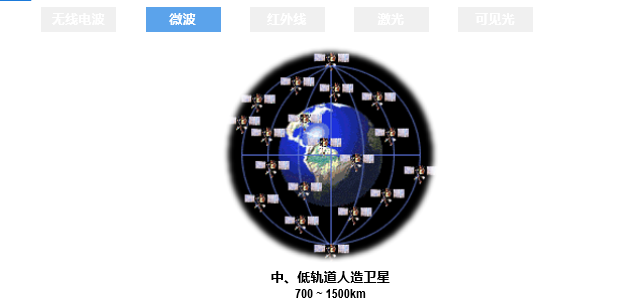

红外线能够在大气中传播，并且在很多情况下不会穿透墙壁，因此可以在短距离内进行点对点的通信。


(激光和可见光是未来技术，这里就不作说明)

### [传输方式](https://zh.wikipedia.org/wiki/%E9%80%9A%E4%BF%A1)

#### 串行传输

串行传输**是指在计算机总线或其他数据通道上，每次传输一个比特数据，并连续进行以上单次过程的通信方式**。

串行传输**接收端**存在一个**如何从串行数据比特流中正确地划分出发送的一个个字符**的问题，也就是**字符同步**的问题。在串行数据通信中同步问题十分关键。发送端**一位一位地把信息通过介质发往接收端**，接收端**必须识别信息的开始和结束**，而且必须知道**每一位的持续时间**。只有这样，接收端才能从传输线路上**正确地取出被传送的数据**。


数据流以串行方式**一位位**地在一条信道上传输，**等第一个字符的最高位传输完**后，**再传输**第二个字符的最低位，依此类推，这样串接起来形成串行数据流。


#### 并行传输

数据以**一组**或者**整个字符**的方式在**多条并行信道**上同时传输。 常用的就是将构成一个字符代码的8位二进制码，分别在8个并行信道上进行传输。

并行传输的效率高但是使用费用高，通常执行短距离的数据输送。同时在计算机中，网卡负责将并行的数据流转化为串行的数据流，反之亦然。


#### 同步传输

在同步数据传输中，数据以帧或块的形式在接收方和发送方之间传输。**数据以配对方式传输，因此发送方和接收方的同步是必要的。**

只有当这些系统共享一个内部时钟时，这种同步才有可能。这种数据传输方式用于**通过闭路电视传输语音和实时视频等对时间敏感的数据。**


为了在同步传输方式中实现收发双方的时钟同步，可以采用以下两种方法:

- 外同步:在收发双方之间增加一条时钟线，发送端在发送数据信号的同时，还要发送一路时钟信号。接收端在时钟信号的“指挥下”对数据信号进行采样。这样就实现了收发双方的同步。
- 内同步:发送端将时钟信号编码到发送数据中一起发送。例如，曼彻斯特编码和差分曼彻斯特编码都自含时钟编码，具有自同步能力。

#### 异步传输

异步数据传输与同步数据传输正好相反，**不需要接收方和发送方之间的主动同步**。数据以半对方式以字符或字节的形式移动。**传输数据的字符大小为8位**，在数据的首尾**加上奇偶校验位后变为10位**。这种传输方法利用奇偶校验位来通知接收器有关数据转换的信息。通常一次传输1个字符或字节的数据。

异步传输方式以字节为传输单位，但字节之间的时间间隔并不固定，**接收端只在每个字节的起始处对字节内的比特实现同步。**为此，一般要给**每个字节添加起始位和结束位**。异步是指字节之间的异步(也就是字节之间的时间间隔并不固定)，但**字节内的每个比特仍然要同步**，它们的信号持续时间是相同的。


对应一个字节的位的分配：

- 起始位是一个低电平（逻辑0），用于通知接收方一个新字节的开始。
- 数据位传输实际的数据信息。
- 停止位标志一个字节的结束，并为接收方提供处理当前字节和准备下一个字节的时间。
- 奇偶校验位（可选）用于错误检测。


### 通讯方式


#### **单工通信**

- **定义**：单工通信（Simplex Communication）是指消息只能单向传输的工作方式。
- **特点**：发送端只能发送信息，接收端只能接收信息，不能反向传输。例如广播电台发送信息，听众只能接收。
- **示例**：广播是单工通信的典型应用，广播电台发送信号，听众收听，不可反向传输。

#### **半双工通信**

- **定义**：半双工通信（Half-duplex Communication）可以实现双向通信，但不能同时进行，需交替进行。
- **特点**：发送端和接收端可以互换角色，但每次只能有一个方向传输。例如对讲机可以发出信号，也可以接收信号，但不能同时进行。
- **示例**：对讲机是半双工通信的常见应用，需要按下“按讲”（Push To Talk, PTT）按钮才能说话。

#### **全双工通信**

- **定义**：全双工通信（Full duplex Communication）是指通信的双方可以同时进行双向信息传输。
- **特点**：可以同时发送和接收信息，双向通信无延迟。例如手机通话时，双方可以同时讲话和听。
- **示例**：手机通信是全双工通信的应用，双方可以同时说话和听对方讲话。

### 编码与调制

基带信号是由信源发出的原始信号，原始信号中含有一些**杂信号例如直流信号(连续的1或者连续的0)**

**调制是将基带信号用于调节载波信号的某些参数（如振幅、频率或相位），以将信息嵌入载波信号中进行传输。解调则是调制的反过程，通过检测和分析已调信号的参数变化，提取并恢复出原始的基带信号。**

> 调制基带信号是为了让它能在信道上传输
>
> 解调就是将调制信息还原为源信息


#### 码元

> **通过不同类型的码元组合，表示其他信息**

[码元](https://www.cnblogs.com/Mr-black-7/p/16901058.html)是指用一个固定时长的**信号波形(数字脉冲)**，**代表不同离散数值**的基本波形，是数字通信中数字信号的计量单位，这个时长内的信号称为**k进制码元**，而该时长称为**码元宽度**。当码元的离散状态**有M个时(M大于2)**，此时码元为**M进制码元。**

1码元可以携带多个比特的信息量。例如，在使用二进制编码时，只有两种不同的码元，一种代表0状态，另一种代表1状态。

**码元携带的数据量取决于编码方式和调制方式**

> 码元的作用就是将输送过来的波，转化为电脑可以识别的电子信号
>
> 但是电子信号所对应的模拟前信号的位置也是码元


#### [基带信号](https://cloud.tencent.com/developer/article/1944385)

由信源发出的原始信号称为基带信号，也就是基本频带信号。例如，由计算机输出的表示各种文字、图像、音频或视频文件的数字信号都属于基带信号。**基带信号往往包含较多的低频成分，甚至包含(由连续个“0”或连续个“1”造成的)直流成分**，而许多信道并不能传输这种低频分量或直流分量。因此，需要对基带信号进行调制(modulation)后才能在信道上传输。

> 不同极性信号的图
>
> 

#### 常见编码方式

常用编码方式有：不归零制、归零制、曼彻斯特编码以及差分曼彻斯特编码等

##### 不归零制

**不归零是指信号中的码元在编码过程中都不会回归到零电平。**

**不归零制的编码效率最高**，但是存在收发双方的同步问题。为了解决同步问题，需要给收发双方再**添加一条时钟信号线**。发送方通过数据信号线给接收方发送数据的同时，还通过时钟信号线给接收方**发送时钟信号**。接收方按照接收到的时钟信号的节拍，对数据信号线上的信号进行采样。


##### 归零制

**归零制是指信号在每个码元期间会回归到零电平**。

例如，如图所示的是一种双极性归零编码，正电平表示1，负电平表示0，**在每个码元的中间时刻信号都会回归到零电平**。由于每个码元传输后信号都会归零，所以接收方只要在**信号归零后采样**即可。归零编码相当于将时钟信号编码在了数据之内，通过数据信号线进行发送，而不用单独的时钟信号线来发送时钟信号。因此，采用**归零编码的信号也称作自同步信号**。然而，**归零编码也有缺点:大部分的数据带宽都用来传输“归零”而浪费掉了**。


##### 曼彻斯特编码

曼彻斯特编码在**每个码元的中间时刻电平都会发生跳变**。电平的**跳变既表示时钟信号**，也表示数据。向下跳变表示1还是0，以及向上跳变表示0还是1，可以自行定义。

曼彻斯特编码信号属于自同步信号，`10Mbs` 的传统以太网采用的就是曼彻斯特编码。


##### 差分曼彻斯特编码

差分曼彻斯特编码在每个码元的**中间时刻电平都会发生跳变**。


与曼彻斯特编码不同的是，电平的**跳变仅表示时钟信号**，而不表示数据。数据的表示在于每一个码元开始处是否有电平跳变：无跳变表示1，有跳变表示0。


**常见编码方式整图：**


#### 带通调制

> 在解题过程中，不需要了解具体的调制原理。**只需要了解这种调制方法能创造出多少种码元来表达信息就行**。

常见的带通调制的方法：

　　A. 调幅（AM）：载波的振幅随基带数字信号而变化。1或0对应于有无载波输出。

　　B. 调频（FM）：载波的频率随基带数字信号而变化。1或0对应于两个不同的频率。

　　C. 调相（PM）：载波的初始相位随基带数字信号而变化。1或0对应于相位180度或0.

> **基本调制中，一个码元只能包含一种比特信息。**


> 码元通过调制转化为编码信号，这是接收端处理的事情


#### 混合调制

为了提高数据传输速率，可以使用技术上更为复杂的混合调制方法，使**1个码元可以表示多个比特的信息量**。因为载波的频率和相位是相关的，即频率是相位随时间的变化率，所以载波的频率和相位不能进行混合调制。通常情况下，**载波的相位和振幅可以结合起来一起调制**，例如正交振幅调制(QAM)。


相位和振幅的混合调制：正交振幅调制QAM


##### 正交振幅调制([qam](https://info.support.huawei.com/info-finder/encyclopedia/zh/QAM.html))

> `相位 * 振幅 = 码元数量`
>
> 然后用log_2，就得到了一个码元表达信息的数量

正交幅度调制(QAM，Quadrature AmplitudeModulation)是一种在两个正交载波上进行幅度调制的调制方式。这两个载波通常是相位差为90度(T/2)的正弦波，因此被称作正交载波。这种调制方式因此而得名。


QAM中的每个码元可以表示多比特的信息。16-QAM中每个码元可以表示4比特信息，64-QAM中每个码元可以表示6比特信息，而更高阶的QAM（如256-QAM）可以表示更多比特的信息。


在数字信号调制中，星座图通常用于表示QAM调制二维图形。星座图相对于IQ调制而言，将数据调制信息映射到极坐标中，这些信息包含了信号的幅度信息和相位信息。

星座图上的每一个点，都表示一个符号。该点I轴和Q轴的分量分别代表着正交的载波上的幅度调整。该点到原点的距离**A**就是调制后的幅度，夹角**φ**就是调制后的相位。


> 这里是重点，需要记住这里的码元表示方法


### [信道极限容量](https://www.cnblogs.com/yangmingxianshen/p/7819874.html)

信道容量是指在一个信道中能够可靠地传送信息时可达速率的最小上界。所谓可靠传输指的是可以以任意小的错误率传递信息。**根据有噪信道编码定理，信道容量是可以误差概率任意小地达到的给定信道的极限信息率**。信道容量的单位为比特每秒、奈特每秒等等。

信道容量是信道的输入与输出的互信息量的最大值，而相应的输入分布称为最佳输入分布


> 传输越快，质量越差
>
> 质量越高，传输越慢


#### 信道可通频率

在信道上传输的数字信号其实是使用多个频率的模拟信号进行多次谐波而成的方波，如图所示。

假如数字信号频率位`1000Hz`，需要使用`1000Hz`的模拟信号作为基波，基本信号和更高频率谐波叠加形成数字信号的波形。

经过**多次更高频率的波进行谐波，可以形成接近数字信号的波形**，现在大家应该明白了为什么数字信号中包含更高频率的谐波了。

> [谐波](https://zhuanlan.zhihu.com/p/22481177)是指电流中所含有的频率为基波的整数倍的电量，一般是指对周期性的非正弦电量进行**傅立叶级数分解**，除了基波频率的电量，其余大于基波频率的电流产生的电量，称为谐波。谐波次数是谐波频率与基波频率`（n=fn/f1）`的比值。
>
> 
>
> 


具体的信道所能通过的模拟信号的频率范围总是有限的。能够通过的**最高频率减去最低频率就是该信道的带宽。**

如图所示的电话线，假定其允许频率范围从300~3300Hz的模拟信号能够通过，低于300Hz和高于3300Hz的模拟信号均不能通过，则电话线的带宽位3000Hz。


> 怎么样拆解和叠加不同的波呢([傅里叶变换](https://zh.wikipedia.org/wiki/%E5%82%85%E9%87%8C%E5%8F%B6%E5%8F%98%E6%8D%A2))


#### [奈氏法则](https://www.cnblogs.com/evanzone/articles/15692570.html)

奈氏准则的提出是针对`码间串扰`问题的，所谓**码间串扰问题就是当信息发送过快时，相邻的码元在接受时有可能被错误接收。**其原理类似于**视觉残留**，画面在眼前闪太快时，人眼就会自动把上一帧画面和当前帧画面联系起来。


这个公式非常重要，这里的W表示信道的带宽大小。
$$
Cmax=2WBaud=2Wlog2Mbit/s
$$

- 在任何信道中，码元传输的速率是有上限的。若传输速率超过此上限，就会发现严重的码间串扰问题，使接收端对码元的完全正确识别成为不可能。
- 信道的**频带越宽**（即能通过的信号高频分量越多），就可以用更高的速率进行码元的有效传输。
- **奈氏准则**给出了码元传输速率的限制，但没有对信息传输速率给出限制。
- 由于**码元的传输速率受奈氏准则的制约**，所以要提高数据的传输速率，就必须设法使每个**码元能携带更多个比特的信息量**，这就需要采用**多元制的调制方法**。


常见一个码元携带多比特量：4 or 8


> 例题：
>
> 
>
> 解题过程中，只关心可以调制出不同基本波形的数量，则每一个**码元**可以携带的比特数量为**log<sub>2</sub>X**。
>
> 这里的四个相位类比为四种不同的手势，也就是说一个码元可以携带**log<sub>2</sub>4 = 2信息**
>
> 
>
> 由题目得知，其码元可以携带的比特数量为：log<sub>2</sub>16(4*4)，**相位乘上振幅。**
>
> 根据公式：`最大传输速率 = 最高码元传输速率*每个码元携带的比特数量`
>
> `= 2W*4 = 2*3k*4 = 24kbps`答案选择B
>
> 总结：只需要关注技术调制出不同码元的数量即可。计算就是用**相位乘上振幅。**详细计算公式就是
> $$
> 2W*log_2(相位*振幅)
> $$
> **其中W表示带宽**

#### [香农公式](https://www.sohu.com/a/219750202_464086)

**噪声**存在于所有的电子设备和通信信道中。由于噪声随机产生，它的瞬时值有时会很大，因此噪声会使接收端对码元的判决产生错误。但是噪声的影响是相对的，若信号较强，那么噪声影响相对较小。因此，**信噪比**就很重要。**信噪比=信号的平均功率/噪声的平均功率**，常记为S/N，并用分贝 (dB) 作为度量单位，即:
$$
dB（信噪比）= 10lg（S/N）
$$
对于有噪声的信道，其带宽为𝑊 Hz，该信道的信噪比记为𝑆/𝑁，则该信道的最大传输速率为（该式子中的信噪比为无单位比值）
$$
C
m
a
x
=
W
log
2
(
1
+
S
/
N
)

bit/s
$$
> 


### 信道复用

在一条传播媒体上传输多路用户的信号，称之为复用


#### **频分复用**

频分复用, 就是通过将不同频率的信号进行融合, 然后在接收端再进行不同频率信号的分离。当然, 叠加后的频率是不能超出传输媒介的频率带宽的。

频分复用的**所有用户同时占用不同的频带资源并行通信**，可以将宽带看做一个矩形，在矩形处划分**不同的区块作为子信道**。


**频分复用FDW的例子**

在三台电话的信号合并之前，如果没有采取信道复用技术，一端的两台电话同时打给另一端的同一台电话，就会出现占线的情况。然而，**传输过程中通过将三种波形合并为一个波实现了信道复用**，这样就可以避免占线问题。


#### **时分复用**

时分多路复用（Time Division Multiplexing, TDM）是一种多路复用技术，可以是数字的，也可以是模拟的（虽然较为罕见）。使用这种技术，**两个以上的信号或数据流可以同时在一条通信线路上传输，表现为同一通信信道的多个子信道。然而，在物理层面上，信号实际上是轮流占用物理通道的。**

在 TDM 中，时间域被分成周期循环的若干小段，**每段时间长度是固定的**，每个时段用于传输一个子信道的数据。例如，子信道1的采样数据（可以是字节或数据块）在时间段1传输，子信道2的数据在时间段2传输，以此类推。

一个 TDM 帧包含一个子信道的一个时间段。当最后一个子信道的数据传输完毕后，这个过程会重复进行，以传输新的帧，也就是下一个信号片段。


#### **波分复用**

波分复用是利用多个激光器在单条光纤上**同时发送多束不同波长激光的技术。**每个信号经过数据(文本、语音、视频等)**调制后都在它独有的色带内传输**。**WDM** 能使电话公司和其他运营商的现有光纤基础设施容量大增。

> 波分复用就是光的频分复用。


通过复用器，将所有频率的光合并传输道分用器中。


#### **[码分复用](https://www.cnblogs.com/AhuntSun-blog/p/12210618.html)**

最普通的例子就是手机打电话。比如联通公司发送总的信号是一样的，那么当多人同时打电话时如何判断打的是A手机而不是B手机呢？

常用的名词是**码分多址 CDMA** (Code Division Multiple Access)。

- 各用户使用经过特殊挑选的不同码型，因此彼此不会造成干扰。
- 这种系统发送的信号有很强的抗干扰能力，其频谱类似于白噪声，不易被他人发现。
- 每一个比特时间划分为 m 个短的间隔，称为**码片**(chip)。


**`CDMA(码分多址)`的工作原理:**

> 不太理解这里，总之好像是[无线网络通讯](https://www.mrchip.cn/newsDetail/4182)的组成部分


## 第三章 数据链路层

数据链路层的主要作用是**在两个网络实体之间提供数据链路的建立、维持和释放**。它负责将网络层的数据封装成数据帧（frame），**并在帧中添加地址段、控制段和数据段等信息**，以确保数据在传输过程中的完整性和准确性。数据链路层通过对**帧进行定界、同步、以及发送**和接收顺序的控制，实现对物理层数据的封装和管理。

它还包括流量控制和差错检测与纠正，通过在**帧尾添加检验码来识别和修正传输中的错误**，从而将物理层的可能出错的连接转换为逻辑上无差错的数据链路。因此，**数据链路层在保证数据准确传输的同时，也提高了数据传输的可靠性。**


**链路简单理解，是局域网中网卡和网卡联通的通道。**在数据链路层中需要实现是：如何在物理链路上传输数据，包括错误检测和纠正、帧的格式化等。


链路层**传输的数据被称之为帧**，帧的构成：

- **帧头（Header）**：包含源和目标地址、类型字段等控制信息。
- **数据部分（Payload）**：实际传输的数据，即来自网络层（第三层）的数据包。
- **帧尾（Trailer）**：包含**错误检测码（如CRC校验码）**，用于验证数据的完整性。


### 数据链路层简述

在数据链路层中，链路层地址有很多中不同的称谓：LAN 地址、物理地址或者 MAC 地址，因为 MAC 地址是最流行的术语，所以我们一般称呼链**路层地址指的就是 MAC 地址。**


#### [封装成帧和透明传输](https://www.zbpblog.com/blog-345.html)

**打包成帧（framing）**：在网络层的数据报传输之前，几乎所有的链路层协议都会将数据报封装成链路层的帧。数据链路层从**网络层获取数据后，将其封装成帧。**如果帧过大，数据链路层会将其拆分为多个小帧，以提高传输控制和错误检测的效率。

一个帧由以下部分组成：

- **Header（帧头）**：包含帧的控制信息，如源地址和目的地址等。
- **Payload Field（有效载荷）**：包含上层的数据，网络层的数据报被封装在这个字段中。
- **Trailer（帧尾）**：包含用于错误检测和校验的信息。

帧的具体结构根据不同的物理介质有所不同。


帧的首部和尾部包含重要的控制信息。例如，**首部通常包括帧开始符、帧的源地址和目的地址，而尾部通常包括帧校验序列和帧结束符。**接收方的数据链路层在收到物理层交付的比特流后，通过帧首部中的**帧开始符和帧尾部中的帧结束符识别出帧的起始和结束**，这一过程称为帧定界。

一般而言，数据的长度通常大于首部和尾部的长度。

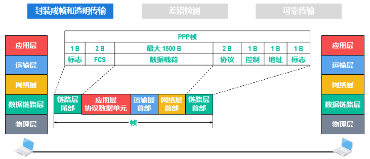

[**透明传输**](https://www.zhihu.com/question/34774349)其实就是指无论是什么报文都可以传输，非透明传输就是指某些特殊字符不能传输，在计算机网络中，在数据链路层将网络层协议封装成帧时，**会在首部和尾部分别添加SOH以及EOT这两个特殊字符，接收方是根据这两个字符来确定帧首和帧尾的**，如果上层协议发送过来的数据(即链路层的数据部分)包含EOT，那么接收方在解析这个帧的时候就会误以为数据已经结束。

所以，**如果链路层对这种情况没有特殊处理**，那么就可以理解链路层为**非透明传输**(因为无法传输EOT这个字符)，但是数据链路层通过对这个字符添加转移符(如果网络层数据中还存在转移符，就再添加一个转移符)的办法来使数据部分可以传输EOT字符，就实现了透明传输。

> 透明传输就是**数据传输过程中数据不会受特殊字符的影响**（受影响只要处理好了也是透明传输），但是如果受到影响，如出现数据中字符刚好与停止符等相同时，且未进行任何处理，则为非透明传输


实现透明传输的方法通常有两种：字节填充和比特填充。

1. **字节填充**
   在这种方法中，数据帧的定界符前插入一个转义字符`ESC`，以确保传输过程中不会误将数据中的特定字符识别为帧定界符。
2. **比特填充**
   这种方法通过在数据帧中的特定比特序列前后插入额外的比特，确保帧的定界符不会与数据中的比特序列混淆。

> 简单理解：透明传输是为了保护帧界定号，使得它不会被误识别

#### [差错检测](https://www.cnblogs.com/myworld7/p/8422270.html)


数据在传输的过程中难免会出现差错（比如经过路由转发时），因此我们需要一些差错检测和纠正技术来检测数据中的差错并纠正，使接收方收到正确的数据，也避免发送方对数据进行重传。


常见的差错检测和纠正技术有：

- 奇偶检测
- 检验和
- 循环冗余检测

##### 奇偶检测

- 奇校验是在待发送的数据后面添加1个校验位，使得添加该校验位后的整个数据中比特1的个数为奇数.
- 偶校验是在待发送的数据后面添加1个校验位，使得添加该校验位后的整个数据中比特1的个数为偶数，

> 通过检测数据中比特的数量来判断数据是否出错


较为简单的纠错方式，只能检测到单个比特错误。


##### [循环冗余校验](https://www.cxyxiaowu.com/21564.html)

循环冗余校验是一种广泛应用于数字通信和存储设备中的错误检测技术。CRC 通过生成一个固定长度的校验码来检测数据传输或存储过程中是否发生了错误。

> 类似于公钥和密钥的关系，发送方加密，接收方解密。查看最终解密的结果是否为指定的多项式，即可判断发送的信息是否正确


- 余数为0，可判断接收无误码

- 余数不为0，可判断接收有误码


**发送端**：准备数据 -> 数据扩展 -> 计算CRC校验码 -> 附加校验码 -> 发送数据。

**接收端**：接收数据 -> 校验过程 -> 检查余数。

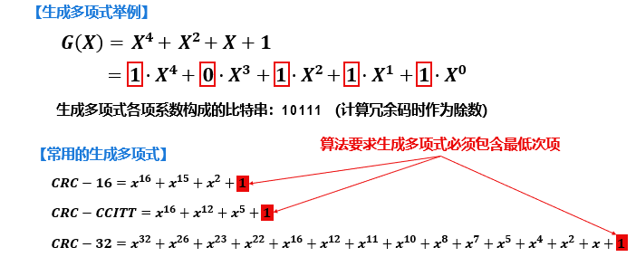

简要流程如下：

> ### 发送端流程
>
> 1. **数据准备**：
>
>    将要传输的数据转换为二进制形式，表示为数据多项式
>    $$
>    D(x)。
>    $$
>
>
> 2. **多项式扩展**：
>
>    在数据末尾添加n个零（n是生成多项式的位数减去1），得到扩展后的数据
>    $$
>    D(x)\cdot x^n。
>    $$
>
>
> 3. **计算CRC校验码**：
>
>    用生成多项式
>    $$
>    G(x)
>    $$
>    对扩展后的数据
>    $$
>    D(x)⋅x^n
>    $$
>    进行二进制多项式除法，得到余数
>    $$
>    R(x)
>    $$
>
> 4. **附加校验码**：
>
>    将CRC校验码`R(x)`附加到原始数据末尾，形成发送数据。
>
>### 接收端流程
>
>1. **接收数据**：
>    - 接收包含原始数据和`CRC`校验码的完整数据串。
>2. **校验过程**：
>    - 使用相同的生成多项式`G(x)`对接收到的完整数据串进行二进制多项式除法。
>3. **检查余数**：
>    - 如果除法得到的余数为0，说明数据在传输过程中没有发生错误。


#### 可靠传输

网络层提供的可靠交付主要指的是端系统到端系统的交付，而数据链路层提供的可靠交付则更侧重于**单个链路节点之间的传输**。当链路层协议提供可靠交付时，它保证无差错地在链路层将每个网络层数据报从一个节点传送到另一个节点。**链路层的可靠交付方法类似于 TCP，即通过使用 `确认` 和 `重传` 机制来实现。**

链路层的可靠交付通常用于出错率较高的链路，如无线链路。其目的是在**本地纠正出错的帧**，而不是通过运输层或应用层协议实现**端到端的数据传输**。对于出错率较低的链路，例如光纤、同轴电缆和双绞线，链路层的交付开销通常是不必要的，**因此这些链路通常不提供可靠的交付服务。**


> 可靠传输是通过检测信息是否完整的结果，没有差错检测就没有可靠传输


- 如果**网络接口层使用的是信道易受干扰的802.11无线局域网**，那么其数据链路层**必须实现可靠传输**。
- 如果网络接口层使用的是信道质量比无线局域网好很多的以太网，那么其数据链路层不要求实现可靠传输。
- 网际层的IP向其上层提供的是无连接、不可靠传输服务。
- 运输层中的**TCP向其上层提供的是面向连接的可靠传输服务**，而UDP向其上层提供的是无连接、不可靠传输服务。


数据链路层向上层提供的服务呈现出两种不同的类型。

- 不可靠传输服务：**仅仅丢弃有误码的帧**，其他什么也不做
- 可靠传输：**想办法实现发送端发送什么**，接收端接收什么

不可靠传输服务是一种弃疗的心态，而可靠传输是一种挽救的心态。


并且，误码只是传输差错中的一种。

传输差错还包括分组丢失、分组失序以及分组重复三种类型。


- 分组丢失是指，当某一个分组传入到一个已经挤满分组的路由器，这个路由器就会根据其分组丢失策略将该分组进行丢失。
- 分组失序是指，在某一台主机按顺序发送一连串分组，而这些分组在传输过程中会因为具体的路径选择和“路况”导致最终到达目的地的顺序和原本发送的顺序不太一样。这就叫做分组失序。
- 分组重复是指一个分组在发送过程中可能堵在传输路径上过久以致触发超时重发机制，且最终最开始发送的和重新发送的分组都到达了目的地。

##### [停止等待协议](https://www.cnblogs.com/fennleo/p/13434741.html)

**停止- 等待**流量控制是一种最简单的流量控制方法。**发送方每次只允许发送一个数据分组，接收方每接收一个数据分组都要反馈一个应答信号,表示可以接收下一数据分组，发送方收到应答信号后才能发送下一数据分组。**若发送方没有收到接收方反馈的应答信号，则需要一直等待。发送方每发送完一个数据分组，就进入等待接收方确认信息的过程中，因而传输效率很低。

> 数据分组可以理解为帧的一部分


接收方收到发送方的数据分组后，通过差错检测技术可检测出数据分组是否存在误码。

- 如果没有误码，就接受该数据分组，并给发送方发送ACK分组。发送方收到ACK分组后就可以发送下一个数据分组。
- 如果存在误码，就丢弃该数据分组，并给发送方发送NAK分组，发送方收到NAK分组后就会重传之前出现误码的这个数据分组。


超时重传时间(RTO)应当仔细选择:

- 若RTO太短，则会造成正常情况下确认分组还未到达发送方时，发送方就出现了不
  必要的超时重传。
- 若RTO太长，则发送方会白白等待过长的时间，降低信道利用率，一般可将RTO设置为略大于收发双方的平均往返时间RTT。


> 发送方发送时延：TD，接收方确认分组：TA。
>
> 收发往返时间RTT

$$ {数学公式}
U = \frac{T_D}{T_D + RTT + T_A}
$$


##### 后退N帧协议

GBN协议采用流水线传输方式，利用发送窗口限制发送方连续发送数据分组的数量

- 发送方需要维护一个发送窗口，在未收到接收方确认分组的情况下，**发送方可将序号落入发送窗口内的所有数据分组连续发送出去。**
- 接收方需要维护一个接收窗口，只有**正确到达接收方且序号落入接收窗口内的数据分组才被接收方接收。**


> 在回退N帧协议的工作过程中，发送方的发送窗口和接收方的接收窗口按上述规则不断向前滑动。因此，这类协议又称为**滑动窗口协议**。


> PPT流程：


> 例题：
> 
>
> `GBN协议`，接收方只能接受正确到达的帧，在解题过程中只需要关心最后一个确认帧所确认的数据帧的序号：
>
> 
>
> **重传出现超时的情况，会将后续发送的数据帧进行重新发送**

##### [选择重传协议](https://www.cnblogs.com/Mr-black-7/p/16980997.html)

为了进一步提高信道利用率，可以设法只重传出现差错的数据分组，这就需要接收窗口的尺寸大于1，以便先收下失序但正确到达接收方且序号落入接收窗口内的数据分组，等到所缺数据分组收齐后再一并送交上层，这就是选择重传(Selective Repeat，SR)协议。


### [点对点协议(PPP)](https://www.cnblogs.com/cone/p/14847883.html)

> PPP协议在数据链路层中起作用，是一种数据链路层协议，提供了灵活的链路建立、配置、管理和终止功能，是点对点数据传输的基础协议之一，广泛用于各种点对点连接中。

1999年公布了可以在以太网上运行的PPP协议(PPPoverEthernet，PPPOE)，它使得ISP可以通过数字用户线路(DigitalSubscriber Line，DSL)，电路调制解调器以及以太网等宽带接入技术，以以太网接口的形式为用户提供接入服务。


PPP由三部分组成：


- **链路控制协议（Link Control Protocol, LCP）**：
  - 用于建立、配置和测试数据链路的连接，并协商各种选项。LCP负责确保数据链路层的正常操作，包括协议参数的协商和链路的质量检测。
- **网络层PDU（协议数据单元）封装到串行链路的方法**：
  - 网络层PDU（如IP数据包）作为PPP帧的数据载荷被封装在PPP帧中进行传输。网络层PDU的长度受到PPP协议最大传送单元（MTU）的限制。PPP协议支持面向字节的异步链路和面向比特的同步链路，因此可以适应不同类型的链路环境。

- **网络控制协议（Network Control Protocol, NCP）**：
  - 包含多个协议，每个协议支持不同的网络层协议。例如，NCP中的一个协议用于支持TCP/IP中的IP，一个用于支持Novell NetWare网络操作系统中的IPX，另一个用于支持Apple公司的AppleTalk等。这些协议帮助PPP在链路层上实现多种网络层协议的协作和管理。


- **标志字段（Flag）**：
  - 首部的第一个字段和尾部的第二个字段都是标志字段（Flag），其值设定为0x7E（二进制为01111110）。标志字段用于标识一个帧的开始或结束，**因此它是PPP帧的定界符。**如果**出现连续两个标志字段，这表示有一个空帧**，应当被丢弃。连续两帧之间只需一个标志字段。
- **地址字段（Address）和控制字段（Control）**：
  - 首部中的地址字段（A）规定为0xFF（二进制为11111111），控制字段（C）规定为0x03（二进制为00000011）。尽管最初可能考虑对这两个字段的值进行其他定义，但至今未有更新，因此这些字段实际上并没有携带具体的PPP帧信息。

- **协议字段（Protocol）**：
  - PPP首部的第四个字段是2字节的协议字段。该字段标识信息字段的类型：
    - 当协议字段为0x0021时，信息字段包含IP数据报。
    - 当协议字段为0xC021时，信息字段包含PPP链路控制协议（LCP）的数据。
    - 当协议字段为0x8021时，表示信息字段为网络层的控制数据。

- **信息字段**：
  - 信息字段的长度是可变的，但最大不超过1500字节。它承载了实际的数据或控制信息。

- **帧检验序列（FCS）**：
  - 尾部中的第一个字段（2字节）是使用CRC的帧检验序列（FCS）。FCS用于检测数据在传输过程中是否出现了错误，确保数据的完整性和正确性。


#### 字节填充

因为PPP帧的帧定界符是0x7E(126)，所以当信息字段中出现一样的比特组合时，就必须采取一些措施，使得和帧定界符一样的比特组合不出现在信息字段中。
当PPP使用异步传输时，它把转义符定义为0x7D（01111101），并使用字节填充。RFC 1662规定了如下填充方法：

- 把信息字段处出现的每一个0x7E（帧定界符）转变为2字节序列（0x7D，0x5E）
- 若信息字段中出现一个0x7D的字节，即出现了和转义字符一样的比特组合，则把0x7D转变为2字节序列（0x7D，0x5D）
- 若信息字段中出现ASCII码的控制字符，即数值小于0x20的字符，则在该字符前面加入一个0x7D字节，同时转变该字符，例如：出现了0x03（在控制字符中，是“传输结束”ETX），就要把它转变为2字节序列（0x7D，0x23）

#### 零比特填充

PPP协议用在SONET/SDH链路时，使用同步传输（一连串的比特连续发送），而不是异步传输（逐个字符的传送）。在这种情况下，PPP协议采用零比特填充方法来实现透明传输。具体做法是：

- 在发送端，先扫描整个信息字段（通常用硬件实现，也可用软件实现），只要发现有5个连续1，就立即填入一个0。因此经过这种零比特填充后的数据，就可以保证信息字段中不会连续出现6个1（6个1，可能为01111110，与帧定界符一致）。
- 在接收端，当收到一个帧时，先找到帧定界符F，以确定一个帧的边界，接着再用硬件对其中的比特流进行扫描。每当发现5个连续的1时，就把这5个连续的1后面的一个0删除，以还原成原来的信息比特流。这样就保证了透明传输，在传送的数据比特流中，可以传送任意组合的比特流，而不会引起对帧边界的错误判断。

#### [PPP协议工作](https://www.cnblogs.com/cone/p/14847883.html)

互联网用户通常需要连接到某个ISP才能接入到互联网，PPP协议就是用户计算机和ISP进行通信时，所使用的数据链路层协议，它应满足如下需求：


### 共享式以太网

早期流行的传输速率为`10Mb/s`的以太网，现在被交换式以太网取代


#### 网络适配器和MAC地址

网络适配器，俗称网卡。在计算机内部，网卡与CPU之间的通信，是通过计算机主板上的IO总线以并行传输方式进行的。网卡与外部以太网(局域网)之间的通信，一般是通过传输媒体(同轴电缆、双绞线、光纤)以串行方式进行的。显然，网卡除了要实现物理层和数据链路层功能，其另外一个重要功能就是要进行并行传输和串行传输的转换。由于网络的传输速率和计算机内部总线上的传输速率并不相同，因此在网卡的核心芯片中都会包含用于缓存数据的存储器。


在确保网卡硬件正确的情况下，为了使网卡正常工作，还必须要在计算机的操作系统中为网卡安装相应的设备驱动程序。驱动程序负责驱动网卡发送和接收帧。当网卡收到正确的帧时，就以中断方式通知CPU取走数据并将其交付给协议栈中的网络层。当网卡收到误码的帧时，就把这个帧丢弃而不必通知CPU。


[MAC地址](https://www.cnblogs.com/lsgxeva/p/13932262.html)

对于点对点信道，由于只有两个站点分别连接在信道的两端，因此其数据链路层不需要使用地址。然而对于连接有多个站点的广播信道，==要实现两个站点间的通信，则每个站点就必须有一个数据链路层地址作为唯一标识==。


使用广播信道的共享式以太网中，总线上的某台主机要给另一台主机发送帧，由于广播信道天然的广播特性，表示帧的信号会通过总线传播到总线上的其他所有主机。那么这些主机中的网卡如何判断收到的帧是否是发送给自己的呢?很显然，使用广播信道的数据链路层必须使用地址来区分各主机。

> “广播”可以理解为一个人通过广播喇叭对在场的全体说话，这样做的好处是通话效率高，信息一下子就可以传递到全体
>
> 


每台主机的网卡地址都是唯一的：

> MAC地址在网卡上，是属于数据链路层的范畴


##### [IEEE 802局域网](https://developer.aliyun.com/article/1047953)

局域网可采用的传输介质有多种，数据链路层必须具有接入多种传输介质的访问控制方法。因此，从体系结构的角度出发，IEEE 802 参考模型将数据链路层划分成两个子层，即介质访问控制（MAC）子层和逻辑链路控制（LLC）子层，其中只有 MAC 子层与具体的物理介质有关，LLC 子层则起着屏蔽局域网类型的作用。

IEEE 802 参考模型从局域网的实际出发，规定了局域网的低三层标准。这三层分别是物理层、介质访问控制子层 MAC 和逻辑链路控制子层 LLC，它相当于 OSI 模型的最低两层，即物理层和数据链路层，其对应关系如图 4-1 所示。局域网标准没有规定高层的功能。因为局域网的绝大多数高层功能是与 OSI 参考模型一致的。


> MAC地址是物理地址


每8个比特为1个字节，从左至右依次为第一字节到第六字节。前三个字节是组织唯一标识符(Organizationally Unique Identifer，OUI)，生产网络设备的厂商需要向IEEE的注册管理机构申请一个或多个OUI。后三个字节是获得OUI的厂商可自行随意分配的网络接口标识符，只要保证生产出的网络设备没有重复地址即可。


[单播，广播，多播](https://www.jianshu.com/p/164ab8a6e6a9)

> - 单播：网络节点之间的通信就好像是人们之间的对话一样。**如果一个人对另外一个人说话，那么用网络技术的术语来描述就是“单播”，此时信息的接收和传递只在两个节点之间进行**。单播在网络中得到了广泛的应用，网络上绝大部分的数据都是以单播的形式传输的，只是一般网络用户不知道而已。例如，你在收发电子邮件、浏览网页时，必须与邮件服务器、Web服务器建立连接，此时使用的就是单播数据传输方式。但是通常使用“点对点通信”（Point to Point）代替“单播”，因为“单播”一般与“多播”和“广播”相对应使用。
> - 多播：“多播”也可以称为“组播”，**在网络技术的应用并不是很多，网上视频会议、网上视频点播特别适合采用多播方式**。因为如果采用单播方式，逐个节点传输，有多少个目标节点，就会有多少次传送过程，这种方式显然效率极低，是不可取的；如果采用不区分目标、全部发送的广播方式，虽然一次可以传送完数据，但是显然达不到区分特定数据接收对象的目的。采用多播方式，既可以实现一次传送所有目标节点的数据，也可以达到只对特定对象传送数据的目的。　　IP网络的多播一般通过多播IP地址来实现。多播IP地址就是D类IP地址，即224.0.0.0至239.255.255.255之间的IP地址。Windows 2000中的DHCP管理器支持多播IP地址的自动分配
> - 广播：**“广播”在网络中的应用较多，如客户机通过DHCP自动获得IP地址的过程就是通过广播来实现的**。但是同单播和多播相比，**广播几乎占用了子网内网络的所有带宽**。拿开会打一个比方吧，在会场上只能有一个人发言，想象一下如果所有的人同时都用麦克风发言，那会场上就会乱成一锅粥。集线器由于其工作原理决定了不可能过滤广播风暴，一般的交换机也没有这一功能，不过现在有的网络交换机（如全向的QS系列交换机）也有过滤广播风暴功能了，路由器本身就有隔离广播风暴的作用。　　广播风暴不能完全杜绝，但是只能在同一子网内传播，就好像喇叭的声音只能在同一会场内传播一样，因此在由几百台甚至上千台电脑构成的大中型局域网中，一般进行子网划分，就像将一个大厅用墙壁隔离成许多小厅一样，以达到隔离广播风暴的目的。　　在IP网络中，广播地址用IP地址“255.255.255.255”来表示，这个IP地址代表同一子网内所有的IP地址。


> 广播地址的MAC地址为 `FF:FF:FF:FF:FF:FF`


> STP是什么


在以太网中，广播地址的MAC地址为 `FF:FF:FF:FF:FF:FF`。这个地址的特点是：

- 所有字节都设置为十六进制的 `FF`。
- 这个地址被定义为以太网的广播地址，用于发送数据包到同一局域网中的所有设备。

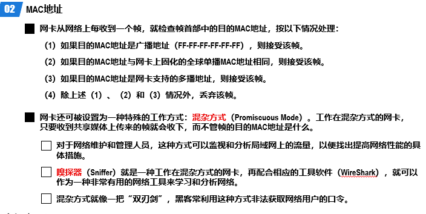

#### [**CSMA/CD协议**](https://www.cnblogs.com/linfangnan/p/13398323.html)

最初的以太网是将许多计算机都连接到一根**总线**上，因为总线上没有有源器件，所以认为这样的连接方法既简单又可靠。当一台计算机发送数据时，总线上的所有计算机都能检测到这个数据。但是并不是在任何时候都需要广播通信，一对一通信需要用 MAC 地址来确定目的地。**例如总线上的每一个工作的计算机都能检测到 B 发送的数据信号。由于只有计算机 D 的地址与数据帧首部写入的地址一致，因此只有 D 才接收这个数据帧。**其他所有的计算机（A, C 和 E）都检测到不是发送给它们的数据帧，因此就丢弃这个数据帧而不能够收下来。


但是这样会导致一个问题，由于总线的带宽有限，如果发送数据过多，就会产生信号碰撞。


共享总线以太网的一个重要问题是：如何**协调总线上的各站点争用总线**。为了解决该问题，以太网使用了一种专用协议 CSMA/CD，它是载波监听多址接入/碰撞检测(CarrierSense Multiple Access/Collision Detection)的英文缩写词。

CSMA/CD协议的要点如下：

- 多址接入：多个站点连接在一条总线上，它们竞争使用总线。
- 载波监听：每一个站点在发送帧之前，先要检测一下总线上是否有其他站点在发送帧。若检测到总线空闲96比特时间(即发送96比特所耗费的时间)，则发送：若检测到总线“忙”，则继续检测并等待总线转为空闲96比特时间后发送帧。因此，可将载波监听比喻为“先听后说”。
- 碰撞检测：每一个正在发送帧的站点必须**边发送帧边检测碰撞**。一旦发现总线上出现碰撞，就立即停止发送，退避一段随机时间后再次从载波监听开始进行发送。因此，可将碰撞检测比喻为**边说边听，一旦冲突，立即停说，等待时机，重新再说**

> 

> 当某个站点在发送帧时，如果帧的前64个字节没有遭遇碰撞，那么帧的后续部分也就不会遭遇碰撞。也就是说，**如果遭遇碰撞，就一定是在帧的前64字节之内**。由于发送站点一旦检测到碰撞就立即中止帧的发送，此时己发送的数据量一定小于64字节。因此，**接收站点收到长度小于64字节的帧，就可判定这是一个遭遇了碰撞而异常中止的无效帧**，将其丢弃即可。

##### 争用期

共享总线以太网上的任一站点在发送帧的过程中都可能会遭遇碰撞。当某个站点检测到总线空闲96比特时间后开始发送帧，如果该在传送过程中遭遇了碰撞，那么发送该帧的站点，最迟要经过多长时间，才能检测出自己发送的帧与其他站点发送的帧产生了碰撞呢?


##### 最小帧长和最大帧长

由于CSMA/CD算法的限制，以太网帧必须不能小于某个最小长度。以太网中，最小帧长为64字节。规定最小帧长是为了避免这种情况发生：A站点已经将一个数据包的最后一个Bit发送完毕，但这个报文的第一个Bit还没有传送到距离很远的B站点。B站点认为线路空闲继续发送数据，导致冲突。

最大帧长限制为`1518B(字节)`


例题：


##### [退避算法](https://www.cnblogs.com/wangzhongqiu/p/7810616.html)

**退避算法就是网络上的节点在发送数据冲突后，等待一定时间后再发，等待时间是随指数增长，从而避免频繁的触发冲突。**在计算机网络中，二进制指数退避算法或截断指数退避算法常常作为避免网络堵塞的一部分用于同一数据块的重发策略。发生n次冲突后，等待时间在`0~2^n-1`个间隙时间（slot times） 之间选择随机选择。


截断二进制指数逃避算法


##### [信道利用率](https://info.support.huawei.com/info-finder/encyclopedia/zh/%E4%BF%A1%E9%81%93%E5%88%A9%E7%94%A8%E7%8E%87.html)

$$
\text{信道利用率} = \frac{\text{实际传输的信息量}}{\text{理论上最大可传输的信息量}}
$$


> 信息太少了


**使用集线器的共享式以太网**

最开始的网络只用一条线来传输信息，后面发展成为了多线的模式


集线器是交换机的前身，现在已经不常用了


**集线器只在物理层工作**


集线器还是电缆？


定义了互联网的标准


#### **[扩展以太网](https://www.cnblogs.com/AhuntSun-blog/p/12212514.html)**

##### 在物理层拓展以太网

- **主机使用光纤和一对光纤调制解调器连接到集线器，使以太网的距离扩大**


- **用多个集线器可连成更大的局域网，在数量上扩展**。


> 优点:

- 使原来属于不同碰撞域的局域网上的计算机能够进行跨碰撞域的通信。
- 扩大了局域网覆盖的地理范围。

> 缺点

- 碰撞域增大了，每一台计算机与另一台计算机通信都要通过主干集线器给所有计算机发送数据，但总的吞吐量并未提高。计算机数量越多效率越低，所以计算机数量不宜超过30台。
- 如果不同的碰撞域使用不同的数据率，那么就不能用集线器将它们互连起来。

##### **数据链路层扩展以太网**

- 在数据链路层扩展局域网是使用**网桥**。
- 网桥工作在数据链路层，它根据 MAC 帧的目的地址对收到的帧进行转发。
- 网桥具有过滤帧的功能。当网桥收到一个帧时，并不是向所有的接口转发此帧，而是先检查此帧的目的 MAC 地址，然后再确定将该帧转发到哪一个接口

**网桥的内部结构**


- 假设①~⑥表示的MAC地址分别为 MA~MF
- 通讯前，网桥并不知道接口1和2分别对应哪些MAC地址，当通过一次信之后，网桥就学习到了，接口1对应MAC地址MA、MB、MC；接口2对应MAC地址MD、ME、MF;
- 之后的通讯中，如果是同一接口所对应MAC地址间的通讯，比如MA 与 MB通信，网桥就不会把数据通过接口2传给接口2对应的MAC地址，即把数据传输线路一分为二，接口1对应地址间通信时不影响接口2对应地址间的通信，不会出现占线问题，提高了信道的利用率。

> 有点难理解

### 交换式以太网

**使用交换机而不使用集线器的以太网就是交换式以太网**


#### 以太网交换机

交换机本质上就是一个多接口的网桥，因此交换机也是一种即插即用设备，其内部的转发表也是通过自学习算法，基于网络中各主机间的通信，自动地逐步建立起来的。另外，交换机也使用**生成树协议**，来产生能够连通全网但不产生环路的通信路径。

> [自学习算法是什么](https://juejin.cn/post/7108490279547568159)

一般的交换机都采用“存储转发”方式，为了减小交换机的转发时延，某些交换机采用了直通(Cut-Through)交换方式。采用直通交换方式的交换机，在接收帧的同时就立即按帧的目的MAC地址决定该帧的转发接口，然后通过其内部基于硬件的交叉矩阵进行转发，而不必把整个帧先缓存后再进行处理。**直通交换的优点是交换时延非常小，但直通交换也有其缺点:不检查差错就直接将帧转发出去，因此有可能会将一些无效帧转发给其他主机。**


### 交换式和共享式对比

> 两个还没搞懂，现在比较不了

### 以太网的MAC帧格式

常见的MAC帧格式是两种，V2 和 IEEE 802.3


#### 以太网V2


### [虚拟局域网(VLAN)](https://cloud.tencent.com/developer/article/2118133)

虚拟局域网是一种将局域网内的站点划分成与物理位置无关的逻辑组的技术，一个逻辑组就是一个VLAN，VLAN中的各站点具有某些共同的应用需求。**属于同一VLAN的站点之间可以直接进行通信，而不属于同一VLAN的站点之间不能直接通信。**

网络管理员可对局域网中的**各交换机进行配置来建立多个逻辑上独立的VLAN**。连接在同一交换机上的多个站点可以属于不同的VLAN，而属于同一VLAN的多个站点可以连接在不同的交换机上。**虚拟局域网并不是一种新型网络，它只是局域网能够提供给用户的一种服务。**


早期以太网是一种基于CSMA/CD的共享通讯介质的数据网络通讯技术。**当主机数目较多时会导致冲突严重、广播泛滥、性能显著下降甚至造成网络不可用等问题。**通过二层设备实现LAN互连虽然可以解决冲突严重的问题，但仍然不能隔离广播报文和提升网络质量。

在这种情况下出现了VLAN技术。**这种技术可以把一个LAN划分成多个逻辑的VLAN，每个VLAN是一个广播域，VLAN内的主机间通信就和在一个LAN内一样，而VLAN间则不能直接互通，广播报文就被限制在一个VLAN内。**如下图所示。


因此，VLAN具备以下优点：

- **限制广播域**：广播域被限制在一个VLAN内，节省了带宽，提高了网络处理能力。
- **增强局域网的安全性**：不同VLAN内的报文在传输时相互隔离，即一个VLAN内的用户不能和其它VLAN内的用户直接通信。
- **提高了网络的健壮性**：故障被限制在一个VLAN内，本VLAN内的故障不会影响其他VLAN的正常工作。
- **灵活构建虚拟工作组**：用VLAN可以划分不同的用户到不同的工作组，同一工作组的用户也不必局限于某一固定的物理范围，网络构建和维护更方便灵活。


#### [Vlan帧格式](https://cloud.tencent.com/developer/article/2118133)

- 标识所属VLAN
- 遵循IEEE 802.1Q标准
- 支持802.1Q协议的交换机既可以收发有标记帧，也可以收发无标记帧
- 交换机内部的数据包一律携带Tag


#### VLAN链路类型

接入链路（Access Link）  

- **常用作连接用户主机和交换机的链路**。通常情况下，主机并不需要知道自己属于哪个VLAN，主机硬件通常也不能识别带有VLAN标记的帧。因此，主机发送和接收的帧都是untagged帧。

干道链路（Trunk Link）  

- 常用作连接交换机与交换机或交换机与路由器之间的链路。干道链路可以承载多个不同VLAN数据，数据帧在干道链路传输时，干道链路的两端设备需要能够识别数据帧属于哪个VLAN，**所以在干道链路上，一般传输的帧都是Tagged帧**。


##### Hybrid端口

- Hybrid端口既可以连接主机，又可以连接交换机。
- Hybrid端口可以以Tagged 或Untagged方式加入VLAN 。


#### Vlan划分


- 基于端口划分VLAN  
  - 根据交换设备的端口编号来划分VLAN。
  - 网络管理员给交换机的每个端口配置不同的PVID，即一个端口缺省属于的VLAN。
  - 当一个数据帧进入交换机端口时，如果没有带VLAN标签，且该端口上配置了PVID，那么，该数据帧就会被打上端口的PVID。
  - 如果进入的帧已经带有VLAN 标签，那么交换机不会再增加VLAN 标签，对VLAN 帧的处理由端口类型决定。
- 基于MAC地址划分VLAN  
  - 根据计算机网卡的MAC地址来划分VLAN。
  - 网络管理员成功配置MAC地址和VLAN ID映射关系表，如果交换机收到的是untagged（不带VLAN标签）帧，则依据该表添加VLAN ID。
- 基于子网划分VLAN  
  - 如果交换设备收到的是untagged（不带VLAN标签）帧，交换设备根据报文中的IP地址信息，确定添加的VLAN ID。
- 基于协议划分VLAN  
  - 根据接口接收到的报文所属的协议（族）类型及封装格式来给报文分配不同的VLAN ID。网络管理员需要配置以太网帧中的协议域和VLAN ID的映射关系表，如果收到的是untagged（不带VLAN标签）帧，则依据该表添加VLAN ID。
  - 目前，支持划分VLAN的协议有IPV4、IPV6、IPX、AppleTalk（AT），封装格式有Ethernet II、802.3 raw、802.2 LLC、802.2 SNAP。
- 基于匹配策略划分VLAN  
  - 基于MAC地址、IP地址、接口组合策略划分VLAN是指在交换机上配置终端的MAC地址和IP地址，并与VLAN关联。只有符合条件的终端才能加入指定VLAN。符合策略的终端加入指定VLAN后，严禁修改IP地址或MAC地址，否则会导致终端从指定VLAN中退出。

#### [Vlan基础](https://forum.huawei.com/enterprise/zh/thread/580889430837837824)

### 以太网的发展


### 无线局域网


WLAN是什么 > <https://www.cnblogs.com/kukuxjx/p/17445550.html>


CSMA/CA协议 <https://www.cnblogs.com/aixin0813/p/3289183.html>


#### 无线局域网的MAC帧

## [第四章 网络层](https://www.cnblogs.com/ricklz/p/16519710.html#2%E5%88%92%E5%88%86%E5%AD%90%E7%BD%91)

网络层在计算机网络中负责主机到主机的数据传输，**其主要作用是实现路由选择和数据包转发，确保数据能够从源地址传送到目标地址。**网络层使用**IP地址来标识设备**，并根据路由算法确定最佳路径。此外，它还负责处理数据包的分片和重组，以适应不同网络的最大传输单元（MTU）限制，同时提供一定程度的差错检测和流量控制，确保数据在复杂的网络环境中可靠地传输。

在网络层中，常用的设备是路由器。路由器的功能是负责在连接的计算机网络之间接收、分析和转发数据包。当数据包到达时，**路由器检查目标地址，查阅其路由表以确定最佳路由，然后沿该路由传输数据包。**


### 网络层概述

网络层通过实现**分组转发**和**路由选择**来传递信息。

分组转发是指**网络层将收到的IP数据包**根据目标IP地址转发到**下一跳的过程**，通常通过**路由表**来决定转发路径；而**路由选择**是指网络层根据网络拓扑结构和路由算法动态选择数据包从源地址到目标地址的最佳路径，以优化传输效率和网络资源使用。

> [什么是路由的下一跳，什么是路由表](https://cloud.tencent.com/developer/article/2233358)
>
> - 路由器的主要工作就是为经过路由器的每个数据包寻找一条最佳的传输路径，并将该数据有效地传送到目的站点。为了能够实现**从众多路径中选择最佳的传输路径**，路由器中**保存了周边网络的拓扑信息和各种路径参数**，我们将这张表称作路由表。
>
> - **下一跳是路由器路由表中的 IP 地址条目**，它指定其路由路径中的下一个最近/最佳路由器。**每一跳都是经过一个设备**，这个功能是基于路由表实现的。
>
>   

每一个路由器都有一个路由表，记录了网络路径信息。这些信息通常由目标网络，子网掩码，下一跳地址还有接口组成


### 网络层向上层提供服务

> 网络层向上只提供简单灵活的，无连接的、尽最大努力交付的数据报服务。

#### **无连接的数据报服务**

- 如果主机（即端系统）中的进程之间的通信需要是可靠的，那么就由⽹络的主机中的运输层负责可靠交付（包括差错处理、流量控制等）
- 这种设计思路的好处是：⽹络的造价⼤⼤降低，运⾏⽅式灵活，适应多种应⽤。

> 大致意思就是：起点终点确定，传送顺序不确定，不保证交付


#### **面向链接的虚电路服务**

- 发送数据前需要先建立一个逻辑上的连接，即虚电路，确保发送方和接收方之间的路径已预先确定。
- 这个服务类似于电话系统的工作方式，在通信开始前双方建立连接，通信结束后再释放连接。

> 可靠通讯靠网络自身来保证(??????)


### 网际协议(IP)

⽹际协议 IP 是 `TCP/IP` 体系中两个最主要的协议之⼀。

与 IP 协议配套使⽤的还有三个协议：

- 地址解析协议 ARP

- ⽹际控制报⽂协议 ICMP

- ⽹际组管理协议 IGMP


#### 异构网络互联

如果要把在全世界**数以百万计的网络都互相连接**起来，并且能够相互通信，是一件很复杂的事情。网络技术是不断发展的。**网络的制造厂家也要经常要推出新的网络，在竞争中求生存，因此在市场上总是有很多不同性能、不同网络协议的网络。**

**将⽹络互相连接起来要使⽤⼀些中间设备。中间设备⼜称为中间系统或中继 (relay)系统。**

有下面五种中间设备：

- 物理层中继系统：转发器 (repeater，中继器)；
- 数据链路层中继系统：⽹桥 或 桥接器 (bridge)；
- **⽹络层中继系统：路由器 (router)；**
- ⽹桥和路由器的混合物：桥路器 (brouter)；
- ⽹络层以上的中继系统：⽹关 (gateway)。

##### 互联网与虚拟互联网

实际的互联网是通过一些路由器连接的，由于参与互联的计算机网络都使用相同的网际 IP 协议，因此可以把**互联以后的网络看成是一个虚拟互联网络**。


- IP 协议可以使这些性能各异的⽹络从⽤户看起来好像是⼀个统⼀的⽹络；
- 使⽤ IP 协议的虚拟互连⽹络可简称为 IP ⽹。

整个过程中，分组信息在未达到目的地址之前，所有的传输都是通过路由器的间接交付完成的。每个路由器根据路由表和路由算法，选择最佳路径将数据包逐步转发，直到最终到达目标地址并进行直接交付。


在这个传递分组信息的过程中，IP地址的作用就是给互联网中上的**每一台主机(或路由器)的每一个接口分配的一个在全世界范围内唯一的32位的标识符。**

> IP 地址由互联⽹名字和数字分配机构`ICANN (Internet Corporation for Assigned Names and Numbers)`进⾏分配。

IP 地址的编址方式经历了三个历史阶段

- 分类的 IP 地址。这是最基本的编址方式。

- 子网的划分。这是对最基本编址方式的改进。

- 构成超网。这是比较新的无分类编址法。

##### IPV4编址

IPv4地址采用点分十进制(二进制按照一定的区间转化为十进制)表示方法，由32比特构成。


32比特的`IPv4`地址分为**网络号**和**主机号**


**网络号是用来确定数据包应该转发到哪个网络的关键信息**。路由器起到了调通不同网络号作用。**而主机号是标识网络或子网内的具体设备。**在机器中，通过子网掩码来分离网络号和主机号。


##### 分类编址

分类编址是调整网络号和主机号的位数，来实现分类的

- A类B类和C类地址都是单播地址，只有单播地址可以分配给网络中的主机(或路由器)的各接口。

  > 单播地址是用于标识网络中单个接口的唯一IP地址，确保数据包能够精确传输到特定的目标设备。

- 主机号为**“全0”**的地址是**网络地址**，不能分配给主机(或路由器)的各接口。

  > 网络地址用于标识一个特定的网络或子网的范围，而不是一个具体的主机。网络地址帮助定义子网的范围，并用于路由和网络配置。它不指向网络中的任何具体设备，而是标识整个子网。

- 主机号为“全1”的地址是广播地址，不能分配给主机(或路由器)的各接口。

  > 广播地址涉及到很多东西，之后在[DHCP](https://www.cnblogs.com/zjdxr-up/p/17739852.html)中会了解到

分类地址计算：

- A类地址的范围是 `1.0.0.0` 到 `126.255.255.255`。

   > 其中`127.0.0.0` 到 `127.255.255.255` 是特殊用途的回环地址，不用于正常的网络通信。

   

- B类地址

   > `128.0.0.0-191.255.255.255`

   

- C类地址

   > `192.0.0.0-223.255.255.255`

   

网络号和主机号的关系如下：

- 网络号 = 32 - 主机号

- 子网掩码位数 = 网络号位数

- 主机号越多，可分配地址数量越多

  

> 假设一个网络 `192.168.0.0/24`：
>
> - **网络号的位数**：24
> - **主机号的位数**：32 - 24 = 8
> - **可分配的主机地址数量**：28−2=2542^8 - 2 = 25428−2=254
> - **网络地址**：`192.168.0.0`
> - **广播地址**：`192.168.0.255`
> - **可用主机地址范围**：`192.168.0.1` 到 `192.168.0.254`

网络号表示不同的网络类别，主机号表示可分配的地址位数：`2^主机号位数`


网络类别分配的网络号


特殊的`ip地址`，这类`ip`是不可以分配给主机的


##### 划分子网

- **子网**可以被视为网络内部的子网络。子网划分的过程如下：
  1. **确定需要的子网数量**：根据网络需求确定要划分成多少个子网。
  2. **选择新的子网掩码**：用新的子网掩码替换原有的子网掩码。例如，可以将一个 /24 子网划分为多个 /27 子网。
  3. 计算每个子网的详细信息
     - **网络地址**：每个子网的起始地址，用于标识子网。
     - **广播地址**：每个子网的结束地址，用于发送广播消息。
     - **主机地址范围**：每个子网中可用的IP地址范围。

> 使用子网的目的就是节省ip地址，避免对ip地址的浪费，一般用户使用的分配管理操作都是通过DHCP服务器来实现的


- **划分子网是一个单位内部的事情，对外仍然表现为一个没有划分子网的网络。**

  具体方法是：**从主机号中借用若干个位作为子网号 `subnet-id`，这样主机号 `host-id` 的位数相应减少了若干个位。**

  需要注意以下几点：

  - **位数较小的子网掩码可以包含位数较大的子网掩码**。即一个大网络可以被划分为多个更小的子网。
  - **每一个IP网段可以划分的子网数量**：2^(较大子网掩码的位数−较小子网掩码的位数)。
  - **最大的子网号**是ISP分配的IP地址范围。

> **IP网段**指的是一组具有相同网络前缀的IP地址。
>
> **子网掩码**的主要作用是帮助我们划分子网，并且在网络内部标识网络号和主机号。它不仅定义了网络部分的位数，还掩盖了网络号的具体细节。
>
> 需要注意的是，**在外部网络**中，子网的具体划分是不可见的。外部只会看到一个统一的网络地址，而不直接识别到内部的子网结构。


一个未划分子网的 B 类地址，这里总共有65534个地址，如果是按照顺序分配，那么可能分配的时候会搞不清楚。


划分之后，整理分类仅仅使用了768个地址。划分子网也可以区分出不同部门的网络，方便排查问题。


**划分子网**的主要目的是将网络地址进行有规律的分配，避免在分配地址时混乱。它通过定义明确的网络段，使得管理和路由更加高效和清晰，而不是直接节省IP地址数量。

-------

##### **子网掩码**

子网掩码是一个32位地址，这是一种与IP地址结合使用的技术。 它具有两个主要功能。

- 一种是屏蔽IP地址的一部分，以区分网络ID和主机ID，并指示IP地址是在局域网上还是在远程网络上。
- 第二个是将大型IP网络划分为若干个小型子网。

**通过计算机的子网掩码判断两台计算机是否属于同一网段的方法是将计算机的十进制IP地址和子网掩码转换为二进制形式，然后执行二进制AND计算（全1则得1，不全1则得0）。 如果结果相同，则两台计算机属于同一网段。**


已知某个网络的地址为218.75.230.0，使用子网掩码255.255.255.128对其进行子网划分。


> - 对于A类地址来说，默认的子网掩码是 `255.0.0.0`
> - 对于B类地址来说，默认的子网掩码是 `255.255.0.0`
> - 对于C类地址来说，默认的子网掩码是 `255.255.255.0`
> - [通过子网掩码，来计算一个IP地址的子网数量](https://www.cnblogs.com/nyist-xsk/p/9216690.html)
> - [简单理解的话子网掩码的作用是帮助机器划分网络号和主机号](https://segmentfault.com/q/1010000023466231)

##### 无分类编址

IP 地址的分类划分确实存在一些不科学之处。比如，**C 类地址**在同一个网络下只能容纳 254 个主机，显然对于一些中小型网络来说，这个数量太少。而**B 类地址**则可以在同一个网络中容纳 65534 台主机，这对于大多数企业来说又显得过多。因此，传统的分类方式无法灵活满足各种规模网络的需求。

为了更灵活地**按需分配 IP 地址**，引入了一种折中的方式，称为无类别域间路由（Classless Inter-Domain Routing，简称 **CIDR**）。

CIDR 通过打破传统的 IP 地址分类，将 32 位的 IP 地址划分为两部分：**前面是网络号，后面是主机号**。这种方式允许更灵活的网络划分，使得网络资源的分配更加高效。


> 栗如：`10.100.122.2/24`
>
> 这个 IP 地址中有一个斜杠，斜杠后面有个数字 24。这种地址表示形式，就是 CIDR。后面 24 的意思是，32 位中，前 24 位是网络号，后 8 位是主机号。

CIDR 的优点包括：

1. **使用变长的网络前缀**：
   - CIDR 使用变长的"网络前缀"来替代传统的网络号和主机号，使得 IP 地址从三级编址（使用子网掩码）重新回到了两级编址。这种方法增加了灵活性，允许根据具体需求来划分网络。
2. **CIDR 地址块**：
   - CIDR 可以将**网络前缀相同的连续 IP 地址组成"CIDR 地址块"。一个 "CIDR 地址块" 可以表示多个地址。**这种地址的聚合称为路由聚合，也称为构成超网。在互联网中，只要有可能，就显示为一个聚合的网络，这样减少了路由器之间的路由选择信息交换，提高了整个互联网的性能。
3. **更加有效的分配 IPv4 地址空间**：
   - CIDR 通过分配合适大小的 CIDR 地址块，能够更加有效地分配 IPv4 地址空间。按需分配 IP 地址，意味着需要多少个就分配多少个，从而避免了 IP 地址的浪费。

##### [路由聚合](https://www.cnblogs.com/TRY0929/p/14737533.html)

由于一个**CIDR（无分类编址）地址块**可以包含很多 IP 地址，**路由器的路由表**能够利用这些地址块来查找目的网络。这种方法被称为**路由聚合**（route aggregation）。它使得**路由表中的一个条目可以代替传统分类地址中的多个条目**（例如，数千条路由），从而简化了路由表。

**路由聚合**也被称为**超网**（supernetting），它的主要优势在于减少了路由器之间交换路由信息的需求，进而提升了整个互联网的性能。

**超网**的概念与子网类似——子网是将大网络分割成多个小网络，而**超网**则是将多个小网络合并成一个大网络。这种合并让多个连续的 C 类网络地址被聚合到一个物理网络上，使得这个网络可以使用一个共同的地址前缀。

- **超网的目的**是将多个连续的 C 类网络地址合并到一个物理网络中，这样该网络就可以使用这些地址的共同前缀作为其网络号。
- **超网的创建**解决了路由列表过于庞大的问题，并为 B 类地址空间的耗尽提供了解决方案。它允许一个路由表条目表示多个网络，就像一个区域代码代表一个地区的电话号码集合一样。
- **超网（路由聚合）技术**旨在解决路由表冗余的问题。通过这种技术，路由表的规模可以大幅缩小，从而减少所需的内存。


**子网划分是为了让我们拥有更小的网络，每个网络的主机数可以放得少一些。超网则是让我们把这些单块儿的小网络聚合，让一个网段儿能放更多的主机数。**

#### 地址应用规划

这里简单介绍一下用两种不同的子网掩码分配子网的情况：

- 定长子网掩码是分配ABC三类的
- 边长子网掩码就是用CIDR技术来分类的


两种子网掩码设定的方式的本质，就是掩盖网络地址的网络号，控制主机号的个数。

##### 定长子网掩码

对应网络的需求不一样，使用定长子网掩码划分子网会造成地址的浪费


##### 变长子网掩码

> 用CIDR技术实现


#### IPv4地址与MAC地址

IPv4地址和MAC地址的一大特点是他们都是唯一的。IP地址是由ISP发行，而**MAC地址是硬件地址。**

他们最重要的**区别在于**：IP地址划分时基于地理区域，换了不同地方，即便是同一台硬件设备，IP地址一定不一样，可以理解为和地理位置有关；而MAC地址不依赖于地理区域，换了不同地方，只要还是同一台硬件设备，MAC地址就不会变，**它只和硬件设备有关。**

同时他们在OSI中的位置又是不一样的。**MAC地址是在数据链路层**，IP地址是在网络层

> 最早期在局域网中确定设备身份时，使用的是MAC地址。通过MAC地址，可以在一个小区域内获取网络广播中的所有信息。然而，由于MAC地址没有地理位置信息，所以在大规模网络中会造成负担。
>
> 使用交换机时，交换机会记录每个设备的MAC地址，并根据MAC地址来转发数据包。而IP地址的引入解决了这个问题，使得交换机和路由器只需要知道子网信息，而不需要记录每个设备的具体MAC地址。
>
> 可以将这个过程比作送快递：发送的信息就像一个快递，由门卫统一收取。门卫在这里扮演的角色是**交换机**。**IP地址**相当于快递上的收货地址，**MAC地址**相当于个人的姓名。中转站和快递员相当于**路由器**。中转站只关心地址，门卫只关心姓名。即**MAC地址**是在交换机中传递的，而**IP地址**是在路由器上传递的。路由器和交换机只需要记住它们负责的区域即可。

在局域网内使用的是MAC地址


##### **IPv4地址与MAC地址的封装位置**


数据传输过程中链路改变情况，逻辑地址是不会改变的，但是物理地址由于是不同区域的交换机，所以说其MAC地址肯定会改变。


通过IP来解析目的MAC地址，也就是ARP协议(地址解析协议)


##### [地址解析协议ARP](https://www.cnblogs.com/zjdxr-up/p/17744167.html)

前面我们提到，可以通过已知的 IP 地址找到目标设备的 MAC 地址，使用的方法就是地址解析协议（ARP，Address Resolution Protocol）。

我们知道，数据从一台电脑发送到另一台电脑的过程中，需要将数据封装成帧。对于一个帧的组成结构如下：


如果我们不知道源地址和目的的MAC地址，我们就无法将数据封装成帧，也就无法发送这条信息了。


在主机中，会记录一个高速缓存表，称为 ARP 缓存表，记录 IP 地址和 MAC 地址的对应关系。当主机需要发送数据包时，会在这个表中查询对应的 MAC 地址信息。具体的流程如下：


如果查询不到，就会发送对应的**ARP请求报文**，使用广播的方式请求对应的MAC地址。当然，是携带了目的地址的IP信息，**当不符合目的地址的IP主机查询到这个广播信息会直接忽略。**


然后对应的响应报文就会从目的主机中以单播的方式发送出来，这样发送方就知道了目的主机的MAC地址了


得到的**ARP数据**会保存一段时间，时间大致为两分钟。之所以要在一段时间之后删除这些数据，是因为要保持ARP缓存的有效性和准确性。同时，大部分的主机用户都是**使用DHCP服务动态生成IP地址**，如果保存通过ARP协议获取到的IP地址可能会过时。


**ARP协议**不能跨网络使用。ARP（地址解析协议）的主要用途是在网际层中，将IP地址解析为数据链路层使用的MAC地址。因此，有些教材将ARP协议归类于网际层，而另一些教材将其归类于数据链路层，这两种做法都是合理的。需要注意的是，**ARP协议**缺乏安全验证机制，存在ARP欺骗和攻击等安全问题。


##### [IP数据报的发送和转发过程](https://www.cnblogs.com/YXBLOGXYY/p/15410588.html)

**同一个网络**的主机可以通过**交换机**直接进行通信，因为交换机在同一个局域网内使用MAC地址进行数据包转发。对于**不同网络**的主机，它们需要通过**路由器**进行**网络中转**。路由器负责在不同网络之间转发数据包，并决定最佳的传输路径。

**ARP（地址解析协议）的功能是通过本地网络**中的IP地址查询目的主机的**MAC地址**。具体来说，ARP协议根据目的地址的IP，来查找和确定目标设备的MAC地址，以便在同一局域网内实现数据链路层的数据传输。


在**同一个网络**中，不同地址块之间的信息是直接交付的。原理是连接的交换机会记录每个地址块上主机的MAC地址，通过这个MAC表来索引并传递信息。

在**不同网络**之间的信息交付是间接的，通过**路由器来实现**。路由器通过比较IP地址和子网掩码来确定数据包的传输路径。例如，如果子网掩码是/25，那么路由器会取出IP地址的前25位进行比较，以确定目标网络。


通过链接不同网络的路由器中的路由表进行查询，路由表由广播获取


这个广播的过程就是ARP在表中填写信息的过程


#### [IPv4数据报格式](https://www.cnblogs.com/PeterJXL/p/18214959)

**数据帧**由网络协议的不同层组成，其中包括**数据链路层**和**网络层**的内容。在这些层次中，**IP数据报**（或称为**IP包**）是网络层的一个重要组成部分。IP数据报的结构本身也由多个部分组成。


**版本（Version）**：

- **长度**：4比特
- **作用**：表示IP协议的版本。常用的版本号是4（IPv4）。

**首部长度（Header Length）**：

- **长度**：4比特
- **作用**：指示IP数据报头的长度，单位为4字节（32位）。该字段用于确定IP数据报头的结束位置。

**可选字段（Options）**：

- **作用**：用于提供额外的功能，如时间戳、安全性、路由等。这个字段是可选的，不是所有的IP数据报头都有这个部分。
- **长度**：根据需要可变。

**填充（Padding）**：

- **作用**：确保IP数据报头的总长度是32位（4字节）的整数倍。填充位在可选字段中加入，以满足对齐要求。

**区分服务（Differentiated Services, DS）**：

- **长度**：8比特
- **作用**：用于数据包的服务质量（QoS）处理，包括优先级和服务类型。过去也称为“服务类型（Type of Service, ToS）”。

**总长度（Total Length）**：

- **长度**：16比特
- **作用**：指示整个IP数据报的长度，包括头部和数据部分，单位为字节。最小长度为20字节（仅头部），最大长度为65535字节。

**标识（Identification）**：

- **长度**：16比特
- **作用**：唯一标识IP数据报的片段。当数据报被分片时，这个字段帮助重组数据报。

**标志（Flags）**：

- **长度**：3比特
- 作用：用于控制和标识数据报的分片。主要有以下几个标志：
  - 第一个比特保留
  - 第二个比特“不要分片”（DF, Don't Fragment）
  - 第三个比特“更多片段”（MF, More Fragments）

**片偏移（Fragment Offset）**：

- **长度**：13比特
- **作用**：指示当前片段在原始数据报中的位置，以便在接收端进行重组。

**生存时间（Time to Live, TTL）**：

- **长度**：8比特
- **作用**：防止数据包在网络中无限循环。每经过一个路由器，TTL值减少1，当TTL值降到0时，数据包被丢弃。

**协议（Protocol）**：

- **长度**：8比特
- **作用**：指示IP数据报中的有效负载使用的上层协议，如TCP（6）、UDP（17）、ICMP（1）等。

**首部检验和（Header Checksum）**：

- **长度**：16比特
- **作用**：用于检测IP数据报头在传输过程中是否出现了错误。通过计算头部数据的校验和来验证完整性。

**源地址（Source Address）**：

- **长度**：32比特
- **作用**：发送数据包的主机的IP地址。

**目的地址（Destination Address）**：

- **长度**：32比特
- **作用**：接收数据包的主机的IP地址。

### [静态路由配置](https://www.cnblogs.com/dingcong1201/p/14802792.html)

**静态路由**是一种网络路由配置方法，在这种方法中，路由信息由网络管理员手动配置并固定在路由器的路由表中。与动态路由协议（如OSPF、BGP或RIP）不同，静态路由不会自动更新或调整路由信息。静态路由允许一个路由器通过**配置固定的路由表**来确定数据从一个网络到另一个网络的路径。这种方法提供了简单、可预测的路由，但在网络拓扑发生变化时需要手动更新路由表。


在路由器中，配置下一跳地址就是静态路由的设置。配置静态路由时，需要三个数据：目的网络地址、子网掩码和下一跳地址。


下一跳是指在路由器中配置的路由目标地址，决定了数据包转发的方向。路由器的端口通过其配置的IP地址决定了下一跳的位置，从而实现两个网络之间的数据转发。


如果需要将IP数据报转发到互联网的某个网络，通常需要配置**默认路由**。默认路由具有最低的优先级，仅在没有其他匹配的路由时才会被使用。


配置的特定主机路由，用于测试


### **[路由选择协议](https://aye10032.gitbook.io/computernetwork/di-si-zhang-wang-luo-ceng/4.4-lu-you-suan-fa)**

**路由选择协议**是动态计算和维护路由表的工具，它们能够自动适应网络拓扑的变化，并选择最佳路径以优化数据传输。主要类型包括距离向量协议、链路状态协议、混合协议和路径矢量协议，每种协议都有其特定的使用场景和特点。


在因特网中，采用的是分层次的路由选择协议


> 网关可以是任何设备，除了路由器，还可能包括专用的网关设备、防火墙、代理服务器等，它们用于在不同网络之间进行通信和协议转换。

#### 内部网关协议


##### [路由信息协议(RIP)](https://www.cnblogs.com/Zeker62/p/15046188.html)

> 核心在于路由选择，属于网际层

路由信息协议（RIP，Routing Information Protocol）是一种动态路由协议，用于在**IP网络中实现路由选择和信息传递。**RIP基于距离矢量算法（Distance Vector Algorithm），并用于管理网络中路由器的路由表。其基本原理如下：

1. **距离度量**：RIP使用跳数作为度量标准，每个**跳数代表一个路由器经过的步骤**。一个网络的最大跳数是15跳，超过15跳的路由被视为不可达。

2. **更新周期**：RIP协议定期广播路由信息，每30秒更新一次。路由器会接收这些更新，并根据收到的信息来调整其路由表。

3. **路由表**：每个RIP路由器都有一个路由表，其中记录了到达不同网络的最佳路径和跳数。

4. **收敛时间**：由于RIP使用的是距离矢量算法，它可能需要一些时间来收敛，即网络中的所有路由器更新到相同的路由信息。RIP的收敛时间较长，可能导致网络中存在暂时的路由环路。

5. **版本**：RIP有两个主要版本：

   - **RIP v1**：最早的版本，仅支持无类别网络（Classful Network），不支持子网掩码。
   - **RIP v2**：改进版本，支持类别网络（Classless Network），可以传输子网掩码信息，并引入了一些增强功能，如认证。


RIP适合用于小型和中型网络，因为它的跳数限制和收敛速度对于大型网络来说可能不够理想。


RIP网络有三大特点：

- 仅与相邻路由器交换信息
- 交换路由器的路由表信息
- 周期性交换信息，拓扑变化的时候自动出发更新

> RIP 协议的问题：好消息传播的快，坏消息传播得慢

##### [开放最短路径有限协议(OSPF)](https://www.51cto.com/article/757259.html)

OSPF（Open Shortest Path First）是一种基于链路状态的动态路由协议，用于不同网络之间的通信。与静态路由不同，OSPF能够自动适应网络拓扑的变化，并选择最佳路径进行数据传输。OSPF协议的发明初衷是为了克服RIP协议的缺点。

OSPF之所以被称为“最短路径优先协议”，是因为它使用了迪杰斯特拉（Dijkstra）算法来计算路径。OSPF是基于链路状态的，而RIP是基于距离向量的，需要记录跳数；OSPF则不用，因为其算法能够有效避免环路的出现。OSPF不限制网络规模，并且更新速度快。

OSPF会为每条路由链路分配一个“代价”，这些代价可以由管理员手动设置。例如，在思科设备中，OSPF协议计算代价的方法是：将100Mb/s除以链路带宽，计算结果如果小于一，则记录为1，如果大于一且有小数部分，则舍去小数部分。


OSPF相邻路由器之间用问候分组来建立和维护邻居关系


每个路由器都会建立一个邻居表，记录邻居路由器的信息，包括邻居路由器的IP地址、邻居的状态、保持存活的倒计时以及连接的端口号等。这些信息帮助OSPF路由器维护和管理网络拓扑。


使用OSPF（开放最短路径优先）协议时，每个路由器都会生成链路状态广告（LSA）。LSA包含以下两种信息：

- **路由器的状态信息**：包括路由器接口的IP地址、子网掩码、接口的状态（如启用或禁用）、接口的成本等。
- **邻居关系信息**：包括与其他OSPF路由器的邻接关系（邻居关系），以及这些邻居的路由器ID。


在链路更新分组的时候会使用洪泛法（Flooding），洪泛法的作用要点是：

- **确保更新信息快速传播**：洪泛法确保路由器生成的每一个LSA都能迅速传播到整个OSPF网络中的所有其他路由器，从而使整个网络的链路状态数据库保持同步。
- **防止循环和冗余传播**：洪泛法采用序列号、年龄等机制来防止相同的LSA在网络中无限循环或被重复处理，从而保证了网络的效率和稳定性。


链路状态数据库（LSDB），在使用OSPF中的每一个路由器都会有这个数据库。LSDB记录了邻居路由器的LSA，供OSPF路由算法使用，以计算最短路径树并生成路由表。


###### OSPF的实现过程

使用OSPF的路由器，通过LSDB进行最短路径优先计算，构建出各自到达其他路由器的最短路径，这里就是构建各自的路由表。构建最短路径的过程使用的是Dijkstra算法。


###### OSPF的分组类型

**问候（Hello）分组**：

- 用于在OSPF路由器之间建立和维护邻居关系。
- 包含路由器的ID、Hello间隔、区域ID、邻居列表等信息。
- 定期发送，以确保邻居关系的存活。

**数据库描述（DBD）分组**：

- 用于在相邻的OSPF路由器之间交换LSDB摘要信息。
- 包含LSA头信息，使路由器了解彼此的LSDB内容，并确定需要请求的具体LSA。

**链路状态请求（LSR）分组**：

- 用于请求特定的LSA，以便更新本地的LSDB。
- 包含请求的LSA的类型、链路状态ID等信息。

**链路状态更新（LSU）分组**：

- 用于发送LSA更新信息。
- 包含一个或多个LSA，用于传播新的或更新的链路状态信息。
- 通过洪泛法传播，确保所有OSPF路由器的LSDB保持同步。

**链路状态确认（LSAck）分组**：

- 用于确认已接收到的LSA。
- 每个LSAck分组可以确认多个LSA，包含被确认的LSA的头信息。
- 防止LSA在网络中无限制地传播，确保LSA的可靠传递。


为了减少发送问候分组和链路状态更新的数量，OSPF采取了选举指定路由器（DR）和备用指定路由器（BDR）的机制来优化更新分组的传播：

- **指定路由器（DR）**：
  - DR负责在多访问网络（如以太网）中收集和分发LSA，减少了冗余的LSA传播。
  - 所有其他路由器只与DR交换LSA，而不是与所有其他邻居交换，从而减少了LSA的数量。
  - DR会在网络中广播和接收所有LSA更新，确保网络的一致性。
- **备用指定路由器（BDR）**：
  - BDR是DR的备份，在DR失效时接替其职责，确保网络的稳定性和可靠性。
  - 在DR正常工作时，BDR也会接收所有的LSA，但不会广播LSA，除非它接替了DR的角色。


###### OSPF划分区域

划分区域的目的是利用洪泛法将链路状态信息的交换局限在每一个区域，而不是整个系统，从而减少整个网络的通信量。具体来说：

- **区域的划分**：
  - OSPF网络可以被划分成多个逻辑区域，每个区域内的路由器仅在区域内交换链路状态信息。
  - 每个区域有一个独特的标识符，通常以数字表示（如区域0称为骨干区域）。
- **减少通信量**：
  - 在一个区域内生成的LSA只会在该区域内传播，不会传递到其他区域。
  - 这样，洪泛法仅在区域内部操作，限制了链路状态信息的传播范围，降低了整个网络的通信负担。
- **区域边界路由器（ABR）**：
  - 区域边界路由器（ABR）连接不同的区域，负责在区域之间传递路由信息。
  - ABR会将区域内的路由信息汇总并简化后，再通报给其他区域，从而进一步减少了传播的信息量。
- **骨干区域（Area 0）**：
  - 所有的非骨干区域都必须直接连接到骨干区域，骨干区域负责汇总和分发全网的路由信息。
  - 这种结构有助于组织和优化路由信息的分发，保持网络的高效性和可扩展性。


#### [外部网关协议(BGP)](https://zhuanlan.zhihu.com/p/126754314)

BGP（边界网关协议）是一个设计用来在不同自治系统（AS）之间交换路由信息的协议。BGP的存在和使用主要是为了以下几个原因：

1. **互联互通**：
   - **不同自治系统的互联**：BGP允许不同自治系统之间进行路由信息交换。每个自治系统是一个相对独立的网络，可以有不同的内部路由协议和策略。BGP使这些独立网络能够互联，确保数据能够在全球范围内流动。
2. **路由选择和策略控制**：
   - **路径选择**：BGP使用路径向量机制来选择最佳路径。每个路由器在BGP路由表中维护着路径信息，可以基于多种属性（如AS路径、前缀长度、下一跳、策略等）选择最佳路径。
   - **策略配置**：BGP允许网络管理员配置复杂的路由策略，包括选择路径、过滤路由和设置路由优先级，从而满足不同的业务需求和策略要求。
3. **扩展性和稳定性**：
   - **大规模网络支持**：BGP设计能够支持非常大的互联网规模，能够处理大量的路由前缀信息。它的设计考虑了互联网的复杂性和扩展性。
   - **防止路由环路**：BGP通过维护AS路径信息，防止路由环路的发生，从而提高了网络的稳定性。
4. **可控的路由传播**：
   - **路由选择过滤**：BGP允许网络运营商通过路由过滤、路由聚合等机制来控制路由信息的传播。这帮助减少不必要的路由信息传播，降低网络负载。
   - **细粒度控制**：运营商可以对外部网络的路由信息进行细粒度的控制和调整，优化流量的分发，满足特定的网络需求和优化目标。
5. **冗余和可靠性**：
   - **备份路径**：BGP可以提供多个路径以增强网络的冗余性。通过配置多个BGP邻居和备份路径，网络可以在出现故障时自动切换到备用路径，提升了网络的可靠性和容错能力。


### [路由器的基本工作原理](https://xie.infoq.cn/article/cef87db9fb3937e3445c156eb)

路由器的工作原理可以概括为两个基本过程：路由选择和数据传输。路由选择是指路由器根据路由表选择最佳的路径，将数据包传输到目标地址。数据传输是指路由器将数据包从一个网络传输到另一个网络。


下列是数据信号通过路由器转发的过程：


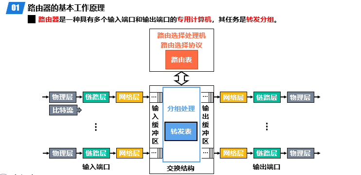


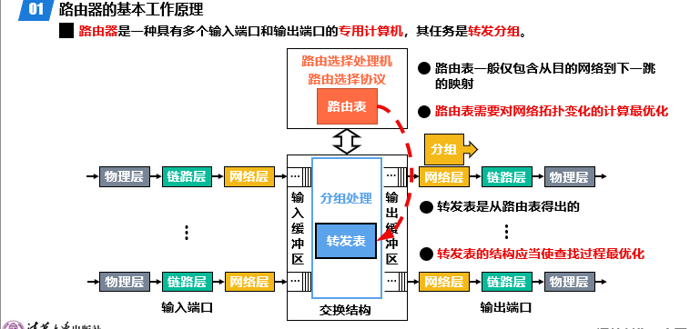

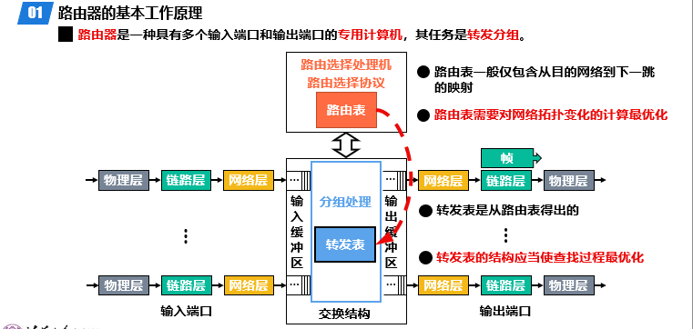

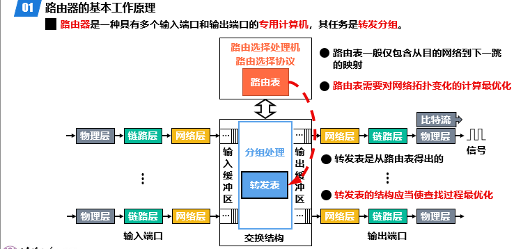


### [网际控制报文协议(ICMP)](https://zhuanlan.zhihu.com/p/369623317)

网际控制报文协议（ICMP，Internet Control Message Protocol）是一种网络协议，用于在IP网络中传递控制和错误报告信息。**ICMP在IP层（网络层）运行，主要用于发送和接收与网络状态和错误处理相关的消息。**它并不直接用于数据传输，而是帮助网络管理和故障排除。ICMP协议的类型被分为两大类：查询报文和差错报文。

差错报文类型会显示出不同的报错，通常有五中报错方式

- 终点不可达

  

- 源点抑制

  

- 超时

  

- 参数问题

  

- 重定向

  

在 ICMP 协议中，询问报文（主要指回显请求）用于网络测试和诊断。它是网络维护工具中重要的部分，通过检测网络设备的连通性和性能来帮助管理员识别和解决网络问题。

常用的命令语句有：

- ping：用于测试网络设备的连通性和测量延迟。
- tracert：用于追踪数据包从源设备到目标设备的路径，以及每跳的延迟。
- pathping：结合了 `ping` 和 `tracert` 的功能，用于分析数据包丢失和延迟，并提供详细的路径信息。
- mtr：是 `tracert` 和 `ping` 的结合，提供连续的实时路由和延迟信息。
- ping6：用于测试 IPv6 网络的连通性。
- ping -t：持续发送 ICMP 回显请求报文，直到手动停止（通过 `Ctrl+C`）
- ping -c：指定发送 ICMP 回显请求报文的次数。


### 虚拟专用网(VPN)

虚拟专用网（VPN）发明的目的是为了让不同的网络能够通过不安全的公共网络进行安全的通信。VPN利用公用的以太网作为通信载体，在以太网上构建一条加密的信息通道，从而保证数据传输的安全性。当然，这需要了解通信双方的IP地址，这类IP地址被称为专用地址。


在配置VPN时，发出方和接收方之间需要进行相应的配置，通常包括加密密钥和解密密钥。这些密钥用于加密和解密传输的数据，确保只有授权的用户能够访问通信内容。


通过在以太网上加密数据，VPN实现了安全通信。发送时，数据包首部会填写源地址和目的地址，然后传输加密后的内部IP数据报。这使得整个传输过程看起来就像是在本机构的专用网上进行一样，尽管实际使用的是公共网络。


### 网络地址转换(NAT)

网络地址转换（NAT）的目的是为了缓解IPv4地址空间的耗尽问题。NAT的主要功能是将内部网络的私有IP地址转换成公共IP地址，以便在外部网络上进行通信，同时也能将外部网络的访问IP地址转换成内部网络的IP地址，从而允许内部网络设备通过一个或少数几个公共IP地址访问互联网。这不仅节省了IP地址资源，还增强了网络的安全性。


转化常见流程：

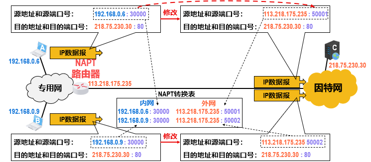

通过这种方式，NAT能够有效地将多个内部设备的私有IP地址映射到少数几个公共IP地址上，从而节省了IPv4地址空间，并且增加了内部网络的安全性。

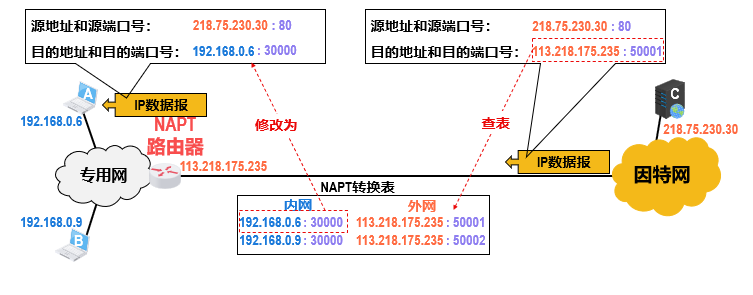

### [IP多播](https://www.cnblogs.com/iloverain/p/5502165.html)

IP多播，目的是实现一种一对多的通讯技术，与传统的一对一通讯，多播可以节省网络资源，在以太网上进行的多播，被称之为IP多播。


#### IP多播地址和多播组

IP多播通信必须依赖于IP多播地址。在IPv4中，IP多播地址属于D类IP地址，范围从224.0.0.0到239.255.255.255，分为三类：局部链接多播地址、预留多播地址和管理权限多播地址。

1. **局部链接多播地址**（224.0.0.0 - 224.0.0.255）：这些地址为路由协议和其他用途保留，路由器不转发属于此范围的IP包。
2. **预留多播地址**（224.0.1.0 - 238.255.255.255）：这些地址可用于全球范围（如Internet）或网络协议。
3. **管理权限多播地址**（239.0.0.0 - 239.255.255.255）：这些地址可供组织内部使用，类似于私有IP地址，不能用于Internet，以限制多播范围。

使用同一个IP多播地址接收多播数据包的所有主机构成一个主机组，也称为多播组。多播组的成员是动态的，主机可以随时加入或离开多播组，成员的数量和地理位置没有限制。一台主机也可以属于多个多播组。此外，不属于某一多播组的主机也可以向该多播组发送数据包。


可使用的多播地址如下：


#### 在局域网进行硬件多播

局域网（LAN）中的硬件多播（hardware multicast）是一种网络通信方式，允许数据包被发送到局域网中的多个设备，而不是单独发送到每个设备。这可以提高网络效率，尤其是在需要将相同数据发送给多个接收者的情况下。硬件多播通常依赖于网络交换机的支持。


### 因特网上进行IP多播的两种协议

> 这两个协议还是看书吧

#### IGMP协议

#### PIN协议

### [多播路由选择协议](https://cloud.tencent.com/developer/article/2203330)

> 这个也看不懂，保存存档留着做题

#### 反向路径多播(RPM)

#### 组共享树多播路由选择

### 因特网路由选择协议


### [移动IP技术](https://www.cnblogs.com/RunningSnails/p/17734260.html)


#### 移动IP技术的基本概念

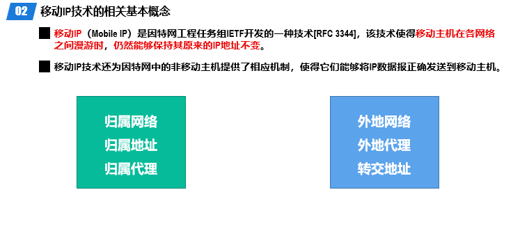


#### 代理发现和注册


#### 三角路由问题


### IPv6技术


> 没有看到过这类型的题目，这里留空

#### IPv6数据报


#### IPv6地址空间


#### IPv6地址分类


### [IPv4过渡IPv6](https://www.51cto.com/article/701505.html)

#### 双协议栈


#### 隧道技术


### [ICMPv6(网际控制报文协议)](https://wiki.mbalib.com/wiki/ICMPv6)

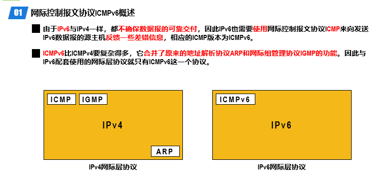

### 网络层的数据层面和控制层面


#### [OpenFlow协议](https://www.cnblogs.com/xinertel/p/16925101.html)


#### [SDN体系结构](https://cshihong.github.io/2018/04/16/SDN%E5%9F%BA%E6%9C%AC%E6%A6%82%E8%BF%B0/)


## 第五章 运输层

### 运输层概述

计算机网络的运输层（Transport Layer）是OSI模型和TCP/IP模型中的一个关键层次，负责在网络设备之间提供可靠的数据传输服务。以下是运输层的主要功能和特性概述：

> 主要功能

- **端到端连接管理**：运输层通过建立、维护和终止连接，确保数据从源主机传送到目标主机。
- **数据传输可靠性**：提供错误检测和纠正机制，确保数据在传输过程中不被篡改或丢失。
- **流量控制**：通过调节发送方和接收方的数据传输速率，防止网络拥塞。
- **分段和重组**：将大块数据分割成适合传输的小段，并在接收端重新组装。
- **端口管理**：通过使用端口号来区分不同应用程序的数据传输。

> 关键协议

- **传输控制协议（TCP）**：
  - **连接导向**：TCP是面向连接的协议，在数据传输前需要建立连接。
  - **可靠传输**：提供确认应答、重传机制、流量控制和拥塞控制，确保数据准确无误地传送。
  - **顺序传输**：保证数据包按顺序到达接收端。
- **用户数据报协议（UDP）**：
  - **无连接**：UDP是无连接的协议，不需要建立连接即可发送数据。
  - **不可靠传输**：不提供确认应答、重传和流量控制机制，适用于对速度要求高而对可靠性要求低的应用。
  - **低开销**：由于UDP不需要维持连接状态，开销较低，适用于实时应用如视频流、在线游戏等。

> 应用场景

- **TCP**：
  - 电子邮件（SMTP）
  - 文件传输（FTP）
  - 网页浏览（HTTP/HTTPS）
- **UDP**：
  - 实时视频和音频传输（VoIP, 视频会议）
  - 在线游戏
  - DNS查询

> 端口号

- **标准端口号**：运输层通过端口号区分不同的应用程序。常见端口号包括HTTP的80，HTTPS的443，FTP的21等。
- **动态端口号**：临时分配用于短暂连接的端口号。

#### 进程间基于网络的通讯

运输层通过端口号来识别和区分不同的应用程序。**每个端口号是一个唯一的标识符**，用于确保数据能够正确地传递到目标应用程序。这样，**运输层可以在同一台设备上管理多个应用的通信。**

每个端口号就像售货机上的一个按钮，不同的按钮对应不同的饮料。你按下特定的按钮（端口号），售货机就会提供相应的饮料（服务）。具体来说：

- **端口号**：类似于售货机上的按钮，每个按钮（端口号）对应一个特定的服务。
- **服务**：类似于饮料，每个服务（如HTTP、FTP等）都通过特定的端口号来提供。


在运输层中，有两个重要的协议TCP和UDP：

- **TCP**：可靠、面向连接、顺序传输，适用于需要数据完整性和顺序的应用。
- **UDP**：不可靠、无连接、低开销，适用于需要快速传输和实时性的应用。


每一个层中的主要协议如下


#### TCP和UDP简介


对于不同以太网应用的特点，使用 不同的运输层协议：


#### 运输层端口号PID

运输层端口号用于标识和区分计算机上运行的不同应用进程，因为不同操作系统（如Windows、Linux、macOS）使用不同格式的进程标识符。

为了实现跨操作系统的应用进程通信，TCP/IP体系结构的运输层采用统一的16位端口号（范围为0~65535）来标识应用进程


**数据在发送方通过TCP或UDP协议封装后由IP层传输**，并在接收方通过协议字段和端口号解封装和分发到相应应用程序的过程。


常见的网络协议以及他们的端口号如下


### 协议功能举例(DNS解析域名)

DNS服务器的主要作用是将域名解析为对应的IP地址。这使得用户可以通过易记的域名访问网站，而不需要记住复杂的IP地址。

Web服务器的作用是接收客户端请求并提供相应的内容和服务。


端口号在运输层中用于标识和管理网络通信中的应用程序和服务，确保数据能够准确地传输到预期的目标。


用户PC访问域名的过程如下：

- 从用户电脑发送DNS查询请求报文的目的是查找指定域名对应的IP地址。

  

- DNS接收到请求报文时，UDP首部中记录了源端口和目的端口号。源端口号表示发起请求的客户端端口，目的端口号通常是DNS服务器监听的端口（通常为53）。端口号帮助标识和处理网络通信中的请求和响应。

  

- 此时用户接收到了访问处的IP地址

  

- 用户向WEB服务器发送HTTP请求报文，请求获取首页内容。这里的首页内容指的是构成当前网页的HTML文件及其相关资源（如CSS、JavaScript、图片等）。

  

- 在收到请求报文之后，WEB服务器生成并发送响应报文，返回请求的首页内容。

  

- 用户的PC接收到WEB服务器返回的响应报文后，会根据响应报文中的IP地址和内容呈现出相应的网页内容。

  

- 通常，返回的内容就是请求的WEB网页，包括其HTML、CSS、JavaScript以及可能的图像和其他资源。

  

> TCP首部通过多个字段来管理和控制数据传输：
>
> 1. **源端口号和目标端口号**：标识数据发送和接收的应用程序，确保数据能够准确到达目标程序。
> 2. **序列号和确认号**：维护数据的顺序和完整性，确保数据的可靠传输。序列号用于标识发送的数据包顺序，确认号用于请求重传丢失或错误的数据包。
> 3. **窗口大小**：用于流量控制，调节数据传输速率，避免接收端缓冲区溢出。
> 4. **校验和**：检测数据在传输过程中是否发生错误，确保数据的完整性。
> 5. **标志位**：包括SYN、ACK、FIN等，用于实现连接的建立、确认和终止，支持连接管理。

### **UDP的特点**

1. **无连接**：
   - UDP 是一种无连接协议，通信双方在数据传输前无需建立连接。这种特性减少了开销，但也意味着它不提供连接的可靠性保证。
2. **不可靠性**：
   - UDP 不保证数据的可靠性和顺序性。它不使用 TCP 的确认和重传机制，因此无法确保数据的完整传输。
3. **轻量级**：
   - UDP 的头部较小，仅包含必要的字段，这减少了网络传输中的开销。
4. **广播和多播**：
   - UDP 支持广播和多播，允许一台主机向多个目标主机发送相同的数据。这使得它适用于需要同时向多个接收者发送数据的场景，如实时视频、音频等。
5. **实时性**：
   - 由于 UDP 的无连接性和低开销，它特别适合对实时性要求高的应用，如在线游戏和语音通信。

**应用场景**

根据 UDP 的特点，它在以下应用场景中表现优越：

1. **实时多媒体流**：
   - UDP 的低延迟使其适合实时多媒体流传输，如音频和视频流。即使数据包丢失，影响也相对较小，而实时性更为关键。
2. **在线游戏**：
   - 在线游戏通常需要低延迟和快速数据传输。UDP 的特性使其能够满足这些需求，尽管可能会有数据包丢失，但游戏可以容忍一定的丢包率。
3. **DNS（域名系统）**：
   - DNS 查询通常使用 UDP，因为查询过程涉及小量数据交换且通常能在查询失败时重新尝试。
4. **广播和多播应用**：
   - UDP 支持广播和多播，适用于需要同时向多个接收者传输数据的场景，如实时视频直播和在线会议。

**总结**

UDP 适用于对可靠性要求不高但对实时性要求高的应用。其轻量级和无连接性使其在某些场景下比 TCP 更为合适。但需要注意的是，使用 UDP 时，开发者需要自行处理数据丢失和重排序等问题。选择 UDP 时需综合考虑实时性和可靠性的需求，以确保协议符合应用程序的具体要求。

### UDP和TCP的对比

UDP（用户数据报协议，User Datagram Protocol）是一个简单的传输层协议，提供无连接的数据传输服务。它主要用于需要**快速传输且对数据丢失或错误容忍度较高的应用场景。**

TCP（传输控制协议，Transmission Control Protocol）是一个**面向连接的、可靠的传输层协议，用于在网络中提供可靠的数据传输服务。**它通过建立连接、确认数据和流量控制等机制，确保数据的准确传输和顺序。

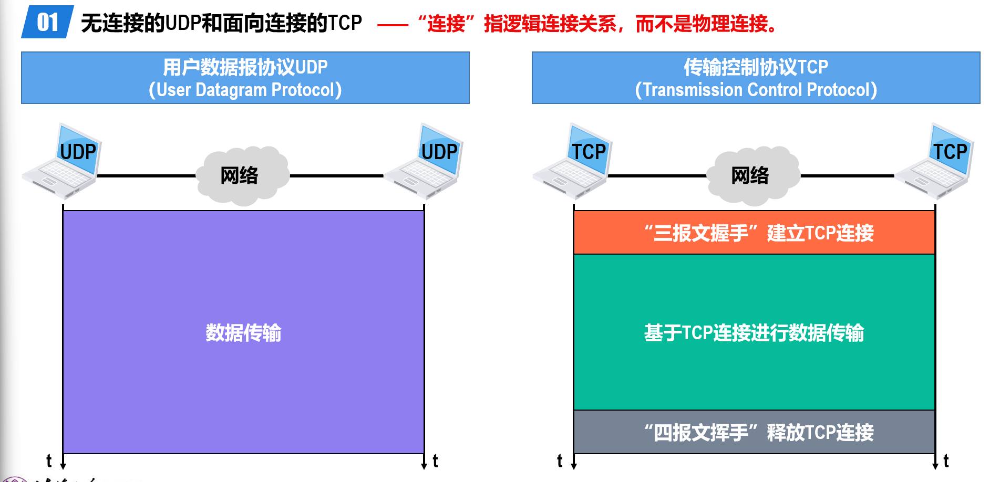

#### UDP和TCP的传输数据方式

UDP支持单播、多播和广播三种通信模式

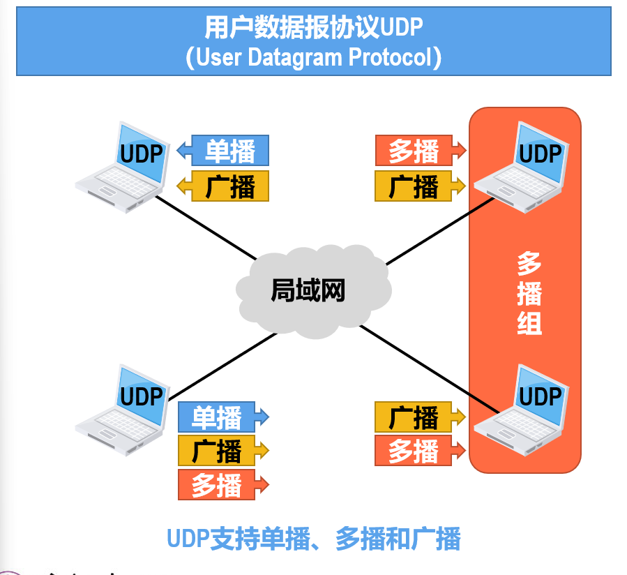

但是TCP只能接受单播的方式，这样更安全和更可靠。


#### UTP报文处理

发送方将应用数据与UDP首部组合在一起，形成UDP数据包，然后通过网络发送。UDP首部包含源端口号、目标端口号、数据长度和校验和等信息，用于数据的标识和传输控制。

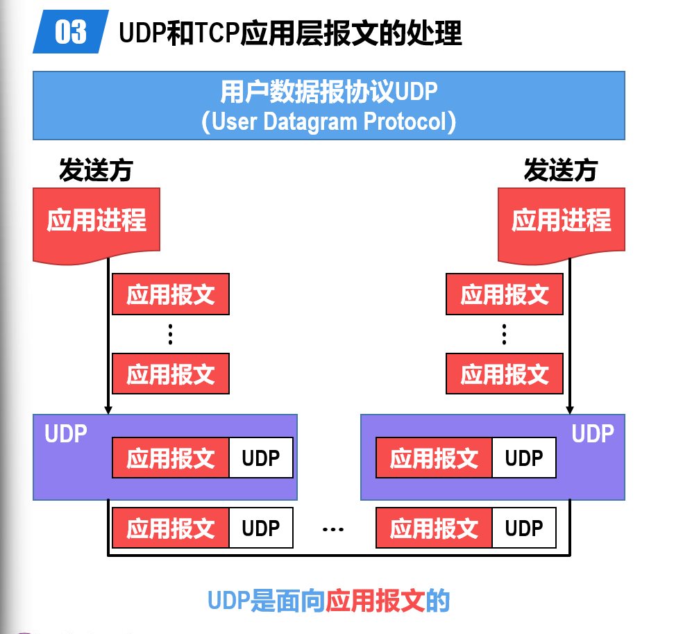

TCP是面向字节流的协议。应用进程发送的数据被视为一个连续的字节流，TCP在传输过程中将其分割成多个段，每个段都有TCP首部。接收方将这些段重组为完整的字节流，并交给应用进程。TCP提供可靠的数据传输，确保数据的顺序和完整性。


#### 传输可靠性

UDP本身不提供数据传输的可靠性保障，它不保证数据包的送达、顺序或完整性，也不进行重传、流量控制或拥塞控制。虽然UDP提供了基本的错误检测功能，但数据包的丢失、重复或乱序需要由应用程序自行处理，因此适合对传输速度要求高而对可靠性要求较低的场景。


TCP提供可靠的数据传输服务，通过建立连接、序列号、确认号、重传机制和流量控制等功能，确保数据的准确送达、顺序和完整性。它在传输过程中会重传丢失的数据包，调整发送速率以避免接收端溢出，并管理网络拥塞，确保数据流的稳定和可靠。


### TCP报文首部格式

**TCP首部包含以下字段：**

- **源端口号**：16位，标识发送方的应用端口。
- **目标端口号**：16位，标识接收方的应用端口。
- **序列号**：32位，用于标识数据流中的字节顺序。
- **确认号**：32位，用于确认接收到的数据。
- **数据偏移**：4位，指示TCP首部的长度。
- **保留位**：3位，保留为将来使用。
- **标志位**：9位，包括URG、ACK、PSH、RST、SYN、FIN等标志，用于控制连接状态和数据传输。
- **窗口大小**：16位，流量控制字段。
- **校验和**：16位，用于数据的错误检测。
- **紧急指针**：16位，指示紧急数据的结束位置（如有紧急数据）。
- **选项**：可变长度，提供额外控制信息。
- **填充**：可变长度，用于确保首部对齐。
- **数据**：实际传输的数据部分。


这里解释一下什么是端口号复用：

> **不同的IP地址**：同一个端口号可以在不同的IP地址上复用。例如，IP地址A的端口80和IP地址B的端口80可以同时使用，而不会发生冲突。这在服务器托管多个网站（虚拟主机）时很常见。
>
> **不同的传输协议**：同一个端口号可以在不同的传输协议（TCP和UDP）上复用。例如，TCP端口80和UDP端口80可以同时存在，因为TCP和UDP是独立的协议，互不干扰。
>
> **同一IP地址和端口号的多连接**：在同一IP地址和端口号的情况下，通过使用不同的源IP地址和源端口号，可以实现多连接复用。例如，多个客户端可以同时连接到同一个服务器的IP地址和端口号（如HTTP的TCP端口80），因为每个连接由（源IP地址, 源端口号, 目的IP地址, 目的端口号）这四个要素唯一标识。

### [TCP的运输连接管理](https://xiaolincoding.com/network/3_tcp/tcp_interview.html#%E4%BB%80%E4%B9%88%E6%98%AF-syn-%E6%94%BB%E5%87%BB-%E5%A6%82%E4%BD%95%E9%81%BF%E5%85%8D-syn-%E6%94%BB%E5%87%BB)

#### 三报文握手

TCP 是面向连接的协议，所以使用 TCP 前必须先建立连接，而**建立连接是通过三次握手来进行的**。三次握手的过程如下图：


- 一开始，客户端和服务端都处于 `CLOSE` 状态。先是服务端主动监听某个端口，处于 `LISTEN` 状态


- 客户端会随机初始化序号（`client_isn`），将此序号置于 TCP 首部的「序号」字段中，同时把 `SYN` 标志位置为 `1`，表示 `SYN` 报文。**接着把第一个 SYN 报文发送给服务端，表示向服务端发起连接**，该报文不包含应用层数据，之后客户端处于 `SYN-SENT` 状态。

  > SYN标识是同步标志位


- 服务端收到客户端的 `SYN` 报文后，首先**服务端也随机初始化自己的序号**（`server_isn`），将此序号填入 TCP 首部的「序号」字段中，其次把 TCP 首部的**「确认应答号」**字段填入 `client_isn + 1`, 接着把 `SYN` 和 `ACK` 标志位置为 `1`。最后把该报文发给客户端，该报文也不包含应用层数据，之后服务端处于 `SYN-RCVD` 状态。

  > ACK（Acknowledgement，确认）是一个标识位，用于确认接收到的数据包或控制信息。具体作用如下：


- 客户端收到服务端报文后，还要向服务端回应最后一个应答报文，首先该应答报文 TCP 首部 `ACK` 标志位置为 `1` ，其次「确认应答号」字段填入 `server_isn + 1` ，最后把报文发送给服务端，这次报文可以携带客户到服务端的数据，之后客户端处于 `ESTABLISHED` 状态。
- 服务端收到客户端的应答报文后，也进入 `ESTABLISHED` 状态。

从上面的过程可以发现**第三次握手是可以携带数据的，前两次握手是不可以携带数据的**，这也是面试常问的题。

一旦完成三次握手，双方都处于 `ESTABLISHED` 状态，此时连接就已建立完成，客户端和服务端就可以相互发送数据了。

(`ESTABLISHED` 是一种连接状态，表示一个TCP连接已经成功建立并处于活动状态，可以进行数据传输。)

> **举个例子演示TCP连接的过程：**
>
> **第一次握手（客户端向服务器发起连接请求）**：
>
> - **客户端**： “你好，我想要连接你。请告诉我你是否可以连接，以及你准备好了没有。”（发送一个带有SYN标志的请求）
>
> **第二次握手（服务器回应客户端的请求）**：
>
> - **服务器**： “你好，我收到你的请求了。是的，我可以与你建立连接。我已经准备好了，并且也告诉你我自己的序列号。”（发送一个带有SYN和ACK标志的响应）
>
> **第三次握手（客户端确认服务器的响应）**：
>
> - **客户端**： “谢谢你。我收到了你的确认，我也准备好了。”（发送一个带有ACK标志的确认消息）

----

为什么需要三次握手？

简单来说，三次握手的**首要原因是为了防止旧的重复连接初始化造成混乱。**

我们考虑一个场景，客户端先发送了 SYN（seq = 90）报文，然后**客户端宕机**了，而且这个 **SYN 报文还被网络阻塞**了，服务端并没有收到，接着**客户端重启后**，又**重新向服务端建立连接，发送了 SYN（seq = 100）报文**（*注意！不是重传 SYN，**重传的 SYN 的序列号是一样的***）。

看看三次握手是如何阻止历史连接的：


客户端连续发送多次 SYN（都是同一个四元组）建立连接的报文，在**网络拥堵**情况下：

- 一个「旧 SYN 报文」比「最新的 SYN」 报文早到达了服务端，**那么此时服务端就会回一个 `SYN + ACK` 报文给客户端，此报文中的确认号是 91（90+1）。**
- 客户端收到后，发现自己期望收到的确认号应该是 100 + 1，而不是 90 + 1，于是就会回 RST 报文。
- 服务端收到 RST 报文后，就会释放连接。
- 后续最新的 SYN 抵达了服务端后，客户端与服务端就可以正常的完成三次握手了。

上述中的「旧 SYN 报文」称为历史连接，TCP 使用三次握手建立连接的**最主要原因就是防止「历史连接」初始化了连接**。

----

**如果是两次握手连接，就无法阻止历史连接**，那为什么 TCP 两次握手为什么无法阻止历史连接呢？

我先直接说结论，主要是因为**在两次握手的情况下，服务端没有中间状态给客户端来阻止历史连接，导致服务端可能建立一个历史连接，造成资源浪费**。

你想想，在两次握手的情况下，服务端在收到 SYN 报文后，就进入 ESTABLISHED 状态，意味着这时可以给对方发送数据，但是客户端此时还没有进入 ESTABLISHED 状态，假设这次是历史连接，客户端判断到此次连接为历史连接，那么就会回 RST 报文来断开连接，而服务端在第一次握手的时候就进入 ESTABLISHED 状态，所以它可以发送数据的，但是它并不知道这个是历史连接，它只有在收到 RST 报文后，才会断开连接。


可以看到，如果采用两次握手建立 TCP 连接的场景下，服务端在向客户端发送数据前，并没有阻止掉历史连接，导致服务端建立了一个历史连接，又白白发送了数据，妥妥地浪费了服务端的资源。

因此，**要解决这种现象，最好就是在服务端发送数据前，也就是建立连接之前，要阻止掉历史连接，这样就不会造成资源浪费，而要实现这个功能，就需要三次握手**。

所以，**TCP 使用三次握手建立连接的最主要原因是防止「历史连接」初始化了连接。**

---

*同步双方初始序列号*

TCP 协议的通信双方， 都必须维护一个「序列号」， 序列号是可靠传输的一个关键因素，它的作用：

- 接收方可以去除重复的数据；
- 接收方可以根据数据包的序列号按序接收；
- 可以标识发送出去的数据包中， 哪些是已经被对方收到的（通过 ACK 报文中的序列号知道）；

可见，序列号在 TCP 连接中占据着非常重要的作用，所以当客户端发送携带「初始序列号」的 `SYN` 报文的时候，需要服务端回一个 `ACK` 应答报文，表示客户端的 SYN 报文已被服务端成功接收，那当服务端发送「初始序列号」给客户端的时候，依然也要得到客户端的应答回应，**这样一来一回，才能确保双方的初始序列号能被可靠的同步。**


四次握手其实也能够可靠的同步双方的初始化序号，但由于**第二步和第三步可以优化成一步**，所以就成了「三次握手」。

而两次握手只保证了一方的初始序列号能被对方成功接收，没办法保证双方的初始序列号都能被确认接收。

---

*避免资源浪费*

如果只有「两次握手」，当客户端发生的 `SYN` 报文在网络中阻塞，客户端没有接收到 `ACK` 报文，就会重新发送 `SYN` ，**由于没有第三次握手，服务端不清楚客户端是否收到了自己回复的 `ACK` 报文，所以服务端每收到一个 `SYN` 就只能先主动建立一个连接**，这会造成什么情况呢？

如果客户端发送的 `SYN` 报文在网络中阻塞了，重复发送多次 `SYN` 报文，那么服务端在收到请求后就会**建立多个冗余的无效链接，造成不必要的资源浪费。**


即两次握手会造成消息滞留情况下，服务端重复接受无用的连接请求 `SYN` 报文，而造成重复分配资源。

TCP 建立连接时，通过三次握手**能防止历史连接的建立，能减少双方不必要的资源开销，能帮助双方同步初始化序列号**。序列号能够保证数据包不重复、不丢弃和按序传输。

不使用「两次握手」和「四次握手」的原因：

- 「两次握手」：无法防止历史连接的建立，会造成双方资源的浪费，也无法可靠的同步双方序列号；
- 「四次握手」：三次握手就已经理论上最少可靠连接建立，所以不需要使用更多的通信次数

#### 四报文挥手

天下没有不散的宴席，对于 TCP 连接也是这样， TCP 断开连接是通过**四次挥手**方式。

双方都可以主动断开连接，断开连接后主机中的「资源」将被释放，四次挥手的过程如下图：


- 客户端打算关闭连接，此时会发送一个 TCP 首部 `FIN` 标志位被置为 `1` 的报文，也即 `FIN` 报文，之后**客户端进入 `FIN_WAIT_1` 状态。**

  > `FIN_WAIT_1` 主要作用是确保客户端（或服务端）在发送 `FIN` 报文后，能够正确地等待并接收对方的确认（`ACK`）。

- 服务端收到该报文后，就向客户端发送 `ACK` 应答报文，接着服务端进入 `CLOSE_WAIT` 状态。

- 客户端收到服务端的 `ACK` 应答报文后，之后进入 `FIN_WAIT_2` 状态。

  > `FIN_WAIT_2` 状态的主要作用是确保客户端（或服务端）在收到对方的 `ACK` 确认后，能够继续等待对方发送 `FIN` 报文，完成连接的另一半关闭。
  >
  > `FIN_WAIT_1` 状态转换到 `FIN_WAIT_2` 状态。此时，客户端已经完成了自己发起关闭的第一步，进入了等待对方关闭的阶段。

- 等待服务端处理完数据后，也向客户端发送 `FIN` 报文，之后服务端进入 `LAST_ACK` 状态。

- 客户端收到服务端的 `FIN` 报文后，回一个 `ACK` 应答报文，之后进入 `TIME_WAIT` 状态

- 服务端收到了 `ACK` 应答报文后，就进入了 `CLOSE` 状态，至此服务端已经完成连接的关闭。

- 客户端在经过 `2MSL` 一段时间后，自动进入 `CLOSE` 状态，至此客户端也完成连接的关闭。

每个方向都需要**一个 FIN 和一个 ACK**，因此通常被称为**四次挥手**。

这里一点需要注意是：**主动关闭连接的，才有 TIME_WAIT 状态。**

-----

**为什么需要四次挥手？**

在 TCP 连接关闭时，四次挥手过程确保了双方能够完整地完成数据传输并正确地关闭连接。下面是四次挥手的详细步骤及其原因：

1. **客户端发送 `FIN` 报文**：
   - 当客户端想要关闭连接时，它会发送一个 `FIN` 报文，表示客户端不再发送数据，但仍然可以接收来自服务端的数据。
2. **服务端回应 `ACK` 报文**：
   - 服务端收到客户端的 `FIN` 报文后，会发送一个 `ACK` 报文确认收到 `FIN`。此时，服务端仍然可以继续发送数据给客户端，客户端进入 `FIN_WAIT_2` 状态。
3. **服务端发送 `FIN` 报文**：
   - 在完成所有数据的发送和处理后，服务端会向客户端发送自己的 `FIN` 报文，表示服务端也准备关闭连接。客户端在收到服务端的 `FIN` 报文后，会回一个 `ACK` 报文确认收到 `FIN`。此时，客户端进入 `TIME_WAIT` 状态，等待可能出现的延迟的 `FIN` 报文。
4. **客户端回应 `ACK` 报文**：
   - 客户端收到服务端的 `FIN` 报文后，会发送一个 `ACK` 报文确认，服务端在收到这个 `ACK` 后，会进入 `CLOSED` 状态，连接完全关闭。

**总结：**

- **客户端发送 `FIN`**：表明客户端不再发送数据。
- **服务端回应 `ACK`**：确认客户端的 `FIN`。
- **服务端发送 `FIN`**：表示服务端也准备关闭连接。
- **客户端回应 `ACK`**：确认服务端的 `FIN`。

由于服务端可能需要时间来完成数据的发送和处理，服务端的 `ACK` 和 `FIN` 报文通常是分开发送的，因此需要四次挥手来确保双方都能正确关闭连接。

### TCP流量控制

> 保留标题

### TCP的拥塞控制

> 保留标题

### TCP的可靠传输实现

### TCP超时重传时间的选择

### TCP的选择确认

## 第六章 应用层

### 应用层概述

应用层的作用是处理应用的问题，它是网络协议栈的最顶层，直接与应用程序交互，为用户提供各种网络服务。应用层是建立计算机网络的最终目的。


应用层提供了一种将应用程序与网络之间的接口，使得应用程序可以通过网络传输数据。应用层协议包括HTTP、FTP、SMTP、DNS等，是计算机网络中最常用的协议之一。


### 提供网络服务方式


#### 客户-服务器方式(CS)

客户端/服务器架构，是一种网络架构模式，客户端向服务器发送请求，服务器处理请求并返回结果。这种架构分工明确，客户端负责用户交互和部分计算，服务器集中管理数据和业务逻辑，适用于Web浏览、电子邮件、文件传输等场景。尽管具有分工明确和集中管理的优点，但也面临服务器负载和单点故障的问题。


#### 对等方式(P2P)

计算机网络中的 P2P（Peer-to-Peer）是一种网络架构，允许计算机直接互联并共享资源，而无需依赖中央服务器。每个节点既是客户端又是服务器，能够直接进行数据交换和服务提供，从而提高网络的效率和可靠性。


### [动态主机协议(DHCP)](https://juejin.cn/post/7290847835368898616)

#### DHCP简述

DHCP于1993年10月成为标准协议，其前身是BOOTP协议。DHCP协议由RFC 2131定义，采用客户端/服务器通信模式。客户端（DHCP Client）向服务器（DHCP Server）提出配置申请，DHCP Server为网络上的每个设备动态分配IP地址、子网掩码、默认网关地址、域名服务器（DNS）地址及其他相关配置参数，使设备能够与其他IP网络通信。

DHCP的主要功能是，在IP网络中，每个连接到Internet的设备都需要分配一个唯一的IP地址。DHCP使网络管理员能够从中心节点监控和分配IP地址。当某台计算机移到网络中的其它位置时，它能自动收到新的IP地址。DHCP的自动化IP地址分配不仅减少了配置和部署设备的时间，还降低了配置错误的可能性。此外，DHCP服务器可以管理多个网段的配置信息，当某个网段的配置发生变化时，管理员只需更新DHCP服务器上的相关配置即可，实现了集中化管理。

#### DHCP使用目的

在IP网络中，每个连接到Internet的设备都需要分配一个唯一的IP地址。DHCP（动态主机配置协议）使网络管理员能够从中心节点监控和分配IP地址。当某台计算机移到网络中的其他位置时，它能自动收到新的IP地址。DHCP实现的自动化IP地址分配不仅减少了配置和部署设备的时间，同时也降低了发生配置错误的可能性。此外，DHCP服务器可以管理多个网段的配置信息，当某个网段的配置发生变化时，管理员只需更新DHCP服务器上的相关配置即可，实现集中化管理。

1. **准确的IP配置**： IP地址配置参数必须准确，手动输入“192.168.XXX.XXX”之类的地址时很容易出错。此外，打印错误通常难以解决，使用DHCP服务器可以最大程度地降低这种风险，确保IP地址配置的准确性。

2. **减少IP地址冲突**： 每个连接的设备都必须有一个唯一的IP地址，但每个地址只能使用一次。重复的地址将导致设备无法连接。当手动分配地址时，特别是在存在大量仅定期连接的端点（如移动设备）时，可能会发生这种情况。DHCP的使用确保每个地址仅被使用一次，减少了冲突的发生。

   

3. **IP地址管理的自动化**： 没有DHCP时，网络管理员需要手动分配和撤销地址，跟踪哪个设备具有什么地址可能是徒劳的，因为几乎无法预测设备何时需要访问网络以及何时离开网络。DHCP允许自动化和集中化管理，使网络管理员可以从一个位置管理所有设备的IP地址分配。

4. **高效的变更管理**： DHCP的使用使更改地址、范围或端点变得非常简单。例如，组织可能希望将其IP地址范围从一个段更改为另一个段。只需在DHCP服务器上配置新的信息，这些信息将自动传播到所有终端设备。同样，如果升级并更换了网络设备，也无需手动进行网络配置。

   

总体来说，DHCP带来了显著的优势，包括减少配置和部署时间、降低配置错误的可能性、实现集中化管理和自动化IP地址分配、有效防止IP地址冲突以及提高网络管理效率和灵活性。这些优势使DHCP成为现代网络管理中不可或缺的工具。

#### DHCP工作过程

下面用一个用户从两个不同的DHCP服务器获取IP地址的例子，来查看DHCP的工作流程

- DHCP客户机，首先向DHCP服务器发送一个指令DISCOVER，这个消息的目的是在网络中广播一个请求，寻找可用的DHCP服务器。

  

- 在DHCP服务器接受到这个信息的时候，会返回客户机自身的IP地址，也就是指令OFFER表示服务器愿意为客户机提供一个IP地址及其他网络配置参数。

  

- 客户机会发送回DHCP服务器，指令为REQUEST，当客户机收到一个或多个DHCP服务器的Offer消息后，它会从中选择一个最合适的（通常是第一个收到的）并向该DHCP服务器发送一个DHCP Request消息。这个消息表示客户机正式请求使用服务器提供的IP地址和其他配置参数。

  

- DHCP发送ACK回到客户机，通过ACK消息，DHCP服务器正式确认了IP地址的分配，并向客户机提供了所有必要的网络配置参数，使客户机能够正确配置并使用网络资源。ACK消息的发送和接收标志着整个DHCP租约过程的成功完成，确保客户机能够在网络中正常通信。

  

- 到这一步就连接成功了，之后就是续租的问题了。上述的步骤

  

- 具体的流程如下

  

----

如果直接通过路由器和DHCP服务器申请IP数据，是无法获取到IP的


这个时候需要在路由器上配置DHCP中继代理


### 域名系统(DNS)

#### 域名系统的作用

**域名解析**：DNS 将用户输入的域名转换为对应的 IP 地址，使浏览器或其他网络应用能够找到并访问相应的服务器。

**提供名称服务**：DNS 提供了一种分布式的命名服务，使得域名系统可以在全球范围内有效管理和查询域名信息。

**支持子域名**：DNS 支持域名的层次结构，可以管理主域名及其子域名，提供更灵活的域名管理方案。

**负载均衡**：通过 DNS，流量可以根据配置分配到不同的服务器上，从而实现负载均衡，提高网站或服务的性能和可用性。

**提供额外信息**：DNS 还可以存储和提供其他类型的信息，如邮件交换服务器（MX记录）、安全密钥（DNSSEC）、和服务器位置等。


#### 域名结构

在运输层中，补充说明过域名解析DNS的具体操作，域名简单来说就是和IP地址进行一个映射的操作，这样子我们就不用记住那么长的IP地址了


其他级的域名都由顶级域名派生而来，举个例子。wniee.cn这是一个顶级域名，我们可以在这个域名上进行添加wni.wniee.cn这样就是一个二级域名。


#### 域名服务器

> 发现下面的PPT已经说的很完备了，现在确实没有补充的必要。


#### 域名解析过程


### 文件传输协议(FTP)

#### FTP的作用


#### FTP的基本工作原理


### 电子邮件(SMTP)

#### 电子邮件作用


#### SMTP的工作流程


#### 电子邮件的信息格式


#### 邮件拓展


#### 读取协议


#### 万维网的电子邮件


### 万维网

#### 万维网概述

万维网（World Wide Web，简称 WWW）是一个全球性的互联网信息系统，它通过超文本链接（Hypertext Links）将各种信息资源连接在一起，使得用户可以通过浏览器访问和查看这些资源。万维网的主要特点和功能包括：

1. **超文本系统**：万维网利用超文本链接将不同的网页和资源相互连接，使用户可以轻松地从一个页面跳转到另一个页面。
2. **网页和网站**：万维网由大量的网页和网站组成，每个网页包含文本、图像、视频和其他多媒体内容，通过统一资源定位符（URL）进行访问。
3. **HTTP 协议**：万维网使用超文本传输协议（HTTP）进行数据传输，这是一种标准的网络协议，用于在客户端（如浏览器）和服务器之间传输网页数据。
4. **浏览器访问**：用户通过网页浏览器（如 Chrome、Firefox、Safari）访问和浏览万维网上的资源。浏览器负责解释网页代码（通常是 HTML）并呈现内容。
5. **分布式和开放**：万维网是一个分布式的系统，不依赖于单一的中央服务器，任何人都可以创建和发布内容，只要有适当的技术和工具。

万维网的诞生和发展极大地改变了信息的获取和传播方式，推动了互联网的发展和普及。需要注意的是，万维网是互联网的一部分，而互联网还包括其他服务，如电子邮件、文件传输和即时通讯等。


#### 统一资源定位符


#### 万维网文档


就是前端语言


#### 超文本传输协议


#### Cookie


#### 万维网缓存和代理服务器


## 网络安全

### 网络安全概述

网络安全总体分为三类：

- 安全威胁
- 安全服务
- 安全机制

#### 安全威胁


#### 安全服务


### 密码学相关概念

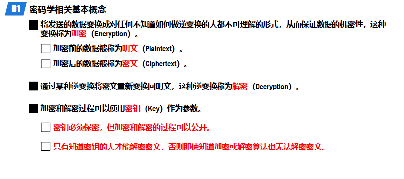


#### 对称密钥密码体系


##### 数据加密标准DES


##### 三重DES


> 多重哈希hh


##### 高级加密标准AES


#### 公钥密码体系


##### RSA算法


### 报文摘要和报文鉴别码


#### 密码散列函数


#### 报文摘要算法


#### 散列报文鉴别码(HMAC)


### 数字签名


#### 公钥密码算法


### 实体鉴别


### 密钥分发


#### 对称密钥分发


#### 公钥分发


### 访问控制

#### 访问控制的基本概念


##### 访问监控器


#### 访问控制策略


### 网络体系结构各层采取的安全策略

#### 物理层安全实例


#### 数据链路层安全实例


#### 网络层安全实例


安全关联


#### 运输层安全实例


#### 应用层安全实例

### 防火墙访问控制和入侵检测系统

#### 防火墙


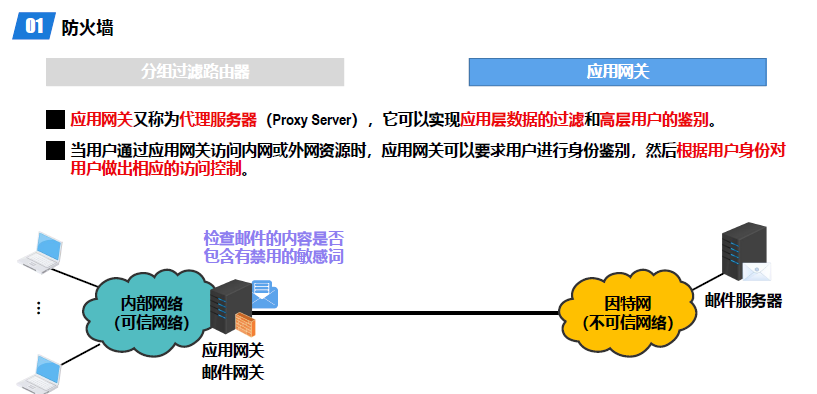

#### 入侵检测系统


#### 常见网络攻击和防范

##### 网络扫描


##### 网络监听


##### 拒绝服务攻击


> 网络安全这一部分还需要修改，大概的内容都写完了。暂时结束吧。
>
> ^ ^
