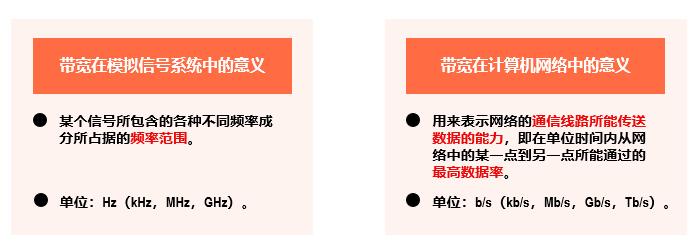
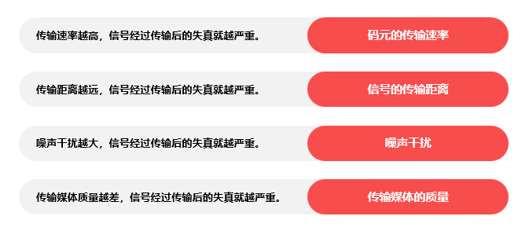
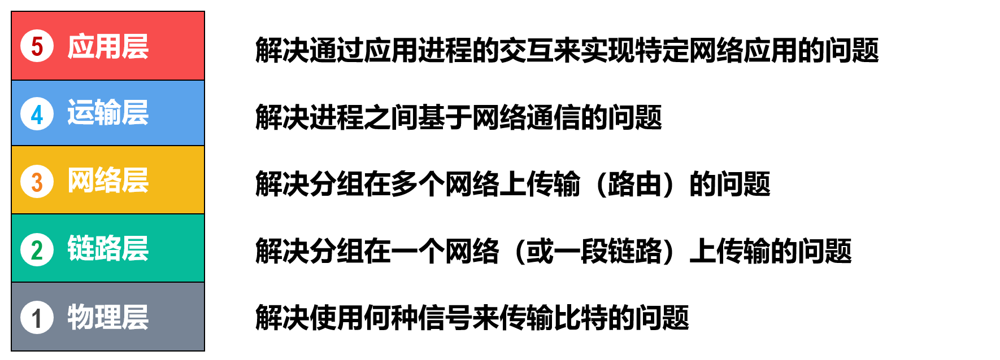

# 计算机网络

> 记录学习计算机网络的知识点，参考书和参考课程来自于慕课
>
> 协议教程： <https://getiot.tech/zh/protocol/>
>
> Cloudflare: <https://www.cloudflare.com/zh-cn/learning/>

## 第一章 概述

互联网是20世纪末期形成的一个全球性计算机网络系统，连接了成千上万的私人、学术、企业和政府网络。这些网络通过一系列标准的网络协议相互连接，使用电子、无线和光纤技术等多种手段实现数据传输。

在计算机网络中，`internet` 和 `Internet` 有不同的含义。`internet` 指的是一般的计算机网络，**而 `Internet` 特指按照 `TCP/IP` 协议连接的全球最大网络系统。**

在大多数情况下，我们讨论的就是 `Internet`，它也可以视为一个虚拟的“云”网络，用于理解和学习计算机网络的基本概念。


`ISP`：的全称是`Internet Service Provider`，因特网服务提供者。国内主要由三个通讯公司提供


从第一层提供给大公司的情况像是阿里云，公司贩卖域名和ip给与用户，但是它不是ISP。


因特网的草案是面向公众的


管理结构：[ISOC](https://en.wikipedia.org/wiki/Internet_Society)是非营利性倡导组织


组成部分：由网络和网络接入设备构成。网络可以抽象为云来了解。


### 信息交换分类

#### 电路交换

[电路交换](https://www.cnblogs.com/penghuwan/p/7686059.html)是与报文交换（或称分组交换）相对的概念。在电路交换中，通信双方必须**首先建立一个专用的连接通道。**只有在连接成功建立后，双方才能开始通信。在整个通信过程中，这个连接将始终保持开放，且占用分配的资源（如通道、带宽、时隙等），直到通信结束。电路交换的本质特征在于，它在整个通信活动中独占了资源，这与报文交换中按需分配资源的方式明显不同。

> 电路交换中最重要的是电话交换机，**电话交换机起到联通不同电话交换机的作用**，最终链接到指定的电话机中。
>
> 具体操作简化：用户线发送信息 - 交换机接受信息通过中继线链接另一个交换机直到最后一个交换机-链接指定用户中
>
> 电路交换中的通讯路线仅仅只有一条，结束通话也就意味着这条通讯需要被拆除。电路通讯需要费有限的通讯资源。


> 电路交换的步骤是：`建立链接 -> 通话-> 释放链接`。

**建立电路**

A和B要进行通信，首先A先发出呼叫请求信号，然后经由上述一系列的交换机，接通这条物理链路，再由B发出应答信号给A，这样，通信线路就接通了。从这开始，才允许进行数据传输

**数据传输**

建立电路阶段完成后，便进入了数据传输阶段。这时候：

- A可以向B发送数据，B也可以向A发送数据，实现[双工通信](https://www.cnblogs.com/kungfupanda/archive/2009/12/22/1629972.html)
- 在AB通信期间，**该条链路被AB所占有，任意部分的链路资源不能被其他终端所使用**

**拆除电路**

数据传输结束后，拆除电路。这时候，**AB之间的链路资源被重新分配了，不再被AB独占，可以被其他的终端建立的链路所使用**


**总结：电路交换就是拉了一根线，双方用户通过这个线来实现通讯**。


> 可以把电路交换，理解为打电话，是实时传输的一个典型。

#### 报文交换

**报文交换**，又称存储转发交换，是数据交换的三种方式之一，报文整个地发送，一次一跳。报文交换是分组交换的前身，是由莱昂纳多·克莱洛克于1961年提出的。报文交换的主要特点是:

- **存储接受到的报文**，判断其目标地址以**选择路由**，最后，在下一跳**路由空闲时**，将数据**转发**给下一跳路由。报文交换系统现今都由分组交换或电路交换网络所承载。
- 每一条**报文都作为互不相干的实体**进行处理。每一条报文都包含**地址信息**，一次交换后，报文中的信息**会被读取**并且下一次交换的**传输路径**将被**确定**。
- 根据网络状况，通信选择的**传输路径也会不同**。每一条报文都会在下一次交换前被存储(在硬盘上存储时，会受到RAM的限制)。


> **这样做的坏处是增加了资源损耗，耗费较大的存储资源。一旦转发的报文出现错误就需要重新上传一整份大的文件。**

报文的传送过程依赖于 “存储转发机制”， 从发送端开始，每经过一个交换机，该**交换机**的任务是：

- 接收完整的报文，然后对报文进行缓存，此即为“存储”

- 等到下一个交换机节点空闲的时候，再将该报文发送给下一个交换机，此即为“转发”

**接收端**会将各份报文按照原来的顺序组合，从而得到完整的数据


> 可以把报文传输理解为发邮件，这个并不是实时传输

#### 分组交换

在计算机网络和通信中，[分组交换](https://zh.wikipedia.org/wiki/%E5%88%86%E7%BB%84%E4%BA%A4%E6%8D%A2)是一种相对于电路交换的通信范例，分组(又称消息、或消息碎片)在节点间单独路由，**不需要在传输前先建立通信路径。(有别于电路交换)**

分组交换技术是在1960年代末出现的，当时美国高级研究计划局(简称ARPA)为实现远程计算机之间的信息交换，资助建设一个试验性的网络，该网络被称为ARPANET(阿帕网)。阿帕网的主要研究成果之一就是开发一种新的网络协议，在**阿帕网上对话必须使用这种网络协议**。**该协议**采用一种新的网络信息传输技术，这就是分组交换技术。

> 阿帕网上运行的是NCP协议，之后会被TCP/IP协议给替代


分组交换是在报文交换的基础上实现的。**分组交换其实就是把报文（Message）划分成更小的传输单元——分组（Packet）**。除此之外，并无太大差异。或者可以说：**报文交换和分组交换的差异就仅仅是数据单元的大小不同罢了**


相比于普通的报文交换，分组交换的[优势](https://www.cnblogs.com/penghuwan/p/7686059.html)是

- 基于**存储转发机制**，报文交换对交换机的存储容量的要求是很高的，而分组交换**所要求的存储容量很小**（因为单个分组比单个报文小很多）
- 包含**较短信息的分组**在节点间**传输速率高**
- 分组小，在传输的时候**出错的概率小**，**出现差错时，只需重发一个分组**，而无需重发整个报文，所以能够提高传输效率


缺点是：

- 分组首部带来了额外的**传输开销**。交换节点存储转发分组会**造成一定的时延**。

- 无法确保通信时**端到端通信资源全部可用**，在通信量较大时可能造成网络拥塞。

  > 通信资源：带宽、低延迟和无中断

- 分组可能会出现**失序和丢失**等问题，这些其实是由通信资源导致的原因。
  


**总结：**

- 传输大量数据使用电路交换，例如语言和视频通话
- 不要求实时文件传输使用报文交换，例如邮件
- 需要动态生成的数据时使用分组交换，例如网页，在线游戏。常常说的丢包就是分组交换中失去了一部分分组。


> 发展时间：电路交换 - > 报文交换 -> 分组交换

### 计算机网络的分类

**计算机网络的定义：计算机网络是由一些通用的、可编程的硬件互联而成的。**计算机网路的基本构成是由通信子网和资源子网构成的。


网络的分类分为五类：交换方式，使用者，传输介质，覆盖范围，拓扑结构


由不同的工作方式，分割成公用网和专用网络。


#### 传输介质

按照传播方式的不同，可以把[传播介质](https://bbs.huaweicloud.com/blogs/387210)分为两种：

- 导向性传输媒体
- 非导向性传输媒体

##### 导向性传输媒体

- 双绞线

  优缺点：成本低；密度高、节省空间；安装容易；高速率；抗干扰性一般；连接距离较短。


- 同轴电缆
  
  优缺点：抗干扰性好；接入复杂。以前的电视就是用这种传输媒体。


- 光缆
  
  优缺点：通信容量大；传输损耗小；抗干扰性好；保密性好；体积小重量轻；需要专用设备连接。但是容易损坏。


##### 非导向性传输媒体

- 短波通信(**短波波段的电磁波**除了能够利用地波传播外，还可通过**电离层的反射**进行远距离传输)
  
  优缺点：通信质量较差；速率低；


- 微波通信：又分地面微波接力通信和卫星通信

> 将信号以频率在0.3 GHz 至300GHz的微波作为载体传输。部分被称作毫米波的微波辐射非常容易被大气层(特别是潮湿的天气)衰减。
>
> 小时候用的卫星电视就是这种通讯方式(●'◡'●)

A．地面微波接力通信
优缺点：信道容量大；传输质量高；投资少；相邻站点间直视；易受天气影响；保密性差。

> 保密性差，例如卫星电视可以收到国外的电视节目

B．卫星通信
优缺点：通信距离远；通信容量大；传播时延大`270ms`。


#### [不同网络的介绍](https://www.cloudflare.com/zh-cn/learning/)


##### PNA(个域网)

**个人区域网（PAN）用于连接用户直接区域内的电子设备**，其覆盖范围从几厘米到几米不等。常见的 PAN 示例包括蓝牙耳机与智能手机之间的连接。此外，PAN 还可以连接笔记本电脑、平板电脑、打印机、键盘等设备。

PAN 连接可以通过有线或无线方式实现。有线连接方式包括 USB 和 FireWire；无线连接方式包括蓝牙（最常见）、Wi-Fi、IrDA 和 Zigbee。

通常，个人区域网不会直接连接到互联网，也就是说，它们通常不通过路由器进行连接。

##### LAN(局域网)

局域网（LAN）是指在小范围内，**如同一建筑物内，连接多个设备的网络。**家庭 Wi-Fi 网络和小型商业网络是局域网的常见例子。尽管局域网的规模可以很大，但如果覆盖多个建筑物，它们通常被归类为广域网（WAN）或城域网（MAN）。

大多数局域网通过一个中心设备（如路由器）连接到互联网。家庭 LAN 通常使用单个路由器，而较大的局域网可能还会使用网络交换机，以提高数据传输效率。

局域网通常使用以太网、Wi-Fi 或两者结合的方式来连接设备。以太网通过电缆实现物理连接，而 Wi-Fi 通过无线电波进行连接。

各种设备，如服务器、台式计算机、笔记本电脑、打印机、物联网设备以及游戏机，都可以连接到局域网。在办公室环境中，局域网常用于内部共享打印机和服务器资源。

##### MAN(城域网)

城域网（MAN）是用于连接一个**城市、大型城镇或包含多个建筑物的大区域内的计算机网络**。它的规模介于局域网（LAN）和广域网（WAN）之间。城域网的“都市”指的是网络的规模，而不是服务区域的人口。

城域网由多个局域网通过高速连接组成，与广域网类似。然而，由于城域网的覆盖范围较小，它们通常比广域网更高效，因为数据传输距离较短。城域网通常由多个组织共同使用，而不是由单一组织管理。

大多数城域网通过光缆连接局域网，通常使用“暗光纤”，即之前未使用的光纤电缆，这些光纤可以通过私营互联网服务提供商（ISP）租用。在某些情况下，市政府可能建立和维护城市光纤网络，并将这些光纤出租给私营公司。

> 校园网 (CAN) 是连接学校或企业园区内多个建筑物的大型网络。校园网也可以被视为城域网，因为它们连接多个局域网，但不够大，不能被视为广域网。

##### WAN(广域网)

广域网（WAN）是一种**大型计算机网络**，**用于远距离连接不同的计算机组**。大型企业通常使用 WAN 连接其各个办公网络，每个办事处通常拥有自己的局域网（LAN），这些 LAN 通过 WAN 相互连接。WAN 连接可以通过专线、虚拟私人网络（VPN）或 IP 隧道等方式实现。

广域网的定义较为宽泛，从技术上讲，任何覆盖广阔地理区域的大型网络都可以被称为 WAN。互联网本身也是一个典型的广域网（WAN）。

> 对于这些网络的定义，其实是按照他们覆盖范围的大小确定的
>
> 这里是按照从小到大进行介绍

#### 拓扑结构

总线型拓扑结构是一种早期的网络拓扑结构，已经被淘汰。如今用的是通过以太网交换机互联。


星型拓扑是一种网络拓扑结构，其中所有网络设备都通过独立的连接线直接连接到一个中心节点或集线器（Hub）上。这个中心节点在网络中起到一个集中的通信和管理角色。


网状型拓扑（Mesh Topology）是一种网络拓扑结构，其中每个网络设备都直接连接到网络中的其他设备。网状型拓扑有完全网状（Full Mesh）和部分网状（Partial Mesh）两种类型。


### 计算机网络[性能指标](https://zh.wikipedia.org/wiki/%E7%BD%91%E7%BB%9C%E6%80%A7%E8%83%BD)


- 带宽是可以**传输信息的最大速率**，通常以比特/秒为单位
- 吞吐量是**信息传输的实际速率**
- 延迟是发送外和接收处之间的延迟，这主要是信号传播时间，以及信息经过所有节点需要的外理时间
- 抖动是**接收处延迟的变化**
- 误码率是将发送位**总数除以损坏位数得到的百分比**

#### 数据传输速率

速率指的是**数据传送的速率**，也称之为比特率（bit rate）。比特（bit）是计算机中数据量的基本单位，一个比特就是二进制数字中的一个 1 或 0。**速率的单位是 `bit/s`，或`kbit/s，Mbit/s，Gbit/s，Tbit/s，Pbit/s，Ebit/s，Zbit/s，Ybit/s`等**。`(k=103，M=106，G=109，T=1012，P=1015，E=1018，Z=1021，Y=1024)`

> 其中上述单位可以由这种方式记忆，`kbit/s，Mbit/s，Gbit/s，Tbit/s`以此类推
>
> 
>
> 

计算机网络中**速率是以10的倍数**为转换单位，速率往往是指**额定速率或标称速率**。


下述计算一个单位是兆字节，一个单位是兆比特。所以说要通过转换单位来计算


##### 带宽

带宽（bandwidth），也称为频宽，指的是在固定时间内可以传输的数据量，即传输管道的数据传输能力。在数字设备中，**带宽通常以比特每秒（bps）表示**，即每秒钟可以传输多少比特。对于**模拟设备**，**带宽则以赫兹（Hz）或每秒传送周期来表示**。

> 赫兹（Hz）在物理上表示振动频率，即每秒内发生的周期性振动或波动的次数。在电信号中，**频率同样表示信号每秒变化的次数**。带宽在这里可以理解为频率变化范围，反映了信道每秒能传输的数据量。**频率越高，信号变化越快，带宽越大**，单位时间内能传输的数据量也就越多

简单来说，可以将**带宽比作水管**，数据传输速度比作水流。水管越粗，能够承载的水流量越大，传输速度也越快。同样地，**带宽越大，单位时间内可以传输的数据量也越多**，从而支持更多的用户同时访问。相反，带宽较小时，数据传输速度较慢，支持的用户访问量也会减少

日常生活中的百兆宽带的意思是：每秒传输 `100Mbps` 的速率。百兆宽带的实际速度为 `100Mbps÷8=12.5MB/s`



##### 吞吐量

吞吐量：在如以太网及数据包无线电之类的电信网络之中，吞吐量或网络吞吐量是指于**一通信通道上单位时间能成功传递的平均资料量**，资料可以于实体或逻辑链接上传递，或通过某个网络节点。吞吐量的单位通常表示为比特每秒(bit/s或bps)。


**系统吞吐量**或**汇集吞吐量**是指于一网络内单位时间所有终端传递的资料量的总和。吞吐量可以用**等候理论**作数学上的分析。其中，**单位时间的数据包负戴标示为到达率入**，而**单位时间的数据包吞吐量则标示为离开率u**。吞吐量实质上同义于**带宽。**


##### [时间延迟](https://www.cnblogs.com/abeelan/p/17233291.html#例题一)

在计算机网络的分组交换中，数据分组从源主机经过一系列路由器传输，最终到达目的地主机。在这个过程中，分组在每个经过的节点（主机或路由器）上会遭遇多种时延类型。每种时延都对数据传输的总时延产生影响，包括：

- **发送时延**：主机或路由器发送数据帧所需的时间。从数据帧的第一个比特开始，到最后一个比特发送完毕为止的时间。公式为 ：
  $$
  发送时延=
  数据帧大小(bit)/链路带宽(bit/s)
  $$
  
- **传播时延**：电磁波在**信道中传播**一定的距离而需要**花费的时间**。
  $$
  传播时延 = 传播距离(m)/信号传播速度(m/s)
  $$

> 电磁波在信道中传播一定距离所需的时间。传播时延与通信介质有关，**不同介质对电磁波的传播速率不同。**常见的传播速率如下：
>
> - 自由空间： 3.0×10^5 km/s (光速)
> - 铜线： 2.3×10^5 km/s 
> - 光纤： 2.0×10^5 km/s

- 处理时延：交换结点为存储转发而进行一些必要的处理所花费的时间。
- 排队时延：结点缓存队列中分组排队所经历的时延。排队时延的长短往往**取决于网络中当时的通信量。**
- 总时延 = 发送时延+传播时延+处理时延+排队时延。

公式如下：
$$
\left\{
\begin{array}{l}
d_t = \frac{L}{R} & \quad \text{其中 } L \text{ 是分组长度，单位：bit},
 & R & \text{ 是链路带宽，单位：bit/s}. \\
d_p = \frac{D}{V} & \quad \text{其中 } D  \text{ 是物理链路长度，单位：m},
& V & \text{ 是信号传播速度，单位：m/s}. \\
G = d_p \times R & \quad \text{时延带宽积的单位：bit}.
\end{array}
\right.
$$


##### 宽带时延乘积

`BDP`是网络的**带宽**（`bit/s`）与**端到端延迟**（`s`）的乘积，结果以**比特或字节表示**。用于衡量在理想状态下，整条链路上能容纳的最大数据量（比特或字节）。


时延带宽积：表示链路可以容纳多少个比特。又称为**以比特为单位的链路长度**。


$$
时延带宽积=带宽(b/s)×传播时延(s)
$$

#### **网络往返时间**

往返时间 (RTT) 是**网络请求从起点到目的地然后再回到起点所花费的时长**（以**毫秒**为单位）。RTT 是确定本地网络或较大 Internet 上连接的运行状况的重要指标，并且网络管理员通常使用 RTT 来诊断网络连接的速度和可靠性。


RTT的计算涉及网络层和传输层的功能。如果使用的是`ICMP`协议，过程如下：

- **网络层**：ICMP协议在网络层工作。`ping`命令使用ICMP协议向目标地址发送ICMP Echo请求数据包，然后等待目标地址返回ICMP Echo应答数据包。
- **RTT计算**：当发送和接收数据包时，记录下发送时间和接收时间。通过计算这两个时间的差值，得到RTT。


`Ping`实用程序几乎在所有计算机上可用，这是一种估计往返时间的方法。下面是几个 `Ping BLBL` 的示例，底部都计算了往返时间。


在题目中，计算传播延迟是用`传播的距离/传播载体的传输速率`的传输速率
$$
\text{往返传播延迟} = \frac{\text{距离} (km)}{\text{传播速率} (m/s)}*2
$$

##### 链路利用率

链路利用率是指网络链路在一定时间内被利用的程度。它通常用百分比表示，计算公式如下：

$$
链路利用率 = (链路被利用的时间 / 总时间) × 100\%
$$
其中，链路被利用的时间是指**链路在某个时间段内进行数据传输的时间**，总时间是指这**个时间段的总时长**。


##### 网络利用率

指网络有**百分之几的时间**被利用（有数据通过）。


##### 网络丢包率

$$
丢包率 = 丢失分组数量/总分组数量
$$


丢失分组的情况：


### [计算机网络体系结构](https://segmentfault.com/a/1190000039204681)

计算机网络体系结构分为3种：`OSI`体系结构（七层），`TCP/IP`体系结构（四层）或者五层体系结构。

- `OSI体系结构`： 概念清楚，理论也比较完整，但是它既复杂又不实用。
- `TCP/IP体系结构`：`TCP/IP`是一个四层体系结构，得到了广泛的运用。
- `五层体系结构`：为了方便学习，折中`OSI体系结构`和`TCP/IP体系结构`，综合二者的优点，这样既简洁，又能将概念讲清楚。


考试主要考的是五层协议，OSI这里仅仅只会提到一些


OSI是一个理论上的网络通信模型，而TCP/IP则是实际运行的网络协议。为了适用于教学，将网络接口层中划分出两个区域，也就是数据链路层和物理层。


- `应用层`：应用层是网络协议的最高层，主要任务**通过进程间的交互完成特定网络应用**。应用层协议定义的是`应用程序（进程）间通信和交互的规则`。对于不同的网络应用需要有不同的应用层协议，在互联网中的应用层协议很多，如**域名系统DNS**，支持万维网应用的**HTTP协议**，支持电子邮件的SMTP协议，等等。**应用层交互的数据单元称为报文。**

  

- `运输层`：有时也译为传输层，它负责为两台主机中的**进程**提供通信服务。该层主要有以下两种协议：

  - **传输控制协议** (Transmission Control Protocol，**TCP**)：提供面向连接的、可靠的数据传输服务，数据传输的基本单位是**报文段（segment）**；
  - 用户数据报协议 (User Datagram Protocol，**UDP**)：提供无连接的、尽最大努力的数据传输服务，但不保证数据传输的可靠性，数据传输的基本单位是用户数据报。

  

- `网络层`：网络层负责为分组网络中的不同主机提供通信服务，并通过选择合适的路由将数据传递到目标主机。在发送数据时，**网络层把运输层产生的报文段或用户数据封装成`分组`或 `包`进行传送**。在TCP/IP体系中，由于网络层使用IP协议，因此分组也叫**IP数据报**。

  

- `数据链路层`：数据链路层通常简称为`链路层`。数据链路层在两个相邻节点传输数据时，**将网络层交下来的IP数据报`组装成帧`**，在两个相邻节点之间的链路上传送`帧`。

  

- `物理层`：保数据可以在各种物理媒介上进行传输，为数据的传输提供可靠的环境。同时将数据转化为电信号或者光型号进行传输，物理层不封装特征，只负责传输数据。

这个图说明了每一个层级发挥的作用：


协议特点表格


原理体系简述如下


传输信息流程如下


下面就开始讲述着计算机体系结构的各层特点

## 第二章 物理层

现有计算机中的硬件设备和传输媒体的种类非常多，通信手段也有许多不同的方式。物理层的作用就是要尽可能的**屏蔽掉这些传输媒体和通信手段的差异**，使得物理层之上的数据链路层感觉不到这些差异。**数据链路层只需考虑如何完成本层的协议和服务**，而不必考虑网络具体情况的传输媒体和通信手段是什么。


可以将物理层的主要任务描述为确定与传输媒体接有关的一些特性

- 机械特性：接口所用接线器的一些物理属性如**接口范围，接口尺寸，引线数目及排列；**
- 电气特性：接口电缆的各条线上出现电压的范围，阻抗匹配，传输速度，距离等；
- 功能特性：某条线上出现的某一电平的电压的意义，接口部件信号线的用途；
- 过程特性：对于不同功能的各种可能事件的出现顺序，定义各条物理线路的工作规程和时序关系。

### 传播媒体

传输媒体也称为传输截止和传输媒介，是数据传输系统中在发送设备和接收设备之间的物理通路。**传输介质可认为是第0层**，它传输的是信号，但是它不必知道信号是什么意思，物理层根据规定的电气特性来识别比特。

传输媒体可以分成两大类：导引性传输媒体和非引导性传输媒体。


#### 导向型传播媒体

导向型传播媒体(这里通常指的是导线)，在上面的概论中有简单介绍


双绞线排线规则有两种：T568A标准；T568B标准：使用水晶头的排线如下

``` shell
  -----------------------
 | 8 7 6 5 4 3 2 1 |   <== 这是插头面向你的视角，金属引脚向上
  -----------------------
  8 - 棕色 (Brown)
  7 - 白棕色 (White/Brown)
  6 - 橙色 (Orange)
  5 - 白蓝色 (White/Blue)
  4 - 蓝色 (Blue)
  3 - 白橙色 (White/Orange)
  2 - 绿色 (Green)
  1 - 白绿色 (White/Green)

```

``` shell
  -----------------------
 | 8 7 6 5 4 3 2 1 |   <== 这是插头面向你的视角，金属引脚向上
  -----------------------
  8 - 棕色 (Brown)
  7 - 白棕色 (White/Brown)
  6 - 绿色 (Green)
  5 - 白蓝色 (White/Blue)
  4 - 蓝色 (Blue)
  3 - 白绿色 (White/Green)
  2 - 橙色 (Orange)
  1 - 白橙色 (White/Orange)

```


常见的双绞线带宽大小和其应用的举例


频率是由一个个电平和电压组成的，频率描述的是二者转化的速度。`HZ`的意思是，在一秒钟变化的周期。


光纤常见标准


光纤的优点如下：

- 通信容量非常大
- 抗雷电和电磁干扰性能好
- 传输损耗小，中继距离长无串音干扰，保密性好
- 体积小，重量轻


### [传输方式](https://zh.wikipedia.org/wiki/%E9%80%9A%E4%BF%A1)

#### 串行传输

串行传输**是指在计算机总线或其他数据通道上，每次传输一个比特数据，并连续进行以上单次过程的通信方式**。

串行传输**接收端**存在一个**如何从串行数据比特流中正确地划分出发送的一个个字符**的问题，也就是**字符同步**的问题。在串行数据通信中同步问题十分关键。发送端**一位一位地把信息通过介质发往接收端**，接收端**必须识别信息的开始和结束**，而且必须知道**每一位的持续时间**。只有这样，接收端才能从传输线路上**正确地取出被传送的数据**。


数据流以串行方式**一位位**地在一条信道上传输，**等第一个字符的最高位传输完**后，**再传输**第二个字符的最低位，依此类推，这样串接起来形成串行数据流。


#### 并行传输

数据以**一组**或者**整个字符**的方式在**多条并行信道**上同时传输。 常用的就是将构成一个字符代码的8位二进制码，分别在8个并行信道上进行传输。

并行传输的**效率高但是使用费用高，通常执行短距离的数据输送**。同时在计算机中，**网卡负责将并行的数据流转化为串行的数据流，反之亦然。**


#### 同步传输

在同步数据传输中，数据以帧或块的形式在接收方和发送方之间传输。**数据以配对方式传输，因此发送方和接收方的同步是必要的。**

只有当这些系统共享一个内部时钟时，这种同步才有可能。这种数据传输方式用于**通过闭路电视传输语音和实时视频等对时间敏感的数据。**


为了在同步传输方式中实现收发双方的时钟同步，可以采用以下两种方法:

- 外同步:在收发双方之间增加一条时钟线，发送端在发送数据信号的同时，还要发送一路时钟信号。接收端在时钟信号的“指挥下”对数据信号进行采样。这样就实现了收发双方的同步。
- 内同步:发送端将时钟信号编码到发送数据中一起发送。例如，曼彻斯特编码和差分曼彻斯特编码都自含时钟编码，具有自同步能力。

#### 异步传输

异步数据传输与同步数据传输正好相反，**不需要接收方和发送方之间的主动同步**。数据以半对方式以字符或字节的形式移动。**传输数据的字符大小为8位**，在数据的首尾**加上奇偶校验位后变为10位**。这种传输方法利用奇偶校验位来通知接收器有关数据转换的信息。通常一次传输1个字符或字节的数据。

异步传输方式以字节为传输单位，但字节之间的时间间隔并不固定，**接收端只在每个字节的起始处对字节内的比特实现同步。**为此，一般要给**每个字节添加起始位和结束位**。异步是指字节之间的异步(也就是字节之间的时间间隔并不固定)，但**字节内的每个比特仍然要同步**，它们的信号持续时间是相同的。


对应一个字节的位的分配：

- 起始位是一个低电平（逻辑0），用于通知接收方一个新字节的开始。
- 数据位传输实际的数据信息。
- 停止位标志一个字节的结束，并为接收方提供处理当前字节和准备下一个字节的时间。
- 奇偶校验位（可选）用于错误检测。


### 通讯方式


#### **单工通信**

- **定义**：单工通信（Simplex Communication）是指消息只能单向传输的工作方式。
- **特点**：发送端只能发送信息，接收端只能接收信息，不能反向传输。例如广播电台发送信息，听众只能接收。
- **示例**：广播是单工通信的典型应用，广播电台发送信号，听众收听，不可反向传输。

#### **半双工通信**

- **定义**：半双工通信（Half-duplex Communication）可以实现双向通信，但不能同时进行，需交替进行。
- **特点**：发送端和接收端可以互换角色，但每次只能有一个方向传输。例如对讲机可以发出信号，也可以接收信号，但不能同时进行。
- **示例**：对讲机是半双工通信的常见应用，需要按下“按讲”（Push To Talk, PTT）按钮才能说话。

#### **全双工通信**

- **定义**：全双工通信（Full duplex Communication）是指通信的双方可以同时进行双向信息传输。
- **特点**：可以同时发送和接收信息，双向通信无延迟。例如手机通话时，双方可以同时讲话和听。
- **示例**：手机通信是全双工通信的应用，双方可以同时说话和听对方讲话。

### 编码与调制

基带信号是由信源发出的原始信号，原始信号中含有一些**杂信号例如直流信号(连续的1或者连续的0)**

**调制是将基带信号用于调节载波信号的某些参数（如振幅、频率或相位），以将信息嵌入载波信号中进行传输。**

**解调则是调制的反过程，通过检测和分析已调信号的参数变化，提取并恢复出原始的基带信号。**

- 调制基带信号是为了让原始信号能在信道上传输

- 解调就是将调制信息还原为源信息


#### 码元

> **通过不同类型的码元组合，表示其他信息**

[码元](https://www.cnblogs.com/Mr-black-7/p/16901058.html)是指用一个固定时长的**信号波形(数字脉冲)**，**代表不同离散数值**的基本波形。1码元可以携带多个比特的信息量。例如，在使用二进制编码时，只有两种不同的码元，一种代表0状态，另一种代表1状态。

**码元携带的数据量取决于编码方式和调制方式**

- 在数字通信中，码元是信息的最小单位，每个码元对应一定的信号状态。调制过程将信息编码为这种信号状态，并在传输介质上形成波形信号。
- 在分析和研究中，我们常常将连续的模拟信号波形映射为离散数值，这样可以更容易地理解和处理信息。这个过程有助于将模拟信号转换为数字形式，以便进行进一步分析、处理和优化。


#### [基带信号](https://cloud.tencent.com/developer/article/1944385)

由信源发出的原始信号称为基带信号，也就是基本频带信号。例如，由计算机输出的表示各种文字、图像、音频或视频文件的数字信号都属于基带信号。**基带信号往往包含较多的低频成分，甚至包含(由连续个“0”或连续个“1”造成的)直流成分**，而许多信道并不能传输这种低频分量或直流分量。因此，需要对基带信号进行调制(modulation)后才能在信道上传输。

> 不同极性信号的图
>
> 

#### 常见编码方式

常用编码方式有：不归零制、归零制、曼彻斯特编码以及差分曼彻斯特编码等

##### 不归零制

>  **不归零是指信号中的码元在编码过程中都不会回归到零电平。**

**不归零制的编码效率最高**，但是存在收发双方的同步问题。为了解决同步问题，需要给收发双方再**添加一条时钟信号线**。发送方通过数据信号线给接收方发送数据的同时，还通过时钟信号线给接收方**发送时钟信号**。接收方按照接收到的时钟信号的节拍，对数据信号线上的信号进行采样。


##### 归零制

> **归零制是指信号在每个码元期间会回归到零电平**。

例如，如图所示的是一种双极性归零编码，正电平表示1，负电平表示0，**在每个码元的中间时刻信号都会回归到零电平**。由于每个码元传输后信号都会归零，所以接收方只要在**信号归零后采样**即可。

归零编码相当于将时钟信号编码在了数据之内，通过数据信号线进行发送，而不用单独的时钟信号线来发送时钟信号。因此，采用**归零编码的信号也称作自同步信号**。然而，**归零编码也有缺点:大部分的数据带宽都用来传输“归零”而浪费掉了**。


##### 曼彻斯特编码

曼彻斯特编码在**每个码元的中间时刻电平都会发生跳变**。电平的**跳变既表示时钟信号**，也表示数据。向下跳变表示1还是0，以及向上跳变表示0还是1，**可以自行定义**。

曼彻斯特编码信号属于自同步信号，`10Mbs` 的传统以太网采用的就是曼彻斯特编码。

> 从形状上看，每次置换向内翻转180度，例如上面的图，表示`1`的时候是
>
> 
>
> 表示0的时候是，从形状上看就是翻转了一样，可以拿纸片模拟一下
>
> 


##### 差分曼彻斯特编码


与曼彻斯特编码不同的是，电平的**跳变仅表示时钟信号**，而不表示数据。数据的表示在于每一个码元**开始处**是否有电平跳变：**无跳变表示1，有跳变表示0。**

> 这里的开始处比较是和上个比特比较的！！！！


> **常见编码方式整图：**


#### 带通调制

在解题过程中，不需要了解具体的调制原理。**只需要了解这种调制方法能创造出多少种码元来表达信息就行**。

常见的带通调制的方法：

　　A. 调幅（AM）：载波的振幅随基带数字信号而变化。1或0对应于有无载波输出。

　　B. 调频（FM）：载波的频率随基带数字信号而变化。1或0对应于两个不同的频率。

　　C. 调相（PM）：载波的初始相位随基带数字信号而变化。1或0对应于相位180度或0.

> **基本调制中，一个码元只能包含一种比特信息。**


> 码元通过调制转化为编码信号，这是接收端处理的事情


#### 混合调制

为了提高数据传输速率，可以使用技术上更为复杂的混合调制方法，使**1个码元可以表示多个比特的信息量**。因为载波的频率和相位是相关的，即频率是相位随时间的变化率，所以载波的频率和相位不能进行混合调制。通常情况下，**载波的相位和振幅可以结合起来一起调制**，例如正交振幅调制(QAM)。


**相位和振幅**的混合调制：正交振幅调制QAM


##### 正交振幅调制([qam](https://info.support.huawei.com/info-finder/encyclopedia/zh/QAM.html))

正交幅度调制是一种在两个正交载波上进行幅度调制的调制方式。这两个载波通常是相位差为90度(T/2)的正弦波，因此被称作正交载波。这种调制方式因此而得名。

我们不去纠结具体实现原理，而是研究其能产生的码元种类有几个，计算公式如下
$$
相位 * 振幅 = 码元数量
$$
码元的状态数决定了它可以表示的信息量。假如一个码元可以在0和1之间切换，那么它能表示的信息量是2种。如果有多个这样的码元，那么它们可以共同表示的信息量是2的码元数量次方（2^n）。


QAM中的每个码元可以表示多比特的信息。16-QAM中每个码元可以表示4比特信息，64-QAM中每个码元可以表示6比特信息，而更高阶的QAM（如256-QAM）可以表示更多比特的信息。

> **计算公式是用`log_2调制码元数`**


在数字信号调制中，星座图通常用于表示QAM调制二维图形。星座图相对于IQ调制而言，将数据调制信息映射到极坐标中，这些信息包含了信号的幅度信息和相位信息。

星座图上的每一个点，都表示一个符号。该点I轴和Q轴的分量分别代表着正交的载波上的幅度调整。该点到原点的距离**A**就是调制后的幅度，夹角**φ**就是调制后的相位。


> 根据调制出的码元，可以计算可以表示的比特数量


### [信道极限容量](https://www.cnblogs.com/yangmingxianshen/p/7819874.html)

信道容量是指在一个信道中能够可靠地传送信息时可达速率的最小上界。所谓可靠传输指的是可以以任意小的错误率传递信息。**根据有噪信道编码定理，信道容量是可以误差概率任意小地达到的给定信道的极限信息率**。信道容量的单位为比特每秒、奈特每秒等等。

信道容量是信道的输入与输出的互信息量的最大值，而相应的输入分布称为最佳输入分布


> 传输越快，质量越差
>
> 质量越高，传输越慢



#### 信道可通频率

在信道上传输的数字信号其实是使用多个频率的模拟信号进行多次谐波而成的方波，如图所示。

假如数字信号频率位`1000Hz`，需要使用`1000Hz`的模拟信号作为基波，基本信号和更高频率谐波叠加形成数字信号的波形。

经过**多次更高频率的波进行谐波，可以形成接近数字信号的波形**，现在大家应该明白了为什么数字信号中包含更高频率的谐波了。

> [谐波](https://zhuanlan.zhihu.com/p/22481177)是指电流中所含有的频率为基波的整数倍的电量，一般是指对周期性的非正弦电量进行**傅立叶级数分解**，除了基波频率的电量，其余大于基波频率的电流产生的电量，称为谐波。谐波次数是谐波频率与基波频率`（n=fn/f1）`的比值。
>
> 
>
> 


具体的信道所能通过的模拟信号的频率范围总是有限的。能够通过的**最高频率减去最低频率就是该信道的带宽。**

如图所示的电话线，假定其允许频率范围从300~3300Hz的模拟信号能够通过，低于300Hz和高于3300Hz的模拟信号均不能通过，则电话线的带宽位3000Hz。


> 怎么样拆解和叠加不同的波呢([傅里叶变换](https://zh.wikipedia.org/wiki/%E5%82%85%E9%87%8C%E5%8F%B6%E5%8F%98%E6%8D%A2))，这里超纲了就不做多评价


#### [奈氏法则](https://www.cnblogs.com/evanzone/articles/15692570.html)

奈氏准则的提出是针对`码间串扰`问题的，所谓**码间串扰问题就是当信息发送过快时，相邻的码元在接受时有可能被错误接收。**其原理类似于**视觉残留**，画面在眼前闪太快时，人眼就会自动把上一帧画面和当前帧画面联系起来。

**对于无噪声的信道**，其带宽为 W Hz，规定该信道的最大波特率（码元传输速率）为 2W Baud。其中**M是该信道上信号中一个码元携带的信息位数**（相同的说法有M电平信息，M进制码元）

> 波特（Baud）是一个测量单位，表示每秒钟码元（符号）变化的次数。

$$
C_{max} = 2W \space \text{Baud} = 2W \log_2{M}\space \text{bit/s}
$$

- 在任何信道中，码元传输的速率是有上限的。若传输速率超过此上限，就会发现严重的码间串扰问题，使接收端对码元的完全正确识别成为不可能。
- 信道的**频带越宽**（即能通过的信号高频分量越多），就可以用更高的速率进行码元的有效传输。
- **奈氏准则**给出了**码元传输速率的限制**，但没有对信息传输速率给出限制。
- 由于**码元的传输速率受奈氏准则的制约**，所以要提高数据的传输速率，就必须设法使每个**码元能携带更多个比特的信息量**，这就需要采用**多元制的调制方法**。


波特率，是码元的传输速率。波特率的计算公式为
$$
\text{B(波特率：码元传输速率)} = \frac{\text{数据传输率(bps)}}{\text{每码元的比特数}}
$$
码元的比特数可以用公式`log_2(相位)`来计算。如果涉及幅度调制和相位调制，需要将它们表示的比特数相加，即幅度调制的比特（`log2(M)`）与相位调制的比特数（`log2(N)`）相加。
$$
\text{每码元的比特数} = \log_2(M) + \log_2(N) = \log_2(M \times N)
$$

> 码元要看实际调制的结果，查看其调制了多少个比特


> 例题：
>
> 
>
> 解题过程中，只关心可以调制出不同基本波形的数量，则每一个**码元**可以携带的比特数量为**log<sub>2</sub>X**。
>
> 这里的四个相位类比为四种不同的手势，也就是说一个码元可以携带**log<sub>2</sub>4 = 2信息**
>
> 
>
> 由题目得知，其码元可以携带的比特数量为：log<sub>2</sub>16(4*4)，**相位乘上振幅。**
>
> 根据公式：`最大传输速率 = 最高码元传输速率*每个码元携带的比特数量`
>
> `= 2W*4 = 2*3k*4 = 24kbps`答案选择B
>
> 总结：只需要关注技术调制出不同码元的数量即可。计算就是用**相位乘上振幅。**详细计算公式就是
> $$
> 2W*log_2(相位*振幅)
> $$
> **其中W表示带宽**

#### [香农公式](https://www.sohu.com/a/219750202_464086)

**噪声**存在于所有的电子设备和通信信道中。由于噪声随机产生，它的瞬时值有时会很大，因此噪声会使接收端对码元的判决产生错误。但是噪声的影响是相对的，若信号较强，那么噪声影响相对较小。因此，**信噪比**就很重要。**信噪比=信号的平均功率/噪声的平均功率**，常记为S/N，并用分贝 (dB) 作为度量单位，即:
$$
{\text{dB}} = 10 \cdot \log_{10} \left(\frac{S}{N}\right)
$$
对于有噪声的信道，其带宽为𝑊 Hz，该信道的信噪比记为𝑆/𝑁，则该信道的最大传输速率为（该式子中的信噪比为无单位比值）
$$
C = W \cdot \log_2 \left(1 + \frac{S}{N}\right)
$$


> 总结，有噪声用香农。无噪声用，奈氏


### 信道复用

在一条传播媒体上传输多路用户的信号，称之为复用


#### **频分复用**

频分复用, 就是通过将不同频率的信号进行融合, 然后在接收端再进行不同频率信号的分离。当然, 叠加后的频率是不能超出传输媒介的频率带宽的。

频分复用的**所有用户同时占用不同的频带资源并行通信**，可以将宽带看做一个矩形，在矩形处划分**不同的区块作为子信道**。


**频分复用FDW的例子**

在三台电话的信号合并之前，如果没有采取信道复用技术，一端的两台电话同时打给另一端的同一台电话，就会出现占线的情况。然而，**传输过程中通过将三种波形合并为一个波实现了信道复用**，这样就可以避免占线问题。


#### **时分复用**

时分多路复用（Time Division Multiplexing, TDM）是一种多路复用技术，可以是数字的，也可以是模拟的（虽然较为罕见）。使用这种技术，**两个以上的信号或数据流可以同时在一条通信线路上传输，表现为同一通信信道的多个子信道。然而，在物理层面上，信号实际上是轮流占用物理通道的。**

在 TDM 中，时间域被分成周期循环的若干小段，**每段时间长度是固定的**，每个时段用于传输一个子信道的数据。例如，子信道1的采样数据（可以是字节或数据块）在时间段1传输，子信道2的数据在时间段2传输，以此类推。

一个 TDM 帧包含一个子信道的一个时间段。当最后一个子信道的数据传输完毕后，这个过程会重复进行，以传输新的帧，也就是下一个信号片段。


#### **波分复用**

波分复用是利用多个激光器在单条光纤上**同时发送多束不同波长激光的技术。**每个信号经过数据(文本、语音、视频等)**调制后都在它独有的色带内传输**。**WDM** 能使电话公司和其他运营商的现有光纤基础设施容量大增。

> 波分复用就是光的频分复用。


通过复用器，将所有频率的光合并传输道分用器中。


#### **[码分复用](https://www.cnblogs.com/AhuntSun-blog/p/12210618.html)**

最普通的例子就是手机打电话。比如联通公司发送总的信号是一样的，那么当多人同时打电话时如何判断打的是A手机而不是B手机呢？

常用的名词是**码分多址 CDMA** (Code Division Multiple Access)。

- 各用户使用经过特殊挑选的不同码型，因此彼此不会造成干扰。
- 这种系统发送的信号有很强的抗干扰能力，其频谱类似于白噪声，不易被他人发现。
- 每一个比特时间划分为 m 个短的间隔，称为**码片**(chip)。


**`CDMA(码分多址)`的工作原理:**

在CDMA中，正交码片序列的要求是，它们的内积需要为零。这个内积实际上是两个序列中对应位置的码片值相乘的结果求和。因此，为了使两个序列正交，其对应位置的码片值乘积的总和必须为零。


### 计算机网路硬件设备

接线的材质和特殊物理信道这里就不提了，这里说明最常见和最基础的物理设备

#### 集线器

集线器也被称之为HUB，是一种多端口的转发器。大多数的时候它用在星型与树型网络拓扑结构中。属于数据通信系统中的基础设备，它和双绞线等传输介质一样，是集线器集线器一种不需任何软件支持或只需很少管理软件管理的硬件设备。其实，集线器实际上就是中继器的一种，其区别仅在于集线器能够提供更多的端口服务，所以集线器又叫多口中继器。**简单来说，集线器是一个比较简单的网络设备，用于连接多个设备并共享数据传输通道。**


#### [网桥](https://blog.csdn.net/qq_42248536/article/details/118927515)

 一种桥接器，连接两个局域网的一种存储/转发设备。工作在数据链路层，是早期的两端口二层网络设备。可将一个大的VLAN分割为多个网段，或者将两个以上的LAN互联为一个逻辑LAN，使得LAN上的所有用户都可以访问服务器。

最简单的网桥只有两个端口，复杂的网桥可有多个端口。网桥的两个端口分别有一条独立的交换信道，但不是共享一条背板总线，可以隔离冲突域。**后来随着交换机的发展和应用，组件被拥有更多端口又能隔离冲突域的交换机所替代。**

> 工作原理

网桥是一种对帧进行转发的技术，根据MAC分区块，可隔离碰撞。网桥将网络的同一网段在数据链路层上连接起来，**但是只可以连接同构的网络（即统一网段）**，不能连接异构网络（即不同网段）。

通过将两个相似的网络连接起来，且对网络数据的流通进行管理。因其工作在二层网络（数据链路层），不仅可以扩展网络的距离或范围，还可以提高网络的性能、安全性和可靠性。


如上图所示：网络1和网络2通过网桥进行连接后，网桥将接收到的网络1发送的数据包，通过检查数据包中的地址，进行相应的转发。

- 如果收到的是网络1的数据包，将其丢弃；

- 如果收到的是网络2的数据包，就继续发送给网络


从而通过利用网桥实现隔离信息，**将同一个网络号划分成多个网段（属于同一个网络号），隔离出安全网段，防止其他网段内的用户非法访问。**由于网络的分段，各网段相应独立（属于同一个网络号），一个网段的故障不会影响到其他网段的运行。

> [透明网桥](http://docs.hi-spider.com/user_guide/operation_transparent_bridge.html)

- 透明网桥简介

  透明网桥工作在数据链路层，将两个LAN连起来，通过**学习接收到数据包的MAC地址**, 在本地建立一个以MAC地址和网络接口对应的网桥表，并根据这张表来转发帧，可以看作是一个“低层的路由器”（但路由器工作在网络层，根据网络地址如IP地址进行转发）。

- 典型拓扑图


根据以上拓扑图可知，客户机IP和路由LAN口IP在同一网段，有没有网桥都不需要改变客户端IP地址，这也就是网桥对于客户机来说透明的原因了。交换机本来是可以直接与路由连接，中间多出一网桥的主要原因是交换机没有防火墙和流量控制这些功能，不能对客户机作一些限制操作，但是网桥可以。此种网络结构一般用于企业内部管理。

#### [交换机](https://www.cnblogs.com/ZhiXiaoBbai/p/15503352.html)

交换机是网桥和集线器的升级版，结合了两者的功能。交换机作用于数据链路层。直接看链接的文章即可。

#### 路由器

## 第三章 数据链路层

数据链路层的主要作用是**在两个网络实体之间提供数据链路的建立、维持和释放**。它**负责将网络层的数据封装成数据帧（frame）**，并在帧中添加地址段、控制段和数据段等信息，以确保数据在传输过程中的完整性和准确性。数据链路层通过对**帧进行定界、同步、以及发送**和接收顺序的控制，实现对物理层数据的封装和管理。

它还包括**流量控制和差错检测与纠正**，通过在**帧尾添加检验码来识别和修正传输中的错误**，从而将物理层的可能出错的连接转换为逻辑上无差错的数据链路。因此，**数据链路层在保证数据准确传输的同时，也提高了数据传输的可靠性。**


**链路简单理解，是局域网中网卡和网卡联通的通道。**在数据链路层中需要实现是：如何在物理链路上传输数据，包括错误检测和纠正、帧的格式化等。


链路层**传输的数据被称之为帧**，帧的构成：

- **帧头（Header）**：包含源和目标地址、类型字段等控制信息。
- **数据部分（Payload）**：实际传输的数据，即来自网络层（第三层）的数据包。
- **帧尾（Trailer）**：包含**错误检测码（如CRC校验码）**，用于验证数据的完整性。


### 数据链路层简述

在数据链路层中，链路层地址有很多中不同的称谓：LAN 地址、物理地址或者 MAC 地址，因为 MAC 地址是最流行的术语，所以我们一般称呼链**路层地址指的就是 MAC 地址。**


#### [封装成帧和透明传输](https://www.zbpblog.com/blog-345.html)

**打包成帧（framing）**：在网络层的数据报传输之前，几乎所有的链路层协议都会将数据报封装成链路层的帧。数据链路层从**网络层获取数据后，将其封装成帧。**如果帧过大，数据链路层会将其拆分为多个小帧，以提高传输控制和错误检测的效率。

一个帧由以下部分组成：

- **Header（帧头）**：包含帧的控制信息，如源地址和目的地址等。
- **Payload Field（有效载荷）**：包含上层的数据，网络层的数据报被封装在这个字段中。
- **Trailer（帧尾）**：包含用于错误检测和校验的信息。


一个典型的数据链路层帧中包含以下部分，按照下述顺序排列

- **帧定界符（Flag or Frame Delimiter）**
- **帧头（Frame Header）**
- 数据字段（Data or Payload）
- **帧校验序列** （FCS是用于差错检测）
- 帧尾部（Trailer） - 一般这个是没有的
- 帧结束定界符，和帧定界符是一样的

定界符 → 帧头 → 数据字段 → 帧校验序列 → 帧尾部（可选） → 定界符（可选）

**当需要在数据部分传输帧定界符 (`FLAG`) 或转义字符 (`ESC`) 时，才需要在它们前面加上 `ESC` 以防止它们被误认为控制字符。**


在计算机网络的数据链路层，将网络层协议封装成帧时，**非透明传输**会在帧的首部和尾部分别添加SOH（开始符）和EOT（结束符）这两个特殊字符，以便接收方能够确定帧的开始和结束。如果链路层数据部分包含EOT字符，接收方可能会误以为帧已经结束，从而导致解析错误。

为了实现**透明传输**，链路层会对数据中的特殊字符（如EOT）进行特殊处理，例如添加转义符（如果数据中还包含转义符，则再添加一个转义符），从而确保这些特殊字符不会被误解为帧的结束符。这样可以保证数据部分能够完整传输，即使其中包含特殊字符。

> **透明传输**是指在数据传输过程中，即使数据中包含特殊字符（如停止符），**这些字符也不会影响数据的传输。**透明传输的实现通常依赖于对这些特殊字符进行适当的处理（如转义），从而避免它们被误解。
>
> **非透明传输**则是在数据传输过程中，如果数据中包含与特殊字符相同的字符（如停止符），但未进行任何处理，那么这些字符可能会导致误解，进而影响数据的完整传输。


实现透明传输的方法通常有两种：字节填充和比特填充。

1. **字节填充**
   在这种方法中，数据**帧的定界符前插入一个转义字符**`ESC`，以确保传输过程中不会误将数据中的特定字符识别为帧定界符。
2. **比特填充**
   这种方法通过在数据帧中的**特定比特序列前后插入额外的比特，确保帧的定界符不会与数据中的比特序列混淆。**

> 总结：透明传输是为了保护帧界定号，使得它不会被误识别

#### [差错检测](https://www.cnblogs.com/myworld7/p/8422270.html)


数据在传输的过程中难免会出现差错（比如经过路由转发时），因此我们需要一些差错检测和纠正技术来检测数据中的差错并纠正，使接收方收到正确的数据，也避免发送方对数据进行重传。


常见的差错检测和纠正技术有：

- 奇偶检测
- 检验和
- 循环冗余检测

##### 奇偶检测

- 奇校验是在待发送的数据后面添加1个校验位，使得添加该校验位后的整个数据中比特1的个数为奇数.
- 偶校验是在待发送的数据后面添加1个校验位，使得添加该校验位后的整个数据中比特1的个数为偶数，

> 通过检测数据中比特的数量来判断数据是否出错


- 奇校验只能检测寄次出现的错误
- 偶校验只能检测偶次出现的错误


##### [循环冗余校验](https://www.cxyxiaowu.com/21564.html)

循环冗余校验是一种广泛应用于数字通信和存储设备中的错误检测技术。**CRC 通过生成一个固定长度的校验码**来检测数据传输或存储过程中是否发生了错误。

它的基本原理是将数据视为一个二进制数，并使用一个预定义的生成多项式（通常以二进制表示）来对数据进行模2除法，计算出一个校验码。

1. **生成多项式**：选择一个**固定的生成多项式**，这个多项式用于整个CRC过程。生成多项式可以视为一个位模式，用于计算校验码。

2. **计算校验码**：

   - 发送方在原始数据后面**附加与生成多项式长度相等的零位**。
   - 然后，使用生成多项式对扩展后的数据进行模2除法（不需要进位的二进制除法），得到的余数就是CRC校验码。
   - 将**这个CRC校验码附加到原始数据后面**，构成一个完整的传输帧。

3. 带有CRC校验码的数据帧被发送到接收方。

4. **错误检测**：

   - 接收方接收到数据帧后，使用同样的生成多项式对整个数据帧（包括附加的CRC校验码）再次进行模2除法。

   - 如果除法的余数为0，则说明数据在传输过程中没有发生错误。如果余数不为0，则表明数据可能出现了错误。


具体流程：

- **发送端**：准备数据 -> 数据扩展 -> 计算CRC校验码 -> 附加校验码 -> 发送数据。

- **接收端**：接收数据 -> 校验过程 -> 检查余数。


计算冗余码的过程是：

- 先构造被除数，在发送数据后方添加多项式的最高次数的0的个数
- 用构造好的被除数，除以最高次系数构成的二进制除数
- 做二进制模2除法，对于每一位做异或运算
- 得出的余数位数要和多项式最高次数相同


#### 可靠传输

网络层提供的可靠交付主要指的是端系统到端系统的交付，而数据链路层提供的可靠交付则更侧重于**单个链路节点之间的传输**。当链路层协议提供可靠交付时，它保证无差错地在链路层将每个网络层数据报从一个节点传送到另一个节点。**链路层的可靠交付方法类似于 TCP，即通过使用 `确认` 和 `重传` 机制来实现。**

链路层的可靠交付通常用于出错率较高的链路，如无线链路。其目的是在**本地纠正出错的帧**，而不是通过运输层或应用层协议实现**端到端的数据传输**。对于出错率较低的链路，例如光纤、同轴电缆和双绞线，链路层的交付开销通常是不必要的，**因此这些链路通常不提供可靠的交付服务。**


> 可靠传输是通过检测信息是否完整的结果，没有差错检测就没有可靠传输


- 如果**网络接口层使用的是信道易受干扰的802.11无线局域网**，那么其数据链路层**必须实现可靠传输**。
- 如果网络接口层使用的是信道质量比无线局域网好很多的以太网，那么其数据链路层不要求实现可靠传输。
- 网际层的IP向其上层提供的是无连接、不可靠传输服务。
- 运输层中的**TCP向其上层提供的是面向连接的可靠传输服务**，而UDP向其上层提供的是无连接、不可靠传输服务。


数据链路层向上层提供的服务呈现出两种不同的类型。

- 不可靠传输服务：**仅仅丢弃有误码的帧**，其他什么也不做
- 可靠传输：**想办法实现发送端发送什么**，接收端接收什么

不可靠传输服务是一种弃疗的心态，而可靠传输是一种挽救的心态。


并且，误码只是传输差错中的一种。

传输差错还包括分组丢失、分组失序以及分组重复三种类型。


- 分组丢失是指，当某一个分组传入到一个已经挤满分组的路由器，这个**路由器就会根据其分组丢失策略将该分组进行丢失。**
- 分组失序是指，在某一台主机按顺序发送一连串分组，而这些**分组在传输过程中会因为具体的路径选择和“路况”导致最终到达目的地的顺序和原本发送的顺序不太一样。**这就叫做分组失序。
- 分组重复是指一个分组在发送过程中可能堵在**传输路径上过久以致触发超时重发机制**，且最终最开始发送的和重新发送的分组都到达了目的地。

##### [停止等待协议](https://www.cnblogs.com/fennleo/p/13434741.html)

**停止- 等待**流量控制是一种最简单的流量控制方法。**发送方每次只允许发送一个数据分组，接收方每接收一个数据分组都要反馈一个应答信号,表示可以接收下一数据分组，发送方收到应答信号后才能发送下一数据分组。**若发送方没有收到接收方反馈的应答信号，则需要一直等待。发送方每发送完一个数据分组，就进入等待接收方确认信息的过程中，因而传输效率很低。

数据分组可以理解为帧的一部分。在停止等待协议中，发送方在发送一个数据分组后，会启动一个重传超时计时器。**如果在RTO时间内未收到接收方的确认（ACK）或否定确认（NAK），则重新发送该分组，直到接收到ACK或NAK为止。**


接收方收到发送方的数据分组后，通过差错检测技术可检测出数据分组是否存在误码。

- 如果没有误码，就接受该数据分组，并给发送方发送ACK分组。发送方收到ACK分组后就可以发送下一个数据分组。
- 如果存在误码，就丢弃该数据分组，并给发送方发送NAK分组，发送方收到NAK分组后就会重传之前出现误码的这个数据分组。


**超时重传时间(RTO)**应当仔细选择:

- 若RTO太短，则会造成正常情况下确认分组还未到达发送方时，发送方就出现了不
  必要的超时重传。
- 若RTO太长，则发送方会白白等待过长的时间，降低信道利用率，一般可将RTO设置为略大于收发双方的平均往返时间RTT。


> 发送方发送时延：TD，接收方确认分组：TA。
>
> 收发往返时间RTT

$$ {数学公式}
U = \frac{T_D}{T_D + RTT + T_A}
$$


##### 回退N帧协议

> 对于数据链路层协议，帧编号通常用 k 比特表示。帧编号的总范围为 2^k 个唯一编号。帧编号用于构造滑动窗口大小。

GBN协议采用流水线传输方式，利用发送窗口限制发送方连续发送数据分组的数量

- 发送方需要维护一个发送窗口，在未收到接收方确认分组的情况下，**发送方可将序号落入发送窗口内的所有数据分组连续发送出去。**
- 接收方需要维护一个接收窗口，只有**正确到达接收方且序号落入接收窗口内的数据分组才被接收方接收。**


在回退N帧协议的工作过程中，发送方的发送窗口和接收方的接收窗口按上述规则不断向前滑动。因此，这类协议又称为**滑动窗口协议**。

在传输信息正常的情况下，发送方和接收方的传输信息步骤如下

1. **发送方发送数据**

   - 发送方根据其发送窗口的大小，发送多个数据包（`data`）。

   - 发送窗口定义了在未收到确认（`ACK`）之前，发送方能够发送的最大未确认数据包数量。
   - 每个数据包都包含一个序列号，以便接收方能够正确重组数据。

2. **接收方接收数据并发送ACK**

   - 接收方接收到数据包后，会记录每个数据包的接收时间。

   - 接收方基于接收的顺序和接收时间，向发送方发送对应的数据包确认（`ACK`）。

   - ACK通常包括接收到的数据包的序列号或者下一个期望接收的数据包的序列号。

   - 发送方根据收到的ACK，调整发送窗口，决定是否发送新的数据包。


在信息传输过程中，如果出现了报错或者误码的情况如下

1. **发送方发送数据**

   - 发送方根据发送窗口大小，依次发送多个数据包（如图中的`DATA1`、`DATA2`、`DATA3`等）。

   - 在图中的场景下，接收方接收到`DATA1`，但在接收到`DATA2`时检测到误码（第2帧出错）。

2. **接收方处理错误**

   - **丢弃出错帧及后续帧**：接收方会丢弃`DATA2`及其后续的所有帧，因为`DATA2`未正确接收。这意味着接收方只接受到了正确的`DATA1`。

   - **发送ACK**：接收方将发送一个`ACK`，指示其成功接收到的最后一个正确的数据帧的编号。在这种情况下，接收方发送`ACK0`，表示它只成功接收到了`DATA0`（假设从0开始编号）。

3. **发送方的处理**

   - **接收ACK并判断重传**：发送方收到`ACK0`后，确认接收方未成功接收到`DATA1`之后的所有帧。因此，发送方会回退到`ACK0`之后的第一帧，从`DATA1`开始重新发送。

   - **超时处理**：如果ACK在一定时间内未到达，发送方会触发超时重传机制，重新发送未被确认的帧。

4. **重复过程**
   - 发送方继续发送`DATA1`、`DATA2`、`DATA3`等帧，直到这些帧被成功接收并确认。


在回退N帧（Go-Back-N, GBN）协议中：

- **累积确认机制**：当发送方接收到一个ACK(n)时，这表示接收方已经正确接收了编号为0到n的所有数据帧。因此，发送方确认这些帧都已成功传输，无需重传。
- **数据帧的丢失和误码处理**：
  - **丢失数据帧**：如果某个数据帧在传输过程中丢失，接收方无法接收到这个帧，自然也不会发送对应的ACK。在这种情况下，发送方会在超时后重传该帧及其后续未确认的帧。
  - **误码数据帧**：如果接收方检测到收到的帧有误码，它会丢弃该帧并不会发送ACK。发送方在超时后也会重传这个帧及其后续帧。
- **接收方行为**：接收方只会对顺序正确且无误的数据帧发送ACK。如果接收到的帧编号与期望的顺序不符（例如帧2、帧3丢失，但帧4到达），接收方会丢弃帧4，不发送ACK，并等待重传。

> **接收到某帧位置的ACK**：说明该帧及之前的所有帧都已被正确接收，没有丢失或误码。
>
> **未接收到ACK**：表示该帧可能丢失或存在误码，发送方将在超时后重传这些帧。


##### [选择重传协议](https://www.cnblogs.com/Mr-black-7/p/16980997.html)

> **发送方**：每个数据帧都有一个定时器。只有当某个帧超时时才会重传该帧，而不是所有未确认的帧。
>
> **接收方**：可以接收并缓存任意序号的帧，只要在接收窗口范围内。接收到的帧会被缓存，直到前面的帧到达。

选择重传协议是对回退N帧的优化，因为回退N帧的累计确认会导致批量重传。导致本没有出错的数据也被重传


针对于这种情况，将滑动窗口改为


SR 发送方操作

1. **上层调用**：

   从上层接收数据后，SR发送方检查数据帧的序号是否在当前发送窗口范围内。如果是，则发送数据帧；如果不是，则根据窗口控制机制缓存数据或将其返回给上层。

2. **接收到 ACK**：

   当接收到确认（ACK）时，SR发送方首先检查ACK是否在当前窗口范围内。如果在窗口内，则标记对应帧为已确认。**如果ACK确认的是窗口的下界（即窗口的最小序号），则窗口向前滑动到下一个未确认的帧。**如果窗口滑动后有新的帧需要发送，则继续发送这些帧。

3. **超时事件**：

   每个数据帧都有独立的定时器。超时事件发生时，只有对应的帧会被重传。

SR 接收方操作

1. **接收顺序**：

   SR接收方能够接收并确认任何在接收窗口范围内的帧，无论帧是否按顺序到达。**接收到的帧将被缓存，直到所有前面的帧都到达并按顺序交付给上层协议。**

2. **处理丢失帧**：

   对于丢失的帧，接收方会缓存后续到达的帧，并等待丢失的帧重传。当丢失的帧到达后，接收方会发送累积确认（ACK），确认包括了所有按顺序到达的帧。

3. **累积确认与窗口移动**：

   接收方会在确认所有按顺序到达的帧后，将这些帧交付给上层协议，并移动接收窗口，准备接收新的数据帧。


滑动窗口的长度不可能为无限，发送窗口最好等于接收窗口也就是
$$
W_Tmax = W_Rmax = 2^n-2
$$


### [点对点协议(PPP)](https://www.cnblogs.com/cone/p/14847883.html)

PPP是一种点对点的传输协议，它主要用于在两点之间直接建立和管理网络连接，支持多种网络层协议的封装。


PPP协议由三个组成部分：

- 一个将IP数据报封装到串行链路的方法PPP既支持异步链路（无奇偶校验的8比特数据），也支持面向比特的同步链路。

  > IP数据报在PPP帧中就是其数据部分，它的长度收到MTU的限制。

- 一个用来建立、配置、和测试数据链路连接的链路控制协议LCP

  > LCP，即 Link Control Protocol。通信的双方可协商一些选项。

- 一套网络控制协议NCP

  > 其中的每一个协议支持不同的网络层协议，如IP、OSI的网络层、DECnet、AppleTalk等。


- 标志字段（Flag）
- 地址字段和控制字段
  
- 协议字段（Protocol）
  
- 信息字段
  
- 帧检验序列（FCS）

- 结尾标志字段

> **标志字段 -> 地址字段 -> 控制字段 -> 协议字段（如果存在） -> 信息字段 -> 帧检测序列 -> 结尾标志字段**

#### 透明传输

##### 字节填充

因为PPP帧的帧定界符是0x7E(126)，所以当信息字段中出现一样的比特组合时，就必须采取一些措施，使得和帧定界符一样的比特组合不出现在信息字段中。

**当PPP使用异步传输时**，它把转义符定义为0x7D（01111101），**并使用字节填充**。RFC 1662规定了如下填充方法：


- 把信息字段处出现的每一个0x7E（帧定界符）**转变为2字节序列**（0x7D，0x5E）
- 若信息字段中出现一个0x7D的字节，**即出现了和转义字符一样的比特组合，则把0x7D转变为2字节序列**（0x7D，0x5D）
- 若信息字段中出现ASCII码的控制字符，**即数值小于0x20的字符，则在该字符前面加入一个0x7D字节，同时转变该字符**，例如：出现了0x03（在控制字符中，是“传输结束”ETX），就要把它转变为2字节序列（0x7D，0x23）

##### 零比特填充

PPP协议用在SONET/SDH链路时，**使用同步传输（一连串的比特连续发送）**。在这种情况下，PPP协议采用零比特填充方法来实现透明传输。


- 在发送端，先扫描整个信息字段（通常用硬件实现，也可用软件实现），**只要发现有5个连续1，就立即填入一个0。**因此经过这种零比特填充后的数据，就可以保证信息字段中不会连续出现6个1（6个1，可能为01111110，与帧定界符一致）。
- 在接收端，当收到一个帧时，**先找到帧定界符F，以确定一个帧的边界，接着再用硬件对其中的比特流进行扫描。每当发现5个连续的1时，就把这5个连续的1后面的一个0删除，以还原成原来的信息比特流。**这样就保证了透明传输，在传送的数据比特流中，可以传送任意组合的比特流，而不会引起对帧边界的错误判断。

#### 差错检测*

和上面的差错检测原理一致


#### [PPP协议工作](https://www.cnblogs.com/cone/p/14847883.html)*

当用户拨号接入ISP后，就建立了一条从用户个人电脑到ISP的物理连接。这时，用户个人电脑向ISP发送一系列的链路控制协议LCP分组（封装多个PPP帧），以便建立LCP连接。这些分组及其响应选择了将要使用的一些PPP参数。

接着进行网络层配置，网络控制协议NCP给新接入的用户个人电脑分配了一个临时的IP地址，这样，用户个人电脑就成为互联网上的一个有IP地址的主机了。当用户通信完毕时，NCP释放网络层连接，收回原来分配出去的IP地址，接着，LCP释放数据链路层连接，最后释放物理层连接。


- 当用户个人电脑通过调制解调器呼叫路由器时（比如点屏幕上点击宽带连接），路由器就能够检测到调制解调器发出的载波信号。在双方建立了物理层连接后，PPP就进入“链路建立”状态（Link Establish），其目的是建立链路层的LCP连接。
- 接下来，LCP开始协商一些配置选项，即发送LCP的配置请求帧，这是一个PPP帧，其协议字段为LCP对应的代码（oxC021），信息字段包含特定的配置请求。链路的另一端可以发送以下几种响应中的一种：
  （1）配置确认帧（Configure-Ack）：所有选项都接受
  （2）配置否认帧（Configure-Nak）：所有选项都理解但不能接受
  （3）配置拒绝帧（Configure-Reject）：有的选项无法识别或不能接受，需要协商
  Lcp配置选项包括：链路上的最大帧长、所使用的鉴别协议的规约（如果有）、不使用PPP帧中的地址和控制字段（因为这两个字段的值是固定的，没有任何信息量，可以在PPP帧的首部忽略这两个字节）。
- 协商结束后，双方就建立了LCP链路，接着就进入“鉴别”状态（Authenticate）。在这一状态，只允许传送LCP协议的分组、鉴别协议的分组、监测链路质量的分组。若使用口令鉴别协议PAP（Password Authentication Protocol），则需要发起通信的一方发送身份标识符和口令。系统可允许用户重试若干次。如果需要有更好的安全性，则可使用更加复杂的口令握手鉴别协议CHAP（Challenge-Handshake Authentication Protocol）。若鉴别身份失败，则转到“链路终止”状态（Link Terminate），若鉴别成功，则进入“网络层协议”状态（Network-Layer Protocol）。
- 在网络层协议状态，PPP链路的两端的网络控制协议NCP根据网络层的不同协议互相交换网络层特定的网络控制分组，现在的路由器都能够同时支持多种网络层协议，PPP协议的两端的网络层可以运行不同的网络层协议，但仍然使用同一个PPP协议。如果PPP链路上运行的是IP协议，则对PPP链路的每一端配置IP协议模块时（如分配IP地址）就要使用NCP中支持的协议--IP控制协议IPCP（IP Control Protocol）。IPCP分组也封账成PPP帧（协议字段为OX8021）在PPP链路上传送。在低速链路上运行时，双方还可以协商使用压缩的TCP和IP首部，以减少在链路上发送的比特数。
- 当网络层配置完毕后，链路就进入可进行数据通信的“链路打开”状态（Link Open）。链路的两端可以向彼此发送分组。两端还可发送回送请求LCP分组（Echo-Request）和回送回答LCP分组（Echo-Reply），以检查链路的状态。数据传输结束后，可以由链路的一端发出终止请求LCP分组（Terminate-Request），请求终止链路连接。在收到对方发来的终止确认LCP分组后（Terminate-Ack），转到“链路终止”状态。如果链路出现故障，也会从“链路打开”状态转到“链路终止”状态。当调制解调器的载波停止后，则回到“链路静止”状态。
  上图给出了PPP协议的说明。从设备无链路开始，先建立物理链路，再建立链路控制协议LCP链路。经过鉴别后，再建立网络控制协议NCP链路，然后才能交换数据。由此可见，PPP协议已不是纯粹的数据链路层的协议，它包含了物理层和网络层的内容。

### 共享式以太网

早期流行的传输速率为`10Mb/s`的以太网，现在被交换式以太网取代


#### 网络适配器

网络适配器，俗称网卡。在计算机内部，网卡与CPU之间的通信，**是通过计算机主板上的IO总线以并行传输方式进行的。**网卡与外部以太网(局域网)之间的通信，一般是通过传输媒体(同轴电缆、双绞线、光纤)以串行方式进行的。

显然，**网卡除了要实现物理层和数据链路层功能，其另外一个重要功能就是要进行并行传输和串行传输的转换。**由于网络的传输速率和计算机内部总线上的传输速率并不相同，因此在网卡的核心芯片中都会包含用于缓存数据的存储器。


在确保网卡硬件正确的情况下，为了使网卡正常工作，还必须要在计算机的操作系统中为网卡安装相应的设备驱动程序。驱动程序负责驱动网卡发送和接收帧。

**当网卡收到正确的帧时，就以中断方式通知CPU取走数据并将其交付给协议栈中的网络层。当网卡收到误码的帧时，就把这个帧丢弃而不必通知CPU。**


#### [MAC地址](https://www.cnblogs.com/lsgxeva/p/13932262.html)

对于点对点信道，由于只有两个站点分别连接在信道的两端，因此其数据链路层不需要使用地址。然而对于连接**有多个站点的广播信道**，要实现两个站点间的通信，则**每个站点就必须有一个数据链路层地址作为唯一标识。**


使用广播信道的共享式以太网中，总线上的某台主机要给另一台主机发送帧，由于广播信道天然的广播特性，**表示帧的信号会通过总线传播到总线上的其他所有主机。**那么这些主机中的网卡如何判断收到的帧是否是发送给自己的呢?很显然，**使用广播信道的数据链路层必须使用地址来区分各主机。**

> 广播可以理解为一个人通过广播喇叭对在场的全体说话，这样做的好处是通话效率高，信息一下子就可以传递到全体
>
> 


每台主机的网卡地址都是唯一的：


MAC地址是作用于局域网上的，在局域网中起到识别主机的作用。在IEEE 802中规定了MAC地址的规则，如下图。


MAC地址是一个48位（6字节）的地址，其中每一位都有特定的含义。


- MAC地址发送顺序是：`第一字节到第六字节`

- 字节内的比特发送顺序是：`b0-b7`

> 单播


> 广播


> 多播

判断一个MAC地址是否为多播地址，关键在于第1字节的最低位（b0位）。如果b0位是1，那么这个MAC地址就是一个多播地址。

例如：**A9-8B-7C-6D-5E-4F**：第1字节是 `A9`，转换为二进制是 `10101001`，b0位是 `1`，所以是多播地址。这里构成的是十六进制。


#### [**CSMA/CD协议**](https://www.cnblogs.com/linfangnan/p/13398323.html)

基于总线的以太网中只要有一台计算机发送数据，总线的传输资源就会被占用，因此**同一时间只能允许一台计算机发送数据**。以太网采用的 **CSMA/CD (载波监听多点接入/碰撞检测)协议**来协调资源，该协议的要点是：

1. **多点接入**：表示许多计算机以多点接入的方式连接在一根总线上。
2. **载波监听**：用电子技术检测总线上有没有其他计算机发送的数据信号。每一个站在发送数据之前先要检测一下总线上是否有其他计算机在发送数据，如果有则暂时不要发送数据，以免发生碰撞。
3. **碰撞检测**：计算机**边发送数据边检测**信道上的信号电压大小。

使用 CSMA/CD 协议的以太网不能进行全双工通信，只能进行**双向交替通信（半双工通信）**。这是因为每个站在发送数据之后的一小段时间内，存在着遭遇碰撞的可能性，这种发送的不确定性使整个以太网的平均通信量远小于以太网的最高数据率。

##### 碰撞

当几个站同时在总线上发送数据时，总线上的信号电压摆动值将会增大（互相叠加）。**当一个站检测到的信号电压摆动值超过一定的门限值时，就认为总线上至少有两个站同时在发送数据，表明产生了碰撞。**所谓“碰撞”就是发生了冲突。因此“碰撞检测”也称为“冲突检测”。**在发生碰撞时，总线上传输的信号产生了严重的失真**，无法从中恢复出有用的信息来。每一个正在发送数据的站发现总线上出现了碰撞，就要**立即停止发送**，免得继续浪费网络资源，然后等待一段随机时间后再次发送。

为什么要进行碰撞检测？由于**电磁波在总线上的传播速率是有限的**，当某个站监听到总线是空闲时，也可能总线并非真正是空闲的。A 向 B 发出的信息，要经过一定的时间后才能传送到 B。

B 若在 A 发送的信息到达 B 之前发送自己的帧 (因为这时 B 的载波监听检测不到 A 所发送的信息)，则必然要在某个时间和 A 发送的帧发生碰撞。碰撞的结果是两个帧都变得无用，所以需要在发送期间进行碰撞检测以避免冲突。


##### 争用期

设单程端到端时延为 t，最先发送数据帧的站，在发送数据帧后至多经过时间 2t（两倍的端到端往返时延）就可知道发送的数据帧是否遭受了碰撞。**以太网的端到端往返时延 2t 称为争用期或碰撞窗口。**经过争用期这段时间还没有检测到碰撞，才能肯定这次发送不会发生碰撞。

发送碰撞后，应该什么时候重传呢？以太网使用**二进制指数类型退避算法**来确定。发生碰撞的站在停止发送数据后，要**推迟一个随机时间才能再发送数据**。

设基本退避时间取为争用期` 2t`，从整数集合` [0, 1, … , (2^k-1)] `中随机地取出一个数记为 r，重传所需的时延就是 r 倍的基本退避时间。参数 k 按公式**`k = Min[重传次数, 10]`**计算，当` k < 10 `时，参数 k 等于重传次数。**当重传达 16 次仍不能成功时即丢弃该帧，并向高层报告。**


##### [最小帧长](https://www.cnblogs.com/Asuhe/p/14393324.html)

当多个主机挂载在bus型半双工信道上时我们都会存在一个信道争用问题，为解决这个问题我们发明了CSMA/CD协议。

当两个主机同时在bus型半双工信道上发送数据就会产生数据碰撞。数据发送过程如图所示


我们假设单向传播时延为 t ，图中发生数据碰撞时，A知道碰撞检测的时间为 2 `t1` ，而B检测到碰撞的时间为 2`t2`。
$$
t = t1 + t2
$$
最差的情况下，当A即将到达B时，B才发送数据，此时发生碰撞。所以最迟我们检测到数据碰撞的时间是 2t。因为如果我们自身数据全部发完后才检测到数据则数据会被误认为是正常的数据而被接收，所以我们要确保我们还没有发完数据时就检测到碰撞。因此根据上面的时延计算，我们可以得出`帧长 / 数据传输速率 >= 2 t`
$$
最小帧长 = 数据传输速率 * 传播时延 * 2
$$

> 最大帧长限制为`1518B(字节)`


当数据传输速率提高时，帧的发送时间缩短，如果帧的发送时间短于信号的往返延迟，可能导致冲突检测失败。为了解决这一问题，可以采用以下几种方案：

- 增加最小帧长
- 减少网络最大段长度
- 引入延迟时间

##### [退避算法](https://www.cnblogs.com/wangzhongqiu/p/7810616.html)

> 在征用期中有提到过

**退避算法就是网络上的节点在发送数据冲突后，等待一定时间后再发，等待时间是随指数增长，从而避免频繁的触发冲突。**在计算机网络中，二进制指数退避算法或截断指数退避算法常常作为避免网络堵塞的一部分用于同一数据块的重发策略。发生n次冲突后，等待时间在`0~2^n-1`个间隙时间之间选择随机选择。


截断二进制指数逃避算法


##### [信道利用率](https://info.support.huawei.com/info-finder/encyclopedia/zh/%E4%BF%A1%E9%81%93%E5%88%A9%E7%94%A8%E7%8E%87.html)

信道的效率即为信道的利用率，是指发送方在一个发送周期的时间内，有效的发送数据所需要的时间占整个发送周期的比率。

例如，发送方从开始发送数据，到收到第一个确认帧为止，称为一个周期，设为T。发送方在这个周期内共发送L比特的数据，发送方的传输速率为C，则发送方用于发送有效数据的时间为`L/C`,这种情况下信道的利用率为`（L/C）/T。`
$$
信道吞吐率 = 信道利用率 * 发送方的发送速率
$$
信道利用率，也叫信道的效率，定义很多，但是常用的是**时间角度**的定义。对发送方而言，发送方在**一个发送周期内**，**有效地**发送数据所需要的时间**占整个发送周期**的比率。**发送周期**：发送方从发送第一个数据开始，到接收到第一个确认帧为止。

设发送周期为`T`，这个周期内发送的数据量为`L`，发送方的速率是`C`,则发送方用于发送有效数据的时间是`L/C`。

在这种情况下，信道的利用率是
$$
（L/C）/T
$$


#### **[扩展以太网](https://www.cnblogs.com/AhuntSun-blog/p/12212514.html)**

##### 在物理层拓展以太网

主机使用光纤和一对光纤调制解调器连接到集线器，使以太网的距离扩大


- 用多个集线器可连成更大的局域网，在数量上扩展。


- 用集线器组成更大的局域网，都在一个**碰撞域**中，


> 优点:

- 使原来属于不同碰撞域的局域网上的计算机能够进行跨碰撞域的通信。
- 扩大了局域网覆盖的地理范围。

> 缺点

- 碰撞域增大了，每一台计算机与另一台计算机通信都要通过主干集线器给所有计算机发送数据，但总的吞吐量并未提高。计算机数量越多效率越低，所以计算机数量不宜超过30台。
- 如果不同的碰撞域使用不同的数据率，那么就不能用集线器将它们互连起来。

##### **数据链路层扩展以太网**

- 在数据链路层扩展局域网是使用**网桥**。
- 网桥工作在数据链路层，它根据 MAC 帧的目的地址对收到的帧进行转发。
- 网桥具有过滤帧的功能。当网桥收到一个帧时，并不是向所有的接口转发此帧，而是先检查此帧的目的 MAC 地址，然后再确定将该帧转发到哪一个接口

### 交换式以太网

交换式以太网是指以数据链路层的帧为数据交换单位，以**以太网交换机**为基础构成的网络。交换式以太网允许**多对结点同时通信**，**每个结点可以独占传输通道和带宽**。它从根本上解决了共享以太网所带来的问题。


#### 以太网交换机

交换机本质上就是一个多接口的网桥，因此交换机也是一种即插即用设备，**其内部的转发表也是通过自学习算法**，通**常是记录帧的源`MAC`地址以及该帧进入交换机的端口号**。另外，交换机也使用**生成树协议**，作用是让网络内部不会产生环路，计算出一条最适合的路径。

一般的交换机都采用**存储转发**方式，为了减小交换机的转发时延，某些交换机采用了直通交换方式。采用直通交换方式的交换机，**在接收帧的同时就立即按帧的目的MAC地址决定该帧的转发接口，然后通过其内部基于硬件的交叉矩阵进行转发**，而不必把整个帧先缓存后再进行处理。

**直通交换的优点是交换时延非常小，但直通交换也有其缺点:不检查差错就直接将帧转发出去，因此有可能会将一些无效帧转发给其他主机。**


#### [MAC帧格式](https://zhuanlan.zhihu.com/p/345365572)

以太网上使用**两种标准帧格式**。第一种是上世纪80年代初提出的[DIX v2格式](https://www.zhihu.com/search?q=DIX v2格式&search_source=Entity&hybrid_search_source=Entity&hybrid_search_extra={"sourceType"%3A"article"%2C"sourceId"%3A345365572})，即**Ethernet II帧格式**。Ethernet II后来被IEEE 802标准接纳，并写进了IEEE 802.3x-1997的3.2.6节。第二种是1983年提出的**IEEE 802.3格式**。

这两种格式的主要区别在于，Ethernet II格式中包含一个Type字段，标识以太帧处理完成之后将被发送到哪个上层协议进行处理。IEEE802.3格式中，同样的位置是长度字段。


不同的**Type字段值**可以用来区别这两种帧的类型，当[Type字段值](https://www.zhihu.com/search?q=Type字段值&search_source=Entity&hybrid_search_source=Entity&hybrid_search_extra={"sourceType"%3A"article"%2C"sourceId"%3A345365572})小于等于1500（或者[十六进制](https://www.zhihu.com/search?q=十六进制&search_source=Entity&hybrid_search_source=Entity&hybrid_search_extra={"sourceType"%3A"article"%2C"sourceId"%3A345365572})的0x05DC）时，帧使用的是[IEEE 802.3](https://www.zhihu.com/search?q=IEEE 802.3&search_source=Entity&hybrid_search_source=Entity&hybrid_search_extra={"sourceType"%3A"article"%2C"sourceId"%3A345365572})格式。当Type字段值大于等于1536 （或者十六进制的0x0600）时，帧使用的是Ethernet II格式。以太网中大多数的数据帧使用的是Ethernet II格式。

以太帧中还包括源和目的MAC地址，分别代表发送者的MAC和接收者的MAC，此外还有[帧校验序列字段](https://www.zhihu.com/search?q=帧校验序列字段&search_source=Entity&hybrid_search_source=Entity&hybrid_search_extra={"sourceType"%3A"article"%2C"sourceId"%3A345365572})，用于检验传输过程中帧的完整性。 [以太网](https://www.zhihu.com/search?q=以太网&search_source=Entity&hybrid_search_source=Entity&hybrid_search_extra={"sourceType"%3A"article"%2C"sourceId"%3A345365572})在二层链路上通过**MAC地址**来唯一标识网络设备，并且实现局域网上网络设备之间的通信。MAC地址也叫**物理地址**，大多数网卡厂商把MAC地址烧入了网卡的ROM中。发送端使用接收端的MAC地址作为目的地址。以太帧封装完成后会通过物理层转换成比特流在物理介质上传输。


#### [虚拟局域网(VLAN)](https://cloud.tencent.com/developer/article/2118133)

> 之后在网络层中会使用VLAN划分局域网的
>
> https://forum.huawei.com/enterprise/zh/thread/blog/580889430837837824

虚拟局域网是一种将局域网内的站点划分成与物理位置无关的逻辑组的技术，一个逻辑组就是一个VLAN，VLAN中的各站点具有某些共同的应用需求。**属于同一VLAN的站点之间可以直接进行通信，而不属于同一VLAN的站点之间不能直接通信。**

网络管理员可对局域网中的**各交换机进行配置来建立多个逻辑上独立的VLAN**。连接在同一交换机上的多个站点可以属于不同的VLAN，而属于同一VLAN的多个站点可以连接在不同的交换机上。**虚拟局域网并不是一种新型网络，它只是局域网能够提供给用户的一种服务。**


早期以太网是一种基于CSMA/CD的共享通讯介质的数据网络通讯技术。**当主机数目较多时会导致冲突严重、广播泛滥、性能显著下降甚至造成网络不可用等问题。**通过二层设备实现LAN互连虽然可以解决冲突严重的问题，但仍然不能隔离广播报文和提升网络质量。

在这种情况下出现了VLAN技术。**这种技术可以把一个LAN划分成多个逻辑的VLAN，每个VLAN是一个广播域，VLAN内的主机间通信就和在一个LAN内一样，而VLAN间则不能直接互通，广播报文就被限制在一个VLAN内。**如下图所示。


因此，VLAN具备以下优点：

- **限制广播域**：广播域被限制在一个VLAN内，节省了带宽，提高了网络处理能力。
- **增强局域网的安全性**：不同VLAN内的报文在传输时相互隔离，即一个VLAN内的用户不能和其它VLAN内的用户直接通信。
- **提高了网络的健壮性**：故障被限制在一个VLAN内，本VLAN内的故障不会影响其他VLAN的正常工作。
- **灵活构建虚拟工作组**：用VLAN可以划分不同的用户到不同的工作组，同一工作组的用户也不必局限于某一固定的物理范围，网络构建和维护更方便灵活。


##### [Vlan帧格式](https://cloud.tencent.com/developer/article/2118133)

```yaml
+--------------------+------------------+---------+---------+------------------+-------------+------+
| 目的MAC地址 (6字节) | 源MAC地址 (6字节) |  TPID  |  TCI    |  以太网类型/长度   | 数据/负载(46-1500字节) |  帧校验序列(4字节)  |
+--------------------+------------------+---------+---------+------------------+-------------+------+

```


##### VLAN链路类型


- 接入链路（Access Link）  

  **常用作连接用户主机和交换机的链路**。通常情况下，主机并不需要知道自己属于哪个VLAN，主机硬件通常也不能识别带有VLAN标记的帧。因此，主机发送和接收的帧都是untagged帧。

- 干道链路（Trunk Link）  

  常用作连接交换机与交换机或交换机与路由器之间的链路。干道链路可以承载多个不同VLAN数据，数据帧在干道链路传输时，干道链路的两端设备需要能够识别数据帧属于哪个VLAN，**所以在干道链路上，一般传输的帧都是Tagged帧**。


- Hybrid端口

  **Hybrid端口**（混合端口）是一种能够同时处理多个VLAN的交换机端口类型。它结合了Access端口和Trunk端口的功能，能够在同一端口上处理标记帧（Tagged）和未标记帧（Untagged），因此可以支持多个VLAN的通信需求。


##### Vlan划分


- 基于端口划分VLAN  
  - 根据交换设备的端口编号来划分VLAN。
  - 网络管理员给交换机的每个端口配置不同的PVID，即一个端口缺省属于的VLAN。
  - 当一个数据帧进入交换机端口时，如果没有带VLAN标签，且该端口上配置了PVID，那么，该数据帧就会被打上端口的PVID。
  - 如果进入的帧已经带有VLAN 标签，那么交换机不会再增加VLAN 标签，对VLAN 帧的处理由端口类型决定。
- 基于MAC地址划分VLAN  
  - 根据计算机网卡的MAC地址来划分VLAN。
  - 网络管理员成功配置MAC地址和VLAN ID映射关系表，如果交换机收到的是untagged（不带VLAN标签）帧，则依据该表添加VLAN ID。
- 基于子网划分VLAN  
  - 如果交换设备收到的是untagged（不带VLAN标签）帧，交换设备根据报文中的IP地址信息，确定添加的VLAN ID。
- 基于协议划分VLAN  
  - 根据接口接收到的报文所属的协议（族）类型及封装格式来给报文分配不同的VLAN ID。网络管理员需要配置以太网帧中的协议域和VLAN ID的映射关系表，如果收到的是untagged（不带VLAN标签）帧，则依据该表添加VLAN ID。
  - 目前，支持划分VLAN的协议有IPV4、IPV6、IPX、AppleTalk（AT），封装格式有Ethernet II、802.3 raw、802.2 LLC、802.2 SNAP。
- 基于匹配策略划分VLAN  
  - 基于MAC地址、IP地址、接口组合策略划分VLAN是指在交换机上配置终端的MAC地址和IP地址，并与VLAN关联。只有符合条件的终端才能加入指定VLAN。符合策略的终端加入指定VLAN后，严禁修改IP地址或MAC地址，否则会导致终端从指定VLAN中退出。

### [无线局域网](https://info.support.huawei.com/info-finder/encyclopedia/zh/WLAN.html)*

无线局域网WLAN（Wireless Local Area Network）是一种无线计算机网络，使用无线信道代替有线传输介质连接两个或多个设备形成一个局域网LAN（Local Area Network），典型部署场景如家庭、学校、校园或企业办公楼等。WLAN是一个网络系统，而我们常见的[Wi-Fi](https://info.support.huawei.com/info-finder/encyclopedia/zh/WiFi.html)是这个网络系统中的一种技术。所以，WLAN和Wi-Fi之间是包含关系，WLAN包含了Wi-Fi。

#### IEEE 802.11标准

基于IEEE 802.11系列标准，利用高频无线射频（如2.4GHz、5GHz或6GHz频段的无线电磁波）作为传输介质的无线局域网。也就是日常生活中的WIFI。具体信息还是看上面的链接。

## [第四章 网络层](https://www.cnblogs.com/ricklz/p/16519710.html#2%E5%88%92%E5%88%86%E5%AD%90%E7%BD%91)

网络层在计算机网络中负责主机到主机的数据传输，**其主要作用是实现路由选择和数据包转发，确保数据能够从源地址传送到目标地址。**网络层使用**IP地址来标识设备**，并根据路由算法确定最佳路径。此外，它还负责处理数据包的分片和重组，以适应不同网络的最大传输单元（MTU）限制，同时提供一定程度的差错检测和流量控制，确保数据在复杂的网络环境中可靠地传输。

在网络层中，常用的设备是路由器。路由器的功能是负责在连接的计算机网络之间接收、分析和转发数据包。当数据包到达时，**路由器检查目标地址，查阅其路由表以确定最佳路由，然后沿该路由传输数据包。**


### 网络层概述

网络层通过实现**分组转发**和**路由选择**来传递信息。

分组转发是指**网络层将收到的IP数据包**根据目标IP地址转发到**[下一跳的过程](https://cloud.tencent.com/developer/article/2233358)**，通常通过**路由表**来决定转发路径；而**路由选择**是指网络层根据网络拓扑结构和**路由算法动态选择数据包从源地址到目标地址的最佳路径，以优化传输效率和网络资源使用。**

 - 路由器的主要工作是为每个经过的数据包寻找最佳传输路径，并将数据高效传送到目的地。为实现最佳路径选择，路由器维护了一张包含周边网络拓扑和路径参数的**路由表**。

 - **下一跳**是路由表中的一个IP地址条目，指示数据包传输路径中的下一个目标路由器。通过每一跳，数据包依次通过不同的网络设备，最终到达目的地。

 - 路由器通常用于连接和隔离不同的网络，因此，连接在不同路由器上的网络通常是独立的。

   

每一个**路由器都有一个路由表**，记录了网络路径信息。这些信息通常由目标网络，子网掩码，下一跳地址还有接口组成。


### 网络层向上层提供服务

**网络层向传输层只提供简单灵活的，无连接的、尽最大努力交付的数据报服务**。

如果主机（即端系统）中的进程之间的通信**需要是可靠的**，那么就由⽹络的主机中的运输层负责可靠交付（包括**差错处理、流量控制**等）

#### **无连接的数据报服务**

> 无连接数据包服务的大致意思是：起点和终点确定，传输顺序不定，不保证交付。

无连接数据包服务的核心思想是：可靠通信由用户主机自行保证。

在传输过程中，无连接数据包服务**会直接丢弃检测到的错误分组**。此外，用户和其他用户的网络层是互通的，网络层不需要建立多余的连接，传输的分组可以自由选择路径，因此分组的首部需要包含目的主机的完整地址。


#### **面向链接的虚电路服务**

发送数据前需要先**建立一个逻辑上的连接**，即虚电路，确保发送方和接收方之间的路径已预先确定。这个服务类似于**电话系统的工作方式**，在**通信开始前双方建立连接，通信结束后再释放连接。**


### 网际协议(IP)

和 IP 协议配套使⽤的还有三个协议：

- 地址解析协议 ARP

- ⽹际控制报⽂协议 ICMP

- ⽹际组管理协议 IGMP


#### 异构网络互联

IP的作用是辅助异构网络互联，如果要把在全世界**数以百万计的网络都互相连接**起来，并且能够相互通信，是一件很复杂的事情。网络技术是不断发展的。**网络的制造厂家也要经常要推出新的网络，在竞争中求生存，因此在市场上总是有很多不同性能、不同网络协议的网络。**

**将⽹络互相连接起来要使⽤⼀些中间设备。中间设备⼜称为中间系统或中继 (relay)系统。**有下面五种中间设备：

- 物理层中继系统：转发器 (repeater，中继器)；
- 数据链路层中继系统：⽹桥 或 桥接器 (bridge)；
- **⽹络层中继系统：路由器 (router)；**
- ⽹桥和路由器的混合物：桥路器 (brouter)；
- ⽹络层以上的中继系统：⽹关 (gateway)。

#### 互联网与虚拟互联网

实际的互联网是通过一些路由器连接的，由于参与互联的计算机网络都使用相同的网际 IP 协议，因此可以把**互联以后的网络看成是一个虚拟互联网络**。


- IP 协议可以使这些性能各异的⽹络**从⽤户看起来好像是⼀个统⼀的⽹络**
- 使⽤ **IP 协议的虚拟互连⽹络可简称为 IP ⽹。**

整个过程中，分组信息在未达到目的地址之前，所有的传输都是通过**路由器的间接交付**完成的。**每个路由器根据路由表和路由算法，选择最佳路径将数据包逐步转发，直到最终到达目标地址并进行直接交付。**


在这个传递分组信息的过程中，IP地址的作用就是给互联网中上的**每一台主机(或路由器)的每一个接口分配的一个在全世界范围内唯一的32位的标识符。**

IP 地址的编址方式经历了三个历史阶段

- 分类的 IP 地址。这是最基本的编址方式。

- 子网的划分。这是对最基本编址方式的改进。

- 构成超网。这是比较新的无分类编址法。

#### IPV4编址

IPv4地址采用点分十进制(二进制按照一定的区间转化为十进制)表示方法，由32比特构成。


**32比特**的`IPv4`地址分为**网络号**和**主机号**


**网络号是用来确定数据包应该转发到哪个网络的关键信息**。路由器起到了调通不同网络号作用。**而主机号是标识网络或子网内的具体设备。**在机器中，通过子网掩码来分离网络号和主机号。


##### 分类编址

分类编址是调整网络号和主机号的位数，来实现分类的

- A类B类和C类地址都是**单播地址**，只有单播地址可以分配给网络中的主机(或路由器)的各接口。**单播地址是用于标识网络中单个接口的唯一IP地址**，确保数据包能够精确传输到特定的目标设备。

- 主机号为**全0**的地址是**网络地址**，不能分配给主机(或路由器)的各接口。网络地址用于标识一个特定的网络或子网的范围，而不是一个具体的主机。**网络地址帮助定义子网的范围，并用于路由和网络配置。它不指向网络中的任何具体设备，而是标识整个子网。**

- 主机号为**全1**的地址是**广播地址**，不能分配给主机(或路由器)的各接口。广播地址涉及到很多东西，之后在[DHCP](https://www.cnblogs.com/zjdxr-up/p/17739852.html)中会了解到


##### 分类地址计算

- A类地址的范围是 `1.0.0.0` 到 `126.255.255.255`。其中`127.0.0.0` 到 `127.255.255.255` 是特殊用途的回环地址，不用于正常的网络通信。

   

- B类地址`128.0.0.0-191.255.255.255`

   

- C类地址`192.0.0.0-223.255.255.255`

   

网络号和主机号的关系如下：

- 网络号位数 = `32 - 主机号位数`

- 子网掩码的位数与网络号位数相同

- 主机号位数越多，可分配的地址数量越多


假设一个网络 `192.168.0.0/24`（这里的子网掩码的表示其实是CIDR）

 - **网络号的位数**：`24`
 - **主机号的位数**：`32 - 24 = 8`
 - **可分配的主机地址数量**：`2^8-2 = 254`
 - **网络地址**：`192.168.0.0`
 - **广播地址**：`192.168.0.255`
 - **可用主机地址范围**：`192.168.0.1` 到 `192.168.0.254`

**网络号表示不同的网络，是计算机识别网络的一种方式**。**主机号表示可分配的地址位数**。由于主机号的每一位可以有两种状态（0或1），一个网络号下的主机数量为 `2^主机号位数`。实际可用的主机地址数量为 `2^主机号位数 - 2`，**因为全0和全1的地址分别保留用于网络地址和广播地址。**


网络类别分配的网络号，网络类别A、B、C、D、E的区别在于其**网络号的位数、范围和用途。**


特殊的`ip地址`，这类`ip`是不可以分配给主机的


##### 划分子网

**子网**可以被视为网络内部的子网络。由于网络号是固定的，分配子网需要从主机号借用位数，**借用的位数决定可以分配的子网数量**。例如，**借用2位主机号，就可以多出`2^2 = 4`个子网**。剩下的主机号位数决定每个子网内可以分配的主机数量。

举个例子：如果要将一个子网掩码为`/25`的网络划分为5个子网区域，需要从主机号借用3位（`2^3 = 8`，足以分配5个子网）。这样，**子网的子网掩码从`/25`变为`/28`**。每个子网的可分配主机数量为`2^(32-28) - 2 = 2^4 - 2 = 14`。

使用子网的目的就是节省`ipv4`地址，避免对`ip`地址的浪费，一般用户使用的分配管理操作都是通过`DHCP`服务器来实现的。


**划分子网是一个单位内部的事情，对外(其他网络)仍然表现为一个没有划分子网的网络。**

- 位数较小的子网掩码可以包含位数较大的子网掩码。即一个大网络可以被划分为多个更小的子网。
- 每一个IP网段可以划分的子网数量：`2^(借用主机号的位数)`。**IP网段**指的是一组具有相同网络前缀的IP地址。

子网掩码可以帮助我们划分子网，并在网络中区分网络号和主机号。它定义了IP地址中网络部分的位数，同时将网络号的具体内容屏蔽。子网掩码的格式是，在网络号的位置上所有位都是1，其余位都是0。


一个未划分子网的B类地址共有65,534个可用地址。为了避免在顺序分配时产生混淆，可以将这些地址划分为多个子网。这样做有助于规范管理和分配所有地址，使网络管理更加清晰和高效。


划分之后，IP地址值的范围缩小，变得更容易管理。


**划分子网**的主要目的是将网络地址进行有规律的分配，避免在分配地址时混乱。它通过定义明确的网络段，使得管理和路由更加高效和清晰，而不是直接节省IP地址数量。

##### **子网掩码**

**子网掩码是一个32位地址**，这是一种与IP地址结合使用的技术。 它具有两个主要功能。

- 一种是屏蔽IP地址的一部分，以区分**网络ID和主机ID**，并指示IP地址是在局域网上还是在远程网络上。
- 第二个是将大型IP网络划分为若干个小型子网。

**通过计算机的子网掩码判断两台计算机是否属于同一网段的方法是将计算机的十进制IP地址和子网掩码转换为二进制形式，然后执行二进制AND计算（全1则得1，不全1则得0）。 如果结果相同，则两台计算机属于同一网段。**


已知某个网络的地址为`218.75.230.0`(C类地址`255.255.255.0`)，使用子网掩码`255.255.255.128`对其进行子网划分。从主机位借了`1`位，最高位是`2^7 = 128`。从而我们知道是划分了两个子网(`2^1`)，也就知道了每一个子网的地址范围是`0 - 127`。


> - 对于A类地址来说，默认的子网掩码是 `255.0.0.0`
> - 对于B类地址来说，默认的子网掩码是 `255.255.0.0`
> - 对于C类地址来说，默认的子网掩码是 `255.255.255.0`


##### 无分类编址(CIDR)

传统的IP地址分类存在一些不适应的问题。例如，**C类地址**最多支持254个主机，这对于一些中小型网络来说可能不够。而**B类地址**则支持最多65534个主机，这对于大多数企业来说可能过多。因此，传统分类方式难以灵活地满足各种规模网络的需求。

为了解决这一问题，引入了**无类别域间路由（CIDR）**。CIDR打破了传统的IP地址分类，将32位IP地址划分为**前面的网络号和后面的主机号**。这种方法提供了更大的灵活性和效率，可以根据实际需求按需分配IP地址，从而实现更高效的网络资源利用。


> 简单来理解，在子网掩码中数字表示的就是网络号的位数。
>
> 用这个子网掩码与任意一个地址按位与就可以得出当前网络的网段

**CIDR 的优点包括：**

- **变长网络前缀**：CIDR 使用变长的网络前缀替代传统的固定网络号和主机号，使IP地址从三级编址（子网掩码）回到两级编址。这样提供了更大的灵活性，能根据需求精确划分网络。
- **CIDR 地址块**：CIDR 允许将网络前缀相同的连续IP地址组成CIDR地址块，一个地址块可以表示多个地址。这种地址聚合（路由聚合）减少了路由表项，提高了路由效率，优化了互联网性能。
- **高效的IP地址分配**：CIDR 通过按需分配合适大小的地址块，避免了IP地址的浪费，实现了更高效的IPv4地址空间利用。

> CIDR也被称之为使用边长的子网掩码划分区域


> [路由聚合](https://www.cnblogs.com/TRY0929/p/14737533.html)

由于一个**CIDR地址块**可以包含很多 IP 地址，**路由器的路由表**能够利用这些地址块来查找目的网络。这种方法被称为**路由聚合**。它使得**路由表中的一个条目可以代替传统分类地址中的多个条目**，从而简化了路由表。

**路由聚合**也被称为**超网**（supernetting），它的主要优势在于减少了路由器之间交换路由信息的需求，进而提升了整个互联网的性能。**可以简单理解为使用一个更大的IP网段地址来表示该IP网段及其所有子网。**

**超网**的概念与子网类似——子网是将大网络分割成多个小网络，而**超网**则是将多个小网络合并成一个大网络。这种合并让多个连续的 C 类网络地址被聚合到一个物理网络上，使得这个网络可以使用一个共同的地址前缀。

- **超网的目的**是将多个连续的 C 类网络地址合并到一个物理网络中，这样该网络就可以使用这些地址的共同前缀作为其网络号。
- **超网的创建**解决了路由列表过于庞大的问题，并为 B 类地址空间的耗尽提供了解决方案。它允许一个路由表条目表示多个网络，就像一个区域代码代表一个地区的电话号码集合一样。
- **超网（路由聚合）技术**旨在解决路由表冗余的问题。通过这种技术，路由表的规模可以大幅缩小，从而减少所需的内存。


**简单来说，找到这些网络的最小覆盖网络号（超网），然后将这些网络号通过超网的方式合并成一个更大的网络号。这样，路由器与其他路由器之间交换路由信息时，使用的是这个覆盖的更大网络号。**

### IPv4地址与MAC地址

IPv4地址和MAC地址的一大特点是它们的**唯一性**。IP地址通常由ISP分配，但在本地网络中也可以通过路由器动态分配。MAC地址则是硬件地址，通常由设备制造商分配，并嵌入到网络接口卡中。

IP地址的分配通常与网络拓扑结构和地理位置有关，同一设备在不同地理位置和网络中可能会获得不同的IP地址。而MAC地址与地理位置无关，通常情况下，不论设备连接到哪个网络，MAC地址都保持不变（虽然可以通过软件手段修改）。

同时，它们在**OSI模型中的位置不同：MAC地址位于数据链路层，而IP地址位于网络层。在TCP/IP协议上，MAC地址位于数据链路层，IP位于网际层。**

> 在**局域网**中，用于**确定设备身份的是MAC地址**。通过MAC地址，设备可以在局域网内接收和发送数据，利用网络广播获取小范围内的所有信息。然而，**MAC地址缺乏地理位置信息，并且只能在局域网内工作**，无法跨越不同的网络进行通信。
>
> 相比之下，**IP地址**由互联网服务提供商（ISP）和互联网号码分配机构（IANA）**集中管理**，确保了其全球唯一性和规范性。IP地址的分配可以通过动态主机配置协议（DHCP）灵活进行，允许设备根据网络需求自动获得一个IP地址。这种**灵活性使得设备能够在不同的网络中移动**，并在数据包传输时适应不断变化的网络拓扑结构，极大地提升了数据通信的灵活性和可靠性。
>
> 在使用交换机的局域网环境中，**交换机会记录每个设备的MAC地址**，并根据这些地址来进行数据帧的转发。然而，当需要在大规模网络中进行数据传输时，MAC地址的作用就受到了限制。IP地址的引入解决了这个问题，**因为它提供了网络层的寻址能力**。路由器根据IP地址的子网信息转发数据包，而不需要记录每个设备的具体MAC地址。这不仅简化了路由器的工作，还大大提高了数据传输的效率和可扩展性。
>
> 可以将这个过程比作送快递：**信息就像一个快递包裹**，由门卫（交换机）接收和转发。IP地址相当于快递单上的收货地址，MAC地址相当于收件人的姓名。中转站和快递员则类似于路由器，它们只关注包裹的目的地地址（IP地址），而不关心具体的收件人（MAC地址）。因此，MAC地址主要用于局域网内的通信，而IP地址则适用于在不同网络之间进行远程数据传输。**路由器和交换机只需要知道它们负责的区域信息，不需要记住每个设备的详细信息**，这使得IP地址更适合用于实现远程数据包传输。

在局域网内使用的是MAC地址，通常使用RIP将IP地址找到指定的MAC地址在局域网内使用


#### **IPv4地址与MAC地址的封装位置**

如图所示，IP地址封装的区域是在网际层；MAC地址封装的区域是在数据链路层。


在数据包的传输过程中，IP地址始终保持不变，这是因为IP地址位于网络层（即网际层）的首部，用于标识数据包的源地址和目的地址，确保数据包能够在网络中正确地路由到目标设备。**IP地址提供了逻辑上的寻址，适用于跨越不同网络的通信。**

然而，随着数据包经过不同的网络设备，MAC地址会不断更新。这是因为MAC地址位于数据链路层的首部，用于在局域网中标识和转发数据包。每当数据包从一个网络段进入另一个网络段时，**交换机会使用目标网络段的MAC地址来确保数据包在局域网内的正确传输。**


通过IP来解析目的MAC地址，也就是ARP协议(地址解析协议)


#### [地址解析协议ARP](https://www.cnblogs.com/zjdxr-up/p/17744167.html)

在访问网络的过程中，数据传输速率非常快。为了在如此短的时间内找到指定的IP地址并建立通信连接，需要迅速在不同的网络中进行交换，以定位到目标网段。

通常，在访问网页时，我们输入的是域名，通过域名系统（DNS）将其解析为IP地址。获得IP地址后，可以使用地址解析协议（ARP）来找到目标设备的MAC地址。数据从一台电脑发送到另一台电脑时，会被封装成帧。一个帧的组成结构如下：


如果我们不知道源地址和目的的MAC地址，我们就无法将数据封装成帧，也就无法发送这条信息了。


在主机中，会记录一个高速缓存表，称为 ARP 缓存表，记录 IP 地址和 MAC 地址的对应关系。当主机需要发送数据包时，会在这个表中查询对应的 MAC 地址信息。


如果查询不到，就会发送对应的**ARP请求报文**，使用**广播的方式请**求指定的MAC地址。当然，是携带了目的地址的IP信息，**当不符合目的地址的IP主机查询到这个广播信息会直接忽略。**


然后对应的响应报文就会从目的主机中以**单播的方式发送出来**，这样发送方就知道了目的主机的MAC地址了


得到的**ARP数据**会保存一段时间，时间大致为两分钟。之所以要在一段时间之后删除这些数据，是因为要保持ARP缓存的有效性和准确性。同时，大部分的主机用户都是**使用DHCP服务动态生成IP地址**，其IP地址会频繁更换，所以说定时删除可以减少内存压力。


**ARP协议在同一局域网内使用广播来解析MAC地址，但不能跨网络使用。**跨网络时，路由器的路由表可以提供所需的MAC地址。


#### [IP数据报的发送和转发过程](https://www.cnblogs.com/YXBLOGXYY/p/15410588.html)

**同一个网络**的主机可以通过**交换机**直接进行通信，因为交换机在同一个局域网内使用MAC地址进行数据包转发。对于**不同网络**的主机，它们需要通过**路由器**进行**网络中转**。路由器负责在不同网络之间转发数据包，并决定最佳的传输路径。

**ARP（地址解析协议）的功能是通过本地网络**中的IP地址查询目的主机的**MAC地址**。具体来说，ARP协议根据目的地址的IP，来查找和确定目标设备的MAC地址，以便在**同一局域网内实现数据链路层的数据传输。**


在**同一个网络**中，不同地址块之间的信息是直接交付的。原理是连接的**交换机会记录每个地址块上主机的MAC地址**，通过这个MAC表来索引并传递信息。

在**不同网络**之间的信息交付是间接的，通过**路由器来实现**。路由器通过比较IP地址和子网掩码来确定数据包的传输路径。例如，如果子网掩码是/25，那么**路由器会取出IP地址的前25位进行比较，以确定目标网络。**


通过链接不同网络的路由器中的路由表进行查询，**路由表由ARP广播获取**。广播行为可以看作是一种类似泛洪的方法


广播的过程就是ARP在表中填写信息的过程


#### [IPv4数据报格式](https://www.cnblogs.com/PeterJXL/p/18214959)

IP数据报格式封装的内容，由IP首部格式来确认。IP首部规定了IP数据报需要封装的内容大小，以及其规范的长度和组成。类似于寄信，需要指定的邮票和目的地址。


**版本（Version）**

- **长度**：4比特
- **作用**：表示IP协议的版本。常用的版本号是4（IPv4）。

**首部长度（Header Length）**

- **长度**：4比特
- **作用**：指示IP数据报头的长度，单位为4字节（32位）。该字段用于确定IP数据报头的结束位置。

**可选字段（Options）**

- **作用**：用于提供额外的功能，如时间戳、安全性、路由等。这个字段是可选的，不是所有的IP数据报头都有这个部分。
- **长度**：根据需要可变。

**填充（Padding）**

- **作用**：确保IP数据报头的总长度是32位（4字节）的整数倍。填充位在可选字段中加入，以满足对齐要求。

**区分服务（Differentiated Services, DS）**

- **长度**：8比特
- **作用**：用于数据包的服务质量（QoS）处理，包括优先级和服务类型。过去也称为“服务类型（Type of Service, ToS）”。

**总长度（Total Length）**

- **长度**：16比特
- **作用**：指示整个IP数据报的长度，包括头部和数据部分，单位为字节。最小长度为20字节（仅头部），最大长度为65535字节。

**标识（Identification）**

- **长度**：16比特
- **作用**：唯一标识IP数据报的片段。当数据报被分片时，这个字段帮助重组数据报。

**标志（Flags）**

- **长度**：3比特
- 作用：用于控制和标识数据报的分片。主要有以下几个标志：
  - 第一个比特保留
  - 第二个比特“不要分片”（DF, Don't Fragment）
  - 第三个比特“更多片段”（MF, More Fragments）

**片偏移（Fragment Offset）**

- **长度**：13比特
- **作用**：指示当前片段在原始数据报中的位置，以便在接收端进行重组。

**生存时间（Time to Live, TTL）**

- **长度**：8比特
- **作用**：防止数据包在网络中无限循环。每经过一个路由器，TTL值减少1，当TTL值降到0时，数据包被丢弃。

**协议（Protocol）**

- **长度**：8比特
- **作用**：指示IP数据报中的有效负载使用的上层协议，如TCP（6）、UDP（17）、ICMP（1）等。

**首部检验和（Header Checksum）**

- **长度**：16比特
- **作用**：用于检测IP数据报头在传输过程中是否出现了错误。通过计算头部数据的校验和来验证完整性。

**源地址（Source Address）**

- **长度**：32比特
- **作用**：发送数据包的主机的IP地址。

**目的地址（Destination Address）**

- **长度**：32比特
- **作用**：接收数据包的主机的IP地址。

### [静态路由配置](https://www.cnblogs.com/dingcong1201/p/14802792.html)

**静态路由**是一种网络路由配置方法，在这种方法中，路由信息由网络管理员手动配置并固定在路由器的路由表中，说人话就是手动配置路由信息。


在路由器中，配置静态路由时，需要指定三个数据：目的网络地址、子网掩码和下一跳地址。配置静态路由的过程包括设置这些数据，以便路由器知道如何将数据包转发到指定的网络。


下一跳是指在路由器中配置的路由目标地址，决定了数据包转发的方向。路由器的端口通过其配置的IP地址决定了下一跳的位置，从而实现两个网络之间的数据转发。


如果需要将IP数据报转发到互联网的某个网络，通常需要配置**默认路由**。**默认路由具有最低的优先级**，仅在没有其他匹配的路由时才会被使用。


配置的特定主机路由，用于测试


### **[动态路由配置](https://aye10032.gitbook.io/computernetwork/di-si-zhang-wang-luo-ceng/4.4-lu-you-suan-fa)**

**路由选择协议**是动态计算和维护路由表的工具，它们能够自动适应网络拓扑的变化，并选择最佳路径以优化数据传输。主要类型包括距离向量协议、链路状态协议、混合协议和路径矢量协议，每种协议都有其特定的使用场景和特点。


在因特网中，采用的是分层次的路由选择协议


网关可以是多种设备，除了路由器外，还可能包括专用的网关设备、防火墙、代理服务器等。它们用于在不同网络之间进行通信和协议转换。简单来说，网关通常是连接不同网络的设备，充当网络间的接口，帮助区分和连接不同的网络环境。

#### 内部网关协议

内部网关协议（IGP）作用于一个自治系统（AS）内部，通过与多个路由器交换信息来实现网络内的路由管理。自治系统指的是一个由一个或多个网络组成的集合，这些网络在同一管理机构下运行，并使用统一的路由策略和协议。


##### [路由信息协议(RIP)](https://www.cnblogs.com/Zeker62/p/15046188.html)

路由信息协议是一种动态路由协议，用于在**IP网络中实现路由选择和信息传递。**RIP基于距离矢量算法，并用于管理网络中路由器的路由表。核心在于路由选择，属于网际层。

- **距离度量**：RIP使用跳数作为度量标准，每个**跳数代表一个路由器经过的步骤**。一个网络的最大跳数是15跳，**超过15跳的路由被视为不可达。**
- **更新周期**：RIP协议定期广播路由信息，**每30秒更新一次**。路由器会接收这些更新，并根据收到的信息来调整其路由表。
- **路由表**：每个RIP路由器都有一个路由表，其中记录了到达不同网络的最佳路径和跳数。
- **收敛时间**：由于RIP使用的是距离矢量算法，它可能需要一些时间来收敛，即网络中的所有路由器更新到相同的路由信息。RIP的收敛时间较长，可能导致网络中存在暂时的路由环路。
- **版本**
  
  **RIP v1**：最早的版本，仅支持无类别网络，不支持子网掩码。
  
  **RIP v2**：改进版本，支持类别网络，可以传输子网掩码信息，并引入了一些增强功能，如认证。


RIP适合用于小型和中型网络，因为它的跳数限制和收敛速度对于大型网络来说可能不够理想。


RIP网络有三大特点：

- 仅与相邻路由器交换信息
- 交换路由器的路由表信息
- 周期性交换信息，拓扑变化的时候自动出发更新

RIP 协议的问题：好消息传播的快，坏消息传播得慢

- 当网络拓扑发生变化（例如，新增一条更短的路径）时，**RIP路由器会很快得知此信息，因为RIP每隔30秒就会广播它的路由表。**假设一条新的更短路径被发现，RIP路由器会立即更新其路由表并在下一次广播中传播这条信息。**由于这种周期性的广播机制，新路由信息会快速传播到整个网络，所有路由器都会更新它们的路由表以反映新的、更优的路径。**
- **计数到无穷大问题**：当一条路由变得不可达时（例如一条链路断开），RIP不会立即知道这条路由失效了。相反，由于路由器只是周期性地更新其路由表，它们可能继续向邻居宣告失效的路由。由于跳数最大为15（超过此值的跳数被认为是不可达的无穷大），路由器将继续增加跳数直到达到16，表示该路由不可达。**这种逐步增加跳数的过程可能需要很长时间**（尤其在更大的网络中），这就是为什么坏消息传播得慢。

为了加速坏消息的传播并避免路由环，RIP使用了路由中毒技术。路由中毒意味着当一个路由器检测到某条路由不可达时，它会立即将该路由的跳数设置为16（无穷大）并广播给所有邻居。然而，即便如此，由于RIP的周期性广播和其他路由器的相互依赖性，坏消息的传播仍会有一定延迟。

##### [开放最短路径有限协议(OSPF)](https://www.51cto.com/article/757259.html)

> 记忆两个就行：泛洪法和分组类型

OSPF（开放最短路径优先）是一种基于链路状态的动态路由协议，旨在提高不同网络之间的通信效率。与静态路由相比，**OSPF能够自动适应网络拓扑的变化**，并选择最佳路径进行数据传输。它的设计初衷是为了解决RIP（路由信息协议）的缺陷。

OSPF之所以被称为最短路径优先协议，是因为它**使用了迪杰斯特拉（Dijkstra）算法来计算最优路径。**与基于距离向量的RIP不同，OSPF基于链路状态，不需要记录跳数，从而有效避免了环路的出现。此外，OSPF不限制网络规模，并且具有较快的更新速度。

在OSPF中，**每条路由链路都会被分配一个代价**。代价可以由管理员手动设置。例如，思科设备中的OSPF代价计算方法是通过将参考带宽（通常是100 Mbps）除以实际带宽得到的结果，向下取整，确保结果不低于1。这种处理方式有助于避免代价过低的情况，同时简化了计算过程。

- **代价越低**：表示链路的开销越小，这通常意味着链路的带宽越高。OSPF会**优先选择代价低的链路作为最佳路径**。换句话说，代价低的链路被认为更优越，更适合传输数据。

- **代价越高**：表示链路的开销较大，通常意味着链路的带宽较低。因此，代价高的链路在路径选择中优先级较低，不是首选路径。


OSPF相邻路由器之间通过使用**Hello协议**来建立和维护邻居关系，通过发送Hello包（Hello协议的分组），路由器会周期性地广播这些包到其接口，来发现网络上的其他OSPF路由器。Hello包包含路由器的基本信息、协议版本、Router ID等。


每个在OSPF中的路由器都会建立一个邻居表，记录邻居路由器的信息，包括邻居路由器的IP地址、邻居的状态、保持存活的倒计时以及连接的端口号等。


每个路由器都会生成链路状态广告（LSA），里面刊登了当前路由器的信息

- **当前路由器的状态信息**：包括路由器接口的IP地址、子网掩码、接口的状态（如启用或禁用）、接口的代价等。
- **邻居关系信息**：包括与其他OSPF路由器的邻接关系（邻居关系），以及这些邻居的路由器ID。


**链路更新分组的时候会使用洪泛法（Flooding）**，洪泛法的作用要点是：

- **确保更新信息快速传播**：洪泛法确保路由器生成的每一个LSA都能迅速传播到整个OSPF网络中的所有其他路由器，从而使整个网络的链路状态数据库保持同步。
- **防止循环和冗余传播**：洪泛法采用序列号、年龄等机制来**防止相同的LSA在网络中无限循环或被重复处理**，从而保证了网络的效率和稳定性。

链路状态数据库（LSDB），在**使用OSPF**中的每一个路由器都会有这个数据库。LSDB记录了邻居路由器的LSA，供OSPF路由算法使用，以计算最短路径树并生成路由表。这里是利用了洪泛法来更新路径


使用OSPF的路由器，通过比对LSDB进行最短路径优先计算，构建出各自到达其他路由器的最短路径，这里就是构建各自的路由表。构建最短路径的过程使用的是Dijkstra算法。


###### OSPF的分组类型

**1. Hello分组**：

- **作用**：建立和维护邻居关系。
- **内容**：包含路由器ID、Hello间隔、区域ID、邻居列表。
- **频率**：定期发送，确保邻居关系存活。

**2. 数据库描述（DBD）分组**：

- **作用**：交换LSDB摘要信息。
- **内容**：包含LSA头信息，帮助路由器了解彼此的LSDB并确定需要的LSA。

**3. 链路状态请求（LSR）分组**：

- **作用**：请求特定的LSA以更新LSDB。
- **内容**：包含请求的LSA类型和链路状态ID。

**4. 链路状态更新（LSU）分组**：

- **作用**：发送新的或更新的LSA。
- **内容**：包含一个或多个LSA，通过洪泛法传播以同步LSDB。

**5. 链路状态确认（LSAck）分组**：

- **作用**：确认已接收到的LSA。
- **内容**：包含被确认的LSA头信息，防止LSA无限传播，确保可靠传递。


为了减少发送问候分组和链路状态更新的数量，OSPF采取了选举指定路由器（DR）和备用指定路由器（BDR）的机制来优化更新分组的传播

**6. 指定路由器（DR）**

- DR负责在多访问网络（如以太网）中收集和分发LSA，减少了冗余的LSA传播。
- 所有其他路由器只与DR交换LSA，而不是与所有其他邻居交换，从而减少了LSA的数量。
- DR会在网络中广播和接收所有LSA更新，确保网络的一致性。

**7. 备用指定路由器（BDR）**

- BDR是DR的备份，在DR失效时接替其职责，确保网络的稳定性和可靠性。
- 在DR正常工作时，BDR也会接收所有的LSA，但不会广播LSA，除非它接替了DR的角色。


###### OSPF划分区域

划分区域的目的是利用洪泛法将链路状态信息的交换局限在每一个区域，而不是整个系统，从而减少整个网络的通信量。


**区域的划分**

- OSPF网络可以被划分成多个逻辑区域，每个区域内的**路由器仅在区域内交换链路状态信息**。
- 每个区域有一个独特的标识符，通常以数字表示（如区域0称为骨干区域）。

**减少通信量**

- 在一个区域内生成的LSA只会在该区域内传播，不会传递到其他区域。
- 这样，洪泛法仅在区域内部操作，限制了链路状态信息的传播范围，降低了整个网络的通信负担。

**区域边界路由器（ABR）**

- 区域边界路由器（ABR）连接不同的区域，负责在区域之间传递路由信息。
- ABR会将区域内的路由信息汇总并简化后，再通报给其他区域，从而进一步减少了传播的信息量。

**骨干区域（Area 0）**

- 所有的非骨干区域都必须直接连接到骨干区域，骨干区域负责汇总和分发全网的路由信息。
- 这种结构有助于组织和优化路由信息的分发，保持网络的高效性和可扩展性。

#### [外部网关协议(BGP)](https://zhuanlan.zhihu.com/p/126754314)

BGP（边界网关协议）是一个设计用来在不同自治系统（AS）之间交换路由信息的协议。


使用BGP的原因是因为不同自治系统间的度量单位是不一样的，**BGP的目的是找到一条能够到达目的地且比较好的路由**，并不是找到一条最佳路由。


配置BGP的重点是需要在**两个自治系统（AS）中选择路由器作为BGP对等体**（或BGP邻居），**负责在不同自治系统之间交换路由信息**。OSPF在自治系统内部记录每个路由器网络之间的代价及其他属性，帮助路由器计算最佳路径。BGP的发言人角色负责处理跨自治系统的路由交换，同时这些路由器也继续执行其原有的OSPF任务。


通过选举每个自治系统的发言人，可以实现多个不同自治系统之间的通信。也就是通过每个自治系统中和其他自治系统相连的路由器传输信息


### [路由器的基本工作原理](https://xie.infoq.cn/article/cef87db9fb3937e3445c156eb)

路由器的工作原理可以概括为两个基本过程：**路由选择和数据传输**。路由选择是指路由器根据路由表选择最佳的路径，将数据包传输到目标地址。数据传输是指路由器将数据包从一个网络传输到另一个网络。


下列是数据信号通过路由器转发的过程：

- 数据信号首先进入到物理层中解包为比特流

  

- 比特流传输到数据链路层，拆分成帧

  

- 在网络层拆包成数据分组

  

- 数据分组传入路由器中，根据路由表记录的MAC地址或者记录的IP地址传输到指定的端口中。

  

- 传输到指定的端口的网络层，封装成帧传输到链路层中

  

- 在物理层转换成比特流变成信号传输到信道中

  

下面是路由报文(路由信息)更新的流程：

- 路由报文在网络层中被处理，传入路由器后通过动态路由更新方法更新路由表

  

- 路由表对网络拓扑的变化进行计算和优化，并将计算结果写入转发表。

  

- 路由表用于更新当前路由器的转发表。当信号通过路由器时，路由器使用转发表中的逻辑来决定如何转发数据。

  

- 总结


### [网际控制报文协议(ICMP)](https://zhuanlan.zhihu.com/p/369623317)

网际控制报文协议（ICMP，Internet Control Message Protocol）是一种网络协议，用于在IP网络中传递控制和错误报告信息。**ICMP在IP层（网络层）运行，主要用于发送和接收与网络状态和错误处理相关的消息。**它并不直接用于数据传输，而是帮助网络管理和故障排除。ICMP协议的类型被分为两大类：**查询报文和差错报文。**

差错报文类型会显示出不同的报错，通常有五中报错方式

- 终点不可达

  

- 源点抑制

  

- 超时

  

- 参数问题

  

- 重定向

  

在 ICMP 协议中，询问报文（主要指回显请求）用于网络测试和诊断。它是网络维护工具中重要的部分，通过检测网络设备的连通性和性能来帮助管理员识别和解决网络问题。

常用的命令语句有：

- ping：用于测试网络设备的连通性和测量延迟。
- tracert：用于追踪数据包从源设备到目标设备的路径，以及每跳的延迟。
- pathping：结合了 `ping` 和 `tracert` 的功能，用于分析数据包丢失和延迟，并提供详细的路径信息。
- mtr：是 `tracert` 和 `ping` 的结合，提供连续的实时路由和延迟信息。
- ping6：用于测试 IPv6 网络的连通性。
- ping -t：持续发送 ICMP 回显请求报文，直到手动停止（通过 `Ctrl+C`）
- ping -c：指定发送 ICMP 回显请求报文的次数。


### 虚拟专用网(VPN)

虚拟专用网（VPN）发明的目的是为了让不同的网络能够通过不安全的公共网络进行安全的通信。VPN利用公用的以太网作为通信载体，在以太网上构建一条加密的信息通道，从而保证数据传输的安全性。当然，这需要了解通信双方的IP地址，这类IP地址被称为专用地址。


在配置VPN时，发出方和接收方之间需要进行相应的配置，通常包括加密密钥和解密密钥。这些密钥用于加密和解密传输的数据，确保只有授权的用户能够访问通信内容。


通过在以太网上加密数据，VPN实现了安全通信。发送时，数据包首部会填写源地址和目的地址，然后传输加密后的内部IP数据报。这使得整个传输过程看起来就像是在本机构的专用网上进行一样，尽管实际使用的是公共网络。


### [网络地址转换(NAT)](https://www.ctyun.cn/developer/article/422633639342149)

网络地址转换（NAT）的目的是为了缓解IPv4地址空间的耗尽问题。NAT的主要功能是将**内部网络的私有IP地址转换成公共IP地址**，以便在外部网络上进行通信，同时也能将外部网络的访问IP地址转换成内部网络的IP地址，从而允许内部网络设备通过一个或少数几个公共IP地址访问互联网。这不仅节省了IP地址资源，还增强了网络的安全性。

> **私有地址**是指在**局域网内部**使用的IP地址，不直接在互联网中路由。
>
> - **10.0.0.0 到 10.255.255.255**（10.0.0.0/8）
>
> - **172.16.0.0 到 172.31.255.255**（172.16.0.0/12）
>
> - **192.168.0.0 到 192.168.255.255**（192.168.0.0/16）


**NAT的转发流程如下：**


- 当私有网络中的计算机发送数据包时，它会使用它的私有IP（192.168.0.10）地址作为源IP地址。

- NAT路由器接收到数据包后，会将源IP地址更改为NAT路由器的公共IP（36.111.64.85）地址，并将此映射关系保存在转发表中。

- NAT路由器将数据包转发到Internet上的目标计算机。

- 当目标计算机回复数据包时，它会使用NAT路由器的公共IP地址作为目标IP地址（36.111.64.85）。

- NAT路由器接收到回复数据包后，会查找转发表以确定它所属的私有网络，并将目标IP地址（36.111.64.86）更改为私有IP地址（192.168.0.10）。

- NAT路由器将回复数据包转发到私有网络中的计算机。

每一个局域网网络都有一个公共的IP地址(ISP分配的)，如果要与其他网络进行通信，可以使用NAT（网络地址转换）**将本地IP地址转换为公共IP地址**。具体来说，当需要发送IP数据报时，**本地网络设备会将数据报中的本地IP地址替换为公共IP地址**，这样就可以**实现跨网络的通信。**

### [IP多播](https://www.cnblogs.com/iloverain/p/5502165.html)

IP多播，目的是实现一种一对多的通讯技术，与传统的一对一通讯，多播可以节省网络资源，在以太网上进行的多播，被称之为IP多播。


#### IP多播地址和多播组

IP多播通信必须依赖于IP多播地址。在IPv4中，IP多播地址属于D类IP地址，范围从224.0.0.0到239.255.255.255，分为三类：局部链接多播地址、预留多播地址和管理权限多播地址。

- **局部链接多播地址**（224.0.0.0 - 224.0.0.255）：这些地址为路由协议和其他用途保留，路由器不转发属于此范围的IP包。

- **预留多播地址**（224.0.1.0 - 238.255.255.255）：这些地址可用于全球范围（如Internet）或网络协议。

- **管理权限多播地址**（239.0.0.0 - 239.255.255.255）：这些地址可供组织内部使用，类似于私有IP地址，不能用于Internet，以限制多播范围。

使用同一个IP多播地址接收多播数据包的所有主机构成一个主机组，也称为多播组。多播组的成员是动态的，主机可以随时加入或离开多播组，成员的数量和地理位置没有限制。一台主机也可以属于多个多播组。此外，不属于某一多播组的主机也可以向该多播组发送数据包。


可使用的多播地址如下：


#### 在局域网进行硬件多播

在局域网上，多播通信是通过MAC地址实现的。其原理是将IP多播地址映射为多播MAC地址。具体来说，IP多播数据报会封装在局域网的MAC帧中，MAC帧的目的MAC地址字段被设置为对应的多播MAC地址，从而实现对特定多播组的设备进行数据传输。


### 因特网上进行IP多播

在因特网上实现多播通信，需要考虑多重路由器的转发问题。多播路由器根据IP多播数据报首部中的IP多播地址，将数据报转发到包含该多播组成员的局域网。为实现这一过程，需要借助IGMP（互联网组管理协议）和PIM（协议无关多播）协议的帮助。

#### [IGMP协议](https://cloud.tencent.com/developer/article/2134582)

IGMP（Internet Group Management Protocol，互联网组管理协议）的主要作用是管理IP多播组成员资格。它在主机和多播路由器之间传递信息，用于主机向多播路由器发送加入多播组的请求，以便接收特定多播组的数据，或通知多播路由器它要离开某个多播组，停止接收该多播组的数据。

此外，多播路由器会定期发送查询消息，主机使用IGMP响应，以报告其正在加入的多播组，从而确保路由器知道当前的多播组成员情况。通过这些功能，IGMP有效管理和维护多播组成员列表，确保多播数据能够准确传递到需要接收的主机。

#### [PIM协议](https://www.cnblogs.com/yanshuaiz/p/14644314.html)

PIM（Protocol Independent Multicast，协议无关多播）协议的主要作用是支持在因特网上的多播路由。PIM不依赖于特定的单播路由协议，而是可以与任何单播路由协议（如OSPF或BGP）配合使用，以建立多播路由路径。PIM有两个主要模式：

1. **PIM-DM（稠密模式）**：适用于多播组成员分布密集的场景。PIM-DM在初始阶段会将多播数据包泛洪到整个网络，然后通过剪枝（prune）机制逐步排除不需要数据的路径，从而优化多播传输路径。
2. **PIM-SM（稀疏模式）**：适用于多播组成员分布稀疏的场景。PIM-SM通过中心化的RP（Rendezvous Point）节点来管理和优化多播路由。只有当有接收者明确请求时，PIM-SM才会建立数据传输路径，从而减少不必要的网络负载。

通过这两种模式，PIM协议能够在不同的网络环境中高效地管理和传输多播数据，确保多播数据能够准确、及时地传递到所有需要接收的节点。

### [多播路由选择协议](https://cloud.tencent.com/developer/article/2203330)

多播路由选择协议用于在网络中高效地传递多播数据包，支持多点到多点的通信。常见的多播路由选择协议包括：

1. **DVMRP（Distance Vector Multicast Routing Protocol）**：基于距离向量算法，适用于小型网络。
2. **PIM（Protocol Independent Multicast）**：分为PIM-DM（密集模式）和PIM-SM（稀疏模式），适用于大型网络。
3. **MOSPF（Multicast Open Shortest Path First）**：基于OSPF协议的扩展，适用于使用OSPF的网络环境。

#### 反向路径多播(RPM)

反向路径多播（Reverse Path Multicast, RPM）是一种用于多播路由的技术。其主要目的是提高网络中多播数据包的传输效率和可靠性。

**基本概念：**

1. **路径验证**：RPM 通过确保每个多播数据包的来源是有效的，来验证多播路径。这意味着，如果某个节点接收到来自某个源的多播数据包，它会检查数据包的来源是否符合其反向路径。
2. **反向路径**：在 RPM 中，每个路由器都会维护一条到源地址的反向路径。如果多播数据包的来源与这条路径匹配，数据包就会被处理和转发。否则，数据包会被丢弃。这种方法可以防止无效的数据包或来自未知来源的多播流量进入网络。
3. **多播组管理**：RPM 通常用于网络层的多播路由协议中，例如 PIM-SM（Protocol Independent Multicast - Sparse Mode）。在这种模式下，RPM 帮助确保多播组的成员能够正确接收到数据。

**工作原理：**

- 当一个源节点开始发送多播数据包时，网络中的每个路由器会检查数据包的来源是否在其反向路径表中。如果是，数据包会被转发到其所有的多播组成员。如果不是，数据包会被丢弃。
- RPM 还可以与其他多播路由协议（如 DVMRP 或 PIM-DM）结合使用，以确保多播数据在网络中的有效传输。

**优点：**

- **减少广播风暴**：通过确保数据包的来源是有效的，RPM 可以减少网络中的广播风暴。
- **提高效率**：可以提高多播数据的传输效率，因为只有有效的数据包会被转发。

#### 组共享树多播路由选择

组共享树（Shared Tree）多播路由选择是一种在多播网络中优化数据分发的技术，主要用于管理多播数据包的传输路径。它常见于协议独立多播（PIM）中的稀疏模式（PIM-SM）。以下是组共享树多播路由选择的基本概念和工作原理：

> **组共享树的概念**

组共享树的核心思想是为一个多播组（例如，一个多播地址组）创建一棵共享的多播树。所有加入该多播组的接收者通过这棵树接收数据。这种树由一个特定的节点称为“根”来管理，根通常被称为“拉比特”（Rendezvous Point, RP）。

> **组共享树的工作原理**

**构建共享树**：

- **RP（Rendezvous Point）选择**：一个网络中的某个路由器被选为RP，所有多播组的共享树都以RP为根。
- **注册和加入**：当一个源节点要发送多播数据时，它首先将数据包发送到RP。RP负责建立共享树，并将数据分发到所有的接收者。
- **数据转发**：接收者的路由器通过共享树从RP接收数据。数据包从RP开始传播，通过树的路径到达所有接收者。

**优化和切换**：

- **共享树切换到源树**：为了提高效率，PIM-SM 协议允许在共享树上建立一个专门的源树（也称为SPT，Source Path Tree）。当接收者发现通过源树直接从源节点接收数据更高效时，会触发切换。
- **切换条件**：如果从源直接到达的路径比通过RP到达的路径更短，路由器会将数据包的转发路径从共享树切换到源树。

### [移动IP技术](https://www.cnblogs.com/RunningSnails/p/17734260.html)

移动IP的作用是允许移动设备在不同网络间切换时保持其IP地址不变，从而保证通信的连续性。这通过在设备的“归属代理”和“外地代理”之间路由数据包来实现。归属代理负责在设备不在家时将数据包转发到其当前位置，而外地代理则在设备连接到新网络时进行注册和管理，从而实现无缝切换。


在移动IP的实现步骤中，常见的有以下几个概念：

- **归属网络**：移动主机的初始网络。
- **归属地址**：移动主机在归属网络中的固定IP地址。
- **归属代理**：管理归属网络中的移动主机，通常是连接在归属网络上的路由器。
- **外地网络**：移动主机当前连接的网络。
- **外地代理**：为移动主机在外地网络中提供服务的路由器。
- **转交地址**：移动主机在外地网络中的临时IP地址，由外地代理分配。


#### 归属网络

在移动IP中，每个主机都有一个初始连接的网络，称为归属网络。移动主机在归属网络上的IP地址不会改变。**归属网络中的移动管理实体称为归属代理**，通常是连接在**归属网络上的路由器。**归属代理在应用层实现代理功能，负责管理和转发发往移动主机的数据包，即使主机在不同网络之间移动。


三角路由问题是指**数据包从通信对端经过归属代理再到移动主机所引发的非最优路由路径。**具体来说，当一个固定主机与移动主机通信时，**数据包首先被发送到移动主机的归属代理，然后再转发到移动主机的当前位置。**这种间接路由会导致额外的延迟和带宽消耗。


### IPv6技术

IPV4地址大约有4.3 亿个，所以说需要使用IPV6，IPV6大约有340.3万亿亿亿亿个地址


#### IPv6数据报

IPv6的数据报首部记录了传输IP数据报的逻辑，IPV6由两部分组成

- 基本首部，长度固定为40字节
- 拓展首部，长度可变有效载荷由拓展首部和数据部分构成


**IPv6和IPv4的首部有显著不同。**IPv6的首部设计简化了IPv4的首部，以提高路由效率和处理性能。

- **固定长度**：IPv6首部长度固定为40字节，而IPv4首部长度为20到60字节不等。

- **移除了不必要的字段**：IPv6去掉了IPv4中的一些字段，如首部长度、标识、片偏移、标志、首部校验和等，简化了处理过程。
- **流标签**：IPv6新增了一个20位的流标签字段，用于标记数据流，以实现流量分类和QoS（服务质量）功能。
- **扩展头部**：IPv6采用了扩展头部机制，用于处理额外的选项和控制信息，这些扩展头部在需要时才被使用，避免了IPv4中选项字段的复杂性。
- **通信类别**：IPv6引入了通信类别（Traffic Class）字段，用于替代IPv4的服务类型（Type of Service）字段，标识数据包的优先级和服务类型。
- **版本字段**：IPv6的版本字段值为6，IPv4为4。
- **跳数限制**：IPv6的跳数限制（Hop Limit）字段替代了IPv4的生存时间（Time to Live, TTL）字段，功能相同，但名称更直观。
- **源地址和目的地址**：IPv6的源地址和目的地址字段长度为128位，而IPv4为32位。

IPv6首部字段及其长度如下：

- **版本（4位）**：固定值为6。
- **通信类别（8位）**：标识数据包的优先级和服务类型。
- **流标签（20位）**：用于标记数据流。
- **有效载荷长度（16位）**：标识有效载荷的长度，以字节为单位。
- **下一个头部（8位）**：标识下一个扩展头部的类型或上层协议。
- **跳数限制（8位）**：类似于IPv4的TTL字段，限制数据包在网络中的跳数。
- **源地址（128位）**：IPv6源地址。
- **目的地址（128位）**：IPv6目的地址。

#### IPv6地址


**单播地址**

- **全局单播地址（Global Unicast Address）**：类似于 IPv4 的公有地址，可在全球范围内路由。通常以 `2000::/3` 前缀开头。
- **链路本地地址（Link-Local Address）**：用于同一链路上的通信，不能在路由器间传输。通常以 `FE80::/10` 前缀开头。
- **站点本地地址（Site-Local Address）**：用于站点内部的通信，类似于 IPv4 的私有地址。通常以 `FEC0::/10` 前缀开头，但该类型已被弃用，现被替代为唯一本地地址。
- **唯一本地地址（Unique Local Address, ULA）**：用于站点内部的通信，范围更广。通常以 `FC00::/7` 前缀开头。

**任播地址**

任播地址分配给多个接口，但数据报只传送到距离发送者最近的一个接口。任播地址用于负载均衡和冗余。

**多播地址**

多播地址用于标识一组接口，数据报会发送到属于该多播组的所有接口。

- **全局范围多播地址**：用于全网范围内的多播通信。
- **链路本地多播地址**：用于同一链路上的多播通信。
- **组织本地多播地址**：用于组织内部的多播通信。


**特殊用途地址**

- **未指定地址（Unspecified Address）**：`::/128`，表示没有指定的地址，通常用于初始化时。

- **环回地址（Loopback Address）**：`::1/128`，用于发送数据报给自己，相当于 IPv4 的 `127.0.0.1`。

### [IPv4过渡IPv6](https://www.51cto.com/article/701505.html)

IPv4 向 IPv6 过渡过程中，使用了多种技术和机制来实现平滑迁移，确保旧有的 IPv4 网络与新的 IPv6 网络能够互通。主要的过渡技术包括以下几种：

- 双协议栈
- 隧道技术
- 地址转换技术
- 协议转换

#### 双协议栈

双协议栈是指在同一网络设备（如路由器、交换机、服务器等）上同时运行 IPv4 和 IPv6 协议栈。设备能够处理 IPv4 和 IPv6 的数据包，并能够根据数据包的协议类型进行适当的处理和转发。

- **同时运行**：设备同时维护两个协议栈，一个处理 IPv4 数据包，另一个处理 IPv6 数据包。设备为每个协议栈分配独立的 IP 地址和相关资源。
- **协议选择**：当应用程序发送数据包时，它会根据目标地址的协议类型选择使用 IPv4 或 IPv6。如果目标地址是 IPv4 地址，则使用 IPv4 协议栈；如果是 IPv6 地址，则使用 IPv6 协议栈。
- **网络兼容**：双协议栈确保了 IPv4 和 IPv6 网络能够互通。设备可以在 IPv4 和 IPv6 网络之间进行数据传输，允许逐步迁移到 IPv6 网络。


#### 隧道技术

隧道技术（Tunneling）是一种网络技术，用于在一个网络协议的环境中传输另一种网络协议的数据包。它允许将一种协议的数据包封装在另一种协议的数据包中，从而使得两个不同协议的网络可以互通。这在IPv4和IPv6的过渡中尤为重要，因为它使得不同协议之间的通信变得可行。

- **封装**：将原始数据包（例如 IPv6 数据包）封装在另一种协议的数据包中（例如 IPv4 数据包）。
- **传输**：通过中间网络传输封装后的数据包。
- **解封装**：在目标网络端点解封装数据包，恢复原始数据包以进行处理。


#### 地址转化技术

就是前面说过的NAT技术，通过在两个不同的网络之间，将私有地址转化为公有地址

- **内部到外部**：当局域网内的设备需要访问互联网时，NAT设备（如路由器）将这些设备的私有IP地址转换为一个公共IP地址，并记录下原始的私有IP地址和端口号的映射。

- **外部到内部**：当互联网中的数据包返回时，NAT设备根据之前记录的映射表，将公共IP地址和端口号转换回私有IP地址，从而将数据包正确地路由到局域网内的目标设备。

#### 协议转化技术

就是让IPV4与IPV6相互转化，它通过使用网关、代理服务器、协议转换器等设备或技术，实现了不同系统或网络间的数据交换和通信。这样可以使得使用不同协议的系统能够有效地协同工作。

## [第五章 运输层](https://jasonxqh.github.io/2021/05/03/%E8%AE%A1%E7%AE%97%E6%9C%BA%E7%BD%91%E7%BB%9C-%E8%BF%90%E8%BE%93%E5%B1%82%E6%80%BB%E7%BB%93/)

如果说**网络层的作用是在逻辑上实现了不同主机的通讯**，那么**运输层就通过进程进一步规范化通讯。**在运输层中，会接触到各种的协议，通过控制协议的端口号，可以让用户和管理者清晰知道进程中执行的项目以及维护这些功能。

同时，端口号也是向上层提供服务的一种接口，通过不同端口号标注不同功能实现不同的互联网传输目的。


**运输层通过端口号来识别来区分不同的应用程序。**每个端口号是一个唯一的标识符，用于确保数据能够正确地传递到目标应用程序。这样，**运输层可以在同一台设备上管理多个应用的通信。**

每个端口号就像售货机上的一个按钮，不同的按钮对应不同的饮料。你按下特定的按钮（端口号），售货机就会提供相应的饮料（服务）。

- **端口号**：类似于售货机上的按钮，每个按钮（端口号）对应一个特定的服务。
- **服务**：类似于饮料，每个服务（如HTTP、FTP等）都**通过特定的端口号来提供。**


每一个层中的主要协议如下，在运输层中使用端口号进行进程访问


### TCP和UDP简介

在运输层中，有两个重要的协议TCP和UDP。TCP和UDP可以理解为交流确定协议，通过这两个协议确认两个主机交流情况。


- **TCP**：可靠、面向连接、顺序传输，适用于需要数据完整性和顺序的应用。
- **UDP**：不可靠、无连接、低开销，适用于需要快速传输和实时性的应用。

这里需要补充的是，**TCP和UDP是端到端也就是确保数据能够从源主机传输到目标主机。**


对于不同以太网应用的特点，使用不同的运输层协议，如下图所示。


### 运输层端口号PID

运输层端口号用于标识和区分计算机上运行的不同应用进程，因为不同操作系统使用不同格式的进程标识符。为了实现跨操作系统的应用进程通信，TCP/IP体系结构的运输层采用统一的16位端口号（范围为0~65535）来标识应用进程


**数据在发送方通过TCP或UDP协议封装后由IP层传输**，并在接收方通过协议字段和端口号解封装和分发到相应应用程序的过程。


常见的网络协议以及他们的端口号如下，每一个功能对应着一个端口号


### DNS解析域名

> 举个例子说明一下依靠端口号，DNS是在应用层的

DNS服务器的主要作用是将域名解析为对应的IP地址。这使得用户可以通过易记的域名访问网站，而不需要记住复杂的IP地址。Web服务器的作用是接收客户端请求并提供相应的内容和服务。


端口号在运输层中用于标识和管理网络通信中的应用程序和服务，确保数据能够准确地传输到预期的目标。


**用户PC访问域名的过程如下：**

- 从用户电脑发送DNS查询请求报文的目的是查找指定域名对应的IP地址。

  

- DNS接收到请求报文时，**UDP首部中记录了源端口和目的端口号。**源端口号表示发起请求的客户端端口，目的端口号通常是DNS服务器监听的端口（通常为53）。端口号帮助标识和处理网络通信中的请求和响应。

  

- 此时用户接收到了访问处的IP地址

  

- 用户向WEB服务器发送HTTP请求报文，请求获取首页内容。这里的首页内容指的是构成当前网页的HTML文件及其相关资源（如CSS、JavaScript、图片等）。

  

- 在收到请求报文之后，WEB服务器生成并发送响应报文，返回请求的首页内容。

  

- 用户的PC接收到WEB服务器返回的响应报文后，会根据响应报文中的IP地址和内容呈现出相应的网页内容。

  

- 通常，返回的内容就是请求的WEB网页，包括其HTML、CSS、JavaScript以及可能的图像和其他资源。

  

在上述的过程中，端口号主要起到以下作用

- **指定服务**：DNS协议使用特定的端口号来区分服务类型。DNS请求和响应通常通过UDP协议在53号端口进行。如果请求需要更大的数据量，DNS也可以通过TCP协议在53号端口进行。

- **区分会话**：虽然DNS的请求和响应通常使用UDP的53号端口，但在某些情况下，如长时间的DNS传输或需要更高的可靠性时，DNS也可以使用TCP协议。这时，**端口号53仍然用于区分DNS服务**，但TCP协议会处理会话管理和数据流控制。

- **防火墙和路由设置**：端口号用于网络设备（如防火墙和路由器）来允许或阻止DNS流量。**通过监控端口号53**，这些设备可以管理和过滤DNS请求，确保安全性和网络管理。
- **客户端与服务器的通信**：端口号帮助客户端与服务器进行通信。客户端会向服务器的特定端口发送请求，服务器通过相应的端口接收请求并返回响应。

### **UDP的特点**

UDP 为应用程序提供了一种**无需建立连接**就可以发送分装的IP数据报的方法。如果**应用程序开发人员选择的是UDP而不是TCP的话，那么该应用程序相当于就是直接和IP直接打交道的。**在这链接的过程中，UDP发送的数据是数据报也就是说**UDP是面向数据报的**。

所谓的无需建立连接，就是在使用UDP协议在将数据报传递给目标主机时，发送方和接收方的运输层实体间**是没有握手的**。


传输数据的时候，UDP是直接传输报文，只需要在报文头部加入UDP首部标识，就可以进行传输，通过网络层的IP封装运输到指定的主机，这里就实现了端到端。相当于是直接传输数据。


> UDP 报文结构

UDP的报文结构，每个UDP报文分为UDP报头和UDP数据区两部分。报头由**4个16位长**(2字节) 字段组成，分别说明该报文的**源端口、目的端口、报文长度、校验值**


- **源端口号(Source Port)**: 这个字段占据UDP报文头的前16位，通常包含发送数据报的应用程序所使用的UDP端口。接收端的应用程序利用这个字段的值作为发送响应的目的地址。 
- **目标端口号(Destination Port)**: 表示接收端口，字段长位16位
- **长度(Length)**: 字段占据16位，表示UDP数据报的长度，等于**UDP报文头长度+UDP数据长度**。因为报文头长度为`4*2 = 8` 个字节，所以这个值最小为8，最大长度为65535 字节。
- **校验和(Checksum):** UDP 使用校验和来保证数据安全性，UDP的校验和也提供了差错检测功能，差错检测用于校验报文段从源到目标主机的过程中，数据的完整性是否发生了改变。

UDP采用**端到端**的设计原则，这个原则说的是要让传输中各种错误发生的概率降低到一个可以接受的水平。UDP不可靠的原因是因为他虽然提供了差错检测的功能，但是对于差错**没有恢复能力**更不会有重传机制。


需要补充的是UDP本身不提供数据传输的可靠性保障，**它不保证数据包的送达、顺序或完整性，也不进行重传、流量控制或拥塞控制。**虽然UDP提供了基本的错误检测功能，但数据包的丢失、重复或乱序需要由应用程序自行处理，因此适合对传输速度要求高而对可靠性要求较低的场景。


### TCP的特点

TCP（传输控制协议，Transmission Control Protocol）是一个**面向连接的、可靠的传输层协议，用于在网络中提供可靠的数据传输服务。**它通过建立连接、确认数据和流量控制等机制，确保数据的准确传输和顺序。


TCP通常只支持单播，因为它是面向连接的协议，需要为每个连接维护状态、保证数据顺序和可靠性。单播的点对点通信模式更适合TCP的设计和管理机制，而多播需要处理多个接收方，增加了复杂性和资源管理难度。


TCP是面向字节流的协议。应用进程发送的数据被视为一个连续的字节流，**TCP在传输过程中将其分割成多个段，每个段都有TCP首部。**接收方将这些段重组为完整的字节流，并交给应用进程。TCP提供可靠的数据传输，确保数据的顺序和完整性。


### 传输可靠性

TCP提供可靠的数据传输服务，通过建立连接、序列号、确认号、重传机制和流量控制等功能，确保数据的准确送达、顺序和完整性。它在传输过程中会重传丢失的数据包，调整发送速率以避免接收端溢出，并管理网络拥塞，确保数据流的稳定和可靠。


找到的一张图简要描述的TCP和UDP的特点


### [TCP的实现](https://xiaolincoding.com/network/3_tcp/tcp_feature.html#%E9%87%8D%E4%BC%A0%E6%9C%BA%E5%88%B6)


#### TCP报文首部格式

**TCP报文首部**是TCP报文段中的控制信息部分，在计算机网络中，**首部提供了控制、管理和寻址信息，确保数据的正确传输、完整性和协议识别。**方便其它层识别包装的数据信息。


**TCP首部包含以下字段：**


- **源端口号**：16位，标识发送方的应用端口。
- **目标端口号**：16位，标识接收方的应用端口。
- **序列号**：32位，用于标识数据流中的字节顺序。
- **确认号**：32位，用于确认接收到的数据。
- **数据偏移**：4位，指示TCP首部的长度。
- **保留位**：3位，保留为将来使用。
- **标志位**：9位，包括URG、ACK、PSH、RST、SYN、FIN等标志，用于控制连接状态和数据传输。
- **窗口大小**：16位，流量控制字段。
- **校验和**：16位，用于数据的错误检测。
- **紧急指针**：16位，指示紧急数据的结束位置（如有紧急数据）。
- **选项**：可变长度，提供额外控制信息。
- **填充**：可变长度，用于确保首部对齐。
- **数据**：实际传输的数据部分。


端口号复用主要体现在以下三种情况：

- **不同的IP地址**：同一个端口号可以在不同的IP地址上复用。例如，IP地址A的端口80和IP地址B的端口80可以同时使用，而不会发生冲突。这在服务器托管多个网站（虚拟主机）时很常见。

- **不同的传输协议**：同一个端口号可以在不同的传输协议（TCP和UDP）上复用。例如，TCP端口80和UDP端口80可以同时存在，因为TCP和UDP是独立的协议，互不干扰。

- **同一IP地址和端口号的多连接**：在同一IP地址和端口号的情况下，通过使用不同的源IP地址和源端口号，可以实现多连接复用。例如，多个客户端可以同时连接到同一个服务器的IP地址和端口号（如HTTP的TCP端口80），因为每个连接由（源IP地址, 源端口号, 目的IP地址, 目的端口号）这四个要素唯一标识。


#### [TCP的运输连接管理](https://xiaolincoding.com/network/3_tcp/tcp_interview.html#%E4%BB%80%E4%B9%88%E6%98%AF-syn-%E6%94%BB%E5%87%BB-%E5%A6%82%E4%BD%95%E9%81%BF%E5%85%8D-syn-%E6%94%BB%E5%87%BB)

通过TCP四元组可以确定一个TCP连接，但是这还不够，接下来说明有关于TCP连接的建立。


##### 三报文握手

TCP 是面向连接的协议，所以使用 TCP 前必须先建立连接，而**建立连接是通过三次握手来进行的**。三次握手的过程如下图：


- 一开始，客户端和服务端都处于 `CLOSE` 状态。先是服务端主动监听某个端口，处于 `LISTEN` 状态。这里的端口是应用层的。

  

- 客户端会随机初始化序号（`client_isn`），将此序号置于 TCP 首部的「序号」字段中，同时把 `SYN` 标志位置为 `1`，表示 `SYN` 报文。**接着把第一个 SYN 报文发送给服务端，表示向服务端发起连接**，该报文不包含应用层数据，之后客户端处于 `SYN-SENT` 状态。需要补充的是这里的**SYN标识是同步标志位**，用于**启动连接**和**同步序列号**的标志位。。

  

- 服务端收到客户端的 `SYN` 报文后，首先**服务端也随机初始化自己的序号**（`server_isn`），将此序号填入 TCP 首部的「序号」字段中，其次把 TCP 首部的**「确认应答号」**字段填入 `client_isn + 1`, 接着把 `SYN` 和 `ACK` 标志位置为 `1`。最后把该报文发给客户端，该报文也不包含应用层数据，之后服务端处于 `SYN-RCVD` 状态。**`ACK` 标志位在这里的作用是用来确认已经收到客户端的 `SYN` 报文**，通知客户端服务端准备好进行连接。

  

- **客户端收到服务端报文后，还要向服务端回应最后一个应答报文**，首先该应答报文 TCP 首部 `ACK` 标志位置为 `1` ，其次「确认应答号」字段填入 `server_isn + 1` ，最后把报文发送给服务端，这次报文可以携带客户到服务端的数据，之后客户端处于 `ESTABLISHED` 状态。
- 服务端收到客户端的应答报文后，也进入 `ESTABLISHED` 状态。

从上面的过程可以发现**第三次握手是可以携带数据的，前两次握手是不可以携带数据的**。一旦完成三次握手，双方都处于 `ESTABLISHED` 状态，此时连接就已建立完成，客户端和服务端就可以相互发送数据了。(`ESTABLISHED` 是一种连接状态，表示一个TCP连接已经成功建立并处于活动状态，可以进行数据传输。)

> **举个例子演示TCP连接的过程：**

**第一次握手（客户端向服务器发起连接请求）**

 - **客户端**： “你好，我想要连接你。请告诉我你是否可以连接，以及你准备好了没有。”（发送一个带有SYN标志的请求）

 **第二次握手（服务器回应客户端的请求）**

 - **服务器**： “你好，我收到你的请求了。是的，我可以与你建立连接。我已经准备好了，并且也告诉你我自己的序列号。”（发送一个带有SYN和ACK标志的响应）

 **第三次握手（客户端确认服务器的响应）**

 - **客户端**： “谢谢你。我收到了你的确认，我也准备好了。”（发送一个带有ACK标志的确认消息）**这里的第三次握手是表明自己不是历史信息。**

----

**三次握手的主要原因是为了防止旧的重复连接初始化造成混乱。**虽然在通信过程中，发送方发送请求，接收方返回响应，似乎已经建立了通信，但仅有这两次交互并不足以确保连接的可靠性。

我们考虑一个场景，客户端先发送了 SYN（seq = 90）报文，然后**客户端宕机**了，而且这个 **SYN 报文还被网络阻塞**了，服务端并没有收到，接着**客户端重启后**，又**重新向服务端建立连接，发送了 SYN（seq = 100）报文**（*注意！不是重传 SYN，**重传的 SYN 的序列号是一样的***）。


客户端连续发送多次 SYN（都是同一个四元组）建立连接的报文，在**网络拥堵**情况下：

- 一个「旧 SYN 报文」比「最新的 SYN」 报文早到达了服务端，**那么此时服务端就会回一个 `SYN + ACK` 报文给客户端，此报文中的确认号是 91（90+1）。**
- 客户端收到后，发现自己期望收到的确认号应该是 100 + 1，而不是 90 + 1，于是就会回 RST 报文。
- 服务端收到 RST 报文后，就会释放连接。
- 后续最新的 SYN 抵达了服务端后，客户端与服务端就可以正常的完成三次握手了。

上述中的「旧 SYN 报文」称为历史连接，TCP 使用三次握手建立连接的**最主要原因就是防止「历史连接」初始化了连接**。

----

**如果使用两次握手进行连接，无法阻止旧的历史连接**，因为在两次握手的情况下，服务端没有中间状态来阻止历史连接的建立，这可能导致服务端误建立一个历史连接，造成资源浪费。

具体来说，在两次握手的情况下，**服务端在收到客户端的 `SYN` 报文后会直接进入 `ESTABLISHED` 状态，认为连接已经建立并可以开始发送数据。**然而，客户端此时还没有进入 `ESTABLISHED` 状态。如果这个连接请求是一个历史连接，客户端会发现这是一个无效的连接并发送一个 `RST` 报文来终止连接。但由于服务端在第一次握手时就进入了 `ESTABLISHED` 状态，它已经准备好发送数据，并且不知道这是一个历史连接，直到收到 `RST` 报文后才会断开连接。**这种情况下，两次握手无法有效防止历史连接带来的问题，可能导致不必要的资源消耗。**


在两次握手建立 TCP 连接的情况下，服务端在向客户端发送数据之前，无法有效阻止历史连接的发生，可能导致服务端建立一个无效的历史连接，并发送不必要的数据，浪费资源。更糟糕的是，服务端在收到 `RST` 报文后关闭连接，但由于之前已经进入 `ESTABLISHED` 状态，如果旧的 `SYN` 报文再次滞留并重新到达，可能会重复这个过程，从而造成无限循环和更多资源浪费。

为了解决这一问题，**最好是在服务端发送数据之前，也就是在真正建立连接之前，能够识别并阻止旧的历史连接。**这正是三次握手的作用所在。三次握手通过在连接建立前加入一个确认步骤，有效防止了旧连接的干扰，从而避免了不必要的资源浪费。

总结，**TCP 使用三次握手建立连接的最主要原因是防止「历史连接」初始化了连接。**

---

**同步双方初始序列号**

TCP 协议的通信双方， 都必须维护一个「序列号」， 序列号是可靠传输的一个关键因素，它的作用：

- 接收方可以去除重复的数据；
- 接收方可以根据数据包的序列号按序接收；
- 可以标识发送出去的数据包中， 哪些是已经被对方收到的（通过 ACK 报文中的序列号知道）；

可见，序列号在 TCP 连接中占据着非常重要的作用，**所以当客户端发送携带「初始序列号」的 `SYN` 报文的时候，需要服务端回一个 `ACK` 应答报文**，表示客户端的 SYN 报文已被服务端成功接收，那当服务端发送「初始序列号」给客户端的时候，依然也要得到客户端的应答回应，**这样一来一回，才能确保双方的初始序列号能被可靠的同步。**


其实，**四次握手**也可以可靠地同步双方的初始序列号，但因为**第二步和第三步可以合并成一步**，即同时发送 `ACK` 和 `SYN`，所以实际只需要「三次握手」。而**两次握手**只能保证一方的初始序列号被对方成功接收，无法确保双方的初始序列号都被确认接收。

---

**避免资源浪费**

如果只有「两次握手」，当客户端发生的 `SYN` 报文在网络中阻塞，客户端没有接收到 `ACK` 报文，就会重新发送 `SYN` ，**由于没有第三次握手，服务端不清楚客户端是否收到了自己回复的 `ACK` 报文，所以服务端每收到一个 `SYN` 就只能先主动建立一个连接**，这会造成什么情况呢？

如果客户端发送的 `SYN` 报文在网络中阻塞了，重复发送多次 `SYN` 报文，**那么服务端在收到请求后就会建立多个冗余的无效链接，造成不必要的资源浪费。**


即两次握手会造成消息滞留情况下，服务端重复接受无用的连接请求 `SYN` 报文，而造成重复分配资源。TCP 建立连接时，通过三次握手**能防止历史连接的建立，能减少双方不必要的资源开销，能帮助双方同步初始化序列号**。序列号能够保证数据包不重复、不丢弃和按序传输。

不使用「两次握手」和「四次握手」的原因：

- 「两次握手」：无法防止历史连接的建立，会造成双方资源的浪费，也无法可靠的同步双方序列号；
- 「四次握手」：三次握手就已经理论上最少可靠连接建立，所以不需要使用更多的通信次数

##### 四报文挥手

天下没有不散的宴席，对于 TCP 连接也是这样， TCP 断开连接是通过**四次挥手**方式。双方都可以主动断开连接，断开连接后主机中的「资源」将被释放，四次挥手的过程如下图：


1. **客户端发起连接关闭**：当客户端决定关闭连接时，会发送一个TCP报文，**该报文的 `FIN` 标志位被置为 `1`，称为 `FIN` 报文。**发送 `FIN` 报文后，客户端进入 `FIN_WAIT_1` 状态。`FIN_WAIT_1` 状态的作用是确保客户端在发送 `FIN` 报文后，能够正确地等待并接收服务端的确认（`ACK`）。
2. **服务端收到 `FIN` 报文**：服务端收到客户端的 `FIN` 报文后，会发送一个 `ACK` 应答报文给客户端，确认收到关闭请求。接着，服务端进入 `CLOSE_WAIT` 状态，准备关闭自己的连接。
3. **客户端收到 `ACK` 应答报文**：客户端收到服务端的 `ACK` 应答报文后，进入 `FIN_WAIT_2` 状态。**`FIN_WAIT_2` 状态的主要作用是让客户端在收到服务端的 `ACK` 确认后，继续等待服务端发送 `FIN` 报文，以完成连接的另一半关闭。**此时，客户端已经完成了自己发起关闭的第一步，进入了等待服务端关闭的阶段。
4. **服务端发送 `FIN` 报文**：服务端在处理完数据后，会向客户端发送一个 `FIN` 报文，表示它也准备关闭连接。发送 `FIN` 报文后，服务端进入 `LAST_ACK` 状态，等待客户端的确认。
5. **客户端收到 `FIN` 报文**：客户端收到服务端的 `FIN` 报文后，回复一个 `ACK` 应答报文，确认关闭。此后，客户端进入 `TIME_WAIT` 状态。
6. **服务端关闭连接**：服务端在收到客户端的 `ACK` 应答报文后，进入 `CLOSED` 状态，完成连接的关闭。
7. **客户端完成关闭**：客户端在 `TIME_WAIT` 状态下等待 `2MSL` 时间（即最大报文段寿命的两倍）以确保服务端收到了 `ACK` 报文。**如果在此期间没有收到任何重发的 `FIN` 报文，客户端进入 `CLOSED` 状态，至此，客户端也完成了连接的关闭。**

每个方向都需要**一个 FIN 和一个 ACK**，因此通常被称为**四次挥手**。这里一点需要注意是：**主动关闭连接的，才有 TIME_WAIT 状态。**

> **为什么需要四次挥手？**

在 TCP 连接关闭时，四次挥手过程确保了双方能够完整地完成数据传输并正确地关闭连接。下面是四次挥手的详细步骤及其原因：

1. **客户端发送 `FIN` 报文**：
   - 当客户端想要关闭连接时，它会发送一个 `FIN` 报文，表示客户端不再发送数据，但仍然可以接收来自服务端的数据。
2. **服务端回应 `ACK` 报文**：
   - 服务端收到客户端的 `FIN` 报文后，会发送一个 `ACK` 报文确认收到 `FIN`。此时，服务端仍然可以继续发送数据给客户端，客户端进入 `FIN_WAIT_2` 状态。
3. **服务端发送 `FIN` 报文**：
   - 在完成所有数据的发送和处理后，服务端会向客户端发送自己的 `FIN` 报文，表示服务端也准备关闭连接。客户端在收到服务端的 `FIN` 报文后，会回一个 `ACK` 报文确认收到 `FIN`。此时，客户端进入 `TIME_WAIT` 状态，等待可能出现的延迟的 `FIN` 报文。
4. **客户端回应 `ACK` 报文**：
   - **客户端收到服务端的 `FIN` 报文后，会发送一个 `ACK` 报文确认，服务端在收到这个 `ACK` 后，会进入 `CLOSED` 状态，连接完全关闭。**

由于服务端可能需要时间来完成数据的发送和处理，服务端的 `ACK` 和 `FIN` 报文通常是分开发送的，因此需要四次挥手来确保双方都能正确关闭连接。

#### TCP流量控制

发送方在传输数据时，不能不顾接收方的处理能力。如果发送方不断地发送数据，而接收方无法及时处理，则可能触发重传机制，造成网络流量的浪费。**为了解决这一问题，TCP引入了流量控制机制。流量控制让「发送方」根据「接收方」的实际接收能力调整发送的数据量。**

举个例子，**假设客户端是接收方，服务器是发送方。**接收窗口和发送窗口的大小都为200，并且在整个传输过程中，这两个设备的窗口大小始终保持不变，不受外界影响。


根据上图的流量控制，说明下每个过程：

1. 客户端向服务端发送请求数据报文。这里要说明下，**本次例子是把服务端作为发送方**，所以没有画出服务端的接收窗口。
2. 服务端收到请求报文后，发送确认报文和 80 字节的数据，于是可用窗口 `Usable` 减少为 120 字节，同时 `SND.NXT` 指针也向右偏移 80 字节后，指向 321，**这意味着下次发送数据的时候，序列号是 321。**
3. 客户端收到 80 字节数据后，于是接收窗口往右移动 80 字节，`RCV.NXT` 也就指向 321，**这意味着客户端期望的下一个报文的序列号是 321**，接着发送确认报文给服务端。
4. **服务端再次发送了 120 字节数据，于是可用窗口耗尽为 0，服务端无法再继续发送数据。**
5. 客户端收到 120 字节的数据后，于是接收窗口往右移动 120 字节，`RCV.NXT` 也就指向 441，接着发送确认报文给服务端。
6. 服务端收到对 80 字节数据的确认报文后，`SND.UNA` 指针往右偏移后指向 321，于是可用窗口 `Usable` 增大到 80。
7. 服务端收到对 120 字节数据的确认报文后，`SND.UNA` 指针往右偏移后指向 441，于是可用窗口 `Usable` 增大到 200。
8. 服务端可以继续发送了，于是发送了 160 字节的数据后，`SND.NXT` 指向 601，于是可用窗口 `Usable` 减少到 40。
9. 客户端收到 160 字节后，接收窗口往右移动了 160 字节，`RCV.NXT` 也就是指向了 601，接着发送确认报文给服务端。
10. 服务端收到对 160 字节数据的确认报文后，发送窗口往右移动了 160 字节，于是 `SND.UNA` 指针偏移了 160 后指向 601，可用窗口 `Usable` 也就增大至了 200。

从上面的步骤来说，可以简单描述为

- **接收方告知可用空间**：接收方告诉发送方它的缓冲区还有多少空间可以用来接收数据（通过接收窗口大小）。

- **发送方调整数据发送量**：发送方根据接收方提供的窗口大小，控制发送的数据量，确保不会发送超过接收方能接收的数据。

##### 操作系统缓冲区

在实际情况下，发送窗口和接收窗口的大小并非固定不变，它们是操作系统内存缓冲区的一部分，会受到操作系统动态调整的影响。当应用程序无法及时读取缓冲区中的数据时，这也会影响到我们的发送和接收窗口。

> 让我们来看一个例子：

**场景设置**：客户端作为发送方，服务器作为接收方，发送窗口和接收窗口的初始大小均为 `360`。

**应用场景**：服务器处于高负载状态，接收到客户端的数据后，应用层无法及时处理并读取这些数据。


根据上图的流量控制，说明下每个过程：

1. 客户端发送 140 字节数据后，可用窗口变为 220 （360 - 140）。
2. 服务端收到 140 字节数据，**但是服务端非常繁忙，应用进程只读取了 40 个字节，还有 100 字节占用着缓冲区，于是接收窗口收缩到了 260 （360 - 100）**，最后发送确认信息时，将窗口大小通告给客户端。
3. 客户端收到确认和窗口通告报文后，发送窗口减少为 260。
4. 客户端发送 180 字节数据，此时可用窗口减少到 80。
5. 服务端收到 180 字节数据，**但是应用程序没有读取任何数据，这 180 字节直接就留在了缓冲区，于是接收窗口收缩到了 80 （260 - 180）**，并在发送确认信息时，通过窗口大小给客户端。
6. 客户端收到确认和窗口通告报文后，发送窗口减少为 80。
7. 客户端发送 80 字节数据后，可用窗口耗尽。
8. 服务端收到 80 字节数据，**但是应用程序依然没有读取任何数据，这 80 字节留在了缓冲区，于是接收窗口收缩到了 0**，并在发送确认信息时，通过窗口大小给客户端。
9. 客户端收到确认和窗口通告报文后，发送窗口减少为 0。

可见最后窗口都收缩为 0 了，也就是发生了窗口关闭。当发送方可用窗口变为 0 时，发送方实际上会定时发送窗口探测报文，以便知道接收方的窗口是否发生了改变。

> 看看第二个例子

当服务端系统资源非常紧张的时候，操作系统可能会直接减少了接收缓冲区大小，这时应用程序又无法及时读取缓存数据，那么这时候就有严重的事情发生了，会出现数据包丢失的现象。


1. 客户端发送 140 字节的数据，于是可用窗口减少到了 220。
2. **服务端因为现在非常的繁忙，操作系统于是就把接收缓存减少了 120 字节，当收到 140 字节数据后，又因为应用程序没有读取任何数据，所以 140 字节留在了缓冲区中，于是接收窗口大小从 360 收缩成了 100**，最后发送确认信息时，通告窗口大小给对方。
3. 此时客户端因为还没有收到服务端的通告窗口报文，所以不知道此时接收窗口收缩成了 100，客户端只会看自己的可用窗口还有 220，所以客户端就发送了 180 字节数据，于是可用窗口减少到 40。
4. 服务端收到了 180 字节数据时，**发现数据大小超过了接收窗口的大小，于是就把数据包丢失了。**
5. 客户端收到第 2 步时，服务端发送的确认报文和通告窗口报文，尝试减少发送窗口到 100，把窗口的右端向左收缩了 80，此时可用窗口的大小就会出现诡异的负值。

所以，如果发生了先减少缓存，再收缩窗口，就会出现丢包的现象。

**为了防止这种情况发生，TCP 规定是不允许同时减少缓存又收缩窗口的，而是采用先收缩窗口，过段时间再减少缓存，这样就可以避免了丢包情况。**

##### 窗口关闭

TCP 通过让接收方指明希望从发送方接收的数据大小（窗口大小）来进行流量控制。**如果窗口大小为 0 时，就会阻止发送方给接收方传递数据，直到窗口变为非 0 为止，这就是窗口关闭。**

> 窗口关闭潜在的危险

接收方向发送方通告窗口大小时，是通过 `ACK` 报文来通告的。

那么，当发生窗口关闭时，接收方处理完数据后，会向发送方通告一个窗口非 0 的 ACK 报文，如果这个通告窗口的 ACK 报文在网络中丢失了，那麻烦就大了。


这会导致发送方一直等待接收方的非 0 窗口通知，接收方也一直等待发送方的数据，如不采取措施，这种相互等待的过程，会造成了死锁的现象。

> TCP 是如何解决窗口关闭时，潜在的死锁现象呢？

为了解决这个问题，TCP **为每个连接设有一个持续定时器**，**只要 TCP 连接一方收到对方的零窗口通知，就启动持续计时器。**如果持续计时器超时，就会发送**窗口探测 ( Window probe ) 报文**，而对方在确认这个探测报文时，给出自己现在的接收窗口大小。


- 如果接收窗口仍然为 0，那么收到这个报文的一方就会重新启动持续计时器；
- 如果接收窗口不是 0，那么死锁的局面就可以被打破了。

窗口探测的次数一般为 3 次，每次大约 30-60 秒（不同的实现可能会不一样）。如果 3 次过后接收窗口还是 0 的话，有的 TCP 实现就会发 `RST` 报文来中断连接。

#### TCP的拥塞控制

流量控制主要是**为了防止「发送方」的数据填满「接收方」的缓存**，但它无法感知网络中的状况。在共享环境下的计算机网络中，网络拥堵可能由于其他主机之间的通信造成。

**当网络发生拥塞时，继续发送大量数据包会导致更高的时延和数据包丢失。**此时，TCP 会重传数据，但重传数据会加重网络负担，导致更大的延迟和更多的丢包，形成恶性循环。因此，TCP 必须考虑网络状况。**它被设计成一个无私的协议，在检测到网络拥塞时，会主动降低发送的数据量。**为此，TCP 引入了「拥塞控制」机制，其目的是防止「发送方」的数据过多占用网络资源。

为了调节「发送方」发送的数据量，TCP 定义了一个称为「拥塞窗口」的一个概念。


**拥塞窗口 cwnd**是发送方维护的一个的状态变量，它会根据**网络的拥塞程度动态变化的**。

我们在前面提到过发送窗口 `swnd` 和接收窗口 `rwnd` 是约等于的关系，那么由于加入了拥塞窗口的概念后，此时发送窗口的值是`swnd = min(cwnd, rwnd)`，也就是拥塞窗口和接收窗口中的最小值。

拥塞窗口 `cwnd` 变化的规则：

- 只要网络中没有出现拥塞，`cwnd` 就会增大；
- 但网络中出现了拥塞，`cwnd` 就减少；

要「发送方」没有在规定时间内接收到 ACK 应答报文，也就是**发生了超时重传，就会认为网络出现了拥塞。**

##### 慢启动

TCP 在刚建立连接完成后，首先是有个慢启动的过程，这个慢启动的意思就是一点一点的提高发送数据包的数量，如果一上来就发大量的数据，这不是给网络添堵吗？

慢启动的算法记住一个规则就行：**当发送方每收到一个 ACK，拥塞窗口 cwnd 的大小就会加 1。**

这里假定拥塞窗口 `cwnd` 和发送窗口 `swnd` 相等，下面举个栗子：

- 连接建立完成后，一开始初始化 `cwnd = 1`，表示可以传一个 `MSS` 大小的数据。
- 当收到一个 ACK 确认应答后，cwnd 增加 1，于是一次能够发送 2 个
- 当收到 2 个的 ACK 确认应答后， cwnd 增加 2，于是就可以比之前多发2 个，所以这一次能够发送 4 个
- 当这 4 个的 ACK 确认到来的时候，每个确认 cwnd 增加 1， 4 个确认 cwnd 增加 4，于是就可以比之前多发 4 个，所以这一次能够发送 8 个。

慢启动算法的变化过程如下图：


可以看出慢启动算法，发包的个数是**指数性的增长**。慢启动门限是发送包的涨幅上限

- 当 `cwnd` < `ssthresh` 时，使用慢启动算法。
- 当 `cwnd` >= `ssthresh` 时，就会使用「拥塞避免算法」。

##### 快重传

快速重传和快速恢复算法一般同时使用，快速恢复算法是认为，你还能收到 3 个重复 ACK 说明网络也不那么糟糕，所以没有必要像 `RTO` 超时那么强烈。

正如前面所说，进入快速恢复之前，`cwnd` 和 `ssthresh` 已被更新了：

- `cwnd = cwnd/2` ，也就是设置为原来的一半;
- `ssthresh = cwnd`;

然后，进入快速恢复算法如下：

- 拥塞窗口 `cwnd = ssthresh + 3` （ 3 的意思是确认有 3 个数据包被收到了）；
- 重传丢失的数据包；
- 如果再收到重复的 ACK，那么 cwnd 增加 1；
- 如果收到新数据的 ACK 后，把 cwnd 设置为第一步中的 ssthresh 的值，原因是该 ACK 确认了新的数据，说明从 duplicated ACK 时的数据都已收到，该恢复过程已经结束，可以回到恢复之前的状态了，也即再次进入拥塞避免状态；

快速恢复算法的变化过程如下图：


也就是没有像「超时重传」一夜回到解放前，而是还在比较高的值，后续呈线性增长。

#### TCP的可靠传输实现

实现可靠传输的过程非常复杂，因此我们先考虑一些特殊情况。

在一个已经连接的TCP协议的网络中，对于发送方，我们只考虑发送窗口（SWND）；对于接收方，我们只考虑接收窗口（RWND）。


- 接收方先向发送方发送确认报文段，标志的ack表示希望接收的下一个数据的序号，同时包含接收窗口的长度。

  

- 为了简化实现过程，假设网络中不存在拥塞问题。发送方在构建发送窗口时，仅考虑接收方的接收窗口长度，不考虑发送方的拥塞窗口。例如，发送窗口长度为20，接收方希望接收下一个字节的序号为31。

  

- 对于发送窗口，有以下性质

  

- 发送窗口是否移动，取决于是否取得接受方的信息

  

- 计算机使用三个指针来识别发送窗口的移动情况，这三个指针帮助实现窗口的移动。

  

  

- 在确认过程中，针对每一个字节，TCP都会发送接收数据报。根据接收到的数据，发送窗口会移动，从而删除旧数据并发送新数据。

  

- 如果在传输过程中出现丢包或传输错误，发送方未收到接收方的确认情况下，不会发送新数据。在一定时间后，触发超时重传机制。

  


#### TCP超时重传时间的选择

超时重传时间的选择是TCP协议中最复杂的问题之一。以下是通过一个已经建立连接的TCP网络来说明这一问题：

- 如果将超时重传时间设置为一个数据报文段的发送时间大小，当接收方未收到数据报文段时，发送方会再次发送一个重传数据报文段，导致不必要的重传。

  

- 如果超时重传时间设置过大，会导致网络空闲时间过长，因为每次传输数据都需要等待一次超时重传时间（RTO）

  

- 因此，设置RTO时，应使其略大于往返时间（RTT）。

  

- 在计算RTT时，不能使用单一的样本值。因为在低层网络数据传输中，网速可能不稳定，如果设置草率，可能会降低网络速率。

  

- 在测量RTT样本时，需确保传输过程中无错误。根据不同的错误类型，需要调整不同的RTT结果，仅测量数据报文段和确认报文段的时间差无法准确获取RTT。

  

- 具体测量流程如下：采用试错法，一旦检测到错误或重传，则舍弃之前记录的RTT样本，并将新的样本值加倍

  

#### TCP的选择确认

在TCP协议中，接收方只能按顺序确认已接收到的最高序号的数据段。当发送方进行超时重传时，接收方之前已经收到但未按序到达的数据也会被重传。**选择性确认（SACK）可以解决这一问题，只传输缺少的数据而不重传已经正确到达的数据。**具体流程如下：

- 接收方接收到不连续的字节流时，会先接收这些字节流。

  

- 在TCP首部中，添加接收到的字节流的信息。

  

- 这样在重传时，发送方就会根据这些信息，只发送指定缺失的字节块。


## 第六章 应用层

### 应用层概述

应用层的作用是处理应用的问题，它是网络协议栈的最顶层，直接与应用程序交互，为用户提供各种网络服务。应用层是建立计算机网络的最终目的。



应用层**提供了一种将应用程序与网络之间的接口**，使得应用程序可以通过网络传输数据。应用层协议包括HTTP、FTP、SMTP、DNS等，是计算机网络中最常用的协议之一。


### 提供网络服务方式

只有一个用户端的网络是没有意义的，因为在日常生活中，几乎所有的网络功能都需要与服务端进行交互。在应用层中，有许多为我们提供方便调用的网络服务，帮助实现客户端与服务端之间的通信和数据交换。

**应用层提供网络服务的方式主要包括客户端-服务器模型、对等网络模型、代理服务器、发布-订阅模型、远程过程调用等。**这些方式使得用户可以通过各种应用程序与服务端进行通信，访问网络资源，实现数据交换和功能调用。

#### 客户-服务器方式(CS)

客户端/服务器架构，是一种网络架构模式，**客户端向服务器发送请求，服务器处理请求并返回结果。**这种架构分工明确，客户端负责用户交互和部分计算，服务器集中管理数据和业务逻辑，适用于Web浏览、电子邮件、文件传输等场景。尽管具有分工明确和集中管理的优点，但也面临服务器负载和单点故障的问题。


#### 对等方式(P2P)

计算机网络中的 P2P（Peer-to-Peer）是一种网络架构，允许计算机直接互联并共享资源，而无需依赖中央服务器。每个节点既是客户端又是服务器，能够直接进行数据交换和服务提供，从而提高网络的效率和可靠性。


### [动态主机协议(DHCP)](https://xiaolincoding.com/network/4_ip/ip_base.html#dhcp)

DHCP于1993年10月成为标准协议，其前身是BOOTP协议。DHCP由RFC 2131定义，**采用客户端/服务器模式**，客户端（DHCP Client）向服务器（DHCP Server）请求配置，服务器为网络中的设备动态分配IP地址、子网掩码、默认网关、DNS地址等参数，使设备能够在网络中通信。

**DHCP的主要功能是为连接到网络的每个设备分配唯一的IP地址，实现自动化IP地址分配。**这样不仅简化了配置和部署过程，还降低了配置错误的风险。此外，DHCP服务器可以集中管理多个网段的IP配置，管理员只需在服务器上更新设置，即可实现网络中设备的自动配置和管理。

#### DHCP使用目的

在IP网络中，每个连接到互联网的设备都需要一个唯一的IP地址。DHCP（动态主机配置协议）通过中心化管理，帮助网络管理员自动监控和分配IP地址。**当设备移动到网络中的不同位置时，DHCP会自动为其分配新的IP地址。**这样不仅减少了手动配置和设备部署的时间，也降低了配置错误的概率。此外，DHCP服务器可以集中管理多个网段的IP配置，管理员只需在服务器上更新配置即可，无需手动更改每个设备的设置。

> **DHCP的主要优势：**

1. **准确的IP配置**：手动输入IP地址容易出错，导致网络连接问题。DHCP通过自动分配，确保IP地址的准确性，降低配置错误的风险。

2. **减少IP地址冲突**：每个设备都需要一个唯一的IP地址，手动分配容易导致地址冲突。DHCP确保每个地址只被分配一次，减少冲突的发生。

   

3. **自动化IP地址管理**：无需DHCP时，管理员必须手动跟踪和分配IP地址，这在设备频繁连接和断开时尤其困难。DHCP自动化了这一过程，使管理员能够轻松管理所有设备的IP分配。

4. **高效的变更管理**：通过DHCP，更改IP地址范围或网络设备变得更加简单。只需在DHCP服务器上更新配置，所有设备会自动获取新的设置，无需手动调整。


总体来说，DHCP通过减少手动配置、避免IP冲突、实现集中管理和自动化分配，显著提高了网络管理的效率和灵活性，是现代网络不可或缺的工具。

#### DHCP工作过程

DHCP是帮助用户电脑自动获取IP地址，那么电脑是如何通过 4 个步骤的过程，获取到 IP 的


先说明一点，DHCP 客户端进程监听的是 68 端口号，DHCP 服务端进程监听的是 67 端口号。

这 4 个步骤：

- 客户端首先发起 **DHCP 发现报文（DHCP DISCOVER）** 的 IP 数据报，由于客户端没有 IP 地址，也不知道 DHCP 服务器的地址，所以使用的是 UDP **广播**通信，其使用的广播目的地址是 255.255.255.255（端口 67） 并且使用 0.0.0.0（端口 68） 作为源 IP 地址。DHCP 客户端将该 IP 数据报传递给链路层，链路层然后将帧广播到所有的网络中设备。
- DHCP 服务器收到 DHCP 发现报文时，用 **DHCP 提供报文（DHCP OFFER）** 向客户端做出响应。该报文仍然使用 IP 广播地址 255.255.255.255，该报文信息携带服务器提供可租约的 IP 地址、子网掩码、默认网关、DNS 服务器以及 **IP 地址租用期**。
- 客户端收到一个或多个服务器的 DHCP 提供报文后，从中选择一个服务器，并向选中的服务器发送 **DHCP 请求报文（DHCP REQUEST**进行响应，回显配置的参数。
- 最后，服务端用 **DHCP ACK 报文**对 DHCP 请求报文进行响应，应答所要求的参数。

一旦客户端收到 DHCP ACK 后，交互便完成了，并且客户端能够在租用期内使用 DHCP 服务器分配的 IP 地址。

如果租约的 DHCP IP 地址快期后，客户端会向服务器发送 DHCP 请求报文：

- 服务器如果同意继续租用，则用 DHCP ACK 报文进行应答，客户端就会延长租期。
- 服务器如果不同意继续租用，则用 DHCP NACK 报文，客户端就要停止使用租约的 IP 地址。

可以发现，DHCP 交互中，**全程都是使用 UDP 广播通信**。

> 咦，用的是广播，那如果 DHCP 服务器和客户端不是在同一个局域网内，路由器又不会转发广播包，那不是每个网络都要配一个 DHCP 服务器？

所以，为了解决这一问题，就出现了 **DHCP 中继代理**。有了 DHCP 中继代理以后，**对不同网段的 IP 地址分配也可以由一个 DHCP 服务器统一进行管理。**


- DHCP 客户端会向 DHCP 中继代理发送 DHCP 请求包，而 DHCP 中继代理在收到这个广播包以后，再以**单播**的形式发给 DHCP 服务器。
- 服务器端收到该包以后再向 DHCP 中继代理返回应答，并由 DHCP 中继代理将此包广播给 DHCP 客户端 。

因此，DHCP 服务器即使不在同一个链路上也可以实现统一分配和管理IP地址。

### 域名系统(DNS)

我们在上网的时候，通常使用的方式是域名，而不是 IP 地址，因为域名方便人类记忆。那么实现这一技术的就是 **DNS 域名解析**，DNS 可以将域名网址自动转换为具体的 IP 地址。

#### 域名结构

DNS 中的域名都是用**句点**来分隔的，比如 `www.server.com`，这里的句点代表了不同层次之间的**界限**。在域名中，**越靠右**的位置表示其层级**越高**。

毕竟域名是外国人发明，所以思维和中国人相反，比如说一个城市地点的时候，外国喜欢从小到大的方式顺序说起（如 XX 街道 XX 区 XX 市 XX 省），而中国则喜欢从大到小的顺序（如 XX 省 XX 市 XX 区 XX 街道）。

根域是在最顶层，它的下一层就是 com 顶级域，再下面是 server.com。

所以域名的层级关系类似一个树状结构：

- 根 DNS 服务器
- 顶级域 DNS 服务器（com）
- 权威 DNS 服务器（server.com）


根域的 DNS 服务器信息保存在互联网中所有的 DNS 服务器中。这样一来，任何 DNS 服务器就都可以找到并访问根域 DNS 服务器了。

因此，客户端只要能够找到任意一台 DNS 服务器，就可以通过它找到根域 DNS 服务器，然后再一路顺藤摸瓜找到位于下层的某台目标 DNS 服务器


#### 域名解析过程

浏览器首先看一下自己的缓存里有没有，如果没有就向操作系统的缓存要，还没有就检查本机域名解析文件 `hosts`，如果还是没有，就会 DNS 服务器进行查询，查询的过程如下：

1. 客户端首先会发出一个 DNS 请求，问 www.server.com 的 IP 是啥，并发给本地 DNS 服务器（也就是客户端的 TCP/IP 设置中填写的 DNS 服务器地址）。
2. 本地域名服务器收到客户端的请求后，如果缓存里的表格能找到 www.server.com，则它直接返回 IP 地址。如果没有，本地 DNS 会去问它的根域名服务器：“老大， 能告诉我 www.server.com 的 IP 地址吗？” 根域名服务器是最高层次的，它不直接用于域名解析，但能指明一条道路。
3. 根 DNS 收到来自本地 DNS 的请求后，发现后置是 .com，说：“www.server.com 这个域名归 .com 区域管理”，我给你 .com 顶级域名服务器地址给你，你去问问它吧。”
4. 本地 DNS 收到顶级域名服务器的地址后，发起请求问“老二， 你能告诉我 www.server.com 的 IP 地址吗？”
5. 顶级域名服务器说：“我给你负责 www.server.com 区域的权威 DNS 服务器的地址，你去问它应该能问到”。
6. 本地 DNS 于是转向问权威 DNS 服务器：“老三，www.server.com对应的IP是啥呀？” server.com 的权威 DNS 服务器，它是域名解析结果的原出处。为啥叫权威呢？就是我的域名我做主。
7. 权威 DNS 服务器查询后将对应的 IP 地址 X.X.X.X 告诉本地 DNS。
8. 本地 DNS 再将 IP 地址返回客户端，客户端和目标建立连接。


DNS 域名解析的过程蛮有意思的，整个过程就和我们日常生活中找人问路的过程类似，**只指路不带路**。

### [文件传输协议](https://www.cnblogs.com/pam-sh/p/17833452.html)

#### FTP

FTP（File Transfer Protocol，文件传输协议）是用于在计算机网络中传输文件的标准协议。FTP是一种客户端/服务器协议，我们一般都通过FTP客户端软件将客户端连接到服务器，并使用FTP协议来上传和下载文件。

文件传输过程如下图所示：


> 传输过程

1. 服务器打开用于FTP控制连接的TCP（Transmission Control Protocol，传输控制协议）端口21（标准），等待FTP客户端的连接。当客户端需要登录FTP服务器时，与服务端（端口21）建立控制连接，该连接始终等待客户端和服务器之间的通信，将命令从客户端传递到服务器，并传回服务器的应答。
2. 每当需要文件传输时，就创建一个数据连接。

> 举例 寄件人文档君相当于FTP客户端，收件人相当于FTP服务器。


文档君需要寄快递，只需要在手机上操作，就可以让快递小哥上门取件，也可以随时取消取件订单，这个过程类似于**控制连接**。也就是说，控制连接用于传输控制指令，也可以在传输途中终止传输的指令。

快递小哥取到件之后，需要负责包裹（数据）的转运，直至派送。这个过程类似于**数据连接**，也就是说，数据连接用于实际的文件传输， 在传输完毕后关闭数据连接，结束整个文件传输流程。

> 传输特点

- 安全性：**FTP传输过程采用TCP明文传输**，存在安全隐患，对于安全性要求较高的数据，不建议采用FTP服务。
- 可靠性：FTP使用TCP作为**传输层协议**进行数据传输，保证了数据传输的可靠性。
- 面向连接：FTP建立连接后会一直保持连接状态，直到连接被关闭。
- 需要身份验证：FTP服务器通常需要用户进行**身份验证**后才能进行文件传输，以保护数据的安全性。
- 支持的传输模式：支持**二进制模式**和**ASCII模式**，可以适应不同类型的文件传输。


- 支持文件列表：支持列出目录内容的操作。
- 支持传输大文件：可以传输**GB**（Gigabyte，千兆字节）大小的文件

#### STFP

SFTP（Secure File Transfer Protocol，安全文件传输协议）是用于在计算机网络中安全传输文件的协议，其实就是**加强版的FTP**，专门采用了一个加密传输技术，来提高数据传输的安全性。


> 传输过程

1. 客户端通过密钥对要传输的文件进行加密，然后发送给SFTP服务器。
2. SFTP服务器使用密钥对加密文件进行解密，最终得到原文件。

> 传输特点

- 安全性：SFTP**使用SSH（Secure Shell，安全外壳协议）的加密机制**，SSH可以在不安全的网络中对网络服务提供安全的传输环境，相当于给文件传输通道加上了一个保护罩，从而保证了数据的安全传输。
- 可靠性：SFTP的传输过程是可靠的。如**果传输中断，它可以从上一次中断的地方恢复，而无需重新传输整个文件**。
- 面向连接：SFTP建立连接后会一直保持连接状态，直到连接被关闭。
- 需要身份验证：SFTP 提供了两种验证连接的方法。
  - 与 FTP 一样，连接时只需要验证用户 ID 和密码就可以了，但是，与FTP不同的是，**这些凭据是加密的**，这是 SFTP 最主要的安全优势。
  - 除密码外，还可以通过 SSH 密钥来验证并通过 SFTP 协议连接。
- 支持的传输模式：二进制模式和ASCII模式，可以适应不同类型的文件传输。
- 支持文件列表：支持列出目录内容的操作。
- 支持传输大文件：可以传输GB（Gigabyte，千兆字节）大小的文件。

#### TFTP

TFTP（Trivial File Transfer Protocol，简单文件传输协议）是一个用来在客户端与服务器之间进行简单文件传输的协议，提供不复杂、开销不大的文件传输服务，它只能从服务器上获得或写入文件。


TFTP客户端和TFTP服务器都是数据的发出者与接收者，一方传输数据接收应答，另一方发出应答接收数据。类似于我们生活中和小伙伴打语音电话，一方发出语音请求，另一方可以接收语音。

> 传输特点

- 安全性：TFTP**不支持任何身份验证机制**，因此安全性较差，需要在安全的网络中使用。
- 可靠性：TFTP**基于UDP（User Datagram Protocol，用户数据报协议）协议实现**，没有**错误恢复和重传机制**，**是不可靠的**。
- 面向无连接：TFTP**是面向无连接的**，即每个TFTP包都是独立的，不需要建立连接。
- 不支持身份验证：TFTP不支持任何身份验证机制，因此安全性较差，需要在安全的网络中使用。
- 支持的传输模式：支持二进制模式和ASCII模式，可以适应不同类型的文件传输。二进制模式和ASCII模式，可以适应不同类型的文件传输。
- 不支持文件列表：TFTP**不支持列出目录内容的操作**，用户需要知道需要下载或上传的文件名。
- 不支持传输大文件：TFTP**只能传输较小的文件**，因为它限制了数据包的大小。


### 电子邮件(SMTP)

**简单邮件传输协议（SMTP）是一种通过网络传输电子邮件的技术标准。**与其他网络协议一样，SMTP 允许计算机和服务器交换数据，无论其底层硬件或软件是什么。正如使用信封地址书写的标准化格式允许邮政服务得以运作一样，SMTP 标准化电子邮件从发件人到收件人的传输方式，使广泛的电子邮件传递成为可能。


SMTP 是一种邮件传递协议，而非邮件检索协议。邮政服务将邮件传递到邮箱，但收件人仍然必须从邮箱中提取邮件。同样，SMTP 将电子邮件传递到某个电子邮件提供商的邮件服务器，但需要使用其他协议来从邮件服务器检索该电子邮件，以便收件人读取邮件。


> [SMTP的工作流程](https://www.cloudflare.com/zh-cn/learning/email-security/what-is-smtp/)

所有网络协议都遵循一个预定义的数据交换过程。SMTP 定义了一个在电子邮件客户端和邮件服务器之间交换数据的过程。电子邮件客户端是用户与之交互的对象：计算机或 Web 应用程序，用户可以在其中访问和发送电子邮件。邮件服务器是用于发送、接收和转发邮件的专用计算机；用户不会与邮件服务器直接进行交互。


上图概述邮件客户端和邮件服务器开始发送邮件时所传递的内容：

- **SMTP 连接打开：**由于SMTP使用传输控制协议（TCP）作为传输协议，因此第一步从客户端和服务器之间建立 TCP 连接开始。接下来，电子邮件客户端以一个专门的“Hello”命令（HELO or EHLO，如下所述）开始电子邮件发送过程。
- **电子邮件数据传递：**客户端向服务器发送一系列带有邮件实际内容的命令：邮件头（包括目的地和主题行）、邮件正文以及任何其他组件。
- **邮件传送代理（MTA）：**服务器运行一个称为邮件传送代理（MTA）的程序。MTA 检查收件人的电子邮件地址，如果该地址不同于发件人地址，则查询[域名系统（DNS）](https://www.cloudflare.com/learning/dns/what-is-dns/)以找到收件人的[ IP 地址](https://www.cloudflare.com/learning/dns/glossary/what-is-my-ip-address/)。这个过程好比邮局查找邮件收件人的邮政编码。
- **连接关闭：**客户端在数据传输完成时通知服务器，服务器关闭连接。此时，服务器将不会从客户端接受任何额外电子邮件数据，除非客户端打开新的 SMTP 连接。

通常情况下，上述第一个电子邮件服务器不是实际电子邮件的最终目的地。该服务器收到客户端发来的邮件后，会与另一个邮件服务器重复此 SMTP 连接过程。第二个服务器也进行同样的操作，直到电子邮件最终到达收件人的收件箱，其位于收件人电子邮件提供商控制的邮件服务器上。

这个过程好比邮件从发件人传送到收件人的方式。邮差不会直接将信件从发件人送到收件人手上。实际上，邮差会将信件带回邮局。邮局将信件运送到另一个城镇的邮局，然后是另一个，如此重复，直至信件到达收件人。同样，电子邮件通过 SMTP 协议从一个服务器传送到另一个服务器，直至到达收件人的收件箱。

> SMTP格式


### 万维网

万维网（World Wide Web，简称 WWW）是一个全球性的互联网信息系统，它通过超文本链接（Hypertext Links）将各种信息资源连接在一起，使得用户可以通过浏览器访问和查看这些资源。万维网的主要特点和功能包括：

1. **超文本系统**：万维网利用超文本链接将不同的网页和资源相互连接，使用户可以轻松地从一个页面跳转到另一个页面。
2. **网页和网站**：万维网由大量的网页和网站组成，每个网页包含文本、图像、视频和其他多媒体内容，通过统一资源定位符（URL）进行访问。
3. **HTTP 协议**：万维网使用超文本传输协议（HTTP）进行数据传输，这是一种标准的网络协议，用于在客户端（如浏览器）和服务器之间传输网页数据。
4. **浏览器访问**：用户通过网页浏览器（如 Chrome、Firefox、Safari）访问和浏览万维网上的资源。浏览器负责解释网页代码（通常是 HTML）并呈现内容。
5. **分布式和开放**：万维网是一个分布式的系统，不依赖于单一的中央服务器，任何人都可以创建和发布内容，只要有适当的技术和工具。


万维网的诞生和发展极大地改变了信息的获取和传播方式，推动了互联网的发展和普及。需要注意的是，万维网是互联网的一部分，而互联网还包括其他服务，如电子邮件、文件传输和即时通讯等。


浏览万维网的内容需要用浏览器


浏览器将指定的内容渲染出来，指定的内容用下列语言实现


#### [Cookie](https://www.kaspersky.com.cn/resource-center/definitions/cookies)

**HTTP Cookie 或互联网 Cookie** 专门为 Web 浏览器打造，用于跟踪、个性化和保存有关每个用户会话的信息。会话一词用来定义您在网站上花费的时间。当您访问一个新网站时，将创建 Cookie 来标识您的身份。**Web 服务器（用于存储网站的数据）向您的 Web 浏览器发送一小段 Cookie 形式的标识信息。**这些标识数据（有时称为浏览器 Cookie）按“名称-值”对的形式进行处理和读取。这些数据对告诉 Cookie 要发送到哪里以及要检索哪些数据。

那么，Cookie 存储在哪里？答案很简单： Web 浏览器会将它们存储在本地，以记住标识您身份的名称-值对。当您将来回访该网站时，您的 Web 浏览器会将 Cookie 数据返回给网站服务器，从而检索您以前会话中的数据。

简单来说，Cookie 有点像衣帽寄存处的票据：

- **您将“外套”交给寄存处。**您连接/访问一个网站，网站服务器上的一小部分数据即与您关联。该数据可以是您的个人账户、购物车，甚至只是您访问过的页面。
- **您获得一张“票”来将您标识为“外套”的所有者。**随后将 Cookie（包含相关数据）提供给您并存储在您的 Web 浏览器中。它有一个专门为您创建的唯一 ID。
- **如果您离开后再返回，您可以凭“票”获得“外套”。**当您重新访问该网站时，您的浏览器会将 Cookie 返回给网站。网站随后读取 Cookie 中的唯一 ID 来汇集您的活动数据，将您带回到您第一次访问时的位置，就像您从未离开过一样。


#### [HTTP](https://xiaolincoding.com/network/2_http/http_interview.html#http-3-%E5%81%9A%E4%BA%86%E5%93%AA%E4%BA%9B%E4%BC%98%E5%8C%96)

HTTP 是超文本传输协议，也就是**H**yperText **T**ransfer **P**rotocol。它可以拆成三个部分：

- 超文本

- 传输

- 协议

  


> 协议

生活中的协议，本质上与计算机中的协议是相同的，协议的特点:

- 「**协**」字，代表的意思是必须有**两个以上的参与者**。例如三方协议里的参与者有三个：你、公司、学校三个；租房协议里的参与者有两个：你和房东。
- 「**议**」字，代表的意思是对参与者的一种**行为约定和规范**。例如三方协议里规定试用期期限、毁约金等；租房协议里规定租期期限、每月租金金额、违约如何处理等。

针对 HTTP **协议**，我们可以这么理解。

HTTP 是一个用在计算机世界里的**协议**。它使用计算机能够理解的语言确立了一种计算机之间交流通信的规范（**两个以上的参与者**），以及相关的各种控制和错误处理方式（**行为约定和规范**）。

> 传输

所谓的「传输」，很好理解，就是把一堆东西从 A 点搬到 B 点，或者从 B 点 搬到 A 点。

别轻视了这个简单的动作，它至少包含两项重要的信息。

HTTP 协议是一个**双向协议**。

我们在上网冲浪时，浏览器是请求方 A，百度网站就是应答方 B。双方约定用 HTTP 协议来通信，于是浏览器把请求数据发送给网站，网站再把一些数据返回给浏览器，最后由浏览器渲染在屏幕，就可以看到图片、视频了。


数据虽然是在 A 和 B 之间传输，但允许中间有**中转或接力**。

就好像第一排的同学想传递纸条给最后一排的同学，那么传递的过程中就需要经过好多个同学（中间人），这样的传输方式就从「A < --- > B」，变成了「A <-> N <-> M <-> B」。

而在 HTTP 里，需要中间人遵从 HTTP 协议，只要不打扰基本的数据传输，就可以添加任意额外的东西。

针对**传输**，我们可以进一步理解了 HTTP。

HTTP 是一个在计算机世界里专门用来在**两点之间传输数据**的约定和规范。

> 超文本

HTTP 传输的内容是「超文本」。

我们先来理解「文本」，在互联网早期的时候只是简单的字符文字，但现在「文本」的涵义已经可以扩展为图片、视频、压缩包等，在 HTTP 眼里这些都算作「文本」。

再来理解「超文本」，它就是**超越了普通文本的文本**，它是文字、图片、视频等的混合体，最关键有超链接，能从一个超文本跳转到另外一个超文本。

HTML 就是最常见的超文本了，它本身只是纯文字文件，但内部用很多标签定义了图片、视频等的链接，再经过浏览器的解释，呈现给我们的就是一个文字、有画面的网页了。

OK，经过了对 HTTP 里这三个名词的详细解释，就可以给出比「超文本传输协议」这七个字更准确更有技术含量的答案：

**HTTP 是一个在计算机世界里专门在「两点」之间「传输」文字、图片、音频、视频等「超文本」数据的「约定和规范」。**

#### [统一资源定位符(URL)](https://may90.com/jiaocheng/url.html)

URL是统一资源定位器（Uniform Resource Locator）的首字母缩写，表示资源在计算机网络（最常见的是网络）上的位置。通常，这些资源是网页，但它们也可以是文本文档、图形、程序或几乎任何可以数字存储的内容。


基本URL将由三部分或子字符串组成，并通过定义字符分隔。其中包括协议，主机名或地址以及资源位置。URL字符串的简单示例采用以下形式：http://www.example.com/index.html。

**http://或https://**

"http"代表超文本传输协议。让浏览器知道它将使用哪种协议来访问域名中指定的信息。“

https”协议是“超文本传输协议安全”的缩写，表示通过HTTP传输的信息已加密且安全。在http或https之后是冒号（：）和两个正斜杠（//），用于将协议与URL的其余部分分隔开。

**www**

"www"代表万维网，用于区分内容。URL的这一部分不是必需的，可以省去。例如，键入"https://may90.com"仍将带您进入MAY的SEO博客。

**example.com**

example.com是网站的域名。域的最后一部分称为域后缀，即TLD。它用于标识网站的类型或位置。例如：“.com”是商业名称的缩写；“.org”是组织的缩写；“.co.uk”是英国。要获取域名，您可以通过域名注册商来注册。

**index.html**

最后，index.html是您正在查看域的实际网页。尾随的.html是网页的文件扩展名，指示该文件是HTML文件。Internet上的其他常见文件扩展名，包括.htm、.php、.asp、.cgi、.xml、.jpg和.gif。这些文件扩展名中的每一个都执行不同的功能，就像计算机上所有不同类型的文件一样。
