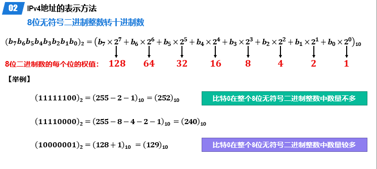

# 计算机网络

> 记录学习计算机网络的知识点，参考书和参考课程来自于慕课
>
> 协议教程： https://getiot.tech/zh/protocol/
>
> Cloudflare: https://www.cloudflare.com/zh-cn/learning/

## 第一章 概述

互联网(英语:Internet)是指20世纪末期兴起电脑网络与电脑网络之间所串连成的庞大网络系统。这些网络以一些标准的网络协议相连。它是由从地方到全球范围内几百万个私人、学术界、企业和政府的网络所构成，通过电子、无线和光纤网络技术等等一系列广泛的技术联系在一起。互联网承载范围广泛的信息资源和服务，比方说相互关系的超文本文件，还有万维网(WWW)的应用、电子邮件、通话，以及文件共享等个人收发服务。

在计算机网络中，不同名词的意义是不一样的。例如：`internet`表示的是互联网，Internet表示的是因特网。前者表示连接在一起的计算机群，后者表示按照TCP/IP 协议链接且是世界上最大的网络链接群。

在一般用途中，我们仅仅讨论因特网。

`ISP`：的全称是`Internet Service Provider`，因特网服务提供者。国内主要由三个通讯公司提供

从第一层提供给大公司的情况像是阿里云，公司贩卖域名和ip给与用户，但是它不是ISP。

因特网的草案是面向公众的

管理结构：[ISOC](https://en.wikipedia.org/wiki/Internet_Society)是非营利性倡导组织

组成部分：

### 电路交换，分组交换和报文交换

[电路交换](https://www.cnblogs.com/penghuwan/p/7686059.html)(英语:Circuit Switching)是相对于报文交换(或称分组交换)的一个概念。电路交换要求必须首先在通信双方之间建立连接通道。在连接建立成功之后，双方的通信活动才能开始。通信双方需要传递的信息都是通过已经建立好的连接来进行传递的，而且这个连接也将一直被维持到双方的通信结束。在某次通信活动的整个过程中，这个连接将始终占用着。连接建立开始时，通信系统分配给它的资源(通道、带宽、时隙、码字等等)，这也体现了电路交换区别于报文交换的本质特征。

> 电路交换中最重要的是交换机，交换机起到联通不同交换机的作用，最终链接到指定的电话机中。
>
> 具体操作简化：用户线发送信息 - 交换机接受信息通过中继线链接另一个交换机直到最后一个交换机-链接指定用户中
>
> 电路交换中的通讯路线仅仅只有一条，结束通话也就意味着这条通讯需要被拆除。电路通讯需要费有限的通讯资源。

电路交换的步骤是：建立链接 -> 通话-> 释放链接

**1.建立电路**

A和B要进行通信，首先A先发出呼叫请求信号，然后经由上述一系列的交换机，接通这条物理链路，再由B发出应答信号给A，这样，通信线路就接通了。从这开始，才允许进行数据传输

**2.数据传输**

建立电路阶段完成后，便进入了数据传输阶段。这时候：

- A可以向B发送数据，B也可以向A发送数据，实现[双工通信](https://www.cnblogs.com/kungfupanda/archive/2009/12/22/1629972.html)
- 在AB通信期间，**该条链路被AB所占有，任意部分的链路资源不能被其他终端所使用**

**3. 拆除电路**

数据传输结束后，拆除电路。这时候，**AB之间的链路资源被重新分配了，不再被AB独占，可以被其他的终端建立的链路所使用**

> 个人理解这个突发式，是一段一段的。类似于我们聊天，都是聊一段沉默一段这样子。

报文交换(英语:Message switching)，又称存储转发交换，是数据交换的三种方式之一，报文整个地发送，一次一跳。报文交换是分组交换的前身，是由莱昂纳多·克莱洛克于1961年提出的。报文交换的主要特点是:

- 存储接受到的报文，判断其目标地址以选择路由，最后，在下一跳路由空闲时，将数据转发给下一跳路由。报文交换系统现今都由分组交换或电路交换网络所承载。
- 每一条报文都作为互不相干的实体进行处理。每一条报文都包含地址信息，一次交换后，报文中的信息会被读取并且下一次交换的传输路径将被确定。
- 根据网络状况，通信选择的传输路径也会不同。每一条报文都会在下一次交换前被存储(在硬盘上存储时，会受到RAM的限制)。

> 报文传输：将封装好的报文信息，发送到指定的位置
>
> 报文传输的时候也有交换机参与，报文传输中的交换机的作用是存储和转发，对于其中一个交换机来说，他会将发送过来的报文下载一份然后再转发
>
> 这样做的坏处是增加了资源损耗，耗费较大的存储资源。一旦转发的报文出现错误就需要重新上传一整份大的文件。
>
> 具体步骤是：用户发出信息 - 交换机接受报文 - 转发 - 接受指定的报文

报文的传送过程依赖于 “存储转发机制”， 从发送端开始，每经过一个交换机，该交换机的任务是：

1.接收完整的报文，然后对报文进行缓存，此即为“存储”

2.等到下一个交换机节点空闲的时候，再将该报文发送给下一个交换机，此即为“转发”

接收端会将各份报文按照原来的顺序组合，从而得到完整的数据

在计算机网络和通信中，[分组交换](https://zh.wikipedia.org/wiki/%E5%88%86%E7%BB%84%E4%BA%A4%E6%8D%A2)(英语:Packet switching)是一种相对于电路交换的通信范例，分组(又称消息、或消息碎片)在节点间单独路由，不需要在传输前先建立通信路径。
分组交换技术是在1960年代末出现的，当时美国高级研究计划局(简称ARPA)为实现远程计算机之间的信息交换，资助建设一个试验性的网络，该网络被称为ARPANET(阿帕网)。阿帕网的主要研究成果之一就是开发一种新的网络协议，在**阿帕网上对话必须使用这种网络协议**。该协议采用一种新的网络信息传输技术，这就是分组交换技术。

> 报文要被英特网接受就需要遵循`TCP/IP`协议，总的来说报文多种多样，需要看指定的协议。

分组交换是在报文交换的基础上实现的。**分组交换其实就是把报文（Message）划分成更小的传输单元——分组（Packet）**。除此之外，并无太大差异。或者可以说：**报文交换和分组交换的差异就仅仅是数据单元的大小不同罢了**

相比于普通的报文交换，分组交换的[优势](https://www.cnblogs.com/penghuwan/p/7686059.html)是

- 基于存储转发机制，报文交换对交换机的存储容量的要求是很高的，而分组交换大大所要求的存储容量很小（因为单个分组比单个报文小很多）
- 包含较短信息的分组在节点间传输速率高
- 分组小，在传输的时候出错的概率小，**出现差错时，只需重发一个分组**，而无需重发整个报文，所以能够提高传输效率

缺点是：

- 分组首部带来了额外的传输开销。交换节点存储转发分组会造成一定的时延。
- 无法确保通信时端到端通信资源全部可用，在通信量较大时可能造成网络拥塞。
- 分组可能会出现失序和丢失等问题
  

> 发展时间：电路交换 - > 报文交换 -> 分组交换

### 计算机网络的定义和分类

[计算机网络](https://zh.wikipedia.org/wiki/%E8%AE%A1%E7%AE%97%E6%9C%BA%E7%BD%91%E7%BB%9C)，通常简称为网络，是指容许节点分享资源的数字电信网络。在计算机网络中，计算机设备通过节点之间的连接（数据链路）相互交换数据，即收发（接收和发放）网络信息。

网络的分类分为五类：交换方式，使用者，传输介质，覆盖范围，拓扑结构

#### 传输介质

按照传播方式的不同，可以把[传播介质](https://bbs.huaweicloud.com/blogs/387210)分为两种：

- 导向性传输媒体
- 非导向性传输媒体

导向性传输媒体：
1．双绞线
优缺点：成本低；密度高、节省空间；安装容易；高速率；抗干扰性一般；连接距离较短。

2．同轴电缆
优缺点：抗干扰性好；接入复杂。

3．光缆
优缺点：通信容量大；传输损耗小；抗干扰性好；保密性好；体积小重量轻；需要专用设备连接

非导向性传输媒体
1．短波通信(短波波段的电磁波除了能够利用地波传播外，还可通过电离层的反射进行远距离传输)
优缺点：通信质量较差；速率低；

2．微波通信：又分地面微波接力通信和卫星通信

> 将信号以频率在0.3 GHz 至300GHz的微波作为载体传输。部分被称作毫米波的微波辐射非常容易被大气层(特别是潮湿的天气)衰减。

A．地面微波接力通信
优缺点：信道容量大；传输质量高；投资少；相邻站点间直视；易受天气影响；保密性差。

B．卫星通信
优缺点：通信距离远；通信容量大；传播时延大270ms。

#### [不同网络的介绍](https://www.cloudflare.com/zh-cn/learning/)

- PNA(个域网)

  个人区域网 (PAN) 连接用户直接区域内的电子设备。PAN 的大小从几厘米到几米不等。现实世界中最常见的 PAN 示例之一是蓝牙耳机和智能手机之间的连接。PAN 还可以连接笔记本电脑、平板电脑、打印机、键盘和其他计算机化设备。

  个人区域网连接可以是有线或无线的。有线连接方式包括 USB 和 FireWire；无线连接方式包括蓝牙（最常见）、WiFi、IrDA 和 Zigbee。

  通常个域网不参与互联网的链接，也就是个域网不通过路由器进行。

- LAN(局域网)

  局域网（LAN）是包含在一个小的地理区域内的网络，通常在同一建筑物内。 家庭WiFi网络和小型商业网络是局域网的常见例子。

  LAN 规模也可以相当大，尽管如果它们占用多座建筑物，通常会将它们划归为广域网或者城域网。大多数 LAN 是从一个中心位置连接到[互联网](https://www.cloudflare.com/learning/network-layer/how-does-the-internet-work/)，即[路由器](https://www.cloudflare.com/learning/network-layer/what-is-a-router/)。家庭 LAN 通常使用单个路由器，而较大空间中的 LAN 可能另外使用[网络交换机](https://www.cloudflare.com/learning/network-layer/what-is-a-network-switch/) ，以提高数据包传输效率。

  LAN 几乎总是使用以太网、WiFi 或同时使用两者来连接网络中的设备。以太网是用于物理网络连接的协议，需要使用以太网电缆。WiFi 是通过无线电波连接到网络的协议。

  各种各样的设备都可以连接到 LAN，包括服务器、台式计算机、笔记本电脑、打印机、IoT 设备，甚至游戏机。在办公室，LAN 通常用于为内部员工提供对连接的打印机或服务器的共享访问。

- MAN(城域网)

  城域网 (MAN) 是连接城域内计算机的计算机网络，该城域可以是单个大城市、多个城镇或包含多个建筑物的任何给定大区域。城域网比[局域网 (LAN)](https://www.cloudflare.com/learning/network-layer/what-is-a-lan/) 大，但比[广域网 (WAN)](https://www.cloudflare.com/learning/network-layer/what-is-a-wan/) 小。城域网不一定要在市区；“大都会”一词意味着网络的规模，而不是其服务区域的人口统计数据。

  与广域网一样，城域网是由相互连接的局域网组成的。由于城域网规模较小，它们通常比广域网更有效率，因为数据不需要经过长距离的传输。城域网通常结合多个组织的网络，而不是由一个组织进行管理。

  大多数城域网使用光缆在局域网之间形成连接。城域网通常会使用“暗光纤”——以前未使用的能够传输流量的光纤电缆。这些光缆可以从私营互联网服务提供商 (ISP) 处租用。

  在某些情况下，这种模式是相反的：市政府建立和维护一个城市光纤网络，然后将暗光纤出租给私营公司。

> 校园网 (CAN) 是连接学校或企业园区内多个建筑物的大型网络。校园网也可以被视为城域网，因为它们连接多个局域网，但不够大，不能被视为广域网。

- WAN(广域网)

  广域网（WAN）是一种大型计算机[网络](https://www.cloudflare.com/learning/network-layer/what-is-the-network-layer/)，用于远距离连接不同的计算机组。大型企业通常使用 WAN 来连接其办公网络；每一办事处通常有自己的局域网（或 [LAN](https://www.cloudflare.com/learning/network-layer/what-is-a-lan/)），这些LAN 通过 WAN 相连。这些长距离连接可以不同的方式构成，包括专线、[VPN](https://www.cloudflare.com/learning/access-management/what-is-a-vpn/) 或 IP 隧道。

  有关 WAN 构成要素的定义比较宽泛。从技术上讲，跨越广阔地理区域的任何大型网络都是 WAN。[互联网](https://www.cloudflare.com/learning/network-layer/how-does-the-internet-work/)本身也被视为 WAN。

#### 拓扑结构

### 计算机网络[性能指标](https://zh.wikipedia.org/wiki/%E7%BD%91%E7%BB%9C%E6%80%A7%E8%83%BD)

- 带宽是可以传输信息的最大速率，通常以比特/秒为单位
- 吞吐量是信息传输的实际速率
- 延迟是发送外和接收处之间的延迟，这主要是信号传播时间，以及信息经过所有节点需要的外理时间
- 抖动是接收处延迟的变化
- 误码率是将发送位总数除以损坏位数得到的百分比

#### 数据传输速率

速率指的是**数据的传送速率**，即数据率(data rate)或比特率(bit rate)。

比特（bit）是计算机中数据量的单位，bit 来源于 binary digit，意思是一个“二进制数字”，因此一个比特就是二进制数字中的一个 1 或 0。速率是计算机网络中最重要的一个性能指标。

**速率的单位是 bit/s，或kbit/s，Mbit/s，Gbit/s，Tbit/s，Pbit/s，Ebit/s，Zbit/s，Ybit/s等**。（k=103，M=106，G=109，T=1012，P=1015，E=1018，Z=1021，Y=1024）

计算机网络中速率是以10的倍数为转换单位，速率往往是指额定速率或标称速率。

#### 带宽

带宽（band width）又叫频宽，**是指在固定的的时间可传输的资料数量，亦即在传输管道中可以传递数据的能力。**在数字设备中，频宽通常以**bps**表示，**即每秒钟可以传输多少个比特**。在模拟设备中，频宽通常以每秒传送周期或赫兹(Hz)来表示。

用简单的一点说法来解释，就是流水和水管的事情。把服务器带宽比作水管，流水比作传输数据。如果水管很粗的话，是可以承载很多的流水的。因此速度也是比较快的。反之，速度就相对来说很慢。同理，在同一段时间内，如果带宽太小的话，所传输的数据总量是非常慢的。也就是说，可容纳的用户访问量比较小。**相反，服务器带宽越大，在同一个时间所容纳的用户访问数据就越大。**

> 日常生活中的百兆宽带的意思是：每秒传输 100Mbps 的速率
>
> *百兆宽带*的实际速度为 100Mbps÷8=12.5MB/s

#### 吞吐量

**吞吐量取决于"木桶中最短的木板"。**

吞吐量：在如以太网及数据包无线电之类的电信网络之中，吞吐量或网络吞吐量是指于一通信通道上单位时间能成功传递的平均资料量，资料可以于实体或逻辑链接上传递，或通过某个网络节点。吞吐量的单位通常表示为比特每秒(bit/s或bps)。系统吞吐量或汇集吞吐量是指于一网络内单位时间所有终端传递的资料量的总和。吞吐量可以用等候理论作数学上的分析。其中，单位时间的数据包负戴标示为到达率入，而单位时间的数据包吞吐量则标示为离开率u。吞吐量实质上同义于数字带宽消耗量。

吞吐量表示在单位时间内通过某个网络（或信道、接口）的实际数据量。

#### [时间延迟](https://www.cnblogs.com/abeelan/p/17233291.html#例题一)

在计算机网络中进行分组交换，分组从一台主机(源)，通过一系列路由器传输，在另一台主机(目的地)结束它的进程。当分组从一个节点(主机或路由器)沿着这条路径到后继结点(主机或路由器)时该分组在沿途的每个节点都经受了几种不同类型的[时延](https://zh.wikipedia.org/wiki/%E6%97%B6%E5%BB%B6)(Delay)

- 发送时延：主机或路由器发送数据帧所需要的时间。也就是从发送数据帧的第一个比特算起，到该帧的最后一个比特发送完毕所需的时间。 也叫传输时延。

- 传播时延：电磁波在信道中传播一定的距离而需要花费的时间。

> 传播时延与通信介质有关。不同通信介质对电磁波的传播速率不同。
> 自由空间： 3.0×105km/s
> 铜线：2.3×105km/s
> 光纤：2.0×105km/s

- 处理时延：交换结点为存储转发而进行一些必要的处理所花费的时间。
  排队时延：结点缓存队列中分组排队所经历的时延。排队时延的长短往往取决于网络中当时的通信量。

- 数据经历的总时延就是发送时延、传播时延、处理时延和排队时延之和：
  总时延 = 发送时延+传播时延+处理时延+排队时延。

例题计算：

#### 宽带时延乘积

BDP是网络的带宽（以比特每秒为单位）与端到端延迟（以秒为单位）的乘积，结果以比特或字节表示。

时延带宽积：表示链路可以容纳多少个比特。又称为以比特为单位的链路长度。

#### **网络往返时间**

往返时间 (RTT) 是网络请求从起点到目的地然后再回到起点所花费的时长（以毫秒为单位）。RTT 是确定本地网络或较大 Internet 上连接的运行状况的重要指标，并且网络管理员通常使用 RTT 来诊断网络连接的速度和可靠性。

ping 实用程序几乎在所有计算机上可用，这是一种估计往返时间的方法。下面是几个 ping Google 的示例，底部都计算了往返时间。请注意，ping 时间之一（17.604 毫秒）高于其余时间。

##### 链路利用率

链路利用率是指网络链路在一定时间内被利用的程度。它通常用百分比表示，计算公式如下：

　　**链路利用率 = (链路被利用的时间 / 总时间) × 100%**

其中，链路被利用的时间是指链路在某个时间段内进行数据传输的时间，总时间是指这个时间段的总时长。

##### 网络利用率

指网络有百分之几的时间被利用（有数据通过）。

##### 网络丢包率

**丢包率 = 丢失分组数量/总分组数量**

丢失分组的情况：

### [计算机网络体系结构](https://segmentfault.com/a/1190000039204681)

计算机网络体系结构分为3种：OSI体系结构（七层），TCP/IP体系结构（四层），五层体系结构。

- `OSI体系结构`: 概念清楚，理论也比较完整，但是它既复杂又不实用。
- `TCP/IP体系结构`:TCP/IP是一个四层体系结构，得到了广泛的运用。
- `五层体系结构`:为了方便学习，折中`OSI体系结构`和`TCP/IP体系结构`，综合二者的优点，这样既简洁，又能将概念讲清楚。

TCP/IP与OSI最大的不同在于：OSI是一个理论上的网络通信模型，而TCP/IP则是实际运行的网络协议。

- `应用层`：应用层是网络协议的最高层，主要任务**通过进程间的交互完成特定网络应用**。应用层协议定义的是`应用程序（进程）间通信和交互的规则`。对于不同的网络应用需要有不同的应用层协议，在互联网中的应用层协议很多，如域名系统DNS，支持万维网应用的HTTP协议，支持电子邮件的SMTP协议，等等。应用层交互的数据单元称为`报文`。

  

- `运输层`：有时也译为传输层，它负责为两台主机中的进程提供通信服务。该层主要有以下两种协议：

  - 传输控制协议 (Transmission Control Protocol，TCP)：提供面向连接的、可靠的数据传输服务，数据传输的基本单位是报文段（segment）；
  - 用户数据报协议 (User Datagram Protocol，UDP)：提供无连接的、尽最大努力的数据传输服务，但不保证数据传输的可靠性，数据传输的基本单位是用户数据报。

  

- `网络层`：网络层负责为分组网络中的不同主机提供通信服务，并通过选择合适的路由将数据传递到目标主机。在发送数据时，网络层把运输层产生的报文段或用户数据封装成`分组`或 `包`进行传送。在TCP/IP体系中，由于网络层使用IP协议，因此分组也叫`IP数据报`。

  

- `数据链路层`：数据链路层通常简称为`链路层`。数据链路层在两个相邻节点传输数据时，将网络层交下来的IP数据报`组装成帧`，在两个相邻节点之间的链路上传送`帧`。

  

- `物理层`：保数据可以在各种物理媒介上进行传输，为数据的传输提供可靠的环境。

原理体系简述：

传输信息流程：

下面就开始讲述着计算机体系结构的各层特点

## 第二章 物理层

物理层考虑的是怎样才能连接各种计算机的传输媒体上传输数据比特流，而不是指具体的传输媒体。

现有计算机中的硬件设备和传输媒体的种类非常多，通信手段也有许多不同的方式。物理层的作用就是要尽可能的屏蔽掉这些传输媒体和通信手段的差异，是物理层之上的数据链路层感觉不到这些差异， 使得数据链路层只需考虑如何完成本层的协议和服务，而不必考虑网络具体情况的传输媒体和通信手段是什么。

可以将物理层的主要任务描述为确定与传输媒体接有关的一些特性

- 机械特性：接口所用接线器的一些物理属性如接口范围，接口尺寸，引线数目及排列；
- 电气特性：接口电缆的各条线上出现电压的范围，阻抗匹配，传输速度，距离等；
- 功能特性：某条线上出现的某一电平的电压的意义，接口部件信号线的用途；
- 过程特性：对于不同功能的各种可能事件的出现顺序，定义各条物理线路的工作规程和时序关系。

### 传播媒体

传输媒体也称为传输截止和传输媒介，是数据传输系统中在发送设备和接收设备之间的物理通路。传输介质可认为是第0层，它传输的是信号，但是不知道信号是什么意思，根据规定的电气特性来识别比特。

传输媒体可以分成两大类：导引性传输媒体和非引导性传输媒体。

导向型传播媒体(这里指的是线)

频率是由一个个电平和电压组成的，频率描述的是二者转化的速度。HZ的意思是，在一秒钟变化的周期。

光纤常见标准

- 通信容量非常大
- 抗雷电和电磁干扰性能好
- 传输损耗小，中继距离长无串音干扰，保密性好
- 体积小，重量轻

非导向型传播媒体(这里指的是[电磁波](https://zh.wikipedia.org/wiki/Wi-Fi))

用于通讯的电磁波频率范围大致在 **3 kHz 到 300 GHz** 之间。

微波是一种电磁波，其频率通常在300兆赫兹（MHz）到300吉赫兹（GHz）之间，对应的波长范围大约在1毫米到1米之间。

红外线能够在大气中传播，并且在很多情况下不会穿透墙壁，因此可以在短距离内进行点对点的通信。

(激光和可见光是未来技术，这里就不作说明)

### [传输方式](https://zh.wikipedia.org/wiki/%E9%80%9A%E4%BF%A1)

#### 串行通讯

串行通信**是指在计算机总线或其他数据通道上，每次传输一个比特数据，并连续进行以上单次过程的通信方式**。与之对应的是并行通信，**它在串行端口上通过一次同时传输若干比特数据的方式进行通信**。

数据流以串行方式**一位位**地在一条信道上传输，等第一个字符的最高位传输完后，再传输第二个字符的最低位，依此类推，这样串接起来形成串行数据流。

#### 并行传输

数据以**一组**或者**整个字符**的方式在**多条并行信道**上同时传输。 常用的就是将构成一个字符代码的8位二进制码，分别在8个并行信道上进行传输。

### [数据串行传输模式](https://cloud.tencent.com/developer/article/1944385)

串行传输**接收端**存在一个**如何从串行数据比特流中正确地划分出发送的一个个字符**的问题，也就是**字符同步**的问题。在串行数据通信中同步问题十分关键。发送端**一位一位地把信息通过介质发往接收端**，接收端**必须识别信息的开始和结束**，而且必须知道**每一位的持续时间**。只有这样，接收端才能从传输线路上**正确地取出被传送的数据**。

根据实现字符同步的方式不同，有**同步传输**和**异步传输**两种方式

#### 同步传输

在同步数据传输中，数据以帧或块的形式在接收方和发送方之间传输。数据以配对方式传输，因此发送方和接收方的同步是必要的。

只有当这些系统共享一个内部时钟时，这种同步才有可能。这种数据传输方式用于通过闭路电视传输语音和实时视频等对时间敏感的数据。

为了在同步传输方式中实现收发双方的时钟同步，可以采用以下两种方法:

- 外同步:在收发双方之间增加一条时钟线，发送端在发送数据信号的同时，还要发送一路时钟信号。接收端在时钟信号的“指挥下”对数据信号进行采样。这样就实现了收发双方的同步。
- 内同步:发送端将时钟信号编码到发送数据中一起发送。例如，曼彻斯特编码和差分曼彻斯特编码都自含时钟编码，具有自同步能力。

#### 异步传输

异步数据传输与同步数据传输正好相反，不需要接收方和发送方之间的主动同步。数据以半对方式以字符或字节的形式移动。传输数据的字符大小为8位，在数据的首尾加上奇偶校验位后变为10位。这种传输方法利用奇偶校验位来通知接收器有关数据转换的信息。通常一次传输1个字符或字节的数据。

异步传输方式以字节为传输单位，但字节之间的时间间隔并不固定，接收端只在每个字节的起始处对字节内的比特实现同步。为此，一般要给每个字节添加起始位和结束位。异步是指字节之间的异步(也就是字节之间的时间间隔并不固定)，但字节内的每个比特仍然要同步，它们的信号持续时间是相同的。

### 通讯方式

**单工通信**：

- **定义**：单工通信（Simplex Communication）是指消息只能单向传输的工作方式。
- **特点**：发送端只能发送信息，接收端只能接收信息，不能反向传输。例如广播电台发送信息，听众只能接收。
- **示例**：广播是单工通信的典型应用，广播电台发送信号，听众收听，不可反向传输。

**半双工通信**：

- **定义**：半双工通信（Half-duplex Communication）可以实现双向通信，但不能同时进行，需交替进行。
- **特点**：发送端和接收端可以互换角色，但每次只能有一个方向传输。例如对讲机可以发出信号，也可以接收信号，但不能同时进行。
- **示例**：对讲机是半双工通信的常见应用，需要按下“按讲”（Push To Talk, PTT）按钮才能说话。

**全双工通信**：

- **定义**：全双工通信（Full duplex Communication）是指通信的双方可以同时进行双向信息传输。
- **特点**：可以同时发送和接收信息，双向通信无延迟。例如手机通话时，双方可以同时讲话和听。
- **示例**：手机通信是全双工通信的应用，双方可以同时说话和听对方讲话。

### 编码与调制

调制就是用基带信号去控制载波信号的某个或几个参量的变化，将信息荷载在其上形成已调信号传输，而解调是调制的反过程，通过具体的方法从已调信号的参量变化中将恢复原始的基带信号。

> 调制信号的目的是使得信号可以在某种信道传输信息
>
> 解调就是将调制信息还原为源信息

#### 码元

[码元](https://www.cnblogs.com/Mr-black-7/p/16901058.html)是指用一个固定时长的信号波形(数字脉冲)，代表不同离散数值的基本波形，是数字通信中数字信号的计量单位，这个时长内的信号称为k进制码元，而该时长称为码元宽度。当码元的离散状态有M个时(M大于2)，此时码元为M进制码元。

1码元可以携带多个比特的信息量。例如，在使用二进制编码时，只有两种不同的码元，一种代表0状态，另一种代表1状态。

> 码元的作用就是将输送过来的波，转化为电脑可以识别的电子信号
>
> 但是电子信号所对应的模拟前信号的位置也是码元

#### [基带信号](https://cloud.tencent.com/developer/article/1944385)

由信源发出的原始信号称为基带信号，也就是基本频带信号。例如，由计算机输出的表示各种文字、图像、音频或视频文件的数字信号都属于基带信号。基带信号往往包含较多的低频成分，甚至包含(由连续个“0”或连续个“1”造成的)直流成分，而许多信道并不能传输这种低频分量或直流分量。因此，需要对基带信号进行调制(modulation)后才能在信道上传输。

> 不同极性信号的图
>
> 

#### 常见编码方式

常用编码方式有:不归零制、归零制、曼彻斯特编码以及差分曼彻斯特编码等

##### 不归零制

不归零是指信号中的码元在编码过程中都不会回归到零电平。

==不归零制的编码效率最高==，但是存在收发双方的同步问题。为了解决同步问题，需要给收发双方再添加一条时钟信号线。发送方通过数据信号线给接收方发送数据的同时，还通过时钟信号线给接收方发送时钟信号。接收方按照接收到的时钟信号的节拍，对数据信号线上的信号进行采样。

##### 归零制

归零制是指信号在每个码元期间会回归到零电平。例如，如图所示的是一种双极性归零编码，正电平表示1，负电平表示0，在每个码元的中间时刻信号都会回归到零电平。由于每个码元传输后信号都会归零，所以接收方只要在信号归零后采样即可。归零编码相当于将时钟信号编码在了数据之内，通过数据信号线进行发送，而不用单独的时钟信号线来发送时钟信号。因此，采用归零编码的信号也称作自同步信号。然而，==归零编码也有缺点:大部分的数据带宽都用来传输“归零”而浪费掉了==。

##### 曼彻斯特编码

曼彻斯特编码在每个码元的中间时刻电平都会发生跳变。电平的跳变既表示时钟信号，也表示数据，如图2-25(c)所示。向下跳变表示1还是0，以及向上跳变表示0还是1，可以自行定义。
曼彻斯特编码信号属于自同步信号，10Mbs 的传统以太网采用的就是曼彻斯特编码。

##### 差分曼彻斯特编码

差分曼彻斯特编码在每个码元的中间时刻电平都会发生跳变。与曼彻斯特编码不同的是，电平的跳变仅表示时钟信号，而不表示数据，如图2-25(d)所示。数据的表示在于每一个码元开始处是否有电平跳变:无跳变表示1，有跳变表示0。

==常见编码方式整图：==

#### 带通调制

常见的带通调制的方法：

　　A. 调幅（AM）：载波的振幅随基带数字信号而变化。1或0对应于有无载波输出。

　　B. 调频（FM）：载波的频率随基带数字信号而变化。1或0对应于两个不同的频率。

　　C. 调相（PM）：载波的初始相位随基带数字信号而变化。1或0对应于相位180度或0.

> 基本调制中，一个码元只能包含一种比特信息。

> 码元通过调制转化为编码信号

#### 混合调制

为了提高数据传输速率，可以使用技术上更为复杂的混合调制方法，使1个码元可以表示多个比特的信息量。因为载波的频率和相位是相关的，即频率是相位随时间的变化率，所以载波的频率和相位不能进行混合调制。通常情况下，载波的相位和振幅可以结合起来一起调制，例如正交振幅调制(QAM)。

相位和振幅的混合调制：正交振幅调制QAM

##### 正交振幅调制([qam](https://info.support.huawei.com/info-finder/encyclopedia/zh/QAM.html))

> 这里不太理解

正交幅度调制(QAM，Quadrature AmplitudeModulation)是一种在两个正交载波上进行幅度调制的调制方式。这两个载波通常是相位差为90度(T/2)的正弦波，因此被称作正交载波。这种调制方式因此而得名。

QAM中的每个码元可以表示多比特的信息。16-QAM中每个码元可以表示4比特信息，64-QAM中每个码元可以表示6比特信息，而更高阶的QAM（如256-QAM）可以表示更多比特的信息。

在数字信号调制中，星座图通常用于表示QAM调制二维图形。星座图相对于IQ调制而言，将数据调制信息映射到极坐标中，这些信息包含了信号的幅度信息和相位信息。

星座图上的每一个点，都表示一个符号。该点I轴和Q轴的分量分别代表着正交的载波上的幅度调整。该点到原点的距离**A**就是调制后的幅度，夹角**φ**就是调制后的相位。

### [信道极限容量](https://zh.wikipedia.org/wiki/%E4%BF%A1%E9%81%93%E5%AE%B9%E9%87%8F)

> 极限容量计算：https://www.cnblogs.com/yangmingxianshen/p/7819874.html

信道容量是指在一个信道中能够可靠地传送信息时可达速率的最小上界。所谓可靠传输指的是可以以任意小的错误率传递信息。根据有噪信道编码定理，信道容量是可以误差概率任意小地达到的给定信道的极限信息率。信道容量的单位为比特每秒、奈特每秒等等。

信道容量是信道的输入与输出的互信息量的最大值，而相应的输入分布称为最佳输入分布

> 传输越快，质量越差
>
> 质量越高，传输越慢

#### 信道可通频率

在信道上传输的数字信号其实是使用多个频率的模拟信号进行多次谐波而成的方波，如图所示。

假如数字信号频率位1000Hz，需要使用1000Hz的模拟信号作为基波，基本信号和更高频率谐波叠加形成数字信号的波形。

经过多次更高频率的波进行谐波，可以形成接近数字信号的波形，现在大家应该明白了为什么数字信号中包含更高频率的谐波了。

> [谐波的含义](https://zhuanlan.zhihu.com/p/22481177):
>
> 谐波是指电流中所含有的频率为基波的整数倍的电量，一般是指对周期性的非正弦电量进行==傅立叶级数分解==，除了基波频率的电量，其余大于基波频率的电流产生的电量，称为谐波。谐波次数是谐波频率与基波频率`（n=fn/f1）`的比值。谐波波形图如下图1所示，谐波分解图如下图2所示。
>
> 
>
> 

具体的信道所能通过的模拟信号的频率范围总是有限的。能够通过的最高频率减去最低频率就是该信道的带宽。

如图所示的电话线，假定其允许频率范围从300~3300Hz的模拟信号能够通过，低于300Hz和高于3300Hz的模拟信号均不能通过，则电话线的带宽位3000Hz。

> 怎么样拆解和叠加不同的波呢([傅里叶变换](https://zh.wikipedia.org/wiki/%E5%82%85%E9%87%8C%E5%8F%B6%E5%8F%98%E6%8D%A2))

#### [奈氏法则](https://www.cnblogs.com/evanzone/articles/15692570.html)

奈氏准则的提出是针对`码间串扰`问题的，所谓码间串扰问题就是当信息发送过快时，相邻的码元在接受时有可能被错误接收。其原理类似于视觉残留，画面在眼前闪太快时，人眼就会自动把上一帧画面和当前帧画面联系起来。

$$
Cmax=2WBaud=2Wlog2Mbit/s
$$

- 在任何信道中，码元传输的速率是有上限的。若传输速率超过此上限，就会发现严重的码间串扰问题，使接收端对码元的完全正确识别成为不可能。
- 信道的**频带越宽**（即能通过的信号高频分量越多），就可以用更高的速率进行码元的有效传输。
- 奈氏准则给出了码元传输速率的限制，但没有对信息传输速率给出限制。
- 由于码元的传输速率受奈氏准则的制约，所以要提高数据的传输速率，就必须设法使每个码元能携带更多个比特的信息量，这就需要采用多元制的调制方法。

常见一个码元携带多比特量：4 or 8

#### [香农公式](https://www.sohu.com/a/219750202_464086)

**噪声**存在于所有的电子设备和通信信道中。由于噪声随机产生，它的瞬时值有时会很大，因此噪声会使接收端对码元的判决产生错误。但是噪声的影响是相对的，若信号较强，那么噪声影响相对较小。因此，**信噪比**就很重要。==信噪比=**信号**的平均功率/**噪声**的平均功率==，常记为S/N，并用分贝 (dB) 作为度量单位，即:

> **信噪比（dB）= 10lg（S/N）**

对于有噪声的信道，其带宽为𝑊 Hz，该信道的信噪比记为𝑆/𝑁，则该信道的最大传输速率为（该式子中的信噪比为无单位比值）
$$
C
m
a
x
=
W
log
2
(
1
+
S
/
N
)
 
bit/s
$$
> 

### 信道复用

在一条传播媒体上传输多路用户的信号，称之为复用

#### **频分复用**

频分复用, 就是通过将不同频率的信号进行融合, 然后在接收端再进行不同频率信号的分离. 当然, 叠加后的频率是不能超出传输媒介的频率带宽的.

频分复用的所有用户同时占用不同的频带资源并行通信

**频分复用FDW的例子**

三台电话的三种波形在合并之前没有采取信道复用，那么一端的两台电话同时打给另一端的同一台电话就会出现占线；传输过程中三种波形通过合并为一个波实现了信道复用。

#### **时分复用**

时分多路复用是一种数字或者模拟(较罕见)的多路复用技术。使用这种技术，两个以上的信号或数据流可以同时在一条通信线路上传输，其表现为同一通信信道的子信道。但在物理上来看，信号还是轮流占用物理通道的。

时间域被分成周期循环的一些小段，每段时间长度是固定的，每个时段用来传输一个子信道。例如子信道1的采样，可能是字节或者是数据块，使用时间段1，子信道2，使用时间段2，等等。一个 TDM 的帧包含了一个子信道的一个时间段，当最后一个子信道传输完毕，这样的过程将会再重复来传输新的帧，也就是下个信号片段。

#### **波分复用**

波分复用是利用多个激光器在单条光纤上同时发送多束不同波长激光的技术。每个信号经过数据(文本、语音、视频等)调制后都在它独有的色带内传输。WDM 能使电话公司和其他运营商的现有光纤基础设施容量大增。

> 波分复用就是光的频分复用。

#### **[码分复用](https://www.cnblogs.com/AhuntSun-blog/p/12210618.html)**

最普通的例子就是手机打电话。比如联通公司发送总的信号是一样的，那么当多人同时打电话时如何判断打的是A手机而不是B手机呢？

常用的名词是**码分多址 CDMA** (Code Division Multiple Access)。

- 各用户使用经过特殊挑选的不同码型，因此彼此不会造成干扰。
- 这种系统发送的信号有很强的抗干扰能力，其频谱类似于白噪声，不易被他人发现。
- 每一个比特时间划分为 m 个短的间隔，称为**码片**(chip)。

**`CDMA(码分多址)`的工作原理:**

## 第三章 数据链路层

数据链路层的作用是在两个网络实体之间提供数据链路连接的建立、维持和释放管理。构成数据链路数据单元(frame:数据帧或帧)，并对帧定界、同步、收发顺序的控制。并且包括传输过程中的网络流量控制、差错检测和差错控制等方面。

只提供导线的一端到另一端(本质是点到点)的数据传输。数据链路层会在 frame 尾端置放检査码以检查实质内容，==将物理层提供的可能出错的物理连接改造成逻辑上无差错的数据链路，并对物理层的原始数据进行数据封装==。

数据链路层中的数据封装是指: ==封装的数据信息中，包含了地址段和数据段等==。地址段含有点对点发送节点和接收节点的地址(如MAC)，控制段用来表示数格连接帧的类型，数据段包含实际要传输的数据。

链路简单理解，是局域网中网卡和网卡联通的通道。在数据链路层中是：如何在物理链路上传输数据，包括错误检测和纠正、帧的格式化等。

链路层传输的数据被称之为帧，帧的构成是什么？

> 一个帧通常包含三个部分：
>
> - **帧头（Header）**：包含源和目标地址、类型字段等控制信息。
>
> - **数据部分（Payload）**：实际传输的数据，即来自网络层（第三层）的数据包。
>
> - **帧尾（Trailer）**：包含错误检测码（如CRC校验码），用于验证数据的完整性。

### 数据链路层的三大问题

在数据链路层中，链路层地址有很多中不同的称谓：LAN 地址、物理地址或者 MAC 地址，因为 MAC 地址是最流行的术语，所以我们一般称呼链路层地址指的就是 MAC 地址。

#### [封装成帧和透明传输](https://www.zbpblog.com/blog-345.html)

`打包成帧(framing)`: 在每个网络层数据报在传输之前，几乎所有的链路层协议都会将数据报用链路层封装起来。数据链路层从网络层获取数据后将其封装成为 `帧`，如果帧太大的话，数据链路层会将大帧拆分为一个个的小帧，小帧能够使传输控制和错误检测更加高效。

一个帧由 **Header(帧头)、Payload Field（上层数据）、Trailer(帧尾)** 组成，网络层数据报就封装在 `Payload Field` 字段中。根据不同的物理介质，每个帧的结构也不同。帧的组成如下：

[透明传输](https://www.zhihu.com/question/34774349)其实就是指无论是什么报文都可以传输，非透明传输就是指某些特殊字符不能传输，在计算机网络中，透明传输在数据链路层提到过，在数据链路层将网络层协议封装成帧时，会在首部和尾部分别添加SOH以及EOT这两个特殊字符，接收方是根据这两个字符来确定帧首和帧尾的，如果上层协议发送过来的数据(即链路层的数据部分)包含EOT，那么接收方在解析这个帧的时候就会误以为数据已经结束，所以，如果链路层对这种情况没有特殊处理，那么就可以理解链路层为非透明传输(因为无法传输EOT这个字符)，但是数据链路层通过对这个字符添加转移符(如果网络层数据中还存在转移符，就再添加一个转移符)的办法来使数据部分可以传输EOT字符，就实现了透明传输。

> 透明传输就是数据传输过程中数据不会受特殊字符的影响（受影响只要处理好了也是透明传输），但是如果受到影响，如出现数据中字符刚好与停止符等相同时，且未进行任何处理，则为非透明传输

透明传输的演示：

#### [差错检测](https://www.cnblogs.com/myworld7/p/8422270.html)

数据在传输的过程中难免会出现差错（比如经过路由转发时），因此我们需要一些差错检测和纠正技术来检测数据中的差错并纠正，使接收方收到正确的数据，也避免发送方对数据进行重传。

常见的差错检测和纠正技术有：

- 奇偶检测
- 检验和
- 循环冗余检测

##### 奇偶检测

- 奇校验是在待发送的数据后面添加1个校验位，使得添加该校验位后的整个数据中比特1的个数为奇数.
- 偶校验是在待发送的数据后面添加1个校验位，使得添加该校验位后的整个数据中比特1的个数为偶数，

> 通过检测数据中比特的数量来判断数据是否出错

较为简单的纠错方式，只能检测到单个比特错误。

##### [循环冗余校验](https://www.cxyxiaowu.com/21564.html)

循环冗余校验是一种广泛应用于数字通信和存储设备中的错误检测技术。CRC 通过生成一个固定长度的校验码来检测数据传输或存储过程中是否发生了错误。

- 余数为0，可判断接收无误码

- 余数不为0，可判断接收有误码

**发送端**：准备数据 -> 数据扩展 -> 计算CRC校验码 -> 附加校验码 -> 发送数据。

**接收端**：接收数据 -> 校验过程 -> 检查余数。

简要流程如下：

> ### 发送端流程
>
> 1. **数据准备**：
>
>    - 将要传输的数据转换为二进制形式，表示为数据多项式 
>      $$
>      D(x)。
>      $$
>      
>
> 2. **多项式扩展**：
>
>    - 在数据末尾添加n个零（n是生成多项式的位数减去1），得到扩展后的数据 
>      $$
>      D(x)\cdot x^n。
>      $$
>      
>
> 3. **计算CRC校验码**：
>
>    - 用生成多项式
>      $$
>      G(x)
>      $$
>      对扩展后的数据 
>      $$
>      D(x)⋅x^n
>      $$
>      进行二进制多项式除法，得到余数 
>      $$
>      R(x)
>      $$
>      这就是CRC校验码。
>
> 4. **附加校验码**：
>
>    - 将CRC校验码 R(x)R(x)R(x) 附加到原始数据末尾，形成发送数据。
>
> ### 接收端流程
>
> 1. **接收数据**：
>    - 接收包含原始数据和CRC校验码的完整数据串。
> 2. **校验过程**：
>    - 使用相同的生成多项式 G(x)G(x)G(x) 对接收到的完整数据串进行二进制多项式除法。
> 3. **检查余数**：
>    - 如果除法得到的余数为0，说明数据在传输过程中没有发生错误。

#### 可靠传输

##### 传输差错

：类别有误码，分组丢失，分组失序，分组重复

##### [可靠传输的基本概念](https://www.cnblogs.com/BeautifulWater/p/16286143.html)

##### [停止等待协议](https://www.cnblogs.com/fennleo/p/13434741.html)

，需要注意其的实现原理和信道利用率

##### 回退N帧协议 

> https://www.cnblogs.com/XiaoJ-cs/p/15159789.html

ppt137- 180

##### 选择重传协议

 ppt221

> https://www.jianshu.com/p/1d2073f09d31z

### 点对点协议(PPP)

### 共享式以太网

#### 网络适配器和MAC地址

[MAC地址](https://www.cnblogs.com/lsgxeva/p/13932262.html)

什么是[IEEE](https://zh.wikipedia.org/wiki/%E7%94%B5%E6%B0%94%E7%94%B5%E5%AD%90%E5%B7%A5%E7%A8%8B%E5%B8%88%E5%AD%A6%E4%BC%9A)：电气电子工程师学会

单播，广播，多播地址

#### [**CSMA/CD协议**](https://www.cnblogs.com/linfangnan/p/13398323.html)

争用期

最小帧长和最大帧长

退避算法

> https://www.cnblogs.com/wangzhongqiu/p/7810616.html

截断二进制指数逃避算法

信道利用率

> https://info.support.huawei.com/info-finder/encyclopedia/zh/%E4%BF%A1%E9%81%93%E5%88%A9%E7%94%A8%E7%8E%87.html

**使用集线器的共享式以太网**

什么是集线器

> https://www.51cto.com/article/784841.html

#### **在物理层扩展以太网**

> https://cloud.tencent.com/developer/article/2169925

#### **数据链路层扩展以太网**

> 这种方法比较合适

网桥是什么：https://wiki.mbalib.com/wiki/%E7%BD%91%E6%A1%A5

透明网桥又是什么 > https://baike.c114.com.cn/view.asp?id=19456-A17D4629

>  https://info.support.huawei.com/info-finder/encyclopedia/zh/STP.html

### 交换式以太网

> https://www.cnblogs.com/jhno1/p/13474312.html

#### 以太网交换机

### 交换式和共享式对比

### 以太网的MAC帧格式

> https://www.cnblogs.com/shijingxiang/articles/14657693.html

### 虚拟局域网(VLAN)

VLAN：虚拟局域网

> https://cabling.qianjia.com/html/2023-12/20_406474.html

#### 实现机制

### 以太网的发展

### 无线局域网

WLAN是什么 > https://www.cnblogs.com/kukuxjx/p/17445550.html

CSMA/CA协议 https://www.cnblogs.com/aixin0813/p/3289183.html

#### 无线局域网的MAC帧

## 第四章 网络层

### 网络层概述

网络层(Network Layer)是OSI模型中的第三层(TCP/IP模型中的网际层)，提供路由和寻址的功能，使两终端系统能够互连且决定最佳路径，并具有一定的拥塞控制和流量控制的能力。相当于发送邮件时需要地址一般重要。由于TCP/IP协议体系中的网络层功能由IP协议规定和实现，故又称IP层。

分组转发和路由选择，什么是分组转发

> https://www.cnblogs.com/cone/p/14906428.html

> https://www.cnblogs.com/AhuntSun-blog/p/12230654.html

面向连接的虚电路服务

无连接的数据报服务

### 网际协议(IP)

#### 异构网络

#### IPv4地址

> https://www.zwnblog.com/archives/ji-suan-ji-wang-luo-ji-ch-yi-wen-xiang-jie-ipv4-yu-zi-wang-hua-fen

#### 分类编址方法

这些地址的区别是什么

ABCDE

> https://blog.51cto.com/u_15178976/3033960

#### 划分子网编址方法

例题：

#### 无分类编址方法

> https://www.cnblogs.com/yahuian/p/ipv4-representation.html

> https://www.cnblogs.com/TRY0929/p/14737533.html

### IPv4地址的应用规划

定长子网掩码划分子网

定长子网掩码

变长子网掩码

#### IPv4地址和MAC地址

