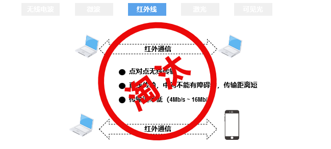
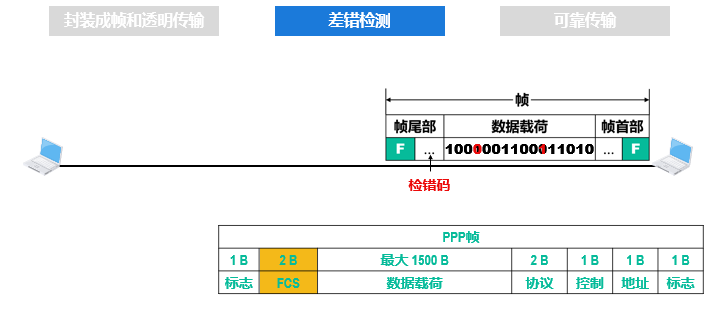
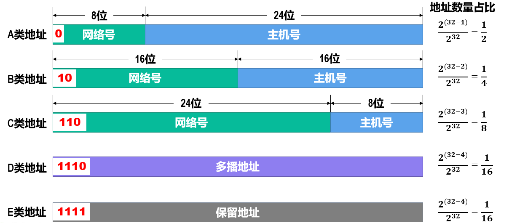

# 计算机网络

> 记录学习计算机网络的知识点，参考书和参考课程来自于慕课
>
> 协议教程： https://getiot.tech/zh/protocol/
>
> Cloudflare: https://www.cloudflare.com/zh-cn/learning/

## 第一章 概述

互联网(英语:Internet)是指20世纪末期兴起电脑网络与电脑网络之间所串连成的庞大网络系统。这些网络以一些标准的网络协议相连。它是由从地方到全球范围内几百万个私人、学术界、企业和政府的网络所构成，通过电子、无线和光纤网络技术等等一系列广泛的技术联系在一起。互联网承载范围广泛的信息资源和服务，比方说相互关系的超文本文件，还有万维网(WWW)的应用、电子邮件、通话，以及文件共享等个人收发服务。

在计算机网络中，不同名词的意义是不一样的。例如：`internet`表示的是互联网，Internet表示的是因特网。前者表示连接在一起的计算机群，后者表示按照TCP/IP 协议链接且是世界上最大的网络链接群。

在一般用途中，我们仅仅讨论因特网。

`ISP`：的全称是`Internet Service Provider`，因特网服务提供者。国内主要由三个通讯公司提供

从第一层提供给大公司的情况像是阿里云，公司贩卖域名和ip给与用户，但是它不是ISP。

因特网的草案是面向公众的

管理结构：[ISOC](https://en.wikipedia.org/wiki/Internet_Society)是非营利性倡导组织

组成部分：

### 电路交换，分组交换和报文交换

[电路交换](https://www.cnblogs.com/penghuwan/p/7686059.html)(英语:Circuit Switching)是相对于报文交换(或称分组交换)的一个概念。电路交换要求必须首先在通信双方之间建立连接通道。在连接建立成功之后，双方的通信活动才能开始。通信双方需要传递的信息都是通过已经建立好的连接来进行传递的，而且这个连接也将一直被维持到双方的通信结束。在某次通信活动的整个过程中，这个连接将始终占用着。连接建立开始时，通信系统分配给它的资源(通道、带宽、时隙、码字等等)，这也体现了电路交换区别于报文交换的本质特征。

> 电路交换中最重要的是交换机，交换机起到联通不同交换机的作用，最终链接到指定的电话机中。
>
> 具体操作简化：用户线发送信息 - 交换机接受信息通过中继线链接另一个交换机直到最后一个交换机-链接指定用户中
>
> 电路交换中的通讯路线仅仅只有一条，结束通话也就意味着这条通讯需要被拆除。电路通讯需要费有限的通讯资源。

电路交换的步骤是：建立链接 -> 通话-> 释放链接

**1.建立电路**

A和B要进行通信，首先A先发出呼叫请求信号，然后经由上述一系列的交换机，接通这条物理链路，再由B发出应答信号给A，这样，通信线路就接通了。从这开始，才允许进行数据传输

**2.数据传输**

建立电路阶段完成后，便进入了数据传输阶段。这时候：

- A可以向B发送数据，B也可以向A发送数据，实现[双工通信](https://www.cnblogs.com/kungfupanda/archive/2009/12/22/1629972.html)
- 在AB通信期间，**该条链路被AB所占有，任意部分的链路资源不能被其他终端所使用**

**3. 拆除电路**

数据传输结束后，拆除电路。这时候，**AB之间的链路资源被重新分配了，不再被AB独占，可以被其他的终端建立的链路所使用**

> 个人理解这个突发式，是一段一段的。类似于我们聊天，都是聊一段沉默一段这样子。

报文交换(英语:Message switching)，又称存储转发交换，是数据交换的三种方式之一，报文整个地发送，一次一跳。报文交换是分组交换的前身，是由莱昂纳多·克莱洛克于1961年提出的。报文交换的主要特点是:

- 存储接受到的报文，判断其目标地址以选择路由，最后，在下一跳路由空闲时，将数据转发给下一跳路由。报文交换系统现今都由分组交换或电路交换网络所承载。
- 每一条报文都作为互不相干的实体进行处理。每一条报文都包含地址信息，一次交换后，报文中的信息会被读取并且下一次交换的传输路径将被确定。
- 根据网络状况，通信选择的传输路径也会不同。每一条报文都会在下一次交换前被存储(在硬盘上存储时，会受到RAM的限制)。

> 报文传输：将封装好的报文信息，发送到指定的位置
>
> 报文传输的时候也有交换机参与，报文传输中的交换机的作用是存储和转发，对于其中一个交换机来说，他会将发送过来的报文下载一份然后再转发
>
> 这样做的坏处是增加了资源损耗，耗费较大的存储资源。一旦转发的报文出现错误就需要重新上传一整份大的文件。
>
> 具体步骤是：用户发出信息 - 交换机接受报文 - 转发 - 接受指定的报文

报文的传送过程依赖于 “存储转发机制”， 从发送端开始，每经过一个交换机，该交换机的任务是：

1.接收完整的报文，然后对报文进行缓存，此即为“存储”

2.等到下一个交换机节点空闲的时候，再将该报文发送给下一个交换机，此即为“转发”

接收端会将各份报文按照原来的顺序组合，从而得到完整的数据

在计算机网络和通信中，[分组交换](https://zh.wikipedia.org/wiki/%E5%88%86%E7%BB%84%E4%BA%A4%E6%8D%A2)(英语:Packet switching)是一种相对于电路交换的通信范例，分组(又称消息、或消息碎片)在节点间单独路由，不需要在传输前先建立通信路径。
分组交换技术是在1960年代末出现的，当时美国高级研究计划局(简称ARPA)为实现远程计算机之间的信息交换，资助建设一个试验性的网络，该网络被称为ARPANET(阿帕网)。阿帕网的主要研究成果之一就是开发一种新的网络协议，在**阿帕网上对话必须使用这种网络协议**。该协议采用一种新的网络信息传输技术，这就是分组交换技术。

> 报文要被英特网接受就需要遵循`TCP/IP`协议，总的来说报文多种多样，需要看指定的协议。

分组交换是在报文交换的基础上实现的。**分组交换其实就是把报文（Message）划分成更小的传输单元——分组（Packet）**。除此之外，并无太大差异。或者可以说：**报文交换和分组交换的差异就仅仅是数据单元的大小不同罢了**

相比于普通的报文交换，分组交换的[优势](https://www.cnblogs.com/penghuwan/p/7686059.html)是

- 基于存储转发机制，报文交换对交换机的存储容量的要求是很高的，而分组交换大大所要求的存储容量很小（因为单个分组比单个报文小很多）
- 包含较短信息的分组在节点间传输速率高
- 分组小，在传输的时候出错的概率小，**出现差错时，只需重发一个分组**，而无需重发整个报文，所以能够提高传输效率

缺点是：

- 分组首部带来了额外的传输开销。交换节点存储转发分组会造成一定的时延。
- 无法确保通信时端到端通信资源全部可用，在通信量较大时可能造成网络拥塞。
- 分组可能会出现失序和丢失等问题
  

> 发展时间：电路交换 - > 报文交换 -> 分组交换

### 计算机网络的定义和分类

[计算机网络](https://zh.wikipedia.org/wiki/%E8%AE%A1%E7%AE%97%E6%9C%BA%E7%BD%91%E7%BB%9C)，通常简称为网络，是指容许节点分享资源的数字电信网络。在计算机网络中，计算机设备通过节点之间的连接（数据链路）相互交换数据，即收发（接收和发放）网络信息。

网络的分类分为五类：交换方式，使用者，传输介质，覆盖范围，拓扑结构

#### 传输介质

按照传播方式的不同，可以把[传播介质](https://bbs.huaweicloud.com/blogs/387210)分为两种：

- 导向性传输媒体
- 非导向性传输媒体

导向性传输媒体：
1．双绞线
优缺点：成本低；密度高、节省空间；安装容易；高速率；抗干扰性一般；连接距离较短。

2．同轴电缆
优缺点：抗干扰性好；接入复杂。

3．光缆
优缺点：通信容量大；传输损耗小；抗干扰性好；保密性好；体积小重量轻；需要专用设备连接

非导向性传输媒体
1．短波通信(短波波段的电磁波除了能够利用地波传播外，还可通过电离层的反射进行远距离传输)
优缺点：通信质量较差；速率低；

2．微波通信：又分地面微波接力通信和卫星通信

> 将信号以频率在0.3 GHz 至300GHz的微波作为载体传输。部分被称作毫米波的微波辐射非常容易被大气层(特别是潮湿的天气)衰减。

A．地面微波接力通信
优缺点：信道容量大；传输质量高；投资少；相邻站点间直视；易受天气影响；保密性差。

B．卫星通信
优缺点：通信距离远；通信容量大；传播时延大270ms。

#### [不同网络的介绍](https://www.cloudflare.com/zh-cn/learning/)

- PNA(个域网)

  个人区域网 (PAN) 连接用户直接区域内的电子设备。PAN 的大小从几厘米到几米不等。现实世界中最常见的 PAN 示例之一是蓝牙耳机和智能手机之间的连接。PAN 还可以连接笔记本电脑、平板电脑、打印机、键盘和其他计算机化设备。

  个人区域网连接可以是有线或无线的。有线连接方式包括 USB 和 FireWire；无线连接方式包括蓝牙（最常见）、WiFi、IrDA 和 Zigbee。

  通常个域网不参与互联网的链接，也就是个域网不通过路由器进行。

- LAN(局域网)

  局域网（LAN）是包含在一个小的地理区域内的网络，通常在同一建筑物内。 家庭WiFi网络和小型商业网络是局域网的常见例子。

  LAN 规模也可以相当大，尽管如果它们占用多座建筑物，通常会将它们划归为广域网或者城域网。大多数 LAN 是从一个中心位置连接到[互联网](https://www.cloudflare.com/learning/network-layer/how-does-the-internet-work/)，即[路由器](https://www.cloudflare.com/learning/network-layer/what-is-a-router/)。家庭 LAN 通常使用单个路由器，而较大空间中的 LAN 可能另外使用[网络交换机](https://www.cloudflare.com/learning/network-layer/what-is-a-network-switch/) ，以提高数据包传输效率。

  LAN 几乎总是使用以太网、WiFi 或同时使用两者来连接网络中的设备。以太网是用于物理网络连接的协议，需要使用以太网电缆。WiFi 是通过无线电波连接到网络的协议。

  各种各样的设备都可以连接到 LAN，包括服务器、台式计算机、笔记本电脑、打印机、IoT 设备，甚至游戏机。在办公室，LAN 通常用于为内部员工提供对连接的打印机或服务器的共享访问。

- MAN(城域网)

  城域网 (MAN) 是连接城域内计算机的计算机网络，该城域可以是单个大城市、多个城镇或包含多个建筑物的任何给定大区域。城域网比[局域网 (LAN)](https://www.cloudflare.com/learning/network-layer/what-is-a-lan/) 大，但比[广域网 (WAN)](https://www.cloudflare.com/learning/network-layer/what-is-a-wan/) 小。城域网不一定要在市区；“大都会”一词意味着网络的规模，而不是其服务区域的人口统计数据。

  与广域网一样，城域网是由相互连接的局域网组成的。由于城域网规模较小，它们通常比广域网更有效率，因为数据不需要经过长距离的传输。城域网通常结合多个组织的网络，而不是由一个组织进行管理。

  大多数城域网使用光缆在局域网之间形成连接。城域网通常会使用“暗光纤”——以前未使用的能够传输流量的光纤电缆。这些光缆可以从私营互联网服务提供商 (ISP) 处租用。

  在某些情况下，这种模式是相反的：市政府建立和维护一个城市光纤网络，然后将暗光纤出租给私营公司。

> 校园网 (CAN) 是连接学校或企业园区内多个建筑物的大型网络。校园网也可以被视为城域网，因为它们连接多个局域网，但不够大，不能被视为广域网。

- WAN(广域网)

  广域网（WAN）是一种大型计算机[网络](https://www.cloudflare.com/learning/network-layer/what-is-the-network-layer/)，用于远距离连接不同的计算机组。大型企业通常使用 WAN 来连接其办公网络；每一办事处通常有自己的局域网（或 [LAN](https://www.cloudflare.com/learning/network-layer/what-is-a-lan/)），这些LAN 通过 WAN 相连。这些长距离连接可以不同的方式构成，包括专线、[VPN](https://www.cloudflare.com/learning/access-management/what-is-a-vpn/) 或 IP 隧道。

  有关 WAN 构成要素的定义比较宽泛。从技术上讲，跨越广阔地理区域的任何大型网络都是 WAN。[互联网](https://www.cloudflare.com/learning/network-layer/how-does-the-internet-work/)本身也被视为 WAN。

#### 拓扑结构

### 计算机网络[性能指标](https://zh.wikipedia.org/wiki/%E7%BD%91%E7%BB%9C%E6%80%A7%E8%83%BD)

- 带宽是可以传输信息的最大速率，通常以比特/秒为单位
- 吞吐量是信息传输的实际速率
- 延迟是发送外和接收处之间的延迟，这主要是信号传播时间，以及信息经过所有节点需要的外理时间
- 抖动是接收处延迟的变化
- 误码率是将发送位总数除以损坏位数得到的百分比

#### 数据传输速率

速率指的是**数据的传送速率**，即数据率(data rate)或比特率(bit rate)。

比特（bit）是计算机中数据量的单位，bit 来源于 binary digit，意思是一个“二进制数字”，因此一个比特就是二进制数字中的一个 1 或 0。速率是计算机网络中最重要的一个性能指标。

**速率的单位是 bit/s，或kbit/s，Mbit/s，Gbit/s，Tbit/s，Pbit/s，Ebit/s，Zbit/s，Ybit/s等**。（k=103，M=106，G=109，T=1012，P=1015，E=1018，Z=1021，Y=1024）

计算机网络中速率是以10的倍数为转换单位，速率往往是指额定速率或标称速率。

#### 带宽

带宽（band width）又叫频宽，**是指在固定的的时间可传输的资料数量，亦即在传输管道中可以传递数据的能力。**在数字设备中，频宽通常以**bps**表示，**即每秒钟可以传输多少个比特**。在模拟设备中，频宽通常以每秒传送周期或赫兹(Hz)来表示。

用简单的一点说法来解释，就是流水和水管的事情。把服务器带宽比作水管，流水比作传输数据。如果水管很粗的话，是可以承载很多的流水的。因此速度也是比较快的。反之，速度就相对来说很慢。同理，在同一段时间内，如果带宽太小的话，所传输的数据总量是非常慢的。也就是说，可容纳的用户访问量比较小。**相反，服务器带宽越大，在同一个时间所容纳的用户访问数据就越大。**

> 日常生活中的百兆宽带的意思是：每秒传输 100Mbps 的速率
>
> *百兆宽带*的实际速度为 100Mbps÷8=12.5MB/s

#### 吞吐量

**吞吐量取决于"木桶中最短的木板"。**

吞吐量：在如以太网及数据包无线电之类的电信网络之中，吞吐量或网络吞吐量是指于一通信通道上单位时间能成功传递的平均资料量，资料可以于实体或逻辑链接上传递，或通过某个网络节点。吞吐量的单位通常表示为比特每秒(bit/s或bps)。系统吞吐量或汇集吞吐量是指于一网络内单位时间所有终端传递的资料量的总和。吞吐量可以用等候理论作数学上的分析。其中，单位时间的数据包负戴标示为到达率入，而单位时间的数据包吞吐量则标示为离开率u。吞吐量实质上同义于数字带宽消耗量。

吞吐量表示在单位时间内通过某个网络（或信道、接口）的实际数据量。

#### [时间延迟](https://www.cnblogs.com/abeelan/p/17233291.html#例题一)

在计算机网络中进行分组交换，分组从一台主机(源)，通过一系列路由器传输，在另一台主机(目的地)结束它的进程。当分组从一个节点(主机或路由器)沿着这条路径到后继结点(主机或路由器)时该分组在沿途的每个节点都经受了几种不同类型的[时延](https://zh.wikipedia.org/wiki/%E6%97%B6%E5%BB%B6)(Delay)

- 发送时延：主机或路由器发送数据帧所需要的时间。也就是从发送数据帧的第一个比特算起，到该帧的最后一个比特发送完毕所需的时间。 也叫传输时延。

- 传播时延：电磁波在信道中传播一定的距离而需要花费的时间。

> 传播时延与通信介质有关。不同通信介质对电磁波的传播速率不同。
> 自由空间： 3.0×105km/s
> 铜线：2.3×105km/s
> 光纤：2.0×105km/s

- 处理时延：交换结点为存储转发而进行一些必要的处理所花费的时间。
  排队时延：结点缓存队列中分组排队所经历的时延。排队时延的长短往往取决于网络中当时的通信量。

- 数据经历的总时延就是发送时延、传播时延、处理时延和排队时延之和：
  总时延 = 发送时延+传播时延+处理时延+排队时延。

例题计算：

#### 宽带时延乘积

BDP是网络的带宽（以比特每秒为单位）与端到端延迟（以秒为单位）的乘积，结果以比特或字节表示。

时延带宽积：表示链路可以容纳多少个比特。又称为以比特为单位的链路长度。

#### **网络往返时间**

往返时间 (RTT) 是网络请求从起点到目的地然后再回到起点所花费的时长（以毫秒为单位）。RTT 是确定本地网络或较大 Internet 上连接的运行状况的重要指标，并且网络管理员通常使用 RTT 来诊断网络连接的速度和可靠性。

ping 实用程序几乎在所有计算机上可用，这是一种估计往返时间的方法。下面是几个 ping Google 的示例，底部都计算了往返时间。请注意，ping 时间之一（17.604 毫秒）高于其余时间。

##### 链路利用率

链路利用率是指网络链路在一定时间内被利用的程度。它通常用百分比表示，计算公式如下：

　　**链路利用率 = (链路被利用的时间 / 总时间) × 100%**

其中，链路被利用的时间是指链路在某个时间段内进行数据传输的时间，总时间是指这个时间段的总时长。

##### 网络利用率

指网络有百分之几的时间被利用（有数据通过）。

##### 网络丢包率

**丢包率 = 丢失分组数量/总分组数量**

丢失分组的情况：

### [计算机网络体系结构](https://segmentfault.com/a/1190000039204681)

计算机网络体系结构分为3种：OSI体系结构（七层），TCP/IP体系结构（四层），五层体系结构。

- `OSI体系结构`: 概念清楚，理论也比较完整，但是它既复杂又不实用。
- `TCP/IP体系结构`:TCP/IP是一个四层体系结构，得到了广泛的运用。
- `五层体系结构`:为了方便学习，折中`OSI体系结构`和`TCP/IP体系结构`，综合二者的优点，这样既简洁，又能将概念讲清楚。

TCP/IP与OSI最大的不同在于：OSI是一个理论上的网络通信模型，而TCP/IP则是实际运行的网络协议。

- `应用层`：应用层是网络协议的最高层，主要任务**通过进程间的交互完成特定网络应用**。应用层协议定义的是`应用程序（进程）间通信和交互的规则`。对于不同的网络应用需要有不同的应用层协议，在互联网中的应用层协议很多，如域名系统DNS，支持万维网应用的HTTP协议，支持电子邮件的SMTP协议，等等。应用层交互的数据单元称为`报文`。

  

- `运输层`：有时也译为传输层，它负责为两台主机中的进程提供通信服务。该层主要有以下两种协议：

  - 传输控制协议 (Transmission Control Protocol，TCP)：提供面向连接的、可靠的数据传输服务，数据传输的基本单位是报文段（segment）；
  - 用户数据报协议 (User Datagram Protocol，UDP)：提供无连接的、尽最大努力的数据传输服务，但不保证数据传输的可靠性，数据传输的基本单位是用户数据报。

  

- `网络层`：网络层负责为分组网络中的不同主机提供通信服务，并通过选择合适的路由将数据传递到目标主机。在发送数据时，网络层把运输层产生的报文段或用户数据封装成`分组`或 `包`进行传送。在TCP/IP体系中，由于网络层使用IP协议，因此分组也叫`IP数据报`。

  

- `数据链路层`：数据链路层通常简称为`链路层`。数据链路层在两个相邻节点传输数据时，将网络层交下来的IP数据报`组装成帧`，在两个相邻节点之间的链路上传送`帧`。

  

- `物理层`：保数据可以在各种物理媒介上进行传输，为数据的传输提供可靠的环境。

原理体系简述：

传输信息流程：

下面就开始讲述着计算机体系结构的各层特点

## 第二章 物理层

物理层考虑的是怎样才能连接各种计算机的传输媒体上传输数据比特流，而不是指具体的传输媒体。

现有计算机中的硬件设备和传输媒体的种类非常多，通信手段也有许多不同的方式。物理层的作用就是要尽可能的屏蔽掉这些传输媒体和通信手段的差异，是物理层之上的数据链路层感觉不到这些差异， 使得数据链路层只需考虑如何完成本层的协议和服务，而不必考虑网络具体情况的传输媒体和通信手段是什么。

可以将物理层的主要任务描述为确定与传输媒体接有关的一些特性

- 机械特性：接口所用接线器的一些物理属性如接口范围，接口尺寸，引线数目及排列；
- 电气特性：接口电缆的各条线上出现电压的范围，阻抗匹配，传输速度，距离等；
- 功能特性：某条线上出现的某一电平的电压的意义，接口部件信号线的用途；
- 过程特性：对于不同功能的各种可能事件的出现顺序，定义各条物理线路的工作规程和时序关系。

### 传播媒体

传输媒体也称为传输截止和传输媒介，是数据传输系统中在发送设备和接收设备之间的物理通路。传输介质可认为是第0层，它传输的是信号，但是不知道信号是什么意思，根据规定的电气特性来识别比特。

传输媒体可以分成两大类：导引性传输媒体和非引导性传输媒体。

导向型传播媒体(这里指的是线)

频率是由一个个电平和电压组成的，频率描述的是二者转化的速度。HZ的意思是，在一秒钟变化的周期。

光纤常见标准

- 通信容量非常大
- 抗雷电和电磁干扰性能好
- 传输损耗小，中继距离长无串音干扰，保密性好
- 体积小，重量轻

非导向型传播媒体(这里指的是[电磁波](https://zh.wikipedia.org/wiki/Wi-Fi))

用于通讯的电磁波频率范围大致在 **3 kHz 到 300 GHz** 之间。

微波是一种电磁波，其频率通常在300兆赫兹（MHz）到300吉赫兹（GHz）之间，对应的波长范围大约在1毫米到1米之间。

红外线能够在大气中传播，并且在很多情况下不会穿透墙壁，因此可以在短距离内进行点对点的通信。

(激光和可见光是未来技术，这里就不作说明)

### [传输方式](https://zh.wikipedia.org/wiki/%E9%80%9A%E4%BF%A1)

#### 串行通讯

串行通信**是指在计算机总线或其他数据通道上，每次传输一个比特数据，并连续进行以上单次过程的通信方式**。与之对应的是并行通信，**它在串行端口上通过一次同时传输若干比特数据的方式进行通信**。

数据流以串行方式**一位位**地在一条信道上传输，等第一个字符的最高位传输完后，再传输第二个字符的最低位，依此类推，这样串接起来形成串行数据流。

#### 并行传输

数据以**一组**或者**整个字符**的方式在**多条并行信道**上同时传输。 常用的就是将构成一个字符代码的8位二进制码，分别在8个并行信道上进行传输。

### [数据串行传输模式](https://cloud.tencent.com/developer/article/1944385)

串行传输**接收端**存在一个**如何从串行数据比特流中正确地划分出发送的一个个字符**的问题，也就是**字符同步**的问题。在串行数据通信中同步问题十分关键。发送端**一位一位地把信息通过介质发往接收端**，接收端**必须识别信息的开始和结束**，而且必须知道**每一位的持续时间**。只有这样，接收端才能从传输线路上**正确地取出被传送的数据**。

根据实现字符同步的方式不同，有**同步传输**和**异步传输**两种方式

#### 同步传输

在同步数据传输中，数据以帧或块的形式在接收方和发送方之间传输。数据以配对方式传输，因此发送方和接收方的同步是必要的。

只有当这些系统共享一个内部时钟时，这种同步才有可能。这种数据传输方式用于通过闭路电视传输语音和实时视频等对时间敏感的数据。

为了在同步传输方式中实现收发双方的时钟同步，可以采用以下两种方法:

- 外同步:在收发双方之间增加一条时钟线，发送端在发送数据信号的同时，还要发送一路时钟信号。接收端在时钟信号的“指挥下”对数据信号进行采样。这样就实现了收发双方的同步。
- 内同步:发送端将时钟信号编码到发送数据中一起发送。例如，曼彻斯特编码和差分曼彻斯特编码都自含时钟编码，具有自同步能力。

#### 异步传输

异步数据传输与同步数据传输正好相反，不需要接收方和发送方之间的主动同步。数据以半对方式以字符或字节的形式移动。传输数据的字符大小为8位，在数据的首尾加上奇偶校验位后变为10位。这种传输方法利用奇偶校验位来通知接收器有关数据转换的信息。通常一次传输1个字符或字节的数据。

异步传输方式以字节为传输单位，但字节之间的时间间隔并不固定，接收端只在每个字节的起始处对字节内的比特实现同步。为此，一般要给每个字节添加起始位和结束位。异步是指字节之间的异步(也就是字节之间的时间间隔并不固定)，但字节内的每个比特仍然要同步，它们的信号持续时间是相同的。

### 通讯方式

**单工通信**：

- **定义**：单工通信（Simplex Communication）是指消息只能单向传输的工作方式。
- **特点**：发送端只能发送信息，接收端只能接收信息，不能反向传输。例如广播电台发送信息，听众只能接收。
- **示例**：广播是单工通信的典型应用，广播电台发送信号，听众收听，不可反向传输。

**半双工通信**：

- **定义**：半双工通信（Half-duplex Communication）可以实现双向通信，但不能同时进行，需交替进行。
- **特点**：发送端和接收端可以互换角色，但每次只能有一个方向传输。例如对讲机可以发出信号，也可以接收信号，但不能同时进行。
- **示例**：对讲机是半双工通信的常见应用，需要按下“按讲”（Push To Talk, PTT）按钮才能说话。

**全双工通信**：

- **定义**：全双工通信（Full duplex Communication）是指通信的双方可以同时进行双向信息传输。
- **特点**：可以同时发送和接收信息，双向通信无延迟。例如手机通话时，双方可以同时讲话和听。
- **示例**：手机通信是全双工通信的应用，双方可以同时说话和听对方讲话。

### 编码与调制

调制就是用基带信号去控制载波信号的某个或几个参量的变化，将信息荷载在其上形成已调信号传输，而解调是调制的反过程，通过具体的方法从已调信号的参量变化中将恢复原始的基带信号。

> 调制信号的目的是使得信号可以在某种信道传输信息
>
> 解调就是将调制信息还原为源信息

#### 码元

[码元](https://www.cnblogs.com/Mr-black-7/p/16901058.html)是指用一个固定时长的信号波形(数字脉冲)，代表不同离散数值的基本波形，是数字通信中数字信号的计量单位，这个时长内的信号称为k进制码元，而该时长称为码元宽度。当码元的离散状态有M个时(M大于2)，此时码元为M进制码元。

1码元可以携带多个比特的信息量。例如，在使用二进制编码时，只有两种不同的码元，一种代表0状态，另一种代表1状态。

> 码元的作用就是将输送过来的波，转化为电脑可以识别的电子信号
>
> 但是电子信号所对应的模拟前信号的位置也是码元

#### [基带信号](https://cloud.tencent.com/developer/article/1944385)

由信源发出的原始信号称为基带信号，也就是基本频带信号。例如，由计算机输出的表示各种文字、图像、音频或视频文件的数字信号都属于基带信号。基带信号往往包含较多的低频成分，甚至包含(由连续个“0”或连续个“1”造成的)直流成分，而许多信道并不能传输这种低频分量或直流分量。因此，需要对基带信号进行调制(modulation)后才能在信道上传输。

> 不同极性信号的图
>
> 

#### 常见编码方式

常用编码方式有:不归零制、归零制、曼彻斯特编码以及差分曼彻斯特编码等

##### 不归零制

不归零是指信号中的码元在编码过程中都不会回归到零电平。

==不归零制的编码效率最高==，但是存在收发双方的同步问题。为了解决同步问题，需要给收发双方再添加一条时钟信号线。发送方通过数据信号线给接收方发送数据的同时，还通过时钟信号线给接收方发送时钟信号。接收方按照接收到的时钟信号的节拍，对数据信号线上的信号进行采样。

##### 归零制

归零制是指信号在每个码元期间会回归到零电平。例如，如图所示的是一种双极性归零编码，正电平表示1，负电平表示0，在每个码元的中间时刻信号都会回归到零电平。由于每个码元传输后信号都会归零，所以接收方只要在信号归零后采样即可。归零编码相当于将时钟信号编码在了数据之内，通过数据信号线进行发送，而不用单独的时钟信号线来发送时钟信号。因此，采用归零编码的信号也称作自同步信号。然而，==归零编码也有缺点:大部分的数据带宽都用来传输“归零”而浪费掉了==。

##### 曼彻斯特编码

曼彻斯特编码在每个码元的中间时刻电平都会发生跳变。电平的跳变既表示时钟信号，也表示数据，如图2-25(c)所示。向下跳变表示1还是0，以及向上跳变表示0还是1，可以自行定义。
曼彻斯特编码信号属于自同步信号，10Mbs 的传统以太网采用的就是曼彻斯特编码。

##### 差分曼彻斯特编码

差分曼彻斯特编码在每个码元的中间时刻电平都会发生跳变。与曼彻斯特编码不同的是，电平的跳变仅表示时钟信号，而不表示数据，如图2-25(d)所示。数据的表示在于每一个码元开始处是否有电平跳变:无跳变表示1，有跳变表示0。

==常见编码方式整图：==

#### 带通调制

常见的带通调制的方法：

　　A. 调幅（AM）：载波的振幅随基带数字信号而变化。1或0对应于有无载波输出。

　　B. 调频（FM）：载波的频率随基带数字信号而变化。1或0对应于两个不同的频率。

　　C. 调相（PM）：载波的初始相位随基带数字信号而变化。1或0对应于相位180度或0.

> 基本调制中，一个码元只能包含一种比特信息。

> 码元通过调制转化为编码信号

#### 混合调制

为了提高数据传输速率，可以使用技术上更为复杂的混合调制方法，使1个码元可以表示多个比特的信息量。因为载波的频率和相位是相关的，即频率是相位随时间的变化率，所以载波的频率和相位不能进行混合调制。通常情况下，载波的相位和振幅可以结合起来一起调制，例如正交振幅调制(QAM)。

相位和振幅的混合调制：正交振幅调制QAM

##### 正交振幅调制([qam](https://info.support.huawei.com/info-finder/encyclopedia/zh/QAM.html))

> 这里不太理解

正交幅度调制(QAM，Quadrature AmplitudeModulation)是一种在两个正交载波上进行幅度调制的调制方式。这两个载波通常是相位差为90度(T/2)的正弦波，因此被称作正交载波。这种调制方式因此而得名。

QAM中的每个码元可以表示多比特的信息。16-QAM中每个码元可以表示4比特信息，64-QAM中每个码元可以表示6比特信息，而更高阶的QAM（如256-QAM）可以表示更多比特的信息。

在数字信号调制中，星座图通常用于表示QAM调制二维图形。星座图相对于IQ调制而言，将数据调制信息映射到极坐标中，这些信息包含了信号的幅度信息和相位信息。

星座图上的每一个点，都表示一个符号。该点I轴和Q轴的分量分别代表着正交的载波上的幅度调整。该点到原点的距离**A**就是调制后的幅度，夹角**φ**就是调制后的相位。

### [信道极限容量](https://zh.wikipedia.org/wiki/%E4%BF%A1%E9%81%93%E5%AE%B9%E9%87%8F)

> 极限容量计算：https://www.cnblogs.com/yangmingxianshen/p/7819874.html

信道容量是指在一个信道中能够可靠地传送信息时可达速率的最小上界。所谓可靠传输指的是可以以任意小的错误率传递信息。根据有噪信道编码定理，信道容量是可以误差概率任意小地达到的给定信道的极限信息率。信道容量的单位为比特每秒、奈特每秒等等。

信道容量是信道的输入与输出的互信息量的最大值，而相应的输入分布称为最佳输入分布

> 传输越快，质量越差
>
> 质量越高，传输越慢

#### 信道可通频率

在信道上传输的数字信号其实是使用多个频率的模拟信号进行多次谐波而成的方波，如图所示。

假如数字信号频率位1000Hz，需要使用1000Hz的模拟信号作为基波，基本信号和更高频率谐波叠加形成数字信号的波形。

经过多次更高频率的波进行谐波，可以形成接近数字信号的波形，现在大家应该明白了为什么数字信号中包含更高频率的谐波了。

> [谐波的含义](https://zhuanlan.zhihu.com/p/22481177):
>
> 谐波是指电流中所含有的频率为基波的整数倍的电量，一般是指对周期性的非正弦电量进行==傅立叶级数分解==，除了基波频率的电量，其余大于基波频率的电流产生的电量，称为谐波。谐波次数是谐波频率与基波频率`（n=fn/f1）`的比值。谐波波形图如下图1所示，谐波分解图如下图2所示。
>
> 
>
> 

具体的信道所能通过的模拟信号的频率范围总是有限的。能够通过的最高频率减去最低频率就是该信道的带宽。

如图所示的电话线，假定其允许频率范围从300~3300Hz的模拟信号能够通过，低于300Hz和高于3300Hz的模拟信号均不能通过，则电话线的带宽位3000Hz。

> 怎么样拆解和叠加不同的波呢([傅里叶变换](https://zh.wikipedia.org/wiki/%E5%82%85%E9%87%8C%E5%8F%B6%E5%8F%98%E6%8D%A2))

#### [奈氏法则](https://www.cnblogs.com/evanzone/articles/15692570.html)

奈氏准则的提出是针对`码间串扰`问题的，所谓码间串扰问题就是当信息发送过快时，相邻的码元在接受时有可能被错误接收。其原理类似于视觉残留，画面在眼前闪太快时，人眼就会自动把上一帧画面和当前帧画面联系起来。

$$
Cmax=2WBaud=2Wlog2Mbit/s
$$

- 在任何信道中，码元传输的速率是有上限的。若传输速率超过此上限，就会发现严重的码间串扰问题，使接收端对码元的完全正确识别成为不可能。
- 信道的**频带越宽**（即能通过的信号高频分量越多），就可以用更高的速率进行码元的有效传输。
- 奈氏准则给出了码元传输速率的限制，但没有对信息传输速率给出限制。
- 由于码元的传输速率受奈氏准则的制约，所以要提高数据的传输速率，就必须设法使每个码元能携带更多个比特的信息量，这就需要采用多元制的调制方法。

常见一个码元携带多比特量：4 or 8

#### [香农公式](https://www.sohu.com/a/219750202_464086)

**噪声**存在于所有的电子设备和通信信道中。由于噪声随机产生，它的瞬时值有时会很大，因此噪声会使接收端对码元的判决产生错误。但是噪声的影响是相对的，若信号较强，那么噪声影响相对较小。因此，**信噪比**就很重要。==信噪比=**信号**的平均功率/**噪声**的平均功率==，常记为S/N，并用分贝 (dB) 作为度量单位，即:

> **信噪比（dB）= 10lg（S/N）**

对于有噪声的信道，其带宽为𝑊 Hz，该信道的信噪比记为𝑆/𝑁，则该信道的最大传输速率为（该式子中的信噪比为无单位比值）
$$
C
m
a
x
=
W
log
2
(
1
+
S
/
N
)
 
bit/s
$$
> 

### 信道复用

在一条传播媒体上传输多路用户的信号，称之为复用

#### **频分复用**

频分复用, 就是通过将不同频率的信号进行融合, 然后在接收端再进行不同频率信号的分离. 当然, 叠加后的频率是不能超出传输媒介的频率带宽的.

频分复用的所有用户同时占用不同的频带资源并行通信

**频分复用FDW的例子**

三台电话的三种波形在合并之前没有采取信道复用，那么一端的两台电话同时打给另一端的同一台电话就会出现占线；传输过程中三种波形通过合并为一个波实现了信道复用。

#### **时分复用**

时分多路复用是一种数字或者模拟(较罕见)的多路复用技术。使用这种技术，两个以上的信号或数据流可以同时在一条通信线路上传输，其表现为同一通信信道的子信道。但在物理上来看，信号还是轮流占用物理通道的。

时间域被分成周期循环的一些小段，每段时间长度是固定的，每个时段用来传输一个子信道。例如子信道1的采样，可能是字节或者是数据块，使用时间段1，子信道2，使用时间段2，等等。一个 TDM 的帧包含了一个子信道的一个时间段，当最后一个子信道传输完毕，这样的过程将会再重复来传输新的帧，也就是下个信号片段。

#### **波分复用**

波分复用是利用多个激光器在单条光纤上同时发送多束不同波长激光的技术。每个信号经过数据(文本、语音、视频等)调制后都在它独有的色带内传输。WDM 能使电话公司和其他运营商的现有光纤基础设施容量大增。

> 波分复用就是光的频分复用。

#### **[码分复用](https://www.cnblogs.com/AhuntSun-blog/p/12210618.html)**

最普通的例子就是手机打电话。比如联通公司发送总的信号是一样的，那么当多人同时打电话时如何判断打的是A手机而不是B手机呢？

常用的名词是**码分多址 CDMA** (Code Division Multiple Access)。

- 各用户使用经过特殊挑选的不同码型，因此彼此不会造成干扰。
- 这种系统发送的信号有很强的抗干扰能力，其频谱类似于白噪声，不易被他人发现。
- 每一个比特时间划分为 m 个短的间隔，称为**码片**(chip)。

**`CDMA(码分多址)`的工作原理:**

## 第三章 数据链路层

数据链路层的作用是在两个网络实体之间提供数据链路连接的建立、维持和释放管理。构成数据链路数据单元(frame:数据帧或帧)，并对帧定界、同步、收发顺序的控制。并且包括传输过程中的网络流量控制、差错检测和差错控制等方面。

只提供导线的一端到另一端(本质是点到点)的数据传输。数据链路层会在 frame 尾端置放检査码以检查实质内容，==将物理层提供的可能出错的物理连接改造成逻辑上无差错的数据链路，并对物理层的原始数据进行数据封装==。

数据链路层中的数据封装是指: ==封装的数据信息中，包含了地址段和数据段等==。地址段含有点对点发送节点和接收节点的地址(如MAC)，控制段用来表示数格连接帧的类型，数据段包含实际要传输的数据。

链路简单理解，是局域网中网卡和网卡联通的通道。在数据链路层中是：如何在物理链路上传输数据，包括错误检测和纠正、帧的格式化等。

链路层传输的数据被称之为帧，帧的构成是什么？

> 一个帧通常包含三个部分：
>
> - **帧头（Header）**：包含源和目标地址、类型字段等控制信息。
>
> - **数据部分（Payload）**：实际传输的数据，即来自网络层（第三层）的数据包。
>
> - **帧尾（Trailer）**：包含错误检测码（如CRC校验码），用于验证数据的完整性。

### 数据链路层的三大问题

在数据链路层中，链路层地址有很多中不同的称谓：LAN 地址、物理地址或者 MAC 地址，因为 MAC 地址是最流行的术语，所以我们一般称呼链路层地址指的就是 MAC 地址。

#### [封装成帧和透明传输](https://www.zbpblog.com/blog-345.html)

`打包成帧(framing)`: 在每个网络层数据报在传输之前，几乎所有的链路层协议都会将数据报用链路层封装起来。**数据链路层从网络层获取数据后将其封装成为 `帧`**，如果帧太大的话，数据链路层会将大帧拆分为一个个的小帧，小帧能够使传输控制和错误检测更加高效。

一个帧由 **Header(帧头)、Payload Field（上层数据）、Trailer(帧尾)** 组成，网络层数据报就封装在 `Payload Field` 字段中。根据不同的物理介质，每个帧的结构也不同。帧的组成如下：

帧的首部和尾部中包含有一些重要的控制信息。例如，首部中往往包含帧开始符、帧的源地址和目的地址，而帧尾部中往往包含帧校验序列和帧结束符。接收方的数据链路层在收到物理层交付上来的比特流后，根据帧首部中的帧开始符和帧尾部中的帧结束符从收到的比特流中识别出帧的开始和结束，也就是进行帧定界。

一般而言，数据的长度是要大于首部和尾部的

[透明传输](https://www.zhihu.com/question/34774349)其实就是指无论是什么报文都可以传输，非透明传输就是指某些特殊字符不能传输，在计算机网络中，在数据链路层将网络层协议封装成帧时，**会在首部和尾部分别添加SOH以及EOT这两个特殊字符，接收方是根据这两个字符来确定帧首和帧尾的**，如果上层协议发送过来的数据(即链路层的数据部分)包含EOT，那么接收方在解析这个帧的时候就会误以为数据已经结束，所以，如果链路层对这种情况没有特殊处理，那么就可以理解链路层为非透明传输(因为无法传输EOT这个字符)，但是数据链路层通过对这个字符添加转移符(如果网络层数据中还存在转移符，就再添加一个转移符)的办法来使数据部分可以传输EOT字符，就实现了透明传输。

> 透明传输就是数据传输过程中数据不会受特殊字符的影响（受影响只要处理好了也是透明传输），但是如果受到影响，如出现数据中字符刚好与停止符等相同时，且未进行任何处理，则为非透明传输

透明传输的演示：

#### [差错检测](https://www.cnblogs.com/myworld7/p/8422270.html)

数据在传输的过程中难免会出现差错（比如经过路由转发时），因此我们需要一些差错检测和纠正技术来检测数据中的差错并纠正，使接收方收到正确的数据，也避免发送方对数据进行重传。

常见的差错检测和纠正技术有：

- 奇偶检测
- 检验和
- 循环冗余检测

##### 奇偶检测

- 奇校验是在待发送的数据后面添加1个校验位，使得添加该校验位后的整个数据中比特1的个数为奇数.
- 偶校验是在待发送的数据后面添加1个校验位，使得添加该校验位后的整个数据中比特1的个数为偶数，

> 通过检测数据中比特的数量来判断数据是否出错

较为简单的纠错方式，只能检测到单个比特错误。

##### [循环冗余校验](https://www.cxyxiaowu.com/21564.html)

循环冗余校验是一种广泛应用于数字通信和存储设备中的错误检测技术。CRC 通过生成一个固定长度的校验码来检测数据传输或存储过程中是否发生了错误。

> 类似于公钥和密钥的关系，发送方加密，接收方解密。查看最终解密的结果是否为指定的多项式，即可判断发送的信息是否正确

- 余数为0，可判断接收无误码

- 余数不为0，可判断接收有误码

**发送端**：准备数据 -> 数据扩展 -> 计算CRC校验码 -> 附加校验码 -> 发送数据。

**接收端**：接收数据 -> 校验过程 -> 检查余数。

简要流程如下：

> ### 发送端流程
>
> 1. **数据准备**：
>
>    - 将要传输的数据转换为二进制形式，表示为数据多项式 
>      $$
>      D(x)。
>      $$
>      
>
> 2. **多项式扩展**：
>
>    - 在数据末尾添加n个零（n是生成多项式的位数减去1），得到扩展后的数据 
>      $$
>      D(x)\cdot x^n。
>      $$
>      
>
> 3. **计算CRC校验码**：
>
>    - 用生成多项式
>      $$
>      G(x)
>      $$
>      对扩展后的数据 
>      $$
>      D(x)⋅x^n
>      $$
>      进行二进制多项式除法，得到余数 
>      $$
>      R(x)
>      $$
>    
>4. **附加校验码**：
> 
>   - 将CRC校验码`R(x)`附加到原始数据末尾，形成发送数据。
> 
>### 接收端流程
> 
>1. **接收数据**：
>    - 接收包含原始数据和`CRC`校验码的完整数据串。
> 2. **校验过程**：
>    - 使用相同的生成多项式` G(x)`对接收到的完整数据串进行二进制多项式除法。
> 3. **检查余数**：
>    - 如果除法得到的余数为0，说明数据在传输过程中没有发生错误。

#### 可靠传输

网络层提供的可靠交付更多指的是端系统到端系统的交付，而数据链路层提供的可靠交付更多指的是**单端链路节点到节点地传送**。当链路层协议提供可靠交付时，它能保证无差错地经链路层移动每个网络层数据报。**链路层提供可靠交付的方法和 TCP 类似**，也是使用 `确认` 和 `重传` 取得的。

链路层的可靠交付通常用于出错率很高的链路，例如无线链路。它的目的是在本地纠正出错的帧，而不是通过运输层或应用层协议强制进行端到端的数据传输。对于出错率较低的链路，比如光纤、同轴电缆和双绞线来说，链路层的交付开销是没有必要的，由于这个原因，这些链路通常不提供可靠的交付。

> 可靠传输是通过检测信息是否完整的结果，没有差错检测就没有可靠传输

- 如果网络接口层使用的是信道易受干扰的802.11无线局域网，那么其数据链路层必须实现可靠传输。
- 如果网络接口层使用的是信道质量比无线局域网好很多的以太网，那么其数据链路层不要求实现可靠传输。
- 网际层的IP向其上层提供的是无连接、不可靠传输服务。
- 运输层中的TCP向其上层提供的是面向连接的可靠传输服务，而UDP向其上层提供的是无连接、不可靠传输服务。

数据链路层向上层提供的服务呈现出两种不同的类型。

- 不可靠传输服务：**仅仅丢弃有误码的帧**，其他什么也不做
- 可靠传输：**想办法实现发送端发送什么**，接收端接收什么

不可靠传输服务是一种弃疗的心态，而可靠传输是一种挽救的心态。

并且，误码只是传输差错中的一种。

传输差错还包括分组丢失、分组失序以及分组重复三种类型。

- 分组丢失是指，当某一个分组传入到一个已经挤满分组的路由器，这个路由器就会根据其分组丢失策略将该分组进行丢失。
- 分组失序是指，在某一台主机按顺序发送一连串分组，而这些分组在传输过程中会因为具体的路径选择和“路况”导致最终到达目的地的顺序和原本发送的顺序不太一样。这就叫做分组失序。
- 分组重复是指一个分组在发送过程中可能堵在传输路径上过久以致触发超时重发机制，且最终最开始发送的和重新发送的分组都到达了目的地。

##### [停止等待协议](https://www.cnblogs.com/fennleo/p/13434741.html)

停止- 等待流量控制是一种最简单的流量控制方法。**发送方每次只允许发送一个数据分组，接收方每接收一个数据分组都要反馈一个应答信号,表示可以接收下一数据分组，发送方收到应答信号后才能发送下一数据分组。**若发送方没有收到接收方反馈的应答信号，则需要一直等待。发送方每发送完一个数据分组，就进入等待接收方确认信息的过程中，因而传输效率很低。

> 数据分组可以理解为帧的一部分

接收方收到发送方的数据分组后，通过差错检测技术可检测出数据分组是否存在误码。

- 如果没有误码，就接受该数据分组，并给发送方发送ACK分组。发送方收到ACK分组后就可以发送下一个数据分组。
- 如果存在误码，就丢弃该数据分组，并给发送方发送NAK分组，发送方收到NAK分组后就会重传之前出现误码的这个数据分组。

超时重传时间(RTO)应当仔细选择:

- 若RTO太短，则会造成正常情况下确认分组还未到达发送方时，发送方就出现了不
  必要的超时重传。
- 若RTO太长，则发送方会白白等待过长的时间，降低信道利用率，一般可将RTO设置为略大于收发双方的平均往返时间RTT。

> 发送方发送时延：TD，接收方确认分组：TA。
>
> 收发往返时间RTT

$$ {数学公式}
U = \frac{T_D}{T_D + RTT + T_A}
$$

##### 回退N帧协议 

GBN协议采用流水线传输方式，利用发送窗口限制发送方连续发送数据分组的数量

- 发送方需要维护一个发送窗口，在未收到接收方确认分组的情况下，发送方可将序号落入发送窗口内的所有数据分组连续发送出去。
- 接收方需要维护一个接收窗口，只有正确到达接收方且序号落入接收窗口内的数据分组才被接收方接收。

> 在回退N帧协议的工作过程中，发送方的发送窗口和接收方的接收窗口按上述规则不断向前滑动。因此，这类协议又称为**滑动窗口协议**。

> PPT流程：

##### [选择重传协议](https://www.cnblogs.com/Mr-black-7/p/16980997.html)

为了进一步提高信道利用率，可以设法只重传出现差错的数据分组，这就需要接收窗口的尺寸大于1，以便先收下失序但正确到达接收方且序号落入接收窗口内的数据分组，等到所缺数据分组收齐后再一并送交上层，这就是选择重传(Selective Repeat，SR)协议。

### [点对点协议(PPP)](https://www.cnblogs.com/cone/p/14847883.html)

> PPP协议在数据链路层中起作用，是一种数据链路层协议，提供了灵活的链路建立、配置、管理和终止功能，是点对点数据传输的基础协议之一，广泛用于各种点对点连接中。

1999年公布了可以在以太网上运行的PPP协议(PPPoverEthernet，PPPOE)，它使得ISP可以通过数字用户线路(DigitalSubscriber Line，DSL)，电路调制解调器以及以太网等宽带接入技术，以以太网接口的形式为用户提供接入服务。

PPP由三部分组成：

- 链路控制协议(Link Control Protocol，LCP):用来建立、配置、测试数据链路的连接以及协商一些选项。
- 网络层PDU(协议数据单元)封装到串行链路的方法:网络层PDU作为PPP帧的数据载荷被封装在PPP帧中传输。网络层PDU的长度受PPP协议的最大传送单元MTU的限制。PPP协议既支持
  面向字节的异步链路，也支持面向比特的同步链路。
- 网络控制协议(NetworkControlProtocol，NCP):包含多个协议，其中的每一个协议分别用来支持不同的网络层协议。例如，TCPIP中的IP、NovellNetWare网络操作系统中的IPX以及Apple公司的AppleTalk等

- 首部的第一个字段和尾部的第二个字段都是标志字段F（Flag），规定为0x7E（二进制为01111110），标志字段表示一个帧的开始或结束，因此标志字段就是PPP帧的定界符。连续两帧之间只需要用一个标志字段，如果出现连续两个标志字段，就表示这是一个空帧，应当丢弃。
- 首部中的地址字段A规定为0xFF（二进制为11111111），控制字段规定为0x03（二进制为00000011）。最初曾考虑以后对这两个字段的值进行其它定义，但至今也没有给出，可见这个字段实际上并没有携带PPP帧的信息。
- PPP首部的第四个字段是2字节的协议字段。当协议字段为0x0021时，PPP帧的信息字段就是IP数据报；若为0xC021，信息字段是PPP链路控制协议LCP的数据；若为0x8021，表示这是网络层的控制数据。
- 信息字段的长度是可变的，不超过1500字节。
- 尾部中的第一个字段（2字节）使用CRC的帧检验序列FCS。

#### 字节填充

因为PPP帧的帧定界符是0x7E(126)，所以当信息字段中出现一样的比特组合时，就必须采取一些措施，使得和帧定界符一样的比特组合不出现在信息字段中。
当PPP使用异步传输时，它把转义符定义为0x7D（01111101），并使用字节填充。RFC 1662规定了如下填充方法：

- 把信息字段处出现的每一个0x7E（帧定界符）转变为2字节序列（0x7D，0x5E）
- 若信息字段中出现一个0x7D的字节，即出现了和转义字符一样的比特组合，则把0x7D转变为2字节序列（0x7D，0x5D）
- 若信息字段中出现ASCII码的控制字符，即数值小于0x20的字符，则在该字符前面加入一个0x7D字节，同时转变该字符，例如：出现了0x03（在控制字符中，是“传输结束”ETX），就要把它转变为2字节序列（0x7D，0x23）

#### 零比特填充

PPP协议用在SONET/SDH链路时，使用同步传输（一连串的比特连续发送），而不是异步传输（逐个字符的传送）。在这种情况下，PPP协议采用零比特填充方法来实现透明传输。具体做法是：

- 在发送端，先扫描整个信息字段（通常用硬件实现，也可用软件实现），只要发现有5个连续1，就立即填入一个0。因此经过这种零比特填充后的数据，就可以保证信息字段中不会连续出现6个1（6个1，可能为01111110，与帧定界符一致）。
- 在接收端，当收到一个帧时，先找到帧定界符F，以确定一个帧的边界，接着再用硬件对其中的比特流进行扫描。每当发现5个连续的1时，就把这5个连续的1后面的一个0删除，以还原成原来的信息比特流。这样就保证了透明传输，在传送的数据比特流中，可以传送任意组合的比特流，而不会引起对帧边界的错误判断。

#### PPP协议工作

> 现在不理解，不知道重不重要

### 共享式以太网

早期流行的传输速率为10Mb/s的以太网，现在被交换式以太网取代

#### 网络适配器和MAC地址

网络适配器，俗称网卡。在计算机内部，网卡与CPU之间的通信，是通过计算机主板上的IO总线以并行传输方式进行的。网卡与外部以太网(局域网)之间的通信，一般是通过传输媒体(同轴电缆、双绞线、光纤)以串行方式进行的。显然，网卡除了要实现物理层和数据链路层功能，其另外一个重要功能就是要进行并行传输和串行传输的转换。由于网络的传输速率和计算机内部总线上的传输速率并不相同，因此在网卡的核心芯片中都会包含用于缓存数据的存储器。

在确保网卡硬件正确的情况下，为了使网卡正常工作，还必须要在计算机的操作系统中为网卡安装相应的设备驱动程序。驱动程序负责驱动网卡发送和接收帧。当网卡收到正确的帧时，就以中断方式通知CPU取走数据并将其交付给协议栈中的网络层。当网卡收到误码的帧时，就把这个帧丢弃而不必通知CPU。

[MAC地址](https://www.cnblogs.com/lsgxeva/p/13932262.html)

对于点对点信道，由于只有两个站点分别连接在信道的两端，因此其数据链路层不需要使用地址。然而对于连接有多个站点的广播信道，==要实现两个站点间的通信，则每个站点就必须有一个数据链路层地址作为唯一标识==。

使用广播信道的共享式以太网中，总线上的某台主机要给另一台主机发送帧，由于广播信道天然的广播特性，表示帧的信号会通过总线传播到总线上的其他所有主机。那么这些主机中的网卡如何判断收到的帧是否是发送给自己的呢?很显然，使用广播信道的数据链路层必须使用地址来区分各主机。

> “广播”可以理解为一个人通过广播喇叭对在场的全体说话，这样做的好处是通话效率高，信息一下子就可以传递到全体
>
> 

每台主机的网卡地址都是唯一的：

> MAC地址在网卡上，是属于数据链路层的范畴

##### [IEEE 802局域网](https://developer.aliyun.com/article/1047953)

局域网可采用的传输介质有多种，数据链路层必须具有接入多种传输介质的访问控制方法。因此，从体系结构的角度出发，IEEE 802 参考模型将数据链路层划分成两个子层，即介质访问控制（MAC）子层和逻辑链路控制（LLC）子层，其中只有 MAC 子层与具体的物理介质有关，LLC 子层则起着屏蔽局域网类型的作用。

IEEE 802 参考模型从局域网的实际出发，规定了局域网的低三层标准。这三层分别是物理层、介质访问控制子层 MAC 和逻辑链路控制子层 LLC，它相当于 OSI 模型的最低两层，即物理层和数据链路层，其对应关系如图 4-1 所示。局域网标准没有规定高层的功能。因为局域网的绝大多数高层功能是与 OSI 参考模型一致的。

每8个比特为1个字节，从左至右依次为第一字节到第六字节。前三个字节是组织唯一标识符(Organizationally Unique Identifer，OUI)，生产网络设备的厂商需要向IEEE的注册管理机构申请一个或多个OUI。后三个字节是获得OUI的厂商可自行随意分配的网络接口标识符，只要保证生产出的网络设备没有重复地址即可。

[单播，广播，多播](https://www.jianshu.com/p/164ab8a6e6a9)

> - 单播：网络节点之间的通信就好像是人们之间的对话一样。==如果一个人对另外一个人说话，那么用网络技术的术语来描述就是“单播”，此时信息的接收和传递只在两个节点之间进行==。单播在网络中得到了广泛的应用，网络上绝大部分的数据都是以单播的形式传输的，只是一般网络用户不知道而已。例如，你在收发电子邮件、浏览网页时，必须与邮件服务器、Web服务器建立连接，此时使用的就是单播数据传输方式。但是通常使用“点对点通信”（Point to Point）代替“单播”，因为“单播”一般与“多播”和“广播”相对应使用。
> - 多播：“多播”也可以称为“组播”，==在网络技术的应用并不是很多，网上视频会议、网上视频点播特别适合采用多播方式==。因为如果采用单播方式，逐个节点传输，有多少个目标节点，就会有多少次传送过程，这种方式显然效率极低，是不可取的；如果采用不区分目标、全部发送的广播方式，虽然一次可以传送完数据，但是显然达不到区分特定数据接收对象的目的。采用多播方式，既可以实现一次传送所有目标节点的数据，也可以达到只对特定对象传送数据的目的。　　IP网络的多播一般通过多播IP地址来实现。多播IP地址就是D类IP地址，即224.0.0.0至239.255.255.255之间的IP地址。Windows 2000中的DHCP管理器支持多播IP地址的自动分配
> - 广播：“广播”在网络中的应用较多，==如客户机通过DHCP自动获得IP地址的过程就是通过广播来实现的==。但是同单播和多播相比，==广播几乎占用了子网内网络的所有带宽==。拿开会打一个比方吧，在会场上只能有一个人发言，想象一下如果所有的人同时都用麦克风发言，那会场上就会乱成一锅粥。集线器由于其工作原理决定了不可能过滤广播风暴，一般的交换机也没有这一功能，不过现在有的网络交换机（如全向的QS系列交换机）也有过滤广播风暴功能了，路由器本身就有隔离广播风暴的作用。　　广播风暴不能完全杜绝，但是只能在同一子网内传播，就好像喇叭的声音只能在同一会场内传播一样，因此在由几百台甚至上千台电脑构成的大中型局域网中，一般进行子网划分，就像将一个大厅用墙壁隔离成许多小厅一样，以达到隔离广播风暴的目的。　　在IP网络中，广播地址用IP地址“255.255.255.255”来表示，这个IP地址代表同一子网内所有的IP地址。

在以太网中，广播地址的MAC地址为 `FF:FF:FF:FF:FF:FF`。这个地址的特点是：

- 所有字节都设置为十六进制的 `FF`。
- 这个地址被定义为以太网的广播地址，用于发送数据包到同一局域网中的所有设备。

#### [**CSMA/CD协议**](https://www.cnblogs.com/linfangnan/p/13398323.html)

最初的以太网是将许多计算机都连接到一根**总线**上，因为总线上没有有源器件，所以认为这样的连接方法既简单又可靠。当一台计算机发送数据时，总线上的所有计算机都能检测到这个数据。但是并不是在任何时候都需要广播通信，一对一通信需要用 MAC 地址来确定目的地。**例如总线上的每一个工作的计算机都能检测到 B 发送的数据信号。由于只有计算机 D 的地址与数据帧首部写入的地址一致，因此只有 D 才接收这个数据帧。**其他所有的计算机（A, C 和 E）都检测到不是发送给它们的数据帧，因此就丢弃这个数据帧而不能够收下来。

但是这样会导致一个问题，由于总线的带宽有限，如果发送数据过多，就会产生信号碰撞。

共享总线以太网的一个重要问题是：如何**协调总线上的各站点争用总线**。为了解决该问题，以太网使用了一种专用协议 CSMA/CD，它是载波监听多址接入/碰撞检测(CarrierSense Multiple Access/Collision Detection)的英文缩写词。

CSMA/CD协议的要点如下：

- 多址接入：多个站点连接在一条总线上，它们竞争使用总线。
- 载波监听：每一个站点在发送帧之前，先要检测一下总线上是否有其他站点在发送帧。若检测到总线空闲96比特时间(即发送96比特所耗费的时间)，则发送：若检测到总线“忙”，则继续检测并等待总线转为空闲96比特时间后发送帧。因此，可将载波监听比喻为“先听后说”。
- 碰撞检测：每一个正在发送帧的站点必须**边发送帧边检测碰撞**。一旦发现总线上出现碰撞，就立即停止发送，退避一段随机时间后再次从载波监听开始进行发送。因此，可将碰撞检测比喻为**边说边听，一旦冲突，立即停说，等待时机，重新再说**

> 

> 当某个站点在发送帧时，如果帧的前64个字节没有遭遇碰撞，那么帧的后续部分也就不会遭遇碰撞。也就是说，**如果遭遇碰撞，就一定是在帧的前64字节之内**。由于发送站点一旦检测到碰撞就立即中止帧的发送，此时己发送的数据量一定小于64字节。因此，**接收站点收到长度小于64字节的帧，就可判定这是一个遭遇了碰撞而异常中止的无效帧**，将其丢弃即可。

##### 争用期

共享总线以太网上的任一站点在发送帧的过程中都可能会遭遇碰撞。当某个站点检测到总线空闲96比特时间后开始发送帧，如果该在传送过程中遭遇了碰撞，那么发送该帧的站点，最迟要经过多长时间，才能检测出自己发送的帧与其他站点发送的帧产生了碰撞呢?

##### 最小帧长和最大帧长

由于CSMA/CD算法的限制，以太网帧必须不能小于某个最小长度。以太网中，最小帧长为64字节。规定最小帧长是为了避免这种情况发生：A站点已经将一个数据包的最后一个Bit发送完毕，但这个报文的第一个Bit还没有传送到距离很远的B站点。B站点认为线路空闲继续发送数据，导致冲突。

最大帧长限制为`1518B(字节)`

例题：

##### [退避算法](https://www.cnblogs.com/wangzhongqiu/p/7810616.html)

**退避算法就是网络上的节点在发送数据冲突后，等待一定时间后再发，等待时间是随指数增长，从而避免频繁的触发冲突。**在计算机网络中，二进制指数退避算法或截断指数退避算法常常作为避免网络堵塞的一部分用于同一数据块的重发策略。发生n次冲突后，等待时间在`0~2^n-1`个间隙时间（slot times） 之间选择随机选择。

截断二进制指数逃避算法

##### [信道利用率](https://info.support.huawei.com/info-finder/encyclopedia/zh/%E4%BF%A1%E9%81%93%E5%88%A9%E7%94%A8%E7%8E%87.html)

$$
\text{信道利用率} = \frac{\text{实际传输的信息量}}{\text{理论上最大可传输的信息量}}
$$

> 信息太少了

**使用集线器的共享式以太网**

最开始的网络只用一条线来传输信息，后面发展成为了多线的模式

集线器是交换机的前身，现在已经不常用了

**集线器只在物理层工作**

集线器还是电缆？

定义了互联网的标准

#### **[扩展以太网](https://www.cnblogs.com/AhuntSun-blog/p/12212514.html)**

##### 在物理层拓展以太网

- **主机使用光纤和一对光纤调制解调器连接到集线器，使以太网的距离扩大**

- **用多个集线器可连成更大的局域网，在数量上扩展**。

> 优点:

- 使原来属于不同碰撞域的局域网上的计算机能够进行跨碰撞域的通信。
- 扩大了局域网覆盖的地理范围。

> 缺点

- 碰撞域增大了，每一台计算机与另一台计算机通信都要通过主干集线器给所有计算机发送数据，但总的吞吐量并未提高。计算机数量越多效率越低，所以计算机数量不宜超过30台。
- 如果不同的碰撞域使用不同的数据率，那么就不能用集线器将它们互连起来。

##### **数据链路层扩展以太网**

- 在数据链路层扩展局域网是使用**网桥**。
- 网桥工作在数据链路层，它根据 MAC 帧的目的地址对收到的帧进行转发。
- 网桥具有过滤帧的功能。当网桥收到一个帧时，并不是向所有的接口转发此帧，而是先检查此帧的目的 MAC 地址，然后再确定将该帧转发到哪一个接口

**网桥的内部结构**

- 假设①~⑥表示的MAC地址分别为 MA~MF
- 通讯前，网桥并不知道接口1和2分别对应哪些MAC地址，当通过一次信之后，网桥就学习到了，接口1对应MAC地址MA、MB、MC；接口2对应MAC地址MD、ME、MF;
- 之后的通讯中，如果是同一接口所对应MAC地址间的通讯，比如MA 与 MB通信，网桥就不会把数据通过接口2传给接口2对应的MAC地址，即把数据传输线路一分为二，接口1对应地址间通信时不影响接口2对应地址间的通信，不会出现占线问题，提高了信道的利用率。

> 有点难理解

### 交换式以太网

**使用交换机而不使用集线器的以太网就是交换式以太网**

#### 以太网交换机

交换机本质上就是一个多接口的网桥，因此交换机也是一种即插即用设备，其内部的转发表也是通过自学习算法，基于网络中各主机间的通信，自动地逐步建立起来的。另外，交换机也使用**生成树协议**，来产生能够连通全网但不产生环路的通信路径。

> [自学习算法是什么](https://juejin.cn/post/7108490279547568159)

一般的交换机都采用“存储转发”方式，为了减小交换机的转发时延，某些交换机采用了直通(Cut-Through)交换方式。采用直通交换方式的交换机，在接收帧的同时就立即按帧的目的MAC地址决定该帧的转发接口，然后通过其内部基于硬件的交叉矩阵进行转发，而不必把整个帧先缓存后再进行处理。**直通交换的优点是交换时延非常小，但直通交换也有其缺点:不检查差错就直接将帧转发出去，因此有可能会将一些无效帧转发给其他主机。**

### 交换式和共享式对比

> 两个还没搞懂，现在比较不了

### 以太网的MAC帧格式

常见的MAC帧格式是两种，V2 和 IEEE 802.3

#### 以太网V2

### [虚拟局域网(VLAN)](https://cloud.tencent.com/developer/article/2118133)

虚拟局域网是一种将局域网内的站点划分成与物理位置无关的逻辑组的技术，一个逻辑组就是一个VLAN，VLAN中的各站点具有某些共同的应用需求。**属于同一VLAN的站点之间可以直接进行通信，而不属于同一VLAN的站点之间不能直接通信。**

网络管理员可对局域网中的**各交换机进行配置来建立多个逻辑上独立的VLAN**。连接在同一交换机上的多个站点可以属于不同的VLAN，而属于同一VLAN的多个站点可以连接在不同的交换机上。**虚拟局域网并不是一种新型网络，它只是局域网能够提供给用户的一种服务。**

早期以太网是一种基于CSMA/CD的共享通讯介质的数据网络通讯技术。**当主机数目较多时会导致冲突严重、广播泛滥、性能显著下降甚至造成网络不可用等问题。**通过二层设备实现LAN互连虽然可以解决冲突严重的问题，但仍然不能隔离广播报文和提升网络质量。

在这种情况下出现了VLAN技术。**这种技术可以把一个LAN划分成多个逻辑的VLAN，每个VLAN是一个广播域，VLAN内的主机间通信就和在一个LAN内一样，而VLAN间则不能直接互通，广播报文就被限制在一个VLAN内。**如下图所示。

因此，VLAN具备以下优点：

- **限制广播域**：广播域被限制在一个VLAN内，节省了带宽，提高了网络处理能力。
- **增强局域网的安全性**：不同VLAN内的报文在传输时相互隔离，即一个VLAN内的用户不能和其它VLAN内的用户直接通信。
- **提高了网络的健壮性**：故障被限制在一个VLAN内，本VLAN内的故障不会影响其他VLAN的正常工作。
- **灵活构建虚拟工作组**：用VLAN可以划分不同的用户到不同的工作组，同一工作组的用户也不必局限于某一固定的物理范围，网络构建和维护更方便灵活。

#### [Vlan帧格式](https://cloud.tencent.com/developer/article/2118133)

- 标识所属VLAN
- 遵循IEEE 802.1Q标准
- 支持802.1Q协议的交换机既可以收发有标记帧，也可以收发无标记帧
- 交换机内部的数据包一律携带Tag

#### VLAN链路类型

接入链路（Access Link）  

- **常用作连接用户主机和交换机的链路**。通常情况下，主机并不需要知道自己属于哪个VLAN，主机硬件通常也不能识别带有VLAN标记的帧。因此，主机发送和接收的帧都是untagged帧。 

干道链路（Trunk Link）  

- 常用作连接交换机与交换机或交换机与路由器之间的链路。干道链路可以承载多个不同VLAN数据，数据帧在干道链路传输时，干道链路的两端设备需要能够识别数据帧属于哪个VLAN，**所以在干道链路上，一般传输的帧都是Tagged帧**。

##### Hybrid端口

- Hybrid端口既可以连接主机，又可以连接交换机。
- Hybrid端口可以以Tagged 或Untagged方式加入VLAN 。

#### Vlan划分

- 基于端口划分VLAN  
  - 根据交换设备的端口编号来划分VLAN。
  - 网络管理员给交换机的每个端口配置不同的PVID，即一个端口缺省属于的VLAN。
  - 当一个数据帧进入交换机端口时，如果没有带VLAN标签，且该端口上配置了PVID，那么，该数据帧就会被打上端口的PVID。
  - 如果进入的帧已经带有VLAN 标签，那么交换机不会再增加VLAN 标签，对VLAN 帧的处理由端口类型决定。
- 基于MAC地址划分VLAN  
  - 根据计算机网卡的MAC地址来划分VLAN。
  - 网络管理员成功配置MAC地址和VLAN ID映射关系表，如果交换机收到的是untagged（不带VLAN标签）帧，则依据该表添加VLAN ID。
- 基于子网划分VLAN  
  - 如果交换设备收到的是untagged（不带VLAN标签）帧，交换设备根据报文中的IP地址信息，确定添加的VLAN ID。
- 基于协议划分VLAN  
  - 根据接口接收到的报文所属的协议（族）类型及封装格式来给报文分配不同的VLAN ID。网络管理员需要配置以太网帧中的协议域和VLAN ID的映射关系表，如果收到的是untagged（不带VLAN标签）帧，则依据该表添加VLAN ID。
  - 目前，支持划分VLAN的协议有IPV4、IPV6、IPX、AppleTalk（AT），封装格式有Ethernet II、802.3 raw、802.2 LLC、802.2 SNAP。
- 基于匹配策略划分VLAN  
  - 基于MAC地址、IP地址、接口组合策略划分VLAN是指在交换机上配置终端的MAC地址和IP地址，并与VLAN关联。只有符合条件的终端才能加入指定VLAN。符合策略的终端加入指定VLAN后，严禁修改IP地址或MAC地址，否则会导致终端从指定VLAN中退出。

#### [Vlan基础](https://forum.huawei.com/enterprise/zh/thread/580889430837837824)

### 以太网的发展

### 无线局域网

WLAN是什么 > https://www.cnblogs.com/kukuxjx/p/17445550.html

CSMA/CA协议 https://www.cnblogs.com/aixin0813/p/3289183.html

#### 无线局域网的MAC帧

## [第四章 网络层](https://www.cnblogs.com/ricklz/p/16519710.html#2%E5%88%92%E5%88%86%E5%AD%90%E7%BD%91)

网络层是为传输层提供服务的，为了向传输层提供服务，网络层必须使用数据链路层提供的服务。

而数据链路层的主要作用是负责解决两个直接相邻节点之间的通信，但并不负责解决数据经过通信子网中多个转接节点时的通信问题。

因此，网络层需要实现两个端系统之间的数据透明传送，让源端的数据能够以最佳路径透明地通过通信子网中的多个转接节点到达目的端，使得传输层不必关心网络的拓扑构型以及所使用的通信介质和交换技术。

> 路由是什么呢

### 路由工作原理

路由器是一种网络硬件，负责将数据包转发到目的地。路由器连接到两个或多个 IP 网络或子网，并根据需要在它们之间传递数据包。路由器在家庭和办公室中用于建立本地网络连接。功能更强大的路由器在整个 Internet 上运行，从而帮助数据包到达目的地。

路由器**通过参考内部路由表来决定如何沿网络路径路由数据包。路由表记录了数据包应到达路由器负责的每个目的地的路径。**类似于列车时刻表，乘客会查阅时刻表以决定搭乘哪趟列车。路由表也是如此，但是用于网络路径而不是列车。

路由器以下列方式工作：路由器接收到数据包时，会读取数据包的标头* 以查看其预期的目的地，这种方式类似于列车票务员检查乘客的车票以确定他们应该乘坐的列车。然后，根据路由表中的信息确定将数据包路由到何处。

路由器以每秒数百万次的速度处理数百万个数据包。当数据包到达其目的地时，它可能会被不同的路由器路由多次。

路由表可以是静态的，也可以是动态的。静态路由表不变化。网络管理员手动设置静态路由表。除非管理员手动更新这些表，否则，路由表完全可以确定数据包在网络上的路由。

动态路由表会自动更新。动态路由器使用各种路由协议- 类似于 Google Maps、Waze 和其他 GPS 服务根据过去的驾驶性能和当前的驾驶条件确定最佳驾驶路线的方式。

动态路由需要更多的计算能力，这就是为什么较小的网络可能依赖静态路由的原因。但是对于中型和大型网络，动态路由要高效得多。

**数据包头是附加在数据包上的一小束数据，可提供有用的信息，包括数据包的来源和去向，类似于在邮件包裹外部加盖的装箱单。**

### 网络层向上层提供服务

网络层向上只提供简单灵活的，无连接的、尽最大努力交付的数据报服务。

由于传输⽹络不提供端到端的可靠传输服务，⽹络中的路由器可以做得⽐较简单，⽽且价格低廉：

- 如果主机（即端系统）中的进程之间的通信需要是可靠的，那么就由⽹络的主机中的运输层负责可靠交付（包括差错处理、流量控制等）；
- 这种设计思路的好处是：⽹络的造价⼤⼤降低，运⾏⽅式灵活，适应多种应⽤。

数据报服务无连接

### 虚拟互联网络

如果要把在全世界数以百万计的网络都互相连接起来，并且能够相互通信，是一件很复杂的事情。网络技术是不断发展的。网络的制造厂家也要经常要推出新的网络，在竞争中求生存，因此在市场上总是有很多不同性能、不同网络协议的网络。

将⽹络互相连接起来要使⽤⼀些中间设备。中间设备⼜称为中间系统或中继 (relay)系统。

有下面五种中间设备：

- 物理层中继系统：转发器 (repeater，中继器)；
- 数据链路层中继系统：⽹桥 或 桥接器 (bridge)；
- ⽹络层中继系统：路由器 (router)；
- ⽹桥和路由器的混合物：桥路器 (brouter)；
- ⽹络层以上的中继系统：⽹关 (gateway)。

互联网与虚拟互联网

实际的互联网是通过一些路由器连接的，由于参与互联的计算机网络都使用相同的网际 IP 协议，因此可以把互联以后的网络看成是一个虚拟互联网络。

所谓虚拟互连⽹络也就是逻辑互连⽹络：

- IP 协议可以使这些性能各异的⽹络从⽤户看起来好像是⼀个统⼀的⽹络；
- 使⽤ IP 协议的虚拟互连⽹络可简称为 IP ⽹。

使⽤虚拟互连⽹络的好处是：

- 当互联⽹上的主机进⾏通信时，就好像在⼀个⽹络上通 信⼀样，⽽看不⻅互连的各具体的⽹络异构细节。

来看下分组在互联网中的传递

整个互联网就是一个单一的，抽象的网络。IP 地址就是给互联网中上的每一台主机(或路由器)的每一个接口分配的一个在全世界范围内唯一的32位的标识符。

IP 地址由互联⽹名字和数字分配机构`ICANN (Internet Corporation for Assigned Names and Numbers)`进⾏分配。

IP 地址的编址方式经历了三个历史阶段

- 分类的 IP 地址。这是最基本的编址方式。

- 子网的划分。这是对最基本编址方式的改进。

- 构成超网。这是比较新的无分类编址法。

### 网际协议(IP)

⽹际协议 IP 是 `TCP/IP` 体系中两个最主要的协议之⼀。

与 IP 协议配套使⽤的还有三个协议：

- 地址解析协议 ARP；

- ⽹际控制报⽂协议 ICMP；

- ⽹际组管理协议 IGMP。

IP协议，承接物理层和运输层的中继。

#### IPV4编址

IPv4地址采用点分十进制表示方法，由32比特构成。

> 请牢记8位二进制的十进制数

32比特的`IPv4`地址分为网络号和主机号

路由器起到了调通不同网络号作用

不同地址的编址方法：

- A类B类和C类地址都是单播地址，只有单播地址可以分配给网络中的主机(或路由器)的各接口。

  

- 主机号为“全0”的地址是网络地址，不能分配给主机(或路由器)的各接口。

  

- 主机号为“全1”的地址是广播地址，不能分配给主机(或路由器)的各接口。

  

地址数量

网络类别分配的网络号

特殊的ip地址

#### 子网

子网是为了节省IP资源，提高 IP 地址的利用率；

> 子网是用一个地址来进行划分的

划分⼦⽹纯属⼀个单位内部的事情。单位对外仍然表现为没有划分⼦⽹的⽹络。

具体⽅法：从主机号借⽤若⼲个位作为⼦⽹号 `subnet-id`，主机号 `host-id` 相应减少了若⼲个位。

一个未划分子网的 B 类地址

划分之后

##### 子网掩码

子网掩码是一个32位地址，这是一种与IP地址结合使用的技术。 它具有两个主要功能。 一种是屏蔽IP地址的一部分，以区分网络ID和主机ID，并指示IP地址是在局域网上还是在远程网络上。 第二个是将大型IP网络划分为若干个小型子网。

子网的使用是为了减少IP的浪费。 因为随着Internet的发展，创建了越来越多的网络，有些网络多达数百个，而有些只有少数，这浪费了大量IP地址，因此必须划分子网。 使用子网可以提高网络应用程序的效率。

**通过计算机的子网掩码判断两台计算机是否属于同一网段的方法是将计算机的十进制IP地址和子网掩码转换为二进制形式，然后执行二进制AND计算（全1则得1，不全1则得0）。 如果结果相同，则两台计算机属于同一网段。**

已知某个网络的地址为218.75.230.0，使用子网掩码255.255.255.128对其进行子网划分。下面借助图4-17说明划分子网的数量以及每个子网中可分配地址的数量。

> - 对于A类地址来说，默认的子网掩码是 `255.0.0.0`；
> - 对于B类地址来说默认的子网掩码是 `255.255.0.0`；
> - 对于C类地址来说默认的子网掩码是 `255.255.255.0`。

#### 无类型域间选路（CIDR）

分类 IP 地址的划分还是有点不科学，比如 c 类地址，同一个网络下面只有 254 个主机，显然是有点少了，B 类地址中，同一个网络中可以放65534台主机，这显然有点多了，一般企业达不到这样的规模。

可以不可以按需分配IP地址呢，需要多少个就分配多少个。

所以有了一个折中的方式叫作无类型域间选路，简称 CIDR。

无类型域间选路（CIDR）打破了原来设计中的几类地址的做法，将 32 位的 IP 地址一分为二，**前面是网络号，后面是主机号**。

栗如：`10.100.122.2/24`

这个 IP 地址中有一个斜杠，斜杠后面有个数字 24。这种地址表示形式，就是 CIDR。后面 24 的意思是，32 位中，前 24 位是网络号，后 8 位是主机号。

CIDR 的优点：

- 使用变长的"网络前缀"(network-prefix)来替代分类中的网络号和主机号，IP 地址从三级编址(使用子网掩码)又回到了两级编制。
- 可以将网络前缀相同的连续IP地址组成"CIDR地址块"，一个"CIDR地址块"可以表示很多地址，这种地址的聚合成为路由聚合，也称为构成超网。在互联网中，只要有可能，就显示为一个聚合的网络，路由聚合减少了路由器之间的路由选择信息交换，提高了整个互联网的性能；
- 可以更加有效的分配IPv4地址空间，通过分配适大小的CIDR地址块，按需分配IP地址呢，需要多少个就分配多少个。

#### [路由聚合](https://www.cnblogs.com/TRY0929/p/14737533.html)

由于一个CIDR地址块中包含很多个地址，所以在路由器的路由表中就可利用CIDR地址块来查找目的网络。这种地址的聚合常称为路由聚合(routeaggregation)，它使得路由表中的一个项目可以表示原来传统分类地址的很多条(例如上千条)路由。

路由聚合也称为构造超网(supernetting)，这有利于减少路由器之间路由选择信息的交换，从而提高整个因特网的性能。

### 地址应用规划

#### 定长子网掩码

#### 变长子网掩码

### **IPv4地址与MAC地址的封装位置**

数据传输过程中链路改变情况

### **IPv4地址与MAC地址的关系**

#### [地址解析协议ARP](https://www.cnblogs.com/zjdxr-up/p/17744167.html)

#### [IP数据报的发送和转发过程](https://www.cnblogs.com/YXBLOGXYY/p/15410588.html)

### [IPv4数据报的首部格式](https://www.cnblogs.com/PeterJXL/p/18214959)

### [静态路由配置](https://www.cnblogs.com/dingcong1201/p/14802792.html)

### **因特网的路由选择协议**

264
