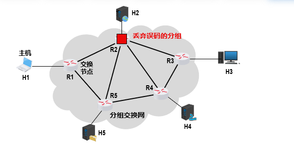

# 计算机网络

> 记录学习计算机网络的知识点，参考书和参考课程来自于慕课

## 第一章概述

互联网(英语:Internet)是指20世纪末期兴起电脑网络与电脑网络之间所串连成的庞大网络系统。这些网络以一些标准的网络协议相连。它是由从地方到全球范围内几百万个私人、学术界、企业和政府的网络所构成，通过电子、无线和光纤网络技术等等一系列广泛的技术联系在一起。互联网承载范围广泛的信息资源和服务，比方说相互关系的超文本文件，还有万维网(WWW)的应用、电子邮件、通话，以及文件共享等个人收发服务。

在计算机网络中，不同名词的意义是不一样的。例如：`internet`表示的是互联网，Internet表示的是因特网。前者表示连接在一起的计算机群，后者表示按照TCP/IP协议链接且是世界上最大的网络链接群。

在一般用途中，我们仅仅讨论因特网。

`ISP`：的全称是`Internet Service Provider`，因特网服务提供者。国内主要由三个通讯公司提供

因特网的草案是面向公众的

管理结构：

组成部分：

### 电路交换，分组交换和报文交换

电路交换(英语:Circuit Switching)是相对于报文交换(或称分组交换)的一个概念。电路交换要求必须首先在通信双方之间建立连接通道。在连接建立成功之后，双方的通信活动才能开始。通信双方需要传递的信息都是通过已经建立好的连接来进行传递的，而且这个连接也将一直被维持到双方的通信结束。在某次通信活动的整个过程中，这个连接将始终占用着。连接建立开始时，通信系统分配给它的资源(通道、带宽、时隙、码字等等)，这也体现了电路交换区别于报文交换的本质特征。

电路交换的步骤是：建立链接 -> 通话-> 释放链接

个人理解这个突发式，是一段一段的。类似于我们聊天，都是聊一段沉默一段这样子。

在计算机网络和通信中，[分组交换](https://zh.wikipedia.org/wiki/%E5%88%86%E7%BB%84%E4%BA%A4%E6%8D%A2)(英语:Packet switching)是一种相对于电路交换的通信范例，分组(又称消息、或消息碎片)在节点间单独路由，不需要在传输前先建立通信路径。
分组交换是数据通信中一种新的且重要的概念，现在是世界上互联网通信、数据和语音通信中最重要的基础。在此之前，数据通信是基于电路交换的想法，就像在传统的电话电路一样，在通话前先建立专有线路，通信双方要在电路的两端。
分组交换技术是在1960年代末出现的，当时美国高级研究计划局(简称ARPA)为实现远程计算机之间的信息交换，资助建设一个试验性的网络，该网络被称为ARPANET(阿帕网)。阿帕网的主要研究成果之一就是开发一种新的网络协议，在阿帕网上对话必须使用这种网络协议。该协议采用一种新的网络信息传输技术，这就是分组交换技术。

发送到目的地的方式类似于图算法

优缺点：

报文交换(英语:Message switching)，又称存储转发交换，是数据交换的三种方式之一，报文整个地发送，一次一跳。报文交换是分组交换的前身，是由莱昂纳多·克莱洛克于1961年提出的。报文交换的主要特点是:

- 存储接受到的报文，判断其目标地址以选择路由，最后，在下一跳路由空闲时，将数据转发给下一跳路由。报文交换系统现今都由分组交换或电路交换网络所承载。
- 每一条报文都作为互不相干的实体进行处理。每一条报文都包含地址信息，一次交换后，报文中的信息会被读取并且下一次交换的传输路径将被确定。
- 根据网络状况，通信选择的传输路径也会不同。每一条报文都会在下一次交换前被存储(在硬盘上存储时，会受到RAM的限制)。

> 电路交换 - > 报文交换 -> 分组交换

### 计算机网络的定义和分类

[计算机网络](https://zh.wikipedia.org/wiki/%E8%AE%A1%E7%AE%97%E6%9C%BA%E7%BD%91%E7%BB%9C)（英语：computer network），通常简称为网络，是指容许节点分享资源的数字电信网络。在计算机网络中，计算机设备通过节点之间的连接（数据链路）相互交换数据，即收发（接收和发放）网络信息。

网络的分类分为五类：交换方式，使用者，传输介质，覆盖范围，拓扑结构

### 计算机网络[性能指标](https://zh.wikipedia.org/wiki/%E7%BD%91%E7%BB%9C%E6%80%A7%E8%83%BD)

宽带(英语:Broadband)在基本电子和电子通信上，是描述电子线路能够同时处理较宽的频率范围。宽带是一种相对的描述方式，频带的范围愈大，也就是带宽愈高时，能够发送的资料也相对增加。譬如说在无线电通信上，频率范围比较窄的带宽只能发送摩尔斯电码，发送高质量的音乐就需要较大的带宽。电视天线的宽带代表能够接收数量较多的频道。在资料发送方面，同样是以电话线作为信号传递的介质，目前光纤电缆则愈来愈普及，拨号上网最快速度仅为`56Kbps`，宽带的`ADSL`和`光纤能`够提供更高的发送速率，

吞吐量：在如以太网及数据包无线电之类的电信网络之中，吞吐量或网络吞吐量是指于一通信通道上单位时间能成功传递的平均资料量，资料可以于实体或逻辑链接上传递，或通过某个网络节点。吞吐量的单位通常表示为比特每秒(bit/s或bps)，有时也可看到数据包每秒或数据包每时隙等单位。系统吞吐量或汇集吞吐量是指于一网络内单位时间所有终端传递的资料量的总和。吞吐量可以用等候理论作数学上的分析。其中，单位时间的数据包负戴标示为到达率入，而单位时间的数据包吞吐量则标示为离开率u。吞吐量实质上同义于数字带宽消耗量。

在计算机网络中进行分组交换，分组从一台主机(源)，通过一系列路由器传输，在另一台主机(目的地)结束它的进程。当分组从一个节点(主机或路由器)沿着这条路径到后继结点(主机或路由器)时该分组在沿途的每个节点都经受了几种不同类型的[时延](https://zh.wikipedia.org/wiki/%E6%97%B6%E5%BB%B6)(Delay)

[带宽时延乘积](https://zh.wikipedia.org/wiki/%E5%B8%A6%E5%AE%BD%E6%97%B6%E5%BB%B6%E4%B9%98%E7%A7%AF)（Bandwidth-Delay Product, BDP）在数据通信中是一个关键指标，反映了一个网络链路在任何给定时间内可以承载的最大数据量。具体而言，BDP是网络的带宽（以比特每秒为单位）与端到端延迟（以秒为单位）的乘积，结果以比特或字节表示。这一概念对于理解和优化高效数据传输尤其重要。

网络往返时间

利用率：

丢包率：

### 计算机网络体系结构

流程：

## 第二章物理层

物理层(Physical Layer)是计算机网络OSI模型中最低的一层，也是最基本的一层。简单的说，网络的物理层面确保原始的数据可在各种物理媒体上传输。
物理层规定:为传输数据，需要物理链路与设备的建立、维持、拆除，并具有机械的、电子的、功能的、规范的特性。局域网与广域网皆属第1、2层。

### 传播媒体

导向型传播媒体(这里指的是线)

非导向型传播媒体(这里指的是[电磁波](https://zh.wikipedia.org/wiki/Wi-Fi))

(激光和可见光是未来技术)

### [传输方式](https://zh.wikipedia.org/wiki/%E9%80%9A%E4%BF%A1)

在远程通信和计算机科学中，串行通信(英语:Serial communication)是指在计算机总线或其他数据通道上，每次传输一个比特数据，并连续进行以上单次过程的通信方式。与之对应的是并行通信，它在串行端口上通过一次同时传输若干比特数据的方式进行通信。串行通信被用于长距离通信以及大多数计算机网络，在这些应用场合里，电缆和同步化使并行通信实际应用面临困难。凭借着其改善的信号完整性和传播速度，串行通信总线正在变得越来越普遍，甚至在短程距离的应用中，其优越性已经开始超越并行总线不需要串行化组件(serializer)，并解决了诸如时钟偏移(Clock skew)、互联密度(interconnect density)等缺点。PCI到PCIExpress的升级就是其中一个例子。

同步传输和异步传输的[差异](https://www.yiibai.com/geek/303391)

### 编码与调制

编码是信息从一种形式或格式转换为另一种形式的过程；解码则是编码的逆过程。

调制(英语:modulation)是一种将一个或多个周期性的载波混入想发送之信号的技术，常用于无线电波的传播与通信、利用电话线的数据通信等各方面。依调制信号的不同，可区分为数字调制及模拟调制，这些不同的调制，是以不同的方法，将信号和载波合成的技术。调制的逆过程叫做“解调'”，用以解出原始的信号。

码元，在传输中扮演者什么角色

正交振幅调制([qam](https://info.support.huawei.com/info-finder/encyclopedia/zh/QAM.html))

### [信道极限容量](https://zh.wikipedia.org/wiki/%E4%BF%A1%E9%81%93%E5%AE%B9%E9%87%8F)

在电气工程学、计算机科学、信息论中，信道容量(Channel capacity，又译通道容量)是指在一个信道中能够可靠地传送信息时可达速率的最小上界。所谓可靠传输指的是可以以任意小的错误率传递信息。根据有噪信道编码定理，信道容量是可以误差概率任意小地达到的给定信道的极限信息率。信道容量的单位为比特每秒、奈特每秒等等。

 香农在第二次世界大战期间发展出信息论，为信道容量提了定义，并且提供了计算信道容量的数学模型。香农指出，信道容量是信道的输入与输出的互信息量的最大值，而相应的输入分布称为最佳输入分布

怎么样拆解和叠加不同的波呢([傅里叶变换](https://zh.wikipedia.org/wiki/%E5%82%85%E9%87%8C%E5%8F%B6%E5%8F%98%E6%8D%A2))

#### 奈氏法则

#### 香农公式

### 信道复用

[频分多路复用](https://zh.wikipedia.org/wiki/%E9%A2%91%E5%88%86%E5%A4%9A%E8%B7%AF%E5%A4%8D%E7%94%A8)(Frequency-division multiplexing FDM)，也叫分频多工，是一种将多路基带信号调制到不同频率载波上再进行叠加形成一个复合信号的多路复用技术。

频分复用的所有用户同时占用不同的频带资源并行通信

[时分多路复用](https://zh.wikipedia.org/wiki/%E6%97%B6%E5%88%86%E5%A4%9A%E8%B7%AF%E5%A4%8D%E7%94%A8)(Time·Division Multiplexing，TDM)是一种数字或者模拟(较罕见)的多路复用技术。使用这种技术，两个以上的信号或数据流可以同时在一条通信线路上传输，其表现为同一通信信道的子信道。但在物理上来看，信号还是轮流占用物理通道的。时间域被分成周期循环的一些小段，每段时间长度是固定的，每个时段用来传输一个子信道。例如子信道1的采样，可能是字节或者是数据块，使用时间段1，子信道2使用时间段2，等等。一个TDM的帧包含了一个子信道的一个时间段，当最后一个子信道传输完毕，这样的过程将会再重复来传输新的帧，也就是下个信号片段。

[波分复用](https://zh.wikipedia.org/wiki/%E6%B3%A2%E5%88%86%E5%A4%8D%E7%94%A8)(Wavelength Division Multiplexing，WDM)是利用多个激光器在单条光纤上同时发]送多束不同波长激光的技术。每个信号经过数据(文本、语音、视频等)调制后都在它独有的色带内传输。WDM 能使电话公司和其他运营商的现有光纤基础设施容量大增。

[码分多址](https://zh.wikipedia.org/wiki/%E5%88%86%E7%A2%BC%E5%A4%9A%E9%87%8D%E9%80%B2%E6%8E%A5)(英语:Code Division Multiple Access，即:CDMA)或分码多重进接、码分复存，是一种多址接入的无线通信技术。CDMA最早用于军用通信，但时至今日，已广泛应用到全球不同的民用通信中。在CDMA移动通信中，将语音频号转换为数字信号，给每组数据语音分组增加一个地址，进行扰码处理然后将它发射到空中。CDMA最大的优点就是相同的带宽下可以容纳更多的呼叫，而且它还可以随语音传送数据信息。

