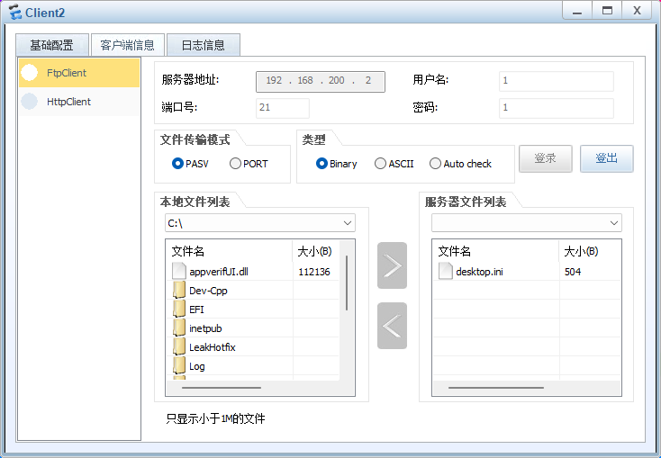

# ensp实现校园网

> 跟着b站上的一个视频制作的，新手多多包含

## 实现结果预览

目的是实现一个校园网，这里是拓扑图预览。目的是要让

- 内网访问到DMZ和外网区域。
- DMZ访问到外网区域
- 外网能访问到DMZ区域(这里不知道为什么无法实现 )
- 外网不能访问内网


实现所使用到的技术有：动态主机配置协议（DHCP），多生成树协议（MSTP），动态路由协议（OSPF），访问控制列表（ACL），双机热备份协议（VRRP），网络地址转换协议（NAT），防火墙的配置，无线AC，AP 的配置，VLAN划分，IP地址划分

具体实现截图如下：

- 教学楼ping外网


- 教学楼ping dmz

  

- 教学楼访问服务器

  

  

  

  

  - 教学楼访问外网服务器

    

- 外网访问DMZ，这个实现不了我也不知道为什么
- DMZ访问外网，这个也实现不了，估计是NAT服务没有配置成功

## 实现过程中的相关配置

### 汇聚层接口配置

#### 配置汇聚层交换机core-1

- 在核心交换机中分置`vlan`

```ensp
vlan batch 5 7 10 20 30 40 50 60 100 to 101
```

##### 配置VRRP

配置一下`VRRP`，命名为10实例。VRRP的作用是确保在主路由器出现故障时，网络服务不会中断。

- 对`VLAN10`进行配置

```ensp
interface Vlanif10
 ip address 192.168.10.254 255.255.255.0
 vrrp vrid 10 virtual-ip 192.168.10.252
 vrrp vrid 10 priority 120
 vrrp vrid 10 track interface GigabitEthernet0/0/2
 vrrp vrid 10 track interface GigabitEthernet0/0/1
```

- 对`vlan20`进行配置

```
interface Vlanif20
 ip address 192.168.20.254 255.255.255.0
 vrrp vrid 20 virtual-ip 192.168.20.252
 vrrp vrid 20 priority 120
 vrrp vrid 20 track interface GigabitEthernet0/0/1
 vrrp vrid 20 track interface GigabitEthernet0/0/2
```

- 对`vlan30`进行配置

```
interface Vlanif40
 ip address 192.168.40.254 255.255.255.0
 vrrp vrid 40 virtual-ip 192.168.40.252
 vrrp vrid 40 priority 120
 vrrp vrid 40 track interface GigabitEthernet0/0/1
 vrrp vrid 40 track interface GigabitEthernet0/0/2
```

- 对`vlan40`

```
interface Vlanif40
 ip address 192.168.40.254 255.255.255.0
 vrrp vrid 40 virtual-ip 192.168.40.252
 vrrp vrid 40 priority 120
 vrrp vrid 40 track interface GigabitEthernet0/0/1
 vrrp vrid 40 track interface GigabitEthernet0/0/2
```

- 对`vlan50`

```
interface Vlanif50
 ip address 192.168.50.254 255.255.255.0
 vrrp vrid 50 virtual-ip 192.168.50.252
 vrrp vrid 50 track interface GigabitEthernet0/0/1
 vrrp vrid 50 track interface GigabitEthernet0/0/2
```

- 对于`vlan60`

```
interface Vlanif60
 ip address 192.168.60.254 255.255.255.0
 vrrp vrid 60 virtual-ip 192.168.60.252
 vrrp vrid 60 track interface GigabitEthernet0/0/2
 vrrp vrid 60 track interface GigabitEthernet0/0/1
```

##### 其它配置

对于`vlan100`区域进行配置ip，为后续`ac`做准备

```
interface Vlanif100
 ip address 192.168.100.254 255.255.255.0
```

同时配置12端口，对vlan101的流量


```
port trunk allow-pass 
```

对向上的两个端口进行配置`vlan`方便后续向上传输流量，同时对进出流量打上标签

```
interface GigabitEthernet0/0/1
 port link-type access
 port default vlan 5

interface GigabitEthernet0/0/2
 port link-type access
 port default vlan 7
```


配置`trunk`规则，实现链路聚合

```
interface Eth-Trunk1
 port link-type trunk
 port trunk allow-pass vlan 2 to 4094
```


同时，对于每一个接口都执行`trunk`命令进行配置，实现汇聚层的功能

```
int g0/0/0 ## 接口
port link-type trunk
port trunk allow-pass vlan all
```

对于其它端口实现这个规则，这里的`port trunk allow-pass vlan 2 to 4094` 和规则`eth-trunk 1` 是一样的

```
# 链路聚合
interface GigabitEthernet0/0/3
 eth-trunk 1
#
interface GigabitEthernet0/0/4
 port link-type trunk
 port trunk allow-pass vlan 2 to 4094
#
interface GigabitEthernet0/0/5
 port link-type trunk
 port trunk allow-pass vlan 2 to 4094
#
interface GigabitEthernet0/0/6
 port link-type trunk
 port trunk allow-pass vlan 2 to 4094
#
interface GigabitEthernet0/0/7
 port link-type trunk
 port trunk allow-pass vlan 2 to 4094
#
interface GigabitEthernet0/0/8
 port link-type trunk
 port trunk allow-pass vlan 2 to 4094
#
interface GigabitEthernet0/0/9
 port link-type trunk
 port trunk allow-pass vlan 2 to 4094
#
interface GigabitEthernet0/0/10
 port link-type trunk
 port trunk allow-pass vlan 2 to 4094
# 链路聚合
interface GigabitEthernet0/0/11
 eth-trunk 1
#
```

##### 配置`stp`

```
stp region-configuration
 region-name huawei
 revision-level 5
 instance 1 vlan 10 20 30 100
 instance 2 vlan 40 50 60
 active region-configuration
```

#### 配置汇聚层交换机core-2

先配置`vlan`

```
vlan batch 6 8 10 20 30 40 50 60 100 to 101
```

这里和核心交换机1一样的配置，配置VRRP.

```
#
interface Vlanif6
 ip address 192.168.6.2 255.255.255.0
#
interface Vlanif8
 ip address 192.168.8.2 255.255.255.0
#
interface Vlanif10
 ip address 192.168.10.253 255.255.255.0
 vrrp vrid 10 virtual-ip 192.168.10.252
 vrrp vrid 10 track interface GigabitEthernet0/0/1
 vrrp vrid 10 track interface GigabitEthernet0/0/2
#
interface Vlanif20
 ip address 192.168.20.253 255.255.255.0
 vrrp vrid 20 virtual-ip 192.168.20.252
 vrrp vrid 20 track interface GigabitEthernet0/0/1
 vrrp vrid 20 track interface GigabitEthernet0/0/2
#
interface Vlanif30
 ip address 192.168.30.253 255.255.255.0
 vrrp vrid 30 virtual-ip 192.168.30.252
 vrrp vrid 30 track interface GigabitEthernet0/0/1
 vrrp vrid 30 track interface GigabitEthernet0/0/2
#
interface Vlanif40
 ip address 192.168.40.253 255.255.255.0
 vrrp vrid 40 virtual-ip 192.168.40.252
 vrrp vrid 40 track interface GigabitEthernet0/0/1
 vrrp vrid 40 track interface GigabitEthernet0/0/2
#
interface Vlanif50
 ip address 192.168.50.253 255.255.255.0
 vrrp vrid 50 virtual-ip 192.168.50.252
 vrrp vrid 50 track interface GigabitEthernet0/0/2
 vrrp vrid 50 track interface GigabitEthernet0/0/1
#
interface Vlanif60
 vrrp vrid 60 virtual-ip 192.168.60.252
 vrrp vrid 60 track interface GigabitEthernet0/0/1
 vrrp vrid 60 track interface GigabitEthernet0/0/2
#
```

配置`trunk`规则，实现链路聚合

```
interface Eth-Trunk1
  port link-type trunk
  port trunk allow-pass vlan 2 to 4094
```

这里两个特殊位置用了`eth-trunk 1`

```
#
interface GigabitEthernet0/0/1
 port link-type access
 port default vlan 6
#
interface GigabitEthernet0/0/2
 port link-type access
 port default vlan 8
# 链路聚合
interface GigabitEthernet0/0/3
 eth-trunk 1
#
interface GigabitEthernet0/0/4
#
interface GigabitEthernet0/0/5
 port link-type trunk
 port trunk allow-pass vlan 2 to 4094
#
interface GigabitEthernet0/0/6
 port link-type trunk
#
interface GigabitEthernet0/0/7
 port link-type trunk
 port trunk allow-pass vlan 2 to 4094
#
interface GigabitEthernet0/0/8
 port link-type trunk
 port trunk allow-pass vlan 2 to 4094
#
interface GigabitEthernet0/0/9
 port link-type trunk
 port trunk allow-pass vlan 2 to 4094
#
interface GigabitEthernet0/0/10
 port link-type trunk
 port trunk allow-pass vlan 2 to 4094
# 链路聚合
interface GigabitEthernet0/0/11
 eth-trunk 1
#
```

### 接入层接口配置

> 这里就配置一个教学楼的配置作为例子，其它交换机的配置和第一个是一样的，只不过端口不通

接入层的接口配置6个`vlan`区域，分别是

- 教学楼

​     教学楼分配的`vlan`是10，指定的ip区域是`192.168.10.0/24`

- 办公室

  ​ 办公楼分配的`vlan`是20，指定的ip区域是`192.168.20.0/24`

- 图书馆

  ​ 办公楼分配的`vlan`是30，指定的ip区域是`192.168.30.0/24`

- 宿舍楼

  ​ 办公楼分配的`vlan`是40，指定的ip区域是`192.168.40.0/24`

- 食堂

  ​ 办公楼分配的`vlan`是50，指定的ip区域是`192.168.50.0/24`

- 体育馆

  ​ 办公楼分配的`vlan`是60，指定的ip区域是`192.168.60.0/24`

#### 配置`stp`

主要功能是防止交换机网络中出现环路。在计算机网络中，环路会导致数据包在网络中无限循环，最终使网络变得不可用。STP通过动态计算出网络拓扑中的一个无环路径，从而保证数据在网络中正确地传输。


```
stp region-configuration
 region-name huawei
 revision-level 5
 instance 1 vlan 10 20 30 100
 instance 2 vlan 40 50 60
 active region-configuration
```

配置命令模板

```
##配置生成树协议stp

vlan ba 10 20 30 40 50 60 100 101
stp enable
stp region-configuration
region-name huawei
revision-level 5
instance 1 vlan 10 20 30 100
instance 2 vlan 40 50 60

active region-configuration
stp instance 1 root primary
stp instance 2 root secondary

## 这里是方便进入端口配置
int e0/0/1
port link-type trunk
port trunk allow-pass vlan all

port link-type access
port default vlan 
```

对于每一个交换机都进行这样的配置，这里以教学楼的配置为例


```
vlan batch 10 20 30 40 50 60 100 to 101

## stp配置
stp region-configuration
 region-name huawei
 revision-level 5
 instance 1 vlan 10 20 30 100
 instance 2 vlan 40 50 60
 active region-configuration
```

接口配置


```
#
interface Ethernet0/0/1
 port link-type trunk
 port trunk allow-pass vlan 2 to 4094
#
interface Ethernet0/0/2
 port link-type trunk
 port trunk allow-pass vlan 2 to 4094
#
interface Ethernet0/0/3
 port link-type access
 port default vlan 10
#
interface Ethernet0/0/4
 port link-type access
 port default vlan 10
#
```

### [配置AC和AP - 这里有问题](https://juejin.cn/post/7167673226330374181)

`ac`接入的是12端口，这里需要对这个端口进行配置。分配一个`vlan`给他

```
#这里的配置是左侧的核心交换机
interface GigabitEthernet0/0/12
 port link-type trunk
 port trunk pvid vlan 101
 port trunk allow-pass vlan 2 to 4094
```


`ac`的配置如下：

- 打开`AC`配置中的`DHCP`

  ```
  dhcp enable
  #
  interface Vlanif100
   ip address 192.168.100.1 255.255.255.0
   dhcp select global
  #
  interface Vlanif101
   ip address 192.168.101.1 255.255.255.0
   dhcp select interface
  ```

- 进入ap，指定了当前AP组使用的规范域配置文件名称为 "huawei-domain"。

  

  - 补充huawei-domain的信息

- 配置指定的MAC

  

- 配置`ssid`

  

- 配置vap

  

> 配置3A认证

### 核心层接口配置

对于路由器所链接的端口全部配上`ip`，然后就可以了。这里起到交换机的作用。


```
#
interface GigabitEthernet0/0/0
 ip address 192.168.5.1 255.255.255.0 
#
interface GigabitEthernet0/0/1
 ip address 192.168.6.1 255.255.255.0 
#
interface GigabitEthernet2/0/0
 ip address 192.168.4.1 255.255.255.0 
#
interface GigabitEthernet2/0/1
 ip address 192.168.2.2 255.255.255.0 
#
```

## 防火墙配置

先将防火墙所有链接的端口配置上ip


```
#
interface GigabitEthernet1/0/0
 undo shutdown
 ip address 192.168.2.1 255.255.255.0
 service-manage http permit
 service-manage https permit
 service-manage ping permit
 service-manage ssh permit
 service-manage snmp permit
 service-manage telnet permit
#
interface GigabitEthernet1/0/1
 undo shutdown
 ip address 192.168.3.1 255.255.255.0
 service-manage http permit
 service-manage https permit
 service-manage ping permit
 service-manage ssh permit
 service-manage snmp permit
 service-manage telnet permit
#
interface GigabitEthernet1/0/2
 undo shutdown
 ip address 200.10.10.1 255.255.255.252
 service-manage http permit
 service-manage https permit
 service-manage ping permit
 service-manage ssh permit
 service-manage snmp permit
 service-manage telnet permit
#
interface GigabitEthernet1/0/3
 undo shutdown
 ip address 192.168.200.1 255.255.255.0
 service-manage http permit
 service-manage https permit
 service-manage ping permit
 service-manage ssh permit
 service-manage snmp permit
 service-manage telnet permit
#
```

还要对各个端口配置(上面后续出现的)

```
service-mamage all permit
```

### 防火墙设定规则

规则如下：

> source-zone是源地址
>
> destination-zone是目的地址

首先要进入防火墙的安全策略，然后创建规则名字就行

> 

```
#
security-policy
 rule name un-dmz
  source-zone untrust
  destination-zone dmz
  action permit
 rule name tr-untr
  source-zone trust
  destination-zone untrust
  action permit
 rule name tr-dmz
  source-zone trust
  destination-zone dmz
  action permit
 rule name dmz-un
  source-zone dmz
  destination-zone untrust
  action permit
#
```

## 配置OSPF

OSPF是一种链路状态路由协议，用于在大型网络中动态确定最佳路径，以便有效地传输数据。

交换机1

```
#
ospf 10
 area 0.0.0.0
  network 192.168.10.0 0.0.0.255
  network 192.168.20.0 0.0.0.255
  network 192.168.30.0 0.0.0.255
  network 192.168.40.0 0.0.0.255
  network 192.168.50.0 0.0.0.255
  network 192.168.60.0 0.0.0.255
  network 192.168.100.0 0.0.0.255
  network 192.168.5.0 0.0.0.255
  network 192.168.7.0 0.0.0.255
#
```

交换机2

```
#
ospf 20
 area 0.0.0.0
  network 192.68.10.0 0.0.0.255
  network 192.168.10.0 0.0.0.255
  network 192.168.20.0 0.0.0.255
  network 192.168.30.0 0.0.0.255
  network 192.168.40.0 0.0.0.255
  network 192.168.60.0 0.0.0.255
  network 192.168.50.0 0.0.0.255
  network 192.168.6.0 0.0.0.255
  network 192.168.8.0 0.0.0.255
#
```

核心路由器1

```
#
ospf 30 
 area 0.0.0.0 
  network 192.168.2.0 0.0.0.255 
  network 192.168.4.0 0.0.0.255 
  network 192.168.5.0 0.0.0.255 
  network 192.168.6.0 0.0.0.255 
#
```

核心路由器2

```
#
ospf 40 
 area 0.0.0.0 
  network 192.168.3.0 0.0.0.255 
  network 192.168.4.0 0.0.0.255 
  network 192.168.7.0 0.0.0.255 
  network 192.168.8.0 0.0.0.255 
#
```

防火墙

```
#
ospf 50
 default-route-advertise always
 area 0.0.0.0
  network 192.168.2.0 0.0.0.255
  network 192.168.3.0 0.0.0.255
  network 192.168.200.0 0.0.0.255
#
```
