## 横版卷轴射击游戏(1)

> 在油管学做的游戏，记录一下以供以后学习

### 项目流程一 准备工作

项目中需要用到URP的组件，URP（Universal Render Pipeline）是Unity中的一种渲染管线，主要用于实现高效的渲染，包括光照、材质、阴影等视觉效果，以支持不同平台的性能优化。这里使用Unity6进行开发，当然你也可以使用油管主的版本。在Unity中选用核心模版(内置URP)，然后创建项目。

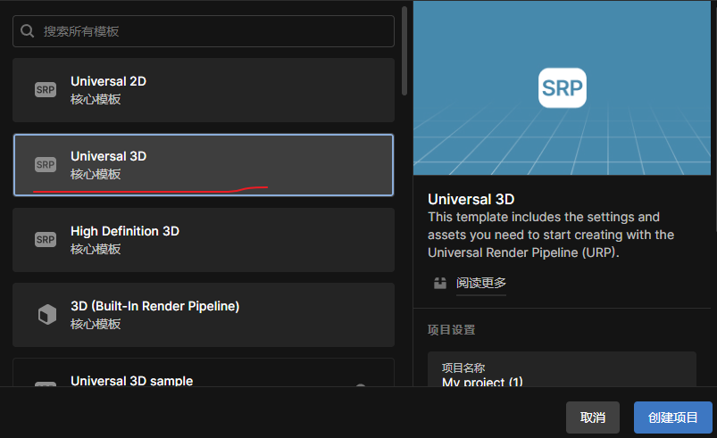

在开始学习之前，需要在Unity中配置一些组件用来帮助接下来的开发，点击`Package Manager`下载插件。

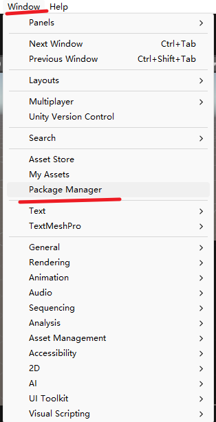

需要下载如下插件，这里因为`Unity6`已经自带就不过多操作

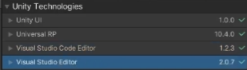

这里简单介绍一下`Packer Manager`常用的有三个窗，默认窗口中存储的是当前项目的所有插件。你可以在这个窗口中，删除或者添加你需要的插件来完成你的开发

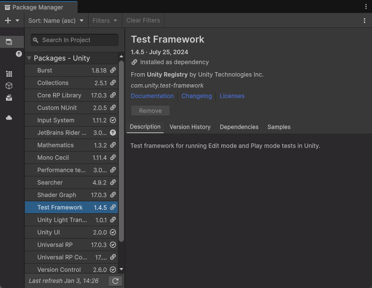

在侧边栏中，第二个窗口的作用是包仓库，可以在这里搜索你需要的插件包然后下载添加到你的项目中

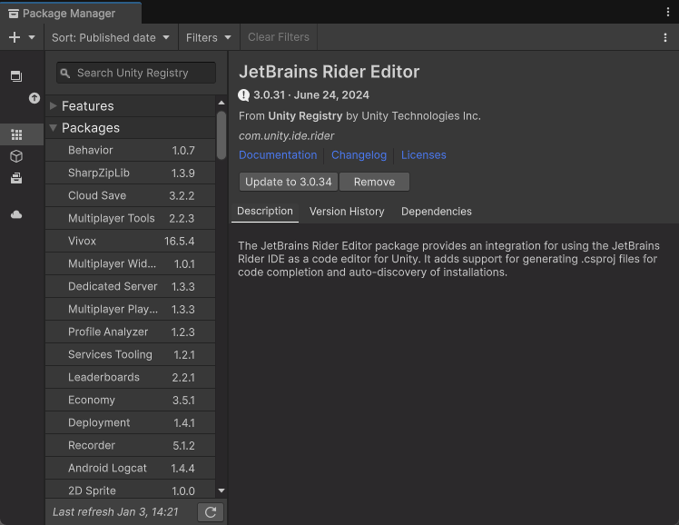

第三个窗口是你在unity商场中购买的素材资源，可以下载然后导入到项目之中

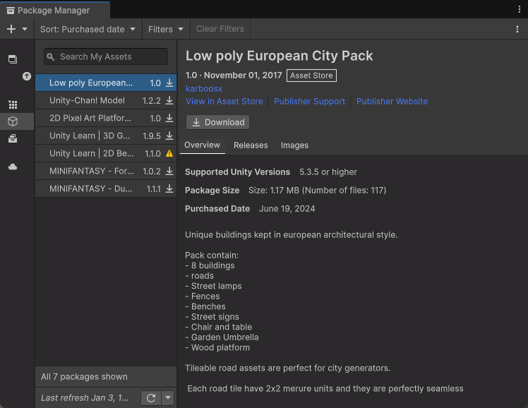

上述流程完成之后，我们导入油管主提供的素材包，将图片拖拽到`Assets`文件夹中

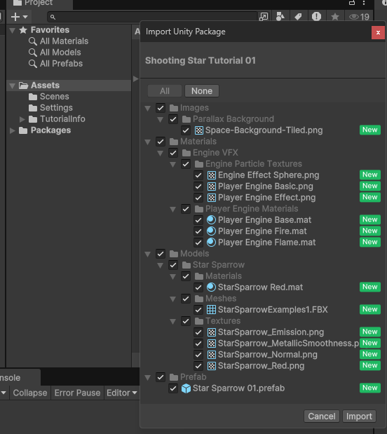

在`Hierarchy`中拖入图片，同时打开`2d`视角，在`3d`工程中制造`2d`效果

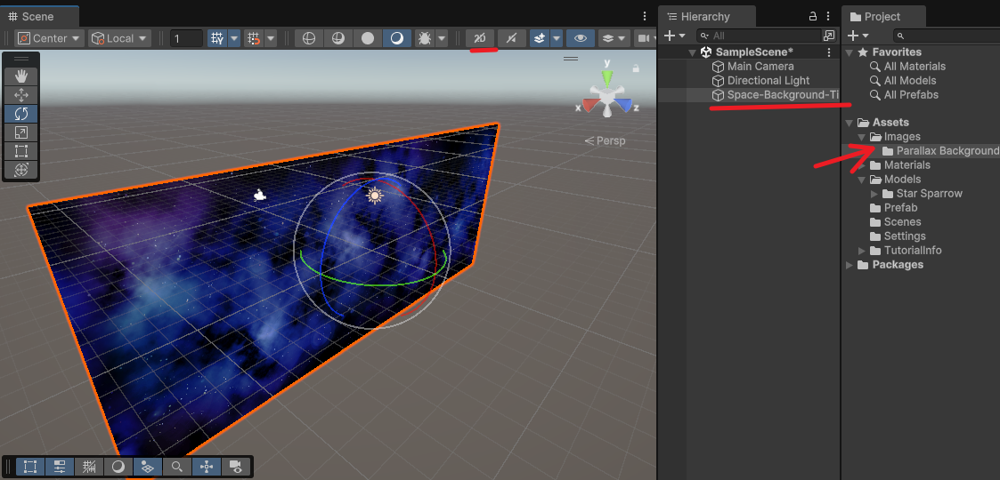

在预制体中，拿出制作好的模型，添加到阶层(`hierarchy`)中，修改主相机的设置，将其观察模式改为正交投影模式，这里摘取AI的解释

1. **Orthographic（正交投影）**:
   - 在正交投影中，物体的大小不会随着距离摄像机的远近而改变，即无论物体距离摄像机多远，它们在屏幕上的大小都保持一致。
   - 这种投影方式常用于`2D`游戏或者需要精确测量距离和大小的场景。
   - 正交投影的摄像机就像是一个无限远的观察者，看到的是一个平面上的图像。
2. **Perspective（透视投影）**:
   - 在透视投影中，物体的大小会随着距离摄像机的远近而改变，即物体越远在屏幕上看起来越小，越近则越大。
   - 这种投影方式模拟了人眼观察世界的方式，提供了深度感和立体感，常用于`3D`游戏和模拟现实世界的场景。
   - 透视投影的摄像机就像是一个有限距离的观察者，看到的是一个锥形区域内的图像。

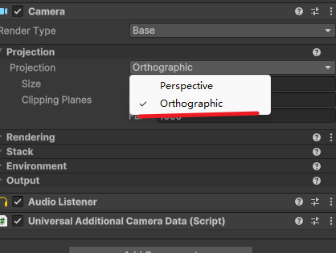

创建多一个次光源，将光源颜色改为蓝色，类似于图片的颜色

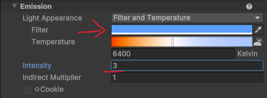

整理一下阶层中的组件，我们建立几个空物体，将插入的组件整理一下，最终效果如下

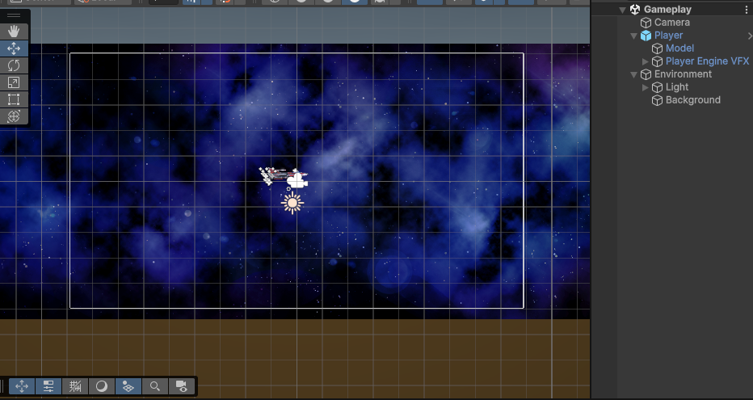

### 项目流程二 制作简易背景卷动

如果单纯将图片堆叠制作地图，那么是非常耗费资源的。可以采用[视差背景系统](https://www.bilibili.com/video/BV1EK4y1r783/?spm_id_from=333.337.search-card.all.click&vd_source=731595967596af37618c926a191e7811)，视频中是使用简易操作实现图片卷轴移动。先将之前的背景图片删除，在阶层下创建一个`3d`的正方形，用于背景图片的承载

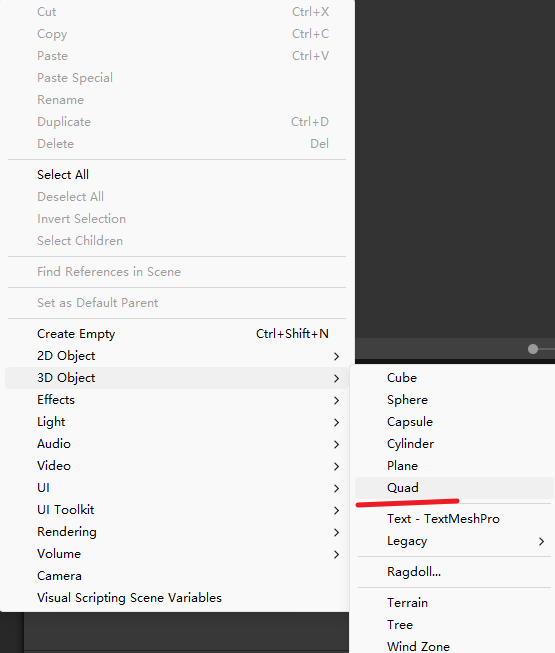

为了适应图片的比例，将新建好的正方形的比例调整，这里图片的比例是`2048*822`的，那么正方形的比例可以调整为`20.48*8.22`。

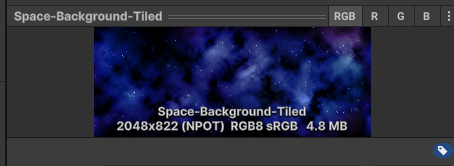

修改`Transform`属性，将它调到合适的比例

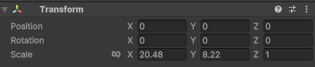

1. **Position（位置）**: 这部分定义了对象在三维空间中的位置。X、Y、Z分别代表沿三个轴（通常是水平、垂直和深度）的位置坐标。在这个例子中，位置坐标都是0，意味着对象位于原点。
2. **Rotation（旋转）**: 这部分定义了对象绕三个轴的旋转角度。同样，X、Y、Z分别代表绕三个轴的旋转。这里显示的旋转值都是0，意味着对象没有旋转。
3. **Scale（缩放）**: 这部分定义了对象在三个维度上的缩放比例。X、Y、Z分别代表沿三个轴的缩放因子。在这个例子中，缩放因子都是1，意味着对象的大小没有变化。

创建一个材质，使用图片制作一个材质球

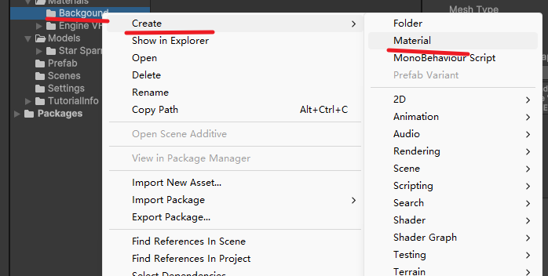

重新打开图片，将其中的`Wrap Mode `修改为`repeat`，这里最好创建一个副本，标注图片的层级为`default`

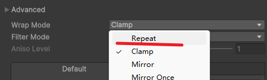

**Wrap Mode**: 这个设置决定了当纹理坐标超出0到1的范围时，纹理如何被应用到`3D`模型上。

- **Repeat**: 纹理会无限重复。如果纹理坐标超出1，它会从纹理的开始重新应用，创建一个无缝的重复效果。这在需要纹理覆盖整个表面而不需要精确对齐时非常有用。
- **Clamp**: 当纹理坐标超出0到1的范围时，纹理会被“夹住”，即超出的部分会显示纹理的边缘颜色。这可以防止纹理重复，适用于需要纹理在边缘平滑过渡的情况。
- **Mirror**: 类似于Repeat，但每次重复时纹理会镜像。这可以创建一个无缝的反射效果，使得纹理在重复时看起来更加自然。
- **Mirror Once**: 与Mirror类似，但只镜像一次，然后重复。这可以用于在纹理的一侧创建镜像效果，而另一侧则正常重复。

在创建好的材质中，选择设置好的图片，然后将这个材质拖入到创建完成的四方体中，这样就创建好了一个材质球。通过材质球中的一个属性，可以控制附加在立方体上面流动的材质

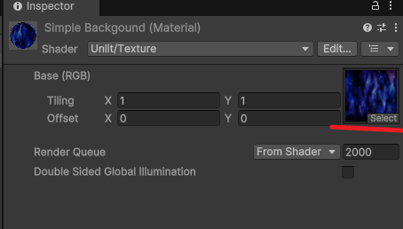

接下来对于这个`offset`属性，创建一个脚本来控制它的增加，实现卷轴滚动的效果

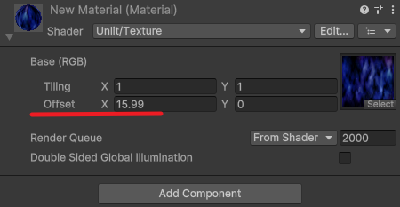

具体的代码名称可以自己命名，这里显示一下主要的代码。需要注意的是`GetComponent<T>()`是一个泛型函数，因此我们需要观察我们调用的组件然后找到对于的类型，一般而言包含着它的名字

```c++
using UnityEngine;

public class New : MonoBehaviour
{
    // 速度变量 控制卷轴滚动速度
    [SerializeField] Vector2 scroVelocity;
	
    public Material material;
    // Start is called once before the first execution of Update after the MonoBehaviour is created
    void Start()
    {
        // 获取对应的材质
        material = GetComponent<Renderer>().material;
    }

    // Update is called once per frame
    void Update()
    {
        material.mainTextureOffset += scroVelocity * Time.deltaTime;
    }
}
```

此时运行就会有滚动效果了

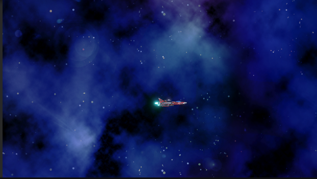

### 项目流程三 控制角色移动

使用`input system`来代替`unity`中的`input`类，使用这个组件的目的是更方便的使用图形化来设置游戏中的按键。更加深层次的了解可以查看这个[网页](https://zhuanlan.zhihu.com/p/670253933)

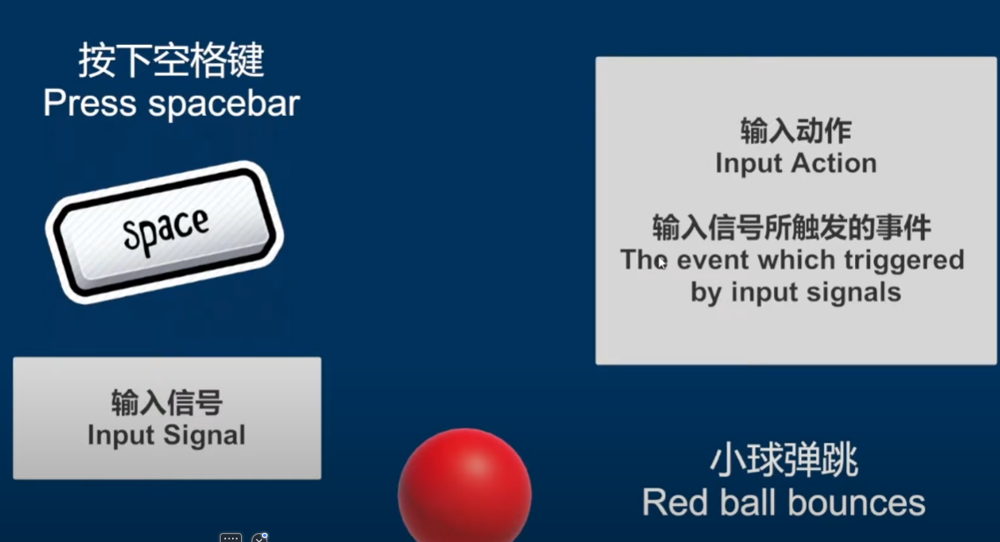

下载完组件之后，创建一个`input`组件，变为如下。左侧是执行动作具体对象名称，右侧是匹配不同输入设备。在右上角的添加按钮中，可以通过监听键盘，手柄输入的方式录入按键。下图的最上方是手柄的配置，下方是键盘和箭头的配置。这里需要注意的是，**命名`input system`的时候不要加空格**

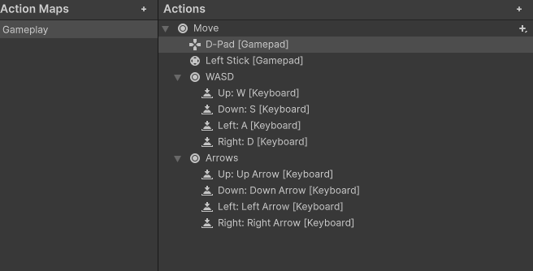

对于设置好的按键，使用脚本语言对其进行控制，在`input system`中有一个自动生成类的按钮点击即可生成对应的按键，通过这个类来编辑对应按钮的函数。

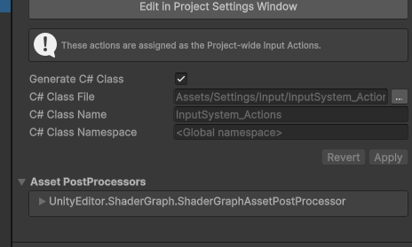

打开创建完成的函数，接下来需要完成各个方位的移动效果。使用继承`onMove`接口的方式实现这个效果

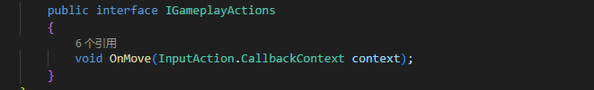

声明一个脚本作为角色行动控制器，执行的控制逻辑是一次输入一次行动。先声明一些准备工作的函数

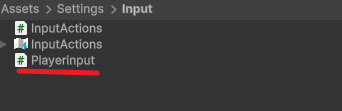

```c#
using UnityEngine;
using UnityEngine.InputSystem;
using UnityEngine.Rendering;

[CreateAssetMenu(menuName = "Player Input")]
public class Playerinput : ScriptableObject, InputActions.IGameplayActions
{

    InputActions inputActions;

    void OnEnable()
    {
        inputActions = new InputActions();
        // 回调事件绑定到当前类的实现方法上
        inputActions.Gameplay.SetCallbacks(this);
    }

    void OnDisable()
    {
        DisableAllInputs();
    }

    public void DisableAllInputs()
    {
        inputActions.Gameplay.Disable();
    }


    public void EnableGameplayInput()
    {
        inputActions.Gameplay.Enable();
        // 隐藏鼠标
        Cursor.visible = false;
        Cursor.lockState = CursorLockMode.Locked;
    }


    public void OnMove(InputAction.CallbackContext context)
    {
        
    }
}
```

`OnEnable` 方法初始化了 `InputActions` 实例，并将当前类的方法绑定为输入事件的回调函数，以响应玩家的输入操作。 **回调函数**就是一个通过[函数指针](https://baike.baidu.com/item/函数指针)调用的函数。如果你把函数的[指针](https://baike.baidu.com/item/指针)（地址）作为[参数传递](https://baike.baidu.com/item/参数传递)给另一个函数，当这个指针被用来调用其所指向的函数时，就说这是回调函数。回调函数不是由该函数的实现方直接调用，而是在特定的事件或条件发生时由另外的一方调用的，用于对该事件或条件进行响应。**通俗点讲就是讲某个实现函数作为参数传入另一个函数中去，当然我们可以通过委托接口等其他一些手段实现这种方式。**

根据点击动作的执行定义，点击动作就是通过一系列输入来触发一些时间，所以在这个游戏逻辑中点击`wasd`用来触发不同的事件，从而来实现移动。利用Unity自带的Events，来声明几个触发必要的事件。

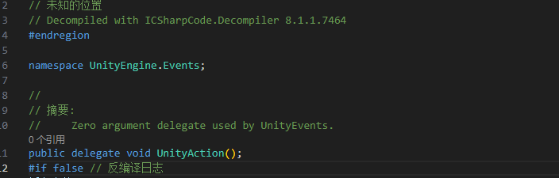

在图中可以看到，Unity 自带的 **Events** 实际上是委托的一种形式。在 C# 中，**委托** 是一种类型安全的函数指针，它允许将方法作为参数传递或赋值给变量，从而实现动态调用方法的功能。简而言之，委托使得我们可以在运行时选择并调用不同的方法，而不必在编译时确定调用的具体方法。

**事件** 是基于委托的特殊机制，通常用来表示某个特定动作或事件的发生。当事件被触发时，多个方法（即事件处理程序）会被自动调用，从而实现响应该事件的功能。通过结合委托和事件，我们可以实现 **事件订阅** 这一设计模式，允许对象在事件发生时通知其他对象，进而触发相应的处理逻辑。

```c#
using UnityEngine;
using UnityEngine.Events;
using UnityEngine.InputSystem;
using UnityEngine.Rendering;

[CreateAssetMenu(menuName = "Player Input")]
// ScriptableObject 用于创建可以在 Unity 编辑器 中作为资产（asset）保存的对象
public class Playerinput : ScriptableObject, InputActions.IGameplayActions
{

    InputActions inputActions;
    // 点击后触发的事件
    public event UnityAction<Vector2> onMove = delegate{};
    public event UnityAction onStop = delegate{};

    void OnEnable()
    {
        inputActions = new InputActions();
        // 回调事件绑定到当前类的实现方法上
        inputActions.Gameplay.SetCallbacks(this);
    }

    void OnDisable()
    {
        DisableAllInputs();
    }

    public void DisableAllInputs()
    {
        inputActions.Gameplay.Disable();
    }


    public void EnableGameplayInput()
    {
        inputActions.Gameplay.Enable();
        // 隐藏鼠标
        Cursor.visible = false;
        Cursor.lockState = CursorLockMode.Locked;
    }


    public void OnMove(InputAction.CallbackContext context)
    {
        // context 输入文本
        if(context.phase == InputActionPhase.Performed)
        {
            // invoke是执行委托的方法 是调用的意思
            onMove.Invoke(context.ReadValue<Vector2>());
        }

        if(context.phase == InputActionPhase.Canceled)
        {
            onStop.Invoke();
        }
    }
}
```

这样就可以简单地实现点击触发事件的效果。接下来，创建一个玩家类，用于订阅上述事件。在之前的代码中，我们实例化了 `Input` 类，因此可以通过 Unity 提供的组件插入方式来继承 `Input` 类的方法，并进行重写。首先，创建玩家类，并在该类中重写相关方法，以实现具体的事件响应逻辑。

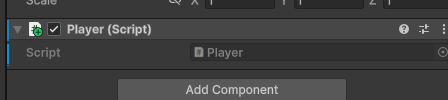

通过前面一个脚本中的`[CreateAssetMenu(menuName = "Player Input")]`代码，得以在unity中创建关于这个类的文件。

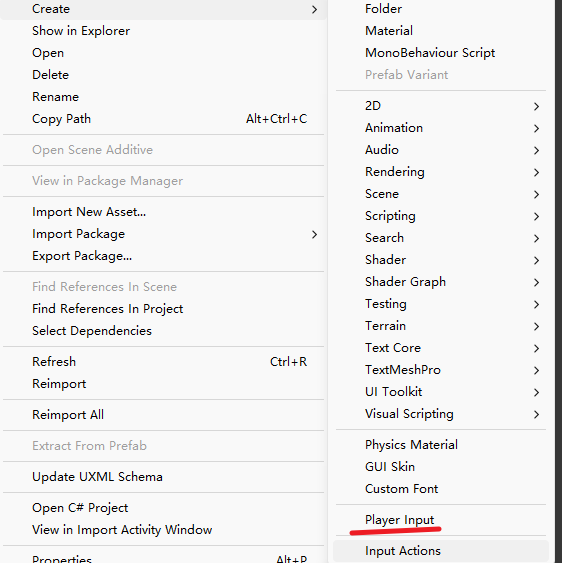

通过文件挂载在设备上的方式实现订阅。

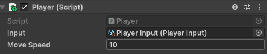

```c#
using UnityEngine;
using UnityEngine.InputSystem;
using UnityEngine.Scripting.APIUpdating;

[RequireComponent(typeof(Rigidbody2D))]
public class Player : MonoBehaviour
{
    // 挂载 PlayerInput 组件方式实现订阅
    [SerializeField] PlayerInput input;
    [SerializeField] float moveSpeed = 10f;

    new Rigidbody2D rigidbody;

    [System.Obsolete]
    void OnEnable()
    {   
        input.onMove += Move;
        input.onStopMove += StopMove;
    }

    [System.Obsolete]
    void OnDisable()
    {
        input.onMove -= Move;
        input.onStopMove -= StopMove;
    }


    void Start()
    {
        rigidbody = GetComponent<Rigidbody2D>(); // 初始化 rigidbody
        if (rigidbody == null)
        {
            Debug.LogError("Rigidbody2D component is missing!");
        }
        input.EnableGameplayInput();
    }

    [System.Obsolete]
    void Move(Vector2 moveInput)
    {
        rigidbody.velocity = moveInput * moveSpeed;
    }

    void StopMove()
    {


    }
}
```

通过函数的继承以及实现刚体的初始化，得以实现物体的移动。还有停止移动的等到下一篇博客再做。

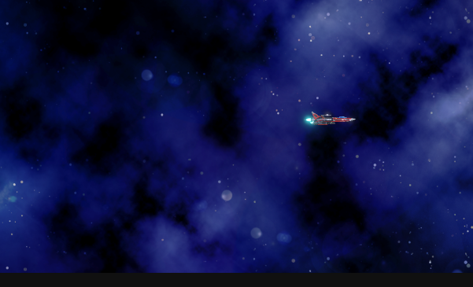
