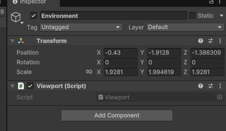
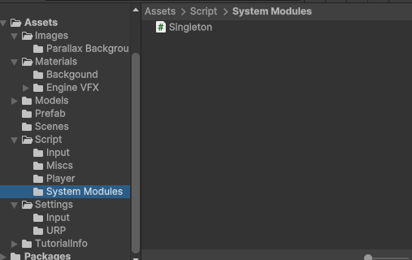
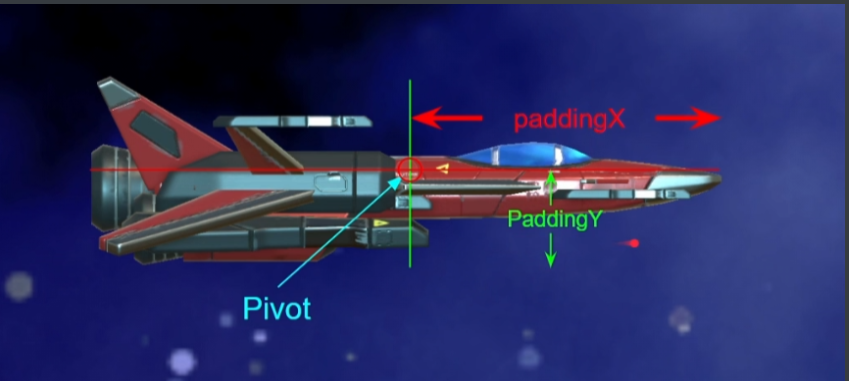
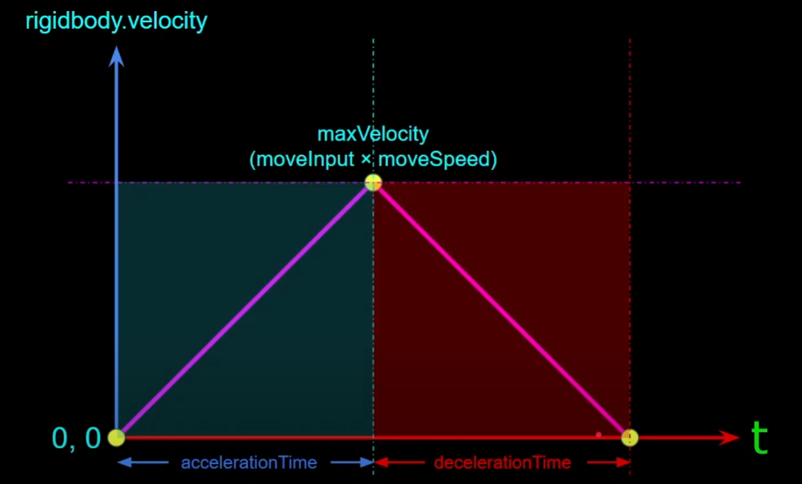
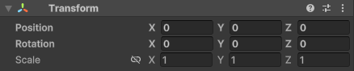

## 横版移动射击游戏(2)

### 项目流程三-限制视窗

在之前的项目流程(3)中，实现了主角的移动效果。但是出现玩家移动到镜头外面的情况，可以通过限制玩家的移动效果来达到。这里通过单例的方式，创建一个脚本用来控制`environment`



为了解耦和复用，创建一个类供给`viewport`来继承，通过这个类，可以在创建对象时自动生成一个 `instance` 对象。继承该类的子类，，在创建对象时也能拥有一个 `instance` 对象实现了单例的效果。使用**泛型单例**模式的最大优势之一就是，它**自动管理单例实例**，这样你就无需在主程序或其他地方手动创建 `Instance` 对象了。



```c#
using UnityEngine;

public class Singleton<T> : MonoBehaviour where T : Component
{
    // 声明属性
    public static T Instance { get; private set;}

    protected virtual void Awake()
    {
        Instance = this as T;
    }
}

```

然后在挂载的`environment`中编写程序，根据下面的模型图，编写了限制范围。



在 Unity 中，搭载了 **Transform** 组件的对象具有以下属性：

1. **Pivot（旋转中心点）**：

   `Pivot` 是 3D 模型旋转的中心点。在 `Unity `中，你可以设置模型的 `Pivot` 点，模型将围绕此点进行旋转。图中绿色线标出的是飞机模型的旋转中心。

2. **PaddingX**：

   `PaddingX `是指在 X 轴方向上增加的填充距离。在使用物理引擎或碰撞检测时，可能需要在模型边界之外增加一定的空间，以避免模型之间的穿透或提高物理交互的稳定性。图中用红色箭头表示了 X 轴方向的填充距离。

3. **PaddingY**：

   `PaddingY `是指在 Y 轴方向上增加的填充距离。与 `PaddingX `类似，它用于在 Y 轴方向上增加额外的空间，从而提高物理交互的稳定性。图中用绿色箭头表示了 Y 轴方向的填充距离。

```c#
using UnityEngine;
using UnityEngine.UIElements;

public class Viewport: Singleton<Viewport>
{
    // 定义限制窗口

    float minX;

    float maxX;

    float minY;

    float maxY;

    // 初始化限定世界位置
    void Start()
    {
        Camera mainCamera = Camera.main;

        Vector2 bottomLeft = mainCamera.ViewportToWorldPoint(new Vector3(0f,0f));
        Vector2 topRight = mainCamera.ViewportToWorldPoint(new Vector3(1f,1f));

        minX = bottomLeft.x;
        minY = bottomLeft.y;
        maxX = topRight.x;
        maxY = topRight.y;
    }

    public Vector3 PlayerMoveablePosition(Vector3 playerPosition, float paddingX, float paddingY)
    {
        Vector3 position = Vector3.zero;

        position.x = Mathf.Clamp(playerPosition.x, minX + paddingX, maxX - paddingX);
        position.y = Mathf.Clamp(playerPosition.y, minY + paddingY, maxY - paddingY);

        return position;
    }

}
```

在`player`中调用上面声明的对象，将设置好的变量带入到函数之中。这段代码通过使用协程实现了一个无限循环的过程，用于实时获取当前对象的位置并对其进行限制。具体来说，这个协程在每一帧更新物体的位置，以确保它始终位于允许的范围内。

协程的作用是在 Unity 中实现**延时操作**或**分步执行**，并且**不阻塞主线程**。它允许你在多个时间点之间暂停执行某些任务，并在合适的时候恢复执行。常用于处理时间相关的操作，如动画、等待、异步任务等。想象你在一个银行排队办理业务。排队的过程就像是协程的执行：

1. **排队（协程开始）**：你排队等待办理业务，但你不会一直站着不动。你可以在排队时做其他事，比如看看手机或和旁边的人聊天，这就类似于协程中“暂停”执行的状态。
2. **等待（暂停执行）**：假设有些事务需要时间，比如银行工作人员在为前一个客户办理业务，你只能站在那里等待。这时，虽然你在等待，但并没有浪费时间，其他事情（比如其他客户办理业务）仍在继续进行。协程也会在“等待”某些条件时暂停，并允许其他代码执行。
3. **被叫到窗口（继续执行）**：当轮到你办理业务时，银行工作人员叫你过去，你继续处理自己的事务。此时，你的操作就像是协程恢复执行，继续完成接下来的任务。
4. **业务完成（协程结束）**：一旦业务完成，你可以离开排队。协程也是如此，完成所有操作后自然结束。

```c#
using System.Collections;
using UnityEngine;
using UnityEngine.InputSystem;
using UnityEngine.Scripting.APIUpdating;

[RequireComponent(typeof(Rigidbody2D))]
public class Player : MonoBehaviour
{
    [SerializeField] PlayerInput input;
    [SerializeField] float moveSpeed = 10f;
    // 声明的这几个来约束玩家移动的位置
    [SerializeField] float paddingX;
    [SerializeField] float paddingY;

    new Rigidbody2D rigidbody; 

    [System.Obsolete]
    void OnEnable()
    {   
        input.onMove += Move;
        input.onStopMove += StopMove;
    }

    [System.Obsolete]
    void OnDisable()
    {
        input.onMove -= Move;
        input.onStopMove -= StopMove;
    }


    void Start()
    {
        rigidbody = GetComponent<Rigidbody2D>(); 
        rigidbody.gravityScale = 0f;

        input.EnableGameplayInput();
    }

	// 调用协程
    [System.Obsolete]
    void Move(Vector2 moveInput)
    {
        rigidbody.velocity = moveInput * moveSpeed;
        StartCoroutine(MovePositionLimitCoroutine());
    }
	// 调用协程
    [System.Obsolete]
    void StopMove()
    {
        rigidbody.velocity = Vector2.zero;
        StopCoroutine(MovePositionLimitCoroutine());

    }
    
    IEnumerator MovePositionLimitCoroutine()
    {
        while(true)
        {
            transform.position = Viewport.Instance.PlayerMoveablePosition(transform.position, paddingX, paddingY);
            // 暂停执行当前方法
            yield return null;
        }
    }

}
```

### 项目流程四-更改加速逻辑

在上述流程中，我们的加速逻辑存在一些问题，主要表现为速度的突变。为了更符合现实物理规律，速度不应突变，因此我们应该采用加速度来衡量运动的变化。在现实世界中，物体的速度变化是连续的，不会出现突变。为了实现平滑的加速效果，我们可以使用 `lerp` 函数，通过线性插值来平滑地调整加速度，从而避免速度的突变。



在上面的代码中，我们定义了加速时间和减速时间，并规定在一定的过渡时间后才能达到最大加速度。我们使用协程来平滑地干预战机的加速度变化。使用协程的主要目的是便于状态切换。例如，当战机正在向上飞行时，转向向下飞行时，协程可以暂停当前的向上飞行过程，并执行向下飞行的加速，确保加速度的平滑过渡。如果使用普通函数来实现这一点，函数会在每一帧内逐步改变加速度，导致状态切换时必须等待当前加速完成后才能执行新方向的加速，这样会造成加速度的突变，失去平滑的过渡效果。

```c++
    // 负责平滑地加速或减速战机的速度，以实现自然的运动过渡。
    IEnumerator MoveCoroutine(float time, Vector2 moveVelocity)
    {
        float t = 0f;
        Vector2 initialVelocity = rigidbody.linearVelocity;

        while (t < time)
        {
            t += Time.fixedDeltaTime;
            float lerpFactor = t / time;

            rigidbody.linearVelocity = Vector2.Lerp(initialVelocity, moveVelocity, lerpFactor);

            yield return null;
        }

        rigidbody.linearVelocity = moveVelocity;
        yield return null;
    }
```

同时为了提高移动的视觉效果，在上下移动的时候加入翻转的效果。向上移动的时候改变`transform`中的`Rotation`中的`x`轴变为正值，向下移动的时候相反实现翻转的效果。



```c#
void Move(Vector2 moveInput)
    {
        // 如果已有协程在运行，停止当前协程
        if (moveCoroutine != null)
        {
            StopCoroutine(moveCoroutine);
        }

        // 启动新的协程，传递加速时间和新的移动速度
        moveCoroutine = StartCoroutine(MoveCoroutine(accelerationTime, moveInput.normalized * moveSpeed));
        
        // 启动限制战机位置的协程
        StartCoroutine(MovePositionLimitCoroutine());

        // 直接设置战机的旋转角度
        if (moveInput.y > 0)
        {
            transform.eulerAngles = new Vector3(tiltAngle, transform.eulerAngles.y, transform.eulerAngles.z); // 向下倾斜
        }
        else if (moveInput.y < 0)
        {
            transform.eulerAngles = new Vector3(-tiltAngle, transform.eulerAngles.y, transform.eulerAngles.z); // 向上倾斜
        }
    }

    void StopMove()
    {
        // 停止移动时回正
        if (moveCoroutine != null)
        {
            StopCoroutine(moveCoroutine);  // 停止当前的加速协程
        }

        // 启动新的减速协程
        moveCoroutine = StartCoroutine(MoveCoroutine(decelerationTime, Vector2.zero));

        StopCoroutine(MovePositionLimitCoroutine());  // 停止限制位置的协程

        // 恢复战机旋转角度到默认值
        transform.eulerAngles = new Vector3(0, transform.eulerAngles.y, transform.eulerAngles.z);
    }
```

这里介绍一下两个比较常用的函数。

`StartCoroutine`：启动一个协程，让任务在多个帧内执行，不会阻塞主线程。调用带有 `IEnumerator` 的方法启动协程。使用方向一般是实现延迟、平滑动画、逐帧更新。

```c#
StartCoroutine(MyCoroutine());
```

`StopCoroutine`：停止一个正在运行的协程。通过协程实例或方法名称停止协程。使用方向一般是状态切换或条件改变时停止协程，防止多个协程冲突。

```c#
StopCoroutine(myCoroutine);
```

简而言之，`StartCoroutine` 用来启动协程，`StopCoroutine` 用来停止协程。今天完整的代码如下

```c#
using System.Collections;
using UnityEngine;
using UnityEngine.InputSystem;
using UnityEngine.Scripting.APIUpdating;

[RequireComponent(typeof(Rigidbody2D))]
public class Player : MonoBehaviour
{
    [SerializeField] PlayerInput input;
    [SerializeField] float moveSpeed = 10f;
    [SerializeField] float paddingX;
    [SerializeField] float paddingY;
    [SerializeField] float accelerationTime = 3f;
    [SerializeField] float decelerationTime = 3f;
    [SerializeField] float tiltAngle; // 战机最大倾斜角度

    new Rigidbody2D rigidbody;
    Coroutine moveCoroutine;  // 新增的协程变量

    void OnEnable()
    {
        input.onMove += Move;
        input.onStopMove += StopMove;
    }

    void OnDisable()
    {
        input.onMove -= Move;
        input.onStopMove -= StopMove;
    }

    void Start()
    {
        rigidbody = GetComponent<Rigidbody2D>();
        rigidbody.gravityScale = 0f;

        input.EnableGameplayInput();
    }

    void Move(Vector2 moveInput)
    {
        // 如果已有协程在运行，停止当前协程
        if (moveCoroutine != null)
        {
            StopCoroutine(moveCoroutine);
        }

        // 启动新的协程，传递加速时间和新的移动速度
        moveCoroutine = StartCoroutine(MoveCoroutine(accelerationTime, moveInput.normalized * moveSpeed));
        
        // 启动限制战机位置的协程
        StartCoroutine(MovePositionLimitCoroutine());

        // 直接设置战机的旋转角度
        if (moveInput.y > 0)
        {
            transform.eulerAngles = new Vector3(tiltAngle, transform.eulerAngles.y, transform.eulerAngles.z); // 向下倾斜
        }
        else if (moveInput.y < 0)
        {
            transform.eulerAngles = new Vector3(-tiltAngle, transform.eulerAngles.y, transform.eulerAngles.z); // 向上倾斜
        }
    }

    void StopMove()
    {
        // 停止移动时回正
        if (moveCoroutine != null)
        {
            StopCoroutine(moveCoroutine);  // 停止当前的加速协程
        }

        // 启动新的减速协程
        moveCoroutine = StartCoroutine(MoveCoroutine(decelerationTime, Vector2.zero));

        StopCoroutine(MovePositionLimitCoroutine());  // 停止限制位置的协程

        // 恢复战机旋转角度到默认值
        transform.eulerAngles = new Vector3(0, transform.eulerAngles.y, transform.eulerAngles.z);
    }

    // 确保玩家的战机不会超出可移动区域
    IEnumerator MovePositionLimitCoroutine()
    {
        while (true)
        {
            transform.position = Viewport.Instance.PlayerMoveablePosition(transform.position, paddingX, paddingY);
            yield return null;
        }
    }

    // 负责平滑地加速或减速战机的速度，以实现自然的运动过渡
    IEnumerator MoveCoroutine(float time, Vector2 moveVelocity)
    {
        float t = 0f;
        Vector2 initialVelocity = rigidbody.velocity;

        while (t < time)
        {
            t += Time.fixedDeltaTime;
            float lerpFactor = t / time;

            rigidbody.velocity = Vector2.Lerp(initialVelocity, moveVelocity, lerpFactor);

            yield return null;
        }

        rigidbody.velocity = moveVelocity;
        yield return null;
    }
}
```

### 项目流程五-子弹的载入和移动
