## 横版移动射击游戏(2)

### 项目流程三-限制视窗

在之前的项目流程(3)中，实现了主角的移动效果。但是出现玩家移动到镜头外面的情况，可以通过限制玩家的移动效果来达到。这里通过单例的方式，创建一个脚本用来控制`environment`


为了解耦和复用，创建一个类供给`viewport`来继承，通过这个类，可以在创建对象时自动生成一个 `instance` 对象。继承该类的子类，，在创建对象时也能拥有一个 `instance` 对象实现了单例的效果。使用**泛型单例**模式的最大优势之一就是，它**自动管理单例实例**，这样你就无需在主程序或其他地方手动创建 `Instance` 对象了。


```c#
using UnityEngine;

public class Singleton<T> : MonoBehaviour where T : Component
{
    // 声明属性
    public static T Instance { get; private set;}

    protected virtual void Awake()
    {
        Instance = this as T;
    }
}

```

然后在挂载的`environment`中编写程序，根据下面的模型图，编写了限制范围。


在 Unity 中，搭载了 **Transform** 组件的对象具有以下属性：

1. **Pivot（旋转中心点）**：

   `Pivot` 是 3D 模型旋转的中心点。在 `Unity `中，你可以设置模型的 `Pivot` 点，模型将围绕此点进行旋转。图中绿色线标出的是飞机模型的旋转中心。

2. **PaddingX**：

   `PaddingX `是指在 X 轴方向上增加的填充距离。在使用物理引擎或碰撞检测时，可能需要在模型边界之外增加一定的空间，以避免模型之间的穿透或提高物理交互的稳定性。图中用红色箭头表示了 X 轴方向的填充距离。

3. **PaddingY**：

   `PaddingY `是指在 Y 轴方向上增加的填充距离。与 `PaddingX `类似，它用于在 Y 轴方向上增加额外的空间，从而提高物理交互的稳定性。图中用绿色箭头表示了 Y 轴方向的填充距离。

```c#
using UnityEngine;
using UnityEngine.UIElements;

public class Viewport: Singleton<Viewport>
{
    // 定义限制窗口

    float minX;

    float maxX;

    float minY;

    float maxY;

    // 初始化限定世界位置
    void Start()
    {
        Camera mainCamera = Camera.main;

        Vector2 bottomLeft = mainCamera.ViewportToWorldPoint(new Vector3(0f,0f));
        Vector2 topRight = mainCamera.ViewportToWorldPoint(new Vector3(1f,1f));

        minX = bottomLeft.x;
        minY = bottomLeft.y;
        maxX = topRight.x;
        maxY = topRight.y;
    }

    public Vector3 PlayerMoveablePosition(Vector3 playerPosition, float paddingX, float paddingY)
    {
        Vector3 position = Vector3.zero;

        position.x = Mathf.Clamp(playerPosition.x, minX + paddingX, maxX - paddingX);
        position.y = Mathf.Clamp(playerPosition.y, minY + paddingY, maxY - paddingY);

        return position;
    }

}
```

在`player`中调用上面声明的对象，将设置好的变量带入到函数之中。这段代码通过使用协程实现了一个无限循环的过程，用于实时获取当前对象的位置并对其进行限制。具体来说，这个协程在每一帧更新物体的位置，以确保它始终位于允许的范围内。

协程的作用是在 Unity 中实现**延时操作**或**分步执行**，并且**不阻塞主线程**。它允许你在多个时间点之间暂停执行某些任务，并在合适的时候恢复执行。常用于处理时间相关的操作，如动画、等待、异步任务等。想象你在一个银行排队办理业务。排队的过程就像是协程的执行：

1. **排队（协程开始）**：你排队等待办理业务，但你不会一直站着不动。你可以在排队时做其他事，比如看看手机或和旁边的人聊天，这就类似于协程中“暂停”执行的状态。
2. **等待（暂停执行）**：假设有些事务需要时间，比如银行工作人员在为前一个客户办理业务，你只能站在那里等待。这时，虽然你在等待，但并没有浪费时间，其他事情（比如其他客户办理业务）仍在继续进行。协程也会在“等待”某些条件时暂停，并允许其他代码执行。
3. **被叫到窗口（继续执行）**：当轮到你办理业务时，银行工作人员叫你过去，你继续处理自己的事务。此时，你的操作就像是协程恢复执行，继续完成接下来的任务。
4. **业务完成（协程结束）**：一旦业务完成，你可以离开排队。协程也是如此，完成所有操作后自然结束。

```c#
using System.Collections;
using UnityEngine;
using UnityEngine.InputSystem;
using UnityEngine.Scripting.APIUpdating;

[RequireComponent(typeof(Rigidbody2D))]
public class Player : MonoBehaviour
{
    [SerializeField] PlayerInput input;
    [SerializeField] float moveSpeed = 10f;
    // 声明的这几个来约束玩家移动的位置
    [SerializeField] float paddingX;
    [SerializeField] float paddingY;

    new Rigidbody2D rigidbody; 

    [System.Obsolete]
    void OnEnable()
    {   
        input.onMove += Move;
        input.onStopMove += StopMove;
    }

    [System.Obsolete]
    void OnDisable()
    {
        input.onMove -= Move;
        input.onStopMove -= StopMove;
    }


    void Start()
    {
        rigidbody = GetComponent<Rigidbody2D>(); 
        rigidbody.gravityScale = 0f;

        input.EnableGameplayInput();
    }

	// 调用协程
    [System.Obsolete]
    void Move(Vector2 moveInput)
    {
        rigidbody.velocity = moveInput * moveSpeed;
        StartCoroutine(MovePositionLimitCoroutine());
    }
	// 调用协程
    [System.Obsolete]
    void StopMove()
    {
        rigidbody.velocity = Vector2.zero;
        StopCoroutine(MovePositionLimitCoroutine());

    }
    
    IEnumerator MovePositionLimitCoroutine()
    {
        while(true)
        {
            transform.position = Viewport.Instance.PlayerMoveablePosition(transform.position, paddingX, paddingY);
            // 暂停执行当前方法
            yield return null;
        }
    }

}
```

### 项目流程四-更改加速逻辑

在上述流程中，我们的加速逻辑存在一些问题，主要表现为速度的突变。为了更符合现实物理规律，速度不应突变，因此我们应该采用加速度来衡量运动的变化。在现实世界中，物体的速度变化是连续的，不会出现突变。为了实现平滑的加速效果，我们可以使用 `lerp` 函数，通过线性插值来平滑地调整加速度，从而避免速度的突变。


在上面的代码中，我们定义了加速时间和减速时间，并规定在一定的过渡时间后才能达到最大加速度。我们使用协程来平滑地干预战机的加速度变化。使用协程的主要目的是便于状态切换。例如，当战机正在向上飞行时，转向向下飞行时，协程可以暂停当前的向上飞行过程，并执行向下飞行的加速，确保加速度的平滑过渡。如果使用普通函数来实现这一点，函数会在每一帧内逐步改变加速度，导致状态切换时必须等待当前加速完成后才能执行新方向的加速，这样会造成加速度的突变，失去平滑的过渡效果。

```c++
    // 负责平滑地加速或减速战机的速度，以实现自然的运动过渡。
    IEnumerator MoveCoroutine(float time, Vector2 moveVelocity)
    {
        float t = 0f;
        Vector2 initialVelocity = rigidbody.linearVelocity;

        while (t < time)
        {
            t += Time.fixedDeltaTime;
            float lerpFactor = t / time;

            rigidbody.linearVelocity = Vector2.Lerp(initialVelocity, moveVelocity, lerpFactor);

            yield return null;
        }

        rigidbody.linearVelocity = moveVelocity;
        yield return null;
    }
```

同时为了提高移动的视觉效果，在上下移动的时候加入翻转的效果。向上移动的时候改变`transform`中的`Rotation`中的`x`轴变为正值，向下移动的时候相反实现翻转的效果。


```c#
void Move(Vector2 moveInput)
    {
        // 如果已有协程在运行，停止当前协程
        if (moveCoroutine != null)
        {
            StopCoroutine(moveCoroutine);
        }

        // 启动新的协程，传递加速时间和新的移动速度
        moveCoroutine = StartCoroutine(MoveCoroutine(accelerationTime, moveInput.normalized * moveSpeed));
        
        // 启动限制战机位置的协程
        StartCoroutine(MovePositionLimitCoroutine());

        // 直接设置战机的旋转角度
        if (moveInput.y > 0)
        {
            transform.eulerAngles = new Vector3(tiltAngle, transform.eulerAngles.y, transform.eulerAngles.z); // 向下倾斜
        }
        else if (moveInput.y < 0)
        {
            transform.eulerAngles = new Vector3(-tiltAngle, transform.eulerAngles.y, transform.eulerAngles.z); // 向上倾斜
        }
    }

    void StopMove()
    {
        // 停止移动时回正
        if (moveCoroutine != null)
        {
            StopCoroutine(moveCoroutine);  // 停止当前的加速协程
        }

        // 启动新的减速协程
        moveCoroutine = StartCoroutine(MoveCoroutine(decelerationTime, Vector2.zero));

        StopCoroutine(MovePositionLimitCoroutine());  // 停止限制位置的协程

        // 恢复战机旋转角度到默认值
        transform.eulerAngles = new Vector3(0, transform.eulerAngles.y, transform.eulerAngles.z);
    }
```

这里介绍一下两个比较常用的函数。

`StartCoroutine`：启动一个协程，让任务在多个帧内执行，不会阻塞主线程。调用带有 `IEnumerator` 的方法启动协程。使用方向一般是实现延迟、平滑动画、逐帧更新。

```c#
StartCoroutine(MyCoroutine());
```

`StopCoroutine`：停止一个正在运行的协程。通过协程实例或方法名称停止协程。使用方向一般是状态切换或条件改变时停止协程，防止多个协程冲突。

```c#
StopCoroutine(myCoroutine);
```

简而言之，`StartCoroutine` 用来启动协程，`StopCoroutine` 用来停止协程。今天完整的代码如下

```c#
using System.Collections;
using UnityEngine;
using UnityEngine.InputSystem;
using UnityEngine.Scripting.APIUpdating;

[RequireComponent(typeof(Rigidbody2D))]
public class Player : MonoBehaviour
{
    [SerializeField] PlayerInput input;
    [SerializeField] float moveSpeed = 10f;
    [SerializeField] float paddingX;
    [SerializeField] float paddingY;
    [SerializeField] float accelerationTime = 3f;
    [SerializeField] float decelerationTime = 3f;
    [SerializeField] float tiltAngle; // 战机最大倾斜角度

    new Rigidbody2D rigidbody;
    Coroutine moveCoroutine;  // 新增的协程变量

    void OnEnable()
    {
        input.onMove += Move;
        input.onStopMove += StopMove;
    }

    void OnDisable()
    {
        input.onMove -= Move;
        input.onStopMove -= StopMove;
    }

    void Start()
    {
        rigidbody = GetComponent<Rigidbody2D>();
        rigidbody.gravityScale = 0f;

        input.EnableGameplayInput();
    }

    void Move(Vector2 moveInput)
    {
        // 如果已有协程在运行，停止当前协程
        if (moveCoroutine != null)
        {
            StopCoroutine(moveCoroutine);
        }

        // 启动新的协程，传递加速时间和新的移动速度
        moveCoroutine = StartCoroutine(MoveCoroutine(accelerationTime, moveInput.normalized * moveSpeed));
        
        // 启动限制战机位置的协程
        StartCoroutine(MovePositionLimitCoroutine());

        // 直接设置战机的旋转角度
        if (moveInput.y > 0)
        {
            transform.eulerAngles = new Vector3(tiltAngle, transform.eulerAngles.y, transform.eulerAngles.z); // 向下倾斜
        }
        else if (moveInput.y < 0)
        {
            transform.eulerAngles = new Vector3(-tiltAngle, transform.eulerAngles.y, transform.eulerAngles.z); // 向上倾斜
        }
    }

    void StopMove()
    {
        // 停止移动时回正
        if (moveCoroutine != null)
        {
            StopCoroutine(moveCoroutine);  // 停止当前的加速协程
        }

        // 启动新的减速协程
        moveCoroutine = StartCoroutine(MoveCoroutine(decelerationTime, Vector2.zero));

        StopCoroutine(MovePositionLimitCoroutine());  // 停止限制位置的协程

        // 恢复战机旋转角度到默认值
        transform.eulerAngles = new Vector3(0, transform.eulerAngles.y, transform.eulerAngles.z);
    }

    // 确保玩家的战机不会超出可移动区域
    IEnumerator MovePositionLimitCoroutine()
    {
        while (true)
        {
            transform.position = Viewport.Instance.PlayerMoveablePosition(transform.position, paddingX, paddingY);
            yield return null;
        }
    }

    // 负责平滑地加速或减速战机的速度，以实现自然的运动过渡
    IEnumerator MoveCoroutine(float time, Vector2 moveVelocity)
    {
        float t = 0f;
        Vector2 initialVelocity = rigidbody.velocity;

        while (t < time)
        {
            t += Time.fixedDeltaTime;
            float lerpFactor = t / time;

            rigidbody.velocity = Vector2.Lerp(initialVelocity, moveVelocity, lerpFactor);

            yield return null;
        }

        rigidbody.velocity = moveVelocity;
        yield return null;
    }
}
```

### 项目流程五-子弹的载入和特效拖尾

先创建一个空对象，实现一个较为重要的功能。[全局后处理](https://zhuanlan.zhihu.com/p/270279759)，在`Unity`中，它是实现后处理效果的一个重要工具，它可以应用于整个场景的后处理效果，比如色彩调整、景深、体积雾等。

`Unity`中的后处理效果（`Post-Processing Effects`）是一种通过在场景渲染完成后对图像进行处理，以提升画面视觉效果的技术。后处理效果可以为场景添加各种特效，使游戏画面更加真实或富有艺术感。`Unity`的后处理通常通过后处理栈（`Post-Processing Stack`）实现，支持一系列常用的效果：

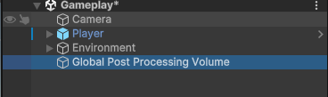

在创建完成的组件中，创建一个自带的`URP`组件，"`Volume`" 指的是一个用于控制场景中全局后处理效果的组件。后处理效果是在渲染完所有场景元素后，对最终图像进行的一系列处理，以增强视觉效果，比如添加模糊、色彩校正、`HDR`效果等。

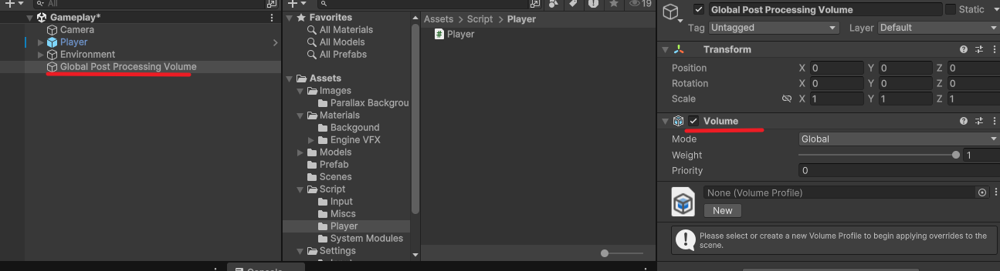

对主摄像机我们进行一些设置，和之后的`URP`配置有很大关系，在相机组件中的`Rendering`部分，我们调整抗锯齿的选项，调整为`SMAF`。`Anti-aliasing`是抗锯齿设置，用于减少图像中的锯齿边缘。在这里，它被设置为"`Subpixel Morphological Anti-aliasing (SMAA)`"，这是一种高效的抗锯齿技术。

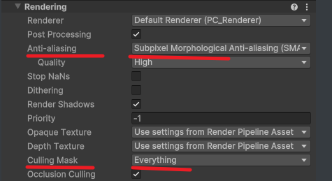

在选取`environment`部分，我们将天空盒关闭。天空盒（`Skybox`） 是一种特殊的材质，用于模拟场景中的天空或环境背景。它通过将场景包裹在一个虚拟的盒子或球体中，使玩家感觉场景被无限大的天空或背景所围绕，从而增强沉浸感。`Culling Mask`这个选项允许你选择相机渲染时应该包含或排除哪些层（`Layer`）。在这里，它被设置为"`Everything`"，意味着相机将渲染所有层。

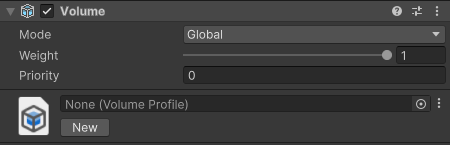

点击上面的`new`创建一个组件，这里的`Mode`设置为`Global`就是全局显示后处理。局部的后处理效果需要添加碰撞体，常用于渲染水的波形，还有其他一些光效。在战机中添加一些后处理效果

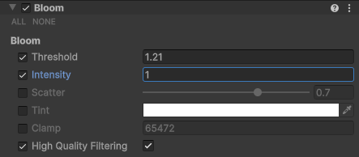

`Bloom`是一种后处理效果，用于模拟相机在高光区域过度曝光时产生的光晕效果。这在现实世界中常见于非常明亮的光源，如太阳光或车灯。`Bloom`效果可以增强场景的视觉冲击力，使高光部分更加突出。以下是`Bloom`组件中的各个设置：

- **Threshold**: 泛光效果开始的阈值。只有亮度高于这个阈值的像素才会被处理。
- **Intensity**: 泛光效果的强度。值越高，泛光效果越明显。
- **Scatter**: 控制泛光的散射程度，影响泛光的扩散范围。
- **Tint**: 泛光的颜色。可以调整泛光的颜色，使其与场景的整体色调相匹配。
- **Clamp**: 限制泛光效果的最大亮度，防止过度曝光。
- **High Quality Filtering**: 启用高质量过滤，可以提高泛光效果的质量，但可能会增加计算量。

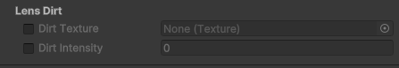

`Lens Dirt`是一种模拟真实相机镜头上的污垢、划痕或其他瑕疵的后处理效果。这种效果可以为游戏或电影场景添加一种真实感或特定的风格。以下是`Lens Dirt`组件中的各个设置：

- **Dirt Texture**: 用于镜头污垢效果的纹理。这个纹理包含了污垢、划痕等图案，可以被映射到镜头上。
- **Dirt Intensity**: 污垢效果的强度。值越高，污垢效果越明显。

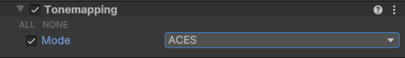

在`Unity`中，"`Tonemapping`"（色调映射）是一种后处理技术，用于调整图像的亮度和对比度，使其适应不同的显示设备和观看条件。色调映射是`HDR`（高动态范围）图像渲染过程中的一个重要步骤，它将`HDR`图像的亮度范围压缩到适合显示设备的范围内。

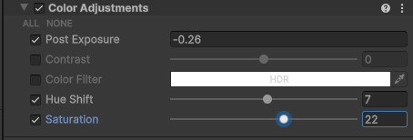

在`Unity`中，"`Color Adjustments`"（颜色调整）是一组后处理效果，用于调整场景中图像的颜色特性。这些调整可以增强视觉效果，或者为场景提供特定的视觉风格。以下是颜色调整组件中的各个设置：

1. **Post Exposure**: 后期曝光调整。这个设置允许你调整图像的整体亮度，通过增加或减少曝光量来实现。这里后期曝光被设置为-0.26，这意味着图像将稍微变暗。
2. **Contrast**: 对比度调整。这个设置可以增加或减少图像的对比度，使得亮部更亮，暗部更暗。
3. **Color Filter**: 颜色滤镜。这个设置允许你通过选择不同的颜色滤镜来改变整个场景的颜色。在你提供的内容中，颜色滤镜被设置为"`HDR`"，应用了一种高动态范围的颜色滤镜。
4. **Hue Shift**: 色调偏移。这个设置允许你调整图像的色调，使得颜色向色轮上的不同方向偏移。色调偏移被设置为7，使得图像的色调稍微偏移。
5. **Saturation**: 饱和度调整。这个设置可以增加或减少图像中颜色的饱和度，使得颜色更加鲜艳或更加柔和。饱和度被设置为22，将变得更加鲜艳。

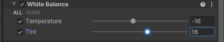

在`Unity`中，"`White Balance`"（白平衡）是颜色调整后处理效果的一部分，用于校正图像中的色温，使得白色物体在不同光照条件下看起来仍然是白色的。这是通过调整图像的色温和色调来实现的。以下是白平衡组件中的各个设置：

1. **Temperature（色温）**: 这个设置控制图像的色温，即图像的冷暖程度。较低的色温值会使图像偏蓝（冷色调），而较高的色温值会使图像偏黄或红（暖色调）。色温被设置为-16，使图像偏向冷色调。
2. **Tint（色调）**: 这个设置控制图像的绿色-品红色平衡。正值会增加图像的品红色调，而负值会增加绿色调。色调被设置为16，使图像偏向品红色调。

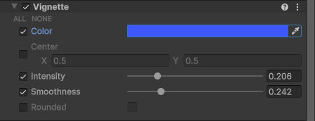

在`Unity`中，"`Vignette`"（暗角）是一种后处理效果，用于在图像的边缘添加渐变的暗区，使得观众的注意力更加集中在图像的中心。这种效果可以用于创造特定的视觉效果，或者模拟某些镜头的光学特性。以下是暗角组件中的各个设置：

1. **Color**: 暗角的颜色。这个设置允许你选择暗角区域的颜色，通常用于调整暗角效果的整体色调。
2. **Center**: 暗角效果的中心点。在Unity中，这个设置通常用于定义暗角效果开始的区域。中心点的X和Y坐标都被设置为0.5，这意味着暗角效果将从图像的中心开始。
3. **Intensity**: 暗角的强度。这个设置控制暗角效果的明显程度。强度被设置为0.206，这将使得暗角效果较为微妙。
4. **Smoothness**: 暗角边缘的平滑度。这个设置用于调整暗角区域与图像中心区域之间的过渡平滑度。平滑度被设置为0.242，这将使得暗角效果的边缘较为柔和。
5. **Rounded**: 这个选项可能用于控制暗角效果的形状是否为圆形。这里没有选取意味着暗角效果可能是方形的。

在设置完成上面的环境，之后的环境变化就更像深空了，所以说后处理效果是对环境的渲染效果。

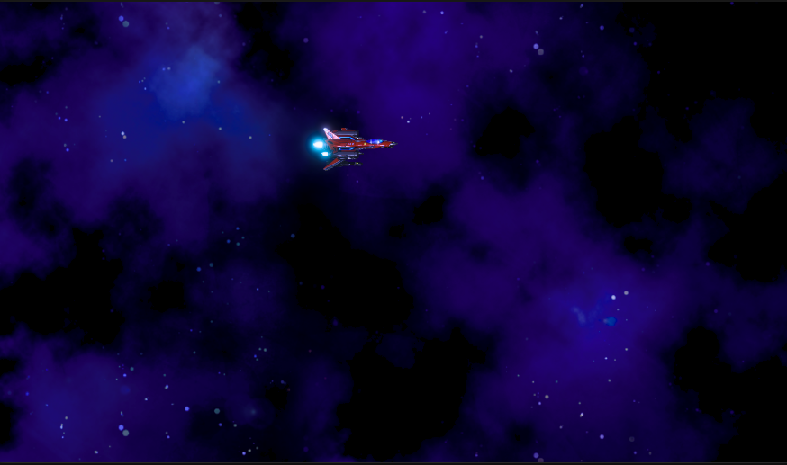

接下来创建一个文件夹容纳`Projectile`，制作战机的子弹。导入油管主的包

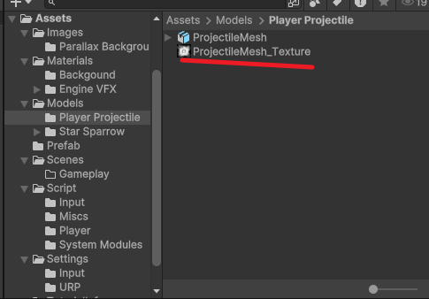

将子弹模型的物体`shader`消除，这里的`materials`将mode选择为`none`

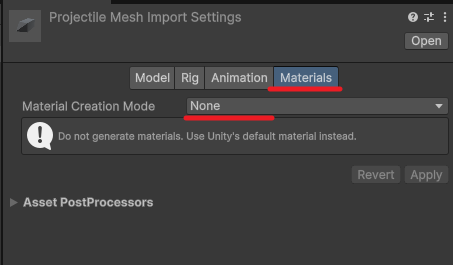

将提供的纹理贴图变为透明的贴图，设置如下的选择。


创建一个对象命名为`Player Projectile`，创建一个子对象命名为粒子效果。在粒子效果中加入一个`Particle System`渲染粒子效果，将油管主提供的模型和纹理贴图添加到这个粒子效果中。


在这个`Particle System`中，修改`Render Mode`属性，修改为`Mesh`将子弹的`Mesh`添加到`Meshes`中。接下来依靠提供的素材制作一个材质

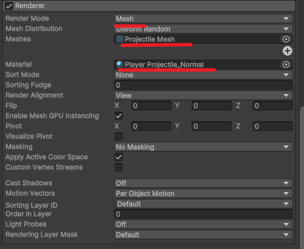

在创建的材质中，选择`universal Render Pipeline -> Particles -> unlit`，创建一个基于 `URP` 的无光照粒子材质。

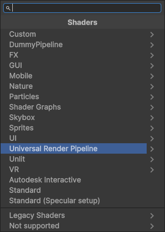

将做好的材质贴图添加到这个材质当中保存，子弹的效果就会随着这个材质贴图变化。

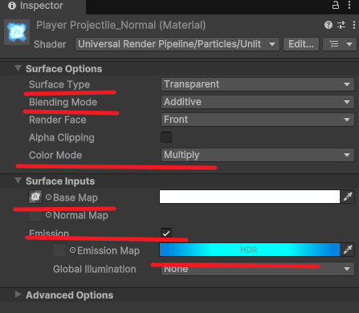

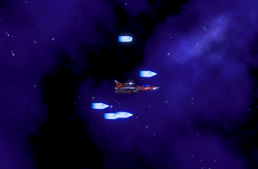

为了拿出单个子弹，我们对其粒子效果进行修改。这里主要的是将`Rate Over Time`修改为`2`，就会产生单个子弹。在初始大小的时候调整为`0.5`。

1. **Duration (持续时间)**: 粒子系统的持续时间，即粒子系统从开始到结束的总时间。
2. **Prewarm (预热)**: 如果选中，粒子系统将在播放时立即开始发射粒子，而不是等待模拟开始。
3. **Start Lifetime (开始生命周期)**: 粒子从生成到消失的时间长度。
4. **Start Size (开始大小)**: 粒子在生成时的初始大小。
5. **Play On Awake(唤醒时播放)**: 如果选中，粒子系统将在游戏开始时自动播放。
6. **Emission (发射)**: 这个属性被选中，表示它是一个重要的属性，可能需要进一步的配置或检查。
7. **Rate over Time (随时间的发射率)**: 每秒钟发射的粒子数量。

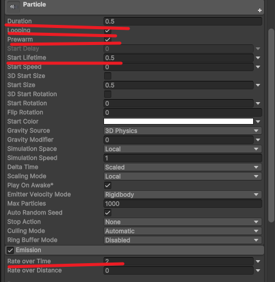

将`Color over Lifetime`居中的`color`的伽马值修改为`0`，这样就得到了一个闪烁的子弹效果。

> "Color over Lifetime" 是一个模块，它允许你根据粒子的生命周期来改变粒子的颜色。


通过将`Rotation over Lifetime`修改其旋转的轴，得到子弹旋转效果。这样子弹的制作就基本完成。主要是设置这个`shader`比较麻烦。

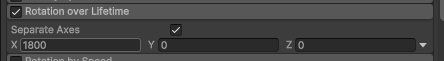

接下来制作子弹尾迹效果。创建一个`effect->tail`物体


将之前创建的材质进行拷贝，命名规范

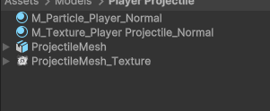

将作为尾迹的材质中的蒙皮删除


Trail Renderer 组件在移动的游戏对象后面随着时间的推移渲染一条多边形轨迹。此组件可用于强调移动对象的运动感，或突出移动对象的路径或位置。在子弹尾迹中，修改下列划横线的参数，添加我们复制的材质.

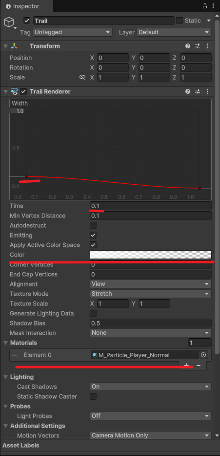

这样就实现了尾迹效果

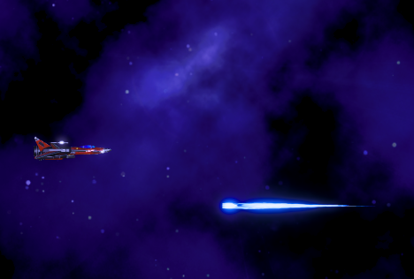

接下来让子弹可以从战机中发射出来，通过设计一个子弹发射的基类，方便敌人和战机继承这个类从而简化操作。

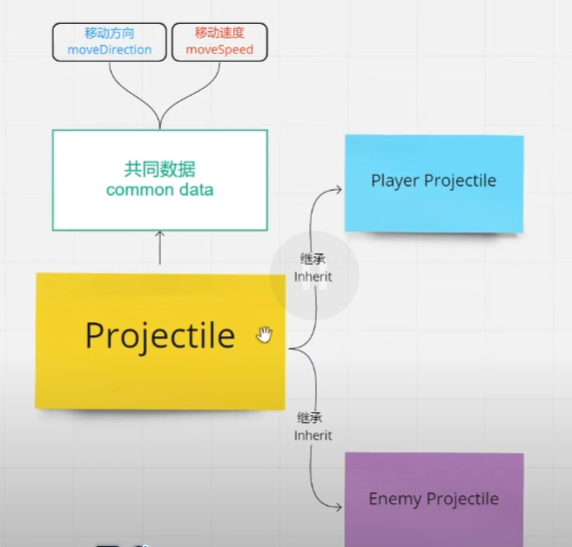

这个类控制子弹按指定方向和速度持续移动。`transform.Translate(moveDirection * moveSpeed * Time.deltaTime);` 的作用是根据指定的移动方向（`moveDirection`）和速度（`moveSpeed`），按时间步进（`Time.deltaTime`）平滑地移动对象，从而实现与帧率无关的运动。

```c#
using System.Collections; 
using UnityEngine;     

// 子弹的基类
public class Projectile : MonoBehaviour
{

    [SerializeField] float moveSpeed = 10f;


    [SerializeField] Vector2 moveDirection;

    void OnEnable()
    {
        StartCoroutine(MoveDirectly());
    }

    IEnumerator MoveDirectly()
    {
        while (gameObject.activeSelf) 
        {
            // 移动对象，移动方向由moveDirection决定，速度由moveSpeed决定，Time.deltaTime用于确保移动速度与帧率无关
            transform.Translate(moveDirection * moveSpeed * Time.deltaTime);

            // 等待下一帧，继续协程的执行
            yield return null;
        }
    }
}
```

在子弹组件中创建一个脚本，`PlayerProjectile`在这里继承上面的类，实现子弹移动效果

```c#
using UnityEngine;

public class PlayerProjectile: Projectile
{
    
}
```

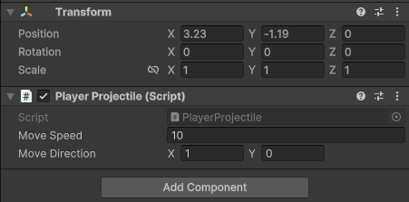

在子弹组件中将这个移动速度修改为`1`，子弹就可以移动了。

### 项目流程六-玩家子弹的发射

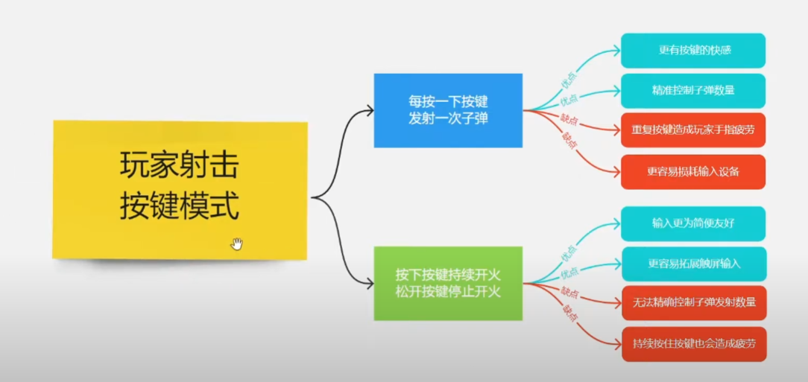

我们通过实例化子弹来实现子弹发射功能，在上述的代码中。子弹会有一个`transform.x`方向移动的效果。因此我们只需要实现子弹的实例化，创建和摧毁即可。使用`input system`创建一个`fire`按键，设置为鼠标左键

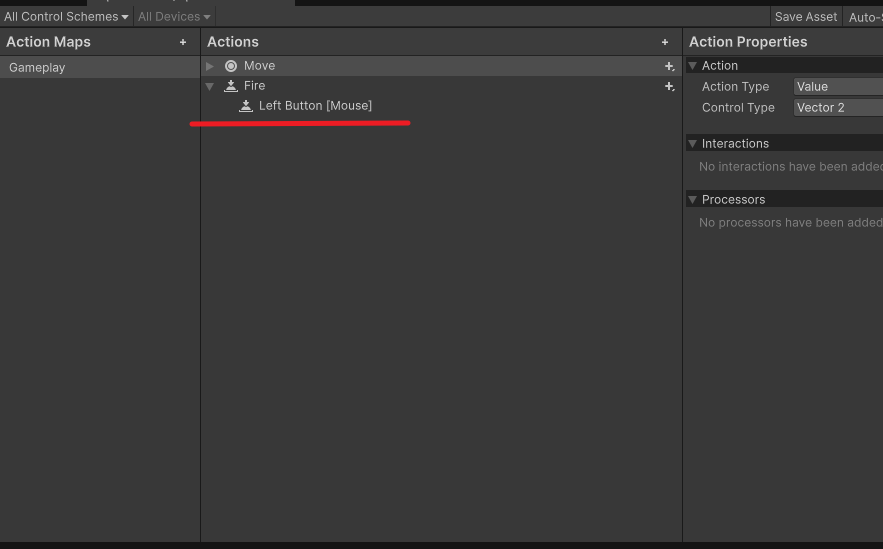

创建完成之后，之前的代码会报错。是因为`input system`是使用接口协议来控制键盘输入的。新的按键创建之后会在`InputActions`这个接口中创建一个新的函数，我们就在这个报错的类中实现`onfire`和`onStopFire`方法。

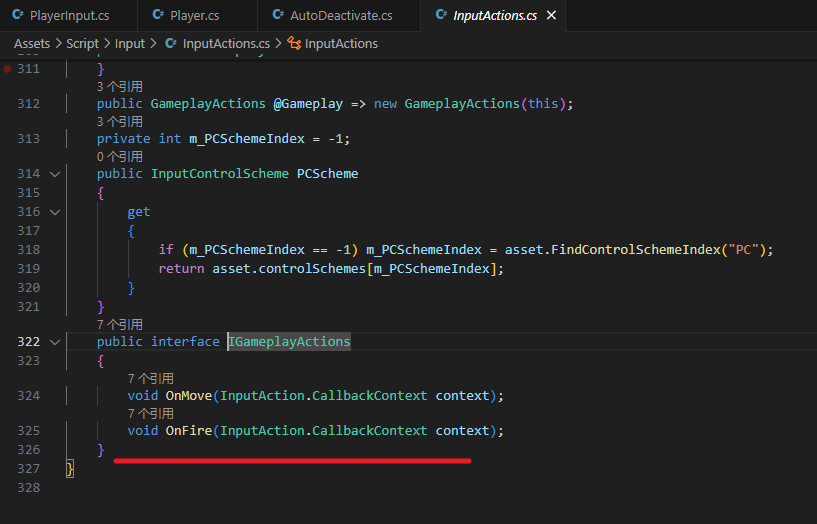

在`player input`和之前一样，我们使用委托来传递调用我们的两个方法

```c#
using UnityEngine;
using UnityEngine.Events;
using UnityEngine.InputSystem;
using UnityEngine.Rendering;
// 组件input的类
[CreateAssetMenu(menuName = "Player Input")]
public class PlayerInput : ScriptableObject, InputActions.IGameplayActions
{

    InputActions inputActions;

    public event UnityAction<Vector2> onMove = delegate{};
    public event UnityAction onStopMove = delegate{};
	// 通过调用委托的方式实现解耦
    public event UnityAction onFire = delegate{};
    public event UnityAction onStopFire = delegate{};

    void OnEnable()
    {
        inputActions = new InputActions();

        inputActions.Gameplay.SetCallbacks(this);
    }

    void OnDisable()
    {
        DisableAllInputs();
    }

    public void DisableAllInputs()
    {
        inputActions.Gameplay.Disable();
    }


    public void EnableGameplayInput()
    {
        inputActions.Gameplay.Enable();
        // 隐藏鼠标
        Cursor.visible = false;
        Cursor.lockState = CursorLockMode.Locked;
    }


    public void OnMove(InputAction.CallbackContext context)
    {

        if(context.phase == InputActionPhase.Performed)
        {
            onMove.Invoke(context.ReadValue<Vector2>());
        }

        if(context.phase == InputActionPhase.Canceled)
        {
            onStopMove.Invoke();
        }
    }

    public void OnFire(InputAction.CallbackContext context)
    {

        if(context.phase == InputActionPhase.Performed)
        {
            // invoke是调用委托
            onFire.Invoke();
        }
        if(context.phase == InputActionPhase.Canceled)
        {
            onStopFire.Invoke();
        }
    }
}

```

在`Player`类中，通过继承`Input`类的方式，实现`input`中的方法订阅。在这个类中，使用一个协程死循环来实现子弹的实例化，再用`StartCoroutine`方法和`StopCoroutine`方法来调用这个实例化。

```c#
using System.Collections;
using UnityEngine;
using UnityEngine.InputSystem;
using UnityEngine.Scripting.APIUpdating;

[RequireComponent(typeof(Rigidbody2D))]
public class Player : MonoBehaviour
{
    [SerializeField] PlayerInput input;
    [SerializeField] float moveSpeed = 10f;
    [SerializeField] float paddingX;
    [SerializeField] float paddingY;
    [SerializeField] float accelerationTime = 3f;
    [SerializeField] float decelerationTime = 3f;
    [SerializeField] float tiltAngle; // 战机最大倾斜角度
    // 搭载子弹
    [SerializeField] GameObject projectile;
    // 枪口
    [SerializeField] Transform muzzle;
	//***
    [SerializeField] float fireInterval = 0.2f;
	//***
    WaitForSeconds waitForFireInterval;

    new Rigidbody2D rigidbody;
    Coroutine moveCoroutine;  // 新增的协程变量 - 防止多个协程同时运行
    // 通过订阅的方式实现 input类中的方法
    void OnEnable()
    {
        input.onMove += Move;
        input.onStopMove += StopMove;
        // 订阅开火 ***
        input.onFire += Fire;
        input.onStopFire += StopFire;
    }
    // 退订
    void OnDisable()
    {
        input.onMove -= Move;
        input.onStopMove -= StopMove;
        // ***
        input.onFire -= Fire;
        input.onStopFire -= StopFire;
    }

    void Start()
    {
        rigidbody = GetComponent<Rigidbody2D>();
        rigidbody.gravityScale = 0f;

        input.EnableGameplayInput();
	   // 间隔发射时间，在循环外部声明节省资源
        waitForFireInterval = new WaitForSeconds(fireInterval);
    }

    #region MOVE

    void Move(Vector2 moveInput)
    {
        // 如果已有协程在运行，停止当前协程
        if (moveCoroutine != null)
        {
            StopCoroutine(moveCoroutine);
        }

        // 启动新的协程，传递加速时间和新的移动速度
        moveCoroutine = StartCoroutine(MoveCoroutine(accelerationTime, moveInput.normalized * moveSpeed));

        // 启动限制战机位置的协程
        StartCoroutine(MovePositionLimitCoroutine());

        // 直接设置战机的旋转角度
        if (moveInput.y > 0)
        {
            transform.eulerAngles = new Vector3(tiltAngle, transform.eulerAngles.y, transform.eulerAngles.z); // 向下倾斜
        }
        else if (moveInput.y < 0)
        {
            transform.eulerAngles = new Vector3(-tiltAngle, transform.eulerAngles.y, transform.eulerAngles.z); // 向上倾斜
        }
    }

    void StopMove()
    {
        // 停止移动时回正
        if (moveCoroutine != null)
        {
            StopCoroutine(moveCoroutine);  // 停止当前的加速协程
        }

        // 启动新的减速协程
        moveCoroutine = StartCoroutine(MoveCoroutine(decelerationTime, Vector2.zero));

        StopCoroutine(MovePositionLimitCoroutine());  // 停止限制位置的协程

        // 恢复战机旋转角度到默认值
        transform.eulerAngles = new Vector3(0, transform.eulerAngles.y, transform.eulerAngles.z);
    }

    // 确保玩家的战机不会超出可移动区域
    IEnumerator MovePositionLimitCoroutine()
    {
        while (true)
        {
            transform.position = Viewport.Instance.PlayerMoveablePosition(transform.position, paddingX, paddingY);
            yield return null;
        }
    }

    // 负责平滑地加速或减速战机的速度，以实现自然的运动过渡
    IEnumerator MoveCoroutine(float time, Vector2 moveVelocity)
    {
        float t = 0f;
        Vector2 initialVelocity = rigidbody.linearVelocity;

        while (t < time)
        {
            t += Time.fixedDeltaTime;
            float lerpFactor = t / time;

            rigidbody.linearVelocity = Vector2.Lerp(initialVelocity, moveVelocity, lerpFactor);

            yield return null;
        }

        rigidbody.linearVelocity = moveVelocity;
        yield return null;
    }

    #endregion

	//***
    #region FIRE

    void Fire()
    {
        StartCoroutine(nameof(FireCoroutine));
    }

    void StopFire()
    {
        StopCoroutine(nameof(FireCoroutine));
    }
	
    IEnumerator FireCoroutine()
    {
        while(true)
        {
            // 实例化子弹的方法
            Instantiate(projectile,muzzle.position,Quaternion.identity);
            yield return waitForFireInterval;
        }
    }
    #endregion
}
```

在战机中，拉入我们的枪口和子弹的预制体，结合上面的代码就可以实现子弹发射的效果了。

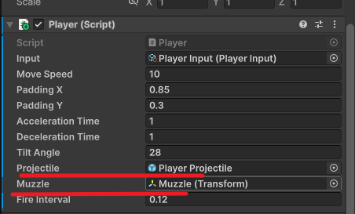

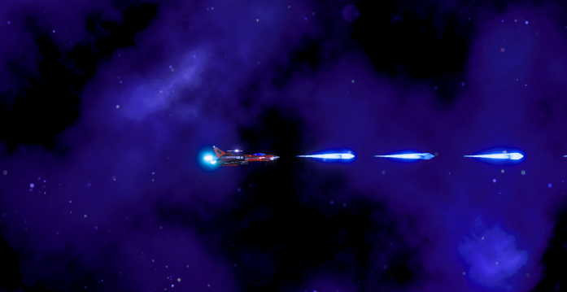

但是子弹发射之后会永久存在，需要创建一个脚本来摧毁。创建一个`AutoDeactivate`脚本搭载在子弹上面

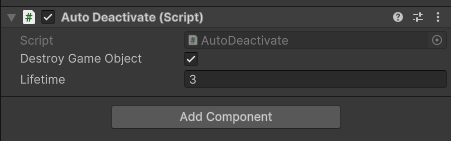

搭载了这个脚本，当前的物体就会在`3f`的时间过后摧毁。在运行之后子弹就会自动摧毁了

```c#
using System.Collections;
using UnityEngine;
// 挂载在子弹上
public class AutoDeactivate : MonoBehaviour
{
    [SerializeField] bool destroyGameObject;

    [SerializeField] float lifetime = 3f;


    WaitForSeconds waitLifetime;

    void Awake()
    {
        waitLifetime = new WaitForSeconds(lifetime);
    }


    void OnEnable()
    {
        // 调用这个摧毁协程
        StartCoroutine(DeactivateCoroutine());
    }

    IEnumerator DeactivateCoroutine()
    {
        yield return waitLifetime;

        if(destroyGameObject)
        {
            Destroy(gameObject);
        }
        else{
            gameObject.SetActive(false);
        }
    }


}
```

