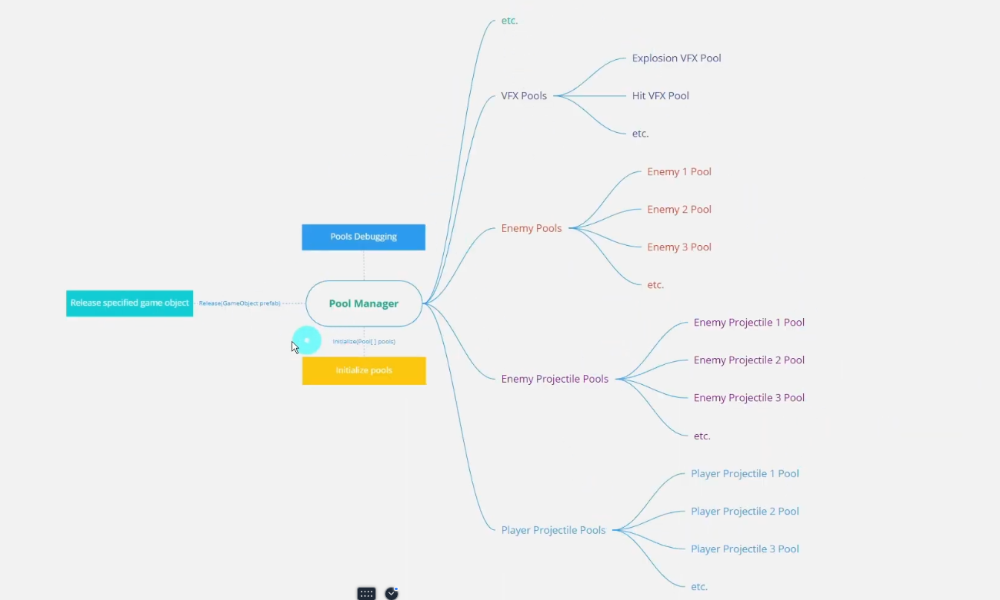

## 横版卷轴射击游戏(3)

### 项目流程七-[对象池](https://zhuanlan.zhihu.com/p/386079823)

在前面调用实例化函数和摧毁子弹函数创建的子弹方案是很简单的，但是会产生一个问题。在创建子弹和摧毁子弹的过程中，gameobject不断的创建和清除会导致垃圾回收系统GC频繁调用，会大量消耗资源。因此我们需要采用对象池来对创建的object进行管理。逻辑如下


创建一个文件夹存储我们的对象池逻辑，对象池的逻辑是在游戏开始时，在内存中划分一个区域，创建可重复使用的预制体文件。通过队列的方式重复使用创建的预制体，达到节省内存和减少垃圾回收的目的。


在pool中我们创建如下代码实现对象池，

```c#
using System.Collections;
using System.Collections.Generic;
using UnityEngine;

// 对象池类，用于管理对象的复用
[System.Serializable] 
public class Pool
{
    [SerializeField] GameObject prefab; // 用于实例化的预制体
    [SerializeField] int size; // 对象池的初始大小

    Transform parent;
    // 这里有一些问题 - 刚开始自己调用自己了
    public GameObject Prefab => prefab;


    Queue<GameObject> queue; // 队列存储对象池中的对象

    // 初始化对象池，创建指定数量的对象并存入队列
    public void Initialize(Transform parent)
    {
        queue = new Queue<GameObject>();
        this.parent = parent;

        for (var i = 0; i < size; i++)
        {
            queue.Enqueue(Copy()); // 创建对象副本并入队
        }
    }

    // 创建预制体对象的副本并设置为非激活状态
    GameObject Copy()
    {
        var copy = GameObject.Instantiate(prefab, parent); // 实例化预制体
        copy.SetActive(false); // 初始状态设为非激活
        return copy;
    }

    // 获取可用的对象，如果队列中有非激活对象则返回，否则创建新对象
    GameObject AvailableObject()
    {
        GameObject availableObject = null;

        // 如果队列中有对象且对象未激活，从队列中取出该对象 - 防止调用到一个正在运行的对象
        if (queue.Count > 0 && !queue.Peek().activeSelf)
        {
            availableObject = queue.Dequeue();
        }
        else
        {
            // 否则创建一个新对象
            availableObject = Copy();
        }

        // 将获取的对象重新加入队列（即使是新创建的对象）
        queue.Enqueue(availableObject);

        return availableObject;
    }

    // 获取一个已准备好的对象，并激活它
    public GameObject preparedObject()
    {
        GameObject preparedObject = AvailableObject();

        preparedObject.SetActive(true); // 激活对象

        return preparedObject;
    }

    // 获取一个已准备好的对象，并设置其位置和旋转
    public GameObject preparedObject(Vector3 position, Quaternion rotation)
    {
        GameObject preparedObject = AvailableObject();

        preparedObject.SetActive(true); // 激活对象
        preparedObject.transform.position = position; // 设置位置
        preparedObject.transform.rotation = rotation; // 设置旋转

        return preparedObject;
    }

    // 获取一个已准备好的对象，并设置其位置、旋转和缩放
    public GameObject preparedObject(Vector3 position, Quaternion rotation, Vector3 localScale)
    {
        GameObject preparedObject = AvailableObject();

        preparedObject.SetActive(true); // 激活对象
        preparedObject.transform.position = position; // 设置位置
        preparedObject.transform.rotation = rotation; // 设置旋转
        preparedObject.transform.localScale = localScale; // 设置局部缩放

        return preparedObject;
    }
}
```

创建一个新的脚本`PoolManager`，用于管理这个对象池的生成。同时为了美观，将创建的所有对象折叠成为对象管理的字物体。


```c#
using UnityEngine;

public class PoolManager : MonoBehaviour
{
    // 玩家子弹对象池数组
    [SerializeField] Pool[] playerProjectilePools;

    void Start()
    {
        // 在游戏开始时初始化所有对象池
        Initialize(playerProjectilePools);
    }

    /// <summary>
    /// 初始化对象池
    /// </summary>
    /// <param name="pools">需要初始化的对象池数组</param>
    void Initialize(Pool[] pools)
    {
        // 遍历每一个对象池
        foreach (var pool in pools)
        {
            // 创建一个新的空物体作为对象池的父物体，便于管理
            Transform poolParent = new GameObject("Pool: " + pool.Prefab.name).transform;
            // 将新创建的父物体作为当前 PoolManager 的子物体
            poolParent.parent = transform;
            // 调用对象池的初始化方法，传入父物体作为容器
            pool.Initialize(poolParent);
        }
    }
}
```

### 项目流程八-应用对象池

在使用对象池之前，先重构一下之前的代码。在发射子弹的功能中，设置了三种威力的方式，之后可以在游戏的过程中吃入道具的方式进行升级操作。先将枪口设置为三个方向，复制三个预制体作为不同类型的子弹


在player脚本中，加入一个switch函数，代码中搭载完预制体后

```c#
using System.Collections;
using UnityEngine;
using UnityEngine.InputSystem;
using UnityEngine.Scripting.APIUpdating;

[RequireComponent(typeof(Rigidbody2D))]
public class Player : MonoBehaviour
{
    [SerializeField] PlayerInput input;
    [SerializeField] float moveSpeed = 10f;
    [SerializeField] float paddingX;
    [SerializeField] float paddingY;
    [SerializeField] float accelerationTime = 3f;
    [SerializeField] float decelerationTime = 3f;
    [SerializeField] float tiltAngle; // 战机最大倾斜角度
    // 搭载子弹 *** 三种不同方向
    [SerializeField] GameObject projectile1;
    [SerializeField] GameObject projectile2;
    [SerializeField] GameObject projectile3;


    //*** 枪口 三方向
    [SerializeField] Transform muzzleTop;
    [SerializeField] Transform muzzleMiddle;
    [SerializeField] Transform muzzleBottom;

    [SerializeField] float fireInterval = 0.2f;
	// *** 调节火力的方式 - unity中会以拉取精度条的方式进行控制
    [SerializeField, Range(0, 2)] int weaponPower = 0;


    WaitForSeconds waitForFireInterval;

    new Rigidbody2D rigidbody;
    Coroutine moveCoroutine;  // 新增的协程变量 - 防止多个协程同时运行
    // 通过订阅的方式实现 input类中的方法
    void OnEnable()
    {
        input.onMove += Move;
        input.onStopMove += StopMove;
        input.onFire += Fire;
        input.onStopFire += StopFire;
    }
    // 退订
    void OnDisable()
    {
        input.onMove -= Move;
        input.onStopMove -= StopMove;
        input.onFire -= Fire;
        input.onStopFire -= StopFire;
    }

    void Start()
    {
        rigidbody = GetComponent<Rigidbody2D>();
        rigidbody.gravityScale = 0f;

        input.EnableGameplayInput();

        waitForFireInterval = new WaitForSeconds(fireInterval);
    }
	// 移动功能 这里省去
    #region MOVE
    #endregion


    #region FIRE

    void Fire()
    {
        StartCoroutine(nameof(FireCoroutine));
    }

    void StopFire()
    {
        StopCoroutine(nameof(FireCoroutine));
    }

    IEnumerator FireCoroutine()
    {
        while (true)
        {
            switch (weaponPower)
            {
                case 0:
                    Instantiate(projectile2, muzzleMiddle.position, Quaternion.identity);
                    break;
                case 1:
                    Instantiate(projectile1, muzzleTop.position, Quaternion.identity);
                    Instantiate(projectile3,muzzleBottom.position, Quaternion.identity);
                    break;
                case 2:
                    Instantiate(projectile1, muzzleTop.position, Quaternion.identity);
                    Instantiate(projectile2,muzzleBottom.position, Quaternion.identity);
                    Instantiate(projectile3,muzzleBottom.position, Quaternion.identity);
                    break;
                default:
                    break;
            }
            yield return waitForFireInterval;
        }
    }
    #endregion


}

```

上述代码中还是使用预制体实例化的方式创建子弹，这里将其改造为使用对象池。

```c#
    #region FIRE

    void Fire()
    {
        StartCoroutine(nameof(FireCoroutine));
    }

    void StopFire()
    {
        StopCoroutine(nameof(FireCoroutine));
    }

    IEnumerator FireCoroutine()
    {
        while (true)
        {
            switch (weaponPower)
            {
                case 0:
                    PoolManager.Release(projectile2, muzzleMiddle.position);
                    break;
                case 1:
                    PoolManager.Release(projectile1, muzzleTop.position);
                    PoolManager.Release(projectile3, muzzleBottom.position);
                    break;
                case 2:
                    PoolManager.Release(projectile1, muzzleTop.position);
                    PoolManager.Release(projectile3, muzzleBottom.position);
                    PoolManager.Release(projectile2, muzzleMiddle.position);
                    break;
                default:
                    break;
            }
            yield return waitForFireInterval;
        }
    }
    #endregion
```



上面改为使用对象池的代码，我们在PoolManager中新增了三个重构函数，并且使用了字典来存储我们产生的对象，方便对不同对象池的追踪，子弹有三种，发射方式也有三种。同时在使用创建对象的过程中，用onD函数来判断射击的过程中需要多少对象池中的子弹。


```c#
using System.Collections.Generic;
using UnityEngine;

public class PoolManager : MonoBehaviour
{
    // 玩家子弹对象池数组
    [SerializeField] Pool[] playerProjectilePools;

    // 静态字典，用于快速查找每个预制体对应的对象池
    static Dictionary<GameObject, Pool> dictionary;

    void Start()
    {
        // 初始化字典
        dictionary = new Dictionary<GameObject, Pool>();
        // 在游戏开始时初始化所有对象池
        Initialize(playerProjectilePools);
    }
	// 检测需要多少
    void OnDestroy()
    {
        CheckPoolSize(playerProjectilePools);
    }

    void CheckPoolSize(Pool[] pools)
    {
        foreach (var pool in pools)
        {
            if (pool.RuntimeSize > pool.Size)
            {
                Debug.LogWarning(string.Format(
                    "Pool: {0} has a runtime size {1} bigger than its initial size {2}!",
                    pool.Prefab.name,
                    pool.RuntimeSize,
                    pool.Size));
            }
        }
    }

    /// <summary>
    /// 初始化对象池
    /// </summary>
    /// <param name="pools">需要初始化的对象池数组</param>
    void Initialize(Pool[] pools)
    {
        // 遍历每一个对象池
        foreach (var pool in pools)
        {
#if UNITY_EDITOR
            // 检测是否有重复的预制体，避免一个预制体被多个对象池管理
            if (dictionary.ContainsKey(pool.Prefab))
            {
                Debug.LogError("Same prefab in multiple pools! Prefab: " + pool.Prefab.name);
                continue; // 跳过重复的预制体
            }
#endif

            // 将预制体和对象池的对应关系添加到字典中
            dictionary.Add(pool.Prefab, pool);

            // 创建一个新的空物体作为对象池的父物体，便于管理对象池中的实例
            Transform poolParent = new GameObject("Pool: " + pool.Prefab.name).transform;
            // 将新创建的父物体作为当前 PoolManager 的子物体
            poolParent.parent = transform;
            // 调用对象池的初始化方法，传入父物体作为容器
            pool.Initialize(poolParent);
        }
    }

    /// <summary>
    /// 从对象池中获取对象（仅指定位置）
    /// </summary>
    /// <param name="prefab">需要生成的预制体</param>
    /// <param name="position">生成位置</param>
    /// <returns>从对象池获取的对象</returns>
    public static GameObject Release(GameObject prefab, Vector3 position)
    {
#if UNITY_EDITOR
        // 检测是否存在对应的对象池，防止错误调用
        if (!dictionary.ContainsKey(prefab))
        {
            Debug.LogError("Pool Manager could NOT find prefab: " + prefab.name);
            return null;
        }
#endif
        // 调用对应对象池的方法，从池中获取对象
        return dictionary[prefab].PreparedObject(position);
    }

    /// <summary>
    /// 从对象池中获取对象（指定位置和旋转）
    /// </summary>
    /// <param name="prefab">需要生成的预制体</param>
    /// <param name="position">生成位置</param>
    /// <param name="rotation">生成时的旋转</param>
    /// <returns>从对象池获取的对象</returns>
    public static GameObject Release(GameObject prefab, Vector3 position, Quaternion rotation)
    {
#if UNITY_EDITOR
        // 检测是否存在对应的对象池，防止错误调用
        if (!dictionary.ContainsKey(prefab))
        {
            Debug.LogError("Pool Manager could NOT find prefab: " + prefab.name);
            return null;
        }
#endif
        // 调用对应对象池的方法，从池中获取对象
        return dictionary[prefab].PreparedObject(position, rotation);
    }

    /// <summary>
    /// 从对象池中获取对象（指定位置、旋转和缩放）
    /// </summary>
    /// <param name="prefab">需要生成的预制体</param>
    /// <param name="position">生成位置</param>
    /// <param name="rotation">生成时的旋转</param>
    /// <param name="localScale">生成时的缩放</param>
    /// <returns>从对象池获取的对象</returns>
    public static GameObject Release(GameObject prefab, Vector3 position, Quaternion rotation, Vector3 localScale)
    {
#if UNITY_EDITOR
        // 检测是否存在对应的对象池，防止错误调用
        if (!dictionary.ContainsKey(prefab))
        {
            Debug.LogError("Pool Manager could NOT find prefab: " + prefab.name);
            return null;
        }
#endif
        // 调用对应对象池的方法，从池中获取对象
        return dictionary[prefab].PreparedObject(position, rotation, localScale);
    }
}
```


