## 横版卷轴射击游戏(3)

### 项目流程七 - [对象池](https://zhuanlan.zhihu.com/p/386079823)

在使用实例化函数创建子弹和摧毁子弹的简单方案中，虽然逻辑清晰，但存在一个问题：在子弹的创建和销毁过程中，`GameObject `的频繁生成与清除会导致垃圾回收系统（GC）频繁触发，从而大量消耗系统资源。为了解决这一问题，可以通过对象池来管理创建的对象。具体逻辑如下123：

- **生成备用对象（Create Prepared Objects）**

  - 通过实例化生成一批对象。

  - 禁用这些对象（`Deactivate`），使其处于待命状态。

  - 将这些对象加入队列（`Enqueue`）等待使用。

- **从池中取出可用对象（Get an Available Object from Pool）**
  - **有可用对象**：从队列中取出（`Dequeue`）。
  - **无可用对象**：通过复制方法创建一个新的对象。

- **启用可用对象（Activate the Available Object）**
  - 将取出的对象激活（`SetActive(true)`），使其进入使用状态。

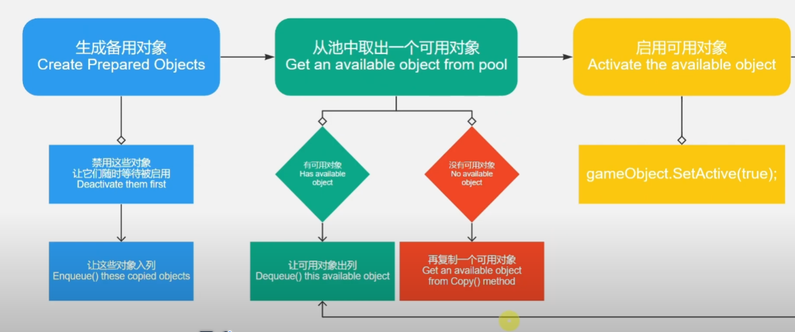

对象池的核心逻辑是：在游戏开始时预先分配一块内存区域，用于创建和管理可重复使用的预制体对象。通过队列的方式管理这些对象，实现对象的重复利用，从而有效节省内存资源并减少垃圾回收频率。这里创建两个脚本，一个是对象池的基本属性`Pool`方便后续的升级和继承，另一个是对象池的管理，方便我们搭载预制体批量生成对应的对象池，并执行调用。

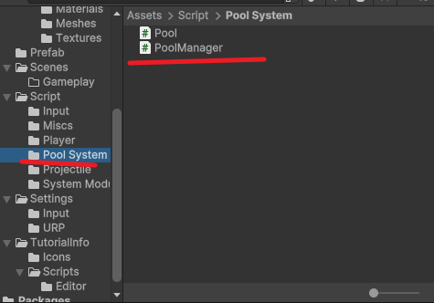

这段代码实现了一个**对象池类 (Pool)**，它用于优化游戏中的对象管理。通过提前生成一定数量的预制对象并将其存储在池中，我们可以在需要时从池里快速获取空闲的对象，避免频繁创建和销毁带来的性能开销。对象池不仅可以根据实际需求激活对象，还能调整对象的位置、旋转和缩放。在对象使用完毕后，它会被回收到池中。

> 这里的属性作用是什么？

```c#
using System.Collections;
using System.Collections.Generic;
using UnityEngine;

// 对象池类，用于管理对象的复用
[System.Serializable] 
public class Pool
{
    [SerializeField] GameObject prefab; // 用于实例化的预制体
    [SerializeField] int size; // 对象池的初始大小

    Transform parent;

    public GameObject Prefab => prefab;


    Queue<GameObject> queue; // 队列存储对象池中的对象

    // 初始化对象池，创建指定数量的对象并存入队列
    public void Initialize(Transform parent)
    {
        queue = new Queue<GameObject>();
        this.parent = parent;

        for (var i = 0; i < size; i++)
        {
            queue.Enqueue(Copy()); // 创建对象副本并入队
        }
    }

    // 创建预制体对象的副本并设置为非激活状态
    GameObject Copy()
    {
        var copy = GameObject.Instantiate(prefab, parent); // 实例化预制体
        copy.SetActive(false); // 初始状态设为非激活
        return copy;
    }

    // 获取可用的对象，如果队列中有非激活对象则返回，否则创建新对象
    GameObject AvailableObject()
    {
        GameObject availableObject = null;

        // 如果队列中有对象且对象未激活，从队列中取出该对象 - 防止调用到一个正在运行的对象
        if (queue.Count > 0 && !queue.Peek().activeSelf)
        {
            availableObject = queue.Dequeue();
        }
        else
        {
            // 否则创建一个新对象
            availableObject = Copy();
        }

        // 将获取的对象重新加入队列（即使是新创建的对象）
        queue.Enqueue(availableObject);

        return availableObject;
    }

    // 获取一个已准备好的对象，并激活它
    public GameObject preparedObject()
    {
        GameObject preparedObject = AvailableObject();

        preparedObject.SetActive(true); // 激活对象

        return preparedObject;
    }

    // 获取一个已准备好的对象，并设置其位置和旋转
    public GameObject preparedObject(Vector3 position, Quaternion rotation)
    {
        GameObject preparedObject = AvailableObject();

        preparedObject.SetActive(true); // 激活对象
        preparedObject.transform.position = position; // 设置位置
        preparedObject.transform.rotation = rotation; // 设置旋转

        return preparedObject;
    }

    // 获取一个已准备好的对象，并设置其位置、旋转和缩放
    public GameObject preparedObject(Vector3 position, Quaternion rotation, Vector3 localScale)
    {
        GameObject preparedObject = AvailableObject();

        preparedObject.SetActive(true); // 激活对象
        preparedObject.transform.position = position; // 设置位置
        preparedObject.transform.rotation = rotation; // 设置旋转
        preparedObject.transform.localScale = localScale; // 设置局部缩放

        return preparedObject;
    }
}
```

创建一个新的脚本`PoolManager`，用于管理这个对象池的生成。同时为了美观，将创建的所有对象折叠成为对象管理的子物体。

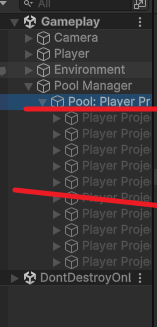

这段代码实现了一个**对象池管理器 (PoolManager)**，用于管理玩家子弹的对象池。在游戏开始时，`Start` 方法会初始化所有定义的玩家子弹对象池。`Initialize` 方法会为每个对象池创建一个空物体作为容器，并将其作为父物体，以便更好地管理和组织对象池中的物体。每个对象池会根据其指定的父物体进行初始化，以便后续的对象管理。

```c#
using UnityEngine;

public class PoolManager : MonoBehaviour
{
    // 玩家子弹对象池数组
    [SerializeField] Pool[] playerProjectilePools;

    void Start()
    {
        // 在游戏开始时初始化所有对象池
        Initialize(playerProjectilePools);
    }

    /// <summary>
    /// 初始化对象池
    /// </summary>
    /// <param name="pools">需要初始化的对象池数组</param>
    void Initialize(Pool[] pools)
    {
        // 遍历每一个对象池
        foreach (var pool in pools)
        {
            // 创建一个新的空物体作为对象池的父物体，便于管理
            Transform poolParent = new GameObject("Pool: " + pool.Prefab.name).transform;
            // 将新创建的父物体作为当前 PoolManager 的子物体
            poolParent.parent = transform;
            // 调用对象池的初始化方法，传入父物体作为容器
            pool.Initialize(poolParent);
        }
    }
}
```

### 项目流程八 - 应用对象池

在使用对象池之前，我们首先重构了发射子弹的功能。通过设置三种不同的威力模式，我们为子弹增加了多样性，同时还可以通过游戏中的道具系统对威力进行升级。为了适应不同的发射方向，我们将枪口设置为三个不同的方向，并复制了三个预制体来对应不同类型的子弹。

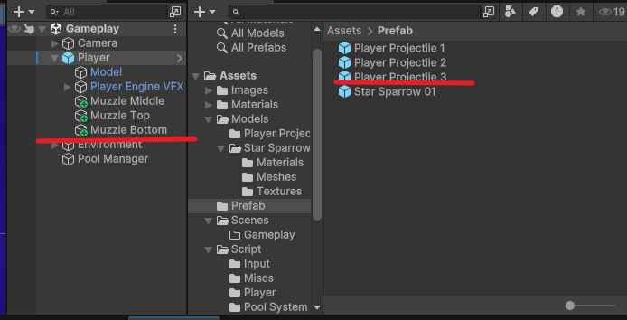


`FIRE` 部分实现了玩家的持续射击功能，根据玩家当前的武器威力等级（`weaponPower`），从不同方向的枪口发射不同类型的子弹。通过启动和停止协程来控制射击的开始和结束，并且在每次发射后设定间隔时间，确保射击不会过于频繁。

```c#
using System.Collections;
using UnityEngine;
using UnityEngine.InputSystem;
using UnityEngine.Scripting.APIUpdating;

[RequireComponent(typeof(Rigidbody2D))]
public class Player : MonoBehaviour
{
    [SerializeField] PlayerInput input;
    [SerializeField] float moveSpeed = 10f;
    [SerializeField] float paddingX;
    [SerializeField] float paddingY;
    [SerializeField] float accelerationTime = 3f;
    [SerializeField] float decelerationTime = 3f;
    [SerializeField] float tiltAngle; // 战机最大倾斜角度
    // 搭载子弹 *** 三种不同方向
    [SerializeField] GameObject projectile1;
    [SerializeField] GameObject projectile2;
    [SerializeField] GameObject projectile3;


    //*** 枪口 三方向
    [SerializeField] Transform muzzleTop;
    [SerializeField] Transform muzzleMiddle;
    [SerializeField] Transform muzzleBottom;

    [SerializeField] float fireInterval = 0.2f;
	// *** 调节火力的方式 - unity中会以拉取精度条的方式进行控制
    [SerializeField, Range(0, 2)] int weaponPower = 0;


    WaitForSeconds waitForFireInterval;

    new Rigidbody2D rigidbody;
    Coroutine moveCoroutine;  // 新增的协程变量 - 防止多个协程同时运行
    // 通过订阅的方式实现 input类中的方法
    void OnEnable()
    {
        input.onMove += Move;
        input.onStopMove += StopMove;
        input.onFire += Fire;
        input.onStopFire += StopFire;
    }
    // 退订
    void OnDisable()
    {
        input.onMove -= Move;
        input.onStopMove -= StopMove;
        input.onFire -= Fire;
        input.onStopFire -= StopFire;
    }

    void Start()
    {
        rigidbody = GetComponent<Rigidbody2D>();
        rigidbody.gravityScale = 0f;

        input.EnableGameplayInput();

        waitForFireInterval = new WaitForSeconds(fireInterval);
    }
    
	// 移动功能 这里省去
    #region MOVE
    #endregion


    #region FIRE

    void Fire()
    {
        StartCoroutine(nameof(FireCoroutine));
    }

    void StopFire()
    {
        StopCoroutine(nameof(FireCoroutine));
    }

    IEnumerator FireCoroutine()
    {
        while (true)
        {
            switch (weaponPower)
            {
                case 0:
                    Instantiate(projectile2, muzzleMiddle.position, Quaternion.identity);
                    break;
                case 1:
                    Instantiate(projectile1, muzzleTop.position, Quaternion.identity);
                    Instantiate(projectile3,muzzleBottom.position, Quaternion.identity);
                    break;
                case 2:
                    Instantiate(projectile1, muzzleTop.position, Quaternion.identity);
                    Instantiate(projectile2,muzzleBottom.position, Quaternion.identity);
                    Instantiate(projectile3,muzzleBottom.position, Quaternion.identity);
                    break;
                default:
                    break;
            }
            yield return waitForFireInterval;
        }
    }
    #endregion


}

```

将玩家的射击功能通过对象池管理来优化。根据武器威力等级（`weaponPower`），从不同枪口位置释放对应的子弹对象（如 `projectile1`, `projectile2`, `projectile3`）。使用 `PoolManager.Release` 方法从对象池中获取子弹实例，代替了直接实例化。射击过程通过协程实现，并设置了发射间隔。

```c#
    #region FIRE

    void Fire()
    {
        StartCoroutine(nameof(FireCoroutine));
    }

    void StopFire()
    {
        StopCoroutine(nameof(FireCoroutine));
    }

    IEnumerator FireCoroutine()
    {
        while (true)
        {
            switch (weaponPower)
            {
                case 0:
                    PoolManager.Release(projectile2, muzzleMiddle.position);
                    break;
                case 1:
                    PoolManager.Release(projectile1, muzzleTop.position);
                    PoolManager.Release(projectile3, muzzleBottom.position);
                    break;
                case 2:
                    PoolManager.Release(projectile1, muzzleTop.position);
                    PoolManager.Release(projectile3, muzzleBottom.position);
                    PoolManager.Release(projectile2, muzzleMiddle.position);
                    break;
                default:
                    break;
            }
            yield return waitForFireInterval;
        }
    }
    #endregion
```

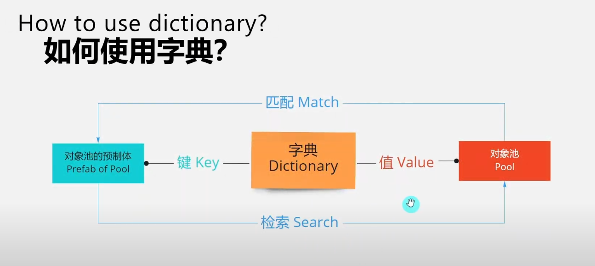

在下面的代码中，我们实现了一个`PoolManager`类，通过引入对象池管理系统来优化资源的使用。通过添加了三个`Release`函数，我们可以根据需求从对象池中获取不同类型的子弹对象。每个函数都支持不同的参数（位置、旋转、缩放），使得在不同的射击情境下能够灵活地从对象池中获取子弹。

在管理对象池时，我们使用了一个`Dictionary`来存储每种子弹（或预制体）对应的对象池，这样可以方便地追踪每个对象池的状态。字典使得从多个对象池中检索和释放对象变得高效且便捷。

此外，`OnDestroy`函数中的`CheckPoolSize`方法帮助我们在销毁时检查每个对象池的实际运行大小，防止对象池的实际使用量超过预设的初始大小，避免资源浪费或管理混乱。

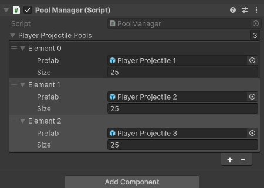

```c#
using System.Collections.Generic;
using UnityEngine;

public class PoolManager : MonoBehaviour
{
    // 玩家子弹对象池数组
    [SerializeField] Pool[] playerProjectilePools;

    // 静态字典，用于快速查找每个预制体对应的对象池
    static Dictionary<GameObject, Pool> dictionary;

    void Start()
    {
        // 初始化字典
        dictionary = new Dictionary<GameObject, Pool>();
        // 在游戏开始时初始化所有对象池
        Initialize(playerProjectilePools);
    }
	// 检测需要多少
    void OnDestroy()
    {
        CheckPoolSize(playerProjectilePools);
    }

    void CheckPoolSize(Pool[] pools)
    {
        foreach (var pool in pools)
        {
            if (pool.RuntimeSize > pool.Size)
            {
                Debug.LogWarning(string.Format(
                    "Pool: {0} has a runtime size {1} bigger than its initial size {2}!",
                    pool.Prefab.name,
                    pool.RuntimeSize,
                    pool.Size));
            }
        }
    }

    /// <summary>
    /// 初始化对象池
    /// </summary>
    /// <param name="pools">需要初始化的对象池数组</param>
    void Initialize(Pool[] pools)
    {
        // 遍历每一个对象池
        foreach (var pool in pools)
        {
#if UNITY_EDITOR
            // 检测是否有重复的预制体，避免一个预制体被多个对象池管理
            if (dictionary.ContainsKey(pool.Prefab))
            {
                Debug.LogError("Same prefab in multiple pools! Prefab: " + pool.Prefab.name);
                continue; // 跳过重复的预制体
            }
#endif

            // 将预制体和对象池的对应关系添加到字典中
            dictionary.Add(pool.Prefab, pool);

            // 创建一个新的空物体作为对象池的父物体，便于管理对象池中的实例
            Transform poolParent = new GameObject("Pool: " + pool.Prefab.name).transform;
            // 将新创建的父物体作为当前 PoolManager 的子物体
            poolParent.parent = transform;
            // 调用对象池的初始化方法，传入父物体作为容器
            pool.Initialize(poolParent);
        }
    }

    /// <summary>
    /// 从对象池中获取对象（仅指定位置）
    /// </summary>
    /// <param name="prefab">需要生成的预制体</param>
    /// <param name="position">生成位置</param>
    /// <returns>从对象池获取的对象</returns>
    public static GameObject Release(GameObject prefab, Vector3 position)
    {
#if UNITY_EDITOR
        // 检测是否存在对应的对象池，防止错误调用
        if (!dictionary.ContainsKey(prefab))
        {
            Debug.LogError("Pool Manager could NOT find prefab: " + prefab.name);
            return null;
        }
#endif
        // 调用对应对象池的方法，从池中获取对象
        return dictionary[prefab].PreparedObject(position);
    }

    /// <summary>
    /// 从对象池中获取对象（指定位置和旋转）
    /// </summary>
    /// <param name="prefab">需要生成的预制体</param>
    /// <param name="position">生成位置</param>
    /// <param name="rotation">生成时的旋转</param>
    /// <returns>从对象池获取的对象</returns>
    public static GameObject Release(GameObject prefab, Vector3 position, Quaternion rotation)
    {
#if UNITY_EDITOR
        // 检测是否存在对应的对象池，防止错误调用
        if (!dictionary.ContainsKey(prefab))
        {
            Debug.LogError("Pool Manager could NOT find prefab: " + prefab.name);
            return null;
        }
#endif
        // 调用对应对象池的方法，从池中获取对象
        return dictionary[prefab].PreparedObject(position, rotation);
    }

    /// <summary>
    /// 从对象池中获取对象（指定位置、旋转和缩放）
    /// </summary>
    /// <param name="prefab">需要生成的预制体</param>
    /// <param name="position">生成位置</param>
    /// <param name="rotation">生成时的旋转</param>
    /// <param name="localScale">生成时的缩放</param>
    /// <returns>从对象池获取的对象</returns>
    public static GameObject Release(GameObject prefab, Vector3 position, Quaternion rotation, Vector3 localScale)
    {
#if UNITY_EDITOR
        // 检测是否存在对应的对象池，防止错误调用
        if (!dictionary.ContainsKey(prefab))
        {
            Debug.LogError("Pool Manager could NOT find prefab: " + prefab.name);
            return null;
        }
#endif
        // 调用对应对象池的方法，从池中获取对象
        return dictionary[prefab].PreparedObject(position, rotation, localScale);
    }
}
```

### 项目流程九 - 创建敌人

导入油管主的预制体，我们的目的是让敌人在地图的右侧生成。并且使得它们不会移动到地图的左侧，通过在地图视图代码块中编辑。具体需要实现的功能如图所示

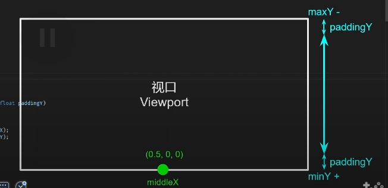

```c#
using Unity.VisualScripting;
using UnityEngine;
using UnityEngine.UIElements;

// 这个类用于获取视野中的位置，并提供相关功能如限制玩家移动范围、随机生成敌人位置等
public class Viewport : Singleton<Viewport>
{
    // 定义限制窗口
    float minX;
    float maxX;
    float minY;
    float maxY;
    float middleX;

    // 初始化限定世界位置
    void Start()
    {
        Camera mainCamera = Camera.main;

        // 获取视口左下角和右上角的世界坐标
        Vector2 bottomLeft = mainCamera.ViewportToWorldPoint(new Vector3(0f, 0f));
        Vector2 topRight = mainCamera.ViewportToWorldPoint(new Vector3(1f, 1f));

        // 获取视口中点的 x 坐标
        middleX = mainCamera.ViewportToWorldPoint(new Vector3(0.5f, 0f, 0f)).x;

        minX = bottomLeft.x;
        minY = bottomLeft.y;
        maxX = topRight.x;
        maxY = topRight.y;
    }

    /// <summary>
    /// 限制玩家移动的范围
    /// </summary>
    /// <param name="playerPosition">玩家的当前位置</param>
    /// <param name="paddingX">X 轴的边距</param>
    /// <param name="paddingY">Y 轴的边距</param>
    /// <returns>限制在可移动范围内的位置</returns>
    public Vector3 PlayerMoveablePosition(Vector3 playerPosition, float paddingX, float paddingY)

    /// <summary>
    /// 随机生成敌人的出生位置，位于屏幕右侧之外
    /// </summary>
    /// <param name="paddingX">X 轴的边距</param>
    /// <param name="paddingY">Y 轴的边距</param>
    /// <returns>敌人出生的随机位置</returns>
    public Vector3 RandomEnemySpawnPosition(float paddingX, float paddingY)
    {
        Vector3 position = Vector3.zero;

        position.x = maxX + paddingX;
        position.y = Random.Range(minY + paddingY, maxY - paddingY);

        return position;
    }

    /// <summary>
    /// 在屏幕右半部分随机生成一个位置
    /// </summary>
    /// <param name="paddingX">X 轴的边距</param>
    /// <param name="paddingY">Y 轴的边距</param>
    /// <returns>屏幕右半部分的随机位置</returns>
    public Vector3 RandomRightHalfPosition(float paddingX, float paddingY)
    {
        Vector3 position = Vector3.zero;

        position.x = Random.Range(middleX, maxX - paddingX);
        position.y = Random.Range(minY + paddingY, maxY - paddingY);

        return position;
    }

    /// <summary>
    /// 随机生成一个敌人移动的目标位置，位于屏幕范围内
    /// </summary>
    /// <param name="paddingX">X 轴的边距</param>
    /// <param name="paddingY">Y 轴的边距</param>
    /// <returns>敌人移动的随机目标位置</returns>
    public Vector3 RandomEnemyMovePosition(float paddingX, float paddingY)
    {
        Vector3 position = Vector3.zero;

        position.x = Random.Range(minX + paddingX, maxX - paddingX);
        position.y = Random.Range(minY + paddingY, maxY - paddingY);

        return position;
    }
}
```

接下来在拉取的预制体中，加入一个脚本用作控制敌人预制体的移动逻辑。逻辑类似于在一个画布随机生成两个点，通过为这两个点画一个线段来进行路径的移动。同时在上下移动的时候，会调整他们的轴进行偏移。还有随机射击功能，但是需要搭配子弹的预制体进行操作

```c#
using System.Collections;
using System.Collections.Generic;
using UnityEngine;

// 敌人控制脚本，控制敌人的随机移动和随机射击
// 注意：需要确保视口脚本(Viewport)优先运行，以获取其实例(Instance)和随机生成的坐标，否则此脚本无法正常工作
public class EnemyController : MonoBehaviour
{
    [Header("---- Move ----")]
    [SerializeField] private float paddingX; // X 轴的边距
    [SerializeField] private float paddingY; // Y 轴的边距
    [SerializeField] private float moveSpeed = 2f; // 敌人移动速度
    [SerializeField] private float moveRotationAngle = 25f; // 移动时的旋转角度

    [Header("---- FIRE ----")]
    [SerializeField] GameObject[] projectiles; // 子弹的预制体数组
    [SerializeField] Transform muzzle; // 子弹发射的起始位置（枪口）
    [SerializeField] float minFireInterval; // 最小射击间隔时间
    [SerializeField] float maxFireInterval; // 最大射击间隔时间

    // 当敌人启用时，开始移动和射击协程
    void OnEnable()
    {
        StartCoroutine(nameof(RandomlyMovingCoroutine)); // 启动随机移动协程
        StartCoroutine(nameof(RandomlyFireCoroutine)); // 启动随机射击协程
    }

    // 当敌人禁用时，停止所有协程
    void OnDisable()
    {
        StopAllCoroutines();
    }

    // 协程：随机移动逻辑
    IEnumerator RandomlyMovingCoroutine()
    {
        // 初始化敌人位置为视口外的随机生成位置
        transform.position = Viewport.Instance.RandomEnemySpawnPosition(paddingX, paddingY);
        
        // 设置目标位置为视口右半部分的随机位置
        Vector3 targetPosition = Viewport.Instance.RandomRightHalfPosition(paddingX, paddingY);

        while (gameObject.activeSelf)
        {
            // 如果当前未到达目标位置，则向目标位置移动
            if (Vector3.Distance(transform.position, targetPosition) > Mathf.Epsilon)
            {
                transform.position = Vector3.MoveTowards(transform.position, targetPosition, moveSpeed * Time.deltaTime);
                // 移动过程中根据 Y 轴方向旋转敌人
                transform.rotation = Quaternion.AngleAxis((targetPosition - transform.position).normalized.y * moveRotationAngle, Vector3.right);
            }
            else
            {
                // 当到达目标位置后，生成新的目标位置
                targetPosition = Viewport.Instance.RandomRightHalfPosition(paddingX, paddingY);
            }
            yield return null; // 等待下一帧
        }
    }

    // 协程：随机射击逻辑
    IEnumerator RandomlyFireCoroutine()
    {
        // 当敌人处于活动状态时持续运行
        while (gameObject.activeSelf)
        {
            // 随机等待一段时间
            yield return new WaitForSeconds(Random.Range(minFireInterval, maxFireInterval));

            // 发射所有配置的子弹
            foreach (var projectile in projectiles)
            {
                PoolManager.Release(projectile, muzzle.position); // 从对象池中释放子弹
            }
        }
    }
}
```

对于敌人子弹的预制体，我们在unity中创建一个3d正方体，将之捏成一个子弹的形状。通过添加一个默认材质。这个随意，之后将这个材质拖拽到预制体上就可以显示材质的特性了。

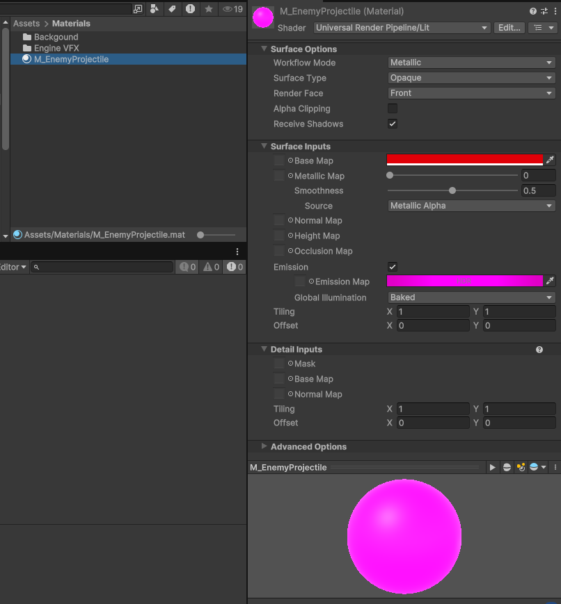

为敌人子弹预制体搭载两个脚本，其中一个脚本是我们之前写过的，子弹的自动摧毁逻辑

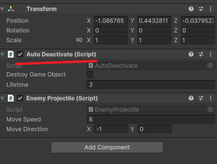

编辑第二个脚本，通过继承projectile类，获得子弹移动的效果。由于子弹基类中，其射击方向是根据玩家的设计方向也就是向右(正值)，我们需要对他们继承完成的类进行重写

```c#
using UnityEngine;
using UnityEngine.EventSystems;

// 敌人子弹类，继承自基类 Projectile
public class EnemyProjectile : Projectile
{
    // 子弹的尾迹效果组件
    TrailRenderer trail;

    // 初始化方法
    void Awake()
    {
        // 获取子弹尾迹效果的组件
        trail = GetComponentInChildren<TrailRenderer>();

        // 如果移动方向不是默认的向左方向，则调整子弹的旋转方向
        if (moveDirection != Vector2.left)
        {
            // 根据移动方向旋转子弹，使其朝向指定方向
            transform.rotation = Quaternion.FromToRotation(Vector2.left, moveDirection);
        }
    }
}
```

```c#
using UnityEngine;

// 玩家子弹类，继承自基类 Projectile
public class PlayerProjectile : Projectile
{
    // 子弹的尾迹效果组件
    TrailRenderer trail;

    // 初始化方法
    void Awake()
    {
        // 获取子弹尾迹效果的组件
        trail = GetComponentInChildren<TrailRenderer>();

        // 如果移动方向不是默认的向右方向，则调整子弹的旋转方向
        if (moveDirection != Vector2.right)
        {
            // 根据移动方向旋转子弹，使其朝向指定方向
            transform.rotation = Quaternion.FromToRotation(Vector2.right, moveDirection);
        }
    }

    // 当子弹被禁用时调用
    void OnDisable()
    {
        // 清除子弹的尾迹效果，避免尾迹残留
        trail.Clear();
    }
}
```

对敌人生成的子弹我们需要采用之前写好的对象池进行管理，在PoolManager中创建一个对象池数组enemyProjectilePools，记得初始化

```c#
using System.Collections.Generic;
using UnityEngine;

// 对象池管理器，用于管理和复用游戏中的对象
public class PoolManager : MonoBehaviour
{
    // 玩家子弹对象池数组
    [SerializeField] Pool[] playerProjectilePools;
    // 敌人子弹对象池数组
    [SerializeField] Pool[] enemyProjectilePools;

    // 静态字典，用于快速查找每个预制体对应的对象池
    static Dictionary<GameObject, Pool> dictionary;

    void Start()
    {
        // 初始化字典 - 通过字典分类不同的对象池
        dictionary = new Dictionary<GameObject, Pool>();
        // 在游戏开始时初始化所有对象池
        Initialize(playerProjectilePools);
        Initialize(enemyProjectilePools);
    }

    void OnDestroy()
    {
        // 检查玩家子弹对象池的大小是否超过初始值
        CheckPoolSize(playerProjectilePools);
        // 检查敌人子弹对象池的大小是否超过初始值
        CheckPoolSize(enemyProjectilePools);
    }

    // 检查对象池大小是否超过初始大小的方法
    void CheckPoolSize(Pool[] pools)
    {
        foreach (var pool in pools)
        {
            // 如果运行时的对象池大小超过初始设置，输出警告信息
            if (pool.RuntimeSize > pool.Size)
            {
                Debug.LogWarning(string.Format(
                    "Pool: {0} has a runtime size {1} bigger than its initial size {2}!",
                    pool.Prefab.name,
                    pool.RuntimeSize,
                    pool.Size));
            }
        }
    }

    /// <summary>
    /// 初始化对象池
    /// </summary>
    /// <param name="pools">需要初始化的对象池数组</param>
    void Initialize(Pool[] pools)
    {
        // 遍历每一个对象池
        foreach (var pool in pools)
        {
#if UNITY_EDITOR
            // 检测是否有重复的预制体，避免一个预制体被多个对象池管理
            if (dictionary.ContainsKey(pool.Prefab))
            {
                Debug.LogError("Same prefab in multiple pools! Prefab: " + pool.Prefab.name);
                continue; // 跳过重复的预制体
            }
#endif

            // 将预制体和对象池的对应关系添加到字典中
            dictionary.Add(pool.Prefab, pool);

            // 创建一个新的空物体作为对象池的父物体，便于管理对象池中的实例
            Transform poolParent = new GameObject("Pool: " + pool.Prefab.name).transform;
            // 将新创建的父物体作为当前 PoolManager 的子物体
            poolParent.parent = transform;
            // 调用对象池的初始化方法，传入父物体作为容器
            pool.Initialize(poolParent);
        }
    }

    /// <summary>
    /// 从对象池中获取对象（仅指定位置）
    /// </summary>
    /// <param name="prefab">需要生成的预制体</param>
    /// <param name="position">生成位置</param>
    /// <returns>从对象池获取的对象</returns>
    public static GameObject Release(GameObject prefab, Vector3 position)
    {
#if UNITY_EDITOR
        // 检测是否存在对应的对象池，防止错误调用
        if (!dictionary.ContainsKey(prefab))
        {
            Debug.LogError("Pool Manager could NOT find prefab: " + prefab.name);
            return null;
        }
#endif
        // 调用对应对象池的方法，从池中获取对象
        return dictionary[prefab].PreparedObject(position);
    }

    /// <summary>
    /// 从对象池中获取对象（指定位置和旋转）
    /// </summary>
    /// <param name="prefab">需要生成的预制体</param>
    /// <param name="position">生成位置</param>
    /// <param name="rotation">生成时的旋转</param>
    /// <returns>从对象池获取的对象</returns>
    public static GameObject Release(GameObject prefab, Vector3 position, Quaternion rotation)
    {
#if UNITY_EDITOR
        // 检测是否存在对应的对象池，防止错误调用
        if (!dictionary.ContainsKey(prefab))
        {
            Debug.LogError("Pool Manager could NOT find prefab: " + prefab.name);
            return null;
        }
#endif
        // 调用对应对象池的方法，从池中获取对象
        return dictionary[prefab].PreparedObject(position, rotation);
    }

    /// <summary>
    /// 从对象池中获取对象（指定位置、旋转和缩放）
    /// </summary>
    /// <param name="prefab">需要生成的预制体</param>
    /// <param name="position">生成位置</param>
    /// <param name="rotation">生成时的旋转</param>
    /// <param name="localScale">生成时的缩放</param>
    /// <returns>从对象池获取的对象</returns>
    public static GameObject Release(GameObject prefab, Vector3 position, Quaternion rotation, Vector3 localScale)
    {
#if UNITY_EDITOR
        // 检测是否存在对应的对象池，防止错误调用
        if (!dictionary.ContainsKey(prefab))
        {
            Debug.LogError("Pool Manager could NOT find prefab: " + prefab.name);
            return null;
        }
#endif
        // 调用对应对象池的方法，从池中获取对象
        return dictionary[prefab].PreparedObject(position, rotation, localScale);
    }
}
```

将敌人的预制体，调整枪口位置和搭载子弹预制体。


通过结合这几个脚本，我们就能简单实现发射子弹射击的功能了


### 项目流程十 - 构造生命值系统

通过构建一个角色类，将一些生命值系统需要的变量或者属性在这个类中声明出来。如果遇到有需要生命值系统的物体，直接继承这个类来调用对应的协程和属性即可。

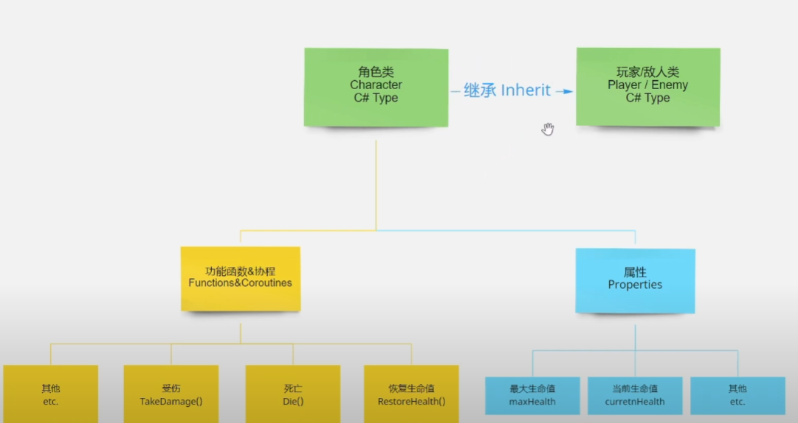

```c#
using System.Collections;
using UnityEngine;

public class Character : MonoBehaviour
{
    // 通过序列化字段，可以在Unity编辑器中直接设置死亡特效的GameObject
    [SerializeField] GameObject deathVFX;
    // 用于在Unity编辑器中对与健康相关的属性进行分组和标记
    [Header("--- HEALTH ---")]
    // 通过序列化字段，可以在Unity编辑器中直接设置最大生命值
    [SerializeField] protected float maxHealth;

    // 保护成员变量，用于存储当前生命值
    protected float health;
    
    // 使用Obsolete特性标记该方法已过时，但仍保留实现
    // 当角色启用时，将其生命值重置为最大生命值
    [System.Obsolete]
    protected virtual void OnEnable()
    {
        health = maxHealth;
    }

    // 公共虚方法，用于角色受到伤害
    // damage参数表示受到的伤害值
    public virtual void TakeDamage(float damage)
    {
        // 减少生命值
        health -= damage;

        // 如果生命值小于等于0，则角色死亡
        if(health <= 0f)
        {
            Die();
        }
    }

    // 公共虚方法，用于角色死亡
    public virtual void Die()
    {
        // 将生命值设置为0
        health = 0f;
        // 从对象池中释放死亡特效，并在角色位置播放
        PoolManager.Release(deathVFX, transform.position);
        // 将角色的GameObject设置为非激活状态
        gameObject.SetActive(false);
    }

    // 公共虚方法，用于恢复角色生命值
    // value参数表示恢复的生命值
    public virtual void RestoreHealth(float value)
    {
        // 如果当前生命值已满，则直接返回
        if(health == maxHealth) return;

        // 使用Mathf.Clamp方法将生命值限制在0到最大生命值之间
        health = Mathf.Clamp(health + value, 0f, maxHealth);
    }
     
    // 保护协程方法，用于角色生命值恢复
    // waitTime参数表示每次恢复生命值的等待时间
    // percent参数表示每次恢复生命值的百分比
    protected IEnumerator HealthRegenerateCoroutine(WaitForSeconds waitTime, float percent)
    {
        // 当生命值小于最大生命值时，循环执行
        while(health < maxHealth)
        {
            // 等待指定时间
            yield return waitTime;

            // 恢复生命值
            RestoreHealth(maxHealth * percent);
        }
    }

    // 保护协程方法，用于角色持续受到伤害
    // waitTime参数表示每次受到伤害的等待时间
    // percent参数表示每次受到伤害的百分比
    protected IEnumerator DamageOverTimeCoroutine(WaitForSeconds waitTime, float percent)
    {
        // 当生命值大于0时，循环执行
        while(health > 0f)
        {
            // 等待指定时间
            yield return waitTime;

            // 受到伤害
            TakeDamage(maxHealth * percent);
        }
    }
}
```

我们需要让玩家和敌人继承这个类，并且重写内部的虚方法。这里简单的写了一个受伤自动回复的功能。具体测试环节这里省去，

```c#
using System.Collections;
using UnityEngine;
using UnityEngine.InputSystem;
using UnityEngine.Scripting.APIUpdating;

[RequireComponent(typeof(Rigidbody2D))]
public class Player : Character
{
	// 生命值变量
    [SerializeField] bool regenrateHealth = true;
    [SerializeField] float healthRegenerateTime;
    [SerializeField, Range(0f,1f)] float healthRegeneratePercent;
 	....
    // 防止多协程一起执行
    Coroutine healthRegenerateCoroutine;
    
    void Start()
    {
	    ....
   		// 初始化生命值变量
        waitHealthRegenerateTime = new WaitForSeconds(healthRegenerateTime); //生命值回复时间
		...
    }
    // 受伤自动回复
    public override void TakeDamage(float damage)
    {
        base.TakeDamage(damage);

        if (gameObject.activeSelf)
        {
            if (regenrateHealth)
            {
                if (healthRegenerateCoroutine != null)
                {
                    StopCoroutine(healthRegenerateCoroutine);
                }
                healthRegenerateCoroutine = StartCoroutine(HealthRegenerateCoroutine(waitHealthRegenerateTime, healthRegeneratePercent));
            }
        }
    }
    
}
```

接下来对子弹逻辑进行编辑，对敌人新增加多几个子弹类型。与前面造子弹类似，直接通过创建`3d`立方体的方式，拉入之前创建好的材质即可。前面三个是不同方向的发射子弹，这里搭载完成之后就是一个散弹的方式

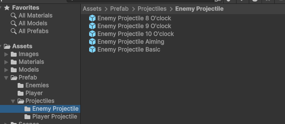

创建一个特殊的子弹，这个子弹会根据当前玩家的位置，跟踪玩家发射。创建完成这个类之后搞一个脚本，`EnemyProjectile_Aiming`

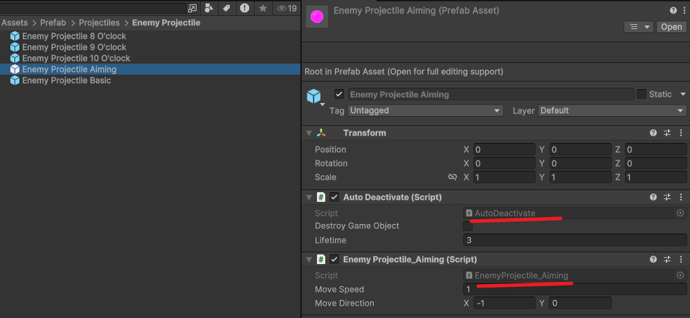

```c#
using System.Collections;
using System.Collections.Generic;
using UnityEngine;

public class EnemyProjectile_Aiming : Projectile
{
    // 在Awake方法中，查找带有"Player"标签的GameObject并赋值给target变量
    // 该方法在脚本实例被加载时调用一次
    void Awake()
    {
        target = GameObject.FindGameObjectWithTag("Player");
    }

    // 重写OnEnable方法，当脚本启用时调用
    // 该方法在脚本组件被启用时调用，例如当GameObject被激活时
    protected override void OnEnable()
    {
        // 启动MoveDirectionCoroutine协程
        StartCoroutine(nameof(MoveDirectionCoroutine));
        // 调用基类Projectile的OnEnable方法
        base.OnEnable();
    }

    // MoveDirectionCoroutine协程，用于计算敌方弹丸的移动方向
    IEnumerator MoveDirectionCoroutine()
    {
        // 等待一个帧，让协程在下一帧开始执行
        yield return null;

        // 如果目标（玩家）处于激活状态
        if (target.activeSelf)
        {
            // 计算从弹丸当前位置到目标位置的方向，并将其标准化
            // 用于确定弹丸的移动方向
            moveDirection = (target.transform.position - transform.position).normalized;
        }
    }
}
```

创建完成之后，在子弹对象池中添加上面创建的新子弹类型组件，并且在不同的敌人上应用这些子弹

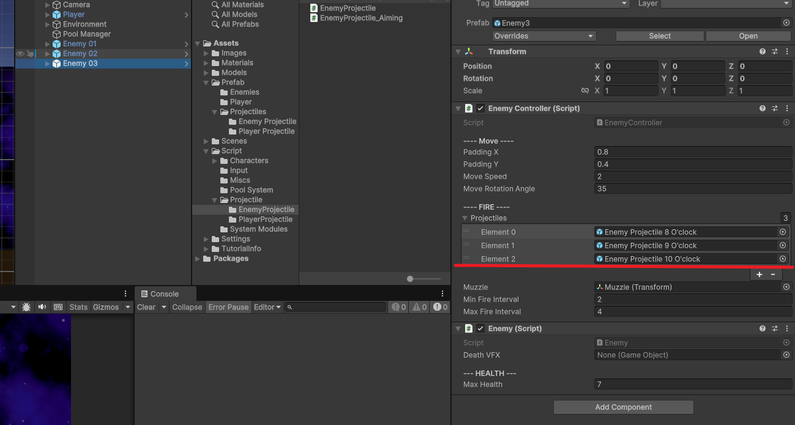

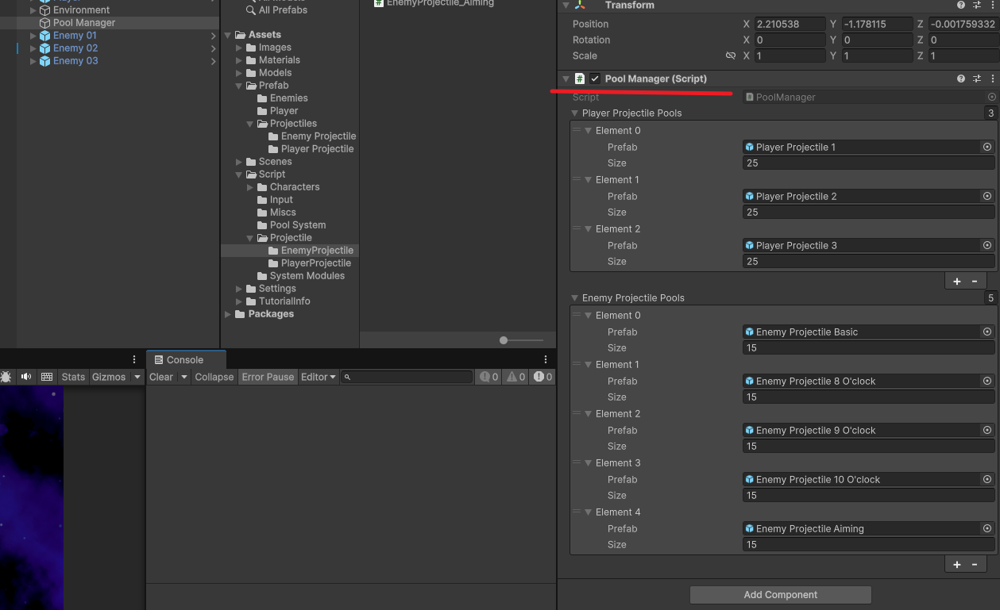

这样就基本完成了敌人类型，如果需要制作不同的子弹区分不同的敌人类，那么依据上面的方法即可做到。

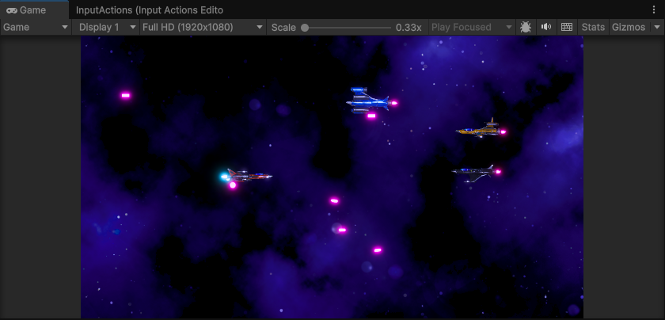
