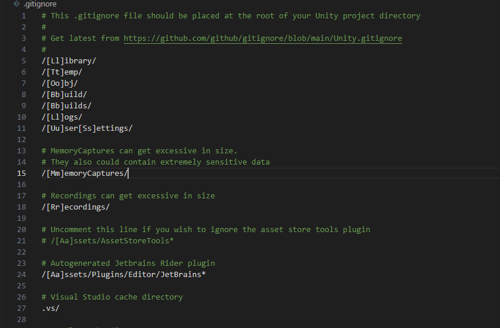

## 提交UNITY项目到GITHUB

### 部署流程1 - UNITY个性化设置

在Version control 中将模式设置为 Meta，`.meta` 文件确保了资源在项目中的唯一性和一致性


在edit中，将模式设置为Force Text。让 Unity 资源以文本格式（YAML）保存


### 部署流程2-gitignore文件配置

在需要上传到git的文件中，打开cmd配置git init


需要上传的文件夹有两个，Assets和projectSettings。其他文件夹都是unity自带的


其他需要忽略的文件，我们将之添加到gitignore中。由于在编写文件的时候不够明显，转而使用vscode来编辑这个文件。这里使用git官方中的[屏蔽方案](https://github.com/github/gitignore/blob/main/Unity.gitignore)



```gitignore
# This .gitignore file should be placed at the root of your Unity project directory
#
# Get latest from https://github.com/github/gitignore/blob/main/Unity.gitignore
#
/[Ll]ibrary/
/[Tt]emp/
/[Oo]bj/
/[Bb]uild/
/[Bb]uilds/
/[Ll]ogs/
/[Uu]ser[Ss]ettings/

# MemoryCaptures can get excessive in size.
# They also could contain extremely sensitive data
/[Mm]emoryCaptures/

# Recordings can get excessive in size
/[Rr]ecordings/

# Uncomment this line if you wish to ignore the asset store tools plugin
# /[Aa]ssets/AssetStoreTools*

# Autogenerated Jetbrains Rider plugin
/[Aa]ssets/Plugins/Editor/JetBrains*

# Visual Studio cache directory
.vs/

# Gradle cache directory
.gradle/

# Autogenerated VS/MD/Consulo solution and project files
ExportedObj/
.consulo/
*.csproj
*.unityproj
*.sln
*.suo
*.tmp
*.user
*.userprefs
*.pidb
*.booproj
*.svd
*.pdb
*.mdb
*.opendb
*.VC.db

# Unity3D generated meta files
*.pidb.meta
*.pdb.meta
*.mdb.meta

# Unity3D generated file on crash reports
sysinfo.txt

# Builds
*.apk
*.aab
*.unitypackage
*.unitypackage.meta
*.app

# Crashlytics generated file
crashlytics-build.properties

# Packed Addressables
/[Aa]ssets/[Aa]ddressable[Aa]ssets[Dd]ata/*/*.bin*

# Temporary auto-generated Android Assets
/[Aa]ssets/[Ss]treamingAssets/aa.meta
/[Aa]ssets/[Ss]treamingAssets/aa/*
```

配置完成之后再vscode中输入，gitstate查看当前项目状态。下面显示我们没有创建仓库


### 部署流程3-在GITHUB中创建仓库并关联

在GITHUB创建完成仓库之后，根据提供的链接我们在vscode中输入如下代码

```
git remote add origin https://github.com/yourname/your-repo.git
```


当然需要执行前面的git配置系统，之后使用git add git commit git push 三连即可上传到 GITHUB仓库之中


