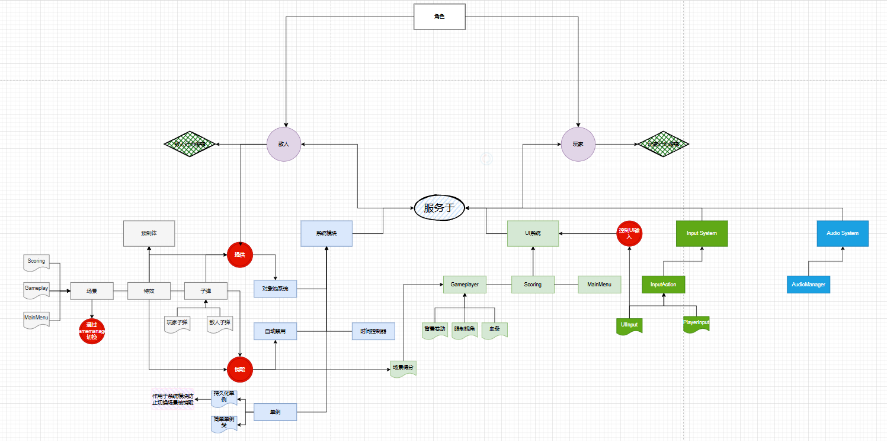

# 太空射击项目

## 项目总结一 游戏整体框架

做这个游戏项目之前没想那么多，认为这就是一个简单的游戏项目。但是实践之后发现远远超出了我的能力，在这个过程中也学习到了很多模块化的思想。如果将教程中的内容一一照搬到博客中，那么工作量是巨大的。这里也很感谢教程的[作者](https://space.bilibili.com/27164588)，是他做出来这个教程并且制作了免费的教学。

这个游戏项目的类型是**[清版射击游戏(STG)](https://zh.wikipedia.org/wiki/%E6%B8%85%E7%89%88%E5%B0%84%E5%87%BB%E6%B8%B8%E6%88%8F)**，游戏玩法就是控制`Player`发射子弹消灭敌人。为了完成这个目的，作者完成了几个方面。这里列一个表格作为教程时间线的简单整理，一步一步来先整理上半部分。

| 1. 地图无限卷轴移动           | 通过控制地图材质的`offset`实现                               |
| :---------------------------- | ------------------------------------------------------------ |
| **2. 玩家输入系统**           | 通过`input system`实现                                       |
| 3. 移动和视觉位置限制         | 通过玩家机体的`pivot`限制玩家移动                            |
| 4. 玩家加速                   | 通过贝塞尔曲线对玩家机体速度控制，使其拥有惯性               |
| 5. 玩家射击及子弹的制作       | 通过引入对象池对产生的预制体进行控制生成                     |
| 6. 对象池                     | 通过队列控制所有生成的预制体的`Active`，整个游戏项目的核心   |
| 7. 敌人的生成和限制敌人的移动 | 通过对象池对敌人的生成进行管理                               |
| 8. 生命值系统及其UI显示       | 通过生命值系统脚本和UI组件对生命值增加和消失进行控制         |
| 9.触发器与子弹碰撞            | 通过添加触发器来实现子弹和机体的交互，以及之后判断碰撞后降低血量 |
| 10. 角色大血条的实现          | 通过继承生命值系统来构造生命值增加和减少的效果               |

由于教程中使用了非常多的设计模式和编程思想，导致代码量十分巨大。因此想要完全搞懂这个项目中的内容，必须要绘制类图。这里是我依据这个项目的代码逻辑设计简单的绘制的流程图，是整个游戏制作的简易框架

- 通过一个游戏运行开始到结束为一个游戏周期
- 通过一个物体创建出来的目的来为其分类
- 通过不同类的继承关系来为其分类

其中的行为逻辑还未给出
