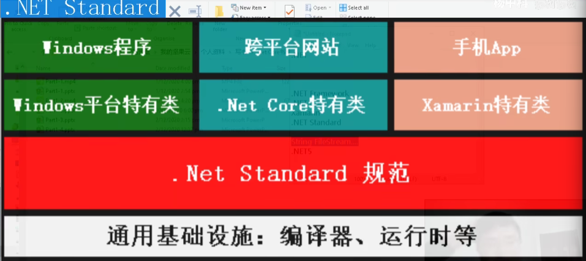
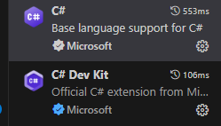

# .NET知识汇总

## NET Standard

作为一种跨平台语言，其由.NET Standard约束，不同标准之间可能无法直接引用代码，需要构建一个中间层。



下列程序通过查询不同程序的DLL文件，来查看其中使用了何种标准。

> DLL文件是：.Dynamic Link Library（动态链接库）文件的缩写，它是一种共享库文件，包含了程序所需的代码和数据。与静态链接库不同，动态链接库可以在程序运行时动态加载，使得程序的内存占用更小。
>
> 一般而言，只有类库才有DLL文件，DLL 文件主要是类库的产物，控制台程序通常没有可供引用的 DLL。

```c#
// 应用窗口程序
namespace _Main
{
    internal class Program
    {
        static void Main(string[] args)
        {
            Console.WriteLine("--Class_1--");
            TestClass3.TestMethod();

            Console.WriteLine("--当前文件--");
            Console.WriteLine(typeof(FileStream).Assembly.Location);

        }
    }
}
// 类库程序
public class TestClass3 {
    public static void TestMethod() 
    { 
        Console.WriteLine(typeof(FileStream).Assembly.Location); Console.WriteLine(typeof(TestClass3).Assembly.Location); 
    } 
}
```


标准高的类库可以引用低版本的类库，反之则不行。同时随着标准的变高，NETCore和NETFramework也会随着需求变高，具体的标准如下，在开源项目中最好使用低版本的标准。


## 配置环境

> [配置环境其它图文教程](https://www.bilibili.com/opus/692815432152776724)

可以使用Visual Studio，但是无法跨平台使用。这里使用vscode配置c#文件。在一个简单的c#程序中，会自然生成几个文件夹。当然，在创建程序时不会有文件夹出现。

```json
MyApp/
├── MyApp.csproj        ← 项目文件
├── Program.cs          ← 主程序（顶级语句）
```

编译之后，会生成如下的文件结构：

```json
MyApp/
├── bin/                ← 编译输出（包含 exe 或 dll）
│   └── Debug/
│       └── net8.0/     ← 按目标框架分文件夹
│           ├── MyApp.dll
│           ├── MyApp.exe
│           └── ...
└── obj/                ← 中间构建文件（编译缓存）
    └── Debug/
        └── net8.0/
            ├── MyApp.GeneratedMSBuildEditorConfig.editorconfig
            ├── MyApp.AssemblyInfo.cs
            └── ...
```

- `obj/` 文件夹 —— 中间构建文件

  存放**编译的中间产物与构建缓存**，帮助加快下一次编译速度。

- `bin/` 文件夹 —— 编译输出目录

  存放**编译完成后真正可执行的文件**

- `publish/` 文件夹 —— 发布产物（仅发布时生成）

  当你执行：`dotnet publish -c Release`时，生成用于**部署或分发**的最终文件。

vscode只能执行轻量级任务，在插件中下载c#以及c# Dev Kit即可



只需要按住`Ctrl + Shift + N`即可唤出控制台，在控制台中选中需要创建的项目即可。
