# Ruby's Adventure

> 前面创建角色啥的就不细谈了，这里直接快进到画地图

## 使用Tile制作瓦片地图

创建一个Tilemap，作用是显示格子让我们铺设瓦片。

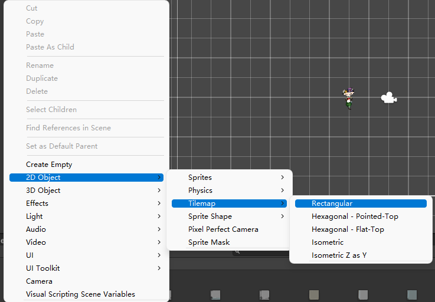

导入在官网下载Sprite。

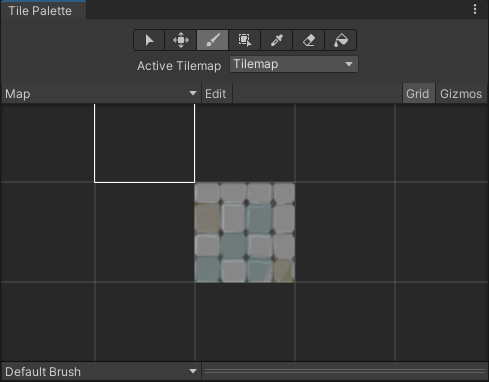

简单铺一下地板，这里直接用涂刷就行。

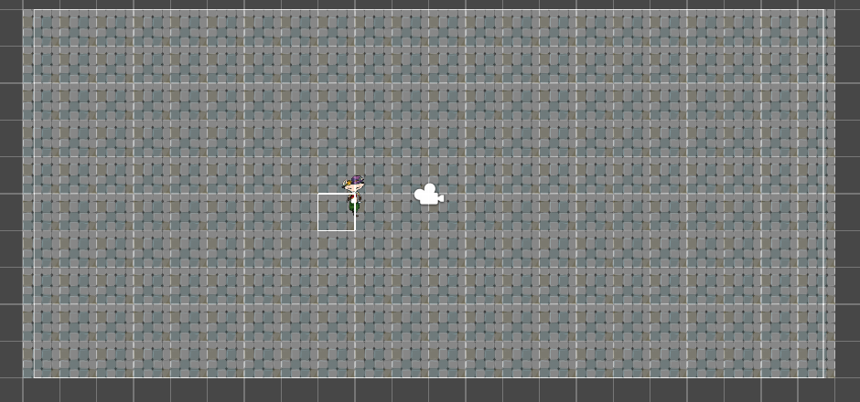

只有一个瓦片太单调了，这里把包中的瓦片切割一下。

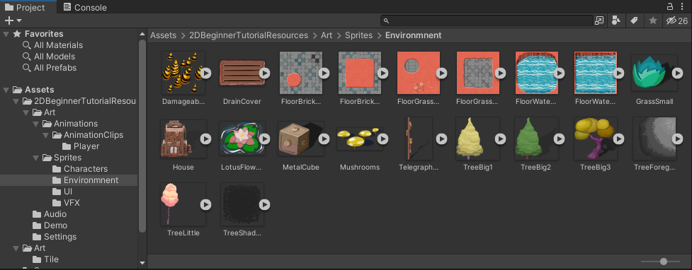

打包切割完成开始绘制地图：

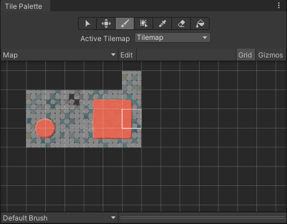

这里需要注意的是，Tile Palette 这里的瓦片会被不小心覆盖掉，上面的几个按键的功能如下：

- 1.选择，没啥好说的，选中的可以拖动
- 2.移动，移动对应的Tile
- 3.画笔，主要用的是这个，就用来绘制地图的
- 4.填充，可以填充多块地图
- 5.选择器，选择片段然后一起填充
- 6.橡皮擦
- 7.大块填充

下面就绘制一下地图：

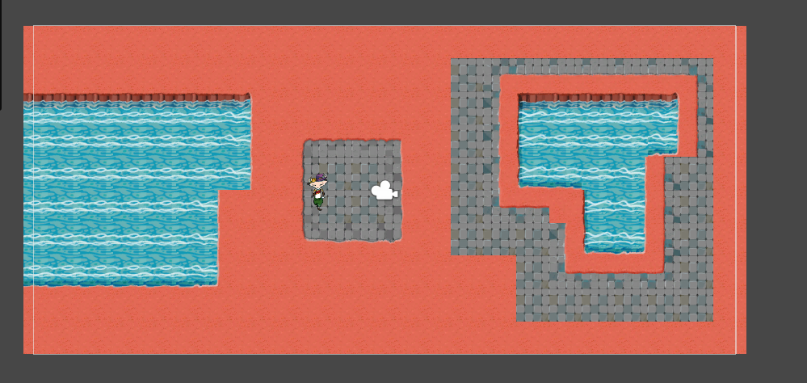

## 添加碰撞物体

添加物体和添加人物的操作是一样的，只不过我们需要注意一些问题。例如，角色和物体的层次是怎么样的，有什么碰撞效果。

我们需要指示 **Unity** 根据游戏对象的 y 坐标来绘制**游戏对象**（请记住，**y** 是垂直轴，**x** 是水平轴）。

在教程中我们需要这样：将Sort Axis 改为 X:0 Y:1 Z:0

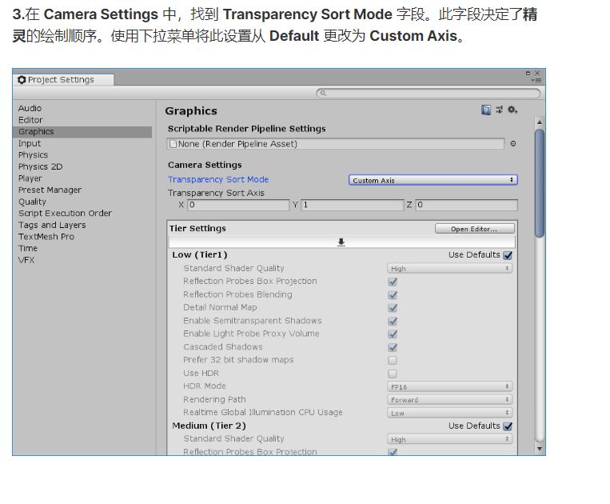

轴向量 x = 0, y = 1, z = 0 表示世界坐标系中的上方向（y轴正方向）。这意味着透明物体将根据它们在这个方向上的位置进行排序，确保在视图中更靠近上方的物体先绘制，而在下方的物体后绘制。

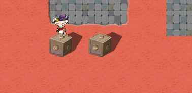

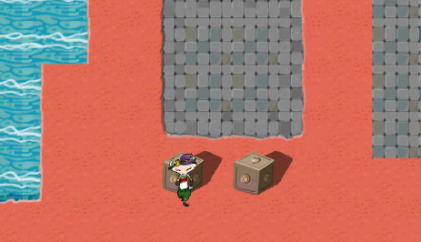

大概是和图这样的区别，可以简单理解为按照y轴的高低来决定渲染的物件的优先级。

打开角色的渲染器，将精灵的排序点选择为以精灵为中心。如下

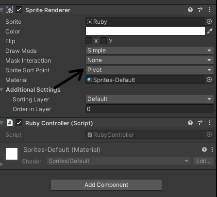

同样的需要定义箱子精灵的渲染中心，目的是让其在底部渲染，这样角色会被箱体遮挡住

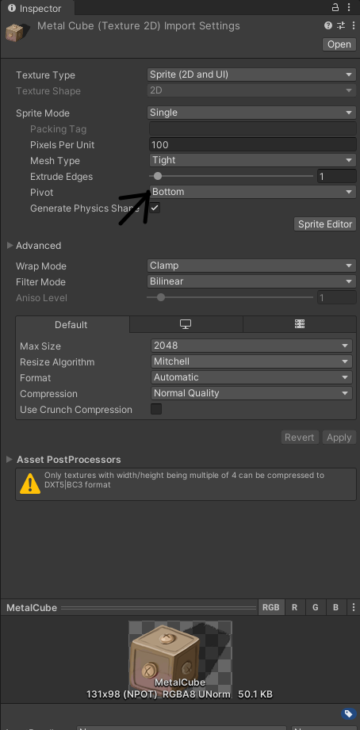

当然更改轴心的方式不止一种，可以在对应的编辑中修改，这里修改一下Ruby的轴心

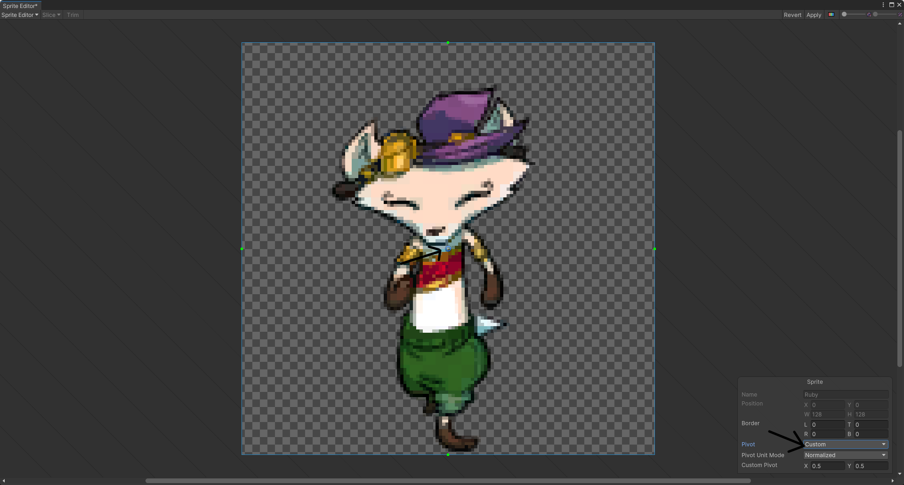

中间小蓝点可以物理修改，右下角也有对应的修改托盘。修改轴心可以配合上面渲染顺序，轴心如果覆盖了其他的物品的轴心，角色就会被渲染出来。
