# RPG

之前犯了一个错误，搞得清零了又得重新做，很烦。

## 导入素材

我们素材是在`unity 的 Assert store`中下载的，连接是下面两个：

- [素材1](https://assetstore.unity.com/packages/2d/environments/minifantasy-forgotten-plains-208907)

- [素材2](https://assetstore.unity.com/packages/2d/environments/minifantasy-dungeon-206693)

导入素材就`window - Package Manager` 下载我们对应的素材即可：

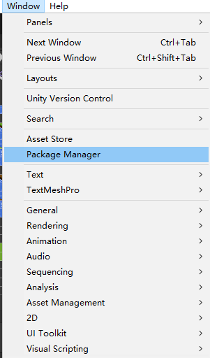

但是开了梯子就下载不了，我也不知道是什么原因：

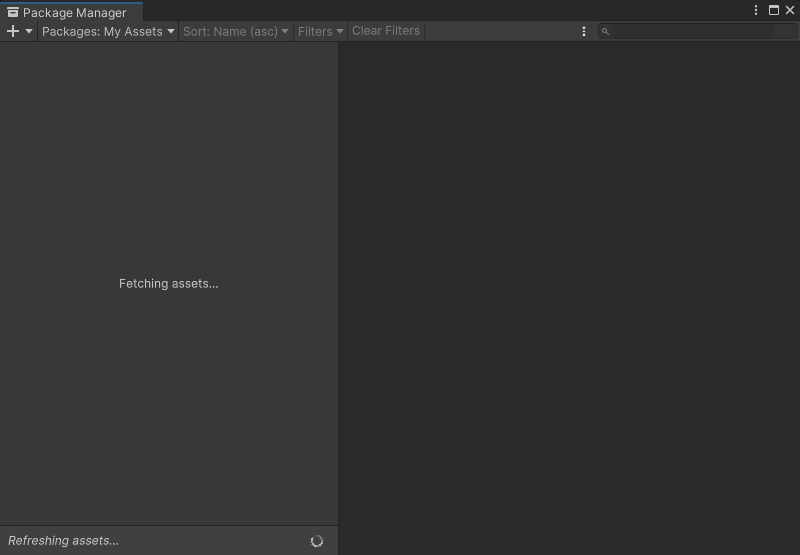

下载完成之后我们就得到了两个素菜包，打开素材包我们开始构造我们的地图

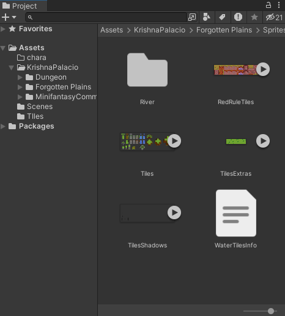

## 构造地图

在`Hierarchy`处右键创建`Tile Map` , 这里创建的组建是格子地图。

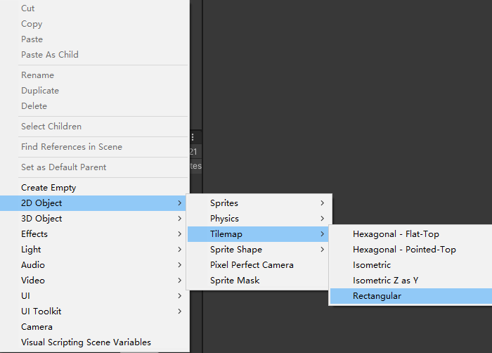

然后再颜料板导入我们的地图素材，但是得先切割一下：

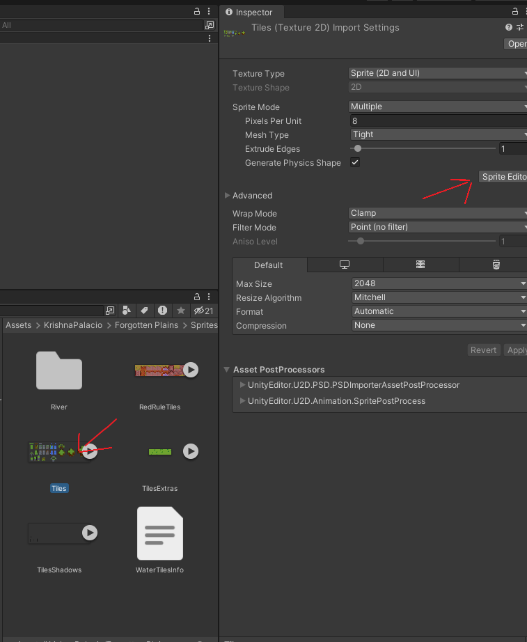

然后就跳转到切割的界面了，设置切割格子的尺寸为8*8

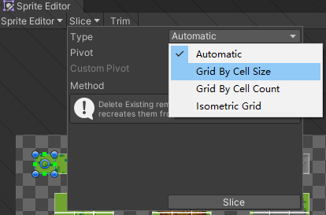

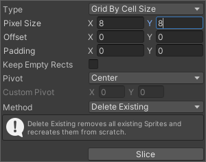

切割完就是这个样子的，这里有一个问题，我们切割过细好像回复不了，就变成三角形了。

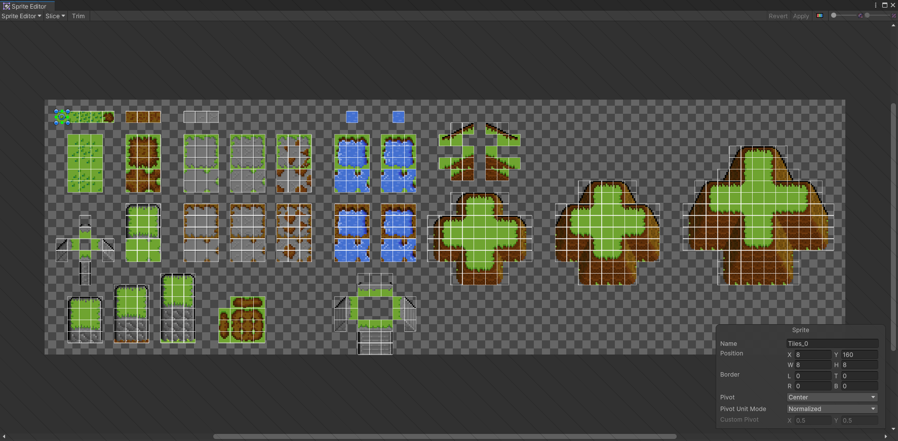

导入的Tile需要建一个文件夹来收集，在创建的Gird处新建`TilePalette`。然后拖入我们的素材就是这样了。

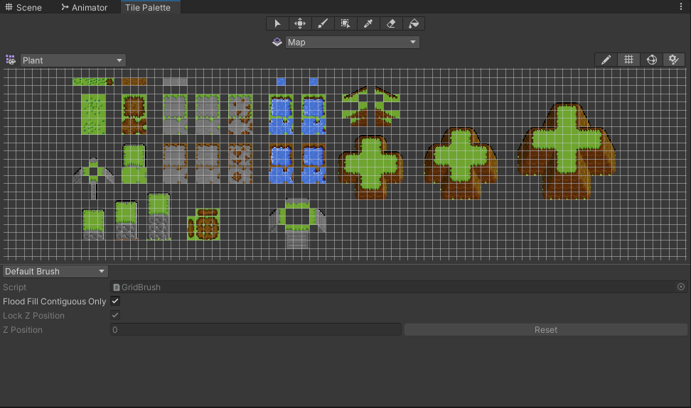

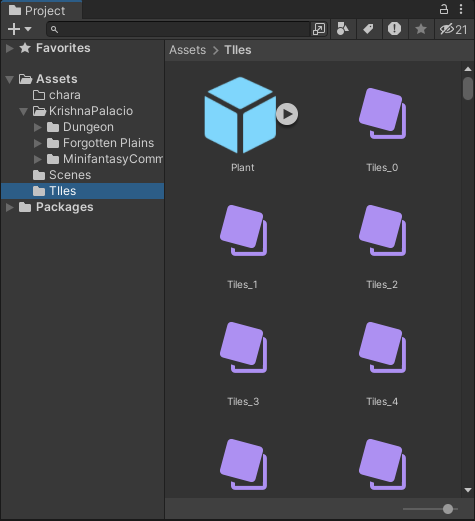

这里需要注意的是，素材处理最好让它无压缩，还有勾选到`Multipl`
		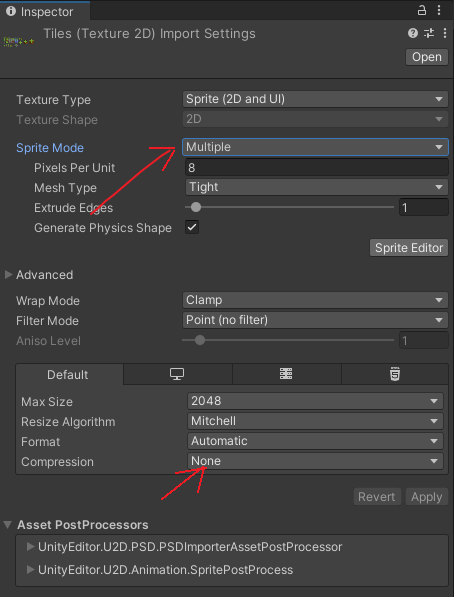

-----

开始绘制地图，直接将按调试版的素材就可以在左侧看到我们要画的图片了：

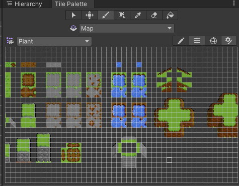

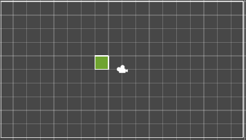

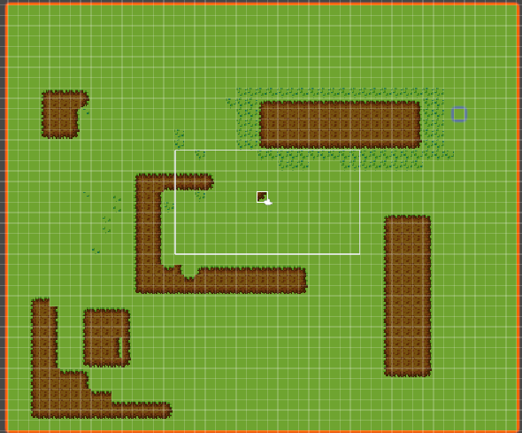

有点太单调了，导入一些树木和墙，步骤和上面一样。新建一个绘制板，这个新绘制板作为旧绘制板的子类，让它覆盖我们之前的地图，就有层次感。

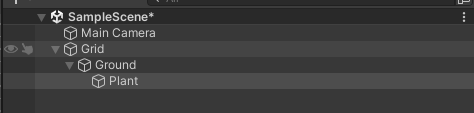

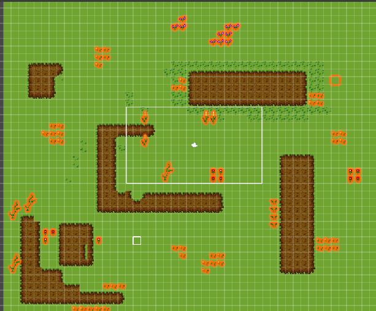

创建一个新的Tile,名字为`Obstacle`逻辑是让它和角色进行碰撞，类似于树那些。

创点树

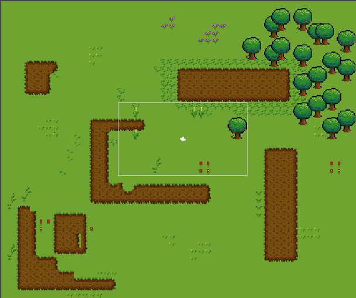

给创建树的`Tile`赋一个`Box Collider 2D`组件，使得它可以碰撞

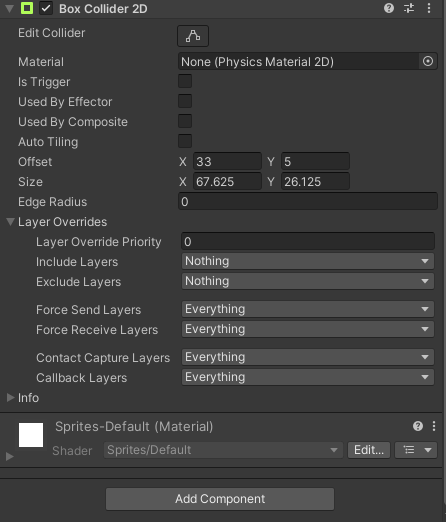

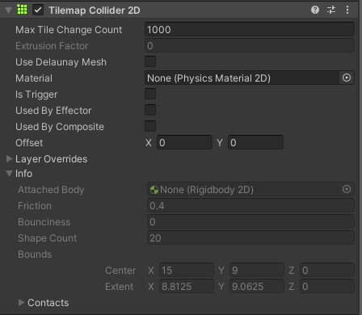
