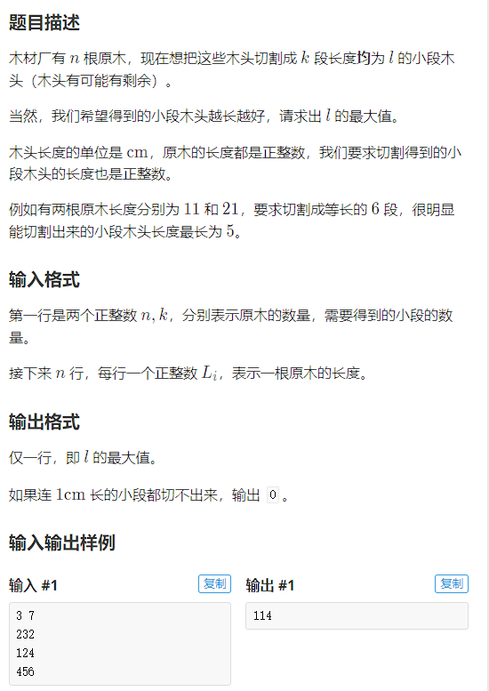
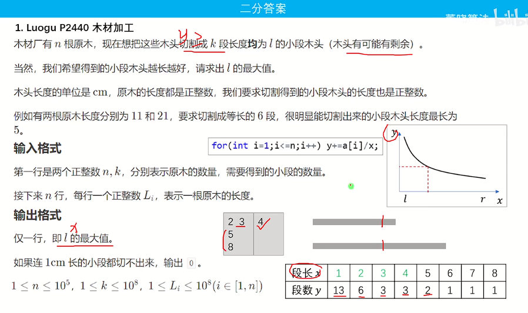
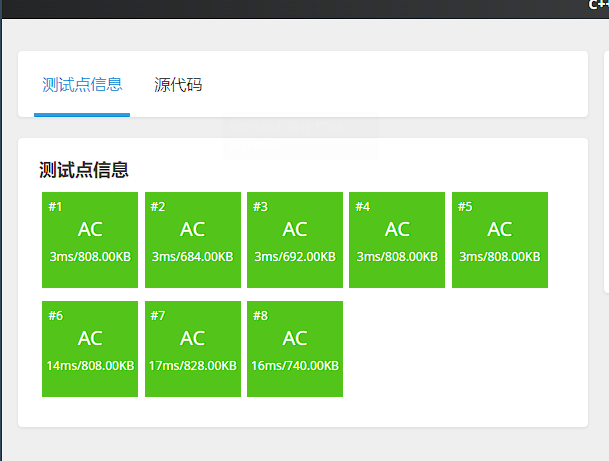
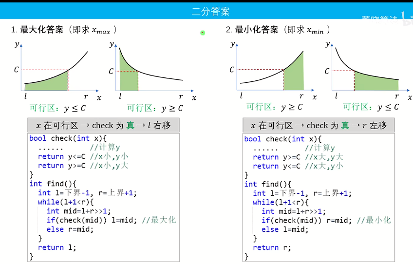

## 二分答案

在前面，我们使用了红蓝划分实现了二分查找（），下面使用一道[例题](https://www.luogu.com.cn/problem/P2440)详细介绍一下二分答案的做题流程：



也就是说，我们在满足段数`k`的情况下，让`l`尽可能大。思考，我们需要二分的是什么：

- 第一，确定`x,y`，`x`为二分目标，这个题目也就是`l的最大值`（二分答案嘛），`y`就为切的段数（不等式 `y>=k`）
- 第二，确定了`y`就知道了`check()函数`，也就是段数要大于`K`
- 第三，最终出现的结果一定是`l`（最大化），蓝区间逼近，可以想象用蓝笔从左涂到右，最后停下的地方就是最大的地方（因为这里有约束，如果没有约束蓝笔可以一直往右涂找最大嘛）



通过上述分析，我们建立如下程序：

```c++
#include<iostream>
using namespce std;

typedef long long LL;
const int N = 1e5+10;
int n,k,a[N];

bool check(int x){
    LL y = 0; //段数
    for(int i = 1;i<=n;i++) y+=a[i]/x; //y分割 - 这里的y可以看作段数
    return y>=k;
}

int find(){
    int l = 0,r = 1e8+10; //查找最大值，从左逼近，所以说右边随便设置超过限制的就行
    while(l+1<r){
        int mid = l+r>>1;
        if(check(mid)) l = mid; //最大化 - 看函数图像来理解
        else r = mid;
    }
    return l;
}

int main(){
    scnaf("%d%d",&n,&k);
    for(int i = 1;i<=n;i++) scanf("%d",&a[i]);
    printf("%d\n",find());
    return 0;
}
```

通过了，[视频讲解](https://www.bilibili.com/video/BV128411M7GT/?spm_id_from=333.999.0.0&vd_source=731595967596af37618c926a191e7811)



## 模板分析



**技巧：**

- 第一，分析二分答案确定`x`
- 第二，确定函数是增函数还是减函数，然后确定求的答案是最大化还是最小化
- 第三，根据第一第二构造我们的`check()`函数
