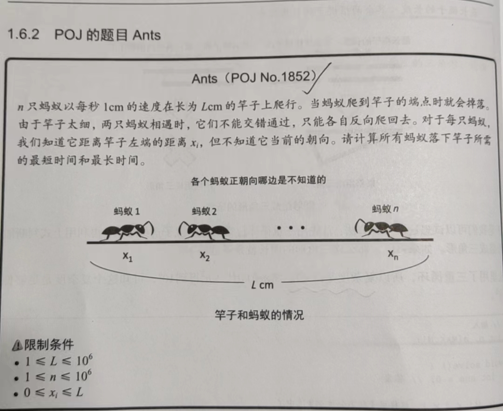

## 简单题

### 简单模拟

#### 三角形

给你n根棍子，要求让你组合成一个周长最大的三角形

```c++
#include<iostream>
using namespace std;

const int max_A = 1e5+10;
int n,a[max_A];

void solve()
{
	//答案 
	int ans = 0;

	for(int i = 0;i<n;i++){
		for(int j = i+1;j<n;j++){
			for(int k = j+1;k<n;k++){
				//周长 
				int len = a[i]+a[j]+a[k];
				//最长的边 
				int ma = max(a[i],max(a[j],a[k]));
				//可以组成三角形的规则 
				int rest = len-ma;				
				//所有子三角形的周长 
				if(ma<rest){
					ans = max(ans,len);
				}
			}			
		}		
	}		
	//输出结果 
	printf("%d\n",ans);		
	
 } 


int main()
{
	cin>>n;
	for(int i = 0;i<n;i++) cin>>a[i];
	solve();
	return 0; 
	
}
```

> 原理就是：枚举三条边所能构造的三角形，然后比较找到周长最大的那个即可。

#### Ants



```c++
#include<iostream>
using namespace std;

int l,n;
const int MAX_A = 1e5+10;
int x[MAX_A]; 

//每个蚂蚁都可以看做是同一个体
//两个碰完头 - 相当于穿过即可 

void solve()
{
	int minT = 0;
	for(int i = 0;i<n;i++){
		//移动到端点的最短距离 
		minT = max(minT,min(x[i],l-x[i]));		
	}
	
	//最长时间
	int maxT = 0;
	for(int i = 0;i<n;i++){
		maxT = max(maxT,max(x[i],l-x[i]));
	} 
	
	printf("%d %d\n",minT,maxT);
}


int main()
{
	
	cin>>l>>n;
	for(int i = 0;i<n;i++) cin>>x[i];
	
	solve();
	return 0;
	
	
	
 } 
```

## 中等题

## 困难题

